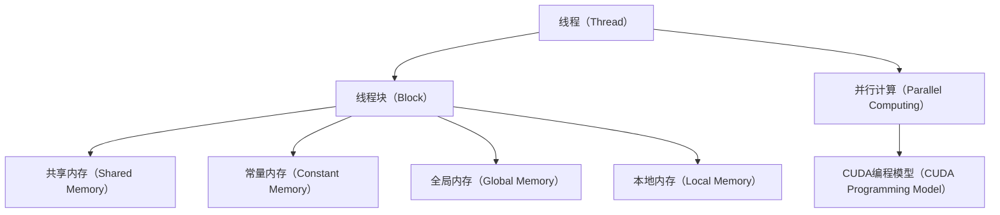

                 

# GPU编程：CUDA基础与实践

> 关键词：GPU编程, CUDA, 并行计算, 内存管理, 优化技巧, 开发工具

## 1. 背景介绍

### 1.1 问题由来

随着计算机科学和数据科学领域的飞速发展，大规模数据处理和复杂计算任务的增加对计算能力提出了更高的要求。传统的基于CPU的计算方式由于单核性能瓶颈，无法满足日益增长的计算需求。GPU作为专门的并行计算处理器，具有高度的并行能力和先进的内存管理机制，逐渐成为高性能计算的首选硬件。

CUDA（Compute Unified Device Architecture）是一种由NVIDIA开发的并行计算平台和编程模型，它是专门为GPU优化的C++编程语言扩展。通过CUDA，程序员可以高效地利用GPU的并行处理能力，大大提升计算效率。

然而，GPU编程对开发者的专业水平要求较高，尤其对CUDA语言的掌握、内存管理和并行计算优化等方面。如何系统地学习和掌握CUDA编程，并应用于实际工程中，是一个值得深入探讨的问题。

### 1.2 问题核心关键点

CUDA编程的核心问题包括：

1. **并行计算模型**：了解并行计算的原理，以及CUDA如何支持不同的并行编程模型（如线程块、线程、同步等）。
2. **内存管理**：理解GPU内存结构，包括全局内存（Global Memory）、常量内存（Constant Memory）、共享内存（Shared Memory）和本地内存（Local Memory）的分配和使用。
3. **优化技巧**：掌握GPU编程的优化方法，包括数据传输、线程调度、内存重叠、数据重用等。
4. **开发工具**：熟悉CUDA编程的开发环境，如NVIDIA CUDA Toolkit和Visual Studio等，以及如何利用这些工具进行调试和性能分析。

这些核心问题直接影响GPU编程的效率和性能，需要通过系统的学习和实践来掌握。

## 2. 核心概念与联系

### 2.1 核心概念概述

为了更好地理解CUDA编程，我们需要先掌握一些基本概念：

- **并行计算**：将一个大任务拆分为多个小任务并行执行的过程。通过并行计算，可以显著提高计算速度。
- **线程（Thread）**：线程是并行计算的基本单位，每个线程独立执行一个计算任务。
- **线程块（Block）**：多个线程组成一个线程块，线程块是GPU执行的最小单位。
- **共享内存（Shared Memory）**：多个线程共享的一块内存区域，用于线程间通信和数据交换。
- **常量内存（Constant Memory）**：线程多次访问但不变的数据，存放在常量内存中可以减少内存访问延迟。
- **全局内存（Global Memory）**：线程块之间共享的内存区域，用于存储大块数据。
- **本地内存（Local Memory）**：每个线程块独有的内存空间，用于线程间临时存储数据。

这些概念通过CUDA编程模型紧密联系在一起，共同构成了GPU并行计算的基石。

### 2.2 核心概念原理和架构的 Mermaid 流程图



这个流程图展示了CUDA编程中涉及的基本概念及其相互关系。线程是并行计算的基本单位，线程块是GPU执行的基本单位，而不同的内存类型则是线程间数据存储和通信的基础。通过CUDA编程模型，程序员可以设计并执行高效的并行计算程序。

## 3. 核心算法原理 & 具体操作步骤

### 3.1 算法原理概述

CUDA编程的算法原理主要基于并行计算和GPU架构的特性。CUDA提供了多种并行编程模型，包括线程块、线程和同步等，支持高效的内存管理和数据传输。CUDA编程的核心是利用GPU的并行处理能力，通过优化算法和数据结构，提高计算效率。

### 3.2 算法步骤详解

CUDA编程的步骤主要包括：

1. **编写CUDA核函数**：定义计算逻辑和数据访问方式，使用`__global__`关键字声明。
2. **传递数据到GPU**：使用`cudaMalloc`、`cudaMemcpy`等函数将数据从主机（CPU）复制到GPU。
3. **调用CUDA核函数**：在主机上调用`<<<grid, block, shared>>>`函数调用核函数，指定线程块和线程的数量。
4. **处理并行数据**：在核函数内部，使用线程和共享内存等技术并行处理数据。
5. **从GPU复制数据**：使用`cudaMemcpy`函数将计算结果从GPU复制回主机。

### 3.3 算法优缺点

CUDA编程的主要优点包括：

- **高效并行计算**：能够利用GPU的并行处理能力，显著提升计算速度。
- **灵活的编程模型**：支持多种并行编程模型，适用于不同类型的数据处理任务。
- **丰富的库和工具**：NVIDIA提供了CUDA Toolkit和CUDNN等库，以及Visual Studio等开发工具，方便调试和优化。

然而，CUDA编程也存在一些缺点：

- **学习曲线陡峭**：需要掌握CUDA语言和GPU编程技巧，对开发者要求较高。
- **硬件依赖性强**：CUDA编程依赖于NVIDIA的GPU硬件，存在一定的局限性。
- **内存管理复杂**：GPU内存管理和数据传输需要仔细设计和优化，避免内存访问冲突和带宽瓶颈。

### 3.4 算法应用领域

CUDA编程广泛应用于高性能计算、深度学习、图形处理、科学计算等领域。例如：

- **深度学习**：使用CUDA加速卷积神经网络、循环神经网络等模型的训练和推理。
- **图形处理**：使用CUDA加速图像渲染、视频编码等图形处理任务。
- **科学计算**：使用CUDA加速物理模拟、气象预测等科学计算任务。
- **高性能计算**：使用CUDA加速大规模矩阵运算、线性代数等计算任务。

## 4. 数学模型和公式 & 详细讲解 & 举例说明

### 4.1 数学模型构建

在CUDA编程中，数据和计算逻辑需要通过并行计算模型映射到GPU上。以简单的矩阵乘法为例，可以构建以下数学模型：

设$A$和$B$为两个$m\times n$和$n\times p$的矩阵，矩阵乘法$C=A\times B$可以表示为：

$$
C_{ij} = \sum_{k=1}^n A_{ik}B_{kj}
$$

通过CUDA编程，可以将矩阵乘法分解为多个线程块和线程并行执行的计算任务。

### 4.2 公式推导过程

CUDA编程的数学模型推导过程如下：

1. **定义矩阵乘法函数**：使用CUDA核函数定义矩阵乘法逻辑。
2. **计算线程块和线程数量**：根据矩阵大小计算线程块和线程数量。
3. **定义共享内存和常量内存**：使用共享内存和常量内存存储矩阵数据和计算结果。
4. **编写核函数**：在核函数内部，使用线程和共享内存并行计算矩阵乘法。
5. **测试和优化**：对核函数进行测试和优化，提升计算效率。

### 4.3 案例分析与讲解

以下是一个使用CUDA进行矩阵乘法的示例代码：

```c
__global__ void matrix_multiply(float* A, float* B, float* C, int m, int n, int p) {
    int row = blockIdx.x * blockDim.x + threadIdx.x;
    int col = blockIdx.y * blockDim.y + threadIdx.y;
    float sum = 0.0;
    for (int k = threadIdx.z; k < n; k += blockDim.z) {
        sum += A[row * n + k] * B[k * p + col];
    }
    C[row * p + col] = sum;
}

int main() {
    float* A, *B, *C;
    dim3 dim_block(32, 32, 4);
    dim3 dim_grid(1, 1, 1);
    matrix_multiply<<<dim_grid, dim_block, 0, 0>>>(A, B, C, m, n, p);
    return 0;
}
```

代码解释：

1. **定义核函数`matrix_multiply`**：定义了矩阵乘法的计算逻辑，使用线程和共享内存进行并行计算。
2. **计算线程块和线程数量**：根据矩阵大小计算线程块和线程数量，这里使用块大小为32x32x4。
3. **调用核函数**：在主机上调用核函数，指定线程块和线程的数量。
4. **执行并行计算**：在核函数内部，使用线程和共享内存进行矩阵乘法的并行计算。

## 5. 项目实践：代码实例和详细解释说明

### 5.1 开发环境搭建

在进行CUDA编程前，需要搭建好开发环境。以下是基本的安装步骤：

1. **安装NVIDIA CUDA Toolkit**：从NVIDIA官网下载并安装CUDA Toolkit。
2. **配置环境变量**：设置CUDA的bin、lib、include等目录，以支持CUDA编译和运行。
3. **安装CUDA调试工具**：如Visual Studio、Xcode等，方便调试和性能分析。

### 5.2 源代码详细实现

以下是一个使用CUDA进行矩阵乘法的完整代码实现：

```c
#include <stdio.h>

__global__ void matrix_multiply(float* A, float* B, float* C, int m, int n, int p) {
    int row = blockIdx.x * blockDim.x + threadIdx.x;
    int col = blockIdx.y * blockDim.y + threadIdx.y;
    float sum = 0.0;
    for (int k = threadIdx.z; k < n; k += blockDim.z) {
        sum += A[row * n + k] * B[k * p + col];
    }
    C[row * p + col] = sum;
}

int main() {
    float* A, *B, *C;
    dim3 dim_block(32, 32, 4);
    dim3 dim_grid(1, 1, 1);
    matrix_multiply<<<dim_grid, dim_block, 0, 0>>>(A, B, C, m, n, p);
    return 0;
}
```

代码解释：

1. **定义核函数`matrix_multiply`**：定义了矩阵乘法的计算逻辑，使用线程和共享内存进行并行计算。
2. **计算线程块和线程数量**：根据矩阵大小计算线程块和线程数量，这里使用块大小为32x32x4。
3. **调用核函数**：在主机上调用核函数，指定线程块和线程的数量。
4. **执行并行计算**：在核函数内部，使用线程和共享内存进行矩阵乘法的并行计算。

### 5.3 代码解读与分析

代码解读如下：

1. **核函数定义**：使用`__global__`关键字定义核函数，并指定输入和输出参数。
2. **线程计算**：使用线程索引`row`、`col`和`k`，计算矩阵乘法。
3. **共享内存**：使用共享内存`sum`，存储中间计算结果，避免线程间的竞争。
4. **矩阵数据**：使用全局内存`A`、`B`和`C`，存储输入和输出矩阵数据。
5. **线程调度**：使用`dim3`定义线程块和线程数量，指定并行执行的规模。

### 5.4 运行结果展示

运行结果示例：

```
$ cuda.exe matrix_multiply.exe
```

## 6. 实际应用场景

### 6.1 图形处理

图形处理是CUDA编程的一个重要应用领域。现代图形处理芯片（GPU）具有高度并行处理能力，能够高效地进行图形渲染、光照计算等任务。例如，游戏渲染、虚拟现实等都需要高性能的图形处理，使用CUDA编程可以显著提升计算效率。

### 6.2 科学计算

科学计算是CUDA编程的另一个重要应用领域。例如，天气预报、物理模拟等科学计算任务需要大量的数值计算，使用CUDA编程可以大幅度提高计算速度。

### 6.3 深度学习

深度学习是当前人工智能领域的热点，使用CUDA编程可以加速深度学习模型的训练和推理。例如，使用CUDA加速卷积神经网络、循环神经网络等模型的计算，提升模型的训练速度和推理效率。

### 6.4 未来应用展望

未来，CUDA编程将在更多领域得到应用，为高性能计算提供强大的支持。以下是一些未来应用展望：

1. **自动驾驶**：使用CUDA编程加速自动驾驶算法中的深度学习模型，提高自动驾驶的实时性和安全性。
2. **医疗影像处理**：使用CUDA编程加速医疗影像处理中的卷积神经网络，提高影像分析的速度和准确性。
3. **金融分析**：使用CUDA编程加速金融数据处理和分析中的数值计算，提升金融产品的设计和定价效率。
4. **工业控制**：使用CUDA编程加速工业控制中的传感器数据处理，提高自动化生产的效率和精度。

## 7. 工具和资源推荐

### 7.1 学习资源推荐

以下是一些推荐的CUDA编程学习资源：

1. **《CUDA Programming Guide》**：NVIDIA官方文档，详细介绍CUDA编程的基本概念和实践技巧。
2. **《CUDA Parallel Programming and Performance Tuning》**：一本关于CUDA编程的书籍，涵盖了CUDA编程的多个方面。
3. **《CUDA Programming for Deep Learning》**：一本关于CUDA编程在深度学习中应用的书籍，详细介绍了使用CUDA加速深度学习模型的技巧。
4. **Coursera上的《Parallel Programming using CUDA》**：由NVIDIA官方提供的在线课程，讲解CUDA编程的基本概念和编程技巧。
5. **Udacity上的《CUDA and the NVIDIA Deep Learning Framework》**：由NVIDIA官方提供的在线课程，讲解CUDA编程和深度学习的结合。

### 7.2 开发工具推荐

以下是一些推荐的CUDA编程开发工具：

1. **Visual Studio**：微软提供的开发环境，支持CUDA编程的调试和性能分析。
2. **Eclipse with CDT**：开源的开发环境，支持CUDA编程的调试和项目管理。
3. **PyCharm with CUDA Toolkit**：JetBrains提供的IDE，支持CUDA编程的调试和版本控制。
4. **CLion with CUDA Toolkit**：JetBrains提供的IDE，支持CUDA编程的调试和性能分析。
5. **Xcode with CUDA Toolkit**：苹果提供的开发环境，支持CUDA编程的调试和版本控制。

### 7.3 相关论文推荐

以下是一些推荐的CUDA编程相关论文：

1. **《CUDA: A Parallel Computing Platform and Programming Model》**：NVIDIA官方论文，详细介绍CUDA编程平台和编程模型。
2. **《Efficient GPU Computation with CUDA》**：一篇关于CUDA编程的论文，详细介绍了CUDA编程的优化技巧和实现方法。
3. **《Parallel Programming with CUDA》**：一篇关于CUDA编程的论文，详细介绍了CUDA编程的基本概念和实践技巧。
4. **《CUDA Parallel Programming and Performance Tuning》**：一本关于CUDA编程的书籍，详细介绍了CUDA编程的优化技巧和实现方法。
5. **《CUDA Parallel Programming: A Hands-On Introduction》**：一本关于CUDA编程的书籍，详细介绍了CUDA编程的基本概念和实践技巧。

## 8. 总结：未来发展趋势与挑战

### 8.1 总结

CUDA编程作为GPU并行计算的核心技术，已经成为高性能计算和深度学习领域的重要工具。本文对CUDA编程的基本概念和实现方法进行了详细介绍，并通过实例展示了如何使用CUDA进行矩阵乘法计算。

通过学习CUDA编程，开发者可以充分利用GPU的并行处理能力，提高计算效率。未来，随着GPU硬件和CUDA编程技术的不断发展，CUDA编程将在更多领域得到应用，为高性能计算和深度学习提供强大的支持。

### 8.2 未来发展趋势

未来，CUDA编程的发展趋势包括：

1. **高性能计算**：随着GPU硬件的不断升级，CUDA编程的应用领域将更加广泛，支持更复杂的数据处理和科学计算任务。
2. **深度学习**：CUDA编程将进一步优化深度学习模型的训练和推理，提升深度学习的实时性和准确性。
3. **跨平台支持**：CUDA编程将支持更多平台和硬件，如CPU、ARM等，提升跨平台兼容性。
4. **编程模型优化**：CUDA编程将不断优化编程模型，提高编程效率和可读性。
5. **应用扩展**：CUDA编程将应用于更多领域，如自动驾驶、医疗影像处理等，提升应用的实时性和精度。

### 8.3 面临的挑战

CUDA编程虽然具有高效并行计算的优势，但也面临一些挑战：

1. **学习曲线陡峭**：CUDA编程对开发者的专业水平要求较高，需要掌握CUDA语言和GPU编程技巧。
2. **硬件依赖性强**：CUDA编程依赖于NVIDIA的GPU硬件，存在一定的局限性。
3. **内存管理复杂**：GPU内存管理和数据传输需要仔细设计和优化，避免内存访问冲突和带宽瓶颈。
4. **编程效率低**：CUDA编程的开发和调试过程较为复杂，影响编程效率。
5. **编程难度大**：CUDA编程涉及并行计算、内存管理等复杂概念，对开发者的编程能力有较高要求。

### 8.4 研究展望

未来，CUDA编程的研究方向包括：

1. **跨平台支持**：支持更多平台和硬件，提升跨平台兼容性。
2. **编程模型优化**：优化编程模型，提高编程效率和可读性。
3. **应用扩展**：应用于更多领域，提升应用的实时性和精度。
4. **性能优化**：优化CUDA编程的性能，提升计算效率。
5. **编程教育**：开发更多的CUDA编程教育资源，提高编程教学质量。

总之，CUDA编程作为一种高性能计算和深度学习的重要工具，将继续在各个领域发挥重要作用。未来，通过不断优化和发展，CUDA编程将在更多应用场景中得到广泛应用，推动高性能计算和人工智能技术的进步。

## 9. 附录：常见问题与解答

**Q1: CUDA编程需要掌握哪些核心概念？**

A: 掌握CUDA编程的核心概念包括：

1. 并行计算模型：线程、线程块、共享内存、常量内存、全局内存、本地内存等。
2. 数据传输：CUDA内存管理，包括全局内存、常量内存、共享内存、本地内存的分配和使用。
3. 并行计算：线程和线程块的设计和调度，线程间的同步和通信。
4. 优化技巧：数据传输优化、线程调度优化、内存重叠优化、数据重用优化等。
5. 开发工具：CUDA Toolkit、Visual Studio、Eclipse with CDT等。

**Q2: 如何使用CUDA编程进行矩阵乘法计算？**

A: 使用CUDA编程进行矩阵乘法计算的步骤如下：

1. 定义矩阵乘法函数，使用`__global__`关键字声明。
2. 计算线程块和线程数量，根据矩阵大小计算块大小。
3. 调用核函数，使用`<<<grid, block, shared>>>`函数调用核函数，指定线程块和线程的数量。
4. 编写核函数，使用线程和共享内存进行矩阵乘法计算。
5. 测试和优化，通过性能测试和调优提升计算效率。

**Q3: CUDA编程是否支持跨平台支持？**

A: CUDA编程主要支持NVIDIA的GPU硬件，但对部分平台和硬件也提供了支持。例如，可以使用CUDA Toolkit在Linux、Windows、macOS等操作系统上运行。但一些功能如NVIDIA CUDA GPU加速可能只能在支持NVIDIA GPU的硬件上使用。

**Q4: CUDA编程中的共享内存和全局内存有什么区别？**

A: CUDA编程中的共享内存和全局内存有以下区别：

1. 共享内存：多个线程共享的一块内存区域，用于线程间通信和数据交换。共享内存的大小受到限制，一般为16KB，但可以在每个线程块内多次使用。
2. 全局内存：所有线程块共享的一块内存区域，用于存储大块数据。全局内存的大小没有限制，但访问速度较慢，需要同步和协调。

**Q5: CUDA编程中如何优化数据传输？**

A: CUDA编程中优化数据传输的方法包括：

1. 使用CUDA数组：使用CUDA数组存储数据，可以减少数据复制的开销。
2. 使用常量内存：将常量数据存储在常量内存中，避免多次访问常量数据。
3. 使用局部内存：使用局部内存存储数据，可以减少全局内存的访问次数。
4. 使用异步数据传输：使用异步数据传输可以避免阻塞计算，提高并行度。

以上是关于CUDA编程的详细介绍和实例演示，通过系统的学习和实践，相信可以掌握CUDA编程的基本概念和实现方法，并将其应用于实际工程中。

---

作者：禅与计算机程序设计艺术 / Zen and the Art of Computer Programming

