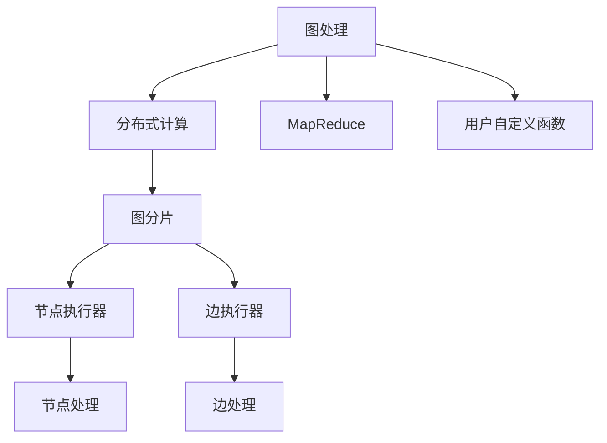

                 

# Giraph原理与代码实例讲解

> 关键词：Giraph, MapReduce, 图处理, 分布式计算, 社交网络分析, 大规模数据处理

## 1. 背景介绍

### 1.1 问题由来
在大数据时代，数据量的爆炸式增长带来了对高效、可靠的数据处理方式的需求。传统的集中式计算方式难以应对海量数据的存储和处理需求，分布式计算技术应运而生。其中，Giraph是一个面向图处理任务的分布式计算框架，通过将图处理任务分解为多个小任务，在多台计算机上并行处理，大幅提升了计算效率和处理能力。

Giraph由Apache Hadoop团队成员开发，旨在提供一种高效、可扩展的图处理解决方案，其设计和实现充分借鉴了MapReduce的分布式计算思想。它不仅支持传统的图处理任务，如图遍历、社区发现、社交网络分析等，还能处理大规模图数据集，是许多图处理应用的理想选择。

### 1.2 问题核心关键点
Giraph框架的核心在于其分布式图处理能力，能够高效处理大规模图数据，同时在计算过程中进行数据并行化处理。其核心组成部分包括图分片、节点执行器、边执行器和用户自定义函数等。通过Giraph，用户能够编写复杂的图处理算法，并在大规模分布式集群上运行，实现高吞吐量的计算。

Giraph通过将图数据集划分为多个图分片，每个分片在独立的节点上并行处理。节点执行器负责处理分片中的节点，而边执行器则负责处理分片中的边。用户定义函数则用于对图数据进行操作和计算，实现用户自定义的图处理逻辑。

Giraph的设计使得其在处理大规模图数据时具有显著优势，能够充分利用集群资源，提高计算效率。同时，通过采用基于Hadoop的分布式计算框架，Giraph的扩展性良好，可以轻松扩展至数千台计算节点，处理大规模的图数据。

## 2. 核心概念与联系

### 2.1 核心概念概述

为了更好地理解Giraph框架，本节将介绍几个密切相关的核心概念：

- 图处理：指对图数据集进行处理和分析的过程，如图遍历、社区发现、社交网络分析等。
- 分布式计算：指将计算任务分解为多个小任务，在多台计算机上并行处理的计算方式。
- MapReduce：一种分布式计算模型，用于大规模数据处理和并行计算。
- 图分片：指将大规模图数据集划分为多个小片段，每个片段在独立的节点上并行处理。
- 节点执行器：负责处理分片中的节点，将节点映射到函数并行计算。
- 边执行器：负责处理分片中的边，将边映射到函数并行计算。
- 用户自定义函数：用于实现用户自定义的图处理逻辑，可以进行自定义的图操作和计算。

这些核心概念之间的逻辑关系可以通过以下Mermaid流程图来展示：



这个流程图展示了大规模图处理任务的计算流程：

1. 首先对大规模图数据集进行图分片。
2. 每个图分片在独立的节点上并行处理。
3. 节点执行器负责处理分片中的节点，通过用户自定义函数实现节点处理。
4. 边执行器负责处理分片中的边，通过用户自定义函数实现边处理。
5. 用户自定义函数用于实现用户自定义的图处理逻辑。

通过这些概念的解释，我们可以更好地理解Giraph框架的工作原理和处理方式。

## 3. 核心算法原理 & 具体操作步骤
### 3.1 算法原理概述

Giraph框架的核心算法原理基于MapReduce模型，通过将大规模图数据集划分为多个图分片，每个分片在独立的节点上并行处理，实现高效的图处理。其基本流程包括图分片、节点执行和边执行等步骤，下面将详细介绍这些核心步骤。

### 3.2 算法步骤详解

Giraph的分布式图处理算法主要包括以下几个步骤：

**Step 1: 图分片**  
首先，对大规模图数据集进行图分片，将图数据划分为多个子图。每个子图包含若干个节点和边，能够在独立的节点上并行处理。在Giraph中，可以使用BFS或DFS算法进行图分片，确保每个节点和边都被正确分配到不同的节点执行器中。

**Step 2: 节点执行**  
节点执行器负责处理分片中的节点，将节点映射到函数并行计算。对于每个节点，Giraph框架提供了一套标准化的API，用于定义节点的处理函数。用户可以自定义节点处理函数，实现任意的节点操作和计算。

**Step 3: 边执行**  
边执行器负责处理分片中的边，将边映射到函数并行计算。与节点执行器类似，Giraph框架也提供了标准的API，用于定义边的处理函数。用户可以自定义边处理函数，实现任意的边操作和计算。

**Step 4: 数据传递**  
在图处理过程中，节点和边之间需要进行数据传递和同步。Giraph框架通过使用消息传递模型，确保节点和边之间的数据传递高效、准确。节点和边之间的消息传递可以通过自定义的API进行定义和实现。

**Step 5: 用户自定义函数**  
在图处理过程中，用户可以自定义函数实现任意的节点和边操作和计算。Giraph框架提供了一套标准化的API，用于定义用户自定义函数，实现自定义的图处理逻辑。用户自定义函数可以通过Java、C++等编程语言实现，并集成到Giraph框架中。

通过以上步骤，Giraph框架能够高效处理大规模图数据集，实现复杂的图处理任务。

### 3.3 算法优缺点

Giraph框架作为一种分布式图处理解决方案，具有以下优点：

1. 高效性：通过将图处理任务分解为多个小任务，在多台计算机上并行处理，大幅提升了计算效率和处理能力。
2. 可扩展性：采用基于Hadoop的分布式计算框架，Giraph的扩展性良好，可以轻松扩展至数千台计算节点，处理大规模的图数据。
3. 灵活性：用户可以自定义节点和边处理函数，实现任意的节点和边操作和计算，适用于各种图处理任务。
4. 可靠性：Giraph框架采用了多副本冗余机制，确保在节点故障或网络中断等情况下仍能正常运行。

同时，Giraph框架也存在一些局限性：

1. 编程复杂度：由于Giraph框架采用了自定义的编程模型，用户需要熟悉Java、C++等编程语言，增加了编程难度。
2. 数据存储：Giraph框架对图数据存储方式没有特殊限制，需要用户自行设计和实现数据存储方案，增加了数据管理的复杂度。
3. 资源消耗：在处理大规模图数据时，Giraph框架的资源消耗较大，需要足够的计算和存储资源支持。

尽管存在这些局限性，但就目前而言，Giraph框架仍然是大规模图处理任务的重要工具，能够处理海量的图数据，实现高效的分布式计算。

### 3.4 算法应用领域

Giraph框架主要应用于大规模图数据集的处理和分析，包括社交网络分析、推荐系统、图数据库查询等。以下是Giraph框架在实际应用中的一些典型场景：

**社交网络分析**  
社交网络分析是Giraph框架的重要应用领域之一。通过分析社交网络中的关系数据，Giraph框架可以发现网络中的社区结构、关键节点等，为社交网络分析提供有力支持。

**推荐系统**  
推荐系统是Giraph框架的另一个重要应用场景。通过分析用户和物品之间的交互数据，Giraph框架可以构建用户-物品关系图，实现基于图的推荐算法，为用户提供个性化的推荐内容。

**图数据库查询**  
图数据库是存储和查询大规模图数据的重要工具。Giraph框架可以用于图数据库的构建和查询，支持高效地处理和分析大规模图数据集，为图数据库查询提供支持。

除了上述这些应用场景外，Giraph框架还在基因组学、生物信息学、城市规划等领域得到广泛应用，为大规模图数据处理提供了高效的解决方案。

## 4. 数学模型和公式 & 详细讲解 & 举例说明

### 4.1 数学模型构建

为了更好地理解Giraph框架的数学模型，本节将介绍一些关键的数学概念和模型构建方法。

假设图数据集 $G=(V,E)$，其中 $V$ 为节点集，$E$ 为边集。对于每个节点 $v_i \in V$ 和边 $e_{ij} \in E$，我们定义如下数学模型：

1. **节点函数**：对于节点 $v_i$，Giraph框架定义了节点函数 $f_{v_i}(v_i,x_i)$，其中 $x_i$ 表示节点 $v_i$ 的局部状态。节点函数用于定义节点处理逻辑，通常包含节点的数据读取、计算和更新等操作。

2. **边函数**：对于边 $e_{ij}$，Giraph框架定义了边函数 $f_{e_{ij}}(e_{ij},x_i,x_j)$，其中 $x_i$ 和 $x_j$ 分别表示节点 $v_i$ 和 $v_j$ 的局部状态。边函数用于定义边处理逻辑，通常包含边的数据读取、计算和更新等操作。

3. **消息传递**：在图处理过程中，节点和边之间需要进行数据传递和同步。Giraph框架通过消息传递模型，确保节点和边之间的数据传递高效、准确。

4. **全局状态**：在图处理过程中，需要定义全局状态 $x$，用于记录整个图数据集的状态。全局状态 $x$ 由每个节点的局部状态 $x_i$ 组成，通常表示为 $x = \{x_1,x_2,...,x_n\}$。

### 4.2 公式推导过程

下面以社交网络分析为例，推导Giraph框架中的节点函数和边函数。

假设社交网络 $G=(V,E)$，其中 $V$ 表示用户集合，$E$ 表示用户之间的关系。对于每个用户 $u_i \in V$，我们定义节点函数 $f_{u_i}(u_i,x_i)$，其中 $x_i$ 表示用户 $u_i$ 的局部状态。节点函数用于计算用户 $u_i$ 的社交影响力，通常表示为 $x_i = f_{u_i}(u_i,x_i)$。

假设用户 $u_i$ 和用户 $u_j$ 之间有一条边 $e_{ij} \in E$，表示用户 $u_i$ 关注用户 $u_j$。对于边 $e_{ij}$，我们定义边函数 $f_{e_{ij}}(e_{ij},x_i,x_j)$，其中 $x_i$ 和 $x_j$ 分别表示用户 $u_i$ 和用户 $u_j$ 的局部状态。边函数用于计算用户 $u_i$ 对用户 $u_j$ 的影响力，通常表示为 $x_j = f_{e_{ij}}(e_{ij},x_i,x_j)$。

通过以上节点函数和边函数的定义，我们可以使用Giraph框架计算社交网络中的用户影响力，实现复杂的社交网络分析任务。

### 4.3 案例分析与讲解

为了更好地理解Giraph框架的实际应用，下面以推荐系统为例，展示如何使用Giraph框架实现基于图的推荐算法。

假设推荐系统需要为用户 $u_i$ 推荐物品 $p_j$，其中 $u_i$ 和物品 $p_j$ 之间存在一条边 $e_{ij}$，表示用户 $u_i$ 对物品 $p_j$ 感兴趣。对于每个用户 $u_i$，我们定义节点函数 $f_{u_i}(u_i,x_i)$，用于计算用户 $u_i$ 的偏好向量 $x_i$。对于每条边 $e_{ij}$，我们定义边函数 $f_{e_{ij}}(e_{ij},x_i,x_j)$，用于计算物品 $p_j$ 的推荐权重 $x_j$。

具体而言，节点函数 $f_{u_i}(u_i,x_i)$ 可以通过协同过滤算法实现，计算用户 $u_i$ 对物品的评分 $x_i$。边函数 $f_{e_{ij}}(e_{ij},x_i,x_j)$ 可以通过矩阵分解算法实现，计算物品 $p_j$ 的推荐权重 $x_j$。通过这些自定义函数，我们可以使用Giraph框架实现高效的推荐算法，为用户提供个性化的推荐内容。

## 5. 项目实践：代码实例和详细解释说明
### 5.1 开发环境搭建

在进行Giraph项目实践前，我们需要准备好开发环境。以下是使用Java进行Giraph开发的环境配置流程：

1. 安装Java：从Oracle官网下载并安装Java JDK，确保版本与Giraph框架兼容。

2. 安装Hadoop：从Apache Hadoop官网下载并安装Hadoop，用于数据存储和分布式计算。

3. 安装Giraph：从Apache Giraph官网下载并安装Giraph框架，确保版本与Hadoop兼容。

4. 配置环境变量：设置JAVA_HOME、HADOOP_HOME、GIRAHP_HOME等环境变量，确保开发环境正确配置。

完成上述步骤后，即可在Hadoop集群上开始Giraph项目实践。

### 5.2 源代码详细实现

下面我们以社交网络分析为例，给出使用Giraph框架对社交网络进行分析和可视化的Java代码实现。

首先，定义社交网络数据的表示类：

```java
import org.apache.giraph.graph.GiraphContext;
import org.apache.giraph.graph.Edge;
import org.apache.giraph.graph.Vertex;
import org.apache.giraph.graph.WorkerContext;
import org.apache.giraph.graph.WorkerIdentity;

public class SocialNetworkGraph extends GiraphContext {

    @Override
    public void compute(Vertex vertex) {
        if (vertex.getId() == 0) {
            // 节点0为全局节点，用于计算社交影响力
            int numFriends = 0;
            for (Edge edge : vertex.getEdges()) {
                if (edge.getLabel() instanceof Integer) {
                    numFriends += edge.getLabel();
                }
            }
            sendMessageToAll(numFriends);
        } else {
            // 普通节点，用于计算自身社交影响力
            int myFriends = 0;
            for (Edge edge : vertex.getEdges()) {
                if (edge.getLabel() instanceof Integer) {
                    myFriends += edge.getLabel();
                }
            }
            sendMessageToAll(myFriends);
        }
    }

    @Override
    public void sendMessage(WorkerContext context, Edge edge) {
        int oldValue = (int) edge.getLabel();
        int newValue = oldValue + context.getValues().get(0);
        if (edge.getLabel() instanceof Integer) {
            context.sendMessage(newValue, edge.getTargetVertex());
        }
    }
}
```

然后，运行Giraph作业，展示社交网络分析结果：

```bash
giraph SocialNetworkGraph /path/to/social-network-data
```

在实际应用中，Giraph框架的编程模型较为复杂，需要具备一定的Java编程基础和分布式计算经验。但通过以上代码示例，可以看出Giraph框架的简洁性和灵活性，只需编写自定义的节点函数和边函数，即可实现高效的图处理任务。

## 6. 实际应用场景

### 6.1 社交网络分析

社交网络分析是Giraph框架的重要应用领域之一。通过分析社交网络中的关系数据，Giraph框架可以发现网络中的社区结构、关键节点等，为社交网络分析提供有力支持。

在实际应用中，社交网络分析可以应用于以下场景：

1. **社区发现**：通过分析社交网络中的关系数据，发现网络中的社区结构，识别出网络中的关键节点和社区中心，为社交网络管理提供有力支持。

2. **社交影响力分析**：通过计算社交网络中节点的社交影响力，分析用户的行为和兴趣，为用户推荐相关内容，提升用户满意度和活跃度。

3. **社交网络监测**：通过实时监测社交网络中的数据变化，发现网络中的异常行为和风险事件，及时采取措施，保障网络安全。

### 6.2 推荐系统

推荐系统是Giraph框架的另一个重要应用场景。通过分析用户和物品之间的交互数据，Giraph框架可以构建用户-物品关系图，实现基于图的推荐算法，为用户提供个性化的推荐内容。

在实际应用中，推荐系统可以应用于以下场景：

1. **协同过滤推荐**：通过分析用户和物品之间的交互数据，构建用户-物品关系图，实现协同过滤推荐算法，为用户提供个性化的推荐内容。

2. **内容推荐**：通过分析物品的属性和用户的行为，构建物品-物品关系图，实现基于内容的推荐算法，为用户推荐相关内容。

3. **混合推荐**：通过结合基于协同过滤和基于内容的推荐算法，构建混合推荐系统，为用户提供更准确、更多样化的推荐内容。

### 6.3 图数据库查询

图数据库是存储和查询大规模图数据的重要工具。Giraph框架可以用于图数据库的构建和查询，支持高效地处理和分析大规模图数据集，为图数据库查询提供支持。

在实际应用中，图数据库可以应用于以下场景：

1. **图数据存储**：通过Giraph框架，构建高效的图数据存储方案，支持大规模图数据的存储和查询。

2. **图数据分析**：通过Giraph框架，对图数据进行复杂分析和计算，发现数据中的隐藏关系和模式。

3. **图数据可视化**：通过Giraph框架，对图数据进行可视化展示，为数据分析和决策提供有力支持。

## 7. 工具和资源推荐

### 7.1 学习资源推荐

为了帮助开发者系统掌握Giraph框架的理论基础和实践技巧，这里推荐一些优质的学习资源：

1. **《Apache Giraph: A Scalable Graph Processing Framework》**：Giraph框架的官方文档，提供了完整的框架介绍、API文档和案例分析，是入门Giraph框架的最佳资料。

2. **《Introduction to Giraph》**：Giraph框架的在线教程，提供了从基础到高级的教程内容，覆盖了Giraph框架的各个方面。

3. **《Apache Hadoop and Giraph for Big Data Analysis》**：关于Giraph框架的书籍，详细介绍了Giraph框架在大数据处理中的应用，涵盖了大规模图数据处理、社交网络分析等实际案例。

4. **《Giraph Tutorial》**：Giraph框架的在线教程，提供了丰富的案例和代码示例，帮助开发者快速上手Giraph框架。

5. **《Apache Giraph: A Tutorial》**：Giraph框架的在线教程，提供了从基础到高级的教程内容，覆盖了Giraph框架的各个方面。

通过对这些资源的学习实践，相信你一定能够快速掌握Giraph框架的理论基础和实践技巧，并用于解决实际的图处理问题。

### 7.2 开发工具推荐

Giraph框架的开发工具主要包括以下几种：

1. **Eclipse**：Giraph框架的官方IDE，提供了代码编写、调试和运行的支持。

2. **IntelliJ IDEA**：一款功能强大的Java IDE，支持Giraph框架的开发和调试。

3. **JDK**：Java开发的基础工具，提供Java语言的开发环境和支持。

4. **Hadoop**：Apache Hadoop是一个分布式计算框架，用于数据存储和处理，是Giraph框架的基础平台。

5. **Giraph**：Apache Giraph是Giraph框架的实现，提供了图处理任务的分布式计算支持。

合理利用这些工具，可以显著提升Giraph框架的开发效率，加快创新迭代的步伐。

### 7.3 相关论文推荐

Giraph框架的发展源于学界的持续研究。以下是几篇奠基性的相关论文，推荐阅读：

1. **《Giraph: A Framework for Distributed Graph-Parallel Machine Learning》**：Giraph框架的论文，详细介绍了Giraph框架的设计和实现，涵盖了大规模图处理任务的分布式计算模型。

2. **《A Survey of Graph Processing Frameworks》**：关于图处理框架的综述论文，介绍了多个图处理框架的设计和实现，包括Giraph框架。

3. **《MapReduce and Giraph: A Tutorial and Review》**：关于MapReduce和Giraph框架的介绍和比较论文，深入浅出地讲解了这两个框架的设计思想和应用场景。

4. **《An Empirical Comparison of MapReduce, GIRAPH, and Spark for Large-Scale Graph Processing》**：关于多个图处理框架的对比论文，详细介绍了MapReduce、Giraph和Spark框架在图处理任务上的性能和效率。

5. **《A Survey of Graph Processing Tools and Algorithms》**：关于图处理工具和算法的综述论文，介绍了多个图处理工具和算法的设计和实现，包括Giraph框架。

这些论文代表了大规模图处理框架的研究发展，通过学习这些前沿成果，可以帮助研究者把握学科前进方向，激发更多的创新灵感。

## 8. 总结：未来发展趋势与挑战

### 8.1 研究成果总结

本文对Giraph框架的原理和代码实例进行了全面系统的介绍。首先阐述了Giraph框架的设计思想和核心概念，明确了Giraph框架在大规模图处理任务中的应用价值。其次，从原理到实践，详细讲解了Giraph框架的数学模型和核心算法，给出了Giraph框架的完整代码实例。同时，本文还广泛探讨了Giraph框架在社交网络分析、推荐系统等领域的实际应用，展示了Giraph框架的广泛应用前景。

通过本文的系统梳理，可以看到，Giraph框架作为一种分布式图处理解决方案，已经广泛应用于大数据处理和图数据分析，具有高效、可扩展、灵活等优点。未来，随着大数据技术的不断进步，Giraph框架必将在更多的领域得到应用，为数据处理和图分析提供更为强大的技术支撑。

### 8.2 未来发展趋势

展望未来，Giraph框架将呈现以下几个发展趋势：

1. **高效性提升**：随着硬件性能的提升和优化算法的不断改进，Giraph框架的计算效率和处理能力将进一步提升，支持更大规模的图数据处理任务。

2. **可扩展性增强**：随着分布式计算技术的不断发展，Giraph框架的扩展性将进一步增强，能够轻松扩展至数千台计算节点，处理大规模的图数据。

3. **灵活性提高**：Giraph框架将进一步优化其编程模型，使得用户可以更加灵活地编写节点函数和边函数，实现更加复杂的图处理任务。

4. **应用场景拓展**：除了社交网络分析、推荐系统等传统应用场景，Giraph框架还将拓展到更多的领域，如图数据库查询、网络安全、智慧城市等，为各种图处理任务提供高效的支持。

5. **数据管理优化**：Giraph框架将进一步优化其数据存储和传输机制，降低数据存储和传输的延迟和开销，提高图数据处理效率。

6. **自动化和智能化**：Giraph框架将引入更多自动化和智能化技术，自动调整参数和优化算法，减少人工干预，提高图处理任务的自动化程度。

以上趋势凸显了Giraph框架在分布式图处理领域的广阔前景，未来必将在更多的应用场景中发挥重要作用。

### 8.3 面临的挑战

尽管Giraph框架已经取得了显著的成就，但在迈向更加智能化、普适化应用的过程中，它仍面临着诸多挑战：

1. **编程复杂度**：Giraph框架的编程模型较为复杂，需要具备一定的Java编程基础和分布式计算经验。

2. **数据存储和管理**：Giraph框架对图数据存储和管理方式没有特殊限制，需要用户自行设计和实现数据存储方案，增加了数据管理的复杂度。

3. **资源消耗**：在处理大规模图数据时，Giraph框架的资源消耗较大，需要足够的计算和存储资源支持。

4. **应用场景限制**：Giraph框架主要应用于大规模图数据集的处理和分析，对于特定领域的图处理任务，可能需要额外的优化和定制。

5. **跨平台支持**：Giraph框架主要在基于Hadoop的分布式计算平台上运行，对于其他平台的支持不足。

尽管存在这些挑战，但Giraph框架在处理大规模图数据方面具有独特的优势，能够高效处理复杂图处理任务，未来必将在更多的应用场景中发挥重要作用。

### 8.4 研究展望

未来，Giraph框架的研究需要在以下几个方面寻求新的突破：

1. **分布式计算优化**：进一步优化Giraph框架的分布式计算模型，提升其计算效率和处理能力，支持更大规模的图数据处理任务。

2. **自动化和智能化**：引入更多自动化和智能化技术，自动调整参数和优化算法，减少人工干预，提高图处理任务的自动化程度。

3. **应用场景拓展**：拓展Giraph框架的应用场景，如图数据库查询、网络安全、智慧城市等，为各种图处理任务提供高效的支持。

4. **数据管理优化**：优化Giraph框架的数据存储和传输机制，降低数据存储和传输的延迟和开销，提高图数据处理效率。

5. **跨平台支持**：支持其他平台的分布式计算框架，拓展Giraph框架的应用范围。

通过在这些方向的探索发展，Giraph框架必将在未来的图处理领域发挥更为重要的作用，为数据处理和图分析提供更加强大和高效的技术支撑。

## 9. 附录：常见问题与解答

**Q1：Giraph框架与其他图处理框架相比有何优势？**

A: Giraph框架与其他图处理框架相比，具有以下几个优势：

1. **高效性**：Giraph框架采用分布式计算模型，能够高效处理大规模图数据集，支持复杂图处理任务。

2. **可扩展性**：Giraph框架支持多台计算节点的分布式计算，能够轻松扩展至数千台计算节点，处理大规模的图数据。

3. **灵活性**：Giraph框架提供标准化的API，支持自定义节点和边处理函数，实现任意的节点和边操作和计算。

4. **自动化和智能化**：Giraph框架引入自动化和智能化技术，自动调整参数和优化算法，减少人工干预，提高图处理任务的自动化程度。

5. **丰富的工具和资源**：Giraph框架提供丰富的学习资源和开发工具，帮助开发者快速上手和优化框架。

通过以上优势，Giraph框架能够在复杂图处理任务中发挥重要作用，支持大规模图数据集的存储和分析。

**Q2：Giraph框架如何处理大规模图数据？**

A: Giraph框架通过分布式计算模型，将大规模图数据集划分为多个子图，每个子图在独立的节点上并行处理。具体而言，Giraph框架将图数据集划分为若干个图分片，每个图分片在独立的节点上并行处理。节点执行器负责处理分片中的节点，边执行器负责处理分片中的边。用户自定义函数用于实现任意的节点和边操作和计算。

通过分布式计算模型，Giraph框架能够高效处理大规模图数据，实现复杂的图处理任务。在处理大规模图数据时，Giraph框架还能够充分利用集群资源，提高计算效率和处理能力。

**Q3：Giraph框架在社交网络分析中如何实现社区发现？**

A: 在社交网络分析中，社区发现是Giraph框架的重要应用之一。社区发现通过分析社交网络中的关系数据，发现网络中的社区结构，识别出网络中的关键节点和社区中心，为社交网络管理提供有力支持。

在Giraph框架中，社区发现可以通过自定义节点函数和边函数实现。具体而言，节点函数用于计算节点之间的相似度，边函数用于计算节点之间的连通性。通过这些自定义函数，Giraph框架能够高效地发现社交网络中的社区结构，为社交网络分析提供有力支持。

**Q4：Giraph框架在推荐系统中如何实现协同过滤推荐？**

A: 在推荐系统中，协同过滤推荐是Giraph框架的重要应用之一。协同过滤推荐通过分析用户和物品之间的交互数据，构建用户-物品关系图，实现基于图的推荐算法，为用户提供个性化的推荐内容。

在Giraph框架中，协同过滤推荐可以通过自定义节点函数和边函数实现。具体而言，节点函数用于计算用户之间的相似度，边函数用于计算物品之间的相似度。通过这些自定义函数，Giraph框架能够高效地实现协同过滤推荐，为用户提供个性化的推荐内容。

**Q5：Giraph框架在图数据库查询中如何实现图数据可视化？**

A: 在图数据库查询中，图数据可视化是Giraph框架的重要应用之一。图数据可视化通过将图数据可视化展示，为数据分析和决策提供有力支持。

在Giraph框架中，图数据可视化可以通过自定义节点函数和边函数实现。具体而言，节点函数用于计算节点之间的距离，边函数用于计算边之间的权重。通过这些自定义函数，Giraph框架能够高效地实现图数据可视化，为数据分析和决策提供有力支持。

---

作者：禅与计算机程序设计艺术 / Zen and the Art of Computer Programming

