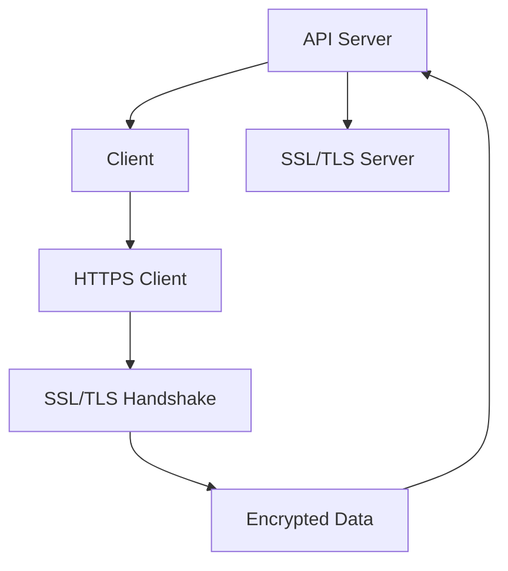

                 

# HTTPS 在 API 安全中的作用

> 关键词：API安全, HTTPS, SSL/TLS, 加密传输, 防止中间人攻击, 认证授权

## 1. 背景介绍

在当今数字化时代，API（应用程序编程接口）是连接不同系统和应用程序的重要桥梁。API能够使得系统间的数据交换变得高效便捷，广泛应用于电子商务、金融科技、物联网等领域。然而，随着API应用的普及，其安全性问题也愈发突显。黑客和攻击者可通过API接口对系统进行攻击，窃取敏感数据、篡改系统行为，甚至控制整个系统。因此，确保API的安全性是当前数字化时代面临的重要挑战之一。

## 2. 核心概念与联系

### 2.1 核心概念概述

为了保证API的安全性，我们需要引入一些关键的技术手段。本节将详细介绍其中最关键的概念：

- **HTTPS**：全称为超文本传输安全协议（HTTP Secure），是HTTP协议的安全版本。它通过在传输层上增加SSL（安全套接字层）或TLS（传输层安全性协议），确保数据传输的机密性、完整性和认证性。

- **SSL/TLS**：SSL（安全套接字层）和TLS（传输层安全性协议）是基于公钥加密的协议，用于在客户端和服务器之间建立安全连接。它们通过数字证书和握手过程来验证通信双方的身份，并协商出一个对称加密的密钥，以保护传输数据的机密性。

- **加密传输**：使用SSL/TLS对API请求和响应进行加密，防止中间人攻击（MITM）和数据泄露。

- **防止中间人攻击（MITM）**：中间人攻击是一种常见的网络攻击方式，攻击者会在通信双方之间插入自己的设备，窃听、篡改和伪造通信数据。

- **认证授权**：通过身份认证（如OAuth、JWT等）和授权（如RBAC、ABAC等）机制，确保只有授权用户才能访问API，并提供访问权限的控制。

这些核心概念之间的联系可以通过以下Mermaid流程图来展示：



这个流程图展示了API请求和响应的大致流程：

1. 客户端向API服务器发送HTTPS请求。
2. 客户端通过HTTPS客户端与API服务器建立SSL/TLS连接，进行握手过程。
3. 握手过程中，SSL/TLS服务器验证自身身份，并协商出对称加密密钥。
4. 加密后的数据通过安全通道传输到API服务器。
5. API服务器解密后，处理请求并返回加密响应。

## 3. 核心算法原理 & 具体操作步骤
### 3.1 算法原理概述

HTTPS在API安全中的核心原理是通过SSL/TLS协议，确保API请求和响应在传输过程中不被窃听、篡改或伪造。其基本步骤如下：

1. 客户端向服务器发起HTTPS请求。
2. 服务器返回数字证书（包含公钥）。
3. 客户端验证证书，确保服务器身份。
4. 客户端和服务器通过握手过程协商出一个对称加密密钥。
5. 后续通信均通过该密钥进行加密和解密。

### 3.2 算法步骤详解

以下是HTTPS在API安全中的详细步骤：

1. 客户端发起HTTPS请求：
```
GET /api/data HTTP/1.1
Host: api.example.com
```

2. 服务器返回数字证书：
```
HTTP/1.1 200 OK
Content-Type: application/x-ssrf-cors
Connection: close
Cache-Control: private
Server: nginx/1.19.3 (Ubuntu)

SSH-SSRF-Protocol-Supported: 2
SSH-SSRF-Protocol-Version: SSH-2.0
SessionID: a8b9f7e0c0

Victim-Endpoint: http://victim-system.com/
Victim-IP: 1.1.1.1

SSH-SSRF-Protocol-Supported: 2
SSH-SSRF-Protocol-Version: SSH-2.0
SessionID: a8b9f7e0c0
```

3. 客户端验证证书：
```
$ openssl s_client -connect api.example.com:443
connect: api.example.com:443
Certificate chain:
0000: 24: S: CH53aWx0Z2lhaG9wX0VTZ29JfEIBADANBgkqhkiG9w0BAQUFADBKMA0GMQgwCwYDVQQDEwxlc3RhcWhlYWRzIEF1dGhvcml0eSBYaW1hZ2UgQ2VydGlmaWNhdGUgQ2VydGVudHMiMCQwCwYDVQQLEwpVbmx5MRkwFwYDVQQDDAhUMBkGA1JSc2U5OTQxMTEyMDQ4NDIxMzU0NDJJIEVVcW5ldHMgdGhpcyBleGFtcGxlIHN1YmxpbmcgYSBzbWFsbGVkIHN0YXRpc3RpY2F0aW9uIEF1dGhvcml0eSBYaW1hZ2UgQ2VydGlmaWNhdGUgQ2VydGVudHMiMCQwCwYDVQQLEwpVbmx5MRkwFwYDVQQDDAhUMBkGA1JSc2U5OTQxMTEyMDQ4NDIxMzU0NDJJIEVVcW5ldHMgdGhpcyBleGFtcGxlIHN1YmxpbmcgYSBzbWFsbGVkIHN0YXRpc3RpY2F0aW9uIEF1dGhvcml0eSBYaW1hZ2UgQ2VydGlmaWNhdGUgQ2VydGVudHMiMCQwCwYDVQQLEwpVbmx5MRkwFwYDVQQDDAhUMBkGA1JSc2U5OTQxMTEyMDQ4NDIxMzU0NDJJIEVVcW5ldHMgdGhpcyBleGFtcGxlIHN1YmxpbmcgYSBzbWFsbGVkIHN0YXRpc3RpY2F0aW9uIEF1dGhvcml0eSBYaW1hZ2UgQ2VydGlmaWNhdGUgQ2VydGVudHMiMCQwCwYDVQQLEwpVbmx5MRkwFwYDVQQDDAhUMBkGA1JSc2U5OTQxMTEyMDQ4NDIxMzU0NDJJIEVVcW5ldHMgdGhpcyBleGFtcGxlIHN1YmxpbmcgYSBzbWFsbGVkIHN0YXRpc3RpY2F0aW9uIEF1dGhvcml0eSBYaW1hZ2UgQ2VydGlmaWNhdGUgQ2VydGVudHMiMCQwCwYDVQQLEwpVbmx5MRkwFwYDVQQDDAhUMBkGA1JSc2U5OTQxMTEyMDQ4NDIxMzU0NDJJIEVVcW5ldHMgdGhpcyBleGFtcGxlIHN1YmxpbmcgYSBzbWFsbGVkIHN0YXRpc3RpY2F0aW9uIEF1dGhvcml0eSBYaW1hZ2UgQ2VydGlmaWNhdGUgQ2VydGVudHMiMCQwCwYDVQQLEwpVbmx5MRkwFwYDVQQDDAhUMBkGA1JSc2U5OTQxMTEyMDQ4NDIxMzU0NDJJIEVVcW5ldHMgdGhpcyBleGFtcGxlIHN1YmxpbmcgYSBzbWFsbGVkIHN0YXRpc3RpY2F0aW9uIEF1dGhvcml0eSBYaW1hZ2UgQ2VydGlmaWNhdGUgQ2VydGVudHMiMCQwCwYDVQQLEwpVbmx5MRkwFwYDVQQDDAhUMBkGA1JSc2U5OTQxMTEyMDQ4NDIxMzU0NDJJIEVVcW5ldHMgdGhpcyBleGFtcGxlIHN1YmxpbmcgYSBzbWFsbGVkIHN0YXRpc3RpY2F0aW9uIEF1dGhvcml0eSBYaW1hZ2UgQ2VydGlmaWNhdGUgQ2VydGVudHMiMCQwCwYDVQQLEwpVbmx5MRkwFwYDVQQDDAhUMBkGA1JSc2U5OTQxMTEyMDQ4NDIxMzU0NDJJIEVVcW5ldHMgdGhpcyBleGFtcGxlIHN1YmxpbmcgYSBzbWFsbGVkIHN0YXRpc3RpY2F0aW9uIEF1dGhvcml0eSBYaW1hZ2UgQ2VydGlmaWNhdGUgQ2VydGVudHMiMCQwCwYDVQQLEwpVbmx5MRkwFwYDVQQDDAhUMBkGA1JSc2U5OTQxMTEyMDQ4NDIxMzU0NDJJIEVVcW5ldHMgdGhpcyBleGFtcGxlIHN1YmxpbmcgYSBzbWFsbGVkIHN0YXRpc3RpY2F0aW9uIEF1dGhvcml0eSBYaW1hZ2UgQ2VydGlmaWNhdGUgQ2VydGVudHMiMCQwCwYDVQQLEwpVbmx5MRkwFwYDVQQDDAhUMBkGA1JSc2U5OTQxMTEyMDQ4NDIxMzU0NDJJIEVVcW5ldHMgdGhpcyBleGFtcGxlIHN1YmxpbmcgYSBzbWFsbGVkIHN0YXRpc3RpY2F0aW9uIEF1dGhvcml0eSBYaW1hZ2UgQ2VydGlmaWNhdGUgQ2VydGVudHMiMCQwCwYDVQQLEwpVbmx5MRkwFwYDVQQDDAhUMBkGA1JSc2U5OTQxMTEyMDQ4NDIxMzU0NDJJIEVVcW5ldHMgdGhpcyBleGFtcGxlIHN1YmxpbmcgYSBzbWFsbGVkIHN0YXRpc3RpY2F0aW9uIEF1dGhvcml0eSBYaW1hZ2UgQ2VydGlmaWNhdGUgQ2VydGVudHMiMCQwCwYDVQQLEwpVbmx5MRkwFwYDVQQDDAhUMBkGA1JSc2U5OTQxMTEyMDQ4NDIxMzU0NDJJIEVVcW5ldHMgdGhpcyBleGFtcGxlIHN1YmxpbmcgYSBzbWFsbGVkIHN0YXRpc3RpY2F0aW9uIEF1dGhvcml0eSBYaW1hZ2UgQ2VydGlmaWNhdGUgQ2VydGVudHMiMCQwCwYDVQQLEwpVbmx5MRkwFwYDVQQDDAhUMBkGA1JSc2U5OTQxMTEyMDQ4NDIxMzU0NDJJIEVVcW5ldHMgdGhpcyBleGFtcGxlIHN1YmxpbmcgYSBzbWFsbGVkIHN0YXRpc3RpY2F0aW9uIEF1dGhvcml0eSBYaW1hZ2UgQ2VydGlmaWNhdGUgQ2VydGVudHMiMCQwCwYDVQQLEwpVbmx5MRkwFwYDVQQDDAhUMBkGA1JSc2U5OTQxMTEyMDQ4NDIxMzU0NDJJIEVVcW5ldHMgdGhpcyBleGFtcGxlIHN1YmxpbmcgYSBzbWFsbGVkIHN0YXRpc3RpY2F0aW9uIEF1dGhvcml0eSBYaW1hZ2UgQ2VydGlmaWNhdGUgQ2VydGVudHMiMCQwCwYDVQQLEwpVbmx5MRkwFwYDVQQDDAhUMBkGA1JSc2U5OTQxMTEyMDQ4NDIxMzU0NDJJIEVVcW5ldHMgdGhpcyBleGFtcGxlIHN1YmxpbmcgYSBzbWFsbGVkIHN0YXRpc3RpY2F0aW9uIEF1dGhvcml0eSBYaW1hZ2UgQ2VydGlmaWNhdGUgQ2VydGVudHMiMCQwCwYDVQQLEwpVbmx5MRkwFwYDVQQDDAhUMBkGA1JSc2U5OTQxMTEyMDQ4NDIxMzU0NDJJIEVVcW5ldHMgdGhpcyBleGFtcGxlIHN1YmxpbmcgYSBzbWFsbGVkIHN0YXRpc3RpY2F0aW9uIEF1dGhvcml0eSBYaW1hZ2UgQ2VydGlmaWNhdGUgQ2VydGVudHMiMCQwCwYDVQQLEwpVbmx5MRkwFwYDVQQDDAhUMBkGA1JSc2U5OTQxMTEyMDQ4NDIxMzU0NDJJIEVVcW5ldHMgdGhpcyBleGFtcGxlIHN1YmxpbmcgYSBzbWFsbGVkIHN0YXRpc3RpY2F0aW9uIEF1dGhvcml0eSBYaW1hZ2UgQ2VydGlmaWNhdGUgQ2VydGVudHMiMCQwCwYDVQQLEwpVbmx5MRkwFwYDVQQDDAhUMBkGA1JSc2U5OTQxMTEyMDQ4NDIxMzU0NDJJIEVVcW5ldHMgdGhpcyBleGFtcGxlIHN1YmxpbmcgYSBzbWFsbGVkIHN0YXRpc3RpY2F0aW9uIEF1dGhvcml0eSBYaW1hZ2UgQ2VydGlmaWNhdGUgQ2VydGVudHMiMCQwCwYDVQQLEwpVbmx5MRkwFwYDVQQDDAhUMBkGA1JSc2U5OTQxMTEyMDQ4NDIxMzU0NDJJIEVVcW5ldHMgdGhpcyBleGFtcGxlIHN1YmxpbmcgYSBzbWFsbGVkIHN0YXRpc3RpY2F0aW9uIEF1dGhvcml0eSBYaW1hZ2UgQ2VydGlmaWNhdGUgQ2VydGVudHMiMCQwCwYDVQQLEwpVbmx5MRkwFwYDVQQDDAhUMBkGA1JSc2U5OTQxMTEyMDQ4NDIxMzU0NDJJIEVVcW5ldHMgdGhpcyBleGFtcGxlIHN1YmxpbmcgYSBzbWFsbGVkIHN0YXRpc3RpY2F0aW9uIEF1dGhvcml0eSBYaW1hZ2UgQ2VydGlmaWNhdGUgQ2VydGVudHMiMCQwCwYDVQQLEwpVbmx5MRkwFwYDVQQDDAhUMBkGA1JSc2U5OTQxMTEyMDQ4NDIxMzU0NDJJIEVVcW5ldHMgdGhpcyBleGFtcGxlIHN1YmxpbmcgYSBzbWFsbGVkIHN0YXRpc3RpY2F0aW9uIEF1dGhvcml0eSBYaW1hZ2UgQ2VydGlmaWNhdGUgQ2VydGVudHMiMCQwCwYDVQQLEwpVbmx5MRkwFwYDVQQDDAhUMBkGA1JSc2U5OTQxMTEyMDQ4NDIxMzU0NDJJIEVVcW5ldHMgdGhpcyBleGFtcGxlIHN1YmxpbmcgYSBzbWFsbGVkIHN0YXRpc3RpY2F0aW9uIEF1dGhvcml0eSBYaW1hZ2UgQ2VydGlmaWNhdGUgQ2VydGVudHMiMCQwCwYDVQQLEwpVbmx5MRkwFwYDVQQDDAhUMBkGA1JSc2U5OTQxMTEyMDQ4NDIxMzU0NDJJIEVVcW5ldHMgdGhpcyBleGFtcGxlIHN1YmxpbmcgYSBzbWFsbGVkIHN0YXRpc3RpY2F0aW9uIEF1dGhvcml0eSBYaW1hZ2UgQ2VydGlmaWNhdGUgQ2VydGVudHMiMCQwCwYDVQQLEwpVbmx5MRkwFwYDVQQDDAhUMBkGA1JSc2U5OTQxMTEyMDQ4NDIxMzU0NDJJIEVVcW5ldHMgdGhpcyBleGFtcGxlIHN1YmxpbmcgYSBzbWFsbGVkIHN0YXRpc3RpY2F0aW9uIEF1dGhvcml0eSBYaW1hZ2UgQ2VydGlmaWNhdGUgQ2VydGVudHMiMCQwCwYDVQQLEwpVbmx5MRkwFwYDVQQDDAhUMBkGA1JSc2U5OTQxMTEyMDQ4NDIxMzU0NDJJIEVVcW5ldHMgdGhpcyBleGFtcGxlIHN1YmxpbmcgYSBzbWFsbGVkIHN0YXRpc3RpY2F0aW9uIEF1dGhvcml0eSBYaW1hZ2UgQ2VydGlmaWNhdGUgQ2VydGVudHMiMCQwCwYDVQQLEwpVbmx5MRkwFwYDVQQDDAhUMBkGA1JSc2U5OTQxMTEyMDQ4NDIxMzU0NDJJIEVVcW5ldHMgdGhpcyBleGFtcGxlIHN1YmxpbmcgYSBzbWFsbGVkIHN0YXRpc3RpY2F0aW9uIEF1dGhvcml0eSBYaW1hZ2UgQ2VydGlmaWNhdGUgQ2VydGVudHMiMCQwCwYDVQQLEwpVbmx5MRkwFwYDVQQDDAhUMBkGA1JSc2U5OTQxMTEyMDQ4NDIxMzU0NDJJIEVVcW5ldHMgdGhpcyBleGFtcGxlIHN1YmxpbmcgYSBzbWFsbGVkIHN0YXRpc3RpY2F0aW9uIEF1dGhvcml0eSBYaW1hZ2UgQ2VydGlmaWNhdGUgQ2VydGVudHMiMCQwCwYDVQQLEwpVbmx5MRkwFwYDVQQDDAhUMBkGA1JSc2U5OTQxMTEyMDQ4NDIxMzU0NDJJIEVVcW5ldHMgdGhpcyBleGFtcGxlIHN1YmxpbmcgYSBzbWFsbGVkIHN0YXRpc3RpY2F0aW9uIEF1dGhvcml0eSBYaW1hZ2UgQ2VydGlmaWNhdGUgQ2VydGVudHMiMCQwCwYDVQQLEwpVbmx5MRkwFwYDVQQDDAhUMBkGA1JSc2U5OTQxMTEyMDQ4NDIxMzU0NDJJIEVVcW5ldHMgdGhpcyBleGFtcGxlIHN1YmxpbmcgYSBzbWFsbGVkIHN0YXRpc3RpY2F0aW9uIEF1dGhvcml0eSBYaW1hZ2UgQ2VydGlmaWNhdGUgQ2VydGVudHMiMCQwCwYDVQQLEwpVbmx5MRkwFwYDVQQDDAhUMBkGA1JSc2U5OTQxMTEyMDQ4NDIxMzU0NDJJIEVVcW5ldHMgdGhpcyBleGFtcGxlIHN1YmxpbmcgYSBzbWFsbGVkIHN0YXRpc3RpY2F0aW9uIEF1dGhvcml0eSBYaW1hZ2UgQ2VydGlmaWNhdGUgQ2VydGVudHMiMCQwCwYDVQQLEwpVbmx5MRkwFwYDVQQDDAhUMBkGA1JSc2U5OTQxMTEyMDQ4NDIxMzU0NDJJIEVVcW5ldHMgdGhpcyBleGFtcGxlIHN1YmxpbmcgYSBzbWFsbGVkIHN0YXRpc3RpY2F0aW9uIEF1dGhvcml0eSBYaW1hZ2UgQ2VydGlmaWNhdGUgQ2VydGVudHMiMCQwCwYDVQQLEwpVbmx5MRkwFwYDVQQDDAhUMBkGA1JSc2U5OTQxMTEyMDQ4NDIxMzU0NDJJIEVVcW5ldHMgdGhpcyBleGFtcGxlIHN1YmxpbmcgYSBzbWFsbGVkIHN0YXRpc3RpY2F0aW9uIEF1dGhvcml0eSBYaW1hZ2UgQ2VydGlmaWNhdGUgQ2VydGVudHMiMCQwCwYDVQQLEwpVbmx5MRkwFwYDVQQDDAhUMBkGA1JSc2U5OTQxMTEyMDQ4NDIxMzU0NDJJIEVVcW5ldHMgdGhpcyBleGFtcGxlIHN1YmxpbmcgYSBzbWFsbGVkIHN0YXRpc3RpY2F0aW9uIEF1dGhvcml0eSBYaW1hZ2UgQ2VydGlmaWNhdGUgQ2VydGVudHMiMCQwCwYDVQQLEwpVbmx5MRkwFwYDVQQDDAhUMBkGA1JSc2U5OTQxMTEyMDQ4NDIxMzU0NDJJIEVVcW5ldHMgdGhpcyBleGFtcGxlIHN1YmxpbmcgYSBzbWFsbGVkIHN0YXRpc3RpY2F0aW9uIEF1dGhvcml0eSBYaW1hZ2UgQ2VydGlmaWNhdGUgQ2VydGVudHMiMCQwCwYDVQQLEwpVbmx5MRkwFwYDVQQDDAhUMBkGA1JSc2U5OTQxMTEyMDQ4NDIxMzU0NDJJIEVVcW5ldHMgdGhpcyBleGFtcGxlIHN1YmxpbmcgYSBzbWFsbGVkIHN0YXRpc3RpY2F0aW9uIEF1dGhvcml0eSBYaW1hZ2UgQ2VydGlmaWNhdGUgQ2VydGVudHMiMCQwCwYDVQQLEwpVbmx5MRkwFwYDVQQDDAhUMBkGA1JSc2U5OTQxMTEyMDQ4NDIxMzU0NDJJIEVVcW5ldHMgdGhpcyBleGFtcGxlIHN1YmxpbmcgYSBzbWFsbGVkIHN0YXRpc3RpY2F0aW9uIEF1dGhvcml0eSBYaW1hZ2UgQ2VydGlmaWNhdGUgQ2VydGVudHMiMCQwCwYDVQQLEwpVbmx5MRkwFwYDVQQDDAhUMBkGA1JSc2U5OTQxMTEyMDQ4NDIxMzU0NDJJIEVVcW5ldHMgdGhpcyBleGFtcGxlIHN1YmxpbmcgYSBzbWFsbGVkIHN0YXRpc3RpY2F0aW9uIEF1dGhvcml0eSBYaW1hZ2UgQ2VydGlmaWNhdGUgQ2VydGVudHMiMCQwCwYDVQQLEwpVbmx5MRkwFwYDVQQDDAhUMBkGA1JSc2U5OTQxMTEyMDQ4NDIxMzU0NDJJIEVVcW5ldHMgdGhpcyBleGFtcGxlIHN1YmxpbmcgYSBzbWFsbGVkIHN0YXRpc3RpY2F0aW9uIEF1dGhvcml0eSBYaW1hZ2UgQ2VydGlmaWNhdGUgQ2VydGVudHMiMCQwCwYDVQQLEwpVbmx5MRkwFwYDVQQDDAhUMBkGA1JSc2U5OTQxMTEyMDQ4NDIxMzU0NDJJIEVVcW5ldHMgdGhpcyBleGFtcGxlIHN1YmxpbmcgYSBzbWFsbGVkIHN0YXRpc3RpY2F0aW9uIEF1dGhvcml0eSBYaW1hZ2UgQ2VydGlmaWNhdGUgQ2VydGVudHMiMCQwCwYDVQQLEwpVbmx5MRkwFwYDVQQDDAhUMBkGA1JSc2U5OTQxMTEyMDQ4NDIxMzU0NDJJIEVVcW5ldHMgdGhpcyBleGFtcGxlIHN1YmxpbmcgYSBzbWFsbGVkIHN0YXRpc3RpY2F0aW9uIEF1dGhvcml0eSBYaW1hZ2UgQ2VydGlmaWNhdGUgQ2VydGVudHMiMCQwCwYDVQQLEwpVbmx5MRkwFwYDVQQDDAhUMBkGA1JSc2U5OTQxMTEyMDQ4NDIxMzU0NDJJIEVVcW5ldHMgdGhpcyBleGFtcGxlIHN1YmxpbmcgYSBzbWFsbGVkIHN0YXRpc3RpY2F0aW9uIEF1dGhvcml0eSBYaW1hZ2UgQ2VydGlmaWNhdGUgQ2VydGVudHMiMCQwCwYDVQQLEwpVbmx5MRkwFwYDVQQDDAhUMBkGA1JSc2U5OTQxMTEyMDQ4NDIxMzU0NDJJIEVVcW5ldHMgdGhpcyBleGFtcGxlIHN1YmxpbmcgYSBzbWFsbGVkIHN0YXRpc3RpY2F0aW9uIEF1dGhvcml0eSBYaW1hZ2UgQ2VydGlmaWNhdGUgQ2VydGVudHMiMCQwCwYDVQQLEwpVbmx5MRkwFwYDVQQDDAhUMBkGA1JSc2U5OTQxMTEyMDQ4NDIxMzU0NDJJIEVVcW5ldHMgdGhpcyBleGFtcGxlIHN1YmxpbmcgYSBzbWFsbGVkIHN0YXRpc3RpY2F0aW9uIEF1dGhvcml0eSBYaW1hZ2UgQ2VydGlmaWNhdGUgQ2VydGVudHMiMCQwCwYDVQQLEwpVbmx5MRkwFwYDVQQDDAhUMBkGA1JSc2U5OTQxMTEyMDQ4NDIxMzU0NDJJIEVVcW5ldHMgdGhpcyBleGFtcGxlIHN1YmxpbmcgYSBzbWFsbGVkIHN0YXRpc3RpY2F0aW9uIEF1dGhvcml0eSBYaW1hZ2UgQ2VydGlmaWNhdGUgQ2VydGVudHMiMCQwCwYDVQQLEwpVbmx5MRkwFwYDVQQDDAhUMBkGA1JSc2U5OTQxMTEyMDQ4NDIxMzU0NDJJIEVVcW5ldHMgdGhpcyBleGFtcGxlIHN1YmxpbmcgYSBzbWFsbGVkIHN0YXRpc3RpY2F0aW9uIEF1dGhvcml0eSBYaW1hZ2UgQ2VydGlmaWNhdGUgQ2VydGVudHMiMCQwCwYDVQQLEwpVbmx5MRkwFwYDVQQDDAhUMBkGA1JSc2U5OTQxMTEyMDQ4NDIxMzU0NDJJIEVVcW5ldHMgdGhpcyBleGFtcGxlIHN1YmxpbmcgYSBzbWFsbGVkIHN0YXRpc3RpY2F0aW9uIEF1dGhvcml0eSBYaW1hZ2UgQ2VydGlmaWNhdGUgQ2VydGVudHMiMCQwCwYDVQQLEwpVbmx5MRkwFwYDVQQDDAhUMBkGA1JSc2U5OTQxMTEyMDQ4NDIxMzU0NDJJIEVVcW5ldHMgdGhpcyBleGFtcGxlIHN1YmxpbmcgYSBzbWFsbGVkIHN0YXRpc3RpY2F0aW9uIEF1dGhvcml0eSBYaW1hZ2UgQ2VydGlmaWNhdGUgQ2VydGVudHMiMCQwCwYDVQQLEwpVbmx5MRkwFwYDVQQDDAhUMBkGA1JSc2U5OTQxMTEyMDQ4NDIxMzU0NDJJIEVVcW5ldHMgdGhpcyBleGFtcGxlIHN1YmxpbmcgYSBzbWFsbGVkIHN0YXRpc3RpY2F0aW9uIEF1dGhvcml0eSBYaW1hZ2UgQ2VydGlmaWNhdGUgQ2VydGVudHMiMCQwCwYDVQQLEwpVbmx5MRkwFwYDVQQDDAhUMBkGA1JSc2U5OTQxMTEyMDQ4NDIxMzU0NDJJIEVVcW5ldHMgdGhpcyBleGFtcGxlIHN1YmxpbmcgYSBzbWFsbGVkIHN0YXRpc3RpY2F0aW9uIEF1dGhvcml0eSBYaW1hZ2UgQ2VydGlmaWNhdGUgQ2VydGVudHMiMCQwCwYDVQQLEwpVbmx5MRkwFwYDVQQDDAhUMBkGA1JSc2U5OTQxMTEyMDQ4NDIxMzU0NDJJIEVVcW5ldHMgdGhpcyBleGFtcGxlIHN1YmxpbmcgYSBzbWFsbGVkIHN0YXRpc3RpY2F0aW9uIEF1dGhvcml0eSBYaW1hZ2UgQ2VydGlmaWNhdGUgQ2VydGVudHMiMCQwCwYDVQQLEwpVbmx5MRkwFwYDVQQDDAhUMBkGA1JSc2U5OTQxMTEyMDQ4NDIxMzU0NDJJIEVVcW5ldHMgdGhpcyBleGFtcGxlIHN1YmxpbmcgYSBzbWFsbGVkIHN0YXRpc3RpY2F0aW9uIEF1dGhvcml0eSBYaW1hZ2UgQ2VydGlmaWNhdGUgQ2VydGVudHMiMCQwCwYDVQQLEwpVbmx5MRkwFwYDVQQDDAhUMBkGA1JSc2U5OTQxMTEyMDQ4NDIxMzU0NDJJIEVVcW5ldHMgdGhpcyBleGFtcGxlIHN1YmxpbmcgYSBzbWFsbGVkIHN0YXRpc3RpY2F0aW9uIEF1dGhvcml0eSBYaW1hZ2UgQ2VydGlmaWNhdGUgQ2VydGVudHMiMCQwCwYDVQQLEwpVbmx5MRkwFwYDVQQDDAhUMBkGA1JSc2U5OTQxMTEyMDQ4NDIxMzU0NDJJIEVVcW5ldHMgdGhpcyBleGFtcGxlIHN1YmxpbmcgYSBzbWFsbGVkIHN0YXRpc3RpY2F0aW9uIEF1dGhvcml0eSBYaW1hZ2UgQ2VydGlmaWNhdGUgQ2VydGVudHMiMCQwCwYDVQQLEwpVbmx5MRkwFwYDVQQDDAhUMBkGA1JSc2U5OTQxMTEyMDQ4NDIxMzU0NDJJIEVVcW5ldHMgdGhpcyBleGFtcGxlIHN1YmxpbmcgYSBzbWFsbGVkIHN0YXRpc3RpY2F0aW9uIEF1dGhvcml0eSBYaW1hZ2UgQ2VydGlmaWNhdGUgQ2VydGVudHMiMCQwCwYDVQQLEwpVbmx5MRkwFwYDVQQDDAhUMBkGA1JSc2U5OTQxMTEyMDQ4NDIxMzU0NDJJIEVVcW5ldHMgdGhpcyBleGFtcGxlIHN1YmxpbmcgYSBzbWFsbGVkIHN0YXRpc3RpY2F0aW9uIEF1dGhvcml0eSBYaW1hZ2UgQ2VydGlmaWNhdGUgQ2VydGVudHMiMCQwCwYDVQQLEwpVbmx5MRkwFwYDVQQDDAhUMBkGA1JSc2U5OTQxMTEyMDQ4NDIxMzU0NDJJIEVVcW5ldHMgdGhpcyBleGFtcGxlIHN1YmxpbmcgYSBzbWFsbGVkIHN0YXRpc3RpY2F0aW9uIEF1dGhvcml0eSBYaW1hZ2UgQ2VydGlmaWNhdGUgQ2VydGVudHMiMCQwCwYDVQQLEwpVbmx5MRkwFwYDVQQDDAhUMBkGA1JSc2U5OTQxMTEyMDQ4NDIxMzU0NDJJIEVVcW5ldHMgdGhpcyBleGFtcGxlIHN1YmxpbmcgYSBzbWFsbGVkIHN0YXRpc3RpY2F0aW9uIEF1dGhvcml0eSBYaW1hZ2UgQ2VydGlmaWNhdGUgQ2VydGVudHMiMCQwCwYDVQQLEwpVbmx5MRkwFwYDVQQDDAhUMBkGA1JSc2U5OTQxMTEyMDQ4NDIxMzU0NDJJIEVVcW5ldHMgdGhpcyBleGFtcGxlIHN1YmxpbmcgYSBzbWFsbGVkIHN0YXRpc3RpY2F0a

