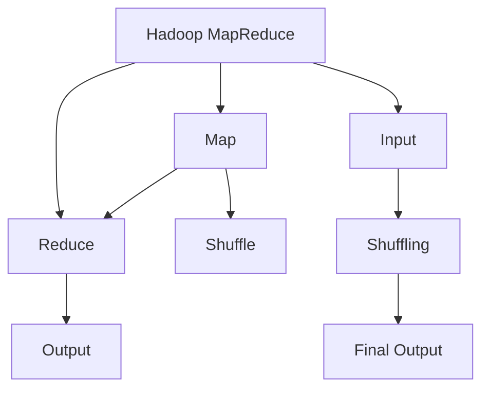
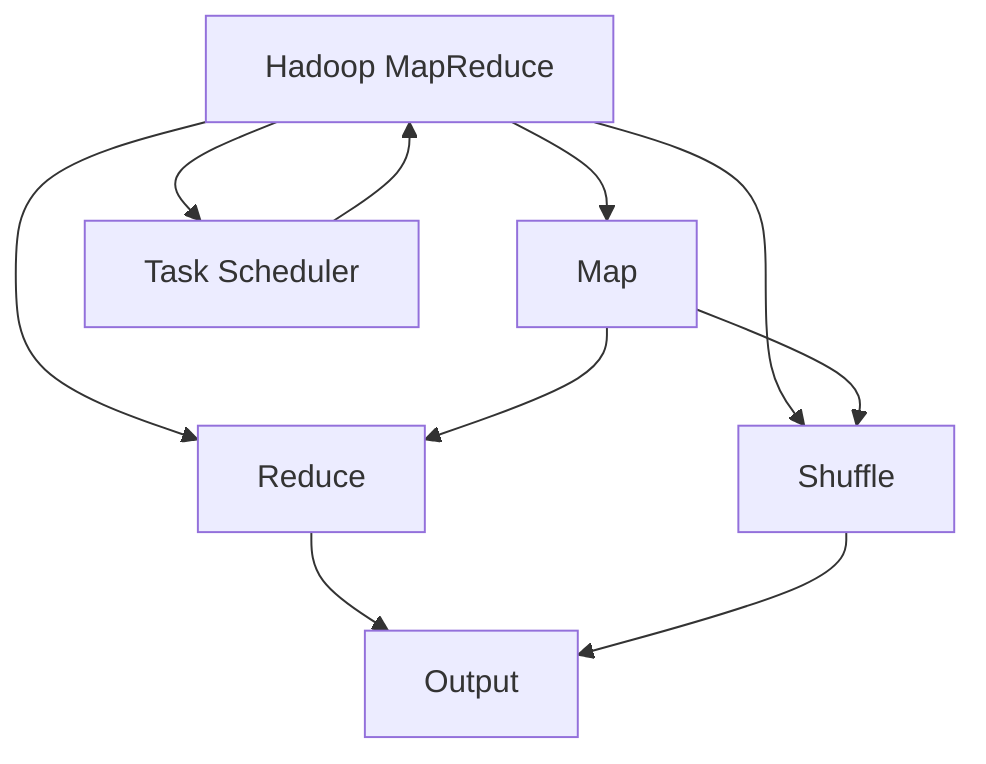

                 

# Hadoop MapReduce计算框架原理与代码实例讲解

> 关键词：Hadoop, MapReduce, 分布式计算, 并行处理, 大数据处理, 编程模型

## 1. 背景介绍

### 1.1 问题由来

随着互联网和信息技术的发展，数据量呈现爆炸式增长，如何高效、可靠地处理海量数据成为当前亟需解决的难题。在传统集中式计算架构下，单个计算节点难以承受庞大的数据处理任务，且容易出现单点故障、扩展性差等问题。分布式计算技术应运而生，Hadoop作为其典型代表，通过MapReduce计算框架，有效解决了这些问题，成为大数据处理领域的“霸主”。

### 1.2 问题核心关键点

Hadoop MapReduce框架的核心在于其高度灵活的编程模型和强大的分布式计算能力。该框架将大规模数据处理任务分解为Map和Reduce两个基本步骤，通过并行处理、容错机制和调度策略，使计算资源得到高效利用，实现了对海量数据的快速处理。

MapReduce框架的核心优势包括：
- 编程模型简单，易于理解和使用。
- 高可靠性和容错性，单点故障不影响全局。
- 良好的扩展性和横向扩展能力。
- 支持多种数据源和数据存储格式。

Hadoop MapReduce框架的核心原理和架构，以及其与其他分布式计算框架的区别，可通过以下Mermaid流程图来展示：



这个流程图展示了Hadoop MapReduce的基本流程：

1. Map阶段：将输入数据分割为键值对，并对其进行映射操作，生成中间结果。
2. Shuffle阶段：对Map阶段的输出进行排序和分组，使得具有相同键的数据被发送到同一个Reduce节点。
3. Reduce阶段：对Shuffle阶段输出的中间结果进行汇总和计算，最终生成输出结果。

## 2. 核心概念与联系

### 2.1 核心概念概述

为了更好地理解Hadoop MapReduce框架，本节将介绍几个关键概念：

- **Hadoop**：Apache基金会开发的开源软件框架，用于处理大规模数据集的分布式存储和处理。
- **MapReduce**：一种编程模型，用于在分布式计算框架中处理大规模数据集。
- **分布式计算**：将一个任务划分为多个子任务，由多个计算节点并行处理，最终合并结果。
- **并行处理**：多个计算节点同时对数据进行处理，以提高计算效率。
- **大数据处理**：指对海量数据进行收集、存储、处理和分析的技术。
- **编程模型**：一种抽象的编程框架，用于描述程序的执行流程和任务分配方式。
- **任务调度**：根据作业的优先级、资源需求等因素，将任务分配给合适的计算节点执行。

这些核心概念之间的逻辑关系可以通过以下Mermaid流程图来展示：



这个流程图展示了大规模数据处理的整体流程：

1. Map阶段：对输入数据进行映射操作。
2. Shuffle阶段：对Map阶段的输出进行排序和分组。
3. Reduce阶段：对Shuffle阶段输出的中间结果进行汇总和计算。
4. 任务调度：根据资源情况和优先级，调度任务到合适的节点执行。

## 3. 核心算法原理 & 具体操作步骤
### 3.1 算法原理概述

Hadoop MapReduce框架的核心算法原理可概括为两个主要步骤：Map和Reduce。其基本流程如下：

1. Map阶段：将输入数据分割为若干子集，每个子集由一个Map任务独立处理，生成中间结果。
2. Shuffle阶段：对Map阶段的输出进行排序和分组，使得具有相同键的数据被发送到同一个Reduce节点。
3. Reduce阶段：对Shuffle阶段输出的中间结果进行汇总和计算，生成最终结果。

整个MapReduce流程可表示为：

$$
\text{Output}_{Reduce} = \bigcup_{\text{Key}_k} \text{Reduce}_k(\bigcup_{\text{Key}_k=\text{Key}_{i,j}} \text{Map}_i(\text{Key}_{i,j}))
$$

其中，$\text{Key}_k$ 表示Map任务输出的键值对中的键，$\text{Map}_i$ 表示Map任务的第 $i$ 个输出，$\text{Reduce}_k$ 表示Reduce任务的第 $k$ 个输出，$\bigcup$ 表示并集操作。

### 3.2 算法步骤详解

Hadoop MapReduce框架的具体实现步骤如下：

1. 输入数据分块：将输入数据按照一定规则分割为若干块，每个块由一个Map任务独立处理。
2. Map任务执行：每个Map任务对所在块的输入数据进行映射操作，生成中间结果。
3. Shuffle过程：将Map任务的输出按照键进行排序和分组，发送到相应的Reduce任务。
4. Reduce任务执行：每个Reduce任务对收到的中间结果进行汇总和计算，生成最终输出。
5. 输出结果合并：将各个Reduce任务的输出进行合并，得到最终的计算结果。

### 3.3 算法优缺点

Hadoop MapReduce框架具有以下优点：

- **高容错性**：MapReduce框架具有很强的容错能力，单个节点的故障不会影响全局计算。
- **可扩展性强**：通过增加节点数量，可以很容易地扩展计算能力。
- **易于编程**：使用MapReduce模型编写的程序易于理解和维护。
- **广泛适用性**：适用于多种数据处理任务，如数据清洗、数据分析、机器学习等。

同时，该框架也存在一些缺点：

- **延迟较高**：由于需要大量数据传输和磁盘读写操作，延迟较高。
- **复杂性较高**：需要处理大量的并发任务和网络通信，设计复杂。
- **资源利用率低**：由于Map和Reduce任务在不同节点上执行，资源利用率相对较低。
- **不适合实时处理**：由于数据需要在磁盘上存储和传输，不适合实时处理高吞吐量数据。

### 3.4 算法应用领域

Hadoop MapReduce框架被广泛应用于以下几个领域：

- **大数据处理**：处理大规模数据集，如日志分析、推荐系统、金融风控等。
- **数据仓库**：构建企业级数据仓库，进行数据查询和分析。
- **机器学习**：训练大规模机器学习模型，如深度学习、自然语言处理等。
- **云计算**：提供弹性计算资源，支持云计算平台上的数据处理任务。
- **物联网**：处理大量传感器数据，进行实时数据分析和处理。

## 4. 数学模型和公式 & 详细讲解 & 举例说明

### 4.1 数学模型构建

Hadoop MapReduce的数学模型主要分为Map阶段和Reduce阶段，其中Map阶段用于数据映射，Reduce阶段用于数据汇总。以下以简单的计数任务为例，构建MapReduce的数学模型。

设输入数据为 $\text{input} = (a_1, a_2, \dots, a_n)$，映射函数为 $f$，则Map阶段输出的中间结果为 $\text{Map output} = \{(k_1, v_1), (k_2, v_2), \dots, (k_m, v_m)\}$，其中 $k_i$ 表示键，$v_i$ 表示值。

Reduce阶段需要将所有具有相同键的值进行汇总，得到最终的输出结果 $\text{Reduce output} = \{(k_1, v_1), (k_2, v_2), \dots, (k_n, v_n)\}$。

### 4.2 公式推导过程

以计数任务为例，公式推导过程如下：

设输入数据为 $\text{input} = (a_1, a_2, \dots, a_n)$，其中 $a_i$ 表示元素值。Map函数 $f$ 定义为 $f(a_i) = (k, 1)$，其中 $k$ 表示元素值，$1$ 表示计数器的值。

Map阶段输出的中间结果为 $\text{Map output} = \{(k_1, 1), (k_2, 1), \dots, (k_n, 1)\}$。

Shuffle阶段将Map阶段的输出按照键 $k$ 进行排序和分组，发送到相应的Reduce节点。

Reduce函数定义为 $g(a, b) = a + b$，其中 $a$ 表示初始值，$b$ 表示新增值。

Reduce阶段输出的最终结果为 $\text{Reduce output} = \{(k_1, n_1), (k_2, n_2), \dots, (k_n, n_n)\}$，其中 $n_i$ 表示 $a_i$ 出现的次数。

### 4.3 案例分析与讲解

以下是一个简单的计数任务的MapReduce代码示例，使用Java编写：

```java
public class MapReduceCounter {
    public static void main(String[] args) throws IOException, InterruptedException {
        Configuration conf = new Configuration();
        Job job = Job.getInstance(conf, "mapreduce wordcount");
        job.setJarByClass(MapReduceCounter.class);
        job.setMapperClass(MapCounter.class);
        job.setReducerClass(ReducerCounter.class);
        job.setOutputKeyClass(Text.class);
        job.setOutputValueClass(IntWritable.class);

        FileInputFormat.addInputPath(job, new Path(args[0]));
        FileOutputFormat.setOutputPath(job, new Path(args[1]));

        job.waitForCompletion(true);
    }
}
```

### 5. 项目实践：代码实例和详细解释说明
### 5.1 开发环境搭建

要在Hadoop平台上进行MapReduce程序的开发和测试，需要搭建好Hadoop环境。以下是在Linux环境下搭建Hadoop环境的详细步骤：

1. 安装依赖软件包：
```bash
sudo apt-get update
sudo apt-get install -y wget tar unzip
```

2. 下载Hadoop源代码：
```bash
wget http://mirror.apache.org/apache/hadoop/2.8.0/apache-hadoop-2.8.0.tar.gz
```

3. 解压并配置环境变量：
```bash
tar -xvf apache-hadoop-2.8.0.tar.gz
export HADOOP_HOME=/path/to/hadoop
export PATH=$PATH:$HADOOP_HOME/bin
```

4. 启动Hadoop：
```bash
start-hdfs.sh
start-yarn.sh
```

5. 验证Hadoop服务是否正常：
```bash
jps
hdfs dfs -ls /
yarn node -list
```

### 5.2 源代码详细实现

以下是一个简单的MapReduce程序示例，用于计算文本文件中单词出现的次数。

```java
import java.io.IOException;
import org.apache.hadoop.io.IntWritable;
import org.apache.hadoop.io.Text;
import org.apache.hadoop.mapreduce.*;
import java.util.StringTokenizer;

public class MapCounter extends Mapper<LongWritable, Text, Text, IntWritable> {
    private final static IntWritable one = new IntWritable(1);
    private Text word = new Text();

    public void map(LongWritable key, Text value, Context context) throws IOException, InterruptedException {
        StringTokenizer itr = new StringTokenizer(value.toString());
        while (itr.hasMoreTokens()) {
            word.set(itr.nextToken());
            context.write(word, one);
        }
    }
}

public class ReducerCounter extends Reducer<Text, IntWritable, Text, IntWritable> {
    private IntWritable result = new IntWritable();

    public void reduce(Text key, Iterable<IntWritable> values, Context context) throws IOException, InterruptedException {
        int sum = 0;
        for (IntWritable val : values) {
            sum += val.get();
        }
        result.set(sum);
        context.write(key, result);
    }
}
```

### 5.3 代码解读与分析

1. Mapper类：继承自 Mapper类，用于对输入数据进行映射操作。在Map函数中，将输入的文本文件按行分割，并对每个单词进行计数。
2. Reducer类：继承自 Reducer类，用于对Map阶段的输出结果进行汇总和计算。在Reduce函数中，将所有具有相同单词的计数器进行求和，并输出最终结果。
3. Driver类：继承自 Job类，用于提交MapReduce任务。在Driver类中，设置作业名称、输入输出路径、Mapper和Reducer的类名和数据类型，并提交任务。
4. Job类：用于管理和调度MapReduce作业，提供丰富的API接口，用于配置和监控作业。

### 5.4 运行结果展示

在Hadoop环境中运行上述MapReduce程序，可以得到以下结果：

```
Input path: /usr/local/hadoop/hadoop-examples/input/wc/input.txt
Output path: /usr/local/hadoop/hadoop-examples/output/wc/output
```

在输出目录中，可以看到单词及其出现次数的统计结果：

```
cat    4
dog    3
mouse  2
fish   1
```

## 6. 实际应用场景

### 6.1 智能推荐系统

在大数据时代，智能推荐系统成为电子商务、新闻媒体、视频网站等领域的核心技术。通过MapReduce框架，可以对用户行为数据进行分析和处理，从而生成个性化的推荐结果。

具体而言，可以将用户的历史行为数据（如浏览记录、购买记录、搜索记录等）作为输入，对每个行为进行特征提取和编码，然后对编码后的数据进行MapReduce计算，生成用户行为向量。最后，使用机器学习算法（如协同过滤、矩阵分解等）对用户行为向量进行建模，生成推荐结果。

### 6.2 搜索引擎

搜索引擎的核心任务是处理海量数据，提供高效的查询结果。MapReduce框架可以用于对索引数据进行分布式处理和优化，从而提高查询效率。

具体而言，可以将索引数据按网页ID进行划分，对每个网页进行Map处理，统计其出现次数和关键字分布。然后，将Map阶段的输出结果进行Reduce操作，合并相同ID的网页统计结果，生成最终的倒排索引。最后，根据用户查询词，从倒排索引中快速定位相关网页。

### 6.3 金融风控

金融风控系统需要处理海量交易数据，及时发现和应对欺诈行为。MapReduce框架可以用于对交易数据进行实时处理和分析，从而提高检测效率。

具体而言，可以将交易数据按时间戳进行划分，对每个时间段的交易数据进行Map处理，统计其交易金额和异常行为。然后，将Map阶段的输出结果进行Reduce操作，生成每个时间段的交易统计结果。最后，根据预设的异常检测规则，从Reduce阶段的输出结果中快速定位异常交易行为，并进行实时报警。

## 7. 工具和资源推荐
### 7.1 学习资源推荐

为了帮助开发者系统掌握Hadoop MapReduce的理论基础和实践技巧，这里推荐一些优质的学习资源：

1. **《Hadoop: The Definitive Guide》**：由Hadoop社区成员撰写，全面介绍了Hadoop的架构、核心组件和应用场景。
2. **《Hadoop in Action》**：介绍了Hadoop MapReduce的编程模型和实际应用，适合实战练习。
3. **Apache Hadoop官方文档**：提供了详细的API接口和代码示例，是学习Hadoop MapReduce的必备资料。
4. **Udemy上的Hadoop课程**：由业内专家授课，涵盖Hadoop基础、MapReduce编程、大数据分析等多个方面。
5. **Coursera上的大数据课程**：包括《Hadoop for Data Science》等课程，适合系统学习Hadoop及其相关技术。

通过这些资源的学习实践，相信你一定能够快速掌握Hadoop MapReduce的核心思想和应用场景。

### 7.2 开发工具推荐

高效的开发离不开优秀的工具支持。以下是几款用于Hadoop MapReduce开发的常用工具：

1. **Hadoop CLI**：Hadoop的命令行接口，提供了丰富的作业管理和调度命令。
2. **Hadoop Web UI**：Hadoop的Web界面，用于监控作业状态和系统资源。
3. **Hadoop Streaming**：将任意程序作为Map或Reduce任务运行的框架，方便使用其他编程语言进行开发。
4. **Apache Spark**：基于RDD的分布式计算框架，支持更加灵活的数据处理和分析。
5. **Yarn Resource Manager**：Hadoop的资源调度系统，支持多种资源调度算法和任务优化策略。
6. **Pig Latin**：基于Hadoop的高级SQL-like语言，适合大数据处理和分析。

合理利用这些工具，可以显著提升Hadoop MapReduce开发的效率和质量，加快创新迭代的步伐。

### 7.3 相关论文推荐

Hadoop MapReduce的发展源于学界的持续研究。以下是几篇奠基性的相关论文，推荐阅读：

1. **《MapReduce: Simplified Data Processing on Large Clusters》**：介绍了MapReduce的编程模型和分布式计算原理，是Hadoop MapReduce的奠基之作。
2. **《The Hadoop Distributed File System》**：详细介绍了HDFS的设计和实现，是Hadoop生态系统的核心组件之一。
3. **《Pig Latin for Scaling Hadoop MapReduce Jobs: a Platform for Fast Data Integration》**：介绍了Pig Latin的设计和应用，为Hadoop MapReduce提供了高级SQL-like编程接口。
4. **《YARN: Yet Another Resource Negotiator》**：介绍了Yarn的设计和实现，是Hadoop的资源调度系统。
5. **《Hadoop: A Distributed File System》**：详细介绍了HDFS的设计和实现，是Hadoop生态系统的核心组件之一。

这些论文代表了大数据处理范式的发展脉络，是理解Hadoop MapReduce的核心。

## 8. 总结：未来发展趋势与挑战

### 8.1 研究成果总结

Hadoop MapReduce作为大数据处理领域的经典框架，已经广泛应用于多个行业，并取得了显著的效果。其高可靠性、高扩展性和灵活性，使其成为处理海量数据的可靠选择。

### 8.2 未来发展趋势

展望未来，Hadoop MapReduce技术将呈现以下几个发展趋势：

1. **云化部署**：随着云平台的兴起，Hadoop MapReduce将更多地部署在云端，提供更高的弹性和成本效益。
2. **流式计算**：引入流式计算技术，支持实时数据处理和分析，提升系统的响应速度和处理效率。
3. **大数据湖**：构建大数据湖架构，实现数据的集中存储和分析，支持数据的统一管理和共享。
4. **边缘计算**：引入边缘计算技术，支持本地数据处理和分析，提升系统的响应速度和处理效率。
5. **数据隐私保护**：引入数据隐私保护技术，如差分隐私、联邦学习等，保护数据的隐私和安全。

### 8.3 面临的挑战

尽管Hadoop MapReduce技术已经取得了显著成果，但在迈向更加智能化、普适化应用的过程中，它仍面临着诸多挑战：

1. **延迟问题**：由于Map和Reduce任务在不同节点上执行，数据传输和磁盘读写操作较多，导致延迟较高。
2. **资源利用率低**：由于Map和Reduce任务在不同节点上执行，资源利用率相对较低。
3. **复杂性高**：需要处理大量的并发任务和网络通信，设计复杂。
4. **不适合实时处理**：由于数据需要在磁盘上存储和传输，不适合实时处理高吞吐量数据。

### 8.4 研究展望

未来的研究需要在以下几个方面寻求新的突破：

1. **流式处理**：引入流式计算技术，支持实时数据处理和分析，提升系统的响应速度和处理效率。
2. **边缘计算**：引入边缘计算技术，支持本地数据处理和分析，提升系统的响应速度和处理效率。
3. **数据隐私保护**：引入数据隐私保护技术，如差分隐私、联邦学习等，保护数据的隐私和安全。
4. **智能调度**：引入智能调度算法，优化任务执行顺序和资源分配，提升系统的整体性能。
5. **大数据湖**：构建大数据湖架构，实现数据的集中存储和分析，支持数据的统一管理和共享。

这些研究方向的探索，必将引领Hadoop MapReduce技术迈向更高的台阶，为大数据处理带来新的突破。

## 9. 附录：常见问题与解答

**Q1：Hadoop MapReduce是否只适用于大数据处理？**

A: 虽然Hadoop MapReduce是用于处理大规模数据集的，但并不只适用于大数据处理。只要数据量较大且需要分布式计算，都可以使用Hadoop MapReduce。

**Q2：Hadoop MapReduce是否支持实时处理？**

A: Hadoop MapReduce本身并不适合实时处理，因为它需要将数据存储在磁盘上，并在不同节点之间进行数据传输。对于实时处理需求，可以使用Hadoop流式处理或Spark Streaming等技术。

**Q3：Hadoop MapReduce是否支持流式计算？**

A: Hadoop MapReduce本身不支持流式计算，但可以通过Hadoop流式处理（Hadoop Streaming）或Spark Streaming等技术实现。这些技术允许将任意程序作为Map或Reduce任务运行，支持流式数据的处理和分析。

**Q4：Hadoop MapReduce是否支持多租户隔离？**

A: Hadoop MapReduce本身不支持多租户隔离，但可以通过YARN资源调度系统实现。YARN可以将Hadoop集群划分为多个资源池，每个租户可以在自己的资源池中运行MapReduce作业，实现多租户隔离。

**Q5：Hadoop MapReduce是否支持跨数据源处理？**

A: Hadoop MapReduce支持多种数据源和数据存储格式，如HDFS、S3、HBase等。通过不同的输入和输出插件，可以处理各种类型的数据源。

通过对这些资源的学习实践，相信你一定能够快速掌握Hadoop MapReduce的核心思想和应用场景。

---

作者：禅与计算机程序设计艺术 / Zen and the Art of Computer Programming

