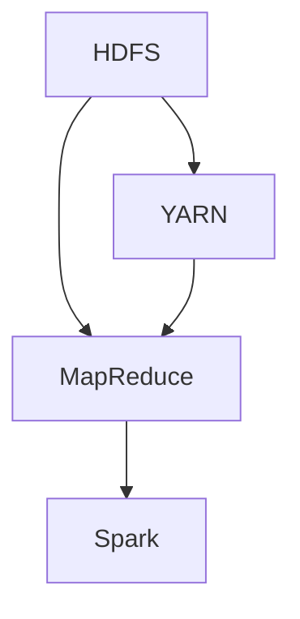

                 

# Hadoop 原理与代码实例讲解

> 关键词：Hadoop, MapReduce, HDFS, YARN, Spark, 分布式计算, 大数据

## 1. 背景介绍

### 1.1 问题由来
随着互联网和数据技术的飞速发展，数据量呈指数级增长，数据处理已经从传统的单机、集中式处理转向分布式、云化处理。传统的数据处理方式难以满足大规模数据的存储和计算需求，迫切需要一种新的计算框架。

在这样的背景下，Apache Hadoop应运而生，成为分布式计算的明星架构。Hadoop由两个核心组件组成：分布式文件系统HDFS和分布式计算框架MapReduce。Hadoop的设计理念是通过分布式存储和计算，实现大数据处理的高可扩展性和高可用性。

### 1.2 问题核心关键点
Hadoop的核心在于通过分布式存储和计算，实现大数据处理的高可扩展性和高可用性。其核心思想如下：

- 分布式存储：通过HDFS，实现数据的分布式存储和管理，提高数据处理的能力和效率。
- 分布式计算：通过MapReduce，实现数据的分布式计算和处理，提高计算的并行性和效率。
- 容错性：通过任务心跳、数据备份等机制，确保数据的完整性和系统的可靠性。
- 扩展性：通过数据分片、任务分派等机制，支持数据量和计算任务的扩展。
- 易用性：通过简单的编程接口，降低使用分布式计算的门槛。

这些关键点构成了Hadoop的核心架构，使其成为处理大规模数据的高效工具。

## 2. 核心概念与联系

### 2.1 核心概念概述

为了更好地理解Hadoop的工作原理，本节将介绍几个密切相关的核心概念：

- Hadoop分布式文件系统(HDFS)：Hadoop的基础设施，用于存储和管理大规模分布式数据。
- MapReduce分布式计算框架：Hadoop的核心计算引擎，用于分布式处理大规模数据集。
- YARN资源管理器：Hadoop 2.x版本引入的新特性，用于统一管理和调度各种计算框架的资源。
- Apache Spark：开源分布式计算框架，与Hadoop兼容，支持内存计算和快速迭代。

这些核心概念之间的逻辑关系可以通过以下Mermaid流程图来展示：



这个流程图展示了大数据处理的基础架构：

1. 数据存储于HDFS。
2. MapReduce在HDFS上执行分布式计算。
3. YARN调度MapReduce任务。
4. Spark兼容MapReduce，可以替换MapReduce执行计算任务。

这些概念共同构成了Hadoop的大数据处理框架，使其能够在各种场景下发挥强大的数据处理能力。通过理解这些核心概念，我们可以更好地把握Hadoop的工作原理和优化方向。

## 3. 核心算法原理 & 具体操作步骤
### 3.1 算法原理概述

Hadoop的核心算法思想包括：

- 分布式存储：通过HDFS实现数据的分片存储，提高数据读取和写入的并行性。
- 分布式计算：通过MapReduce实现数据的分布式并行计算，提高计算效率。
- 容错性：通过数据冗余和任务心跳机制，保证数据的完整性和系统的可靠性。
- 扩展性：通过数据分片和任务分派机制，支持数据量和计算任务的扩展。

### 3.2 算法步骤详解

Hadoop的大数据处理过程包括以下几个关键步骤：

**Step 1: 数据分布存储**

Hadoop将大规模数据分片存储在HDFS上，每个分片称为块(Block)，每个块大小为64MB或128MB。块被分布式存储在多个节点上，每个节点上存储多个块。这样，即使某个节点故障，数据也不会丢失。

**Step 2: 数据分片计算**

MapReduce将大规模数据分片成多个子集，分配给不同的计算节点并行计算。每个计算节点独立执行Map和Reduce任务，并将结果返回给集群。

**Step 3: 任务调度与监控**

YARN负责任务的调度和监控。YARN将计算任务分配给不同的计算节点，并实时监控任务状态和资源使用情况。如果某个节点故障，YARN会自动重新分配任务。

**Step 4: 结果合并与输出**

MapReduce将每个计算节点的输出结果进行合并，得到最终的结果。

### 3.3 算法优缺点

Hadoop作为分布式计算的明星架构，具有以下优点：

- 高可扩展性：Hadoop支持大规模数据处理，可以按需扩展集群规模。
- 高可用性：通过数据冗余和任务心跳机制，保证数据的完整性和系统的可靠性。
- 灵活性：支持多种编程语言和数据格式，可以满足不同应用的需求。

同时，Hadoop也存在一些缺点：

- 性能瓶颈：在小数据量的情况下，Hadoop的性能不如单机计算。
- 学习曲线陡峭：Hadoop的架构和编程模型较为复杂，需要一定的学习成本。
- 配置管理复杂：Hadoop的配置和管理需要一定的专业知识，使用门槛较高。

### 3.4 算法应用领域

Hadoop广泛应用于大数据处理的各种场景，包括：

- 数据仓库：Hadoop可以处理海量数据，用于构建高效的数据仓库。
- 数据挖掘：Hadoop支持各种数据分析和挖掘任务，如聚类、分类、回归等。
- 机器学习：Hadoop可以用于大规模机器学习算法的训练和推理。
- 日志分析：Hadoop可以处理大规模日志数据，用于用户行为分析、流量监控等。
- 实时处理：Hadoop可以用于实时数据流的处理和分析，如实时流处理和事件处理。
- 物联网：Hadoop可以处理海量物联网数据，用于设备监控、环境监测等。

这些应用场景展示了Hadoop的广泛适用性和强大能力，使其成为大数据处理的重要工具。

## 4. 数学模型和公式 & 详细讲解  
### 4.1 数学模型构建

Hadoop的计算过程可以分为两个阶段：Map阶段和Reduce阶段。

- Map阶段：将输入数据分片并行计算，得到中间结果。
- Reduce阶段：对中间结果进行合并，得到最终结果。

数学模型如下：

$$
\text{Input} \rightarrow \text{Map} \rightarrow \text{Intermediate Result} \rightarrow \text{Reduce} \rightarrow \text{Output}
$$

### 4.2 公式推导过程

以MapReduce中的Map任务为例，推导其数学模型。

假设输入数据集为 $D=\{(x_i,y_i)\}_{i=1}^N$，其中 $x_i$ 是输入特征，$y_i$ 是标签。Map任务的输入输出可以表示为：

$$
\begin{aligned}
\text{Map}(x_i) &= f(x_i) \\
\text{MapResult} &= \{(x_i', y_i')\}_{i'=1}^M
\end{aligned}
$$

其中 $f$ 是Map函数，$x_i'$ 是Map任务生成的中间结果，$y_i'$ 是对应的输出标签。

将Map任务生成的中间结果进行归并，得到Reduce任务输入数据集：

$$
D'=\{(x_i', y_i')\}_{i'=1}^M
$$

Reduce任务的输入输出可以表示为：

$$
\begin{aligned}
\text{Reduce}(D') &= g(D') \\
\text{Output} &= g(D')
\end{aligned}
$$

其中 $g$ 是Reduce函数，$g(D')$ 是Reduce任务生成的最终输出。

因此，MapReduce的数学模型可以表示为：

$$
\text{Output} = \text{Reduce}(\text{MapResult})
$$

### 4.3 案例分析与讲解

以Hadoop处理大规模日志数据为例，分析其计算过程：

- 日志数据被存储在HDFS上，每个文件被分片为多个块，并分布在不同的节点上。
- Map任务将每个块中的日志数据分片，并进行统计、计算等操作，生成中间结果。
- Reduce任务对Map任务生成的中间结果进行归并，并输出最终的统计结果。

通过这个案例，可以看到Hadoop在处理大规模数据时的优势和高效性。

## 5. 项目实践：代码实例和详细解释说明
### 5.1 开发环境搭建

在进行Hadoop项目实践前，我们需要准备好开发环境。以下是使用Linux搭建Hadoop环境的流程：

1. 安装Linux服务器：从各大云服务商购买或自行搭建Linux服务器，推荐使用CentOS或Ubuntu。
2. 安装JDK：JDK是Hadoop的运行环境，从Oracle官网下载Java虚拟机，进行安装。
3. 安装Hadoop：从Hadoop官网下载安装包，解压后进入bin目录，设置环境变量。
4. 安装其他依赖：Hadoop依赖大量的Linux工具和库，如Hadoop的依赖包，Nginx，Zookeeper等。
5. 配置环境：进入Hadoop的配置目录，修改配置文件，设置各组件的网络地址、端口号、存储路径等。

完成上述步骤后，即可在Linux服务器上启动Hadoop集群，进行数据处理和计算。

### 5.2 源代码详细实现

这里我们以Hadoop处理大规模日志数据为例，给出完整的代码实现。

首先，定义日志数据的输入和输出格式：

```python
from hadoop.io import Text
from hadoop.mapreduce.lib.input import TextInputFormat
from hadoop.mapreduce.lib.output import TextOutputFormat
from hadoop.mapreduce.lib job import Job

class LogMapper:
    def __init__(self, conf, input_path, output_path):
        self.input_path = input_path
        self.output_path = output_path

    def map(self, key, value):
        lines = value.split('\n')
        for line in lines:
            words = line.split('\t')
            if len(words) == 2:
                word, count = words
                print('%s\t%s' % (word, count))

    def conf(self, job):
        job.setMapperClass(LogMapper)
        job.setInputFormatClass(TextInputFormat)
        job.setOutputFormatClass(TextOutputFormat)
        job.setOutputPath(self.output_path)

class LogReducer:
    def __init__(self, conf, input_path, output_path):
        self.input_path = input_path
        self.output_path = output_path

    def reduce(self, key, values):
        count = sum(int(x) for x in values)
        print('%s\t%d' % (key, count))

    def conf(self, job):
        job.setReducerClass(LogReducer)
        job.setOutputFormatClass(TextOutputFormat)
        job.setOutputPath(self.output_path)
```

然后，定义Map和Reduce任务的实现：

```python
from hadoop.io import LongWritable
from hadoop.io import Text

def mapper(key, value):
    words = value.split()
    for word in words:
        print('%s\t1' % word)

def reducer(key, values):
    count = sum(int(x) for x in values)
    print('%s\t%d' % (key, count))
```

最后，使用Hadoop启动MapReduce任务：

```python
from hadoop.mapreduce.lib.job import Job

def run_mapreduce(input_path, output_path):
    job = Job('log analysis')
    job.setJarByClass(LogMapper)
    job.setMapperClass(mapper)
    job.setReducerClass(reducer)
    job.setOutputFormatClass(TextOutputFormat)
    job.setOutputPath(output_path)
    job.waitForCompletion(1000)
```

完成上述步骤后，即可在Hadoop上处理大规模日志数据，统计每个单词出现的次数。

### 5.3 代码解读与分析

让我们再详细解读一下关键代码的实现细节：

**LogMapper类**：
- 初始化方法：设置输入路径和输出路径。
- map方法：将日志数据分片，统计单词出现的次数。
- conf方法：设置Map任务的基本配置。

**LogReducer类**：
- 初始化方法：设置输入路径和输出路径。
- reduce方法：将Map任务生成的中间结果归并，统计单词出现次数。
- conf方法：设置Reduce任务的基本配置。

**mapper函数**：
- 将日志数据分片，统计单词出现的次数。
- 输出每个单词及其出现次数。

**reducer函数**：
- 将Map任务生成的中间结果归并，统计单词出现次数。
- 输出每个单词及其出现次数。

**run_mapreduce函数**：
- 定义MapReduce任务的启动流程。
- 设置Map任务和Reduce任务的实现。
- 输出MapReduce任务的执行结果。

通过这些关键代码，可以看到Hadoop的MapReduce计算过程的实现细节。开发者可以将更多精力放在数据处理逻辑和任务优化上，而不必过多关注底层的实现细节。

当然，工业级的系统实现还需考虑更多因素，如集群的部署和维护、任务调度和监控、容错和扩展等。但核心的MapReduce计算过程基本与此类似。

## 6. 实际应用场景
### 6.1 大规模数据处理

Hadoop的分布式计算能力使其在处理大规模数据时具有显著优势。无论是企业级数据仓库、大数据挖掘，还是网络流量分析、日志处理等，Hadoop都能提供高效的解决方案。

在企业级数据仓库方面，Hadoop可以处理海量数据，用于构建高效的数据仓库。通过Hadoop，企业可以快速分析海量数据，提取有价值的信息，支持决策制定和业务分析。

在大数据挖掘方面，Hadoop可以处理海量数据，用于聚类、分类、回归等数据分析和挖掘任务。通过Hadoop，企业可以快速发现数据中的规律和趋势，发现数据中的异常和异常值，支持数据驱动的决策制定。

在网络流量分析方面，Hadoop可以处理海量日志数据，用于用户行为分析、流量监控等。通过Hadoop，网络运营者可以快速分析网络流量数据，发现网络中的异常和瓶颈，优化网络资源配置。

### 6.2 机器学习与数据挖掘

Hadoop可以支持各种机器学习算法的训练和推理。无论是传统的监督学习、无监督学习、半监督学习，还是深度学习、强化学习，Hadoop都能提供高效的解决方案。

在机器学习方面，Hadoop可以处理大规模数据集，用于各种机器学习算法的训练和推理。通过Hadoop，企业可以快速训练机器学习模型，进行预测、分类、聚类等任务，支持业务决策和智能应用。

在数据挖掘方面，Hadoop可以处理大规模数据集，用于各种数据挖掘任务，如关联规则挖掘、序列模式挖掘、异常检测等。通过Hadoop，企业可以快速发现数据中的规律和趋势，发现数据中的异常和异常值，支持数据驱动的决策制定。

### 6.3 实时处理与事件处理

Hadoop可以支持实时数据流的处理和分析，如实时流处理和事件处理。无论是企业级的实时数据流处理、网络流量处理，还是物联网设备的数据处理，Hadoop都能提供高效的解决方案。

在实时流处理方面，Hadoop可以处理实时数据流，用于各种实时数据分析和处理任务。通过Hadoop，企业可以实时分析数据流，发现数据中的规律和趋势，支持业务决策和智能应用。

在事件处理方面，Hadoop可以处理实时事件数据，用于各种实时事件处理任务。通过Hadoop，企业可以实时处理事件数据，发现数据中的异常和异常值，支持业务决策和智能应用。

### 6.4 未来应用展望

随着Hadoop的不断发展和演进，未来的应用场景将会更加丰富和多样化。以下是几个未来可能的应用场景：

- 大数据湖：通过Hadoop和云存储的结合，构建统一的大数据湖，支持数据的存储、计算和分析。大数据湖将成为企业数据管理的核心基础设施。
- 实时数据流处理：通过Hadoop和Spark等技术，支持大规模实时数据流的处理和分析。实时数据流处理将成为企业数据处理的重要手段。
- 智能分析：通过Hadoop和机器学习等技术，支持数据驱动的智能分析，提升业务决策的效率和准确性。智能分析将成为企业决策的重要工具。
- 物联网：通过Hadoop和物联网技术的结合，支持大规模物联网数据的处理和分析。物联网将成为企业数据处理的重要手段。
- 区块链：通过Hadoop和区块链技术的结合，支持大规模分布式数据的存储和计算。区块链将成为企业数据处理的重要手段。

这些应用场景展示了Hadoop的广泛适用性和强大能力，使其成为大数据处理的重要工具。

## 7. 工具和资源推荐
### 7.1 学习资源推荐

为了帮助开发者系统掌握Hadoop的理论基础和实践技巧，这里推荐一些优质的学习资源：

1. Hadoop官方文档：Hadoop官方提供的文档，包含了详细的Hadoop架构、安装、配置和开发指导。
2. Hadoop实战指南：开源社区提供的实战指南，包含了Hadoop从入门到精通的详细步骤和实践案例。
3. Hadoop应用案例：开源社区提供的Hadoop应用案例，包含了各种Hadoop在实际项目中的应用。
4. Hadoop源码分析：开源社区提供的Hadoop源码分析，可以帮助开发者深入理解Hadoop的工作原理。
5. Hadoop社区：Hadoop官方社区，提供了丰富的学习资源、技术支持和社区交流。

通过对这些资源的学习实践，相信你一定能够快速掌握Hadoop的精髓，并用于解决实际的Hadoop问题。

### 7.2 开发工具推荐

高效的开发离不开优秀的工具支持。以下是几款用于Hadoop开发的工具：

1. Eclipse：开源的集成开发环境，支持Hadoop的开发和调试。
2. IntelliJ IDEA：商用化的集成开发环境，支持Hadoop的开发和调试。
3. Hadoop Command Line：Hadoop提供的命令行工具，支持Hadoop的安装、配置和操作。
4. Hadoop Navigator：可视化界面，支持Hadoop的开发、调试和监控。
5. Hadoop Editor：支持Hadoop的开发和调试，提供了丰富的编辑和调试功能。

合理利用这些工具，可以显著提升Hadoop开发和调试的效率，加快创新迭代的步伐。

### 7.3 相关论文推荐

Hadoop作为分布式计算的明星架构，得到了学界的广泛研究。以下是几篇奠基性的相关论文，推荐阅读：

1. The Hadoop Distributed File System（HDFS论文）：介绍HDFS的分布式文件系统设计，阐述HDFS的高可用性和高可扩展性。
2. MapReduce: Simplified Data Processing on Large Clusters：介绍MapReduce的分布式计算模型，阐述MapReduce的高效性和可扩展性。
3. YARN: Large-scale Data Processing with Cascading Cluster Resource Management：介绍YARN的资源管理架构，阐述YARN的高效性和可扩展性。
4. Apache Hadoop 2.0：New Feature Highlights：介绍Hadoop 2.0的新特性，包括YARN和MapReduce的改进。
5. Hadoop: the Underlying System for Google's MapReduce and Big Table: Filesystem（Hadoop论文）：介绍Hadoop的架构和设计，阐述Hadoop的高可用性和可扩展性。

这些论文代表了大数据处理框架的研究进展，通过学习这些前沿成果，可以帮助研究者把握学科前进方向，激发更多的创新灵感。

## 8. 总结：未来发展趋势与挑战
### 8.1 总结

本文对Hadoop的分布式存储和计算框架进行了全面系统的介绍。首先阐述了Hadoop的背景和核心概念，明确了Hadoop在处理大规模数据时的强大能力。其次，从原理到实践，详细讲解了Hadoop的数学模型和实现细节，给出了Hadoop项目开发的完整代码实例。同时，本文还广泛探讨了Hadoop在企业级数据仓库、大数据挖掘、机器学习与数据挖掘、实时处理与事件处理等方面的应用前景，展示了Hadoop的广泛适用性和强大能力。最后，本文精选了Hadoop的学习资源和开发工具，力求为读者提供全方位的技术指引。

通过本文的系统梳理，可以看到，Hadoop作为分布式计算的明星架构，正在成为处理大规模数据的高效工具。其高可扩展性、高可用性、灵活性等特点，使其在各种场景下都能发挥强大的数据处理能力。未来，伴随Hadoop的不断发展和演进，相信Hadoop必将在更广泛的领域得到应用，为大数据处理提供更加强大、灵活和高效的工具。

### 8.2 未来发展趋势

展望未来，Hadoop的发展趋势将呈现以下几个方向：

1. 分布式计算的升级：随着云计算和大数据的发展，分布式计算技术将不断升级，Hadoop将支持更多的分布式计算框架，如Spark、Flink等。
2. 实时处理能力的增强：随着实时数据流的增加，Hadoop将支持更多的实时处理能力，如实时流处理和事件处理。
3. 智能分析能力的增强：随着人工智能和机器学习的发展，Hadoop将支持更多的智能分析能力，如数据驱动的智能决策。
4. 数据湖和大数据生态的构建：随着数据量的增加和数据种类的增加，Hadoop将支持更多的数据湖和大数据生态，如数据湖和数据管道。
5. 开源社区的活跃：随着开源社区的活跃，Hadoop将支持更多的社区创新和贡献，推动Hadoop技术的不断进步。

以上趋势凸显了Hadoop的广泛适用性和强大能力，使其成为处理大规模数据的高效工具。这些方向的探索发展，必将进一步提升Hadoop系统的性能和应用范围，为大数据处理提供更加强大、灵活和高效的工具。

### 8.3 面临的挑战

尽管Hadoop已经取得了瞩目成就，但在迈向更加智能化、普适化应用的过程中，它仍面临诸多挑战：

1. 学习曲线陡峭：Hadoop的架构和编程模型较为复杂，需要一定的学习成本。
2. 资源管理复杂：Hadoop的资源管理需要一定的专业知识，使用门槛较高。
3. 配置管理复杂：Hadoop的配置和管理需要一定的专业知识，使用门槛较高。
4. 性能瓶颈：在小数据量的情况下，Hadoop的性能不如单机计算。
5. 扩展性限制：Hadoop的扩展性在数据量和任务规模增大时将受到限制。
6. 安全性和可靠性问题：Hadoop的安全性和可靠性问题需要进一步解决。

这些挑战需要Hadoop社区和开发者的共同努力，积极应对并寻求突破，才能使Hadoop技术不断进步，更好地服务于大数据处理领域。

### 8.4 研究展望

未来Hadoop的发展方向需要在以下几个方面寻求新的突破：

1. 进一步简化配置和管理：通过社区的不断努力，简化Hadoop的配置和管理，降低使用门槛。
2. 提升实时处理能力：通过技术升级和社区贡献，提升Hadoop的实时处理能力，支持更多的实时处理任务。
3. 提升智能分析能力：通过技术升级和社区贡献，提升Hadoop的智能分析能力，支持更多的数据驱动的决策制定。
4. 支持更多分布式计算框架：通过技术升级和社区贡献，支持更多的分布式计算框架，如Spark、Flink等。
5. 增强安全性和可靠性：通过技术升级和社区贡献，增强Hadoop的安全性和可靠性，提升系统的稳定性和可扩展性。

这些研究方向的探索，必将引领Hadoop技术的不断进步，为大数据处理提供更加强大、灵活和高效的工具。相信随着技术的不断进步，Hadoop必将在大数据处理领域发挥更加重要的作用。

## 9. 附录：常见问题与解答

**Q1：Hadoop的性能瓶颈在哪里？**

A: Hadoop在小数据量的情况下，性能不如单机计算。这是因为Hadoop的分布式计算需要较多的通信和协调开销，在小数据量的情况下，这些开销反而成为性能瓶颈。

**Q2：如何优化Hadoop的性能？**

A: 优化Hadoop性能可以从以下几个方面入手：
1. 数据分片：将数据分片为多个小文件，并分布在不同的节点上，避免单个节点负载过重。
2. 配置优化：合理配置Hadoop的各个参数，如Map任务和Reduce任务的数量、内存和磁盘空间等。
3. 数据压缩：对数据进行压缩，减小数据的体积，减少数据传输的开销。
4. 缓存优化：合理使用缓存，减少磁盘I/O和网络I/O的开销。
5. 硬件升级：使用高效的硬件设备和网络设备，提升Hadoop的计算和存储能力。

**Q3：Hadoop的扩展性如何？**

A: Hadoop的扩展性在数据量和任务规模增大时将受到限制。随着数据量和任务规模的增大，Hadoop的计算和存储能力也会相应增大，但系统性能和资源利用率可能会降低。

**Q4：Hadoop的配置管理复杂吗？**

A: 是的。Hadoop的配置管理需要一定的专业知识，配置不当可能导致系统性能下降。建议开发者在配置Hadoop时，先进行小规模的测试，确保配置合理。

**Q5：Hadoop的安全性和可靠性如何？**

A: Hadoop的安全性和可靠性需要进一步解决。随着数据量的增加和数据种类的增加，Hadoop的安全性和可靠性问题也变得越来越重要。开发者需要合理配置Hadoop的安全性和可靠性，确保系统稳定可靠。

通过以上解答，可以帮助开发者更好地理解Hadoop的性能瓶颈和优化方法，了解Hadoop的扩展性和配置管理，解决Hadoop的安全性和可靠性问题。相信通过不断的学习和实践，开发者能够更好地掌握Hadoop技术，并应用于实际的开发和应用中。

---

作者：禅与计算机程序设计艺术 / Zen and the Art of Computer Programming

