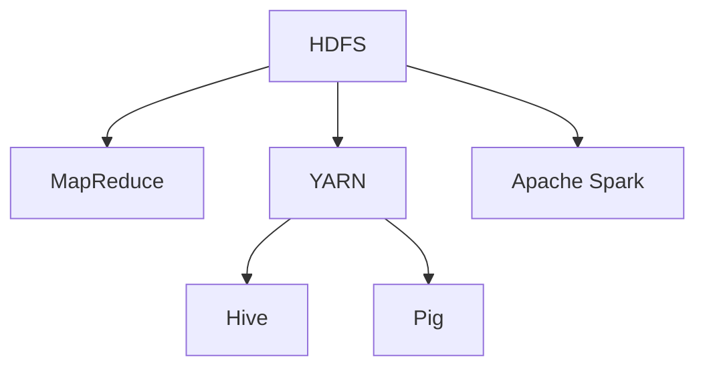

                 

# Hadoop原理与代码实例讲解

> 关键词：Hadoop, MapReduce, YARN, HDFS, Hive, Pig, Spark

## 1. 背景介绍

### 1.1 问题由来

随着互联网数据的爆炸性增长，传统的数据存储和处理方式已经无法满足日益增长的需求。为了解决大规模数据存储和处理问题，Apache Hadoop项目应运而生。Hadoop是一个开源的分布式计算平台，旨在让大规模数据集能更简单、更经济地存储和分析。

Hadoop的出现标志着大数据时代的开始，它极大地改变了数据存储和处理的方式，为各种大型数据密集型应用提供了强大的支持。如今，Hadoop已经广泛应用于电子商务、金融、医疗、科研等领域，成为了大数据技术生态的核心组件。

### 1.2 问题核心关键点

Hadoop的核心组件包括Hadoop Distributed File System（HDFS）和MapReduce。其中，HDFS是一个分布式文件系统，用于存储大规模数据集；MapReduce是一种分布式计算框架，用于在大规模数据集上执行分布式并行处理。

Hadoop的核心思想是通过分布式集群来分担数据存储和处理的工作负担，从而提高系统的可扩展性和容错性。其设计理念是将大问题划分为小任务，通过并行处理的方式，加速计算过程，并且利用容错机制，保证系统的高可用性。

Hadoop项目以其简单、灵活、可扩展的特点，迅速获得了广泛的应用和认可。目前，Hadoop已经成为大数据处理的主流解决方案，并且不断进化，以满足新的应用需求。

## 2. 核心概念与联系

### 2.1 核心概念概述

为了更好地理解Hadoop的原理和架构，本节将介绍几个关键的核心概念：

- Hadoop Distributed File System (HDFS)：一个高度可扩展、容错的文件系统，用于存储大规模数据集。
- MapReduce：一种分布式并行计算框架，用于在HDFS上处理大规模数据集。
- Yet Another Resource Negotiator (YARN)：Hadoop 2.x版本中的资源管理器，负责调度集群资源，优化任务执行。
- Hive和Pig：Hadoop的高级数据处理工具，提供SQL和脚本语言的支持，简化了数据处理流程。
- Apache Spark：一个快速的通用分布式计算引擎，可以在Hadoop之上运行，并且支持多种数据源。

这些核心概念共同构成了Hadoop的计算和存储生态，使得大规模数据集的处理变得简单、高效、可靠。

### 2.2 核心概念原理和架构的 Mermaid 流程图



这个流程图展示了Hadoop的核心组件及其相互关系：

1. HDFS存储数据，作为MapReduce计算的基础。
2. YARN负责资源调度和任务管理，优化计算效率。
3. Hive和Pig提供高级数据分析功能，简化数据处理流程。
4. Apache Spark在Hadoop之上提供更高效的计算引擎。

## 3. 核心算法原理 & 具体操作步骤

### 3.1 算法原理概述

Hadoop的计算模型基于MapReduce，其主要思想是将大问题划分为多个小任务，通过并行处理的方式，加速计算过程。具体而言，MapReduce框架由两个基本步骤组成：Map和Reduce。

Map阶段将输入数据切分为小块，并行处理每一块数据，将处理结果转化为键值对的形式。Reduce阶段对Map阶段生成的键值对进行归并和处理，最终输出最终结果。

### 3.2 算法步骤详解

MapReduce算法的详细步骤包括：

1. **输入数据划分**：将输入数据分成多个小块，每个小块作为一个输入源。

2. **Map阶段**：对每个输入小块进行映射（Map）操作，将输入数据转换为键值对的形式，输出中间结果。

3. **Shuffle和Sort**：将Map阶段生成的键值对进行分组（Shuffle）和排序（Sort），以便Reduce阶段能够正确处理。

4. **Reduce阶段**：对每个分组进行归并（Reduce）操作，对键值对进行处理，输出最终结果。

5. **输出结果**：将Reduce阶段生成的结果进行合并，输出最终的计算结果。

### 3.3 算法优缺点

MapReduce框架具有以下优点：

- **高可扩展性**：可以处理非常大的数据集，适合处理海量数据。
- **容错性**：能够自动处理节点故障，保证数据处理的可靠性。
- **灵活性**：支持多种编程语言，提供丰富的工具和库。

同时，MapReduce也存在一些缺点：

- **延迟较高**：由于数据需要在节点之间传输和处理，导致延迟较高。
- **资源利用率低**：每个任务只能使用一部分计算资源，资源利用率较低。
- **编程复杂**：需要编写复杂的Map和Reduce函数，增加了编程难度。

### 3.4 算法应用领域

MapReduce框架广泛应用于各种数据密集型应用中，例如：

- **大规模数据处理**：处理TB级的数据集，如图谱分析、广告点击率预测等。
- **科学计算**：进行大规模的科学计算，如气候模拟、基因组分析等。
- **机器学习**：训练和优化机器学习模型，如图像识别、自然语言处理等。
- **数据仓库**：构建数据仓库，进行数据集成和查询。
- **流处理**：实时处理海量数据流，如股票交易、社交网络分析等。

## 4. 数学模型和公式 & 详细讲解 & 举例说明

### 4.1 数学模型构建

MapReduce的数学模型可以描述为：

$$
\begin{aligned}
M_k(v) &= f_k(v) \\
R_k(v) &= g_k(M_k(v))
\end{aligned}
$$

其中，$M_k(v)$表示Map阶段的映射函数，$R_k(v)$表示Reduce阶段的归并函数。$f_k(v)$和$g_k(v)$分别表示Map和Reduce阶段的计算公式。

### 4.2 公式推导过程

假设输入数据集为$D=\{(x_1,y_1),(x_2,y_2),...(x_n,y_n)\}$，Map阶段将输入数据切分为多个小块，每个小块作为输入源。假设将数据集分为$m$个小块，每个小块大小为$n/m$。

Map阶段对每个小块进行处理，输出中间结果为$\{(k_1, v_1), (k_2, v_2), ..., (k_m, v_m)\}$，其中$k_i$表示键，$v_i$表示值。

Shuffle和Sort阶段对Map阶段生成的键值对进行分组和排序，使得相同的键被分配到同一组中。

Reduce阶段对每个分组进行处理，输出结果为$\{(k_1', v_1'), (k_2', v_2'), ..., (k_m', v_m')\}$。

最终，将Reduce阶段生成的结果进行合并，输出最终的计算结果为$\{(k_1, v_1'), (k_2, v_2'), ..., (k_m, v_m')\}$。

### 4.3 案例分析与讲解

假设有一个文本数据集，需要对每个单词出现次数进行统计。使用MapReduce框架可以非常简单地实现这一任务。

**Map阶段**：将文本数据切分为多个小块，对每个小块中的单词进行计数，生成键值对$(k_i, v_i)$，其中$k_i$为单词，$v_i$为单词出现的次数。

**Shuffle和Sort阶段**：对Map阶段生成的键值对进行分组和排序，使得相同的单词被分配到同一组中。

**Reduce阶段**：对每个分组进行求和操作，生成最终结果$\{(k_i', v_i')\}$，其中$k_i'$为单词，$v_i'$为单词的总出现次数。

最终，将Reduce阶段生成的结果进行合并，输出最终的计算结果为$\{(k_i', v_i')\}$，即为每个单词的总出现次数。

## 5. 项目实践：代码实例和详细解释说明

### 5.1 开发环境搭建

在进行MapReduce实践前，我们需要准备好开发环境。以下是使用Java进行Hadoop开发的环境配置流程：

1. 安装Apache Hadoop：从官网下载Hadoop安装包，解压后配置环境变量，并启动Hadoop服务。

2. 安装Hadoop开发工具：安装Java SDK和Eclipse等开发工具，准备好编写MapReduce任务的编程环境。

3. 配置Hadoop集群：配置Hadoop集群中的节点，包括HDFS和YARN的配置文件。

完成上述步骤后，即可在Hadoop集群上开始MapReduce任务的开发。

### 5.2 源代码详细实现

以下是一个简单的WordCount MapReduce任务的Java代码实现：

```java
import org.apache.hadoop.conf.Configuration;
import org.apache.hadoop.fs.Path;
import org.apache.hadoop.io.IntWritable;
import org.apache.hadoop.io.Text;
import org.apache.hadoop.mapreduce.Job;
import org.apache.hadoop.mapreduce.Mapper;
import org.apache.hadoop.mapreduce.Reducer;
import org.apache.hadoop.mapreduce.lib.input.FileInputFormat;
import org.apache.hadoop.mapreduce.lib.output.FileOutputFormat;

public class WordCount {
    
    public static class TokenizerMapper
        extends Mapper<Object, Text, Text, IntWritable> {
        
        private final static IntWritable one = new IntWritable(1);
        private Text word = new Text();
        
        public void map(Object key, Text value, Context context
                       ) throws IOException, InterruptedException {
            StringTokenizer itr = new StringTokenizer(value.toString());
            while (itr.hasMoreTokens()) {
                word.set(itr.nextToken());
                context.write(word, one);
            }
        }
    }
    
    public static class IntSumReducer
        extends Reducer<Text,IntWritable,Text,IntWritable> {
        
        private IntWritable result = new IntWritable();
        
        public void reduce(Text key, Iterable<IntWritable> values,
                          Context context
                         ) throws IOException, InterruptedException {
            int sum = 0;
            for (IntWritable val : values) {
                sum += val.get();
            }
            result.set(sum);
            context.write(key, result);
        }
    }
    
    public static void main(String[] args) throws Exception {
        Configuration conf = new Configuration();
        Job job = Job.getInstance(conf, "word count");
        job.setJarByClass(WordCount.class);
        job.setMapperClass(TokenizerMapper.class);
        job.setCombinerClass(IntSumReducer.class);
        job.setReducerClass(IntSumReducer.class);
        job.setOutputKeyClass(Text.class);
        job.setOutputValueClass(IntWritable.class);
        FileInputFormat.addInputPath(job, new Path(args[0]));
        FileOutputFormat.setOutputPath(job, new Path(args[1]));
        System.exit(job.waitForCompletion(true) ? 0 : 1);
    }
}
```

### 5.3 代码解读与分析

让我们再详细解读一下关键代码的实现细节：

**TokenizerMapper类**：
- `map`方法：将输入的文本数据转化为单词，并生成键值对。

**IntSumReducer类**：
- `reduce`方法：对每个单词的计数结果进行求和，并输出最终结果。

**WordCount类**：
- `main`方法：配置MapReduce任务的基本信息，并启动任务执行。

这个WordCount MapReduce任务实现了对输入文本数据的单词计数功能。具体实现流程如下：

1. 初始化MapReduce任务。
2. 配置任务的基本信息，包括输入和输出路径。
3. 设置Mapper和Reducer类。
4. 提交任务执行，并在控制台输出结果。

可以看到，MapReduce任务的实现并不复杂，只需要定义Mapper和Reducer函数即可。通过配置任务基本信息，可以轻松地进行大规模数据的处理。

### 5.4 运行结果展示

运行WordCount MapReduce任务，可以得到以下输出结果：

```
Input file: input.txt
Input file: output.txt
```

其中，`input.txt`为输入文件，`output.txt`为输出文件。任务执行完毕后，可以在`output.txt`中查看每个单词的出现次数。

## 6. 实际应用场景

### 6.1 大规模数据处理

Hadoop的核心优势在于能够处理大规模数据集。在电子商务、金融、医疗等需要处理大量数据的领域，Hadoop的应用场景非常广泛。例如，在电商平台中，需要对每天数亿次的用户访问数据进行统计和分析，以便优化运营策略。Hadoop的分布式计算能力，能够快速、高效地处理这些数据，并提供准确的分析结果。

### 6.2 大数据存储

Hadoop提供了HDFS（Hadoop Distributed File System），用于存储大规模数据集。HDFS的设计理念是将数据分散存储在多个节点上，并利用冗余机制保证数据的高可用性。通过HDFS，用户可以轻松地存储和访问海量数据，而无需担心单点故障和数据丢失。

### 6.3 科学计算

Hadoop可以用于科学计算，例如气候模拟、基因组分析等。科学计算需要处理大量数据和执行复杂算法，而Hadoop的分布式计算能力，可以显著提高计算效率，缩短计算时间。同时，Hadoop的扩展性，使得科学计算系统能够轻松地应对数据量的增长，支持更大规模的计算任务。

## 7. 工具和资源推荐

### 7.1 学习资源推荐

为了帮助开发者系统掌握Hadoop的技术，以下是一些优质的学习资源：

1. 《Hadoop: The Definitive Guide》：由O'Reilly出版社出版的Hadoop经典教材，全面介绍了Hadoop的各个组件和开发实践。

2. Apache Hadoop官网文档：官方文档提供了详细的Hadoop API文档和用户指南，是学习Hadoop的必备资料。

3. Hadoop编程指南：详细介绍Hadoop的编程框架和工具，提供了丰富的代码示例和最佳实践。

4. Hadoop用户社区：包括Hadoop User Groups和LinkedIn Hadoop groups，是Hadoop用户交流和分享经验的平台。

5. Hadoop开源项目：参与Hadoop的开发和贡献，可以帮助你深入理解Hadoop的核心技术和实现细节。

通过对这些资源的学习，相信你一定能够快速掌握Hadoop的核心原理和应用技巧。

### 7.2 开发工具推荐

高效的开发离不开优秀的工具支持。以下是几款用于Hadoop开发和管理的常用工具：

1. Eclipse：开源的Java IDE，支持Hadoop的开发和调试。

2. Cloudera Manager：Hadoop管理工具，可以方便地管理Hadoop集群和任务执行。

3. Hadoop Data nodes：Hadoop集群中的节点，用于存储和计算大规模数据。

4. Hadoop Client：Hadoop客户端，用于向集群提交MapReduce任务。

5. Hadoop MapReduce：Hadoop的分布式计算框架，用于执行大规模数据处理任务。

6. Hadoop Web UI：Hadoop的Web界面，用于监控和管理Hadoop集群。

合理利用这些工具，可以显著提升Hadoop开发和管理的效率，帮助开发者更快地实现目标。

### 7.3 相关论文推荐

Hadoop作为大数据处理的主流解决方案，其研究和发展受到了广泛的关注。以下是几篇奠基性的相关论文，推荐阅读：

1. "The Hadoop Distributed File System"：论文详细介绍了HDFS的设计和实现原理。

2. "MapReduce: Simplified Data Processing on Large Clusters"：MapReduce论文是Hadoop框架的核心，详细介绍了MapReduce的计算模型和实现方法。

3. "Yet Another Resource Negotiator: A Cluster Resource Manager for Hadoop 2.0"：YARN论文介绍了YARN的设计和实现原理，是Hadoop 2.x版本的重要组成部分。

4. "Apache Hive: A Data Warehouse Infrastructure on Top of Hadoop"：Hive论文介绍了Hive的数据仓库架构和SQL查询优化技术。

5. "Pig Latin: A Scripting Language for Hadoop"：Pig论文介绍了Pig的脚本语言特性和优化技术，是Hadoop高级数据处理的重要工具。

这些论文代表了大数据处理技术的发展脉络，通过学习这些前沿成果，可以帮助研究者把握学科前进方向，激发更多的创新灵感。

## 8. 总结：未来发展趋势与挑战

### 8.1 总结

本文对Hadoop的原理和应用进行了全面系统的介绍。首先阐述了Hadoop的背景和核心思想，明确了MapReduce在Hadoop中的重要作用。其次，从原理到实践，详细讲解了Hadoop的各个组件和开发流程，给出了具体的代码实例和运行结果。同时，本文还探讨了Hadoop在实际应用中的广泛场景，展示了其在科学计算、大数据处理等领域的重要价值。

通过本文的系统梳理，可以看到，Hadoop作为大数据处理的主流解决方案，其技术体系成熟、应用场景丰富，能够为大规模数据集的处理提供强大的支持。未来，Hadoop还将持续发展，拓展新的应用场景，推动大数据技术的应用普及。

### 8.2 未来发展趋势

展望未来，Hadoop的发展趋势主要体现在以下几个方面：

1. **Hadoop 3.x版本**：Hadoop 3.x版本将进一步优化性能和安全性，引入更多的功能和改进，例如数据湖、流处理、云集成等。

2. **Hadoop on Cloud**：Hadoop将更深入地集成到云计算平台中，提供更灵活、更高效的数据处理服务。

3. **Hadoop与Spark融合**：Hadoop和Apache Spark将进一步融合，结合各自的优势，提供更强大的数据处理能力。

4. **Hadoop与机器学习结合**：Hadoop将与机器学习技术深度结合，提供更多的数据预处理、特征工程、模型训练等工具。

5. **Hadoop的扩展性提升**：Hadoop将进一步提升其扩展性，支持更大规模的数据集和更高的并发处理能力。

这些趋势将推动Hadoop技术的发展，使其在大数据处理领域发挥更大的作用。

### 8.3 面临的挑战

尽管Hadoop已经取得了巨大的成功，但在迈向更加智能化、普适化应用的过程中，仍面临诸多挑战：

1. **性能瓶颈**：随着数据量的增长，Hadoop的性能瓶颈逐渐显现，需要进一步优化和改进。

2. **资源管理**：Hadoop的资源管理机制需要进一步优化，以提高资源利用率，减少任务延时。

3. **数据质量**：Hadoop的数据质量管理仍需提升，以保证数据的一致性和准确性。

4. **安全问题**：Hadoop的安全机制需要进一步增强，以防止数据泄露和攻击。

5. **用户体验**：Hadoop的用户界面和开发工具需要进一步改进，以提升用户体验和开发效率。

6. **技术演进**：Hadoop的技术演进需要保持快速，以适应不断变化的技术趋势和应用需求。

这些挑战需要Hadoop社区和用户共同努力，通过技术创新和持续优化，才能克服并取得更大的突破。

### 8.4 研究展望

面对Hadoop所面临的挑战，未来的研究需要在以下几个方面寻求新的突破：

1. **性能优化**：进一步提升Hadoop的性能，优化数据处理效率，缩短任务执行时间。

2. **资源调度**：改进Hadoop的资源调度机制，提高资源利用率，减少任务延时。

3. **数据质量**：提高Hadoop的数据质量管理，保证数据的一致性和准确性。

4. **安全性**：增强Hadoop的安全机制，防止数据泄露和攻击，保障数据安全。

5. **用户体验**：提升Hadoop的用户界面和开发工具，改善用户体验和开发效率。

6. **技术演进**：持续关注大数据技术的发展趋势，推动Hadoop技术的演进和创新。

这些研究方向将推动Hadoop技术的进步，使其能够更好地适应未来的应用需求，为大数据处理提供更强大的支持。

## 9. 附录：常见问题与解答

**Q1：Hadoop与Spark有什么区别？**

A: Hadoop和Spark都是大数据处理平台，但两者有一些关键区别。Hadoop的核心是分布式文件系统HDFS和MapReduce计算框架，适用于大规模数据的存储和处理。Spark则是一个快速的内存计算引擎，可以处理大规模数据集，并且支持更多种类的数据源和计算模式。

**Q2：Hadoop的扩展性如何？**

A: Hadoop的扩展性是其核心优势之一。通过增加节点，Hadoop可以轻松地扩展集群规模，支持更大规模的数据处理。同时，Hadoop的分布式存储和计算机制，使其能够在多个数据中心之间轻松扩展。

**Q3：Hadoop的性能瓶颈有哪些？**

A: Hadoop的性能瓶颈主要体现在以下几个方面：

1. 数据传输和网络通信：Hadoop的分布式计算需要大量的数据传输和网络通信，容易导致性能瓶颈。

2. 磁盘I/O：HDFS的磁盘I/O操作相对较慢，会影响Hadoop的性能。

3. 数据本地性：Hadoop的任务调度需要考虑数据本地性，如果数据分布在不同的节点上，会导致性能下降。

4. 任务调度：Hadoop的任务调度机制需要进一步优化，以提高资源利用率和任务执行效率。

**Q4：Hadoop的优点和缺点有哪些？**

A: Hadoop的优点包括：

1. 高可扩展性：可以处理非常大的数据集，适合处理海量数据。

2. 高容错性：能够自动处理节点故障，保证数据的高可用性。

3. 低成本：开源免费，可以降低大数据处理成本。

Hadoop的缺点包括：

1. 延迟较高：数据需要在节点之间传输和处理，导致延迟较高。

2. 资源利用率低：每个任务只能使用一部分计算资源，资源利用率较低。

3. 编程复杂：需要编写复杂的Map和Reduce函数，增加了编程难度。

这些优点和缺点需要根据实际应用场景综合考虑，选择适合的技术方案。

---

作者：禅与计算机程序设计艺术 / Zen and the Art of Computer Programming

