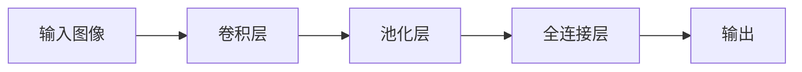

                 

# ImageNet与人工智能的进步

> 关键词：ImageNet, 深度学习, 计算机视觉, 图像分类, 卷积神经网络, 数据增强, 迁移学习, 模型压缩, 模型解释性, 人工智能进展

## 1. 背景介绍

### 1.1 问题由来

ImageNet是一个大规模的图像数据集，由斯坦福大学的研究团队于2009年发布，包含超过一百万张高质量的标注图片，涵盖1000个不同的类别。ImageNet的发布标志着大规模数据驱动的计算机视觉研究开始成为主流。该数据集不仅促进了视觉识别技术的发展，也催生了深度学习领域的许多重要突破。

ImageNet的挑战在于其巨大的规模和多样性，以及严格的数据标注标准。每一类别的样本都必须至少有一千张图像，这要求研究者不仅要有扎实的理论基础，还要具备强大的数据处理和算法实现能力。ImageNet的竞赛(Ilsa, ImageNet Large Scale Visual Recognition Challenge)成为了计算机视觉领域的年度盛事，吸引了全球顶尖的研究团队参与竞争，不断推动AI技术的进步。

### 1.2 问题核心关键点

ImageNet竞赛的关键在于如何在大规模数据上训练高效的视觉识别模型，同时保持模型的泛化能力和解释性。在早期，ImageNet的数据集和算法模型相对简单，深度学习模型如AlexNet、VGG等取得了突破性进展。但随着数据规模的扩大和模型复杂度的提升，如何高效利用数据、避免过拟合、提升模型解释性等问题逐渐成为研究的焦点。

### 1.3 问题研究意义

ImageNet竞赛不仅是学术界展示最新研究成果的平台，也是工业界评估和选择技术工具的重要参考。深度学习模型在图像分类、目标检测、语义分割等视觉任务上的突破性进展，推动了计算机视觉技术在医疗、交通、安防、零售等领域的广泛应用，带来了巨大的经济和社会价值。

此外，ImageNet竞赛催生了数据增强、迁移学习、模型压缩等前沿技术，推动了整个AI社区的进步，促进了知识共享和技术传播。可以说，ImageNet竞赛在提升人类认知智能和推动技术创新方面，扮演了重要的角色。

## 2. 核心概念与联系

### 2.1 核心概念概述

为了更好地理解ImageNet竞赛和深度学习模型在图像识别任务上的进展，本节将介绍几个核心概念：

- 图像分类(Image Classification)：将图像映射到特定类别标签的任务。这是ImageNet竞赛的核心任务之一。
- 卷积神经网络(Convolutional Neural Networks, CNN)：一种针对图像数据的深度学习模型，通过卷积层、池化层和全连接层等组成，擅长处理高维空间数据。
- 数据增强(Data Augmentation)：通过对原始数据进行旋转、平移、缩放、翻转等变换，生成更多的训练数据，提高模型的泛化能力。
- 迁移学习(Transfer Learning)：将在大规模数据集上预训练的模型参数，迁移到特定任务上微调，从而获得更好的效果。
- 模型压缩(Model Compression)：通过对深度学习模型进行剪枝、量化、蒸馏等操作，减小模型尺寸，提升推理速度和资源利用效率。
- 模型解释性(Model Interpretability)：描述深度学习模型预测过程的透明性，帮助用户理解和信任模型的输出结果。

这些核心概念通过以下Mermaid流程图进行展示：

```mermaid
graph TB
    A[图像分类] --> B[卷积神经网络(CNN)]
    A --> C[数据增强]
    A --> D[迁移学习]
    A --> E[模型压缩]
    A --> F[模型解释性]
```

这个流程图展示了图像分类任务的核心流程，包括模型选择、数据处理、微调优化和结果解释等多个环节。

## 3. 核心算法原理 & 具体操作步骤
### 3.1 算法原理概述

ImageNet竞赛的核心目标是训练高效准确的图像分类模型。早期的深度学习模型通过全连接层和卷积层等组件，直接对图像像素进行处理，得到高维的特征表示。然而，由于特征表示的复杂性和训练数据的稀疏性，模型的泛化能力有限，容易出现过拟合。

基于此，深度学习模型逐渐引入了数据增强、迁移学习、模型压缩等技术，从不同的角度优化模型性能：

1. **数据增强**：通过对原始数据进行变换，生成更多的训练数据，提高模型的泛化能力。
2. **迁移学习**：在大规模数据集上预训练的模型参数，迁移到特定任务上微调，提升模型性能。
3. **模型压缩**：通过剪枝、量化、蒸馏等技术，减小模型尺寸，提升推理速度和资源利用效率。
4. **模型解释性**：通过可视化、可解释性模型等方法，提升模型的透明性和可理解性。

### 3.2 算法步骤详解

ImageNet竞赛的核心步骤包括数据预处理、模型选择、模型训练和微调、模型压缩和解释等多个环节。以下是对这些步骤的详细讲解：

**Step 1: 数据预处理**
1. 数据准备：收集并标注ImageNet数据集，确保数据的质量和多样性。
2. 数据增强：通过旋转、平移、缩放、翻转等变换，生成更多的训练数据。

**Step 2: 模型选择**
1. 选择基础模型：根据任务需求和硬件资源，选择适合的基础模型。
2. 调整模型结构：根据任务复杂度和数据规模，调整模型的层数、宽度和深度。

**Step 3: 模型训练和微调**
1. 训练基础模型：在大规模数据集上训练基础模型，获取初始参数。
2. 迁移学习：在特定任务数据集上，微调基础模型，提升模型性能。

**Step 4: 模型压缩**
1. 剪枝：去除冗余参数和层，减少模型复杂度。
2. 量化：将浮点模型转换为定点模型，减小内存占用和计算成本。
3. 蒸馏：将大模型的预测结果作为小模型的训练标签，传递知识。

**Step 5: 模型解释性**
1. 可视化：使用可视化工具，展示模型预测过程。
2. 可解释性模型：开发可解释性较强的模型结构，提升模型透明性。

### 3.3 算法优缺点

ImageNet竞赛中的深度学习模型具有以下优点：
1. 高效性：通过卷积神经网络等结构，模型能够高效地处理高维图像数据。
2. 泛化能力：数据增强和迁移学习等技术，提升了模型的泛化能力，避免了过拟合。
3. 资源利用效率：模型压缩和量化技术，减小了模型尺寸和计算成本，提升了资源利用效率。
4. 透明性：模型解释性技术，提升了模型的透明性和可理解性，帮助用户信任和应用模型。

同时，该模型也存在一些局限性：
1. 计算资源需求高：大规模深度学习模型的训练和推理需要高性能硬件支持。
2. 模型复杂度高：深层网络结构增加了模型复杂性，可能难以解释和优化。
3. 训练时间较长：深度学习模型通常需要较长的训练时间，难以满足实时性要求。
4. 数据依赖性强：模型性能依赖于高质量的数据标注和数据多样性。

尽管存在这些局限性，但就目前而言，深度学习模型在图像分类任务上取得了显著进展，成为了当前的主流方法。未来相关研究的重点在于如何进一步优化模型结构、提升训练效率、减小模型资源消耗、提高模型可解释性等，从而推动深度学习模型在更广泛领域的应用。

### 3.4 算法应用领域

ImageNet竞赛中的深度学习模型已经在计算机视觉的诸多领域得到了应用，例如：

- 图像分类：如图像识别、物体检测、图像分割等任务。
- 目标跟踪：如行人跟踪、车辆跟踪、动作跟踪等。
- 医学影像分析：如肿瘤检测、病灶识别、X光片分析等。
- 安防监控：如人脸识别、行为识别、异常检测等。
- 自动驾驶：如车道线检测、交通信号识别、道路场景理解等。
- 增强现实：如三维重建、场景理解、实时渲染等。

除了这些经典应用外，ImageNet竞赛中的深度学习技术还催生了更多的创新应用，如图像生成、图像去噪、图像风格迁移等，为计算机视觉技术带来了新的突破。

## 4. 数学模型和公式 & 详细讲解  
### 4.1 数学模型构建

在ImageNet竞赛中，深度学习模型通过卷积神经网络(CNN)来处理图像数据，以下是CNN的数学模型构建过程：

设输入图像为 $x \in \mathbb{R}^{W \times H \times C}$，其中 $W$ 为图像宽度，$H$ 为图像高度，$C$ 为图像通道数。卷积神经网络由卷积层、池化层和全连接层等组成。以简单的卷积神经网络为例，其结构如图：



其中，卷积层通过卷积操作提取图像特征，池化层通过下采样操作减少特征维度，全连接层将特征映射到类别标签。

设卷积核为 $w \in \mathbb{R}^{F \times F \times C_{in}}$，卷积操作定义为：

$$
y_i = x * w = \sum_{i=1}^{F \times F \times C_{in}} w_{i,j,k} * x_{i,j,k}
$$

其中 $y_i$ 为输出特征图，$x_{i,j,k}$ 为输入图像在位置 $(i,j,k)$ 的像素值，$w_{i,j,k}$ 为卷积核在位置 $(i,j,k)$ 的权重。

### 4.2 公式推导过程

以下以AlexNet模型为例，推导其前向传播过程的数学公式。

AlexNet模型包含5个卷积层、3个池化层和3个全连接层。设输入图像大小为 $224 \times 224 \times 3$，卷积核大小为 $11 \times 11$，步幅为 $4$，输出通道数为 $64$。设池化窗口大小为 $2 \times 2$，步幅为 $2$，输出通道数不变。

卷积层的输出大小为：

$$
N = \frac{H - F + 2P}{S} + 1 = \frac{224 - 11 + 2 \times 0}{4} + 1 = 55
$$

其中 $F$ 为卷积核大小，$P$ 为填充大小，$S$ 为步幅。

第一个卷积层的输出大小为 $55 \times 55 \times 64$，池化后的输出大小为 $13 \times 13 \times 64$。重复上述过程，得到第二个卷积层的输出大小为 $13 \times 13 \times 192$，第三个卷积层的输出大小为 $13 \times 13 \times 384$。全连接层的输出大小为 $1 \times 1 \times 1000$。

### 4.3 案例分析与讲解

以AlexNet为例，分析其在ImageNet竞赛中的表现和改进：

AlexNet在2012年的ImageNet竞赛中取得了突破性进展，获得了Top-5错误率14.3%，远优于之前的方法。其核心贡献在于：

1. 卷积神经网络：通过卷积层和池化层等组件，AlexNet有效地处理了高维图像数据，提取了高层次的特征表示。
2. 多GPU并行：AlexNet采用了多GPU并行训练策略，大幅提升了训练速度。
3. Dropout技术：通过随机失活部分神经元，避免过拟合。

然而，AlexNet也存在一些局限性：

1. 参数量大：AlexNet包含约6千万个参数，计算成本高。
2. 特征局部性：卷积核的局部性限制了模型的泛化能力。

为了进一步优化AlexNet，研究者提出了一些改进措施，如ReLU激活函数、数据增强、Dropout等。ReLU激活函数增加了模型的非线性性，加速了收敛速度。数据增强技术通过旋转、平移、缩放等方式扩充训练数据，提升了模型的泛化能力。Dropout技术通过随机失活部分神经元，避免过拟合。

## 5. 项目实践：代码实例和详细解释说明
### 5.1 开发环境搭建

在进行深度学习项目开发前，需要搭建好开发环境。以下是使用Python进行PyTorch开发的环境配置流程：

1. 安装Anaconda：从官网下载并安装Anaconda，用于创建独立的Python环境。

2. 创建并激活虚拟环境：
```bash
conda create -n pytorch-env python=3.8 
conda activate pytorch-env
```

3. 安装PyTorch：根据CUDA版本，从官网获取对应的安装命令。例如：
```bash
conda install pytorch torchvision torchaudio cudatoolkit=11.1 -c pytorch -c conda-forge
```

4. 安装各类工具包：
```bash
pip install numpy pandas scikit-learn matplotlib tqdm jupyter notebook ipython
```

完成上述步骤后，即可在`pytorch-env`环境中开始深度学习项目开发。

### 5.2 源代码详细实现

下面我们以ImageNet分类任务为例，给出使用PyTorch实现卷积神经网络模型的代码实现。

首先，定义卷积神经网络的结构：

```python
import torch
import torch.nn as nn
import torch.nn.functional as F

class ConvNet(nn.Module):
    def __init__(self):
        super(ConvNet, self).__init__()
        self.conv1 = nn.Conv2d(3, 64, kernel_size=11, stride=4, padding=2)
        self.pool = nn.MaxPool2d(kernel_size=2, stride=2)
        self.conv2 = nn.Conv2d(64, 192, kernel_size=5, stride=1, padding=2)
        self.conv3 = nn.Conv2d(192, 384, kernel_size=3, stride=1, padding=1)
        self.conv4 = nn.Conv2d(384, 256, kernel_size=3, stride=1, padding=1)
        self.fc1 = nn.Linear(256 * 6 * 6, 4096)
        self.fc2 = nn.Linear(4096, 1000)

    def forward(self, x):
        x = F.relu(self.conv1(x))
        x = self.pool(x)
        x = F.relu(self.conv2(x))
        x = self.pool(x)
        x = F.relu(self.conv3(x))
        x = F.max_pool2d(x, kernel_size=2, stride=2)
        x = F.relu(self.conv4(x))
        x = x.view(x.size(0), -1)
        x = F.relu(self.fc1(x))
        x = F.dropout(x, training=self.training)
        x = self.fc2(x)
        return x
```

然后，定义数据增强和迁移学习流程：

```python
from torchvision import transforms
from torch.utils.data import DataLoader
from torchvision.datasets import ImageNet

# 数据增强
data_augmentation = transforms.Compose([
    transforms.RandomResizedCrop(224),
    transforms.RandomHorizontalFlip(),
    transforms.ToTensor(),
    transforms.Normalize(mean=[0.485, 0.456, 0.406], std=[0.229, 0.224, 0.225])
])

# 数据加载器
train_dataset = ImageNet(root='path/to/data', transform=data_augmentation, train=True, download=True)
test_dataset = ImageNet(root='path/to/data', transform=transforms.ToTensor(), train=False, download=True)

train_loader = DataLoader(train_dataset, batch_size=256, shuffle=True)
test_loader = DataLoader(test_dataset, batch_size=256, shuffle=False)

# 模型初始化
model = ConvNet()

# 迁移学习
model.load_state_dict(torch.load('path/to/model.pth'))

# 优化器
optimizer = torch.optim.SGD(model.parameters(), lr=0.01, momentum=0.9, weight_decay=0.0005)

# 训练
for epoch in range(10):
    for i, (images, labels) in enumerate(train_loader):
        images = images.to(device)
        labels = labels.to(device)
        
        # 前向传播
        outputs = model(images)
        loss = F.cross_entropy(outputs, labels)

        # 反向传播
        optimizer.zero_grad()
        loss.backward()
        optimizer.step()

        if (i+1) % 100 == 0:
            print(f'Epoch {epoch+1}, batch {i+1}/{len(train_loader)}, loss: {loss.item():.4f}')
```

### 5.3 代码解读与分析

让我们再详细解读一下关键代码的实现细节：

**ConvNet类**：
- `__init__`方法：定义卷积神经网络的各个组件，包括卷积层、池化层和全连接层等。
- `forward`方法：实现前向传播，通过卷积层、池化层和全连接层进行特征提取和分类。

**数据增强**：
- 使用`transforms`模块定义了数据增强的流程，包括随机裁剪、随机水平翻转、归一化等。

**数据加载器**：
- 使用`torchvision`模块的`DataLoader`实现数据批处理和加载。

**模型初始化**：
- 加载预训练模型的权重，将其迁移到特定任务上进行微调。

**优化器**：
- 使用随机梯度下降优化器，并设置学习率、动量和正则化系数。

**训练循环**：
- 遍历数据集，对每个批次进行前向传播、计算损失、反向传播和参数更新。

可以看到，PyTorch提供了强大的API和工具，使得深度学习模型的开发和训练变得简单高效。开发者可以快速迭代和优化模型，提升模型性能。

## 6. 实际应用场景
### 6.1 智能监控系统

基于深度学习模型的图像分类技术，可以广泛应用于智能监控系统的构建。传统的监控系统需要大量人力进行实时监控和事件处理，难以应对复杂场景和多源数据。而使用深度学习模型，可以实现对视频流中的实时目标检测和行为分析，自动报告异常情况，提升监控效率。

在技术实现上，可以收集监控摄像头拍摄的实时视频，将视频帧作为模型输入，预测其中的目标类别。对于检测到的异常目标，可以实时发送告警信息，自动记录和回放视频，便于事后分析。如此构建的智能监控系统，能大幅提升监控的准确性和及时性，保障公共安全。

### 6.2 医学影像分析

医学影像分析是深度学习模型在医疗领域的重要应用之一。传统医学影像诊断依赖于医生的经验和知识，难以快速准确地处理大量的医学影像数据。基于图像分类技术，深度学习模型可以自动识别和标注医学影像中的病变区域，提升医生的诊断效率和准确性。

在技术实现上，可以收集大量医学影像数据，并对其进行标注。使用深度学习模型，训练图像分类器，用于识别和分类不同类型的病变区域。在实际应用中，医生可以借助深度学习模型，快速定位和分析病变区域，辅助诊断和治疗。

### 6.3 自动驾驶

自动驾驶是深度学习模型在交通领域的重要应用之一。传统的自动驾驶系统依赖于传感器和规则，难以处理复杂的交通场景和动态变化。基于图像分类技术，深度学习模型可以识别道路标志、交通信号和行人等信息，提升自动驾驶的安全性和可靠性。

在技术实现上，可以收集自动驾驶汽车拍摄的实时图像数据，训练图像分类器，用于识别道路标志和交通信号。在实际应用中，自动驾驶系统可以根据分类结果，调整行驶策略和方向，避免交通事故和违规行为。

### 6.4 未来应用展望

随着深度学习技术的不断进步，基于ImageNet竞赛的技术将会进一步应用于更广泛的领域，为人类生活和工作带来更深刻的变革：

1. 医疗影像分析：深度学习模型将辅助医生进行疾病诊断和治疗，提升医疗服务质量和效率。
2. 自动驾驶：深度学习模型将推动自动驾驶技术的发展，提升交通系统的安全性和可靠性。
3. 安防监控：深度学习模型将提升安防系统的智能化水平，保障公共安全和隐私。
4. 智能家居：深度学习模型将推动智能家居设备的发展，提升家庭生活的舒适度和便利性。
5. 工业制造：深度学习模型将推动工业自动化和智能化，提升生产效率和质量。

## 7. 工具和资源推荐
### 7.1 学习资源推荐

为了帮助开发者系统掌握深度学习模型的理论和实践技能，这里推荐一些优质的学习资源：

1. 《深度学习》系列书籍：Ian Goodfellow、Yoshua Bengio和Aaron Courville合著，全面介绍了深度学习的理论基础和实践技巧。
2. 《TensorFlow实战》系列书籍：Emin Burnaak、Laurence Moroney等合著，详细讲解了TensorFlow框架的使用方法和实践技巧。
3. 《PyTorch深度学习入门》书籍：Rob Zemel、Kan Ren等合著，系统介绍了PyTorch框架的使用和深度学习模型的开发。
4. CS231n《卷积神经网络》课程：斯坦福大学开设的计算机视觉课程，涵盖了卷积神经网络的理论和实践。
5. Kaggle竞赛平台：提供了大量的深度学习竞赛和数据集，帮助开发者积累实战经验。

通过对这些资源的学习实践，相信你一定能够快速掌握深度学习模型的核心技术和应用方法，并用于解决实际的视觉识别问题。

### 7.2 开发工具推荐

高效的开发离不开优秀的工具支持。以下是几款用于深度学习模型开发和优化的常用工具：

1. PyTorch：基于Python的开源深度学习框架，灵活动态的计算图，适合快速迭代研究。提供了丰富的深度学习模型和优化算法。

2. TensorFlow：由Google主导开发的开源深度学习框架，生产部署方便，适合大规模工程应用。提供了丰富的深度学习模型和优化算法。

3. Keras：基于Python的高层次深度学习框架，易于上手和使用，适合初学者和快速原型开发。

4. Jupyter Notebook：交互式编程环境，支持Python、R等语言，方便开发者记录和分享实验过程。

5. Anaconda：Python环境和工具包管理工具，方便创建和管理虚拟环境。

6. NVIDIA CUDA Toolkit：用于GPU加速的开发工具包，支持深度学习模型的高效训练和推理。

合理利用这些工具，可以显著提升深度学习模型的开发效率，加快创新迭代的步伐。

### 7.3 相关论文推荐

深度学习模型的发展源于学界的持续研究。以下是几篇奠基性的相关论文，推荐阅读：

1. AlexNet: One Millisecond Image Classification with Deep Convolutional Neural Networks：介绍AlexNet模型及其在ImageNet竞赛中的表现。

2. Deep Residual Learning for Image Recognition：提出ResNet模型，解决了深度网络训练过程中梯度消失的问题。

3. Inceptionism: Going Deeper into Neural Networks：提出Inception模块，提升了深度网络的表示能力。

4. Identity Mappings in Deep Residual Networks：证明深度网络中残差连接的存在性，并提出更高效的残差网络结构。

5. DenseNet: Dense Convolutional Networks：提出DenseNet模型，提升了深度网络的特征复用能力和泛化能力。

6. NASNet-A Search Space to Scale and Transfer：提出NASNet模型，通过神经网络自动搜索优化深度网络结构。

这些论文代表了大规模数据驱动的计算机视觉领域的最新进展。通过学习这些前沿成果，可以帮助研究者把握学科前进方向，激发更多的创新灵感。

## 8. 总结：未来发展趋势与挑战

### 8.1 总结

本文对基于ImageNet竞赛的深度学习模型进行了全面系统的介绍。首先阐述了深度学习模型在计算机视觉领域的发展历程和重要进展，明确了ImageNet竞赛在推动AI技术发展中的核心作用。其次，从原理到实践，详细讲解了深度学习模型在图像分类任务上的核心算法和具体操作步骤，给出了深度学习模型开发的完整代码实例。同时，本文还广泛探讨了深度学习模型在智能监控、医学影像分析、自动驾驶等领域的实际应用，展示了深度学习模型在多领域的广泛应用前景。

通过本文的系统梳理，可以看到，基于ImageNet竞赛的深度学习模型已经取得了显著的进展，为计算机视觉技术的发展带来了新的突破。未来，随着深度学习技术的不断进步，基于ImageNet竞赛的技术将在更广泛的领域得到应用，为人类生活和工作带来更深刻的变革。

### 8.2 未来发展趋势

展望未来，深度学习模型在计算机视觉领域将呈现以下几个发展趋势：

1. 模型规模持续增大：随着算力成本的下降和数据规模的扩张，深度学习模型的参数量将继续增长。超大模型结构在处理复杂视觉任务时，表现将更加优异。

2. 模型结构更复杂：未来的深度学习模型将融合更多先进的结构设计，如残差连接、Inception模块、NAS等，提升模型的表示能力和泛化能力。

3. 数据增强技术进步：数据增强技术将进一步发展，引入更多的变换方式和更复杂的数据生成模型，提升模型的泛化能力。

4. 迁移学习效果提升：迁移学习技术将更加高效，在大规模数据集上预训练的模型能够更好地迁移到特定任务上进行微调。

5. 模型压缩和优化：模型压缩技术将不断进步，通过剪枝、量化、蒸馏等手段，减小模型尺寸，提升推理速度和资源利用效率。

6. 模型解释性增强：模型解释性技术将更加完善，通过可视化、可解释性模型等方法，提升模型的透明性和可理解性。

这些趋势将进一步推动深度学习模型在计算机视觉领域的广泛应用，提升模型的性能和效率，拓展应用场景。

### 8.3 面临的挑战

尽管深度学习模型在计算机视觉领域取得了显著进展，但在迈向更加智能化、普适化应用的过程中，仍面临诸多挑战：

1. 计算资源需求高：大规模深度学习模型的训练和推理需要高性能硬件支持。如何优化模型结构、降低资源消耗，是当前面临的重要问题。

2. 模型复杂度高：深层网络结构增加了模型复杂性，可能难以解释和优化。如何设计更简单、更可解释的模型结构，是未来的研究重点。

3. 训练时间较长：深度学习模型通常需要较长的训练时间，难以满足实时性要求。如何提升训练效率，缩短训练时间，是亟需解决的问题。

4. 数据依赖性强：模型性能依赖于高质量的数据标注和数据多样性。如何获取更多的高质量数据，优化数据标注流程，是技术应用的瓶颈。

5. 模型鲁棒性不足：深度学习模型在面对新数据时，泛化能力有限。如何提高模型的鲁棒性和泛化能力，是未来的研究方向。

6. 模型安全性问题：深度学习模型可能会学习到有害的偏见和信息，存在安全隐患。如何消除模型的偏见，确保输出的安全性，是重要的研究方向。

尽管存在这些挑战，但未来的研究将继续推动深度学习模型的优化和改进，提升模型的性能和效率，拓展应用场景，为计算机视觉技术的发展带来新的突破。

### 8.4 研究展望

面对深度学习模型面临的挑战，未来的研究需要在以下几个方向寻求新的突破：

1. 探索无监督和半监督学习方法：摆脱对大规模标注数据的依赖，利用自监督学习、主动学习等方法，提高模型泛化能力。

2. 研究参数高效和计算高效的微调方法：开发更高效的微调技术，在固定大部分预训练参数的情况下，只更新极少量的任务相关参数。

3. 融合因果和对比学习范式：引入因果推断和对比学习思想，增强模型的泛化能力和鲁棒性。

4. 引入更多先验知识：将符号化的先验知识，如知识图谱、逻辑规则等，与神经网络模型进行融合，提升模型的泛化能力。

5. 结合因果分析和博弈论工具：通过因果分析方法，识别模型的决策关键特征，增强模型输出解释的因果性和逻辑性。

6. 纳入伦理道德约束：在模型训练目标中引入伦理导向的评估指标，过滤和惩罚有害的输出倾向，确保模型输出符合人类价值观和伦理道德。

这些研究方向的探索，必将引领深度学习模型在计算机视觉领域的进一步发展，为构建安全、可靠、可解释、可控的智能系统铺平道路。面向未来，深度学习模型将与知识图谱、逻辑规则等专家知识结合，实现更全面、准确的视觉理解和智能交互。

## 9. 附录：常见问题与解答

**Q1：深度学习模型如何高效利用大规模数据？**

A: 深度学习模型通过数据增强和迁移学习技术，能够高效利用大规模数据。数据增强技术通过对原始数据进行旋转、平移、缩放等方式，生成更多的训练数据，提高模型的泛化能力。迁移学习技术通过在大规模数据集上预训练的模型参数，迁移到特定任务上进行微调，提升模型性能。

**Q2：如何优化深度学习模型的推理速度？**

A: 模型压缩和量化技术可以显著减小模型尺寸，提升推理速度和资源利用效率。通过剪枝、量化、蒸馏等手段，深度学习模型可以减小计算量，提高推理速度。

**Q3：如何提高深度学习模型的鲁棒性？**

A: 引入数据增强和对抗训练技术，可以提高模型的鲁棒性。数据增强技术通过引入更多的训练样本，提高模型的泛化能力。对抗训练技术通过引入对抗样本，增强模型的鲁棒性，避免模型在对抗攻击下性能下降。

**Q4：如何提升深度学习模型的解释性？**

A: 使用可视化工具和可解释性模型，可以提高模型的透明性和可理解性。通过可视化技术，可以展示模型的内部工作机制和决策过程。使用可解释性模型，如决策树、LIME等，可以提供更加详细的解释信息。

**Q5：如何提高深度学习模型的泛化能力？**

A: 数据增强和迁移学习技术可以有效提升模型的泛化能力。数据增强技术通过引入更多的训练样本，提高模型的泛化能力。迁移学习技术通过在大规模数据集上预训练的模型参数，迁移到特定任务上进行微调，提升模型性能。

通过本文的系统梳理，可以看到，基于ImageNet竞赛的深度学习模型已经取得了显著的进展，为计算机视觉技术的发展带来了新的突破。未来，随着深度学习技术的不断进步，基于ImageNet竞赛的技术将在更广泛的领域得到应用，为人类生活和工作带来更深刻的变革。

