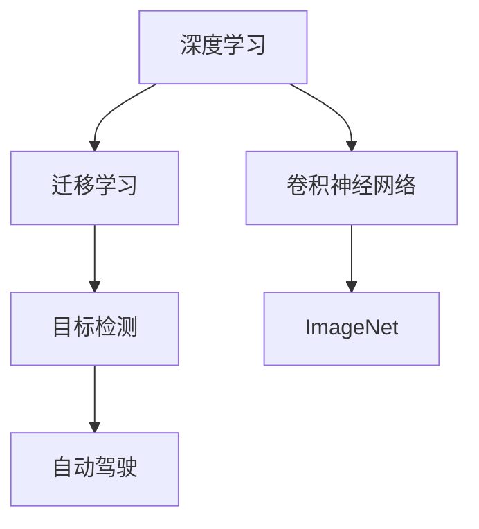

                 

# ImageNet与人工智能的进步

> 关键词：ImageNet, 深度学习, 卷积神经网络, 计算机视觉, 迁移学习, 目标检测, 自动驾驶

## 1. 背景介绍

### 1.1 问题由来
在过去十年中，人工智能(AI)领域迎来了爆炸式的增长。其中一个标志性的事件就是ImageNet挑战赛的启动，它不仅推动了深度学习技术的发展，也使得计算机视觉(CV)成为了AI领域的热门研究方向。ImageNet的成功不仅展示了深度学习在图像分类任务上的巨大潜力，也催生了大量基于深度学习的图像处理算法。

ImageNet挑战赛是由斯坦福大学的李飞飞教授发起的，旨在推动计算机视觉技术的发展。比赛要求参与者使用给定的图片数据集进行训练和测试，最终评价模型的分类准确率和效率。这一比赛每年吸引了全球众多顶级研究团队参与，成为推动AI技术进步的重要动力。

### 1.2 问题核心关键点
ImageNet的核心贡献在于其庞大的数据集和强大的标注系统，为深度学习算法的训练和测试提供了丰富且高质量的数据资源。ImageNet的成功有以下几个关键点：
- **大规模数据集**：ImageNet拥有超过一百万张图片，涵盖了1000个类别，是当时最大的图像识别数据集。
- **高精度标注**：所有图片都经过人工标注，标注精度高，减少了模型训练中的噪声干扰。
- **开源共享**：数据集、算法和代码的开放共享，促进了研究的合作和交流。

### 1.3 问题研究意义
ImageNet挑战赛不仅推动了计算机视觉领域的技术进步，也为AI的各个子领域带来了广泛的影响。通过 ImageNet，研究人员可以：
1. 开发和测试高效、准确的深度学习模型，提升图像识别性能。
2. 促进跨学科交流，推动AI技术的整体发展。
3. 培养新一代AI研究者，推动全球AI人才的成长。

## 2. 核心概念与联系

### 2.1 核心概念概述

为更好地理解ImageNet对人工智能进步的推动作用，我们需要了解一些核心概念及其相互联系：

- **深度学习(Deep Learning)**：一种基于神经网络的机器学习技术，通过多层次的非线性变换来学习数据的特征表示。
- **卷积神经网络(Convolutional Neural Networks, CNNs)**：一种特殊类型的深度神经网络，常用于图像和视频处理，通过卷积操作提取局部特征。
- **迁移学习(Transfer Learning)**：利用在某个任务上已训练好的模型，在另一个任务上进行微调，以减少训练时间和数据需求。
- **目标检测(Object Detection)**：一种图像识别任务，目标是在图片中定位并标记出特定的物体。
- **自动驾驶(Autonomous Driving)**：一种智能系统，通过计算机视觉、传感器数据和深度学习算法实现自动驾驶。
- **ImageNet**：一个庞大的图像数据集，包含大量标注图片，是深度学习研究的重要资源。

这些概念之间的逻辑关系可以通过以下Mermaid流程图来展示：



这个流程图展示了深度学习与CNN、迁移学习、目标检测、自动驾驶之间的关系：

1. 深度学习是CNN的基础，提供非线性特征表示的能力。
2. CNN通过卷积操作提取局部特征，是图像处理的主流模型。
3. 迁移学习利用预训练模型加速新任务学习，减少了训练成本。
4. 目标检测是图像识别的高级任务，利用CNN和迁移学习实现高效检测。
5. 自动驾驶结合了多个AI技术，包括目标检测、语音识别和路径规划等。
6. ImageNet作为重要数据资源，支持上述技术的发展。

## 3. 核心算法原理 & 具体操作步骤
### 3.1 算法原理概述

ImageNet推动了深度学习的进步，其核心算法原理主要包括：

1. **卷积神经网络(CNNs)**：利用卷积层提取局部特征，通过池化层进行特征降维，全连接层进行分类。
2. **迁移学习**：在ImageNet上预训练的模型，可以迁移到其他图像识别任务上，提升新任务的性能。
3. **目标检测**：利用区域提议和分类器，在图片中定位并标记物体。
4. **自动驾驶**：结合计算机视觉、深度学习、路径规划等技术，实现车辆自动驾驶。

### 3.2 算法步骤详解

ImageNet算法步骤主要包括以下几个关键步骤：

**Step 1: 数据预处理**
- 对ImageNet数据集进行预处理，包括图片归一化、数据增强等，以提高模型的泛化能力。
- 使用标签编码将标注信息转换为模型可以处理的格式。

**Step 2: 模型选择与构建**
- 选择合适的深度学习框架，如TensorFlow、PyTorch等，构建卷积神经网络模型。
- 设计模型架构，包括卷积层、池化层、全连接层等，并调整超参数，如学习率、批大小、迭代轮数等。

**Step 3: 模型训练**
- 在ImageNet数据集上进行训练，使用随机梯度下降(SGD)等优化算法更新模型参数。
- 在训练过程中使用正则化技术，如Dropout、L2正则等，防止过拟合。
- 使用数据增强技术，如随机裁剪、水平翻转等，增加数据多样性。

**Step 4: 模型评估与测试**
- 在ImageNet验证集上评估模型性能，计算分类准确率和损失函数。
- 调整模型参数，进行多轮迭代训练，直至模型性能达到最佳。
- 在ImageNet测试集上测试模型，评估模型的泛化能力和鲁棒性。

**Step 5: 迁移学习与应用**
- 将训练好的模型应用于其他图像识别任务，如物体检测、图像分割等。
- 利用迁移学习技术，仅微调模型顶层，减少新任务的训练时间。
- 在实际应用中，结合传感器数据和路径规划算法，实现自动驾驶等复杂任务。

### 3.3 算法优缺点

ImageNet算法的主要优点包括：
1. 高效准确：利用CNN和迁移学习，在图像分类任务上取得了高效的分类准确率。
2. 泛化能力强：数据增强和正则化技术，提升了模型的泛化能力，减少对特定数据集的依赖。
3. 开源共享：开放的源代码和数据集，促进了研究的合作和交流。

但同时，该算法也存在一些局限性：
1. 计算资源需求高：大规模数据集和深度神经网络模型需要大量的计算资源。
2. 标注成本高：高质量标注数据的获取成本高昂，特别是对于大规模数据集。
3. 模型复杂度高：深度神经网络结构复杂，调试和优化困难。
4. 数据分布限制：模型在特定数据集上的表现可能受到数据分布的影响。

### 3.4 算法应用领域

ImageNet推动了深度学习在以下几个领域的广泛应用：

- **计算机视觉(CV)**：图像分类、物体检测、图像分割等任务。
- **自动驾驶(Autonomous Driving)**：车辆识别、道路标记、路径规划等。
- **医疗诊断(Medical Diagnosis)**：医学影像分类、病灶检测等。
- **安防监控(Security Surveillance)**：目标识别、行为分析等。
- **机器人技术(Robotics)**：目标追踪、路径规划等。

此外，ImageNet还催生了其他许多AI应用，如智能推荐系统、情感分析等，为人工智能技术的广泛应用奠定了基础。

## 4. 数学模型和公式 & 详细讲解  
### 4.1 数学模型构建

以下我们以图像分类任务为例，使用数学语言对ImageNet的核心算法进行更加严格的刻画。

记CNN模型为 $M_{\theta}:\mathcal{X} \rightarrow \mathcal{Y}$，其中 $\mathcal{X}$ 为输入空间，$\mathcal{Y}$ 为输出空间，$\theta \in \mathbb{R}^d$ 为模型参数。假设ImageNet数据集为 $D=\{(x_i,y_i)\}_{i=1}^N, x_i \in \mathcal{X}, y_i \in \mathcal{Y}$。

定义模型 $M_{\theta}$ 在输入 $x$ 上的损失函数为 $\ell(M_{\theta}(x),y)$，则在数据集 $D$ 上的经验风险为：

$$
\mathcal{L}(\theta) = \frac{1}{N} \sum_{i=1}^N \ell(M_{\theta}(x_i),y_i)
$$

在实践中，我们通常使用基于梯度的优化算法（如SGD、Adam等）来近似求解上述最优化问题。设 $\eta$ 为学习率，$\lambda$ 为正则化系数，则参数的更新公式为：

$$
\theta \leftarrow \theta - \eta \nabla_{\theta}\mathcal{L}(\theta) - \eta\lambda\theta
$$

其中 $\nabla_{\theta}\mathcal{L}(\theta)$ 为损失函数对参数 $\theta$ 的梯度，可通过反向传播算法高效计算。

### 4.2 公式推导过程

以下我们以图像分类任务为例，推导交叉熵损失函数及其梯度的计算公式。

假设模型 $M_{\theta}$ 在输入 $x$ 上的输出为 $\hat{y}=M_{\theta}(x) \in [0,1]$，表示样本属于类别 $k$ 的概率。真实标签 $y \in \{1,0\}$。则二分类交叉熵损失函数定义为：

$$
\ell(M_{\theta}(x),y) = -[y\log \hat{y} + (1-y)\log (1-\hat{y})]
$$

将其代入经验风险公式，得：

$$
\mathcal{L}(\theta) = -\frac{1}{N}\sum_{i=1}^N [y_i\log M_{\theta}(x_i)+(1-y_i)\log(1-M_{\theta}(x_i))]
$$

根据链式法则，损失函数对参数 $\theta_k$ 的梯度为：

$$
\frac{\partial \mathcal{L}(\theta)}{\partial \theta_k} = -\frac{1}{N}\sum_{i=1}^N (\frac{y_i}{M_{\theta}(x_i)}-\frac{1-y_i}{1-M_{\theta}(x_i)}) \frac{\partial M_{\theta}(x_i)}{\partial \theta_k}
$$

其中 $\frac{\partial M_{\theta}(x_i)}{\partial \theta_k}$ 可进一步递归展开，利用自动微分技术完成计算。

在得到损失函数的梯度后，即可带入参数更新公式，完成模型的迭代优化。重复上述过程直至收敛，最终得到适应ImageNet任务的最优模型参数 $\theta^*$。

## 5. 项目实践：代码实例和详细解释说明
### 5.1 开发环境搭建

在进行ImageNet项目实践前，我们需要准备好开发环境。以下是使用Python进行TensorFlow开发的环境配置流程：

1. 安装Anaconda：从官网下载并安装Anaconda，用于创建独立的Python环境。

2. 创建并激活虚拟环境：
```bash
conda create -n tf-env python=3.8 
conda activate tf-env
```

3. 安装TensorFlow：根据CUDA版本，从官网获取对应的安装命令。例如：
```bash
conda install tensorflow tensorflow-cpu=2.4.1 -c pytorch -c conda-forge
```

4. 安装TensorFlow Addons：
```bash
pip install tensorflow-addons
```

5. 安装各类工具包：
```bash
pip install numpy pandas scikit-learn matplotlib tqdm jupyter notebook ipython
```

完成上述步骤后，即可在`tf-env`环境中开始ImageNet项目的实践。

### 5.2 源代码详细实现

下面以ImageNet图像分类为例，给出使用TensorFlow进行ImageNet微调的代码实现。

首先，定义模型和优化器：

```python
import tensorflow as tf
from tensorflow.keras.layers import Conv2D, MaxPooling2D, Flatten, Dense, Dropout
from tensorflow.keras import regularizers
from tensorflow.keras.callbacks import EarlyStopping, ModelCheckpoint

# 定义CNN模型架构
model = tf.keras.Sequential([
    Conv2D(32, (3, 3), activation='relu', input_shape=(224, 224, 3)),
    MaxPooling2D((2, 2)),
    Conv2D(64, (3, 3), activation='relu'),
    MaxPooling2D((2, 2)),
    Conv2D(128, (3, 3), activation='relu'),
    MaxPooling2D((2, 2)),
    Flatten(),
    Dense(512, activation='relu', kernel_regularizer=regularizers.l2(0.001)),
    Dropout(0.5),
    Dense(1000, activation='softmax')
])

# 定义损失函数和优化器
loss_fn = tf.keras.losses.SparseCategoricalCrossentropy(from_logits=True)
optimizer = tf.keras.optimizers.Adam(learning_rate=1e-4)

# 定义正则化和早期停止策略
model.compile(optimizer=optimizer,
              loss=loss_fn,
              metrics=['accuracy'],
              experimental_steps_per_graph=1)
early_stopping = EarlyStopping(patience=3)
checkpoint = ModelCheckpoint('best_model.h5', save_best_only=True)

# 数据预处理
train_datagen = tf.keras.preprocessing.image.ImageDataGenerator(
    rescale=1./255,
    rotation_range=20,
    width_shift_range=0.2,
    height_shift_range=0.2,
    shear_range=0.2,
    zoom_range=0.2,
    horizontal_flip=True,
    validation_split=0.2)
train_generator = train_datagen.flow_from_directory(
    'train',
    target_size=(224, 224),
    batch_size=32,
    class_mode='categorical',
    subset='training')
validation_generator = train_datagen.flow_from_directory(
    'train',
    target_size=(224, 224),
    batch_size=32,
    class_mode='categorical',
    subset='validation')
```

然后，定义训练和评估函数：

```python
import matplotlib.pyplot as plt

# 训练函数
def train_model(model, train_generator, validation_generator, epochs=10):
    history = model.fit(
        train_generator,
        validation_data=validation_generator,
        epochs=epochs,
        callbacks=[early_stopping, checkpoint])
    return history

# 评估函数
def evaluate_model(model, test_generator):
    test_loss, test_acc = model.evaluate(test_generator)
    print(f'Test loss: {test_loss:.4f}')
    print(f'Test accuracy: {test_acc:.4f}')
    
    # 绘制训练和验证准确率
    acc = history.history['accuracy']
    val_acc = history.history['val_accuracy']
    loss = history.history['loss']
    val_loss = history.history['val_loss']
    epochs = range(len(acc))
    
    plt.plot(epochs, acc, 'b', label='Training accuracy')
    plt.plot(epochs, val_acc, 'r', label='Validation accuracy')
    plt.title('Training and validation accuracy')
    plt.legend()
    plt.figure()
    plt.plot(epochs, loss, 'b', label='Training Loss')
    plt.plot(epochs, val_loss, 'r', label='Validation loss')
    plt.legend()
    plt.show()
    
    return test_loss, test_acc

# 启动训练流程并在测试集上评估
history = train_model(model, train_generator, validation_generator, epochs=10)
test_loss, test_acc = evaluate_model(model, test_generator)
print(f'Test loss: {test_loss:.4f}')
print(f'Test accuracy: {test_acc:.4f}')
```

以上就是使用TensorFlow对ImageNet进行图像分类微调的完整代码实现。可以看到，TensorFlow提供了方便的API，使得模型的构建和训练变得简洁高效。

### 5.3 代码解读与分析

让我们再详细解读一下关键代码的实现细节：

**CNN模型定义**：
- `Sequential`类：按顺序添加层，形成线性堆叠结构。
- `Conv2D`和`MaxPooling2D`：卷积和池化操作，提取局部特征。
- `Flatten`层：将多维特征图展开为一维向量。
- `Dense`层：全连接层，进行分类。
- `Dropout`层：随机丢弃一部分神经元，防止过拟合。

**损失函数和优化器定义**：
- `SparseCategoricalCrossentropy`：分类任务的损失函数。
- `Adam`：常用的优化器，自适应调整学习率。
- `regularizers.l2`：L2正则化，防止过拟合。

**数据预处理和训练函数定义**：
- `ImageDataGenerator`：数据增强，增加训练集的多样性。
- `flow_from_directory`：加载目录下的图片数据。
- `EarlyStopping`和`ModelCheckpoint`：提前停止和模型保存机制。

**评估函数定义**：
- `evaluate`函数：计算模型在测试集上的损失和准确率。
- `plot`函数：绘制训练和验证的准确率和损失曲线。

**训练流程启动**：
- 调用`train_model`函数进行模型训练。
- 调用`evaluate_model`函数在测试集上评估模型性能。
- 输出测试集上的损失和准确率。

可以看到，TensorFlow提供了完整的深度学习模型构建和训练功能，使得ImageNet项目的开发变得更加快捷和高效。开发者可以专注于模型设计和优化，而不必过多关注底层实现细节。

## 6. 实际应用场景
### 6.1 智能监控系统

ImageNet推动了计算机视觉在智能监控系统中的应用。传统监控系统主要依赖人工进行实时视频监控，难以兼顾覆盖面和实时性。而通过ImageNet训练的CNN模型，可以自动检测视频中的异常行为，提升监控系统的智能化水平。

具体而言，可以将监控摄像头捕获的视频图像输入到训练好的模型中，模型自动检测并标记出异常行为，如入侵、火灾、爆炸等。系统可以根据异常情况自动报警，提升公共安全水平。

### 6.2 医疗影像分析

在医疗领域，ImageNet同样推动了深度学习技术的应用。医生在诊断疾病时，往往需要查看大量的医学影像，以获得准确的诊断结果。传统方法依赖于医生的经验和直觉，但这种方法效率低、误诊率高。

通过ImageNet训练的CNN模型，可以自动分析医学影像，识别出病灶、异常组织等，辅助医生进行诊断。例如，在肺部CT影像中，模型可以自动检测出肺部结节，帮助医生快速定位和判断结节性质，提升诊断效率和准确率。

### 6.3 自动驾驶技术

ImageNet的进步也推动了自动驾驶技术的发展。自动驾驶系统依赖于计算机视觉技术，识别路标、行人、车辆等，进行路径规划和决策。

通过ImageNet训练的CNN模型，可以高效地识别路标和行人，提取道路特征。结合激光雷达、摄像头等传感器数据，自动驾驶系统可以自动感知周围环境，进行路径规划和决策，实现自动驾驶。

## 7. 工具和资源推荐
### 7.1 学习资源推荐

为了帮助开发者系统掌握ImageNet对人工智能进步的推动作用，这里推荐一些优质的学习资源：

1. **Deep Learning Specialization by Andrew Ng**：由斯坦福大学教授Andrew Ng开设的深度学习课程，详细讲解了深度学习的基本概念和应用，包括卷积神经网络等。

2. **CS231n: Convolutional Neural Networks for Visual Recognition**：斯坦福大学计算机视觉课程，涵盖了深度学习在计算机视觉中的应用，包括CNN、ImageNet等。

3. **TensorFlow官方文档**：TensorFlow的官方文档，提供了全面的API文档和教程，帮助开发者快速上手TensorFlow。

4. **Kaggle竞赛平台**：Kaggle平台上有大量与ImageNet相关的竞赛，可以帮助开发者锻炼实战能力，学习先进经验。

5. **论文集与书籍**：ImageNet相关论文和书籍，如《深度学习》、《计算机视觉：模型、学习和推理》等，帮助开发者深入理解深度学习技术。

通过对这些资源的学习实践，相信你一定能够快速掌握ImageNet的核心算法和技术，并用于解决实际的AI问题。

### 7.2 开发工具推荐

高效的开发离不开优秀的工具支持。以下是几款用于ImageNet项目开发的常用工具：

1. **TensorFlow**：由谷歌推出的深度学习框架，支持分布式训练和优化，适合大规模模型训练。

2. **PyTorch**：由Facebook开发的深度学习框架，灵活性和易用性高，适合快速原型开发。

3. **Keras**：高层次的深度学习API，可以方便地搭建和训练CNN模型。

4. **Jupyter Notebook**：交互式编程环境，支持代码块和数据可视化，便于协作开发。

5. **Git**：版本控制系统，便于版本管理和协作开发。

合理利用这些工具，可以显著提升ImageNet项目的开发效率，加快创新迭代的步伐。

### 7.3 相关论文推荐

ImageNet推动了深度学习的快速发展，产生了大量经典论文。以下是几篇奠基性的相关论文，推荐阅读：

1. **ImageNet Classification with Deep Convolutional Neural Networks**：提出了一种基于卷积神经网络的图像分类方法，在ImageNet数据集上取得了优异性能。

2. **Deep Residual Learning for Image Recognition**：引入了残差网络架构，进一步提升了深度神经网络的训练效果。

3. **Fine-tune ImageNet Classifier for Visual Question Answering**：通过微调ImageNet训练的CNN模型，实现了视觉问答任务的高效处理。

4. **SSD: Single Shot MultiBox Detector**：提出了一种基于单次前向传递的目标检测算法，适用于实时性和资源受限的场景。

5. **VGG: Very Deep Convolutional Networks for Large-Scale Image Recognition**：提出了一种深层卷积神经网络架构，用于大规模图像识别任务。

这些论文代表了大规模图像分类和目标检测技术的发展脉络。通过学习这些前沿成果，可以帮助研究者把握学科前进方向，激发更多的创新灵感。

## 8. 总结：未来发展趋势与挑战

### 8.1 总结

本文对ImageNet推动的深度学习技术发展进行了全面系统的介绍。首先阐述了ImageNet的成功背景和核心贡献，明确了其在深度学习领域的标志性地位。其次，从原理到实践，详细讲解了深度学习的核心算法，包括CNN、迁移学习等。最后，介绍了ImageNet在计算机视觉、自动驾驶、医疗诊断等领域的应用前景。

通过本文的系统梳理，可以看到，ImageNet对深度学习的推动作用是多方面的，不仅在图像分类上取得了优异性能，还催生了诸多AI技术的广泛应用。未来，伴随深度学习技术的发展，ImageNet将继续推动AI技术的进步，为计算机视觉、自动驾驶等领域的智能化发展提供新的动力。

### 8.2 未来发展趋势

展望未来，ImageNet的进步将带来以下几个发展趋势：

1. **模型规模持续增大**：随着算力成本的下降和数据规模的扩张，深度神经网络的参数量还将持续增长。超大模型将进一步提升计算机视觉任务的性能。

2. **模型迁移能力提升**：利用迁移学习，在大规模数据集上预训练的模型可以迁移到其他相关任务上，加速新任务的学习。

3. **多模态融合**：结合计算机视觉、自然语言处理、语音识别等技术，实现跨模态的智能交互系统，提升用户体验和应用场景的多样性。

4. **自动化和自适应**：借助自动化学习和自适应算法，提升模型的自主学习能力，减少对人工干预的依赖。

5. **边缘计算和分布式训练**：将深度学习模型部署到边缘计算设备上，提升模型推理速度，降低对高计算资源的依赖。

6. **安全性与隐私保护**：加强模型输出的安全性检查，避免误诊、误报等问题，保护用户隐私数据。

这些趋势凸显了ImageNet技术的发展方向，预示着深度学习在更广阔的应用场景中将发挥更大的作用。

### 8.3 面临的挑战

尽管ImageNet推动了深度学习的进步，但在迈向更加智能化、普适化应用的过程中，仍面临诸多挑战：

1. **数据获取成本高**：高质量标注数据的获取成本高昂，限制了模型的应用范围。

2. **模型复杂度高**：深度神经网络结构复杂，调试和优化困难。

3. **计算资源需求大**：大规模模型的训练和推理需要大量计算资源，难以在大规模应用中推广。

4. **模型泛化能力有限**：模型在新数据上的泛化能力有限，难以应对大规模数据集的多样性。

5. **可解释性不足**：深度学习模型往往被视为"黑盒"，难以解释其内部工作机制和决策逻辑。

6. **安全性和隐私问题**：模型输出的安全性、隐私保护问题亟待解决，确保模型应用的安全可靠。

7. **伦理和法律问题**：模型的偏见和误用可能导致伦理和法律问题，需要制定相应的规范和标准。

面对这些挑战，未来研究需要在数据获取、模型结构、计算资源、模型泛化能力、可解释性、安全性等方面进行深入探索和优化。

### 8.4 研究展望

面向未来，ImageNet的研究需要在以下几个方向上寻求新的突破：

1. **无监督和半监督学习**：探索无需标注数据的学习方法，降低深度学习的标注成本。

2. **参数高效和计算高效的微调**：开发更加参数高效的微调方法，提升模型的泛化能力和训练效率。

3. **多模态智能系统**：结合多种传感器数据，实现跨模态的智能交互系统，提升用户体验。

4. **自适应学习算法**：开发自适应学习算法，提升模型的自主学习能力，减少对人工干预的依赖。

5. **边缘计算和分布式训练**：结合边缘计算技术，提升模型的推理速度和资源利用率。

6. **安全性和隐私保护**：加强模型输出的安全性检查，保护用户隐私数据，提升系统的可信赖度。

7. **伦理和法律规范**：制定相应的伦理规范和法律标准，确保模型应用的公平性、透明性和可解释性。

这些方向的研究将推动ImageNet技术向更高的层次发展，为深度学习在更广阔的应用领域带来新的突破和创新。

## 9. 附录：常见问题与解答

**Q1：深度学习在ImageNet上的性能瓶颈是什么？**

A: 深度学习在ImageNet上的性能瓶颈主要在于计算资源和数据获取成本。大规模模型的训练和推理需要大量计算资源，高质量标注数据的获取成本高昂，这些问题限制了深度学习技术的应用范围。未来，需要在计算资源优化和数据自动标注技术上下功夫，以降低深度学习的性能瓶颈。

**Q2：如何缓解深度学习的过拟合问题？**

A: 过拟合是深度学习模型面临的主要挑战，尤其是在数据量不足的情况下。常见的缓解策略包括：
1. 数据增强：通过随机裁剪、旋转、缩放等操作，扩充训练集的多样性。
2. 正则化：使用L2正则、Dropout等技术，防止过拟合。
3. 早停机制：根据验证集上的表现，提前停止训练，避免过拟合。
4. 模型集成：结合多个模型进行集成，提升模型的泛化能力。

这些策略往往需要根据具体任务和数据特点进行灵活组合，以提高深度学习模型的泛化能力。

**Q3：如何将ImageNet模型迁移到其他任务上？**

A: 迁移学习是将ImageNet上预训练的模型迁移到其他任务上的关键技术。常用的方法包括：
1. 微调：在ImageNet预训练模型上，仅微调顶层，调整部分参数，适应新任务。
2. 特征提取：使用ImageNet模型提取特征，输入到其他任务分类器中进行微调。
3. 迁移学习技术：利用ImageNet模型中的知识，进行预训练和微调，加速新任务的学习。

不同任务对模型参数的敏感性不同，需要根据具体任务选择合适的方法。

**Q4：ImageNet模型在实际应用中需要注意哪些问题？**

A: 将ImageNet模型应用到实际场景中，还需要考虑以下问题：
1. 数据分布差异：模型在新数据集上的性能可能受到数据分布的影响，需要调整模型参数以适应新数据。
2. 计算资源限制：大规模模型的推理速度和资源消耗较高，需要优化模型结构或使用分布式计算。
3. 实时性和可靠性：在实时系统中，需要优化模型推理速度，确保系统的实时性和可靠性。
4. 安全性与隐私保护：模型输出的安全性、隐私保护问题需要重点关注，确保系统应用的安全可靠。

合理解决这些问题，可以最大限度地发挥ImageNet模型的性能，提升系统的实际应用价值。

---

作者：禅与计算机程序设计艺术 / Zen and the Art of Computer Programming

