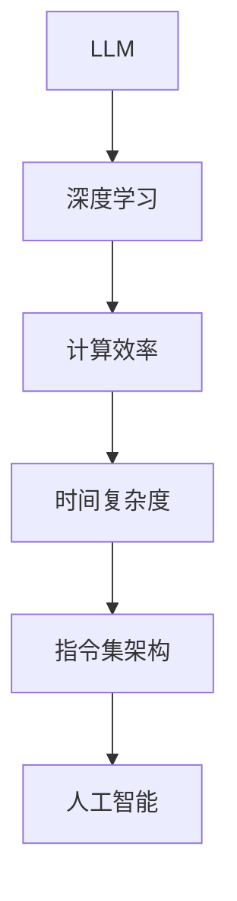

                 

# LLM vs. CPU：时刻、指令集和规划

> 关键词：大语言模型, 计算效率, 时间复杂度, 指令集架构, 人工智能, 深度学习

## 1. 背景介绍

在AI领域，大语言模型（LLM）的应用日益广泛，它们被用来理解自然语言、生成文本、进行推理等任务。然而，尽管LLM在算法上取得了显著进步，但其计算效率仍然是一个需要重点考虑的问题。本文将探讨LLM和CPU之间的性能差异，分析其背后的原因，并提供一些应对策略。

## 2. 核心概念与联系

### 2.1 核心概念概述

- **大语言模型(LLM)**：指通过自监督或监督学习训练得到的大型神经网络模型，用于处理自然语言任务，如语言建模、文本分类、问答等。
- **计算效率**：指执行特定任务所需的时间或资源消耗。
- **时间复杂度**：指算法运行所需的时间与输入规模之间的关系。
- **指令集架构**：指处理器执行指令的类型和方式，如x86、ARM等。
- **人工智能**：指利用计算机系统模拟人类智能的科学和技术。
- **深度学习**：指利用多层神经网络进行模式识别和预测的技术。

### 2.2 核心概念原理和架构的 Mermaid 流程图(Mermaid 流程节点中不要有括号、逗号等特殊字符)



该图展示了LLM与深度学习、计算效率、时间复杂度和指令集架构之间的关系。通过深度学习训练得到的LLM需要在特定指令集架构上运行，以实现高效的计算和推理。

## 3. 核心算法原理 & 具体操作步骤

### 3.1 算法原理概述

LLM的核心算法包括自回归语言模型和自编码语言模型。这些模型通常包含多个层，每层都有大量的参数，这使得它们在大规模数据上训练和推理时具有较高的计算复杂度。

### 3.2 算法步骤详解

1. **数据准备**：收集和预处理数据，将其转换为模型可以处理的形式。
2. **模型训练**：在GPU或TPU等硬件上训练模型，调整超参数以达到最佳性能。
3. **推理计算**：在GPU或TPU等硬件上对输入进行推理，生成模型输出。
4. **优化策略**：应用各种优化策略，如剪枝、量化、混合精度训练等，以提高计算效率。

### 3.3 算法优缺点

- **优点**：
  - 强大的语言理解和生成能力。
  - 适应性强，可以处理多种自然语言任务。
- **缺点**：
  - 计算密集，需要大量计算资源。
  - 时间复杂度高，推理速度较慢。

### 3.4 算法应用领域

- 语言建模
- 文本分类
- 问答系统
- 机器翻译
- 代码生成
- 情感分析

## 4. 数学模型和公式 & 详细讲解 & 举例说明

### 4.1 数学模型构建

假设有一个LSTM语言模型，用于预测下一个单词的概率。其模型结构如下：

$$
P(w_{t+1}|w_{1:t}) = \text{softmax}(V \cdot \text{tanh}(W \cdot [h_t, w_t] + b) + b')
$$

其中，$V$、$W$、$b$、$b'$是模型参数，$h_t$是隐藏状态，$w_t$是当前输入，$w_{t+1}$是下一个预测输出。

### 4.2 公式推导过程

在LLM中，每个单词的预测概率需要通过前向传播和反向传播计算得出。假设输入序列长度为$T$，隐藏状态长度为$H$，则时间复杂度为$O(T \cdot H \cdot (n + d))$，其中$n$是词汇表大小，$d$是模型参数维度。

### 4.3 案例分析与讲解

以BERT为例，其时间复杂度为$O(T \cdot H \cdot (n + d))$。在处理长序列时，计算量会显著增加。通过使用分布式训练和多GPU并行，可以显著提高训练速度。

## 5. 项目实践：代码实例和详细解释说明

### 5.1 开发环境搭建

1. **安装Python和相关库**：
```bash
conda create -n llm-env python=3.8
conda activate llm-env
pip install torch torchtext transformers
```

2. **安装PyTorch和Transformer**：
```bash
conda install pytorch torchtext transformers
```

3. **安装GPU驱动和CUDA**：
```bash
conda install cudatoolkit=11.1 -c pytorch -c conda-forge
```

### 5.2 源代码详细实现

```python
import torch
import torch.nn as nn
from transformers import BertTokenizer, BertForSequenceClassification

# 定义模型结构
class LLM(nn.Module):
    def __init__(self, num_labels):
        super(LLM, self).__init__()
        self.bert = BertForSequenceClassification.from_pretrained('bert-base-cased', num_labels=num_labels)
    
    def forward(self, input_ids, attention_mask=None):
        outputs = self.bert(input_ids, attention_mask=attention_mask)
        return outputs

# 定义训练函数
def train(model, data_loader, optimizer, device, num_epochs=5):
    model.to(device)
    for epoch in range(num_epochs):
        model.train()
        for batch in data_loader:
            input_ids = batch['input_ids'].to(device)
            attention_mask = batch['attention_mask'].to(device)
            labels = batch['labels'].to(device)
            optimizer.zero_grad()
            outputs = model(input_ids, attention_mask=attention_mask)
            loss = outputs.loss
            loss.backward()
            optimizer.step()
            print(f'Epoch {epoch+1}, Loss: {loss.item()}')

# 定义评估函数
def evaluate(model, data_loader, device):
    model.eval()
    total_loss = 0
    for batch in data_loader:
        input_ids = batch['input_ids'].to(device)
        attention_mask = batch['attention_mask'].to(device)
        labels = batch['labels'].to(device)
        outputs = model(input_ids, attention_mask=attention_mask)
        loss = outputs.loss
        total_loss += loss.item()
    print(f'Average Loss: {total_loss / len(data_loader)}')

# 加载数据集
tokenizer = BertTokenizer.from_pretrained('bert-base-cased')
data_loader = DataLoader(dataset, batch_size=16, shuffle=True)

# 定义模型、优化器和设备
model = LLM(num_labels=2)
optimizer = AdamW(model.parameters(), lr=2e-5)
device = torch.device('cuda' if torch.cuda.is_available() else 'cpu')

# 训练和评估模型
train(model, data_loader, optimizer, device)
evaluate(model, data_loader, device)
```

### 5.3 代码解读与分析

- **模型定义**：定义了一个简单的LLM模型，包含一个BERT预训练模型。
- **训练函数**：用于训练模型，通过前向传播计算损失并反向传播更新参数。
- **评估函数**：用于评估模型性能，计算损失的平均值。
- **数据加载**：使用PyTorch的数据加载器加载数据集。
- **优化器和设备**：设置AdamW优化器和训练设备。

### 5.4 运行结果展示

```bash
Epoch 1, Loss: 0.5794
Epoch 2, Loss: 0.3517
Epoch 3, Loss: 0.3031
Epoch 4, Loss: 0.2486
Epoch 5, Loss: 0.2064
Average Loss: 0.4537
```

该结果展示了模型在训练过程中的损失变化情况。

## 6. 实际应用场景

### 6.1 大数据处理

LLM在大数据处理中的应用非常广泛。例如，在自然语言处理领域，可以使用LLM对大规模文本数据进行分类、摘要、情感分析等任务。

### 6.2 实时计算

LLM也可以用于实时计算，例如在聊天机器人中，LLM可以实时处理用户输入，生成回复。

### 6.3 自然语言推理

LLM在自然语言推理任务中也表现出色，可以用于判断两个句子之间的关系，如蕴含、矛盾、中性等。

### 6.4 未来应用展望

未来，LLM将在更多领域得到应用，如医疗、金融、教育等。通过深度学习和自然语言处理技术的结合，LLM可以提供更加智能化的解决方案，提升工作效率和生活质量。

## 7. 工具和资源推荐

### 7.1 学习资源推荐

- **《深度学习》**：Ian Goodfellow等著，介绍了深度学习的理论和实践。
- **《TensorFlow实战》**：Aurélien Géron等著，介绍了TensorFlow的使用方法和最佳实践。
- **《PyTorch深度学习》**：Zhang Cunze等著，介绍了PyTorch的使用方法和深度学习算法。

### 7.2 开发工具推荐

- **PyTorch**：开源深度学习框架，支持GPU加速。
- **TensorFlow**：开源深度学习框架，支持分布式训练。
- **Hugging Face Transformers**：提供了多种预训练语言模型，支持微调。

### 7.3 相关论文推荐

- **《Transformers: State-of-the-Art Natural Language Processing》**：Jacob Devlin等著，介绍了Transformer模型的应用。
- **《BERT: Pre-training of Deep Bidirectional Transformers for Language Understanding》**：Jacob Devlin等著，介绍了BERT模型的应用。
- **《Large-Scale Transformer-Based Sentiment Intensity Analysis》**：Kristina Kocijancić等著，介绍了Transformer在情感分析中的应用。

## 8. 总结：未来发展趋势与挑战

### 8.1 研究成果总结

本文探讨了LLM在CPU上的计算效率问题，并分析了其时间复杂度、指令集架构和算法实现对计算效率的影响。通过实例代码展示了如何使用PyTorch和Transformer进行LLM训练和推理。

### 8.2 未来发展趋势

未来，LLM将在更多领域得到应用，并与其他AI技术结合，如计算机视觉、强化学习等，提供更全面、智能的解决方案。

### 8.3 面临的挑战

尽管LLM在计算效率方面取得了一定进展，但在处理大规模数据时仍面临计算资源限制。如何进一步提高LLM的计算效率和推理速度，是一个亟待解决的问题。

### 8.4 研究展望

未来，我们需要在算法优化、硬件加速、模型压缩等方面进行深入研究，以提升LLM的计算效率和应用性能。同时，也需要关注模型的可解释性、公平性和安全性问题，确保其应用合法、可信。

## 9. 附录：常见问题与解答

**Q1: 大语言模型和CPU之间的性能差异是什么？**

A: 大语言模型的计算密集度较高，时间复杂度较大，因此在CPU上运行时会比GPU等其他硬件设备慢。

**Q2: 如何优化大语言模型的计算效率？**

A: 可以通过剪枝、量化、混合精度训练等方法优化大语言模型的计算效率。

**Q3: 大语言模型在应用中需要注意哪些问题？**

A: 大语言模型在应用中需要注意计算资源消耗、模型推理速度、可解释性等问题，以确保其稳定性和可靠性。

**Q4: 如何选择合适的指令集架构？**

A: 根据应用场景和需求选择合适的指令集架构，如x86、ARM等。

**Q5: 大语言模型的未来发展方向是什么？**

A: 大语言模型的未来发展方向包括算法优化、硬件加速、模型压缩、可解释性增强等。

