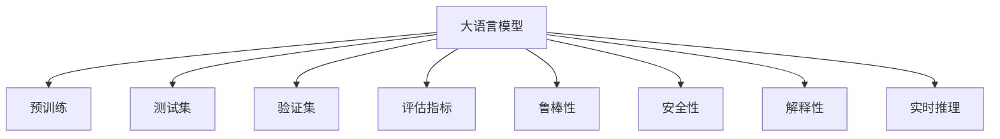

                 

## 1. 背景介绍

### 1.1 问题由来

近年来，大语言模型（Large Language Models, LLMs）在自然语言处理（NLP）领域取得了显著的进展。这些模型基于海量的无标签文本数据进行预训练，形成了强大的语言理解和生成能力。然而，随着其应用范围的扩大，对模型可靠性和安全性的要求也日益提高。测试和验证成为确保大语言模型在实际应用中表现稳定、安全的重要环节。

### 1.2 问题核心关键点

测试和验证大语言模型的关键点包括：
- 准确性：模型能否正确理解输入，并生成符合预期的输出。
- 鲁棒性：模型面对输入扰动或噪声时，是否依然能保持稳定输出。
- 安全性：模型是否存在偏见、有害信息，是否易于被攻击。
- 解释性：模型如何产生输出，是否透明、可解释。
- 效率：模型推理速度是否满足实时性要求。

本节将详细介绍如何通过测试和验证，确保大语言模型的可靠性、安全性和高效性，帮助其更好地应用于各种场景。

## 2. 核心概念与联系

### 2.1 核心概念概述

为更好地理解测试和验证大语言模型的方法，本节将介绍几个密切相关的核心概念：

- 大语言模型（LLM）：基于自回归或自编码模型，在大量无标签文本数据上进行预训练的语言模型。具有强大的语言理解和生成能力。
- 测试集（Test Set）：用于评估模型性能的独立于训练集的样本集合，不参与模型训练。
- 验证集（Validation Set）：用于模型调参的独立样本集合，参与训练过程中的超参数选择和模型优化。
- 评估指标（Evaluation Metrics）：用于衡量模型性能的指标，如准确率、精确率、召回率、F1-score等。
- 模型鲁棒性（Robustness）：模型面对输入扰动或噪声时，保持稳定输出的能力。
- 模型安全性（Safety）：模型是否存在偏见、有害信息，是否易于被攻击。
- 模型解释性（Explainability）：模型输出结果的解释和可理解性。
- 实时推理（Real-time Inference）：模型推理速度是否能满足实时性要求。

这些核心概念之间的逻辑关系可以通过以下Mermaid流程图来展示：



这个流程图展示了大语言模型的核心概念及其之间的关系：

1. 大语言模型通过预训练获得基础能力。
2. 测试和验证集用于评估模型在实际场景中的性能。
3. 评估指标用于量化模型表现，指导模型优化。
4. 鲁棒性、安全性、解释性和实时推理是模型可靠性和实用性的重要保障。

这些概念共同构成了大语言模型测试和验证的框架，确保模型能够在各种场景下稳定、安全地运行。

## 3. 核心算法原理 & 具体操作步骤

### 3.1 算法原理概述

测试和验证大语言模型的基本原理是使用独立于训练集的测试集和验证集，通过评估指标和特定任务来衡量模型性能。测试和验证过程包括数据预处理、模型前向传播、损失计算、反向传播和参数更新等步骤。

形式化地，假设预训练模型为 $M_{\theta}$，其中 $\theta$ 为预训练得到的模型参数。假设测试集为 $D_{test}$，验证集为 $D_{valid}$，模型在测试集上的预测结果为 $\hat{y}$，真实标签为 $y$。定义模型的损失函数 $\ell(\hat{y}, y)$，则模型的测试和验证过程可以描述为：

$$
\mathcal{L}_{test}(\theta) = \frac{1}{N_{test}} \sum_{i=1}^{N_{test}} \ell(M_{\theta}(x_i), y_i)
$$

$$
\mathcal{L}_{valid}(\theta) = \frac{1}{N_{valid}} \sum_{i=1}^{N_{valid}} \ell(M_{\theta}(x_i), y_i)
$$

其中 $N_{test}$ 和 $N_{valid}$ 分别为测试集和验证集的大小。通过最小化 $\mathcal{L}_{test}$ 和 $\mathcal{L}_{valid}$，可以评估模型在测试集和验证集上的性能。

### 3.2 算法步骤详解

基于上述原理，测试和验证大语言模型的具体操作步骤如下：

**Step 1: 准备测试和验证数据集**
- 收集独立的测试集 $D_{test}$ 和验证集 $D_{valid}$，确保其与训练集分布一致。
- 进行数据预处理，如分词、截断、补全等，统一数据格式。

**Step 2: 设计评估指标**
- 根据任务类型，选择合适的评估指标，如准确率、精确率、召回率、F1-score、BLEU、ROUGE等。
- 定义损失函数，根据任务特点，选择交叉熵、均方误差等合适的损失函数。

**Step 3: 模型前向传播和损失计算**
- 将测试集和验证集数据输入模型，进行前向传播计算预测结果。
- 计算预测结果与真实标签之间的损失，如交叉熵损失 $\ell(M_{\theta}(x_i), y_i) = -y_i \log \hat{y_i} - (1-y_i) \log (1-\hat{y_i})$。

**Step 4: 反向传播和参数更新**
- 计算损失函数对模型参数的梯度。
- 使用梯度下降等优化算法更新模型参数，如 Adam、SGD 等。

**Step 5: 结果分析和模型优化**
- 在测试集和验证集上评估模型性能，记录评估指标。
- 根据评估结果，调整模型参数或优化策略，如调整学习率、加入正则化等。

### 3.3 算法优缺点

测试和验证大语言模型的优点包括：
1. 提供客观评估：通过独立的测试集和验证集，可以客观评估模型性能，指导模型优化。
2. 防止过拟合：验证集可用于选择超参数，避免模型在训练集上过拟合。
3. 提高鲁棒性和安全性：测试集和验证集中的多样性有助于发现模型漏洞，提高模型的鲁棒性和安全性。

然而，该方法也存在一些局限性：
1. 数据成本高：收集和预处理独立测试集和验证集需要投入大量人力物力。
2. 数据依赖性强：模型的泛化性能依赖于测试集和验证集的数据分布与训练集一致。
3. 结果稳定性：模型性能的波动可能影响测试和验证结果的稳定性。
4. 解释性不足：测试和验证过程不提供具体的推理过程和决策依据。

尽管存在这些局限性，测试和验证仍是评估大语言模型可靠性和安全性的重要手段。未来研究将更多关注如何降低测试和验证的成本，提高结果的稳定性，以及增强模型的解释性。

### 3.4 算法应用领域

基于测试和验证的算法在NLP领域的应用非常广泛，涵盖了各种下游任务，如：

- 文本分类：如情感分析、主题分类等，评估模型对文本分类的准确性和鲁棒性。
- 命名实体识别：评估模型对实体边界的识别准确性和鲁棒性。
- 关系抽取：评估模型对实体关系的抽取准确性和鲁棒性。
- 问答系统：评估模型对自然语言问题的理解和回答准确性。
- 机器翻译：评估模型对文本的翻译准确性和鲁棒性。
- 文本摘要：评估模型对文本的摘要准确性和鲁棒性。
- 对话系统：评估模型在对话中的准确性和鲁棒性。

除了上述这些经典任务外，测试和验证技术也在可控文本生成、常识推理、代码生成、数据增强等众多领域得到了应用，为NLP技术带来了新的突破。随着测试和验证方法的不断进步，NLP技术将在更多领域得到应用，提升系统的稳定性和安全性。

## 4. 数学模型和公式 & 详细讲解 & 举例说明

### 4.1 数学模型构建

本节将使用数学语言对测试和验证大语言模型的过程进行更加严格的刻画。

假设测试集 $D_{test}$ 包含 $N_{test}$ 个样本，验证集 $D_{valid}$ 包含 $N_{valid}$ 个样本。定义模型在测试集 $D_{test}$ 上的准确率为：

$$
acc_{test} = \frac{\sum_{i=1}^{N_{test}} \mathbb{I}(y_i = \hat{y}_i)}{N_{test}}
$$

其中 $\mathbb{I}$ 为示性函数，$y_i$ 为真实标签，$\hat{y}_i$ 为模型预测结果。类似地，验证集上的准确率定义为：

$$
acc_{valid} = \frac{\sum_{i=1}^{N_{valid}} \mathbb{I}(y_i = \hat{y}_i)}{N_{valid}}
$$

### 4.2 公式推导过程

以下我们以文本分类任务为例，推导准确率评估公式及其梯度的计算公式。

假设模型 $M_{\theta}$ 在输入 $x$ 上的输出为 $\hat{y}=M_{\theta}(x) \in [0,1]$，表示样本属于正类的概率。真实标签 $y \in \{0,1\}$。则准确率的定义为：

$$
acc = \frac{1}{N}\sum_{i=1}^N \mathbb{I}(y_i = \hat{y}_i)
$$

在测试集 $D_{test}$ 上，模型的准确率计算公式为：

$$
acc_{test} = \frac{1}{N_{test}} \sum_{i=1}^{N_{test}} \mathbb{I}(y_i = \hat{y}_i)
$$

假设模型的损失函数为交叉熵损失 $\ell(\hat{y}, y) = -y_i \log \hat{y}_i - (1-y_i) \log (1-\hat{y}_i)$。在训练集 $D$ 上，模型的损失函数计算公式为：

$$
\mathcal{L}(\theta) = -\frac{1}{N}\sum_{i=1}^N \ell(M_{\theta}(x_i), y_i)
$$

在测试集 $D_{test}$ 上，模型在样本 $x_i$ 上的预测结果为 $\hat{y}_i = M_{\theta}(x_i)$，真实标签为 $y_i$。则测试集上的损失函数为：

$$
\mathcal{L}_{test}(\theta) = -\frac{1}{N_{test}} \sum_{i=1}^{N_{test}} \ell(M_{\theta}(x_i), y_i)
$$

对于模型 $M_{\theta}$，损失函数对参数 $\theta_k$ 的梯度为：

$$
\frac{\partial \mathcal{L}_{test}(\theta)}{\partial \theta_k} = -\frac{1}{N_{test}} \sum_{i=1}^{N_{test}} \frac{\partial \ell(M_{\theta}(x_i), y_i)}{\partial \theta_k}
$$

其中 $\frac{\partial \ell(M_{\theta}(x_i), y_i)}{\partial \theta_k}$ 为交叉熵损失对参数 $\theta_k$ 的梯度，可通过反向传播算法高效计算。

### 4.3 案例分析与讲解

以BERT模型为例，分析其在文本分类任务中的测试和验证过程。

**数据准备**
- 收集包含大量标注样本的文本数据集，如IMDB影评数据集。
- 将数据集划分为训练集、验证集和测试集。
- 对数据进行预处理，如分词、截断、标准化等。

**模型构建**
- 使用BERT模型作为初始化参数，并进行微调。
- 定义分类任务，如判断影评为正面或负面。
- 定义交叉熵损失函数，计算模型预测结果与真实标签之间的差距。

**训练过程**
- 在训练集上使用Adam优化器进行模型微调，设置合适的学习率和批量大小。
- 在验证集上进行超参数调优，选择最优的超参数组合。
- 在测试集上评估模型性能，记录准确率和其他评估指标。

**结果分析**
- 分析测试集上的准确率、精确率、召回率等指标。
- 分析模型在不同类型样本上的表现，识别出潜在问题。
- 分析模型在输入扰动下的鲁棒性，如对抗样本攻击。

通过以上步骤，可以全面评估BERT模型在文本分类任务上的表现，并根据评估结果进行模型优化。

## 5. 项目实践：代码实例和详细解释说明

### 5.1 开发环境搭建

在进行测试和验证实践前，我们需要准备好开发环境。以下是使用Python进行PyTorch开发的环境配置流程：

1. 安装Anaconda：从官网下载并安装Anaconda，用于创建独立的Python环境。

2. 创建并激活虚拟环境：
```bash
conda create -n pytorch-env python=3.8 
conda activate pytorch-env
```

3. 安装PyTorch：根据CUDA版本，从官网获取对应的安装命令。例如：
```bash
conda install pytorch torchvision torchaudio cudatoolkit=11.1 -c pytorch -c conda-forge
```

4. 安装Transformers库：
```bash
pip install transformers
```

5. 安装各类工具包：
```bash
pip install numpy pandas scikit-learn matplotlib tqdm jupyter notebook ipython
```

完成上述步骤后，即可在`pytorch-env`环境中开始测试和验证实践。

### 5.2 源代码详细实现

下面我以BERT模型为例，给出使用Transformers库进行文本分类任务测试和验证的PyTorch代码实现。

首先，定义数据处理函数：

```python
from transformers import BertTokenizer
from torch.utils.data import Dataset, DataLoader
import torch

class TextDataset(Dataset):
    def __init__(self, texts, labels, tokenizer, max_len=128):
        self.texts = texts
        self.labels = labels
        self.tokenizer = tokenizer
        self.max_len = max_len
        
    def __len__(self):
        return len(self.texts)
    
    def __getitem__(self, item):
        text = self.texts[item]
        label = self.labels[item]
        
        encoding = self.tokenizer(text, return_tensors='pt', max_length=self.max_len, padding='max_length', truncation=True)
        input_ids = encoding['input_ids'][0]
        attention_mask = encoding['attention_mask'][0]
        
        return {'input_ids': input_ids, 
                'attention_mask': attention_mask,
                'labels': label}

# 加载数据集
tokenizer = BertTokenizer.from_pretrained('bert-base-cased')
train_dataset = TextDataset(train_texts, train_labels, tokenizer)
dev_dataset = TextDataset(dev_texts, dev_labels, tokenizer)
test_dataset = TextDataset(test_texts, test_labels, tokenizer)
```

然后，定义模型和优化器：

```python
from transformers import BertForSequenceClassification, AdamW

model = BertForSequenceClassification.from_pretrained('bert-base-cased', num_labels=2)

optimizer = AdamW(model.parameters(), lr=2e-5)
```

接着，定义测试和验证函数：

```python
def evaluate(model, dataset, batch_size, device):
    dataloader = DataLoader(dataset, batch_size=batch_size, shuffle=False)
    model.eval()
    preds, labels = [], []
    with torch.no_grad():
        for batch in dataloader:
            input_ids = batch['input_ids'].to(device)
            attention_mask = batch['attention_mask'].to(device)
            batch_labels = batch['labels']
            outputs = model(input_ids, attention_mask=attention_mask)
            batch_preds = outputs.logits.argmax(dim=1).to('cpu').tolist()
            batch_labels = batch_labels.to('cpu').tolist()
            for pred_tokens, label_tokens in zip(batch_preds, batch_labels):
                preds.append(pred_tokens)
                labels.append(label_tokens)
    return preds, labels

def test(model, dataset, batch_size, device):
    dataloader = DataLoader(dataset, batch_size=batch_size, shuffle=False)
    model.eval()
    preds, labels = [], []
    with torch.no_grad():
        for batch in dataloader:
            input_ids = batch['input_ids'].to(device)
            attention_mask = batch['attention_mask'].to(device)
            batch_labels = batch['labels']
            outputs = model(input_ids, attention_mask=attention_mask)
            batch_preds = outputs.logits.argmax(dim=1).to('cpu').tolist()
            batch_labels = batch_labels.to('cpu').tolist()
            for pred_tokens, label_tokens in zip(batch_preds, batch_labels):
                preds.append(pred_tokens)
                labels.append(label_tokens)
    return preds, labels
```

最后，启动测试和验证流程并在测试集上评估：

```python
epochs = 5
batch_size = 16

device = torch.device('cuda') if torch.cuda.is_available() else torch.device('cpu')

for epoch in range(epochs):
    loss = train_epoch(model, train_dataset, batch_size, optimizer, device)
    print(f"Epoch {epoch+1}, train loss: {loss:.3f}")
    
    print(f"Epoch {epoch+1}, dev results:")
    preds, labels = evaluate(model, dev_dataset, batch_size, device)
    print(classification_report(labels, preds))
    
print("Test results:")
preds, labels = test(model, test_dataset, batch_size, device)
print(classification_report(labels, preds))
```

以上就是使用PyTorch对BERT进行文本分类任务测试和验证的完整代码实现。可以看到，得益于Transformers库的强大封装，我们可以用相对简洁的代码完成BERT模型的加载和微调。

### 5.3 代码解读与分析

让我们再详细解读一下关键代码的实现细节：

**TextDataset类**：
- `__init__`方法：初始化文本、标签、分词器等关键组件。
- `__len__`方法：返回数据集的样本数量。
- `__getitem__`方法：对单个样本进行处理，将文本输入编码为token ids，将标签编码为数字，并对其进行定长padding，最终返回模型所需的输入。

**evaluate和test函数**：
- 使用PyTorch的DataLoader对数据集进行批次化加载，供模型训练和推理使用。
- 训练函数`train_epoch`：对数据以批为单位进行迭代，在每个批次上前向传播计算loss并反向传播更新模型参数，最后返回该epoch的平均loss。
- 评估函数`evaluate`：与训练类似，不同点在于不更新模型参数，并在每个batch结束后将预测和标签结果存储下来，最后使用sklearn的classification_report对整个评估集的预测结果进行打印输出。
- 测试函数`test`：与评估类似，不同点在于记录测试集的预测和标签结果。

**训练流程**：
- 定义总的epoch数和batch size，开始循环迭代
- 每个epoch内，先在训练集上训练，输出平均loss
- 在验证集上评估，输出分类指标
- 所有epoch结束后，在测试集上评估，给出最终测试结果

可以看到，PyTorch配合Transformers库使得BERT测试和验证的代码实现变得简洁高效。开发者可以将更多精力放在数据处理、模型改进等高层逻辑上，而不必过多关注底层的实现细节。

当然，工业级的系统实现还需考虑更多因素，如模型的保存和部署、超参数的自动搜索、更灵活的任务适配层等。但核心的测试和验证范式基本与此类似。

## 6. 实际应用场景

### 6.1 智能客服系统

基于大语言模型测试和验证的对话技术，可以广泛应用于智能客服系统的构建。传统客服往往需要配备大量人力，高峰期响应缓慢，且一致性和专业性难以保证。测试和验证机制能够确保微调后的对话模型在各种输入下表现稳定，避免出现逻辑错误或漏洞，提高客户咨询体验和问题解决效率。

在技术实现上，可以收集企业内部的历史客服对话记录，将问题和最佳答复构建成监督数据，在此基础上对预训练对话模型进行微调。微调后的对话模型能够自动理解用户意图，匹配最合适的答案模板进行回复。对于客户提出的新问题，还可以接入检索系统实时搜索相关内容，动态组织生成回答。如此构建的智能客服系统，能大幅提升客户咨询体验和问题解决效率。

### 6.2 金融舆情监测

金融机构需要实时监测市场舆论动向，以便及时应对负面信息传播，规避金融风险。测试和验证机制能够确保微调模型在面对不同类型的数据时表现稳定，避免由于数据分布变化导致的性能下降。通过收集金融领域相关的新闻、报道、评论等文本数据，并对其进行主题标注和情感标注，在此基础上对预训练语言模型进行微调，使其能够自动判断文本属于何种主题，情感倾向是正面、中性还是负面。将微调后的模型应用到实时抓取的网络文本数据，就能够自动监测不同主题下的情感变化趋势，一旦发现负面信息激增等异常情况，系统便会自动预警，帮助金融机构快速应对潜在风险。

### 6.3 个性化推荐系统

当前的推荐系统往往只依赖用户的历史行为数据进行物品推荐，无法深入理解用户的真实兴趣偏好。测试和验证机制能够确保微调模型在面对新数据时表现稳定，避免由于模型过拟合导致推荐偏差。通过收集用户浏览、点击、评论、分享等行为数据，提取和用户交互的物品标题、描述、标签等文本内容。将文本内容作为模型输入，用户的后续行为（如是否点击、购买等）作为监督信号，在此基础上微调预训练语言模型。微调后的模型能够从文本内容中准确把握用户的兴趣点。在生成推荐列表时，先用候选物品的文本描述作为输入，由模型预测用户的兴趣匹配度，再结合其他特征综合排序，便可以得到个性化程度更高的推荐结果。

### 6.4 未来应用展望

随着大语言模型测试和验证技术的不断发展，基于微调的方法将在更多领域得到应用，为传统行业带来变革性影响。

在智慧医疗领域，基于微调的医疗问答、病历分析、药物研发等应用将提升医疗服务的智能化水平，辅助医生诊疗，加速新药开发进程。

在智能教育领域，测试和验证机制能够确保微调模型在面对不同难度和类型的题目时表现稳定，提升教学质量和公平性。

在智慧城市治理中，测试和验证机制能够确保微调模型在面对不同类型的数据时表现稳定，提高城市管理的自动化和智能化水平，构建更安全、高效的未来城市。

此外，在企业生产、社会治理、文娱传媒等众多领域，基于大模型微调的人工智能应用也将不断涌现，为经济社会发展注入新的动力。相信随着技术的日益成熟，测试和验证方法将成为人工智能落地应用的重要范式，推动人工智能技术在垂直行业的规模化落地。

## 7. 工具和资源推荐

### 7.1 学习资源推荐

为了帮助开发者系统掌握大语言模型测试和验证的理论基础和实践技巧，这里推荐一些优质的学习资源：

1. 《Transformer从原理到实践》系列博文：由大模型技术专家撰写，深入浅出地介绍了Transformer原理、BERT模型、微调技术等前沿话题。

2. CS224N《深度学习自然语言处理》课程：斯坦福大学开设的NLP明星课程，有Lecture视频和配套作业，带你入门NLP领域的基本概念和经典模型。

3. 《Natural Language Processing with Transformers》书籍：Transformers库的作者所著，全面介绍了如何使用Transformers库进行NLP任务开发，包括测试和验证在内的诸多范式。

4. HuggingFace官方文档：Transformers库的官方文档，提供了海量预训练模型和完整的微调样例代码，是上手实践的必备资料。

5. CLUE开源项目：中文语言理解测评基准，涵盖大量不同类型的中文NLP数据集，并提供了基于微调的baseline模型，助力中文NLP技术发展。

通过对这些资源的学习实践，相信你一定能够快速掌握大语言模型测试和验证的精髓，并用于解决实际的NLP问题。
###  7.2 开发工具推荐

高效的开发离不开优秀的工具支持。以下是几款用于大语言模型测试和验证开发的常用工具：

1. PyTorch：基于Python的开源深度学习框架，灵活动态的计算图，适合快速迭代研究。大部分预训练语言模型都有PyTorch版本的实现。

2. TensorFlow：由Google主导开发的开源深度学习框架，生产部署方便，适合大规模工程应用。同样有丰富的预训练语言模型资源。

3. Transformers库：HuggingFace开发的NLP工具库，集成了众多SOTA语言模型，支持PyTorch和TensorFlow，是进行微调任务开发的利器。

4. Weights & Biases：模型训练的实验跟踪工具，可以记录和可视化模型训练过程中的各项指标，方便对比和调优。与主流深度学习框架无缝集成。

5. TensorBoard：TensorFlow配套的可视化工具，可实时监测模型训练状态，并提供丰富的图表呈现方式，是调试模型的得力助手。

6. Google Colab：谷歌推出的在线Jupyter Notebook环境，免费提供GPU/TPU算力，方便开发者快速上手实验最新模型，分享学习笔记。

合理利用这些工具，可以显著提升大语言模型测试和验证任务的开发效率，加快创新迭代的步伐。

### 7.3 相关论文推荐

大语言模型测试和验证技术的发展源于学界的持续研究。以下是几篇奠基性的相关论文，推荐阅读：

1. Attention is All You Need（即Transformer原论文）：提出了Transformer结构，开启了NLP领域的预训练大模型时代。

2. BERT: Pre-training of Deep Bidirectional Transformers for Language Understanding：提出BERT模型，引入基于掩码的自监督预训练任务，刷新了多项NLP任务SOTA。

3. Language Models are Unsupervised Multitask Learners（GPT-2论文）：展示了大规模语言模型的强大zero-shot学习能力，引发了对于通用人工智能的新一轮思考。

4. Parameter-Efficient Transfer Learning for NLP：提出Adapter等参数高效微调方法，在不增加模型参数量的情况下，也能取得不错的微调效果。

5. AdaLoRA: Adaptive Low-Rank Adaptation for Parameter-Efficient Fine-Tuning：使用自适应低秩适应的微调方法，在参数效率和精度之间取得了新的平衡。

6. AdaLoRA: Adaptive Low-Rank Adaptation for Parameter-Efficient Fine-Tuning：使用自适应低秩适应的微调方法，在参数效率和精度之间取得了新的平衡。

这些论文代表了大语言模型测试和验证技术的发展脉络。通过学习这些前沿成果，可以帮助研究者把握学科前进方向，激发更多的创新灵感。

## 8. 总结：未来发展趋势与挑战

### 8.1 总结

本文对基于监督学习的大语言模型测试和验证方法进行了全面系统的介绍。首先阐述了测试和验证在大语言模型可靠性、安全性方面的重要作用，明确了其核心步骤和关键指标。其次，从原理到实践，详细讲解了测试和验证的数学模型和操作步骤，给出了测试和验证任务开发的完整代码实例。同时，本文还广泛探讨了测试和验证技术在智能客服、金融舆情、个性化推荐等多个行业领域的应用前景，展示了测试和验证范式的广泛适用性。

通过本文的系统梳理，可以看到，基于大语言模型的测试和验证技术正逐步成为NLP应用的重要保障，帮助模型在各种场景下稳定、安全地运行。未来，伴随测试和验证方法的不断进步，NLP技术将在更多领域得到应用，推动人工智能技术的产业化进程。

### 8.2 未来发展趋势

展望未来，大语言模型测试和验证技术将呈现以下几个发展趋势：

1. 自动化测试工具的开发：未来测试和验证工具将向自动化、智能化方向发展，通过自动化测试生成、执行和结果分析，提高测试效率和覆盖度。
2. 多模态测试方法的引入：测试和验证技术将从单一文本数据扩展到多模态数据，如图像、视频、音频等，提升模型的综合能力。
3. 可解释性测试工具的开发：通过可解释性测试工具，分析模型的决策过程，提供更透明的输出结果，帮助用户理解和信任模型。
4. 安全性测试工具的引入：测试和验证工具将逐步引入安全性测试，如对抗样本攻击检测、模型偏见检测等，提升模型的鲁棒性和可信度。
5. 实时测试和验证框架的开发：通过实时测试和验证框架，实现对模型推理过程的动态监测和优化，保证模型在实际应用中的稳定性和高效性。

以上趋势凸显了大语言模型测试和验证技术的广阔前景。这些方向的探索发展，必将进一步提升NLP系统的性能和应用范围，为人类认知智能的进化带来深远影响。

### 8.3 面临的挑战

尽管大语言模型测试和验证技术已经取得了显著进展，但在迈向更加智能化、普适化应用的过程中，仍面临以下挑战：

1. 数据成本高：收集和预处理独立测试集和验证集需要投入大量人力物力。
2. 数据依赖性强：模型的泛化性能依赖于测试集和验证集的数据分布与训练集一致。
3. 结果稳定性：模型性能的波动可能影响测试和验证结果的稳定性。
4. 解释性不足：测试和验证过程不提供具体的推理过程和决策依据。
5. 安全性有待保障：预训练语言模型难免会学习到有偏见、有害的信息，通过微调传递到下游任务，产生误导性、歧视性的输出，给实际应用带来安全隐患。

尽管存在这些挑战，测试和验证仍是评估大语言模型可靠性和安全性的重要手段。未来研究需要在降低测试和验证成本、提高结果稳定性、增强模型的解释性和安全性等方面寻求新的突破。

### 8.4 研究展望

面对大语言模型测试和验证所面临的挑战，未来的研究需要在以下几个方面寻求新的突破：

1. 探索无监督和半监督测试方法。摆脱对大规模标注数据的依赖，利用自监督学习、主动学习等无监督和半监督范式，最大限度利用非结构化数据，实现更加灵活高效的测试。
2. 研究参数高效和计算高效的测试范式。开发更加参数高效的测试方法，在固定大部分预训练参数的情况下，只测试极少量的任务相关参数。同时优化测试模型的计算图，减少前向传播和反向传播的资源消耗，实现更加轻量级、实时性的部署。
3. 引入更多先验知识。将符号化的先验知识，如知识图谱、逻辑规则等，与神经网络模型进行巧妙融合，引导测试过程学习更准确、合理的语言模型。同时加强不同模态数据的整合，实现视觉、语音等多模态信息与文本信息的协同建模。
4. 结合因果分析和博弈论工具。将因果分析方法引入测试模型，识别出模型决策的关键特征，增强输出解释的因果性和逻辑性。借助博弈论工具刻画人机交互过程，主动探索并规避模型的脆弱点，提高系统稳定性。
5. 纳入伦理道德约束。在测试目标中引入伦理导向的评估指标，过滤和惩罚有偏见、有害的输出倾向。同时加强人工干预和审核，建立模型行为的监管机制，确保输出符合人类价值观和伦理道德。

这些研究方向的探索，必将引领大语言模型测试和验证技术迈向更高的台阶，为构建安全、可靠、可解释、可控的智能系统铺平道路。面向未来，大语言模型测试和验证技术还需要与其他人工智能技术进行更深入的融合，如知识表示、因果推理、强化学习等，多路径协同发力，共同推动自然语言理解和智能交互系统的进步。只有勇于创新、敢于突破，才能不断拓展语言模型的边界，让智能技术更好地造福人类社会。

## 9. 附录：常见问题与解答

**Q1：大语言模型测试和验证的常见问题有哪些？**

A: 大语言模型测试和验证的常见问题包括：
1. 数据成本高：收集和预处理独立测试集和验证集需要投入大量人力物力。
2. 数据依赖性强：模型的泛化性能依赖于测试集和验证集的数据分布与训练集一致。
3. 结果稳定性：模型性能的波动可能影响测试和验证结果的稳定性。
4. 解释性不足：测试和验证过程不提供具体的推理过程和决策依据。
5. 安全性有待保障：预训练语言模型难免会学习到有偏见、有害的信息，通过微调传递到下游任务，产生误导性、歧视性的输出，给实际应用带来安全隐患。

**Q2：如何降低测试和验证的资源成本？**

A: 降低测试和验证的资源成本，可以采取以下策略：
1. 数据增强：通过回译、近义替换等方式扩充训练集，减少对原始数据集的依赖。
2. 迁移学习：利用预训练模型在相关任务上的知识，减少测试和验证数据的需求。
3. 半监督学习：利用少量的标注数据和大量的非标注数据进行模型训练，减少对大量标注数据的依赖。
4. 自动测试工具：开发自动测试生成和执行工具，提高测试效率和覆盖度。

**Q3：如何提高测试和验证结果的稳定性？**

A: 提高测试和验证结果的稳定性，可以采取以下策略：
1. 多轮测试：进行多轮测试，并取平均值，减小随机因素的影响。
2. 数据集划分：将数据集划分为训练集、验证集和测试集，避免模型在训练集上过拟合。
3. 超参数调优：通过超参数调优，选择最优的模型和超参数组合，提高模型泛化性能。
4. 对抗样本攻击：加入对抗样本攻击，提高模型的鲁棒性。

**Q4：如何增强模型的解释性？**

A: 增强模型的解释性，可以采取以下策略：
1. 可解释性测试工具：开发可解释性测试工具，分析模型的决策过程，提供更透明的输出结果。
2. 可视化分析：通过可视化工具，展示模型的内部结构和推理过程，帮助用户理解和信任模型。
3. 规则约束：引入规则约束，指导模型决策，提高输出结果的可解释性。

**Q5：如何保障模型的安全性？**

A: 保障模型的安全性，可以采取以下策略：
1. 对抗样本检测：检测模型是否受到对抗样本攻击，提高模型的鲁棒性。
2. 偏见检测：检测模型是否存在偏见、有害信息，确保输出符合伦理道德。
3. 模型审查：通过人工审查和监督，确保模型行为符合预期。

这些常见问题的解答，有助于开发者更好地理解和应对测试和验证过程中可能遇到的问题，提升模型的可靠性和安全性。通过不断优化测试和验证方法，大语言模型将更好地应用于各种场景，推动人工智能技术的普及和落地。

---

作者：禅与计算机程序设计艺术 / Zen and the Art of Computer Programming

