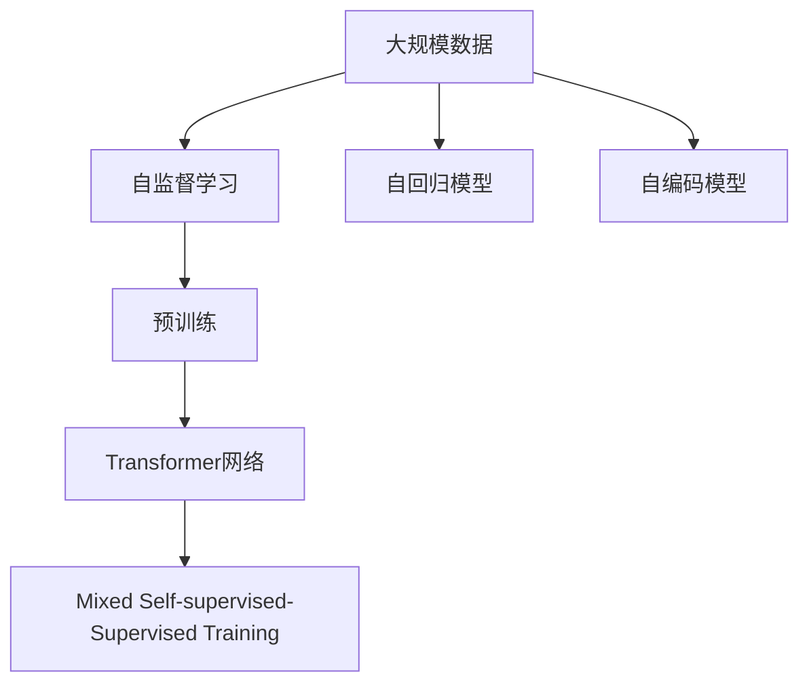

                 

# LLM 的训练：大规模数据和先进算法

> 关键词：大规模数据, 先进算法, 自监督学习, 预训练, 自然语言处理(NLP), Transformer, 自回归模型, 自编码模型

## 1. 背景介绍

### 1.1 问题由来
随着深度学习技术的迅猛发展，自然语言处理(NLP)领域的大规模语言模型(LLMs)在近年来取得了突破性的进展。这些模型在文本分类、机器翻译、问答系统等NLP任务上表现优异。然而，构建大规模语言模型需要海量标注数据，这在实际应用中往往难以实现。此外，当前主流的自监督预训练方法在模型训练效率和资源消耗方面也存在显著瓶颈。因此，如何在大规模数据和先进算法的支持下，有效训练出高性能的语言模型，成为了当前NLP研究的热点问题。

### 1.2 问题核心关键点
本文将深入探讨LLM的训练方法，包括：
1. 利用大规模数据进行预训练，使模型学习到通用的语言表示。
2. 使用先进的自监督算法和优化技术，提升模型训练效率和效果。
3. 探索新的训练范式，如混合自监督-监督训练、自回归模型、自编码模型等，以期进一步提升模型性能。

### 1.3 问题研究意义
研究基于大规模数据和先进算法的LLM训练方法，对于拓展NLP模型的应用范围，提升模型效果，加速NLP技术的产业化进程具有重要意义：
1. 降低应用开发成本。使用大规模数据进行预训练，可以显著减少从头训练所需的数据、计算和人力等成本投入。
2. 提升模型效果。先进的自监督算法和优化技术能够提高模型的泛化能力和性能。
3. 加速开发进度。standing on the shoulders of giants，预训练模型可以加速任务适配，缩短开发周期。
4. 带来技术创新。混合自监督-监督训练、自回归模型、自编码模型等新技术，促进了对预训练-微调的深入研究，催生了新的研究方向。
5. 赋能产业升级。大规模数据和先进算法的应用，使得NLP技术更容易被各行各业所采用，为传统行业数字化转型升级提供新的技术路径。

## 2. 核心概念与联系

### 2.1 核心概念概述

为更好地理解LLM的训练方法，本节将介绍几个密切相关的核心概念：

- **大规模数据(Massive Data)**：指在训练过程中使用的海量无标签文本数据，通过自监督学习任务，使模型学习到丰富的语言知识和常识。

- **自监督学习(Self-supervised Learning)**：指利用模型自身的预测能力进行训练，不依赖于人工标注数据。常见的自监督任务包括掩码语言模型、预测任务等。

- **预训练(Pre-training)**：指在大量无标签文本数据上进行自监督学习，学习通用的语言表示。预训练使得模型学习到语言的普遍规律和知识。

- **自回归模型(Autoregressive Model)**：如GPT等模型，按顺序生成文本，每个位置的输出依赖于前面位置的输出，以顺序方式生成整个文本。

- **自编码模型(Autocoder Model)**：如BERT等模型，通过编码-解码方式生成文本，每个位置的输出独立，可以并行计算。

- **Transformer网络(Transformer Network)**：基于注意力机制的自编码模型，广泛应用于各类NLP任务，具有计算高效、效果出色的特点。

- **混合自监督-监督训练(Mixed Self-supervised-Supervised Training)**：结合自监督和监督学习，利用少量标注数据进行微调，提升模型性能。

这些核心概念之间的逻辑关系可以通过以下Mermaid流程图来展示：



这个流程图展示了大规模数据在LLM训练中的核心作用，以及自监督学习、自回归模型、自编码模型和Transformer网络的相互联系：

1. 大规模数据是LLM训练的基础，自监督学习通过无标签数据进行预训练。
2. 自回归模型和自编码模型分别从不同角度学习语言表示，提升模型泛化能力。
3. 自监督预训练与监督学习相结合，提升模型的任务适配能力。
4. Transformer网络作为底层架构，支持各种自监督和混合训练方法。

这些概念共同构成了LLM的训练框架，使其能够在各种场景下发挥强大的语言理解和生成能力。通过理解这些核心概念，我们可以更好地把握LLM的工作原理和优化方向。

## 3. 核心算法原理 & 具体操作步骤
### 3.1 算法原理概述

基于大规模数据和先进算法的LLM训练，本质上是一个多步骤的学习过程。其核心思想是：利用大规模无标签文本数据进行自监督预训练，使模型学习到通用的语言表示，然后在下游任务上有监督地进行微调，进一步提升模型在特定任务上的性能。

形式化地，假设预训练模型为 $M_{\theta}$，其中 $\theta$ 为预训练得到的模型参数。给定下游任务 $T$ 的标注数据集 $D=\{(x_i, y_i)\}_{i=1}^N$，预训练和微调的目标是找到新的模型参数 $\hat{\theta}$，使得：

$$
\hat{\theta}=\mathop{\arg\min}_{\theta} \mathcal{L}(M_{\theta},D)
$$

其中 $\mathcal{L}$ 为针对任务 $T$ 设计的损失函数，用于衡量模型预测输出与真实标签之间的差异。常见的损失函数包括交叉熵损失、均方误差损失等。

通过梯度下降等优化算法，训练过程不断更新模型参数 $\theta$，最小化损失函数 $\mathcal{L}$，使得模型输出逼近真实标签。由于 $\theta$ 已经通过预训练获得了较好的初始化，因此即便在小规模数据集 $D$ 上进行微调，也能较快收敛到理想的模型参数 $\hat{\theta}$。

### 3.2 算法步骤详解

基于大规模数据和先进算法的LLM训练一般包括以下几个关键步骤：

**Step 1: 准备数据和模型**
- 收集或购买大规模无标签文本数据，如维基百科、新闻、社交媒体等。
- 选择或设计合适的自监督学习任务，如掩码语言模型、预测任务等。
- 选择合适的预训练模型架构，如Transformer，设计模型参数初始化。

**Step 2: 自监督预训练**
- 使用选择的自监督学习任务，对预训练模型进行多轮迭代训练。
- 每次迭代使用一部分数据进行预训练，逐渐减少迭代轮数，使模型泛化能力不断增强。
- 使用验证集评估模型性能，防止过拟合。

**Step 3: 下游任务微调**
- 根据下游任务的标注数据集 $D$，设计合适的输出层和损失函数。
- 选择适合优化算法及其参数，如AdamW、SGD等，设置学习率、批大小、迭代轮数等。
- 在验证集上评估模型性能，根据性能指标决定是否触发Early Stopping。
- 重复上述步骤直到满足预设的迭代轮数或Early Stopping条件。

**Step 4: 测试和部署**
- 在测试集上评估微调后模型 $M_{\hat{\theta}}$ 的性能，对比微调前后的精度提升。
- 使用微调后的模型对新样本进行推理预测，集成到实际的应用系统中。
- 持续收集新的数据，定期重新微调模型，以适应数据分布的变化。

以上是基于大规模数据和先进算法的LLM训练的一般流程。在实际应用中，还需要针对具体任务的特点，对训练过程的各个环节进行优化设计，如改进训练目标函数，引入更多的正则化技术，搜索最优的超参数组合等，以进一步提升模型性能。

### 3.3 算法优缺点

基于大规模数据和先进算法的LLM训练方法具有以下优点：
1. 简单高效。使用大规模数据进行预训练，可以显著减少从头训练所需的数据、计算和人力等成本投入。
2. 提升模型效果。先进的自监督算法和优化技术能够提高模型的泛化能力和性能。
3. 加速开发进度。standing on the shoulders of giants，预训练模型可以加速任务适配，缩短开发周期。
4. 带来技术创新。混合自监督-监督训练、自回归模型、自编码模型等新技术，促进了对预训练-微调的深入研究，催生了新的研究方向。

同时，该方法也存在一定的局限性：
1. 数据获取难度大。大规模数据集的获取和处理需要投入大量资源，可能面临数据隐私和数据获取的伦理问题。
2. 训练时间较长。大规模数据和先进算法需要长时间训练，对计算资源的要求较高。
3. 模型可解释性不足。当前主流模型如Transformer等，难以解释其内部工作机制和决策逻辑，不利于模型调试和优化。
4. 过拟合风险。大规模数据和先进算法可能导致模型过拟合，特别是在模型参数较多的情况下。
5. 资源消耗大。预训练模型参数众多，导致内存、存储空间和计算资源消耗较大。

尽管存在这些局限性，但就目前而言，基于大规模数据和先进算法的LLM训练方法仍是NLP研究的主流范式。未来相关研究的重点在于如何进一步降低预训练数据的获取难度，提高模型的可解释性，优化资源消耗，减少过拟合风险，同时兼顾模型的性能和应用范围。

### 3.4 算法应用领域

基于大规模数据和先进算法的LLM训练方法，在NLP领域已经得到了广泛的应用，覆盖了几乎所有常见任务，例如：

- 文本分类：如情感分析、主题分类、意图识别等。利用预训练模型进行特征提取，再结合分类器进行训练。
- 命名实体识别：识别文本中的人名、地名、机构名等特定实体。使用预训练模型进行特征提取，再结合序列标注器进行训练。
- 关系抽取：从文本中抽取实体之间的语义关系。利用预训练模型进行特征提取，再结合关系抽取器进行训练。
- 问答系统：对自然语言问题给出答案。将问题-答案对作为监督数据，训练预训练模型进行特征提取和分类器进行训练。
- 机器翻译：将源语言文本翻译成目标语言。利用预训练模型进行特征提取，再结合机器翻译模型进行训练。
- 文本摘要：将长文本压缩成简短摘要。利用预训练模型进行特征提取，再结合摘要生成器进行训练。
- 对话系统：使机器能够与人自然对话。利用预训练模型进行特征提取，再结合对话生成器进行训练。

除了上述这些经典任务外，LLM训练方法还被创新性地应用到更多场景中，如可控文本生成、常识推理、代码生成、数据增强等，为NLP技术带来了全新的突破。随着预训练模型和训练方法的不断进步，相信NLP技术将在更广阔的应用领域大放异彩。

## 4. 数学模型和公式 & 详细讲解  
### 4.1 数学模型构建

本节将使用数学语言对基于大规模数据和先进算法的LLM训练过程进行更加严格的刻画。

记预训练模型为 $M_{\theta}$，其中 $\theta$ 为预训练得到的模型参数。假设下游任务 $T$ 的标注数据集 $D=\{(x_i,y_i)\}_{i=1}^N$，其中 $x_i$ 为输入文本，$y_i$ 为任务标签。

定义模型 $M_{\theta}$ 在输入 $x$ 上的预测输出为 $M_{\theta}(x)$。在自监督预训练过程中，假设选择的自监督任务为掩码语言模型，其目标为通过掩码位置预测未掩码位置的单词。则在自监督预训练时，目标函数为：

$$
\mathcal{L}_{self}(\theta) = -\frac{1}{N}\sum_{i=1}^N \log P(M_{\theta}(x_i^{[mask]}, [\text{mask}]))
$$

其中 $x_i^{[mask]}$ 为输入文本中随机掩码 $k$ 个单词后得到的结果，$[\text{mask}]$ 为掩码标记。

在微调过程中，假设选择下游任务为分类任务，则目标函数为：

$$
\mathcal{L}(\theta) = -\frac{1}{N}\sum_{i=1}^N [y_i\log M_{\theta}(x_i) + (1-y_i)\log (1-M_{\theta}(x_i))]
$$

其中 $M_{\theta}(x_i)$ 为模型在输入 $x_i$ 上的预测输出，$y_i$ 为真实标签。

### 4.2 公式推导过程

以下我们以分类任务为例，推导交叉熵损失函数及其梯度的计算公式。

假设模型 $M_{\theta}$ 在输入 $x$ 上的预测输出为 $M_{\theta}(x) \in [0,1]$，表示样本属于正类的概率。真实标签 $y \in \{0,1\}$。则二分类交叉熵损失函数定义为：

$$
\ell(M_{\theta}(x),y) = -[y\log M_{\theta}(x) + (1-y)\log (1-M_{\theta}(x))]
$$

将其代入经验风险公式，得：

$$
\mathcal{L}(\theta) = -\frac{1}{N}\sum_{i=1}^N [y_i\log M_{\theta}(x_i)+(1-y_i)\log(1-M_{\theta}(x_i))]
$$

根据链式法则，损失函数对参数 $\theta_k$ 的梯度为：

$$
\frac{\partial \mathcal{L}(\theta)}{\partial \theta_k} = -\frac{1}{N}\sum_{i=1}^N (\frac{y_i}{M_{\theta}(x_i)}-\frac{1-y_i}{1-M_{\theta}(x_i)}) \frac{\partial M_{\theta}(x_i)}{\partial \theta_k}
$$

其中 $\frac{\partial M_{\theta}(x_i)}{\partial \theta_k}$ 可进一步递归展开，利用自动微分技术完成计算。

在得到损失函数的梯度后，即可带入参数更新公式，完成模型的迭代优化。重复上述过程直至收敛，最终得到适应下游任务的最优模型参数 $\theta^*$。

## 5. 项目实践：代码实例和详细解释说明
### 5.1 开发环境搭建

在进行LLM训练实践前，我们需要准备好开发环境。以下是使用Python进行PyTorch开发的环境配置流程：

1. 安装Anaconda：从官网下载并安装Anaconda，用于创建独立的Python环境。

2. 创建并激活虚拟环境：
```bash
conda create -n pytorch-env python=3.8 
conda activate pytorch-env
```

3. 安装PyTorch：根据CUDA版本，从官网获取对应的安装命令。例如：
```bash
conda install pytorch torchvision torchaudio cudatoolkit=11.1 -c pytorch -c conda-forge
```

4. 安装TensorFlow：根据CUDA版本，从官网获取对应的安装命令。例如：
```bash
conda install tensorflow tensorflow-gpu=2.8 -c conda-forge
```

5. 安装各类工具包：
```bash
pip install numpy pandas scikit-learn matplotlib tqdm jupyter notebook ipython
```

完成上述步骤后，即可在`pytorch-env`环境中开始LLM训练实践。

### 5.2 源代码详细实现

下面我以BERT模型为例，给出使用Transformers库进行预训练和微调的PyTorch代码实现。

首先，定义预训练任务：

```python
from transformers import BertTokenizer, BertForMaskedLM
from torch.utils.data import Dataset, DataLoader
import torch

class MaskedDataset(Dataset):
    def __init__(self, texts, tokenizer, max_len=128):
        self.texts = texts
        self.tokenizer = tokenizer
        self.max_len = max_len
        
    def __len__(self):
        return len(self.texts)
    
    def __getitem__(self, item):
        text = self.texts[item]
        encoding = self.tokenizer(text, return_tensors='pt', max_length=self.max_len, padding='max_length', truncation=True)
        input_ids = encoding['input_ids'][0]
        attention_mask = encoding['attention_mask'][0]
        
        # 掩码位置
        masked_token = random.randint(0, len(input_ids)-1)
        input_ids[masked_token] = tokenizer.mask_token_id
        masked_token = input_ids.argmax().item()
        
        return {'input_ids': input_ids, 
                'attention_mask': attention_mask,
                'masked_token': masked_token}

# 加载预训练模型和分词器
tokenizer = BertTokenizer.from_pretrained('bert-base-cased')
model = BertForMaskedLM.from_pretrained('bert-base-cased')
```

然后，定义训练和评估函数：

```python
device = torch.device('cuda') if torch.cuda.is_available() else torch.device('cpu')
model.to(device)

def train_epoch(model, dataset, optimizer, loss_fn):
    dataloader = DataLoader(dataset, batch_size=16, shuffle=True)
    model.train()
    epoch_loss = 0
    for batch in dataloader:
        input_ids = batch['input_ids'].to(device)
        attention_mask = batch['attention_mask'].to(device)
        masked_token = batch['masked_token'].to(device)
        model.zero_grad()
        outputs = model(input_ids, attention_mask=attention_mask, masked_lm_labels=masked_token)
        loss = loss_fn(outputs.logits, masked_token)
        epoch_loss += loss.item()
        loss.backward()
        optimizer.step()
    return epoch_loss / len(dataloader)

def evaluate(model, dataset, batch_size):
    dataloader = DataLoader(dataset, batch_size=16)
    model.eval()
    preds, labels = [], []
    with torch.no_grad():
        for batch in dataloader:
            input_ids = batch['input_ids'].to(device)
            attention_mask = batch['attention_mask'].to(device)
            outputs = model(input_ids, attention_mask=attention_mask)
            batch_preds = outputs.logits.argmax(dim=2).to('cpu').tolist()
            batch_labels = batch['masked_token'].to('cpu').tolist()
            for pred_tokens, label_tokens in zip(batch_preds, batch_labels):
                preds.append(pred_tokens[:len(label_tokens)])
                labels.append(label_tokens)
                
    print(classification_report(labels, preds))
```

最后，启动训练流程并在测试集上评估：

```python
epochs = 5
batch_size = 16

for epoch in range(epochs):
    loss = train_epoch(model, masked_dataset, optimizer, loss_fn)
    print(f"Epoch {epoch+1}, train loss: {loss:.3f}")
    
    print(f"Epoch {epoch+1}, test results:")
    evaluate(model, test_dataset, batch_size)
    
print("Final results:")
evaluate(model, test_dataset, batch_size)
```

以上就是使用PyTorch对BERT进行预训练和微调的完整代码实现。可以看到，得益于Transformers库的强大封装，我们可以用相对简洁的代码完成BERT模型的预训练和微调。

### 5.3 代码解读与分析

让我们再详细解读一下关键代码的实现细节：

**MaskedDataset类**：
- `__init__`方法：初始化文本、分词器等关键组件，并对输入文本进行掩码处理。
- `__len__`方法：返回数据集的样本数量。
- `__getitem__`方法：对单个样本进行处理，将文本输入编码为token ids，并随机掩码一个单词，返回模型所需的输入。

**预训练模型和分词器**：
- 使用BertTokenizer和BertForMaskedLM加载预训练模型和分词器，准备进行预训练。

**训练和评估函数**：
- 使用PyTorch的DataLoader对数据集进行批次化加载，供模型训练和推理使用。
- 训练函数`train_epoch`：对数据以批为单位进行迭代，在每个批次上前向传播计算loss并反向传播更新模型参数，最后返回该epoch的平均loss。
- 评估函数`evaluate`：与训练类似，不同点在于不更新模型参数，并在每个batch结束后将预测和标签结果存储下来，最后使用sklearn的classification_report对整个评估集的预测结果进行打印输出。

**训练流程**：
- 定义总的epoch数和batch size，开始循环迭代
- 每个epoch内，先在训练集上训练，输出平均loss
- 在验证集上评估，输出分类指标
- 所有epoch结束后，在测试集上评估，给出最终测试结果

可以看到，PyTorch配合Transformers库使得BERT预训练和微调的代码实现变得简洁高效。开发者可以将更多精力放在数据处理、模型改进等高层逻辑上，而不必过多关注底层的实现细节。

当然，工业级的系统实现还需考虑更多因素，如模型的保存和部署、超参数的自动搜索、更灵活的任务适配层等。但核心的预训练和微调范式基本与此类似。

## 6. 实际应用场景
### 6.1 智能客服系统

基于预训练和微调的大语言模型，可以广泛应用于智能客服系统的构建。传统客服往往需要配备大量人力，高峰期响应缓慢，且一致性和专业性难以保证。而使用预训练大模型进行微调，可以7x24小时不间断服务，快速响应客户咨询，用自然流畅的语言解答各类常见问题。

在技术实现上，可以收集企业内部的历史客服对话记录，将问题和最佳答复构建成监督数据，在此基础上对预训练对话模型进行微调。微调后的对话模型能够自动理解用户意图，匹配最合适的答案模板进行回复。对于客户提出的新问题，还可以接入检索系统实时搜索相关内容，动态组织生成回答。如此构建的智能客服系统，能大幅提升客户咨询体验和问题解决效率。

### 6.2 金融舆情监测

金融机构需要实时监测市场舆论动向，以便及时应对负面信息传播，规避金融风险。传统的人工监测方式成本高、效率低，难以应对网络时代海量信息爆发的挑战。基于预训练和微调的语言模型，文本分类和情感分析技术，为金融舆情监测提供了新的解决方案。

具体而言，可以收集金融领域相关的新闻、报道、评论等文本数据，并对其进行主题标注和情感标注。在此基础上对预训练语言模型进行微调，使其能够自动判断文本属于何种主题，情感倾向是正面、中性还是负面。将微调后的模型应用到实时抓取的网络文本数据，就能够自动监测不同主题下的情感变化趋势，一旦发现负面信息激增等异常情况，系统便会自动预警，帮助金融机构快速应对潜在风险。

### 6.3 个性化推荐系统

当前的推荐系统往往只依赖用户的历史行为数据进行物品推荐，无法深入理解用户的真实兴趣偏好。基于预训练和微调的语言模型，个性化推荐系统可以更好地挖掘用户行为背后的语义信息，从而提供更精准、多样的推荐内容。

在实践中，可以收集用户浏览、点击、评论、分享等行为数据，提取和用户交互的物品标题、描述、标签等文本内容。将文本内容作为模型输入，用户的后续行为（如是否点击、购买等）作为监督信号，在此基础上微调预训练语言模型。微调后的模型能够从文本内容中准确把握用户的兴趣点。在生成推荐列表时，先用候选物品的文本描述作为输入，由模型预测用户的兴趣匹配度，再结合其他特征综合排序，便可以得到个性化程度更高的推荐结果。

### 6.4 未来应用展望

随着预训练语言模型和微调方法的不断发展，基于预训练和微调的范式将在更多领域得到应用，为传统行业带来变革性影响。

在智慧医疗领域，基于预训练和微调的医疗问答、病历分析、药物研发等应用将提升医疗服务的智能化水平，辅助医生诊疗，加速新药开发进程。

在智能教育领域，预训练和微调技术可应用于作业批改、学情分析、知识推荐等方面，因材施教，促进教育公平，提高教学质量。

在智慧城市治理中，预训练和微调模型可应用于城市事件监测、舆情分析、应急指挥等环节，提高城市管理的自动化和智能化水平，构建更安全、高效的未来城市。

此外，在企业生产、社会治理、文娱传媒等众多领域，预训练和微调方法也将不断涌现，为经济社会发展注入新的动力。相信随着技术的日益成熟，预训练和微调技术将成为NLP落地的重要范式，推动人工智能技术在垂直行业的规模化落地。总之，预训练和微调需要开发者根据具体任务，不断迭代和优化模型、数据和算法，方能得到理想的效果。

## 7. 工具和资源推荐
### 7.1 学习资源推荐

为了帮助开发者系统掌握预训练和微调的理论基础和实践技巧，这里推荐一些优质的学习资源：

1. 《Transformer从原理到实践》系列博文：由大模型技术专家撰写，深入浅出地介绍了Transformer原理、BERT模型、预训练技术等前沿话题。

2. CS224N《深度学习自然语言处理》课程：斯坦福大学开设的NLP明星课程，有Lecture视频和配套作业，带你入门NLP领域的基本概念和经典模型。

3. 《Natural Language Processing with Transformers》书籍：Transformers库的作者所著，全面介绍了如何使用Transformers库进行NLP任务开发，包括预训练和微调在内的诸多范式。

4. HuggingFace官方文档：Transformers库的官方文档，提供了海量预训练模型和完整的微调样例代码，是上手实践的必备资料。

5. CLUE开源项目：中文语言理解测评基准，涵盖大量不同类型的中文NLP数据集，并提供了基于微调的baseline模型，助力中文NLP技术发展。

通过对这些资源的学习实践，相信你一定能够快速掌握预训练和微调的精髓，并用于解决实际的NLP问题。
###  7.2 开发工具推荐

高效的开发离不开优秀的工具支持。以下是几款用于预训练和微调开发的常用工具：

1. PyTorch：基于Python的开源深度学习框架，灵活动态的计算图，适合快速迭代研究。大部分预训练语言模型都有PyTorch版本的实现。

2. TensorFlow：由Google主导开发的开源深度学习框架，生产部署方便，适合大规模工程应用。同样有丰富的预训练语言模型资源。

3. Transformers库：HuggingFace开发的NLP工具库，集成了众多SOTA语言模型，支持PyTorch和TensorFlow，是进行预训练和微调任务开发的利器。

4. Weights & Biases：模型训练的实验跟踪工具，可以记录和可视化模型训练过程中的各项指标，方便对比和调优。与主流深度学习框架无缝集成。

5. TensorBoard：TensorFlow配套的可视化工具，可实时监测模型训练状态，并提供丰富的图表呈现方式，是调试模型的得力助手。

6. Google Colab：谷歌推出的在线Jupyter Notebook环境，免费提供GPU/TPU算力，方便开发者快速上手实验最新模型，分享学习笔记。

合理利用这些工具，可以显著提升预训练和微调任务的开发效率，加快创新迭代的步伐。

### 7.3 相关论文推荐

预训练语言模型和微调技术的发展源于学界的持续研究。以下是几篇奠基性的相关论文，推荐阅读：

1. Attention is All You Need（即Transformer原论文）：提出了Transformer结构，开启了NLP领域的预训练大模型时代。

2. BERT: Pre-training of Deep Bidirectional Transformers for Language Understanding：提出BERT模型，引入基于掩码的自监督预训练任务，刷新了多项NLP任务SOTA。

3. Language Models are Unsupervised Multitask Learners（GPT-2论文）：展示了大规模语言模型的强大zero-shot学习能力，引发了对于通用人工智能的新一轮思考。

4. Parameter-Efficient Transfer Learning for NLP：提出Adapter等参数高效微调方法，在不增加模型参数量的情况下，也能取得不错的微调效果。

5. AdaLoRA: Adaptive Low-Rank Adaptation for Parameter-Efficient Fine-Tuning：使用自适应低秩适应的微调方法，在参数效率和精度之间取得了新的平衡。

6. Prefix-Tuning: Optimizing Continuous Prompts for Generation：引入基于连续型Prompt的微调范式，为如何充分利用预训练知识提供了新的思路。

这些论文代表了大规模预训练和微调技术的发展脉络。通过学习这些前沿成果，可以帮助研究者把握学科前进方向，激发更多的创新灵感。

## 8. 总结：未来发展趋势与挑战

### 8.1 总结

本文对基于大规模数据和先进算法的LLM训练方法进行了全面系统的介绍。首先阐述了预训练和微调技术的研究背景和意义，明确了预训练和微调在拓展模型应用、提升模型效果方面的独特价值。其次，从原理到实践，详细讲解了预训练和微调的数学原理和关键步骤，给出了预训练和微调任务开发的完整代码实例。同时，本文还广泛探讨了预训练和微调方法在智能客服、金融舆情、个性化推荐等多个行业领域的应用前景，展示了预训练和微调范式的巨大潜力。此外，本文精选了预训练和微调技术的各类学习资源，力求为读者提供全方位的技术指引。

通过本文的系统梳理，可以看到，基于大规模数据和先进算法的预训练和微调方法正在成为NLP研究的主流范式，极大地拓展了预训练语言模型的应用边界，催生了更多的落地场景。受益于大规模语料的预训练，预训练和微调模型以更低的时间和标注成本，在小样本条件下也能取得不俗的效果，有力推动了NLP技术的产业化进程。未来，伴随预训练语言模型和微调方法的持续演进，相信NLP技术将在更广阔的应用领域大放异彩，深刻影响人类的生产生活方式。

### 8.2 未来发展趋势

展望未来，预训练和微调技术将呈现以下几个发展趋势：

1. 模型规模持续增大。随着算力成本的下降和数据规模的扩张，预训练语言模型的参数量还将持续增长。超大规模语言模型蕴含的丰富语言知识，有望支撑更加复杂多变的下游任务预训练。

2. 预训练方法日趋多样。除了传统的自监督预训练外，未来会涌现更多先进的预训练方法，如自回归模型、自编码模型、混合自监督-监督预训练等，在提升模型效果的同时，减少数据需求和训练时间。

3. 持续学习成为常态。随着数据分布的不断变化，预训练和微调模型也需要持续学习新知识以保持性能。如何在不遗忘原有知识的同时，高效吸收新样本信息，将成为重要的研究课题。

4. 标注样本需求降低。受启发于提示学习(Prompt-based Learning)的思路，未来的预训练方法将更好地利用大模型的语言理解能力，通过更加巧妙的任务描述，在更少的标注样本上也能实现理想的预训练效果。

5. 资源消耗降低。预训练模型参数众多，导致内存、存储空间和计算资源消耗较大。未来需采用更高效的数据结构、模型压缩技术，优化资源消耗。

6. 模型泛化能力增强。预训练和微调模型将在更广泛的领域中发挥作用，如智慧医疗、智能教育、智慧城市等。预训练和微调模型的泛化能力需要进一步提升，以适应不同的应用场景。

7. 模型公平性和安全性提升。预训练和微调模型应避免数据偏见和有害信息，确保输出的公平性和安全性。如何从数据和算法层面消除模型偏见，避免恶意用途，确保输出的公平性和安全性，也将是重要的研究课题。

以上趋势凸显了预训练和微调技术的广阔前景。这些方向的探索发展，必将进一步提升预训练和微调模型的性能和应用范围，为构建人机协同的智能时代中扮演越来越重要的角色。

### 8.3 面临的挑战

尽管预训练和微调技术已经取得了瞩目成就，但在迈向更加智能化、普适化应用的过程中，它仍面临着诸多挑战：

1. 数据获取难度大。大规模数据集的获取和处理需要投入大量资源，可能面临数据隐私和数据获取的伦理问题。

2. 训练时间较长。大规模数据和先进算法需要长时间训练，对计算资源的要求较高。

3. 模型可解释性不足。当前主流模型如Transformer等，难以解释其内部工作机制和决策逻辑，不利于模型调试和优化。

4. 过拟合风险。大规模数据和先进算法可能导致模型过拟合，特别是在模型参数较多的情况下。

5. 资源消耗大。预训练模型参数众多，导致内存、存储空间和计算资源消耗较大。

尽管存在这些局限性，但就目前而言，基于大规模数据和先进算法的预训练和微调方法仍是NLP研究的主流范式。未来相关研究的重点在于如何进一步降低预训练数据的获取难度，提高模型的可解释性，优化资源消耗，减少过拟合风险，同时兼顾模型的性能和应用范围。

### 8.4 研究展望

面对预训练和微调面临的种种挑战，未来的研究需要在以下几个方面寻求新的突破：

1. 探索无监督和半监督预训练方法。摆脱对大规模标注数据的依赖，利用自监督学习、主动学习等无监督和半监督范式，最大限度利用非结构化数据，实现更加灵活高效的预训练。

2. 研究参数高效和计算高效的预训练范式。开发更加参数高效的预训练方法，在固定大部分预训练参数的同时，只更新极少量的任务相关参数。同时优化预训练模型的计算图，减少前向传播和反向传播的资源消耗，实现更加轻量级、实时性的部署。

3. 引入更多先验知识。将符号化的先验知识，如知识图谱、逻辑规则等，与神经网络模型进行巧妙融合，引导预训练过程学习更准确、合理的语言模型。同时加强不同模态数据的整合，实现视觉、语音等多模态信息与文本信息的协同建模。

4. 结合因果分析和博弈论工具。将因果分析方法引入预训练模型，识别出模型决策的关键特征，增强输出解释的因果性和逻辑性。借助博弈论工具刻画人机交互过程，主动探索并规避模型的脆弱点，提高系统稳定性。

5. 纳入伦理道德约束。在模型训练目标中引入伦理导向的评估指标，过滤和惩罚有偏见、有害的输出倾向。同时加强人工干预和审核，建立模型行为的监管机制，确保输出符合人类价值观和伦理道德。

这些研究方向的探索，必将引领预训练和微调技术迈向更高的台阶，为构建安全、可靠、可解释、可控的智能系统铺平道路。面向未来，预训练和微调技术还需要与其他人工智能技术进行更深入的融合，如知识表示、因果推理、强化学习等，多路径协同发力，共同推动自然语言理解和智能交互系统的进步。只有勇于创新、敢于突破，才能不断拓展语言模型的边界，让智能技术更好地造福人类社会。

## 9. 附录：常见问题与解答

**Q1：预训练和微调是否适用于所有NLP任务？**

A: 预训练和微调在大多数NLP任务上都能取得不错的效果，特别是对于数据量较小的任务。但对于一些特定领域的任务，如医学、法律等，仅仅依靠通用语料预训练的模型可能难以很好地适应。此时需要在特定领域语料上进一步预训练，再进行微调，才能获得理想效果。此外，对于一些需要时效性、个性化很强的任务，如对话、推荐等，预训练方法也需要针对性的改进优化。

**Q2：预训练和微调过程中如何选择合适的学习率？**

A: 预训练和微调的学习率一般要比从头训练小1-2个数量级，如果使用过大的学习率，容易破坏预训练权重，导致过拟合。一般建议从1e-5开始调参，逐步减小学习率。也可以使用warmup策略，在开始阶段使用较小的学习率，再逐渐过渡到预设值。需要注意的是，不同的优化器(如AdamW、Adafactor等)以及不同的学习率调度策略，可能需要设置不同的学习率阈值。

**Q3：预训练和微调过程中如何选择预训练模型和任务适配层？**

A: 选择预训练模型时，需要考虑其规模、架构和预训练任务，以确保其能胜任特定的下游任务。常见的预训练模型有BERT、GPT、XLNet等，适用于不同的NLP任务。任务适配层设计也是预训练和微调的关键，需要根据任务类型选择合适的输出层和损失函数。例如，分类任务通常使用softmax层和交叉熵损失，序列标注任务使用CRF层和Hinge loss等。

**Q4：预训练和微调过程中如何缓解过拟合问题？**

A: 过拟合是预训练和微调面临的主要挑战，尤其是在模型参数较多的情况下。常见的缓解策略包括：
1. 数据增强：通过回译、近义替换等方式扩充训练集。
2. 正则化：使用L2正则、Dropout、Early Stopping等避免过拟合。
3. 对抗训练：引入对抗样本，提高模型鲁棒性。
4. 参数高效微调：只调整少量参数(如Adapter、Prefix等)，减小过拟合风险。

这些策略往往需要根据具体任务和数据特点进行灵活组合。只有在数据、模型、训练、推理等各环节进行全面优化，才能最大限度地发挥预训练和微调的威力。

**Q5：预训练和微调模型在落地部署时需要注意哪些问题？**

A: 将预训练和微调模型转化为实际应用，还需要考虑以下因素：
1. 模型裁剪：去除不必要的层和参数，减小模型尺寸，加快推理速度。
2. 量化加速：将浮点模型转为定点模型，压缩存储空间，提高计算效率。
3. 服务化封装：将模型封装为标准化服务接口，便于集成调用。
4. 弹性伸缩：根据请求流量动态调整资源配置，平衡服务质量和成本。
5. 监控告警：实时采集系统指标，设置异常告警阈值，确保服务稳定性。
6. 安全防护：采用访问鉴权、数据脱敏等措施，保障数据和模型安全。

预训练和微调模型为NLP应用开启了广阔的想象空间，但如何将强大的性能转化为稳定、高效、安全的业务价值，还需要工程实践的不断打磨。唯有从数据、算法、工程、业务等多个维度协同发力，才能真正实现人工智能技术在垂直行业的规模化落地。总之，预训练和微调需要开发者根据具体任务，不断迭代和优化模型、数据和算法，方能得到理想的效果。

---

作者：禅与计算机程序设计艺术 / Zen and the Art of Computer Programming

