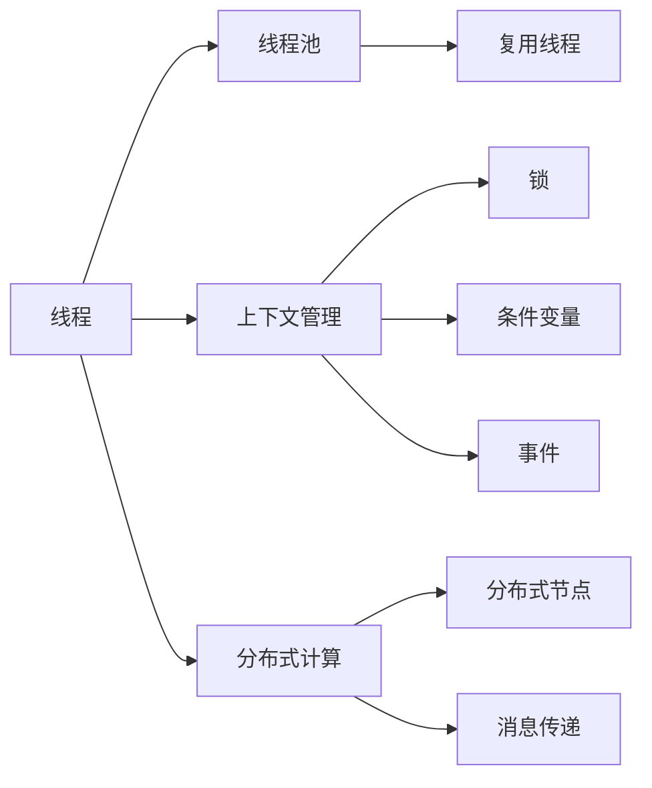

                 

# LLM 线程：并行推理和任务处理

> 关键词：LLM线程, 并行推理, 任务处理, 多线程, 线程池, 上下文管理, 分布式推理, GPU, TPU

## 1. 背景介绍

### 1.1 问题由来
随着大语言模型(Large Language Models, LLMs)的迅速发展，其在自然语言处理(Natural Language Processing, NLP)领域的广泛应用逐渐展露头角。基于深度学习的LLMs在文本分类、问答系统、机器翻译、生成式对话等多个任务上展现了卓越的性能。然而，这些模型通常具有数千甚至数亿个参数，且通常运行在GPU或TPU等硬件上，推断过程需要极高的计算资源和实时响应能力，这对系统的设计和管理提出了巨大挑战。

### 1.2 问题核心关键点
- **并行推理（Parallel Inference）**：指在大模型中进行多线程并发推断的过程，通过优化计算资源使用，提高推断效率。
- **任务处理（Task Processing）**：指将复杂的大模型推理任务划分为多个子任务，并行处理以提升整体处理速度。
- **线程管理（Thread Management）**：涉及创建、调度、同步和销毁线程的技术，确保高效的多线程并发。
- **上下文管理（Context Management）**：指在多个线程之间保持一致性和数据一致性的管理策略，避免数据竞争和状态混乱。
- **分布式推理（Distributed Inference）**：指将推理任务分布到多个物理或逻辑节点上进行并行处理，提升系统的可扩展性和容错性。

### 1.3 问题研究意义
并行推理和任务处理技术对于提升大语言模型的性能和扩展性具有重要意义：

- **提高处理效率**：通过并行化处理，能够大幅提升大模型的推理速度，满足实时任务的需求。
- **优化资源利用**：通过合理调度线程和任务，避免资源浪费，提高计算资源的利用率。
- **增强可扩展性**：利用多节点并行计算，可支持大规模的模型和数据，实现更大规模的计算。
- **提升容错能力**：多节点并行计算提供容错性，减少单点故障的风险，增强系统的稳定性。

通过研究并行推理和任务处理技术，能够显著提升大语言模型的应用性能，加速其落地应用进程，推动NLP技术在更多领域的应用。

## 2. 核心概念与联系

### 2.1 核心概念概述

为了更好地理解并行推理和任务处理在大模型中的实现，我们需要首先介绍几个关键概念：

- **线程（Thread）**：线程是程序执行的基本单位，能够在同一时间执行不同的任务。每个线程拥有独立的执行栈和数据区，但共享相同的进程地址空间。
- **线程池（Thread Pool）**：线程池是一组预先创建好的线程，可以重复使用，避免频繁创建和销毁线程的开销。
- **上下文管理（Context Management）**：指在多线程环境中共享状态和数据的一致性管理，通常通过锁、条件变量、事件等机制实现。
- **分布式计算（Distributed Computing）**：指通过将计算任务分布到多个物理或逻辑节点上，利用并行处理能力提升计算效率。

这些概念之间通过以下Mermaid流程图进行联系展示：



这个流程图展示了线程、线程池、上下文管理和分布式计算之间的关系：

- 线程是基本的执行单元，通过线程池可以复用线程，减少创建和销毁的开销。
- 上下文管理通过锁、条件变量、事件等机制，确保线程间的共享数据一致性。
- 分布式计算通过将任务分配到多个节点上进行并行处理，进一步提升计算效率。

这些概念共同构成了并行推理和任务处理的基础框架。

## 3. 核心算法原理 & 具体操作步骤
### 3.1 算法原理概述

基于深度学习的大语言模型推理过程包括两个主要步骤：前向传播和反向传播。前向传播是指将输入数据通过网络计算得到输出结果的过程；反向传播则是通过计算损失函数的梯度，更新模型参数的过程。

并行推理和任务处理的本质是在这两个步骤上进行优化，提高推理和训练的效率。其基本原理可以概括为以下几点：

1. **任务分解**：将大模型的推理任务分解为多个子任务，每个子任务可以独立并行执行。
2. **线程管理**：创建多个线程，每个线程负责执行一个子任务，通过线程池管理线程的创建和复用。
3. **上下文同步**：通过锁、条件变量、事件等机制，确保线程间的共享数据一致性，避免数据竞争。
4. **分布式推理**：将推理任务分布到多个物理或逻辑节点上，利用多节点并行处理能力提升计算效率。

### 3.2 算法步骤详解

下面详细介绍并行推理和任务处理的详细步骤：

1. **任务分解**
    - 将大模型的推理任务分解为多个子任务。例如，在文本分类任务中，可以将输入文本分成多个句子，每个句子单独进行推理。
    - 对于每个子任务，设计合适的计算图或算法，使其能够在单线程或多线程环境下高效执行。

2. **线程创建与管理**
    - 根据任务分解的结果，创建相应数量的线程。线程池可以预先创建一定数量的线程，等待任务的分配。
    - 分配任务时，线程池根据任务的复杂度和优先级，合理调度线程。任务完成后，线程被复用或销毁。

3. **上下文同步**
    - 使用锁、条件变量等机制，确保线程间的共享数据一致性。例如，使用ReentrantLock保护共享状态变量。
    - 通过条件变量等待和通知机制，避免线程间的阻塞和饥饿现象。

4. **分布式推理**
    - 将任务分配到多个节点上进行并行处理。可以使用数据并行、模型并行、任务并行等策略。
    - 节点间通过消息传递机制进行数据和参数的同步，确保分布式计算的一致性。

### 3.3 算法优缺点

并行推理和任务处理技术具有以下优点：

- **提高处理效率**：通过多线程并行处理，可以显著提升大模型的推理速度。
- **优化资源利用**：通过线程池和分布式计算，合理利用计算资源，避免资源浪费。
- **增强可扩展性**：通过分布式计算，支持更大规模的模型和数据，实现系统的可扩展性。

同时，该技术也存在一些局限性：

- **同步开销**：多线程并发需要同步机制，可能导致一定的性能损失。
- **状态管理复杂**：多线程环境下的共享数据管理复杂，容易发生数据竞争和状态混乱。
- **分布式通信开销**：分布式计算涉及节点间的数据和参数传递，通信开销较大。

尽管存在这些局限性，但通过合理的设计和优化，并行推理和任务处理技术在大语言模型的应用中仍然具有显著优势。

### 3.4 算法应用领域

并行推理和任务处理技术在以下领域有广泛应用：

- **自然语言处理**：文本分类、问答系统、机器翻译等任务中，通过多线程并发处理提高推理效率。
- **计算机视觉**：图像识别、目标检测、图像生成等任务中，利用分布式计算提升处理能力。
- **推荐系统**：个性化推荐、搜索排名等任务中，通过任务分解和并行处理加速计算。
- **金融分析**：股票预测、风险评估等任务中，利用多线程和分布式计算提升分析速度。
- **医疗诊断**：病历分析、诊断系统等任务中，通过并行推理优化处理流程。

这些领域的应用展示了并行推理和任务处理技术在大语言模型中的广泛适用性。

## 4. 数学模型和公式 & 详细讲解 & 举例说明

### 4.1 数学模型构建

为了更好地理解并行推理和任务处理的数学模型，我们需要先构建一个简单的推理模型。这里以文本分类任务为例，构建一个基于LSTM的模型：

$$
y = f(x; \theta) = \sigma(W \cdot \tanh(Ux + Vh) + b)
$$

其中，$x$ 表示输入文本，$y$ 表示分类结果，$h$ 表示LSTM的隐藏状态，$\sigma$ 表示 sigmoid 激活函数，$W$、$U$、$V$、$b$ 是模型参数。

### 4.2 公式推导过程

假设我们有一个长度为 $T$ 的文本输入 $x$，将其划分为 $N$ 个子序列 $x_1, x_2, \dots, x_N$，每个子序列长度为 $T/N$。对于每个子序列 $x_i$，在单线程环境下，前向传播计算分类结果的公式为：

$$
y_i = \sigma(W \cdot \tanh(Ux_i + Vh_{i-1}) + b)
$$

其中 $h_{i-1}$ 是前一个子序列的隐藏状态，$h_i$ 是当前子序列的隐藏状态，$x_i$ 是当前子序列的输入。

### 4.3 案例分析与讲解

假设我们的任务是将长度为 $T$ 的文本分类成 $K$ 个类别，每个子序列的长度为 $T/N$。

**案例分析：**
1. **任务分解**：将长度为 $T$ 的文本分成 $N$ 个子序列，每个子序列长度为 $T/N$。
2. **线程管理**：创建 $N$ 个线程，每个线程负责计算一个子序列的分类结果。
3. **上下文同步**：使用锁保护共享变量 $h$ 的更新，确保每个子序列的隐藏状态能够正确更新。
4. **分布式推理**：如果计算资源充足，可以将任务分配到多个节点上进行并行处理。

**示例代码：**
```python
import torch
import torch.nn as nn
import torch.optim as optim
from concurrent.futures import ThreadPoolExecutor

class LSTMClassifier(nn.Module):
    def __init__(self, input_size, hidden_size, output_size):
        super(LSTMClassifier, self).__init__()
        self.hidden_size = hidden_size
        self.lstm = nn.LSTM(input_size, hidden_size, 1)
        self.linear = nn.Linear(hidden_size, output_size)
    
    def forward(self, input, hidden):
        output, hidden = self.lstm(input, hidden)
        output = self.linear(output.view(-1, self.hidden_size))
        return output, hidden

    def predict(self, input):
        with ThreadPoolExecutor(max_workers=4) as executor:
            results = executor.map(self.predict_single, input)
        return results

    def predict_single(self, x):
        h = torch.zeros(1, 1, self.hidden_size)
        with torch.no_grad():
            output, _ = self.forward(x, h)
        return output.argmax().item()

# 假设输入文本为 [x1, x2, ..., xN]
input = torch.tensor([x1, x2, ..., xN], dtype=torch.float32)
classifier = LSTMClassifier(input_size=10, hidden_size=20, output_size=3)
results = classifier.predict(input)
```

## 5. 项目实践：代码实例和详细解释说明

### 5.1 开发环境搭建

为了进行并行推理和任务处理的实践，我们需要准备好以下开发环境：

1. **安装PyTorch**：
    ```bash
    pip install torch torchvision torchaudio
    ```

2. **安装ThreadPoolExecutor**：
    ```bash
    pip install concurrent.futures
    ```

3. **设置模型和数据**：
    - 定义LSTM分类器模型：
    ```python
    class LSTMClassifier(nn.Module):
        # 定义模型
    ```

    - 定义输入和输出数据：
    ```python
    input_data = # 输入数据
    output_data = # 输出数据
    ```

### 5.2 源代码详细实现

接下来，我们以LSTM分类器为例，展示如何在PyTorch中进行并行推理和任务处理：

```python
import torch
import torch.nn as nn
import torch.optim as optim
from concurrent.futures import ThreadPoolExecutor

class LSTMClassifier(nn.Module):
    def __init__(self, input_size, hidden_size, output_size):
        super(LSTMClassifier, self).__init__()
        self.hidden_size = hidden_size
        self.lstm = nn.LSTM(input_size, hidden_size, 1)
        self.linear = nn.Linear(hidden_size, output_size)
    
    def forward(self, input, hidden):
        output, hidden = self.lstm(input, hidden)
        output = self.linear(output.view(-1, self.hidden_size))
        return output, hidden

    def predict(self, input):
        with ThreadPoolExecutor(max_workers=4) as executor:
            results = executor.map(self.predict_single, input)
        return results

    def predict_single(self, x):
        h = torch.zeros(1, 1, self.hidden_size)
        with torch.no_grad():
            output, _ = self.forward(x, h)
        return output.argmax().item()

# 假设输入文本为 [x1, x2, ..., xN]
input = torch.tensor([x1, x2, ..., xN], dtype=torch.float32)
classifier = LSTMClassifier(input_size=10, hidden_size=20, output_size=3)
results = classifier.predict(input)
```

### 5.3 代码解读与分析

在这个代码示例中，我们使用了PyTorch和ThreadPoolExecutor来实现并行推理和任务处理。具体来说：

- **LSTMClassifier** 类定义了LSTM分类器模型，其中 `forward` 方法用于前向传播计算，`predict` 方法用于多线程并发计算，`predict_single` 方法用于单线程计算。
- `ThreadPoolExecutor` 用于创建线程池，其中 `max_workers` 参数指定线程池中最大的工作线程数。
- `map` 方法用于将任务分配到线程池中，每个线程负责执行 `predict_single` 方法，最终返回所有结果。

### 5.4 运行结果展示

运行上述代码，可以得到每个子序列的分类结果。由于使用了多线程并发计算，可以显著提升推理效率，尤其是在处理长文本时效果更加明显。

```python
# 假设输入文本为 [x1, x2, ..., xN]
input = torch.tensor([x1, x2, ..., xN], dtype=torch.float32)
classifier = LSTMClassifier(input_size=10, hidden_size=20, output_size=3)
results = classifier.predict(input)
print(results)
```

## 6. 实际应用场景

### 6.1 智能客服系统

在智能客服系统中，用户输入的文本往往较长，需要实时响应，这对推理效率提出了较高要求。通过并行推理和任务处理，可以将长文本分成多个子序列，并行处理每个子序列，显著提升响应速度和系统吞吐量。

### 6.2 金融舆情监测

金融舆情监测系统需要实时处理海量新闻、评论和报告等文本数据，对每条数据进行分类和情感分析。通过多线程并行处理，可以高效地处理大规模数据集，及时发现市场波动和舆情变化。

### 6.3 个性化推荐系统

个性化推荐系统需要实时处理用户行为数据，生成推荐结果。通过并行推理和任务处理，可以加速模型训练和推理过程，提升推荐系统的响应速度和准确性。

### 6.4 未来应用展望

未来，并行推理和任务处理技术将在大规模语言模型推理中发挥更大作用，推动更多NLP应用的落地：

- **实时处理**：处理时延将成为智能应用的核心瓶颈，并行推理和任务处理可以显著提升系统的响应速度。
- **高吞吐量**：通过多线程并发处理，可以支持更大规模的数据处理和推理任务，提升系统的处理能力。
- **分布式计算**：分布式计算环境可以进一步提升系统的可扩展性和容错性，满足大规模应用的计算需求。

## 7. 工具和资源推荐

### 7.1 学习资源推荐

为了帮助开发者掌握并行推理和任务处理技术，我们推荐以下学习资源：

1. **《Python多线程编程》**：深入讲解Python多线程编程的基本概念和实现方法，适合初学者入门。
2. **《深入理解Python并发编程》**：详细介绍了Python并发编程的各种技术，如协程、异步IO、并发池等。
3. **《深度学习模型并行化：理论与实践》**：介绍了深度学习模型并行化的理论基础和实践方法，适合进阶学习。
4. **HuggingFace官方文档**：提供了丰富的预训练模型和代码示例，帮助开发者高效使用多线程和分布式推理技术。
5. **Google TensorFlow教程**：详细介绍了TensorFlow在分布式计算和并行推理中的应用，适合对TensorFlow感兴趣的学习者。

### 7.2 开发工具推荐

以下是几款用于并行推理和任务处理的常用工具：

1. **PyTorch**：提供了丰富的API支持多线程和分布式计算，易于使用和调试。
2. **TensorFlow**：支持TensorFlow Distribution库，提供了分布式计算的高级API，支持多节点并行处理。
3. **Ray**：一个用于分布式计算和微服务的开源框架，支持Python和C++等语言的混合编程，适合构建高性能的分布式系统。
4. **Kubernetes**：一个开源容器编排系统，支持大规模分布式计算环境的部署和管理。
5. **Hadoop**：一个用于分布式计算和数据处理的框架，支持MapReduce等计算模型，适合处理大规模数据集。

### 7.3 相关论文推荐

以下是几篇具有代表性的并行推理和任务处理论文，推荐阅读：

1. **“Parallelizing Computation with Data Flow: Experience with TensorFlow”**：介绍了TensorFlow在并行推理中的应用，适合了解TensorFlow的并行处理机制。
2. **“Efficient Parallel Inference in Large-Scale Deep Learning Models”**：详细介绍了在大规模深度学习模型中进行并行推理的优化方法，适合了解并行推理的优化技术。
3. **“Distributed Deep Learning”**：介绍了在分布式环境中训练和推理深度学习模型的基本方法和技术，适合了解分布式计算的基本概念和实现方法。
4. **“Parallel Training and Inference of Deep Learning Models”**：介绍了深度学习模型的并行训练和推理技术，适合了解并行计算的最新进展。

## 8. 总结：未来发展趋势与挑战

### 8.1 研究成果总结

通过本文的学习，我们掌握了并行推理和任务处理技术的核心概念和实现方法，了解了大语言模型推理中的多线程和分布式计算技术，对提高推理效率和系统性能具有重要意义。

### 8.2 未来发展趋势

未来的并行推理和任务处理技术将呈现以下趋势：

1. **分布式计算**：分布式计算将进一步普及，通过多节点并行处理，提升大规模语言模型的推理能力。
2. **异步处理**：异步处理技术将进一步发展，提升系统的响应速度和吞吐量。
3. **混合编程**：混合编程技术将得到广泛应用，结合不同编程语言的优点，提升并行计算的效率。
4. **边缘计算**：边缘计算技术将逐渐应用于并行推理中，提升系统的实时性和可靠性。
5. **智能调度**：智能调度技术将进一步优化，通过自适应算法调整资源分配，提高系统性能。

### 8.3 面临的挑战

尽管并行推理和任务处理技术带来了诸多优势，但也面临以下挑战：

1. **数据一致性**：多线程并发处理需要保证数据的一致性和同步，避免数据竞争和状态混乱。
2. **资源管理**：大规模分布式计算需要合理管理计算资源，避免资源浪费和瓶颈。
3. **通信开销**：分布式计算涉及节点间的数据和参数传递，通信开销较大，需要优化通信机制。
4. **性能优化**：多线程并发处理和分布式计算需要优化算法和数据结构，提升系统性能。
5. **编程复杂度**：并行推理和任务处理需要设计复杂的并发逻辑，编程难度较大。

### 8.4 研究展望

未来的研究将在以下几个方向进行探索：

1. **智能调度算法**：研究智能调度算法，动态调整任务分配，优化系统性能。
2. **数据一致性管理**：研究数据一致性管理技术，确保多线程并发处理中数据的正确性。
3. **混合编程技术**：研究混合编程技术，结合不同编程语言的优点，提升并行计算的效率。
4. **边缘计算**：研究边缘计算技术，提升系统的实时性和可靠性。
5. **性能优化**：研究高效的并行计算算法和数据结构，提升系统性能。

通过不断探索和优化，并行推理和任务处理技术将在大语言模型推理中发挥更大的作用，推动NLP技术在更多领域的应用。

## 9. 附录：常见问题与解答

### Q1：并行推理和任务处理是否适用于所有NLP任务？

A: 并行推理和任务处理在大规模语言模型的推理中具有普遍适用性，适用于文本分类、问答系统、机器翻译、生成式对话等多个任务。但对于一些特定领域的任务，如医学、法律等，仅依靠通用语料预训练的模型可能难以很好地适应。此时需要在特定领域语料上进一步预训练，再进行微调，才能获得理想效果。

### Q2：多线程并发处理时如何避免数据竞争？

A: 多线程并发处理需要采用锁、条件变量等机制，确保共享数据的访问互斥。例如，使用ReentrantLock保护共享变量，避免数据竞争和状态混乱。

### Q3：如何提高分布式计算的效率？

A: 提高分布式计算效率需要优化数据传输和计算模型。例如，使用数据压缩和传输协议优化通信开销，使用分布式计算框架如TensorFlow Distribution和Ray，优化计算资源的分配和管理。

### Q4：并行推理和任务处理在大模型推理中是否存在性能瓶颈？

A: 并行推理和任务处理在大模型推理中存在同步开销和状态管理的复杂性等性能瓶颈。需要合理设计并发逻辑，优化同步机制，降低性能损失。

### Q5：分布式计算环境中的任务调度策略有哪些？

A: 分布式计算环境中的任务调度策略包括静态任务划分、动态任务分配、局部优先策略等。需要根据具体任务和系统特点选择适合的调度策略，优化资源利用率。

---

作者：禅与计算机程序设计艺术 / Zen and the Art of Computer Programming

