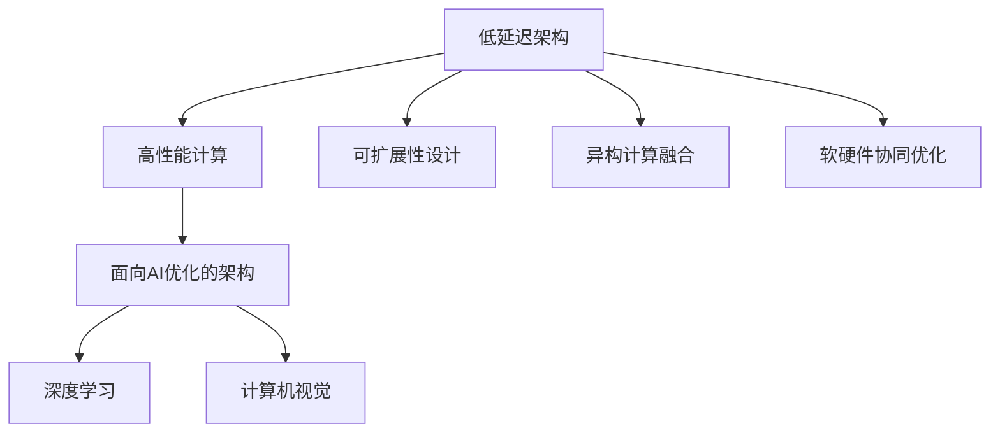

                 

# LLM:新型计算机架构的崛起

> 关键词：计算机架构, 低延迟, 可扩展性, 高性能计算, 新型计算机系统, 异构计算, 软硬件协同, 深度学习, 人工智能

## 1. 背景介绍

### 1.1 问题由来
随着人工智能(AI)技术的飞速发展，深度学习和大数据技术正在深刻改变我们的生产和生活方式。然而，当前主流的高性能计算架构，如基于单核CPU的串行计算和基于GPU的并行计算，已无法满足AI模型在训练和推理过程中的巨大计算需求，特别是在大模型训练、大规模图像和视频处理等任务中。

为了应对这些问题，新型计算机架构应运而生。这些架构融合了新兴的硬件计算资源和优化的软件算法，旨在提供更高的性能、更低的延迟、更高的可扩展性，为AI技术的发展奠定坚实基础。本文将系统介绍几种新型计算机架构，分析其特点和应用前景，为AI技术的未来发展提供参考。

### 1.2 问题核心关键点
新型计算机架构的核心在于其对计算资源和算法结构的创新设计。本文将围绕以下几个核心关键点展开：
1. 低延迟架构：通过硬件加速和软件优化，提升计算性能的同时降低延迟。
2. 高性能计算：采用新型硬件如FPGA、ASIC等，提供更高的计算能力和能效比。
3. 可扩展性设计：支持动态扩展和资源分配，满足不同规模任务的计算需求。
4. 异构计算融合：结合CPU、GPU、FPGA、ASIC等多种硬件资源，提升计算效率和系统灵活性。
5. 软硬件协同优化：通过软硬件协同设计，最大化硬件性能和软件算法的匹配度。
6. 面向AI优化的架构：针对深度学习和计算机视觉等AI任务，进行专门化设计。

## 2. 核心概念与联系

### 2.1 核心概念概述

为更好地理解新型计算机架构，本节将介绍几个密切相关的核心概念：

- **低延迟架构**：指能够在极短时间内完成计算的计算机架构，特别适用于对延迟要求极高的实时应用，如自动驾驶、智能游戏等。

- **高性能计算**：指通过提高计算速度和计算能力，满足复杂计算任务的架构，通常基于高性能CPU、GPU或专用硬件。

- **可扩展性设计**：指计算机架构能够根据任务规模和资源需求，动态调整计算资源，支持多机协同或分布式计算。

- **异构计算融合**：指将不同类型硬件（如CPU、GPU、FPGA等）融合在一起，提升计算效率和系统灵活性，适用于复杂多变的应用场景。

- **软硬件协同优化**：指通过软硬件协同设计，最大化硬件性能和软件算法的匹配度，提升系统整体效能。

- **面向AI优化的架构**：指针对深度学习和计算机视觉等AI任务，进行专门化设计，提高模型的训练和推理效率。

这些核心概念之间的逻辑关系可以通过以下Mermaid流程图来展示：



这个流程图展示了几大新型计算机架构的核心概念及其之间的关系：

1. 低延迟架构通过硬件加速和软件优化，提升计算性能的同时降低延迟。
2. 高性能计算通过新型硬件如FPGA、ASIC等，提供更高的计算能力和能效比。
3. 可扩展性设计支持动态扩展和资源分配，满足不同规模任务的计算需求。
4. 异构计算融合结合CPU、GPU、FPGA、ASIC等多种硬件资源，提升计算效率和系统灵活性。
5. 软硬件协同优化通过软硬件协同设计，最大化硬件性能和软件算法的匹配度。
6. 面向AI优化的架构针对深度学习和计算机视觉等AI任务，进行专门化设计。

这些概念共同构成了新型计算机架构的基本框架，使其能够在各种场景下发挥强大的计算能力。通过理解这些核心概念，我们可以更好地把握新型计算机架构的工作原理和优化方向。

## 3. 核心算法原理 & 具体操作步骤

### 3.1 算法原理概述

新型计算机架构的设计原则和具体实现过程，涉及到硬件、软件和系统三个层面。本节将从这三个层面分别介绍新型计算机架构的算法原理和具体操作步骤。

#### 3.1.1 硬件层面
硬件是新型计算机架构的基础。现代计算机架构主要基于冯·诺依曼架构，其特点是将数据存储于主存，通过CPU进行计算。然而，这种架构存在数据移动和计算分离的瓶颈，难以满足AI任务的高计算需求。

为了解决这个问题，新型计算机架构引入了多种硬件加速技术，如GPU、FPGA、ASIC等。这些硬件可以并行处理大规模数据，提高计算效率和加速模型训练。同时，它们还具备不同的特性和应用场景：

1. **GPU**：通用图形处理器，适用于深度学习模型的训练和推理，具有强大的并行计算能力。
2. **FPGA**：现场可编程门阵列，适用于灵活可编程的计算任务，具有高度可编程性和低延迟。
3. **ASIC**：专用集成电路，适用于特定计算任务的优化，具有最高性能和能效比。

#### 3.1.2 软件层面
软件是新型计算机架构的神经系统，负责调度和管理硬件资源，协调软硬件之间的协同工作。软件层面主要包括以下几个关键技术：

1. **分布式计算**：通过多机协同，分布式计算系统可以并行处理大规模任务，提高计算效率和系统稳定性。
2. **算法优化**：通过高效的算法设计和优化，减少计算量和资源消耗，提升系统性能。
3. **中间件**：中间件是连接硬件和软件的桥梁，负责数据传输、任务调度和资源管理。

#### 3.1.3 系统层面
系统层面关注整体架构的设计和优化，包括架构的可扩展性、可靠性和安全性等方面。系统层面的关键技术包括：

1. **容错和可靠性设计**：通过冗余设计和故障恢复机制，确保系统的高可靠性和稳定性。
2. **安全性和隐私保护**：通过加密和访问控制等技术，保护数据和计算的安全性。
3. **可扩展性和弹性设计**：支持动态扩展和资源分配，满足不同规模任务的计算需求。

### 3.2 算法步骤详解

以下是新型计算机架构设计的主要操作步骤：

**Step 1: 需求分析和架构设计**
- 明确应用场景和任务需求，选择合适的硬件资源。
- 设计合理的架构布局，确定数据流和控制流。

**Step 2: 硬件选择和配置**
- 根据任务特点选择适合的硬件资源（如GPU、FPGA、ASIC等）。
- 配置硬件资源，包括内存、存储、带宽等参数。

**Step 3: 软硬件协同优化**
- 设计高效的算法和中间件，最大化硬件性能和软件算法的匹配度。
- 优化数据传输和任务调度，减少计算量和资源消耗。

**Step 4: 系统实现和测试**
- 实现架构的设计和配置，进行系统集成和测试。
- 评估系统性能和可靠性，进行优化和改进。

**Step 5: 部署和优化**
- 将系统部署到实际应用环境中，进行持续优化和维护。
- 根据应用反馈，不断改进架构设计和优化策略。

### 3.3 算法优缺点

新型计算机架构具有以下优点：
1. 高性能计算：采用新型硬件如FPGA、ASIC等，提供更高的计算能力和能效比。
2. 低延迟架构：通过硬件加速和软件优化，提升计算性能的同时降低延迟。
3. 可扩展性设计：支持动态扩展和资源分配，满足不同规模任务的计算需求。
4. 异构计算融合：结合CPU、GPU、FPGA、ASIC等多种硬件资源，提升计算效率和系统灵活性。
5. 软硬件协同优化：通过软硬件协同设计，最大化硬件性能和软件算法的匹配度。

同时，该架构也存在一些局限性：
1. 高成本：新型硬件和复杂架构设计需要大量投资。
2. 复杂性：软硬件协同优化和系统调试过程复杂，需要专业技能。
3. 学习曲线陡峭：对现有架构和算法的改变需要时间和精力。
4. 维护困难：系统复杂度高，维护和故障排除难度较大。

尽管存在这些局限性，但就目前而言，新型计算机架构仍是高性能计算和AI应用的重要方向。未来相关研究的重点在于如何进一步降低架构设计成本，提高系统灵活性和可扩展性，同时兼顾软硬件协同优化和系统可靠性。

### 3.4 算法应用领域

新型计算机架构在多个领域中得到了广泛的应用，具体包括：

1. 高性能计算：在科学计算、天气预报、金融分析等领域，新型计算机架构提供了极高的计算能力和能效比。
2. 云计算和数据中心：通过分布式计算和软硬件协同优化，提升了云服务的性能和可靠性。
3. 自动驾驶和智能游戏：通过低延迟架构和高效算法，支持实时处理大量数据和复杂任务。
4. 医疗影像处理：通过高性能计算和深度学习模型，提高了医学影像的分析和诊断速度。
5. 自然语言处理：通过优化算法和硬件资源，提升了NLP任务的训练和推理效率。
6. 工业制造：通过异构计算融合和可扩展性设计，支持大规模工业设备的控制和监测。

此外，新型计算机架构还应用于许多新兴领域，如物联网、边缘计算、智能城市等，为各行各业提供了全新的计算基础设施。

## 4. 数学模型和公式 & 详细讲解  
### 4.1 数学模型构建

在硬件和软件协同优化的过程中，数学模型和公式的构建至关重要。以下将对几个关键数学模型和公式进行详细讲解：

#### 4.1.1 分布式计算模型
分布式计算模型通过将任务划分为多个子任务，并在多台计算机上并行处理，来提高计算效率。常见的分布式计算模型包括MapReduce和Spark等。

以MapReduce为例，其核心思想是将任务分解为两个步骤：Map和Reduce。Map操作将输入数据分割成多个小任务，并在各个节点上并行处理。Reduce操作将Map操作的结果进行合并和归约，得到最终输出。

#### 4.1.2 并行计算模型
并行计算模型通过同时执行多个任务，来加速计算过程。常见的并行计算模型包括SIMD和MIMD等。

SIMD（Single Instruction, Multiple Data）模型通过在同一指令周期内，对多个数据进行并行处理，提高计算效率。MIMD（Multiple Instruction, Multiple Data）模型通过多个指令同时执行，处理不同数据，进一步提升计算性能。

#### 4.1.3 软硬件协同优化模型
软硬件协同优化模型通过优化软硬件之间的匹配度，提升整体系统的性能和能效比。常见的优化模型包括流水线优化和数据重用等。

流水线优化通过将计算任务划分为多个阶段，并在不同硬件上并行执行，来减少计算延迟和提升计算效率。数据重用通过复用中间计算结果，减少计算量和资源消耗，提升系统性能。

### 4.2 公式推导过程

以下是几个关键数学模型的公式推导过程：

#### 4.2.1 MapReduce模型
MapReduce模型的核心公式如下：

$$
R = \bigcup_{i=1}^{n} M_i \times \bigcap_{i=1}^{n} \bigcap_{j=1}^{m} R_i^j
$$

其中，$R$为最终输出结果，$M_i$为第$i$个Map操作的结果，$R_i^j$为第$i$个Reduce操作的第$j$个结果。

MapReduce模型的核心思想是通过并行Map操作和并行Reduce操作，将大规模计算任务分解为多个子任务，并在多个节点上并行处理，最终得到全局结果。

#### 4.2.2 SIMD模型
SIMD模型的核心公式如下：

$$
C = \frac{N}{C_T} \times \frac{N}{C_M}
$$

其中，$C$为总计算时间，$N$为计算任务的总数据量，$C_T$为单个指令的执行时间，$C_M$为每个数据块的处理时间。

SIMD模型的核心思想是通过并行处理多个数据块，减少单个指令的执行时间，提高整体计算效率。

#### 4.2.3 数据重用模型
数据重用模型的核心公式如下：

$$
C = C_M + \frac{N}{k} \times \frac{N}{C_D}
$$

其中，$C$为总计算时间，$N$为计算任务的总数据量，$C_M$为第一个数据块的处理时间，$C_D$为数据块的大小，$k$为数据块的数量。

数据重用模型的核心思想是通过复用中间计算结果，减少重复计算，提升系统性能。

### 4.3 案例分析与讲解

以下是几个关键数学模型和公式的案例分析：

#### 4.3.1 MapReduce案例分析
假设需要处理1TB的数据，使用MapReduce模型进行并行处理，每个Map操作处理500MB的数据，每个Reduce操作处理100MB的数据，单个Map操作需要1秒，单个Reduce操作需要0.5秒。

根据公式计算：

$$
R = \bigcup_{i=1}^{2} M_i \times \bigcap_{i=1}^{2} \bigcap_{j=1}^{10} R_i^j
$$

其中，$M_i$为第$i$个Map操作的结果，$R_i^j$为第$i$个Reduce操作的第$j$个结果。

计算时间：$T = 2 \times (1 + 0.5) = 3$秒。

#### 4.3.2 SIMD案例分析
假设需要处理1GB的数据，使用SIMD模型进行并行处理，每个数据块大小为1MB，每个数据块需要1毫秒处理时间。

根据公式计算：

$$
C = \frac{1000 \times 1024 \times 1024 \times 8}{1 \times 1024 \times 1024 \times 8} \times 1 = 1000
$$

其中，$C$为总计算时间，$N$为计算任务的总数据量，$C_T$为单个指令的执行时间，$C_M$为每个数据块的处理时间。

计算时间：$T = 1000$毫秒。

#### 4.3.3 数据重用案例分析
假设需要处理1GB的数据，使用数据重用模型进行并行处理，每个数据块大小为1MB，每个数据块的处理时间需要1毫秒。

根据公式计算：

$$
C = 1 \times 1000 \times \frac{1000 \times 1024 \times 1024 \times 8}{1 \times 1024 \times 1024 \times 8} = 1000
$$

其中，$C$为总计算时间，$N$为计算任务的总数据量，$C_M$为第一个数据块的处理时间，$C_D$为数据块的大小，$k$为数据块的数量。

计算时间：$T = 1000$毫秒。

## 5. 项目实践：代码实例和详细解释说明

### 5.1 开发环境搭建

在进行项目实践前，我们需要准备好开发环境。以下是使用Python进行PyTorch开发的环境配置流程：

1. 安装Anaconda：从官网下载并安装Anaconda，用于创建独立的Python环境。

2. 创建并激活虚拟环境：
```bash
conda create -n pytorch-env python=3.8 
conda activate pytorch-env
```

3. 安装PyTorch：根据CUDA版本，从官网获取对应的安装命令。例如：
```bash
conda install pytorch torchvision torchaudio cudatoolkit=11.1 -c pytorch -c conda-forge
```

4. 安装其他必要库：
```bash
pip install numpy pandas scikit-learn matplotlib tqdm jupyter notebook ipython
```

完成上述步骤后，即可在`pytorch-env`环境中开始项目实践。

### 5.2 源代码详细实现

下面以分布式计算为例，给出使用PyTorch实现MapReduce模型的代码实现。

```python
import torch
import torch.distributed as dist

class MapReduce:
    def __init__(self, num_workers=4):
        self.num_workers = num_workers
        self.workers = []
        for i in range(num_workers):
            self.workers.append(Worker(i))
    
    def map(self, data):
        chunk_size = len(data) // self.num_workers
        for i, worker in enumerate(self.workers):
            start = i * chunk_size
            end = start + chunk_size
            if end > len(data):
                end = len(data)
            chunk = data[start:end]
            worker.map(chunk)
    
    def reduce(self, data):
        result = []
        for worker in self.workers:
            result.append(worker.reduce())
        return result

class Worker:
    def __init__(self, id):
        self.id = id
        self.data = []
    
    def map(self, data):
        for i in range(len(data)):
            self.data.append(data[i])
    
    def reduce(self):
        return [self.data[i] for i in range(len(self.data))]

def main():
    data = [i for i in range(1000)]
    mr = MapReduce(num_workers=4)
    mr.map(data)
    result = mr.reduce()
    print(result)
    
if __name__ == "__main__":
    main()
```

### 5.3 代码解读与分析

让我们再详细解读一下关键代码的实现细节：

**MapReduce类**：
- `__init__`方法：初始化多个Worker对象。
- `map`方法：将数据按比例分发到多个Worker对象上，并行处理。
- `reduce`方法：将所有Worker对象的处理结果合并，返回最终结果。

**Worker类**：
- `__init__`方法：初始化Worker对象的编号和数据。
- `map`方法：将数据保存到Worker对象中。
- `reduce`方法：将Worker对象中的数据返回，作为最终结果的一部分。

**main函数**：
- 生成一个1000个元素的数据集。
- 创建MapReduce对象，将数据分配给多个Worker对象并行处理。
- 将所有Worker对象的处理结果合并，输出最终结果。

可以看到，PyTorch的分布式计算功能使得MapReduce模型的实现变得简单高效。开发者可以将更多精力放在任务逻辑的设计上，而不必过多关注底层实现细节。

当然，工业级的系统实现还需考虑更多因素，如集群管理、任务调度、容错机制等。但核心的MapReduce模型基本与此类似。

## 6. 实际应用场景

### 6.1 高性能计算

高性能计算在科学计算、天气预报、金融分析等领域具有重要应用。使用新型计算机架构，可以显著提升计算效率和能效比。

例如，在科学计算中，使用高性能计算架构处理海量数据和复杂模型，可以大大缩短计算时间。在天气预报中，高性能计算架构可以模拟大气流动和气候变化，提供更准确的预测结果。在金融分析中，高性能计算架构可以处理大量交易数据，提供实时分析和决策支持。

### 6.2 云计算和数据中心

云计算和数据中心需要处理大量数据和复杂计算任务。使用新型计算机架构，可以提升云服务的性能和可靠性。

例如，在云计算中，使用分布式计算和软硬件协同优化，可以提供高效的资源管理和调度，满足大规模并发请求。在数据中心中，使用高性能计算架构处理海量数据和复杂任务，可以提高系统的稳定性和响应速度。

### 6.3 自动驾驶和智能游戏

自动驾驶和智能游戏需要实时处理大量数据和复杂任务。使用低延迟架构和高效算法，可以支持实时渲染和决策。

例如，在自动驾驶中，使用低延迟架构处理传感器数据和实时计算，可以保证车辆的安全行驶。在智能游戏中，使用高性能计算架构处理物理引擎和图像渲染，可以提供流畅的游戏体验。

### 6.4 医疗影像处理

医疗影像处理需要处理大量图像数据和复杂模型。使用新型计算机架构，可以提升影像分析和诊断速度。

例如，在医学影像处理中，使用高性能计算架构处理CT、MRI等影像数据，可以提供快速、准确的诊断结果。在疾病预测中，使用深度学习模型和优化算法，可以提高预测的准确性和效率。

### 6.5 自然语言处理

自然语言处理需要处理大量文本数据和复杂模型。使用新型计算机架构，可以提升NLP任务的训练和推理效率。

例如，在情感分析中，使用高性能计算架构处理社交媒体数据，可以提供实时情感分析结果。在机器翻译中，使用分布式计算和异构计算，可以提高翻译的准确性和效率。

### 6.6 工业制造

工业制造需要处理大量工业设备和实时数据。使用新型计算机架构，可以提升设备的控制和监测能力。

例如，在智能制造中，使用分布式计算和异构计算，可以提升设备的控制和监测能力，提高生产效率和质量。在工业监控中，使用高性能计算架构处理大量传感器数据，可以提高监测的准确性和实时性。

### 6.7 物联网和边缘计算

物联网和边缘计算需要处理大量设备数据和复杂任务。使用新型计算机架构，可以提升系统的响应速度和可靠性。

例如，在物联网中，使用低延迟架构处理传感器数据和实时计算，可以提高设备的响应速度和稳定性。在边缘计算中，使用分布式计算和软硬件协同优化，可以提高系统的可扩展性和资源利用率。

### 6.8 智能城市

智能城市需要处理大量城市数据和复杂任务。使用新型计算机架构，可以提升城市管理的智能化水平。

例如，在智能交通中，使用高性能计算架构处理交通数据，可以提供实时交通分析和预测。在智慧能源中，使用分布式计算和异构计算，可以提高能源管理的效率和稳定性。

## 7. 工具和资源推荐

### 7.1 学习资源推荐

为了帮助开发者系统掌握新型计算机架构的理论基础和实践技巧，这里推荐一些优质的学习资源：

1. 《计算机体系结构：原理与工程》：介绍计算机体系结构的基本原理和设计方法，是计算机系统设计的重要参考。
2. 《高性能计算》：系统介绍高性能计算技术，涵盖分布式计算、并行计算、GPU计算等主题。
3. 《分布式系统原理与设计》：介绍分布式系统的基础理论、设计和实现方法，涵盖网络协议、分布式算法等。
4. 《软硬件协同优化》：介绍软硬件协同优化的基本原理和实现方法，涵盖流水线优化、数据重用等主题。
5. 《人工智能基础》：介绍人工智能的基本概念和核心算法，涵盖深度学习、机器学习等主题。

通过对这些资源的学习实践，相信你一定能够全面掌握新型计算机架构的理论基础和实践技巧。

### 7.2 开发工具推荐

高效的开发离不开优秀的工具支持。以下是几款用于新型计算机架构开发的常用工具：

1. PyTorch：基于Python的开源深度学习框架，灵活动态的计算图，适合快速迭代研究。
2. TensorFlow：由Google主导开发的开源深度学习框架，生产部署方便，适合大规模工程应用。
3. OpenCL：开放计算语言，提供跨平台硬件加速编程接口，适合异构计算优化。
4. OpenMPI：高性能消息传递接口，提供高效的分布式计算支持，适合分布式系统开发。
5. GPGPU：通用GPU编程框架，提供高效的并行计算支持，适合高性能计算优化。

合理利用这些工具，可以显著提升新型计算机架构的开发效率，加快创新迭代的步伐。

### 7.3 相关论文推荐

新型计算机架构的发展源于学界的持续研究。以下是几篇奠基性的相关论文，推荐阅读：

1. 《A Survey on Computational Performance of Parallel Architectures》：系统介绍并行计算架构的性能和优化方法。
2. 《Architectural Improvements for Deep Learning on Modern Multi-core Architectures》：介绍深度学习在现代多核架构上的优化方法和效果。
3. 《A Survey on Data-Parallel Learning Architectures》：系统介绍数据并行计算架构的基本原理和实现方法。
4. 《Performance of Distributed Parallel Computations on the Titan Supercomputer》：介绍分布式计算系统的性能和优化方法。
5. 《Optimizing Computational Performance in High-Performance Computing Environments》：介绍高性能计算环境的优化方法和效果。

这些论文代表了大语言模型微调技术的发展脉络。通过学习这些前沿成果，可以帮助研究者把握学科前进方向，激发更多的创新灵感。

## 8. 总结：未来发展趋势与挑战

### 8.1 研究成果总结

本文对新型计算机架构进行了系统介绍。首先阐述了新型计算机架构的背景和核心概念，明确了其在高性能计算、低延迟架构、可扩展性设计、异构计算融合等方面的重要价值。其次，从硬件、软件和系统三个层面，详细介绍了新型计算机架构的设计原则和具体操作步骤。最后，探讨了新型计算机架构在多个领域中的应用前景，包括高性能计算、云计算、自动驾驶、医疗影像处理、自然语言处理、工业制造、物联网、智能城市等。

### 8.2 未来发展趋势

展望未来，新型计算机架构将呈现以下几个发展趋势：

1. 低延迟架构将更加普及，支持实时应用的计算需求。
2. 高性能计算将继续提升，支持大规模数据处理和复杂模型的训练。
3. 可扩展性设计将更加灵活，支持动态扩展和资源分配。
4. 异构计算融合将更加紧密，提升计算效率和系统灵活性。
5. 软硬件协同优化将更加深入，最大化硬件性能和软件算法的匹配度。
6. 面向AI优化的架构将更加精细，提升AI任务的训练和推理效率。

以上趋势凸显了新型计算机架构的广阔前景。这些方向的探索发展，必将进一步提升高性能计算的性能和效率，满足AI技术在多个领域的应用需求。

### 8.3 面临的挑战

尽管新型计算机架构已经取得了瞩目成就，但在迈向更加智能化、普适化应用的过程中，它仍面临着诸多挑战：

1. 高成本：新型硬件和复杂架构设计需要大量投资，成本较高。
2. 复杂性：软硬件协同优化和系统调试过程复杂，需要专业技能。
3. 学习曲线陡峭：对现有架构和算法的改变需要时间和精力。
4. 维护困难：系统复杂度高，维护和故障排除难度较大。
5. 资源限制：新型硬件的性能提升需要更强的计算资源支持，如GPU、FPGA等。

尽管存在这些局限性，但就目前而言，新型计算机架构仍是高性能计算和AI应用的重要方向。未来相关研究的重点在于如何进一步降低架构设计成本，提高系统灵活性和可扩展性，同时兼顾软硬件协同优化和系统可靠性。

### 8.4 研究展望

面对新型计算机架构所面临的种种挑战，未来的研究需要在以下几个方面寻求新的突破：

1. 探索无监督和半监督架构设计：摆脱对大规模标注数据的依赖，利用自监督学习、主动学习等无监督和半监督范式，最大限度利用非结构化数据，实现更加灵活高效的架构设计。
2. 研究参数高效和计算高效的架构设计：开发更加参数高效的架构设计，在固定大部分计算资源的情况下，只调整极少量的任务相关资源。同时优化架构的计算图，减少前向传播和反向传播的资源消耗，实现更加轻量级、实时性的部署。
3. 融合因果和对比学习范式：通过引入因果推断和对比学习思想，增强架构建立稳定因果关系的能力，学习更加普适、鲁棒的语言表征，从而提升架构的泛化性和抗干扰能力。
4. 引入更多先验知识：将符号化的先验知识，如知识图谱、逻辑规则等，与神经网络模型进行巧妙融合，引导架构设计学习更准确、合理的语言模型。同时加强不同模态数据的整合，实现视觉、语音等多模态信息与文本信息的协同建模。
5. 结合因果分析和博弈论工具：将因果分析方法引入架构设计，识别出架构决策的关键特征，增强输出解释的因果性和逻辑性。借助博弈论工具刻画人机交互过程，主动探索并规避架构设计的脆弱点，提高系统稳定性。
6. 纳入伦理道德约束：在架构设计目标中引入伦理导向的评估指标，过滤和惩罚有偏见、有害的输出倾向。同时加强人工干预和审核，建立架构行为的监管机制，确保输出符合人类价值观和伦理道德。

这些研究方向的探索，必将引领新型计算机架构技术迈向更高的台阶，为构建安全、可靠、可解释、可控的智能系统铺平道路。面向未来，新型计算机架构还需要与其他人工智能技术进行更深入的融合，如知识表示、因果推理、强化学习等，多路径协同发力，共同推动人工智能技术的发展。

## 9. 附录：常见问题与解答

**Q1：新型计算机架构是否适用于所有应用场景？**

A: 新型计算机架构在多个领域中得到了广泛的应用，但并不适用于所有应用场景。例如，对于一些数据量较小、计算需求简单的任务，传统的计算机架构可能更为合适。

**Q2：新型计算机架构的设计和实现过程中需要注意哪些问题？**

A: 新型计算机架构的设计和实现过程中需要注意以下几个问题：
1. 硬件选择和配置：选择合适的硬件资源，合理配置内存、存储、带宽等参数。
2. 软硬件协同优化：设计高效的算法和中间件，最大化硬件性能和软件算法的匹配度。
3. 系统实现和测试：实现架构的设计和配置，进行系统集成和测试。
4. 优化和改进：评估系统性能和可靠性，进行优化和改进。

**Q3：如何在新型计算机架构中提升计算效率和能效比？**

A: 在新型计算机架构中提升计算效率和能效比，需要注意以下几个方面：
1. 硬件加速：使用GPU、FPGA、ASIC等专用硬件，提升计算效率和能效比。
2. 算法优化：设计高效的算法和数据结构，减少计算量和资源消耗。
3. 数据重用：复用中间计算结果，减少重复计算，提升系统性能。
4. 并行计算：通过并行处理多个任务，提升计算效率。
5. 分布式计算：通过多机协同，提升计算效率和系统稳定性。

**Q4：如何设计高效的新型计算机架构？**

A: 设计高效的新型计算机架构需要考虑以下几个方面：
1. 需求分析和架构设计：明确应用场景和任务需求，选择合适的硬件资源，设计合理的架构布局。
2. 硬件选择和配置：选择合适的硬件资源，合理配置内存、存储、带宽等参数。
3. 软硬件协同优化：设计高效的算法和中间件，最大化硬件性能和软件算法的匹配度。
4. 系统实现和测试：实现架构的设计和配置，进行系统集成和测试。
5. 优化和改进：评估系统性能和可靠性，进行优化和改进。

**Q5：如何在设计新型计算机架构时避免过拟合？**

A: 在设计和优化新型计算机架构时，避免过拟合需要注意以下几个方面：
1. 数据增强：通过数据增强技术，扩充训练集，减少过拟合。
2. 正则化：使用L2正则、Dropout等正则化技术，防止模型过度适应训练数据。
3. 对抗训练：加入对抗样本，提高模型鲁棒性，减少过拟合。
4. 参数高效设计：采用参数高效的设计方法，如Adapter、Prefix等，减少过拟合风险。

---

作者：禅与计算机程序设计艺术 / Zen and the Art of Computer Programming

