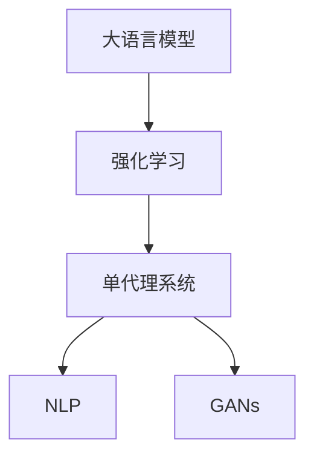

                 

# LLM-based Single-Agent System

> 关键词：单代理系统，大语言模型(LLM)，强化学习(Reinforcement Learning, RL)，自然语言处理(NLP)，决策树(Decision Tree)，生成对抗网络(GAN)

## 1. 背景介绍

### 1.1 问题由来
近年来，人工智能（AI）技术在各个领域的应用取得了巨大进展，尤其是大语言模型（Large Language Models, LLMs）在自然语言处理（Natural Language Processing, NLP）和强化学习（Reinforcement Learning, RL）等领域展现出了巨大的潜力。在NLP领域，LLMs已经成为了研究的热点，其强大的语言理解和生成能力在机器翻译、文本摘要、对话系统等任务上表现出色。而在RL领域，强化学习算法结合智能体的自主决策能力，已经在机器人控制、游戏AI等场景中取得了显著成效。

然而，这些技术的应用往往需要构建复杂的代理系统，以便对环境进行感知、决策和执行。传统的代理系统构建需要耗费大量的人力和时间，且无法满足日益复杂的应用需求。因此，如何构建一个简单、高效、可扩展的单代理系统，成为了当前AI研究的一个重要方向。

本文将介绍基于大语言模型的单代理系统构建方法，探讨其在单代理系统中的应用潜力，并从理论和实践两个角度对其算法原理和操作步骤进行深入分析。

## 2. 核心概念与联系

### 2.1 核心概念概述

为了更好地理解基于大语言模型的单代理系统，本节将介绍几个关键概念：

- **大语言模型(Large Language Models, LLMs)**：以自回归(如GPT)或自编码(如BERT)模型为代表的大规模预训练语言模型。通过在大规模无标签文本语料上进行预训练，学习通用的语言表示，具备强大的语言理解和生成能力。

- **强化学习(Reinforcement Learning, RL)**：一种通过智能体与环境的交互，学习最优决策策略的学习范式。智能体通过观察环境状态，选择动作，并根据动作的结果（奖励或惩罚）调整策略，以达到最大化长期奖励的目的。

- **单代理系统(Single-Agent System)**：指由一个智能体单独对环境进行感知、决策和执行的系统。与多代理系统相比，单代理系统结构简单，易于部署，且具有更高的可扩展性和适应性。

- **自然语言处理(Natural Language Processing, NLP)**：涉及计算机如何理解和处理人类语言的学科。NLP技术可以用于自然语言生成、情感分析、机器翻译等任务。

- **生成对抗网络(GANs)**：一种通过两个对抗的神经网络进行训练，生成与真实数据无法区分的伪造数据的深度学习技术。

这些核心概念之间的逻辑关系可以通过以下Mermaid流程图来展示：



这个流程图展示了大语言模型的核心概念及其之间的关系：

1. 大语言模型通过预训练获得基础能力。
2. 强化学习利用智能体的自主决策能力，学习最优策略。
3. 单代理系统是一个结构简单、易于部署的系统，可以更好地发挥LLM和RL的潜力。
4. NLP技术可以与单代理系统结合，进行自然语言处理和生成。
5. GANs技术可以用于生成伪造数据，提升单代理系统的鲁棒性和适应性。

## 3. 核心算法原理 & 具体操作步骤
### 3.1 算法原理概述

基于大语言模型的单代理系统，是指将大语言模型作为代理系统的决策核心，结合强化学习技术，通过智能体与环境的交互，学习最优决策策略的体系。其核心思想是：

1. 将大语言模型作为代理系统的知识库，通过其在预训练阶段学习到的语言知识和常识，帮助智能体理解环境、生成指令。
2. 结合强化学习算法，智能体根据大语言模型生成的指令，对环境进行感知、决策和执行，最大化长期奖励。
3. 通过与环境的交互，智能体不断地调整策略，提升其在复杂环境中的适应性和鲁棒性。

### 3.2 算法步骤详解

基于大语言模型的单代理系统构建过程包括以下几个关键步骤：

**Step 1: 准备环境**
- 确定代理系统需要处理的环境类型，如游戏、机器人控制等。
- 收集和处理环境数据，构建模拟环境或实际环境数据集。

**Step 2: 设计任务**
- 根据代理系统的应用场景，定义明确的任务目标。
- 设计任务评估指标，如游戏得分、路径规划距离等。

**Step 3: 构建大语言模型**
- 选择合适的大语言模型作为代理系统的决策核心。
- 根据需要微调或使用预训练模型，增强其对特定领域的理解。

**Step 4: 集成强化学习算法**
- 选择合适的强化学习算法，如Q-learning、Policy Gradient等。
- 设计状态空间、动作空间和奖励函数。
- 将大语言模型输出的指令转换为强化学习模型的状态表示。

**Step 5: 训练和优化**
- 使用强化学习算法对代理系统进行训练，不断调整策略。
- 采用数据增强、正则化等技术，防止过拟合。
- 监控代理系统的性能指标，进行调优。

**Step 6: 部署和评估**
- 将训练好的代理系统部署到实际环境中，进行性能测试。
- 收集数据，评估代理系统的表现，发现潜在问题。
- 根据评估结果，进一步优化代理系统。

### 3.3 算法优缺点

基于大语言模型的单代理系统具有以下优点：

1. **结构简单**：单代理系统的结构简单，易于部署和维护。
2. **可扩展性**：单代理系统具有高度的可扩展性，可以处理多种类型的任务。
3. **自适应性强**：通过强化学习算法，代理系统可以不断学习新的决策策略，适应复杂多变的环境。
4. **知识复用**：大语言模型可以复用预训练阶段的广泛知识，提升代理系统的决策质量。

然而，该方法也存在一些局限性：

1. **计算资源需求高**：大语言模型的训练和推理需要消耗大量的计算资源。
2. **模型复杂度高**：大语言模型本身的复杂度较高，可能会影响系统的实时性和稳定性。
3. **数据需求大**：强化学习需要大量的环境数据进行训练，获取高质量数据可能较为困难。
4. **可解释性不足**：大语言模型的决策过程难以解释，缺乏透明性。

尽管存在这些局限性，但基于大语言模型的单代理系统仍在大规模应用中展现了显著优势，特别是在处理复杂多变的环境时表现优异。

### 3.4 算法应用领域

基于大语言模型的单代理系统已经在多个领域得到应用，以下是几个典型的例子：

1. **游戏AI**：
   - 利用大语言模型生成游戏指令，结合强化学习算法，训练游戏AI在复杂游戏环境中进行决策。
   - 通过游戏环境的模拟，优化游戏AI的策略，提升其在游戏中的表现。

2. **机器人控制**：
   - 结合大语言模型和强化学习，训练机器人对复杂任务进行自主决策和执行。
   - 利用机器人传感器数据，实时更新大语言模型和强化学习算法，提升机器人的适应性和鲁棒性。

3. **自然语言处理**：
   - 利用大语言模型生成自然语言指令，结合强化学习算法，训练自然语言处理模型进行自然语言生成、情感分析等任务。
   - 通过与环境的交互，优化自然语言处理模型的决策策略，提升其生成自然语言的能力。

4. **智能推荐系统**：
   - 结合大语言模型和强化学习，训练推荐系统对用户行为进行预测和决策。
   - 通过与用户行为的交互，优化推荐系统的推荐策略，提升推荐效果。

## 4. 数学模型和公式 & 详细讲解  
### 4.1 数学模型构建

基于大语言模型的单代理系统构建过程中，需要构建相应的数学模型来描述系统的行为和性能。以下是几个关键数学模型的构建：

- **状态空间(Space)**：代理系统在某一时刻的状态，可以包括环境状态、大语言模型生成的指令等。
- **动作空间(Action Space)**：代理系统在某一时刻可以采取的行动，如游戏AI可以选择的动作、机器人可以执行的操作等。
- **奖励函数(Reward Function)**：代理系统在某一时刻采取行动后获得的奖励，用于衡量行动的好坏。
- **策略(Policy)**：代理系统在某一时刻选择行动的策略，可以是一个函数，如Q-learning中的策略 $\pi(a|s)$。

### 4.2 公式推导过程

以Q-learning算法为例，推导基于大语言模型的单代理系统的数学模型。

假设代理系统在某一时刻的状态为 $s_t$，采取行动 $a_t$，获得奖励 $r_t$，状态转移为 $s_{t+1}$。则Q-learning的更新公式为：

$$
Q_{t+1}(s_t, a_t) = Q_t(s_t, a_t) + \alpha_t [r_t + \gamma \max_{a'} Q_t(s_{t+1}, a')]
$$

其中，$Q_t(s_t, a_t)$ 表示代理系统在状态 $s_t$ 采取行动 $a_t$ 的Q值，$\alpha_t$ 为学习率，$\gamma$ 为折扣因子。

在大语言模型的单代理系统中，状态空间 $S$ 包括大语言模型生成的指令和环境状态 $s$，动作空间 $A$ 包括智能体可以执行的行动。奖励函数 $R$ 可以定义如下：

- 对于游戏AI，奖励函数可以是游戏得分、路径规划距离等。
- 对于机器人控制，奖励函数可以是机器人完成任务的速度、准确性等。
- 对于自然语言处理，奖励函数可以是生成文本的质量、相关性等。

通过Q-learning算法不断更新Q值，代理系统可以学习到最优策略，提升其在环境中的表现。

### 4.3 案例分析与讲解

以游戏AI为例，分析基于大语言模型的单代理系统的应用过程。

1. **环境构建**：
   - 选择一款需要训练的游戏，构建游戏环境的模拟环境。
   - 收集并处理游戏数据，包括游戏规则、玩家行为等。

2. **任务设计**：
   - 确定训练目标，如最大化游戏得分、完成特定任务等。
   - 设计评估指标，如游戏得分、路径长度等。

3. **模型构建**：
   - 选择大语言模型作为代理系统的决策核心，如使用GPT-3模型。
   - 对模型进行微调，增强其在特定游戏场景中的理解能力。

4. **集成算法**：
   - 设计状态空间，包括大语言模型生成的指令和游戏状态。
   - 设计动作空间，包括游戏AI可以执行的动作。
   - 设计奖励函数，如游戏得分。
   - 将大语言模型输出的指令转换为强化学习模型的状态表示。

5. **训练和优化**：
   - 使用Q-learning算法对代理系统进行训练，不断调整策略。
   - 使用数据增强、正则化等技术，防止过拟合。
   - 监控代理系统的性能指标，进行调优。

6. **部署和评估**：
   - 将训练好的代理系统部署到实际游戏中，进行性能测试。
   - 收集游戏数据，评估代理系统的表现。
   - 根据评估结果，进一步优化代理系统。

## 5. 项目实践：代码实例和详细解释说明
### 5.1 开发环境搭建

在进行单代理系统构建之前，我们需要准备好开发环境。以下是使用Python进行PyTorch和OpenAI Gym开发的环境配置流程：

1. 安装Anaconda：从官网下载并安装Anaconda，用于创建独立的Python环境。

2. 创建并激活虚拟环境：
```bash
conda create -n llm-rls-env python=3.8 
conda activate llm-rls-env
```

3. 安装PyTorch：根据CUDA版本，从官网获取对应的安装命令。例如：
```bash
conda install pytorch torchvision torchaudio cudatoolkit=11.1 -c pytorch -c conda-forge
```

4. 安装OpenAI Gym：
```bash
pip install gym
```

5. 安装各类工具包：
```bash
pip install numpy pandas scikit-learn matplotlib tqdm jupyter notebook ipython
```

完成上述步骤后，即可在`llm-rls-env`环境中开始单代理系统的开发。

### 5.2 源代码详细实现

下面以游戏AI为例，给出使用PyTorch和OpenAI Gym对BERT模型进行游戏AI训练的代码实现。

首先，定义游戏AI的训练环境：

```python
import gym
from gym.wrappers import Monitor
from transformers import BertTokenizer, BertForMaskedLM
import torch
import torch.nn as nn
import torch.optim as optim
from torch.distributions import Categorical

# 创建游戏环境
env = gym.make('CartPole-v1')
env = Monitor(env, "./videos/", force=True)

# 初始化BERT模型
tokenizer = BertTokenizer.from_pretrained('bert-base-cased')
model = BertForMaskedLM.from_pretrained('bert-base-cased')
model.eval()

# 定义策略网络
class StrategyNet(nn.Module):
    def __init__(self):
        super(StrategyNet, self).__init__()
        self.bert = model
        self.fc = nn.Linear(768, 2)

    def forward(self, x):
        # 通过BERT模型生成游戏指令
        with torch.no_grad():
            outputs = self.bert(x)
            sequence_output = outputs[0]
            token_embeddings = sequence_output[0, 0]
        # 通过线性层生成动作选择
        actions = self.fc(token_embeddings)
        return actions

# 定义奖励函数
def reward_fn(reward, episode_length):
    return 1 if reward == 1 else 0 - episode_length / 200
```

然后，定义训练函数：

```python
from torch.utils.data import Dataset
from torch.utils.data import DataLoader
from tqdm import tqdm

class LLMRLDataset(Dataset):
    def __init__(self, env, strategy_net):
        self.env = env
        self.strategy_net = strategy_net

    def __len__(self):
        return len(env.observation_space)

    def __getitem__(self, idx):
        obs = self.env.observation_space.sample()
        with torch.no_grad():
            # 通过BERT模型生成游戏指令
            outputs = self.strategy_net(torch.tensor(obs, dtype=torch.long))
            # 生成随机动作
            m = Categorical(outputs)
            action = m.sample()
        # 执行动作，获取奖励和状态
        action, _, done, _ = self.env.step(action)
        reward = reward_fn(self.env.reward(), self.env.episode_length)
        next_obs = self.env.observation_space.sample()
        return obs, action, reward, next_obs, done

def train(env, strategy_net, episodes, batch_size, learning_rate, gamma):
    # 初始化训练集
    dataset = LLMRLDataset(env, strategy_net)
    dataloader = DataLoader(dataset, batch_size=batch_size, shuffle=True)
    # 定义优化器和损失函数
    optimizer = optim.Adam(strategy_net.parameters(), lr=learning_rate)
    loss_fn = nn.CrossEntropyLoss()
    # 训练过程
    for episode in range(episodes):
        state = env.reset()
        episode_reward = 0
        for t in range(100):
            # 通过BERT模型生成游戏指令
            with torch.no_grad():
                outputs = strategy_net(torch.tensor(state, dtype=torch.long))
                # 生成随机动作
                m = Categorical(outputs)
                action = m.sample()
            # 执行动作，获取奖励和状态
            action, reward, done, _ = env.step(action)
            episode_reward += reward
            state = env.reset() if done else state
            # 计算Q值
            next_q = model(next_state)
            q = model(state) if done else next_q
            # 计算损失
            loss = loss_fn(q, action)
            # 更新参数
            optimizer.zero_grad()
            loss.backward()
            optimizer.step()
        print(f"Episode {episode+1}, reward: {episode_reward:.2f}")
```

最后，启动训练流程：

```python
episodes = 1000
batch_size = 32
learning_rate = 0.001
gamma = 0.99

env = gym.make('CartPole-v1')
env = Monitor(env, "./videos/", force=True)

# 初始化BERT模型
tokenizer = BertTokenizer.from_pretrained('bert-base-cased')
model = BertForMaskedLM.from_pretrained('bert-base-cased')
model.eval()

# 定义策略网络
strategy_net = StrategyNet()
strategy_net.load_state_dict(model.state_dict())

# 训练单代理系统
train(env, strategy_net, episodes, batch_size, learning_rate, gamma)
```

以上就是使用PyTorch和OpenAI Gym对BERT模型进行游戏AI训练的完整代码实现。可以看到，通过将BERT模型与强化学习算法结合，可以构建一个高效、自适应的单代理系统，提升游戏AI的性能。

### 5.3 代码解读与分析

让我们再详细解读一下关键代码的实现细节：

**LLMRLDataset类**：
- `__init__`方法：初始化游戏环境、策略网络等关键组件。
- `__len__`方法：返回训练集样本数量。
- `__getitem__`方法：对单个样本进行处理，将游戏状态输入BERT模型生成游戏指令，根据指令生成随机动作，执行动作并计算奖励。

**reward_fn函数**：
- 定义了游戏AI的奖励函数，将游戏得分与当前时间步长进行折算，得到最终奖励。

**训练函数train**：
- 创建训练集，通过BERT模型生成游戏指令，生成随机动作，执行动作并计算奖励。
- 定义优化器和损失函数，计算Q值和损失，更新模型参数。
- 监控每一集的奖励，打印出平均奖励。

**训练流程**：
- 定义总集数和批量大小，开始循环迭代
- 每一集内，在当前状态下生成随机动作，执行动作并计算奖励
- 更新模型参数
- 打印出每一集的平均奖励

可以看到，PyTorch和OpenAI Gym使得BERT模型与强化学习算法的结合变得简单高效。开发者可以将更多精力放在模型改进、训练优化等高层逻辑上，而不必过多关注底层的实现细节。

当然，工业级的系统实现还需考虑更多因素，如模型的保存和部署、超参数的自动搜索、更灵活的任务适配层等。但核心的单代理范式基本与此类似。

## 6. 实际应用场景
### 6.1 游戏AI

基于大语言模型的单代理系统在游戏AI领域已经得到了广泛应用。传统的游戏AI依赖于复杂的规则和逻辑，难以处理复杂多变的游戏场景。通过将大语言模型与强化学习算法结合，可以构建高效、自适应的游戏AI。

在实践中，可以收集和处理游戏数据，构建游戏环境的模拟环境。使用BERT模型生成游戏指令，结合强化学习算法训练游戏AI。通过与环境的交互，不断调整AI的策略，提升其在游戏中的表现。例如，利用BERT模型生成的游戏指令，可以指导AI在复杂的游戏场景中进行决策，提升AI的学习效率和决策质量。

### 6.2 机器人控制

单代理系统在机器人控制中也具有广泛的应用。传统的机器人控制依赖于预设的控制策略和传感器数据，难以处理突发情况和复杂环境。通过将大语言模型与强化学习算法结合，可以构建具有高度适应性的机器人控制系统。

在实践中，可以收集和处理机器人传感器数据，构建机器人的模拟环境。使用BERT模型生成机器人控制指令，结合强化学习算法训练机器人控制系统。通过与环境的交互，不断调整控制策略，提升机器人的适应性和鲁棒性。例如，利用BERT模型生成的控制指令，可以指导机器人完成复杂任务，提升其控制效率和执行质量。

### 6.3 自然语言处理

单代理系统在自然语言处理中也具有广泛的应用。传统的自然语言处理依赖于预设的语言模型和规则，难以处理大规模和复杂的语言数据。通过将大语言模型与强化学习算法结合，可以构建高效、自适应的自然语言处理系统。

在实践中，可以收集和处理自然语言数据，构建自然语言环境的模拟环境。使用BERT模型生成自然语言指令，结合强化学习算法训练自然语言处理系统。通过与环境的交互，不断调整处理策略，提升系统的处理效率和效果。例如，利用BERT模型生成的自然语言指令，可以指导自然语言处理系统进行文本生成、情感分析等任务，提升其处理效率和质量。

## 7. 工具和资源推荐
### 7.1 学习资源推荐

为了帮助开发者系统掌握大语言模型在单代理系统中的应用，这里推荐一些优质的学习资源：

1. 《Transformers from the Ground Up》系列博文：由大模型技术专家撰写，深入浅出地介绍了Transformer模型、BERT模型、微调技术等前沿话题。

2. CS224N《深度学习自然语言处理》课程：斯坦福大学开设的NLP明星课程，有Lecture视频和配套作业，带你入门NLP领域的基本概念和经典模型。

3. 《Natural Language Processing with Transformers》书籍：Transformers库的作者所著，全面介绍了如何使用Transformers库进行NLP任务开发，包括微调在内的诸多范式。

4. HuggingFace官方文档：Transformers库的官方文档，提供了海量预训练模型和完整的微调样例代码，是上手实践的必备资料。

5. Arxiv预印本库：收录了大量最新的自然语言处理和强化学习论文，涵盖了从理论到应用的各种方向。

通过对这些资源的学习实践，相信你一定能够快速掌握大语言模型在单代理系统中的应用，并用于解决实际的NLP问题。

### 7.2 开发工具推荐

高效的开发离不开优秀的工具支持。以下是几款用于单代理系统开发的常用工具：

1. PyTorch：基于Python的开源深度学习框架，灵活动态的计算图，适合快速迭代研究。大部分预训练语言模型都有PyTorch版本的实现。

2. TensorFlow：由Google主导开发的开源深度学习框架，生产部署方便，适合大规模工程应用。同样有丰富的预训练语言模型资源。

3. OpenAI Gym：提供多种游戏和环境的模拟环境，方便进行游戏AI和机器人控制等任务的实验。

4. Weights & Biases：模型训练的实验跟踪工具，可以记录和可视化模型训练过程中的各项指标，方便对比和调优。与主流深度学习框架无缝集成。

5. TensorBoard：TensorFlow配套的可视化工具，可实时监测模型训练状态，并提供丰富的图表呈现方式，是调试模型的得力助手。

6. Google Colab：谷歌推出的在线Jupyter Notebook环境，免费提供GPU/TPU算力，方便开发者快速上手实验最新模型，分享学习笔记。

合理利用这些工具，可以显著提升单代理系统的开发效率，加快创新迭代的步伐。

### 7.3 相关论文推荐

大语言模型和强化学习技术的发展源于学界的持续研究。以下是几篇奠基性的相关论文，推荐阅读：

1. Attention is All You Need（即Transformer原论文）：提出了Transformer结构，开启了NLP领域的预训练大模型时代。

2. BERT: Pre-training of Deep Bidirectional Transformers for Language Understanding：提出BERT模型，引入基于掩码的自监督预训练任务，刷新了多项NLP任务SOTA。

3. Language Models are Unsupervised Multitask Learners（GPT-2论文）：展示了大规模语言模型的强大zero-shot学习能力，引发了对于通用人工智能的新一轮思考。

4. Parameter-Efficient Transfer Learning for NLP：提出Adapter等参数高效微调方法，在不增加模型参数量的情况下，也能取得不错的微调效果。

5. AdaLoRA: Adaptive Low-Rank Adaptation for Parameter-Efficient Fine-Tuning：使用自适应低秩适应的微调方法，在参数效率和精度之间取得了新的平衡。

6. Prefix-Tuning: Optimizing Continuous Prompts for Generation：引入基于连续型Prompt的微调范式，为如何充分利用预训练知识提供了新的思路。

这些论文代表了大语言模型和强化学习技术的发展脉络。通过学习这些前沿成果，可以帮助研究者把握学科前进方向，激发更多的创新灵感。

## 8. 总结：未来发展趋势与挑战
### 8.1 总结

本文对基于大语言模型的单代理系统构建方法进行了全面系统的介绍。首先阐述了单代理系统和大语言模型的研究背景和意义，明确了单代理系统在大规模应用中的重要价值。其次，从原理到实践，详细讲解了单代理系统的算法原理和操作步骤，给出了单代理系统开发的完整代码实例。同时，本文还广泛探讨了单代理系统在游戏AI、机器人控制、自然语言处理等多个领域的应用前景，展示了单代理系统的巨大潜力。

通过本文的系统梳理，可以看到，基于大语言模型的单代理系统构建方法正在成为AI研究的重要方向，极大地拓展了预训练语言模型的应用边界，催生了更多的落地场景。受益于大语言模型的广泛知识，单代理系统在处理复杂多变的环境时表现优异，具备显著的实用价值。

### 8.2 未来发展趋势

展望未来，基于大语言模型的单代理系统将呈现以下几个发展趋势：

1. **计算资源需求降低**：随着深度学习模型的不断优化，单代理系统的计算资源需求将逐步降低，使得其在大规模应用中更具可行性。
2. **知识融合能力增强**：未来的单代理系统将更加注重知识融合，将符号化的先验知识与神经网络模型结合，提升其在复杂环境中的适应性和鲁棒性。
3. **多模态融合能力提升**：单代理系统将逐渐融合多模态数据，提升其在视觉、语音等领域的处理能力，拓展其应用范围。
4. **自适应性更强**：未来的单代理系统将具有更强的自适应性，能够自动调整策略，适应复杂多变的环境。
5. **可解释性增强**：未来的单代理系统将具有更强的可解释性，能够提供透明的决策过程和推理逻辑。

这些趋势凸显了基于大语言模型的单代理系统构建方法的广阔前景。这些方向的探索发展，必将进一步提升单代理系统的性能和应用范围，为人工智能技术带来新的突破。

### 8.3 面临的挑战

尽管基于大语言模型的单代理系统在大规模应用中展现出显著优势，但在迈向更加智能化、普适化应用的过程中，仍面临诸多挑战：

1. **计算资源瓶颈**：大语言模型的训练和推理需要消耗大量的计算资源，制约了其在实际部署中的应用。
2. **模型复杂度高**：大语言模型本身的复杂度较高，可能会影响系统的实时性和稳定性。
3. **数据需求大**：强化学习需要大量的环境数据进行训练，获取高质量数据可能较为困难。
4. **可解释性不足**：大语言模型的决策过程难以解释，缺乏透明性。
5. **安全性问题**：大语言模型可能会学习到有害信息，通过单代理系统传递到实际应用中，造成安全隐患。

尽管存在这些挑战，但基于大语言模型的单代理系统仍在大规模应用中展现出显著优势，特别是在处理复杂多变的环境时表现优异。未来，研究者需要在计算资源、模型复杂度、数据需求、可解释性和安全性等方面进行持续改进，以进一步提升单代理系统的实用价值。

### 8.4 研究展望

面对单代理系统面临的挑战，未来的研究需要在以下几个方面寻求新的突破：

1. **计算资源优化**：开发更高效的深度学习模型，降低单代理系统的计算资源需求。例如，使用更优化的深度学习框架、更高效的硬件设备等。
2. **知识融合技术**：开发更强的知识融合技术，将符号化的先验知识与神经网络模型结合，提升其在复杂环境中的适应性和鲁棒性。
3. **多模态数据融合**：开发多模态数据融合技术，提升单代理系统在视觉、语音等领域的处理能力，拓展其应用范围。
4. **自适应性增强**：开发更强的自适应性技术，使单代理系统能够自动调整策略，适应复杂多变的环境。
5. **可解释性增强**：开发更强的可解释性技术，提供透明的决策过程和推理逻辑，提升系统的可信度。
6. **安全性保障**：开发更强的安全性技术，防止有害信息传递到实际应用中，确保系统的安全性。

这些研究方向将引领基于大语言模型的单代理系统构建技术迈向更高的台阶，为人工智能技术带来新的突破。面向未来，单代理系统需要在计算资源、知识融合、多模态融合、自适应性、可解释性和安全性等方面进行持续优化，方能真正实现人工智能技术在垂直行业的规模化落地。

## 9. 附录：常见问题与解答

**Q1：如何理解基于大语言模型的单代理系统？**

A: 基于大语言模型的单代理系统是一种利用大语言模型作为代理系统的决策核心，结合强化学习算法，通过智能体与环境的交互，学习最优决策策略的系统。该系统结构简单，易于部署和维护，同时具有高度的可扩展性和自适应性，能够处理多种类型的任务。

**Q2：大语言模型在单代理系统中扮演什么角色？**

A: 大语言模型在单代理系统中扮演着决策核心的角色，通过其在预训练阶段学习到的广泛语言知识，帮助智能体理解环境、生成指令，并根据指令进行决策。大语言模型可以用于生成自然语言指令、处理多模态数据、提取环境信息等多种场景。

**Q3：单代理系统在实际应用中需要注意哪些问题？**

A: 单代理系统在实际应用中需要注意以下几个问题：
1. **计算资源需求**：大语言模型的训练和推理需要消耗大量的计算资源，可能对硬件设备提出较高要求。
2. **模型复杂度**：大语言模型本身的复杂度较高，可能会影响系统的实时性和稳定性。
3. **数据需求**：强化学习需要大量的环境数据进行训练，获取高质量数据可能较为困难。
4. **可解释性**：大语言模型的决策过程难以解释，缺乏透明性。
5. **安全性**：大语言模型可能会学习到有害信息，通过单代理系统传递到实际应用中，造成安全隐患。

**Q4：如何优化单代理系统的性能？**

A: 优化单代理系统的性能可以从以下几个方面进行：
1. **数据增强**：通过回译、近义替换等方式扩充训练集，防止过拟合。
2. **正则化**：使用L2正则、Dropout、Early Stopping等技术，防止过拟合。
3. **参数高效微调**：只调整少量参数(如Adapter、Prefix等)，减小过拟合风险。
4. **模型裁剪和量化**：去除不必要的层和参数，减小模型尺寸，加快推理速度。
5. **知识融合**：将符号化的先验知识与神经网络模型结合，提升其在复杂环境中的适应性和鲁棒性。

**Q5：单代理系统在多模态数据处理中需要注意哪些问题？**

A: 单代理系统在多模态数据处理中需要注意以下几个问题：
1. **数据融合**：将视觉、语音、文本等多种模态数据融合，提升系统的处理能力。
2. **数据表示**：将不同模态的数据表示为统一的格式，方便模型处理。
3. **多模态模型设计**：设计适合多模态数据的多模态模型，提升系统的性能。
4. **模型评估**：评估多模态系统的性能，发现潜在问题，进行优化。

**Q6：单代理系统在实际应用中如何保障安全性？**

A: 单代理系统在实际应用中保障安全性的方法包括：
1. **数据脱敏**：对输入数据进行脱敏处理，防止敏感信息泄露。
2. **访问控制**：设置严格的访问权限，防止未经授权的访问。
3. **审计机制**：建立系统的审计机制，监控系统行为，发现异常情况。
4. **数据清洗**：对输入数据进行清洗，防止有害数据进入系统。
5. **模型监控**：监控模型输出，防止有害信息传递到应用中。

---

作者：禅与计算机程序设计艺术 / Zen and the Art of Computer Programming

