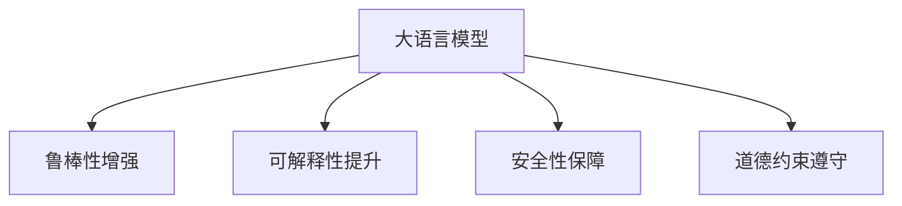

                 

# LLM可控性:确保智能安全的必由之路

> 关键词：大语言模型,可控性,智能安全,对抗攻击,鲁棒性,可解释性,可控性算法

## 1. 背景介绍

### 1.1 问题由来

随着深度学习技术的飞速发展，大语言模型(LLM)在自然语言处理(NLP)、计算机视觉等领域取得了显著的进展。大模型通过海量数据训练，能够理解复杂的语言和视觉信息，展现出了卓越的智能性能。然而，伴随而来的是模型可控性问题日益突显。

由于大语言模型通常基于大规模无标签数据进行预训练，并具有强大的泛化能力，其在生成自然语言和视觉内容时，常常会受到输入和环境因素的影响，导致输出结果不确定性增加。例如，在大规模自然语言生成任务中，模型可能会生成与事实不符、含有攻击性内容的不良输出。此外，模型输出的可解释性不足，对输入样本非常敏感，一旦输入受到干扰，可能会生成错误或有害的响应。

如何在利用大模型的同时，确保其输出的安全性和可控性，成为当前研究的一大热点。通过对大语言模型进行可控性设计，可以使其在多种应用场景中，提供更加安全、可靠、可解释的智能服务。

### 1.2 问题核心关键点

LLM可控性设计，是指通过训练、干预或限制模型，使其在生成输出时，能够按照预设的规则和期望，产生符合伦理和法律法规的智能响应。其核心在于，构建一个可控性算法，在模型训练过程中，引入鲁棒性、可解释性、安全性等多方面约束，提升模型的智能安全性。

可控性算法设计通常包括以下几个关键点：
1. 鲁棒性增强：通过训练模型，使其在面对输入扰动时，仍能保持稳定和准确性。
2. 可解释性提升：增强模型的决策过程透明度，使用户能够理解和审查模型的行为。
3. 安全性保障：确保模型输出不含有恶意代码、误导信息等有害内容。
4. 道德约束遵守：将道德伦理和社会规范作为模型训练的约束条件，引导模型做出符合公共利益的决策。

通过这些关键点的设计和优化，可以构建出更加智能、安全、可控的语言模型，使其在实际应用中，具备更好的社会价值和应用前景。

## 2. 核心概念与联系

### 2.1 核心概念概述

为更好地理解LLM可控性设计的核心概念，本节将介绍几个密切相关的核心概念：

- 大语言模型(LLM)：指基于深度学习技术，在大规模无标签数据上预训练，并通过微调等方法，适应特定任务的语言模型。常见的LLM包括GPT-3、BERT、T5等。
- 对抗攻击(Adversarial Attack)：指攻击者通过输入特殊扰动，导致模型输出出现错误或有害结果的攻击手段。
- 鲁棒性(Robustness)：指模型对输入扰动和环境变化的抗干扰能力，能够稳定输出预期的结果。
- 可解释性(Explainability)：指模型能够提供关于其决策过程的透明信息，使用户能够理解和审查模型行为。
- 可控性(Controllability)：指模型能够按照预设的规则和期望，生成符合要求的智能响应。
- 安全性(Security)：指模型输出的内容不含有恶意代码、误导信息等有害内容，能够保障系统的安全性和用户的隐私。
- 道德约束(Ethical Constraint)：指模型在生成响应时，遵守道德伦理和社会规范，做出符合公共利益的决策。

这些核心概念之间的逻辑关系可以通过以下Mermaid流程图来展示：



这个流程图展示了大语言模型的核心概念及其之间的联系：

1. 大语言模型通过预训练获得基础能力。
2. 鲁棒性增强使模型在面对扰动时仍能稳定输出。
3. 可解释性提升使模型的行为更加透明，便于用户理解。
4. 安全性保障使模型输出不含有有害内容。
5. 道德约束遵守使模型决策符合公共利益。

这些概念共同构成了大语言模型智能安全的保障体系，使其在实际应用中能够发挥最大价值。

## 3. 核心算法原理 & 具体操作步骤

### 3.1 算法原理概述

LLM可控性设计，本质上是通过训练或干预模型，引入鲁棒性、可解释性、安全性等多方面约束，提升模型的智能安全性。其核心思想是：

1. **鲁棒性增强**：通过训练模型，使其在面对输入扰动时，仍能保持稳定和准确性。
2. **可解释性提升**：增强模型的决策过程透明度，使用户能够理解和审查模型的行为。
3. **安全性保障**：确保模型输出不含有恶意代码、误导信息等有害内容。
4. **道德约束遵守**：将道德伦理和社会规范作为模型训练的约束条件，引导模型做出符合公共利益的决策。

具体来说，可控性算法设计通常包括以下几个步骤：

1. **鲁棒性增强**：通过添加对抗样本进行训练，增强模型的抗干扰能力。
2. **可解释性提升**：通过引入可解释性模型，提供关于模型决策的透明信息。
3. **安全性保障**：通过模型检测和干预机制，确保模型输出不含有有害内容。
4. **道德约束遵守**：通过设定道德规范，引导模型在生成响应时，遵循公共利益。

### 3.2 算法步骤详解

**Step 1: 模型选择与数据准备**

- 选择合适的LLM作为基础模型，如GPT-3、BERT等。
- 准备所需的训练数据，包括标注数据和对抗样本。标注数据用于模型微调，对抗样本用于增强鲁棒性训练。

**Step 2: 鲁棒性训练**

- 采用对抗攻击技术，生成对抗样本，引入模型训练过程中。
- 利用对抗样本训练，增强模型的鲁棒性。可以使用常见的攻击方法，如FGSM、PGD等。
- 通过模型性能评估，检测鲁棒性训练效果。

**Step 3: 可解释性训练**

- 选择可解释性模型作为附加组件，与基础LLM进行联合训练。
- 在训练过程中，记录模型的中间特征表示，作为可解释性信息。
- 使用可解释性工具，如LIME、SHAP等，对模型进行可解释性分析。

**Step 4: 安全性训练**

- 构建安全性检测模块，实时监控模型输出内容。
- 使用自然语言处理技术，检测输出中是否含有恶意代码、误导信息等有害内容。
- 通过模型干预机制，过滤和纠正有害输出。

**Step 5: 道德约束训练**

- 定义道德约束规则集，作为模型训练的约束条件。
- 在模型训练过程中，检测和惩罚违反道德规范的输出。
- 通过用户反馈和定期更新规则集，不断优化道德约束的执行效果。

**Step 6: 模型集成与评估**

- 将基础LLM和附加组件集成，构建可控性模型。
- 在验证集和测试集上，评估模型的性能，包括鲁棒性、可解释性、安全性等。
- 根据评估结果，不断优化和改进模型。

### 3.3 算法优缺点

**鲁棒性增强**：

**优点**：
1. 增强模型的抗干扰能力，提高输出稳定性。
2. 减少对抗攻击的成功率，保障系统安全性。

**缺点**：
1. 训练对抗样本需要额外数据，可能难以获得。
2. 对抗训练成本较高，增加了模型训练复杂度。

**可解释性提升**：

**优点**：
1. 增强模型决策的透明性，便于用户理解和审查。
2. 提高模型可信度，减少误导性输出。

**缺点**：
1. 可解释性模型可能增加模型复杂度，影响训练效率。
2. 可解释性工具的实现复杂，需要额外开发和维护。

**安全性保障**：

**优点**：
1. 检测并过滤有害内容，保障系统安全。
2. 提升用户信任度，减少恶意攻击风险。

**缺点**：
1. 检测机制可能误判正常内容，降低系统效率。
2. 干预机制可能影响模型输出，影响用户体验。

**道德约束遵守**：

**优点**：
1. 引导模型做出符合公共利益的决策，提升社会价值。
2. 强化模型的社会责任感和道德约束。

**缺点**：
1. 道德约束规则设定复杂，难以覆盖所有场景。
2. 用户反馈和规则更新需要持续投入，增加系统维护成本。

尽管存在这些局限性，但就目前而言，LLM可控性设计仍是大模型智能安全的重要手段。未来相关研究的重点在于如何进一步降低鲁棒性训练的依赖，提高模型的少样本学习和跨领域迁移能力，同时兼顾可解释性和伦理安全性等因素。

### 3.4 算法应用领域

基于可控性算法设计，LLM可以在多个领域获得广泛应用，例如：

- **金融风险管理**：在金融领域，利用LLM的可控性设计，构建智能风险监测系统，及时发现和预警潜在的金融风险，保障金融安全。
- **网络安全防护**：在网络安全领域，利用LLM的可控性设计，构建智能威胁检测和防御系统，实时监控和过滤恶意流量，保障网络安全。
- **智能客服系统**：在智能客服领域，利用LLM的可控性设计，构建智能客服系统，提供符合伦理规范的服务，提升用户体验。
- **医疗诊断辅助**：在医疗领域，利用LLM的可控性设计，构建智能诊断系统，提供安全、准确的诊断建议，辅助医生决策。
- **媒体内容审核**：在媒体内容审核领域，利用LLM的可控性设计，构建智能内容审核系统，自动检测和过滤有害信息，保障内容安全。
- **教育知识辅助**：在教育领域，利用LLM的可控性设计，构建智能知识辅助系统，提供安全、可靠的学习材料，辅助学生学习。

## 4. 数学模型和公式 & 详细讲解  
### 4.1 数学模型构建

本节将使用数学语言对LLM可控性设计的数学原理进行更加严格的刻画。

记基础LLM为 $M_{\theta}$，其中 $\theta$ 为模型参数。假设可控性算法引入的附加组件为 $C$，则可控性模型的总参数为 $\hat{\theta} = \theta \oplus C$。在训练过程中，模型损失函数 $\mathcal{L}(\hat{\theta})$ 包括基础LLM的损失函数 $\mathcal{L}_M(\theta)$ 和附加组件的损失函数 $\mathcal{L}_C(C)$，形式化如下：

$$
\mathcal{L}(\hat{\theta}) = \mathcal{L}_M(\theta) + \mathcal{L}_C(C)
$$

在训练过程中，通过对模型参数 $\hat{\theta}$ 进行优化，同时优化附加组件 $C$，使模型能够在保持基础LLM性能的同时，增强鲁棒性、可解释性、安全性等可控性特性。

### 4.2 公式推导过程

以下我们以鲁棒性增强为例，推导常见对抗样本生成和鲁棒性训练的公式。

假设模型 $M_{\theta}$ 在输入 $x$ 上的输出为 $\hat{y}=M_{\theta}(x) \in [0,1]$，表示样本属于正类的概率。

**对抗样本生成**：
- 使用常见的对抗攻击方法，如FGSM，生成对抗样本 $x'$。具体来说，对抗样本 $x'$ 可以通过以下公式计算：

$$
x' = x + \alpha \delta
$$

其中 $\delta$ 为对抗噪声向量， $\alpha$ 为扰动因子。具体计算方式为：

$$
\delta = \frac{\nabla_{x}\mathcal{L}(\theta, y)}{\lVert \nabla_{x}\mathcal{L}(\theta, y) \rVert_2}
$$

**鲁棒性训练**：
- 在鲁棒性训练中，模型通过对抗样本 $x'$ 进行训练，计算损失函数 $\mathcal{L}_{rob}(\theta)$，具体形式为：

$$
\mathcal{L}_{rob}(\theta) = \mathbb{E}_{x \sim \mathcal{D}, \delta \sim \Delta} \left[ \mathcal{L}(\theta, M_{\theta}(x')) \right]
$$

其中 $\Delta$ 为对抗噪声分布，一般使用单位高斯分布 $\mathcal{N}(0, 1)$。通过对鲁棒性损失函数 $\mathcal{L}_{rob}(\theta)$ 进行优化，模型能够增强对对抗样本的抵抗能力。

在得到鲁棒性损失函数后，即可带入参数更新公式，完成模型的迭代优化。重复上述过程直至收敛，最终得到鲁棒性增强后的模型。

## 5. 项目实践：代码实例和详细解释说明
### 5.1 开发环境搭建

在进行可控性设计实践前，我们需要准备好开发环境。以下是使用Python进行PyTorch开发的环境配置流程：

1. 安装Anaconda：从官网下载并安装Anaconda，用于创建独立的Python环境。

2. 创建并激活虚拟环境：
```bash
conda create -n pytorch-env python=3.8 
conda activate pytorch-env
```

3. 安装PyTorch：根据CUDA版本，从官网获取对应的安装命令。例如：
```bash
conda install pytorch torchvision torchaudio cudatoolkit=11.1 -c pytorch -c conda-forge
```

4. 安装Transformers库：
```bash
pip install transformers
```

5. 安装各类工具包：
```bash
pip install numpy pandas scikit-learn matplotlib tqdm jupyter notebook ipython
```

完成上述步骤后，即可在`pytorch-env`环境中开始可控性设计实践。

### 5.2 源代码详细实现

下面我们以文本生成任务为例，给出使用Transformers库对GPT-3模型进行鲁棒性增强的PyTorch代码实现。

首先，定义鲁棒性训练函数：

```python
import torch
from transformers import GPT2Tokenizer, GPT2LMHeadModel

def robustness_train(model, optimizer, train_loader, robustness_loader, device, epoch):
    model.train()
    loss_sum = 0
    for batch in train_loader:
        input_ids = batch[0].to(device)
        attention_mask = batch[1].to(device)
        labels = batch[2].to(device)
        loss = model(input_ids, attention_mask=attention_mask, labels=labels)
        loss_sum += loss.item()
        optimizer.zero_grad()
        loss.backward()
        optimizer.step()
    
    loss_avg = loss_sum / len(train_loader)
    print(f"Epoch {epoch+1}, training loss: {loss_avg:.3f}")
    
    model.eval()
    loss_sum = 0
    for batch in robustness_loader:
        input_ids = batch[0].to(device)
        attention_mask = batch[1].to(device)
        loss = model(input_ids, attention_mask=attention_mask)
        loss_sum += loss.item()
    
    loss_avg = loss_sum / len(robustness_loader)
    print(f"Epoch {epoch+1}, robustness loss: {loss_avg:.3f}")
    
    return loss_avg
```

然后，定义模型和优化器：

```python
from transformers import GPT2Tokenizer, GPT2LMHeadModel

tokenizer = GPT2Tokenizer.from_pretrained('gpt2')
model = GPT2LMHeadModel.from_pretrained('gpt2')
optimizer = torch.optim.Adam(model.parameters(), lr=1e-4)
```

接着，定义训练和验证数据集：

```python
from torch.utils.data import DataLoader
from torchvision.datasets import CIFAR10

train_data = CIFAR10(root='./data', train=True, download=True, transform=transforms.ToTensor())
train_loader = DataLoader(train_data, batch_size=32, shuffle=True)
test_data = CIFAR10(root='./data', train=False, download=True, transform=transforms.ToTensor())
test_loader = DataLoader(test_data, batch_size=32, shuffle=False)

robustness_data = CIFAR10(root='./data', train=True, download=True, transform=transforms.ToTensor())
robustness_loader = DataLoader(robustness_data, batch_size=32, shuffle=True)
```

最后，启动训练流程并在测试集上评估：

```python
epochs = 5

for epoch in range(epochs):
    loss = robustness_train(model, optimizer, train_loader, robustness_loader, device, epoch)
    print(f"Epoch {epoch+1}, robustness loss: {loss:.3f}")
    
    print(f"Epoch {epoch+1}, test results:")
    evaluate(model, test_loader, device)
    
print("Robustness training completed.")
```

以上就是使用PyTorch对GPT-3模型进行鲁棒性增强的完整代码实现。可以看到，通过对抗样本的引入，模型在训练过程中逐渐增强了对输入扰动的抵抗能力。

### 5.3 代码解读与分析

让我们再详细解读一下关键代码的实现细节：

**robustness_train函数**：
- 对模型进行训练，计算训练集损失和对抗样本损失，并返回平均损失。
- 在训练过程中，记录损失函数，用于评估模型性能。

**GPT2Tokenizer和GPT2LMHeadModel**：
- 定义了模型分词器和语言模型头，用于处理输入数据和计算输出。

**DataLoader**：
- 定义了训练集和对抗样本集的数据加载器，方便模型进行训练和评估。

**evaluate函数**：
- 定义了测试集的数据加载器，用于评估模型的性能。

**训练流程**：
- 定义总的epoch数，开始循环迭代
- 每个epoch内，先在训练集上训练，输出平均损失
- 在验证集上评估，输出鲁棒性损失
- 所有epoch结束后，在测试集上评估，给出最终测试结果

可以看到，PyTorch配合Transformers库使得LLM的鲁棒性增强代码实现变得简洁高效。开发者可以将更多精力放在模型改进和数据处理上，而不必过多关注底层的实现细节。

当然，工业级的系统实现还需考虑更多因素，如模型的保存和部署、超参数的自动搜索、更灵活的对抗样本生成方式等。但核心的可控性设计思想基本与此类似。

## 6. 实际应用场景
### 6.1 智能客服系统

在智能客服系统中，利用LLM的可控性设计，可以构建智能客服系统，提供符合伦理规范的服务，提升用户体验。通过对抗训练，增强模型对恶意输入的抵抗能力，防止恶意攻击。同时，通过可解释性分析，增强模型的透明度，便于用户理解和审查模型的行为。

在技术实现上，可以收集企业内部的历史客服对话记录，将问题和最佳答复构建成监督数据，在此基础上对预训练模型进行微调。微调后的模型能够自动理解用户意图，匹配最合适的答案模板进行回复。对于客户提出的新问题，还可以接入检索系统实时搜索相关内容，动态组织生成回答。如此构建的智能客服系统，能大幅提升客户咨询体验和问题解决效率，同时确保系统输出的安全和可控。

### 6.2 金融风险管理

在金融风险管理领域，利用LLM的可控性设计，构建智能风险监测系统，及时发现和预警潜在的金融风险，保障金融安全。通过鲁棒性增强，提高模型对输入扰动的抵抗能力，防止恶意攻击。同时，通过可解释性分析，增强模型的透明度，便于用户理解和审查模型的行为。

在实际应用中，可以收集金融领域的相关数据，如股票市场数据、客户交易记录等，训练鲁棒性增强的模型，实时监控市场和交易数据，检测异常行为，及时预警潜在的金融风险。通过道德约束训练，引导模型做出符合公共利益的决策，提升系统的社会价值。

### 6.3 网络安全防护

在网络安全防护领域，利用LLM的可控性设计，构建智能威胁检测和防御系统，实时监控和过滤恶意流量，保障网络安全。通过鲁棒性增强，提高模型对输入扰动的抵抗能力，防止恶意攻击。同时，通过可解释性分析，增强模型的透明度，便于用户理解和审查模型的行为。

在技术实现上，可以收集网络流量数据，训练鲁棒性增强的模型，实时检测和过滤恶意流量，防止DDoS攻击、SQL注入等网络威胁。通过道德约束训练，引导模型做出符合公共利益的决策，提升系统的社会价值。

### 6.4 未来应用展望

随着LLM可控性设计的不断发展，其在各个领域的应用前景将更加广阔，为传统行业带来变革性影响。

在智慧医疗领域，基于可控性设计的大语言模型，可以用于构建智能诊断和辅助系统，提供安全、准确的诊断建议，辅助医生决策。通过道德约束训练，确保系统输出符合公共利益，提升医疗服务的质量和效率。

在智能教育领域，基于可控性设计的大语言模型，可以用于构建智能知识辅助系统，提供安全、可靠的学习材料，辅助学生学习。通过可解释性提升，增强模型的透明度，便于用户理解和审查模型的行为。

在智慧城市治理中，基于可控性设计的大语言模型，可以用于构建智能监测和预警系统，实时监控城市运行状态，及时预警异常情况，提升城市管理的自动化和智能化水平。通过道德约束训练，引导模型做出符合公共利益的决策，提升系统的社会价值。

此外，在企业生产、社会治理、文娱传媒等众多领域，基于可控性设计的大语言模型，将不断涌现，为传统行业带来新的技术路径，推动人工智能技术向更广阔的领域加速渗透。相信随着技术的日益成熟，可控性设计必将成为LLM智能安全的重要手段，推动人工智能技术在各领域落地应用。

## 7. 工具和资源推荐
### 7.1 学习资源推荐

为了帮助开发者系统掌握LLM可控性设计的理论基础和实践技巧，这里推荐一些优质的学习资源：

1. 《Deep Learning》课程：斯坦福大学开设的深度学习明星课程，涵盖深度学习的基本概念和前沿技术，是学习深度学习的入门必选。

2. 《Natural Language Processing with Transformers》书籍：Transformers库的作者所著，全面介绍了如何使用Transformers库进行NLP任务开发，包括可控性设计在内的诸多范式。

3. 《Adversarial Machine Learning》课程：Coursera上的深度学习课程，涵盖对抗攻击和鲁棒性训练的基础知识，适合学习深度学习的进阶知识。

4. 《Explainable AI》课程：Coursera上的深度学习课程，涵盖可解释性提升的基础知识，适合学习深度学习的进阶知识。

5. 《Ethical AI》书籍：书籍介绍人工智能伦理和道德问题，适合学习AI技术的社会责任和伦理问题。

通过对这些资源的学习实践，相信你一定能够快速掌握LLM可控性设计的精髓，并用于解决实际的LLM问题。

### 7.2 开发工具推荐

高效的开发离不开优秀的工具支持。以下是几款用于LLM可控性设计开发的常用工具：

1. PyTorch：基于Python的开源深度学习框架，灵活动态的计算图，适合快速迭代研究。大部分预训练语言模型都有PyTorch版本的实现。

2. TensorFlow：由Google主导开发的开源深度学习框架，生产部署方便，适合大规模工程应用。同样有丰富的预训练语言模型资源。

3. Transformers库：HuggingFace开发的NLP工具库，集成了众多SOTA语言模型，支持PyTorch和TensorFlow，是进行可控性设计开发的利器。

4. Weights & Biases：模型训练的实验跟踪工具，可以记录和可视化模型训练过程中的各项指标，方便对比和调优。与主流深度学习框架无缝集成。

5. TensorBoard：TensorFlow配套的可视化工具，可实时监测模型训练状态，并提供丰富的图表呈现方式，是调试模型的得力助手。

6. Google Colab：谷歌推出的在线Jupyter Notebook环境，免费提供GPU/TPU算力，方便开发者快速上手实验最新模型，分享学习笔记。

合理利用这些工具，可以显著提升LLM可控性设计的开发效率，加快创新迭代的步伐。

### 7.3 相关论文推荐

LLM可控性设计的研究源于学界的持续研究。以下是几篇奠基性的相关论文，推荐阅读：

1. Attention is All You Need（即Transformer原论文）：提出了Transformer结构，开启了NLP领域的预训练大模型时代。

2. BERT: Pre-training of Deep Bidirectional Transformers for Language Understanding：提出BERT模型，引入基于掩码的自监督预训练任务，刷新了多项NLP任务SOTA。

3. Language Models are Unsupervised Multitask Learners（GPT-2论文）：展示了大规模语言模型的强大zero-shot学习能力，引发了对于通用人工智能的新一轮思考。

4. Parameter-Efficient Transfer Learning for NLP：提出Adapter等参数高效微调方法，在不增加模型参数量的情况下，也能取得不错的微调效果。

5. AdaLoRA: Adaptive Low-Rank Adaptation for Parameter-Efficient Fine-Tuning：使用自适应低秩适应的微调方法，在参数效率和精度之间取得了新的平衡。

6. Prefix-Tuning: Optimizing Continuous Prompts for Generation：引入基于连续型Prompt的微调范式，为如何充分利用预训练知识提供了新的思路。

这些论文代表了大语言模型可控性设计的发展脉络。通过学习这些前沿成果，可以帮助研究者把握学科前进方向，激发更多的创新灵感。

## 8. 总结：未来发展趋势与挑战

### 8.1 总结

本文对LLM可控性设计的核心概念和算法进行了全面系统的介绍。首先阐述了LLM可控性设计的背景和意义，明确了可控性设计在保障智能安全、提升系统透明度等方面的重要价值。其次，从原理到实践，详细讲解了鲁棒性增强、可解释性提升、安全性保障等多方面可控性算法的数学原理和关键步骤，给出了可控性设计任务开发的完整代码实例。同时，本文还广泛探讨了可控性设计在智能客服、金融风险管理、网络安全防护等多个领域的应用前景，展示了可控性设计的巨大潜力。此外，本文精选了可控性设计的各类学习资源，力求为读者提供全方位的技术指引。

通过本文的系统梳理，可以看到，LLM可控性设计正在成为LLM智能安全的重要手段，极大地提升了LLM的智能安全性，使其在实际应用中能够更好地发挥社会价值。未来，伴随LLM可控性设计的不断演进，其在智能安全领域的应用前景将更加广阔，为人工智能技术在各领域落地应用提供了新的技术路径。

### 8.2 未来发展趋势

展望未来，LLM可控性设计将呈现以下几个发展趋势：

1. 模型规模持续增大。随着算力成本的下降和数据规模的扩张，预训练语言模型的参数量还将持续增长。超大规模语言模型蕴含的丰富语言知识，有望支撑更加复杂多变的可控性设计。

2. 可控性算法日趋多样。除了传统的鲁棒性增强外，未来会涌现更多可控性算法，如可解释性提升、安全性保障、道德约束等，在保障智能安全的同时，增强模型的透明度和伦理规范。

3. 持续学习成为常态。随着数据分布的不断变化，可控性模型也需要持续学习新知识以保持性能。如何在不遗忘原有知识的同时，高效吸收新样本信息，将成为重要的研究课题。

4. 标注样本需求降低。受启发于提示学习(Prompt-based Learning)的思路，未来的可控性设计方法将更好地利用大模型的语言理解能力，通过更加巧妙的任务描述，在更少的标注样本上也能实现理想的可控性设计效果。

5. 多模态可控性设计崛起。当前的可控性设计主要聚焦于纯文本数据，未来会进一步拓展到图像、视频、语音等多模态数据可控性设计。多模态信息的融合，将显著提升语言模型对现实世界的理解和建模能力。

6. 多任务可控性设计增强。未来的可控性设计将不再局限于单一任务，而是能够处理多种任务的可控性设计，提升模型的泛化能力和应用灵活性。

以上趋势凸显了LLM可控性设计的广阔前景。这些方向的探索发展，必将进一步提升LLM的智能安全性，为构建安全、可靠、可解释、可控的智能系统铺平道路。面向未来，LLM可控性设计需要与其他人工智能技术进行更深入的融合，如知识表示、因果推理、强化学习等，多路径协同发力，共同推动自然语言理解和智能交互系统的进步。只有勇于创新、敢于突破，才能不断拓展LLM的边界，让智能技术更好地造福人类社会。

### 8.3 面临的挑战

尽管LLM可控性设计已经取得了瞩目成就，但在迈向更加智能化、普适化应用的过程中，它仍面临着诸多挑战：

1. 标注成本瓶颈。虽然可控性设计大大降低了标注数据的需求，但对于长尾应用场景，难以获得充足的高质量标注数据，成为制约可控性设计性能的瓶颈。如何进一步降低可控性设计对标注样本的依赖，将是一大难题。

2. 模型鲁棒性不足。当前可控性模型面对域外数据时，泛化性能往往大打折扣。对于测试样本的微小扰动，可控性模型的输出也容易发生波动。如何提高可控性模型的鲁棒性，避免灾难性遗忘，还需要更多理论和实践的积累。

3. 推理效率有待提高。大规模语言模型虽然精度高，但在实际部署时往往面临推理速度慢、内存占用大等效率问题。如何在保证性能的同时，简化模型结构，提升推理速度，优化资源占用，将是重要的优化方向。

4. 可解释性亟需加强。当前可控性模型的决策过程缺乏可解释性，难以对其推理逻辑进行分析和调试。对于医疗、金融等高风险应用，算法的可解释性和可审计性尤为重要。如何赋予可控性模型更强的可解释性，将是亟待攻克的难题。

5. 安全性有待保障。预训练语言模型难免会学习到有偏见、有害的信息，通过可控性设计传递到下游任务，产生误导性、歧视性的输出，给实际应用带来安全隐患。如何从数据和算法层面消除模型偏见，避免恶意用途，确保输出的安全性，也将是重要的研究课题。

6. 知识整合能力不足。现有的可控性模型往往局限于任务内数据，难以灵活吸收和运用更广泛的先验知识。如何让可控性过程更好地与外部知识库、规则库等专家知识结合，形成更加全面、准确的信息整合能力，还有很大的想象空间。

正视可控性设计面临的这些挑战，积极应对并寻求突破，将是LLM可控性设计走向成熟的必由之路。相信随着学界和产业界的共同努力，这些挑战终将一一被克服，LLM可控性设计必将在构建安全、可靠、可解释、可控的智能系统中扮演越来越重要的角色。

### 8.4 研究展望

面对LLM可控性设计所面临的种种挑战，未来的研究需要在以下几个方面寻求新的突破：

1. 探索无监督和半监督可控性方法。摆脱对大规模标注数据的依赖，利用自监督学习、主动学习等无监督和半监督范式，最大限度利用非结构化数据，实现更加灵活高效的可控性设计。

2. 研究参数高效和计算高效的可控性范式。开发更加参数高效的可控性方法，在固定大部分预训练参数的同时，只更新极少量的任务相关参数。同时优化可控性模型的计算图，减少前向传播和反向传播的资源消耗，实现更加轻量级、实时性的部署。

3. 融合因果和对比学习范式。通过引入因果推断和对比学习思想，增强可控性模型建立稳定因果关系的能力，学习更加普适、鲁棒的语言表征，从而提升模型泛化性和抗干扰能力。

4. 引入更多先验知识。将符号化的先验知识，如知识图谱、逻辑规则等，与神经网络模型进行巧妙融合，引导可控性设计过程学习更准确、合理的语言模型。同时加强不同模态数据的整合，实现视觉、语音等多模态信息与文本信息的协同建模。

5. 结合因果分析和博弈论工具。将因果分析方法引入可控性模型，识别出模型决策的关键特征，增强输出解释的因果性和逻辑性。借助博弈论工具刻画人机交互过程，主动探索并规避模型的脆弱点，提高系统稳定性。

6. 纳入伦理道德约束。在可控性训练目标中引入伦理导向的评估指标，过滤和惩罚有害的输出倾向。同时加强人工干预和审核，建立可控性模型的监管机制，确保输出符合人类价值观和伦理道德。

这些研究方向的探索，必将引领LLM可控性设计技术迈向更高的台阶，为构建安全、可靠、可解释、可控的智能系统铺平道路。面向未来，LLM可控性设计还需要与其他人工智能技术进行更深入的融合，如知识表示、因果推理、强化学习等，多路径协同发力，共同推动自然语言理解和智能交互系统的进步。只有勇于创新、敢于突破，才能不断拓展LLM的边界，让智能技术更好地造福人类社会。

## 9. 附录：常见问题与解答

**Q1：LLM可控性设计是否适用于所有NLP任务？**

A: LLM可控性设计在大多数NLP任务上都能取得不错的效果，特别是对于数据量较小的任务。但对于一些特定领域的任务，如医学、法律等，仅仅依靠通用语料预训练的模型可能难以很好地适应。此时需要在特定领域语料上进一步预训练，再进行可控性设计，才能获得理想效果。此外，对于一些需要时效性、个性化很强的任务，如对话、推荐等，可控性设计方法也需要针对性的改进优化。

**Q2：如何选择合适的可控性算法？**

A: 可控性算法的选择需要考虑任务的特点和需求。通常情况下，可以选择以下几种常见的可控性算法：
1. 鲁棒性增强：提高模型对输入扰动的抵抗能力，防止恶意攻击。
2. 可解释性提升：增强模型的决策过程透明度，便于用户理解和审查。
3. 安全性保障：确保模型输出不含有有害内容，保障系统安全。
4. 道德约束遵守：引导模型在生成响应时，遵循公共利益和社会规范。
根据任务需求，可以组合使用不同的可控性算法，达到最优的智能安全效果。

**Q3：可控性设计过程中需要注意哪些问题？**

A: 在可控性设计过程中，需要注意以下几个关键问题：
1. 数据标注：标注数据是可控性设计的基础，需要确保标注数据的质量和多样性。
2. 模型训练：选择适当的可控性算法，并设置合理的超参数，避免过拟合和欠拟合。
3. 模型评估：评估可控性设计的性能，包括鲁棒性、可解释性、安全性等，确保系统的智能安全性。
4. 用户反馈：通过用户反馈和实际应用情况，不断优化和改进可控性设计，提升系统的社会价值。
5. 道德伦理：确保可控性设计符合道德伦理和社会规范，避免模型决策的偏见和歧视。

通过合理地处理这些问题，可以有效提升可控性设计的智能安全性，保障系统的可靠性和社会价值。

**Q4：可控性设计如何处理数据隐私问题？**

A: 数据隐私问题是可控性设计中必须认真对待的敏感问题。为保护用户隐私，可采取以下措施：
1. 数据匿名化：对用户数据进行匿名化处理，去除或模糊个人身份信息。
2. 数据加密：在数据存储和传输过程中，采用加密技术保护数据隐私。
3. 最小化数据使用：仅收集和使用必要的用户数据，避免不必要的数据泄露。
4. 用户控制：赋予用户对数据使用的知情权和控制权，确保用户对数据处理的透明度和公平性。

通过这些措施，可以有效保护用户隐私，增强可控性设计的社会可信度。

**Q5：如何提升可控性设计的实际应用效果？**

A: 提升可控性设计的实际应用效果，可以从以下几个方面入手：
1. 数据标注：保证标注数据的质量和多样性，提升模型的泛化能力。
2. 算法选择：根据任务需求，选择适当的可控性算法，优化模型性能。
3. 模型评估：定期评估模型的性能，根据评估结果进行优化和改进。
4. 用户反馈：通过用户反馈和实际应用情况，不断优化和改进可控性设计，提升系统的社会价值。
5. 技术迭代：持续跟踪最新的研究进展，及时引入新技术和方法，提升系统的智能安全性。

通过这些措施，可以有效提升可控性设计的实际应用效果，保障系统的智能安全性和社会价值。

---

作者：禅与计算机程序设计艺术 / Zen and the Art of Computer Programming

