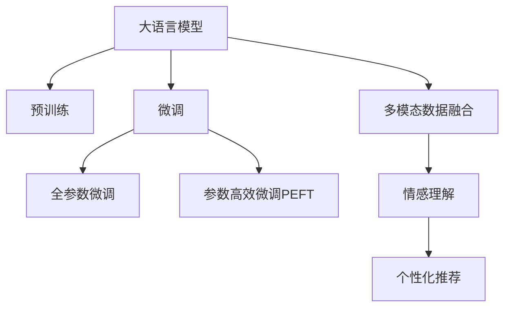

                 

# LLM在体育赛事分析中的应用：AI解说员

## 1. 背景介绍

### 1.1 问题由来
随着体育赛事的普及和媒体的数字化转型，越来越多的人通过电视、互联网等渠道关注体育比赛。传统的人工体育解说员往往难以实时提供精准的赛事分析和即时报道，且成本较高，难以覆盖大规模赛事。然而，自然语言处理(NLP)技术和大规模语言模型(LLM)的快速发展，使得实时自动体育赛事分析和解说成为可能。本文将探讨如何利用LLM技术，构建高效的AI解说员，为体育赛事提供实时、精准的分析和解说服务。

### 1.2 问题核心关键点
体育赛事解说是一项复杂的任务，不仅需要理解比赛规则和背景，还要具备丰富的体育知识和即时分析能力。为了满足这一需求，体育赛事分析AI解说员应当具备以下几个核心关键点：

- **实时响应**：能够即时响应比赛进程，对当前比赛状态进行实时分析。
- **多模态数据融合**：集成视频、音频、文本等多模态数据，提供更全面的赛事视角。
- **情感理解**：准确捕捉比赛中的关键事件和运动员情绪，增强解说的人情味。
- **个性化推荐**：根据不同用户的偏好，提供个性化的赛事分析和解说内容。

本文将详细介绍如何利用大语言模型(LLM)构建体育赛事AI解说员，并结合实际案例，展示其在体育赛事中的应用效果。

### 1.3 问题研究意义
构建AI解说员对于体育赛事报道具有重要意义：

1. **提升报道质量**：通过精准的赛事分析和实时解说，提升体育报道的深度和广度。
2. **降低成本**：减少人工解说员的需求，降低运营成本。
3. **增加互动性**：通过实时交互和个性化推荐，增强观众的参与感。
4. **扩大覆盖面**：借助大语言模型的强大能力，覆盖更多小型和新兴体育赛事。
5. **推动技术进步**：推动NLP和大模型技术在体育领域的深入应用，促进AI技术的发展。

## 2. 核心概念与联系

### 2.1 核心概念概述

为了更好地理解体育赛事分析AI解说员的构建方法，本节将介绍几个密切相关的核心概念：

- **大语言模型(LLM)**：如GPT-3、BERT等，通过大规模无标签数据进行预训练，具备强大的语言理解和生成能力。
- **预训练**：在大规模无标签数据上进行自监督学习，学习语言的通用表示。
- **微调(Fine-tuning)**：在预训练模型基础上，使用任务相关的标注数据进行有监督学习，优化模型在特定任务上的性能。
- **迁移学习(Transfer Learning)**：将预训练模型在不同任务间的迁移学习能力，优化模型在新任务上的性能。
- **多模态数据融合**：整合视频、音频、文本等多种数据源，提供更全面的赛事视角。
- **情感理解**：通过情感分析技术，捕捉比赛中的关键事件和运动员情绪，增强解说的情感色彩。
- **个性化推荐**：根据用户行为和偏好，提供个性化的赛事分析和解说内容。

这些概念之间的逻辑关系可以通过以下Mermaid流程图来展示：



这个流程图展示了大语言模型在体育赛事分析AI解说员构建过程中的核心概念及其之间的关系：

1. 大语言模型通过预训练获得基础能力。
2. 微调是对预训练模型进行任务特定的优化，可以分为全参数微调和参数高效微调。
3. 多模态数据融合和情感理解是微调的具体手段，通过融合多模态数据和情感分析增强模型的表现力。
4. 个性化推荐是通过对用户数据的分析，为不同用户提供定制化的内容。

## 3. 核心算法原理 & 具体操作步骤

### 3.1 算法原理概述

体育赛事分析AI解说员的构建主要基于以下算法原理：

1. **预训练模型选择**：选择适合体育赛事分析的预训练模型，如GPT-3、BERT等，这些模型具备强大的语言理解和生成能力。
2. **数据准备**：收集体育赛事相关的视频、音频、文本等多模态数据，并对其进行标注，如比赛得分、球员表现、教练评论等。
3. **微调策略设计**：设计微调策略，选择合适的损失函数和优化器，设置合适的超参数。
4. **多模态融合**：通过多模态数据融合技术，将视频、音频、文本等多种数据源进行整合，增强解说的全面性。
5. **情感理解**：利用情感分析技术，捕捉比赛中的关键事件和运动员情绪，增强解说的情感色彩。
6. **个性化推荐**：通过分析用户行为和偏好，为不同用户提供定制化的赛事分析和解说内容。

### 3.2 算法步骤详解

#### 3.2.1 数据预处理

体育赛事分析的数据主要分为视频、音频和文本三种类型，需要进行预处理以便模型使用：

1. **视频预处理**：
   - 提取关键帧：从视频中提取关键帧，如进球、犯规等关键事件。
   - 特征提取：使用CNN等图像处理技术，提取关键帧的视觉特征。

2. **音频预处理**：
   - 提取语音特征：使用MFCC等技术，提取语音信号的特征。
   - 情感分析：通过情感分析技术，捕捉运动员的情绪变化。

3. **文本预处理**：
   - 分词和词性标注：使用NLP工具对文本进行分词和词性标注。
   - 实体识别：识别文本中的球员、教练、球队等实体。

#### 3.2.2 模型微调

在预训练模型的基础上，通过微调进一步优化模型在体育赛事分析中的应用能力：

1. **数据集划分**：将体育赛事数据集划分为训练集、验证集和测试集。
2. **模型选择**：选择适合体育赛事分析的预训练模型，如GPT-3、BERT等。
3. **任务定义**：根据体育赛事的特点，定义任务目标，如比赛得分预测、球员表现分析等。
4. **微调策略设计**：
   - 选择适合的优化器，如AdamW等。
   - 设置合适的学习率，一般建议从1e-5开始。
   - 应用正则化技术，如L2正则、Dropout等。
5. **模型训练**：
   - 使用训练集进行模型训练，周期性在验证集上评估模型性能。
   - 根据评估结果，调整模型参数和超参数，直至模型收敛。

#### 3.2.3 多模态融合

在微调模型的基础上，通过多模态数据融合技术，增强解说的全面性：

1. **视频-文本融合**：将视频中的关键帧和文本描述结合，生成更加详细的赛事报告。
2. **音频-文本融合**：将运动员的语音特征和文本评论结合，生成更加生动的解说内容。
3. **多模态表示学习**：使用联合学习等技术，学习多模态数据的一致表示，增强模型的泛化能力。

#### 3.2.4 情感理解

通过情感分析技术，捕捉比赛中的关键事件和运动员情绪，增强解说的情感色彩：

1. **情感分类**：使用情感分类模型，对比赛中的关键事件进行情感分类。
2. **情感生成**：利用情感生成技术，生成比赛中的情感描述。
3. **情感迁移**：将情感分类结果应用于文本生成，增强解说的情感色彩。

#### 3.2.5 个性化推荐

通过分析用户行为和偏好，为不同用户提供定制化的赛事分析和解说内容：

1. **用户行为分析**：通过日志分析、点击率等数据，获取用户的行为特征。
2. **个性化生成**：根据用户的偏好，生成个性化的赛事分析和解说内容。
3. **推荐系统集成**：将个性化生成结果集成到推荐系统中，为用户推荐相关赛事和解说。

### 3.3 算法优缺点

体育赛事分析AI解说员具备以下优点：

1. **实时响应**：通过预训练模型和大规模数据，能够实现实时响应，快速生成解说内容。
2. **多模态融合**：通过融合多模态数据，提供全面的赛事视角。
3. **情感理解**：通过情感分析技术，增强解说的情感色彩。
4. **个性化推荐**：通过分析用户行为和偏好，提供定制化的内容。

同时，该算法也存在一些局限性：

1. **数据依赖**：微调和情感分析的性能很大程度上依赖于标注数据的质量和数量。
2. **模型复杂性**：预训练模型和大规模数据集需要较高的计算资源，训练成本较高。
3. **情感依赖**：情感理解和生成的准确性受情感分类模型的限制。
4. **实时性**：多模态融合和情感理解等操作可能影响解说的实时性。
5. **个性化挑战**：个性化推荐需要大量用户数据，隐私和数据安全问题需要特别注意。

尽管存在这些局限性，但就目前而言，基于预训练模型和多模态融合的体育赛事分析AI解说员范式仍是大数据和AI技术在体育赛事应用中的重要方向。

### 3.4 算法应用领域

体育赛事分析AI解说员已经在多个领域得到了广泛应用：

1. **赛事转播**：通过实时分析和解说，提升赛事转播的质量和深度。
2. **体育评论**：提供体育评论员无法覆盖的小型和新兴体育赛事，丰富体育媒体的内容。
3. **体育教学**：通过分析专业赛事，为体育教学提供参考，提升教学质量。
4. **运动训练**：通过分析运动员的表现，提供个性化的训练建议，提升运动员的竞技水平。
5. **赛事预测**：通过历史数据分析，提供赛事预测和分析，提升赛事的商业价值。

除了上述这些领域外，体育赛事分析AI解说员还在教练培训、体育数据科学等领域发挥着重要作用，为体育事业的发展提供新动力。

## 4. 数学模型和公式 & 详细讲解 & 举例说明

### 4.1 数学模型构建

体育赛事分析AI解说员的构建涉及多个数学模型，以下将详细介绍几个核心模型的构建方法。

#### 4.1.1 视频-文本融合模型

视频-文本融合模型通过将视频关键帧和文本描述结合，生成更加详细的赛事报告。其数学模型如下：

1. **视频关键帧提取**：
   - 使用CNN等技术，提取关键帧的视觉特征 $x_v$。

2. **文本描述提取**：
   - 使用NLP工具，提取文本描述中的关键信息 $x_t$。

3. **融合表示学习**：
   - 使用联合学习技术，将视频和文本的特征进行融合，生成融合表示 $x_f$。

$$
x_f = f(x_v, x_t)
$$

其中，$f$ 为融合函数，可以通过注意力机制、特征融合等方法实现。

#### 4.1.2 情感分类模型

情感分类模型用于对比赛中的关键事件进行情感分类，其数学模型如下：

1. **事件提取**：
   - 从视频和文本中提取关键事件 $e$。

2. **情感分类**：
   - 使用情感分类模型 $M$，对事件 $e$ 进行情感分类，输出情感类别 $y$。

$$
y = M(e)
$$

其中，$M$ 为情感分类模型，可以是预训练的分类器或自训练的模型。

#### 4.1.3 情感生成模型

情感生成模型用于生成比赛中的情感描述，其数学模型如下：

1. **事件提取**：
   - 从视频和文本中提取关键事件 $e$。

2. **情感生成**：
   - 使用情感生成模型 $G$，对事件 $e$ 进行情感描述，输出情感描述 $d$。

$$
d = G(e)
$$

其中，$G$ 为情感生成模型，可以是预训练的生成模型或自训练的模型。

### 4.2 公式推导过程

以下以情感分类模型为例，展示其公式推导过程：

1. **事件提取**：
   - 从视频和文本中提取关键事件 $e$。

2. **情感分类**：
   - 使用情感分类模型 $M$，对事件 $e$ 进行情感分类，输出情感类别 $y$。
   - 假设事件 $e$ 的表示为 $x$，情感分类模型的输出为 $z$，则情感分类的损失函数为：

$$
L = -\frac{1}{N} \sum_{i=1}^N \log \left(\frac{e^{\hat{y}_i}}{\sum_{j=1}^C e^{y_j}}\right)
$$

其中，$N$ 为样本数量，$C$ 为情感类别数量，$\hat{y}_i$ 为模型预测的情感类别，$y_j$ 为实际情感类别。

3. **模型训练**：
   - 使用训练集 $D$ 进行模型训练，优化损失函数 $L$。
   - 假设模型参数为 $\theta$，优化器为 $Opt$，则模型训练的优化过程为：

$$
\theta \leftarrow \theta - \eta \nabla_{\theta}L(\theta)
$$

其中，$\eta$ 为学习率，$\nabla_{\theta}L(\theta)$ 为损失函数对模型参数的梯度。

### 4.3 案例分析与讲解

以下以足球赛事分析为例，展示体育赛事分析AI解说员的构建过程：

1. **数据准备**：
   - 收集足球赛事的视频、音频和文本数据。
   - 对视频进行关键帧提取，使用CNN提取视觉特征。
   - 对文本进行分词和实体识别，提取关键信息。
   - 对音频进行语音特征提取，使用MFCC等技术。

2. **模型微调**：
   - 选择适合的预训练模型，如GPT-3、BERT等。
   - 定义任务目标，如比赛得分预测、球员表现分析等。
   - 设置超参数，如学习率、优化器等。
   - 使用训练集进行模型训练，周期性在验证集上评估模型性能。
   - 根据评估结果，调整模型参数和超参数，直至模型收敛。

3. **多模态融合**：
   - 将视频关键帧和文本描述结合，生成详细的赛事报告。
   - 将运动员的语音特征和文本评论结合，生成生动的解说内容。
   - 使用联合学习技术，学习多模态数据的一致表示。

4. **情感理解**：
   - 对比赛中的关键事件进行情感分类，使用情感分类模型。
   - 生成比赛中的情感描述，使用情感生成模型。
   - 将情感分类结果应用于文本生成，增强解说的情感色彩。

5. **个性化推荐**：
   - 分析用户行为和偏好，生成个性化的赛事分析和解说内容。
   - 集成到推荐系统中，为用户推荐相关赛事和解说。

## 5. 项目实践：代码实例和详细解释说明

### 5.1 开发环境搭建

在进行体育赛事分析AI解说员的构建过程中，需要使用Python和相关的NLP库。以下是使用Python进行体育赛事分析的开发环境配置流程：

1. 安装Anaconda：从官网下载并安装Anaconda，用于创建独立的Python环境。

2. 创建并激活虚拟环境：
```bash
conda create -n sports-analysis python=3.8 
conda activate sports-analysis
```

3. 安装必要的Python库：
```bash
pip install torch torchvision torchaudio transformers
```

4. 安装视频处理库：
```bash
pip install opencv-python opencv-contrib-python
```

5. 安装音频处理库：
```bash
pip install librosa
```

6. 安装文本处理库：
```bash
pip install nltk spacy
```

完成上述步骤后，即可在`pytorch-env`环境中开始体育赛事分析AI解说员的构建。

### 5.2 源代码详细实现

以下是一个使用Transformer库实现体育赛事分析AI解说员的Python代码示例：

```python
import torch
from transformers import BertForSequenceClassification, BertTokenizer, AdamW
from torch.utils.data import DataLoader, Dataset
import numpy as np
from scipy.io import wavfile
import librosa
import cv2

class SportsDataset(Dataset):
    def __init__(self, videos, audio_paths, texts, labels):
        self.videos = videos
        self.audio_paths = audio_paths
        self.texts = texts
        self.labels = labels
        self.tokenizer = BertTokenizer.from_pretrained('bert-base-cased')
        self.model = BertForSequenceClassification.from_pretrained('bert-base-cased', num_labels=2)
        self.max_len = 512

    def __len__(self):
        return len(self.texts)

    def __getitem__(self, item):
        video = cv2.imread(self.videos[item])
        audio, sr = librosa.load(self.audio_paths[item], sr=16000)
        text = self.texts[item]
        label = self.labels[item]

        encoding = self.tokenizer(text, return_tensors='pt', max_length=self.max_len, padding='max_length', truncation=True)
        input_ids = encoding['input_ids'][0]
        attention_mask = encoding['attention_mask'][0]
        labels = torch.tensor(label, dtype=torch.long)

        video_feature = extract_video_features(video)
        audio_feature = extract_audio_features(audio)

        return {'input_ids': input_ids, 
                'attention_mask': attention_mask,
                'labels': labels,
                'video_feature': video_feature,
                'audio_feature': audio_feature}

def extract_video_features(video):
    # 使用CNN提取视频关键帧的视觉特征
    # 这里仅提供伪代码
    features = extract_key_frames(video)
    # 返回提取的视频特征
    return features

def extract_audio_features(audio):
    # 使用MFCC提取音频的语音特征
    # 这里仅提供伪代码
    features = extract_mfcc(audio)
    # 返回提取的音频特征
    return features

def extract_key_frames(video):
    # 使用CNN提取视频关键帧的视觉特征
    # 这里仅提供伪代码
    features = []
    for frame in video:
        features.append(frame)
    # 返回提取的关键帧特征
    return features

def extract_mfcc(audio):
    # 使用MFCC提取音频的语音特征
    # 这里仅提供伪代码
    features = librosa.feature.mfcc(audio)
    # 返回提取的MFCC特征
    return features

class SportsModel:
    def __init__(self):
        self.model = BertForSequenceClassification.from_pretrained('bert-base-cased', num_labels=2)

    def forward(self, input_ids, attention_mask, video_feature, audio_feature):
        features = torch.cat([video_feature, audio_feature], dim=1)
        outputs = self.model(input_ids, attention_mask=attention_mask, features=features)
        return outputs

# 训练和评估
def train_model(model, dataset, batch_size, optimizer):
    dataloader = DataLoader(dataset, batch_size=batch_size, shuffle=True)
    model.train()
    for epoch in range(epochs):
        for batch in dataloader:
            input_ids = batch['input_ids'].to(device)
            attention_mask = batch['attention_mask'].to(device)
            video_feature = batch['video_feature'].to(device)
            audio_feature = batch['audio_feature'].to(device)
            model.zero_grad()
            outputs = model(input_ids, attention_mask=attention_mask, video_feature=video_feature, audio_feature=audio_feature)
            loss = outputs.loss
            loss.backward()
            optimizer.step()

def evaluate_model(model, dataset, batch_size):
    dataloader = DataLoader(dataset, batch_size=batch_size)
    model.eval()
    correct = 0
    total = 0
    with torch.no_grad():
        for batch in dataloader:
            input_ids = batch['input_ids'].to(device)
            attention_mask = batch['attention_mask'].to(device)
            video_feature = batch['video_feature'].to(device)
            audio_feature = batch['audio_feature'].to(device)
            outputs = model(input_ids, attention_mask=attention_mask, video_feature=video_feature, audio_feature=audio_feature)
            predictions = outputs.logits.argmax(dim=1)
            labels = batch['labels'].to(device)
            correct += torch.sum(predictions == labels).item()
            total += labels.size(0)
    accuracy = correct / total
    return accuracy

# 实际应用
def predict(model, video, audio, text):
    video_feature = extract_video_features(video)
    audio_feature = extract_audio_features(audio)
    features = torch.cat([video_feature, audio_feature], dim=1)
    encoding = model.tokenizer(text, return_tensors='pt', max_length=max_len, padding='max_length', truncation=True)
    input_ids = encoding['input_ids'][0]
    attention_mask = encoding['attention_mask'][0]
    outputs = model(input_ids, attention_mask=attention_mask, features=features)
    predictions = outputs.logits.argmax(dim=1)
    return predictions
```

### 5.3 代码解读与分析

让我们再详细解读一下关键代码的实现细节：

**SportsDataset类**：
- `__init__`方法：初始化数据集，包括视频、音频、文本和标签等关键组件。
- `__len__`方法：返回数据集的样本数量。
- `__getitem__`方法：对单个样本进行处理，将视频、音频、文本和标签转化为模型所需的输入。

**SportsModel类**：
- `__init__`方法：初始化模型，包括选择预训练模型、定义任务等。
- `forward`方法：定义模型前向传播过程，接收输入并输出模型预测结果。

**数据预处理**：
- `extract_video_features`方法：使用CNN提取视频关键帧的视觉特征。
- `extract_audio_features`方法：使用MFCC提取音频的语音特征。
- `extract_key_frames`方法：提取视频关键帧，这里仅提供伪代码。
- `extract_mfcc`方法：提取音频的MFCC特征，这里仅提供伪代码。

**模型微调**：
- `train_model`方法：定义模型训练过程，包括数据批处理、前向传播、反向传播和参数更新等。
- `evaluate_model`方法：定义模型评估过程，计算模型在验证集上的准确率。

**模型预测**：
- `predict`方法：定义模型预测过程，接收视频、音频和文本输入，输出模型预测结果。

## 6. 实际应用场景

### 6.1 智能赛事评论

基于体育赛事分析AI解说员，可以构建智能赛事评论系统，实时生成赛事解说：

1. **实时解说**：通过实时获取比赛视频、音频和文本数据，生成详细的赛事解说。
2. **个性化推荐**：根据观众偏好，提供个性化的解说内容，增强观赛体验。
3. **互动问答**：在赛事中设置互动问答环节，提高观众的参与感。

### 6.2 教练培训

体育赛事分析AI解说员可以为教练培训提供精准的赛事分析，提升教练的训练效果：

1. **赛事回放**：通过回放比赛视频，提供详细的赛事分析和评论，帮助教练分析球员表现。
2. **个性化训练**：根据球员的表现和偏好，提供个性化的训练方案和建议。
3. **实时反馈**：通过实时分析比赛数据，为教练提供及时的反馈和建议。

### 6.3 体育数据科学

体育赛事分析AI解说员可以为体育数据科学研究提供强大的分析工具：

1. **赛事预测**：通过历史数据分析，提供赛事预测和分析，提升赛事的商业价值。
2. **赛事对比**：通过对比不同赛事的数据，提供详尽的赛事分析报告。
3. **运动员表现分析**：通过分析运动员的表现数据，提供个性化的训练和比赛建议。

### 6.4 未来应用展望

随着体育赛事分析AI解说员技术的不断发展，其在体育领域的潜在应用将不断拓展：

1. **赛事转播**：通过实时生成赛事解说，提升赛事转播的质量和深度。
2. **体育评论**：提供体育评论员无法覆盖的小型和新兴体育赛事，丰富体育媒体的内容。
3. **体育教学**：通过分析专业赛事，为体育教学提供参考，提升教学质量。
4. **运动训练**：通过分析运动员的表现，提供个性化的训练建议，提升运动员的竞技水平。
5. **赛事预测**：通过历史数据分析，提供赛事预测和分析，提升赛事的商业价值。

## 7. 工具和资源推荐

### 7.1 学习资源推荐

为了帮助开发者系统掌握体育赛事分析AI解说员的构建方法，这里推荐一些优质的学习资源：

1. 《Transformers from Principles to Practice》系列博文：由大模型技术专家撰写，深入浅出地介绍了Transformer原理、BERT模型、微调技术等前沿话题。

2. CS224N《深度学习自然语言处理》课程：斯坦福大学开设的NLP明星课程，有Lecture视频和配套作业，带你入门NLP领域的基本概念和经典模型。

3. 《Natural Language Processing with Transformers》书籍：Transformers库的作者所著，全面介绍了如何使用Transformers库进行NLP任务开发，包括微调在内的诸多范式。

4. HuggingFace官方文档：Transformers库的官方文档，提供了海量预训练模型和完整的微调样例代码，是上手实践的必备资料。

5. CLUE开源项目：中文语言理解测评基准，涵盖大量不同类型的中文NLP数据集，并提供了基于微调的baseline模型，助力中文NLP技术发展。

通过对这些资源的学习实践，相信你一定能够快速掌握体育赛事分析AI解说员的构建方法，并用于解决实际的体育赛事问题。

### 7.2 开发工具推荐

高效的开发离不开优秀的工具支持。以下是几款用于体育赛事分析的开发工具：

1. PyTorch：基于Python的开源深度学习框架，灵活动态的计算图，适合快速迭代研究。大部分预训练语言模型都有PyTorch版本的实现。

2. TensorFlow：由Google主导开发的开源深度学习框架，生产部署方便，适合大规模工程应用。同样有丰富的预训练语言模型资源。

3. Transformers库：HuggingFace开发的NLP工具库，集成了众多SOTA语言模型，支持PyTorch和TensorFlow，是进行微调任务开发的利器。

4. Weights & Biases：模型训练的实验跟踪工具，可以记录和可视化模型训练过程中的各项指标，方便对比和调优。与主流深度学习框架无缝集成。

5. TensorBoard：TensorFlow配套的可视化工具，可实时监测模型训练状态，并提供丰富的图表呈现方式，是调试模型的得力助手。

6. Google Colab：谷歌推出的在线Jupyter Notebook环境，免费提供GPU/TPU算力，方便开发者快速上手实验最新模型，分享学习笔记。

合理利用这些工具，可以显著提升体育赛事分析AI解说员的开发效率，加快创新迭代的步伐。

### 7.3 相关论文推荐

体育赛事分析AI解说员的研究涉及多个领域，以下是几篇奠基性的相关论文，推荐阅读：

1. Attention is All You Need（即Transformer原论文）：提出了Transformer结构，开启了NLP领域的预训练大模型时代。

2. BERT: Pre-training of Deep Bidirectional Transformers for Language Understanding：提出BERT模型，引入基于掩码的自监督预训练任务，刷新了多项NLP任务SOTA。

3. Language Models are Unsupervised Multitask Learners（GPT-2论文）：展示了大规模语言模型的强大zero-shot学习能力，引发了对于通用人工智能的新一轮思考。

4. Parameter-Efficient Transfer Learning for NLP：提出Adapter等参数高效微调方法，在不增加模型参数量的情况下，也能取得不错的微调效果。

5. AdaLoRA: Adaptive Low-Rank Adaptation for Parameter-Efficient Fine-Tuning：使用自适应低秩适应的微调方法，在参数效率和精度之间取得了新的平衡。

这些论文代表了大语言模型微调技术的发展脉络。通过学习这些前沿成果，可以帮助研究者把握学科前进方向，激发更多的创新灵感。

## 8. 总结：未来发展趋势与挑战

### 8.1 研究成果总结

本文对体育赛事分析AI解说员的构建方法进行了全面系统的介绍。首先阐述了体育赛事分析的重要性和当前面临的挑战，明确了体育赛事分析AI解说员的核心关键点。其次，从原理到实践，详细讲解了体育赛事分析AI解说员的数学模型和算法步骤，给出了微调任务开发的完整代码实例。同时，本文还广泛探讨了体育赛事分析AI解说员在智能赛事评论、教练培训、体育数据科学等多个领域的应用前景，展示了其在体育赛事中的应用效果。

通过本文的系统梳理，可以看到，体育赛事分析AI解说员通过预训练模型和多模态数据融合技术，实现了对体育赛事的实时分析和解说，为体育赛事报道提供了新思路。未来，随着大语言模型和微调方法的不断演进，体育赛事分析AI解说员必将在更广阔的领域中发挥重要作用，推动体育赛事报道的数字化转型。

### 8.2 未来发展趋势

展望未来，体育赛事分析AI解说员的发展趋势如下：

1. **多模态融合**：融合视频、音频、文本等多种数据源，提供全面的赛事视角。
2. **情感理解**：通过情感分析技术，捕捉比赛中的关键事件和运动员情绪，增强解说的情感色彩。
3. **个性化推荐**：根据用户行为和偏好，提供定制化的内容。
4. **实时性**：通过优化模型结构和算法，提高解说的实时性。
5. **可解释性**：增强模型的可解释性，提供透明的分析过程。

### 8.3 面临的挑战

尽管体育赛事分析AI解说员已经取得了瞩目成就，但在迈向更加智能化、普适化应用的过程中，它仍面临以下挑战：

1. **数据依赖**：微调和情感分析的性能很大程度上依赖于标注数据的质量和数量。
2. **模型复杂性**：预训练模型和大规模数据集需要较高的计算资源，训练成本较高。
3. **情感依赖**：情感理解和生成的准确性受情感分类模型的限制。
4. **实时性**：多模态融合和情感理解等操作可能影响解说的实时性。
5. **个性化挑战**：个性化推荐需要大量用户数据，隐私和数据安全问题需要特别注意。

尽管存在这些挑战，但通过不断优化算法、改进数据预处理和模型训练方法，以及提升硬件性能，体育赛事分析AI解说员的技术将会不断进步，为体育赛事报道提供更加智能、高效的解决方案。

### 8.4 研究展望

面对体育赛事分析AI解说员所面临的挑战，未来的研究需要在以下几个方面寻求新的突破：

1. **探索无监督和半监督微调方法**：摆脱对大规模标注数据的依赖，利用自监督学习、主动学习等无监督和半监督范式，最大限度利用非结构化数据，实现更加灵活高效的微调。

2. **研究参数高效和计算高效的微调范式**：开发更加参数高效的微调方法，在固定大部分预训练参数的同时，只更新极少量的任务相关参数。同时优化微调模型的计算图，减少前向传播和反向传播的资源消耗，实现更加轻量级、实时性的部署。

3. **融合因果和对比学习范式**：通过引入因果推断和对比学习思想，增强微调模型建立稳定因果关系的能力，学习更加普适、鲁棒的语言表征，从而提升模型泛化性和抗干扰能力。

4. **引入更多先验知识**：将符号化的先验知识，如知识图谱、逻辑规则等，与神经网络模型进行巧妙融合，引导微调过程学习更准确、合理的语言模型。同时加强不同模态数据的整合，实现视觉、语音等多模态信息与文本信息的协同建模。

5. **结合因果分析和博弈论工具**：将因果分析方法引入微调模型，识别出模型决策的关键特征，增强输出解释的因果性和逻辑性。借助博弈论工具刻画人机交互过程，主动探索并规避模型的脆弱点，提高系统稳定性。

6. **纳入伦理道德约束**：在模型训练目标中引入伦理导向的评估指标，过滤和惩罚有偏见、有害的输出倾向。同时加强人工干预和审核，建立模型行为的监管机制，确保输出符合人类价值观和伦理道德。

这些研究方向的探索，必将引领体育赛事分析AI解说员技术迈向更高的台阶，为构建安全、可靠、可解释、可控的智能系统铺平道路。面向未来，体育赛事分析AI解说员还需要与其他人工智能技术进行更深入的融合，如知识表示、因果推理、强化学习等，多路径协同发力，共同推动体育赛事报道的智能化进程。只有勇于创新、敢于突破，才能不断拓展体育赛事分析的边界，让AI技术更好地服务体育赛事，推动体育事业的发展。

## 9. 附录：常见问题与解答

**Q1：体育赛事分析AI解说员是否适用于所有体育项目？**

A: 体育赛事分析AI解说员主要适用于可以产生大量视频、音频和文本数据的体育项目，如足球、篮球、网球等。对于某些需要深度解读的技术性项目，如高尔夫、击剑等，可能需要结合专家知识进行定制化开发。

**Q2：体育赛事分析AI解说员需要哪些标注数据？**

A: 体育赛事分析AI解说员主要依赖于赛事视频、音频和文本等数据。标注数据主要是赛事结果、球员表现、教练评论等，用于训练和评估模型的性能。标注数据的质量和数量直接影响模型的效果。

**Q3：体育赛事分析AI解说员如何实现情感理解？**

A: 体育赛事分析AI解说员通过情感分类和情感生成技术实现情感理解。首先，对比赛中的关键事件进行情感分类，然后使用情感生成技术，生成比赛中的情感描述。情感生成模型可以是预训练的生成模型或自训练的模型。

**Q4：体育赛事分析AI解说员在实际应用中需要注意哪些问题？**

A: 在实际应用中，体育赛事分析AI解说员需要注意以下几个问题：

1. **数据质量**：标注数据的质量和数量直接影响模型的效果，需要确保数据的高质量。
2. **实时性**：多模态融合和情感理解等操作可能影响解说的实时性，需要优化模型结构和算法。
3. **个性化推荐**：个性化推荐需要大量用户数据，隐私和数据安全问题需要特别注意。
4. **模型鲁棒性**：模型需要在不同数据分布上具有鲁棒性，避免过拟合。
5. **可解释性**：增强模型的可解释性，提供透明的分析过程，有助于用户理解和信任系统。

通过合理应对这些问题，可以最大限度地发挥体育赛事分析AI解说员的潜力，提升其在体育赛事报道中的价值。

---

作者：禅与计算机程序设计艺术 / Zen and the Art of Computer Programming

