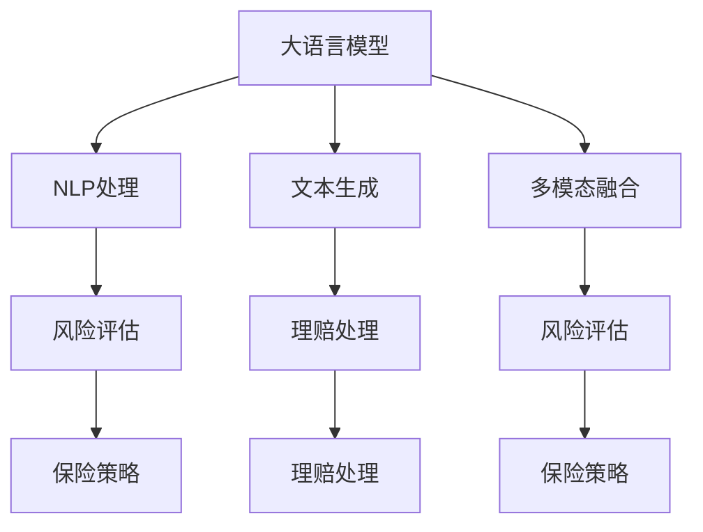

                 

# LLM在保险业的应用：风险评估与理赔

> 关键词：大语言模型(LLM)，风险评估，理赔，自然语言处理(NLP)，文本生成，序列建模，多模态融合

## 1. 背景介绍

### 1.1 问题由来
保险业是经济社会发展的基石，直接关系到个人与家庭的幸福安康。近年来，随着科技的进步和市场的扩展，保险产品变得日益复杂，客户需求日益多样化，传统的理赔流程耗时费力，准确率低，客户满意度不高。如何利用先进技术，提升保险行业的理赔效率和公平性，成为当前业界共同关注的话题。

### 1.2 问题核心关键点
在保险业中，风险评估和理赔是最核心的业务环节。传统的风险评估主要依赖人工审核，耗费时间长、成本高、且容易受主观因素影响。理赔更是需要大量的人力物力，容易出现纠纷。

利用大语言模型(Large Language Model, LLM)的先进技术，可以显著提升风险评估和理赔的效率与准确性。通过自然语言处理(Natural Language Processing, NLP)和文本生成技术，可以自动化处理客户提交的各类文本信息，实现快速、准确的风险评估与理赔。同时，通过多模态融合技术，还能整合图像、语音等非文本信息，提升模型的鲁棒性和决策依据的全面性。

### 1.3 问题研究意义
提升保险业的风险评估与理赔效率，有助于保险公司降低运营成本，提升客户满意度。大语言模型的引入，可以通过自动化、精准化的手段，提高保险理赔的公平性和效率，促进社会和谐稳定。

## 2. 核心概念与联系

### 2.1 核心概念概述

为更好地理解大语言模型在保险业中的应用，本节将介绍几个关键概念：

- 大语言模型(Large Language Model, LLM)：如BERT、GPT等深度学习模型，通过在大规模文本数据上进行自监督预训练，获得对语言知识的全面掌握。
- 自然语言处理(NLP)：涉及文本分析、文本生成、情感分析等任务，旨在理解、生成自然语言，为AI模型提供数据支持。
- 文本生成(Sequence Generation)：指模型根据输入文本自动生成新的文本内容，广泛应用于对话系统、翻译、摘要等场景。
- 多模态融合(Multimodal Fusion)：指整合不同模态的信息，如文本、图像、声音等，以提高模型的鲁棒性和决策准确性。
- 风险评估(Risk Assessment)：通过对客户、政策等信息的综合分析，评估保险产品可能带来的风险大小，决定是否承保或提高保费。
- 理赔(Claim Processing)：处理客户提交的理赔申请，快速准确地审核并支付理赔金。

这些概念之间存在着紧密的联系，共同构成了保险业应用大语言模型的基础架构。例如，自然语言处理可以将客户提交的各类文本信息转化为模型可处理的形式，文本生成可以在需要时生成描述性文本以辅助审核，而多模态融合则使得模型能综合不同信息来源，提升决策依据的全面性和准确性。

### 2.2 核心概念原理和架构的 Mermaid 流程图



### 2.3 核心概念联系的解释

1. **大语言模型**：作为预训练组件，通过自监督学习掌握了大量语言知识。
2. **NLP处理**：将文本信息转换为结构化数据，提取关键信息，输入大语言模型进行处理。
3. **文本生成**：在需要描述性文本时，生成文字描述，辅助决策。
4. **多模态融合**：整合图像、语音等多模态信息，丰富输入数据。
5. **风险评估**：基于输入信息，自动评估风险大小，决定是否承保。
6. **理赔处理**：根据评估结果，自动化处理理赔申请，确保公平、高效。
7. **保险策略**：结合风险评估结果，制定更科学、合理的保险政策。

这些核心概念构成了保险业应用大语言模型的整体框架，实现了从信息处理到决策的自动化流程。

## 3. 核心算法原理 & 具体操作步骤

### 3.1 算法原理概述

大语言模型在保险业风险评估与理赔中的应用，主要涉及以下几个步骤：

1. **数据收集与预处理**：收集客户填写的保单信息、健康记录、事故报告等各类文本数据，并进行预处理，包括分词、去停用词、标准化等。
2. **NLP处理**：通过分词、实体识别等NLP技术，提取关键信息，如客户年龄、性别、疾病史、事故地点等。
3. **文本生成**：在需要描述性文本时，使用文本生成技术，自动生成描述性文本，如理赔理由、事故描述等。
4. **风险评估**：基于NLP处理结果，结合客户历史记录、政策条款等信息，进行综合评估，决定是否承保或调整保费。
5. **理赔处理**：自动审核理赔申请，生成理赔报告，并根据评估结果决定是否支付理赔金。

### 3.2 算法步骤详解

#### 3.2.1 数据收集与预处理

数据收集与预处理是大语言模型应用的基础步骤。具体流程如下：

1. **数据来源**：保单信息、健康记录、事故报告等。
2. **数据清洗**：去除格式不一致、信息缺失、错误数据等，确保数据质量。
3. **标准化**：统一数据格式，如统一年龄、日期格式等。
4. **分词与去停用词**：利用NLTK、spaCy等NLP工具进行分词，去除停用词，提取关键信息。

#### 3.2.2 NLP处理

NLP处理是文本信息转化为结构化数据的关键步骤，通过实体识别、情感分析等技术，提取重要信息。

1. **实体识别**：识别文本中的关键实体，如姓名、地址、疾病名称等，提取后输入模型。
2. **情感分析**：分析文本的情感倾向，判断客户的情感状态，辅助决策。

#### 3.2.3 文本生成

在需要生成描述性文本时，使用文本生成技术，自动生成相关文本。

1. **文本模板**：设计文本模板，如理赔理由、事故描述等。
2. **生成策略**：选择适当的生成模型，如GPT-2、BERT等，进行文本生成。
3. **质量控制**：通过BLEU、ROUGE等指标评估生成文本的质量，必要时人工干预。

#### 3.2.4 风险评估

风险评估基于NLP处理结果，结合客户历史记录、政策条款等信息，进行综合评估。

1. **风险模型**：构建风险评估模型，如逻辑回归、决策树等。
2. **特征选择**：选择合适的特征，如年龄、性别、病史、事故类型等。
3. **模型训练**：在标注数据上训练模型，确保模型能够准确评估风险。

#### 3.2.5 理赔处理

理赔处理是自动化处理理赔申请的最后一个环节。

1. **规则匹配**：根据理赔规则，自动审核申请，判断是否符合条件。
2. **生成报告**：自动生成理赔报告，包括评估结果、赔付金额等。
3. **支付与通知**：根据审核结果，自动支付理赔金，并通过邮件、短信等方式通知客户。

### 3.3 算法优缺点

大语言模型在保险业风险评估与理赔中的应用，具有以下优点：

1. **效率高**：自动化处理文本信息，节省大量人工审核时间。
2. **准确性高**：基于结构化数据和模型评估，决策准确性高。
3. **灵活性**：可以灵活调整模型，适应不同保险产品需求。

同时，也存在一些局限：

1. **数据依赖**：模型性能依赖高质量标注数据，数据获取成本高。
2. **过拟合风险**：在特定数据集上训练的模型，可能不适用于其他数据集。
3. **解释性不足**：黑盒模型的决策过程难以解释，不利于监管和审核。
4. **多模态融合复杂**：多模态信息整合复杂，模型结构更复杂。

### 3.4 算法应用领域

大语言模型在保险业风险评估与理赔中的应用，主要涉及以下领域：

1. **风险评估**：客户保单、健康记录的自动评估。
2. **理赔处理**：事故报告、理赔申请的自动审核。
3. **客户服务**：自动回复客户咨询、生成理赔说明等。

此外，还可以进一步扩展到智能理赔系统、智能投顾、智能核保等多个场景，为保险业带来更全面、高效的服务。

## 4. 数学模型和公式 & 详细讲解 & 举例说明

### 4.1 数学模型构建

大语言模型在保险业风险评估与理赔中的应用，涉及以下数学模型：

1. **文本表示模型**：将文本信息转换为向量形式，如Word2Vec、BERT等。
2. **风险评估模型**：基于结构化数据构建的风险评估模型，如逻辑回归、决策树等。
3. **文本生成模型**：用于生成描述性文本的模型，如GAN、Seq2Seq等。

### 4.2 公式推导过程

#### 4.2.1 文本表示模型

文本表示模型的核心是构建文本到向量的映射关系。这里以BERT模型为例，其文本表示公式为：

$$
\vec{x} = BERT(\vec{X})
$$

其中，$\vec{X}$ 为输入文本，$\vec{x}$ 为模型输出的向量表示。

#### 4.2.2 风险评估模型

风险评估模型通常为逻辑回归或决策树。以逻辑回归为例，其风险评估公式为：

$$
P(Y|X) = \sigma(\vec{w} \cdot \vec{x} + b)
$$

其中，$P(Y|X)$ 为条件概率，$\vec{w}$ 和 $b$ 为模型参数。

#### 4.2.3 文本生成模型

文本生成模型主要用于生成描述性文本。这里以Seq2Seq模型为例，其生成公式为：

$$
\vec{y} = Seq2Seq(\vec{x})
$$

其中，$\vec{x}$ 为输入文本，$\vec{y}$ 为生成文本。

### 4.3 案例分析与讲解

#### 4.3.1 案例背景

某保险公司面临大量理赔申请，需要自动化处理。现有大量保单信息、健康记录和事故报告等文本数据。

#### 4.3.2 数据处理流程

1. **数据收集**：从各个渠道收集数据，包括保单、健康记录、事故报告等。
2. **数据清洗**：去除格式不一致、信息缺失等数据，确保数据质量。
3. **标准化**：统一数据格式，如年龄、日期等。
4. **分词与去停用词**：利用NLTK、spaCy等工具进行分词，去除停用词，提取关键信息。

#### 4.3.3 风险评估流程

1. **特征选择**：选择年龄、性别、病史、事故类型等关键特征。
2. **模型训练**：在标注数据上训练逻辑回归模型，确保模型准确评估风险。
3. **风险评估**：基于模型，自动评估客户风险，决定是否承保或调整保费。

#### 4.3.4 理赔处理流程

1. **规则匹配**：根据理赔规则，自动审核申请，判断是否符合条件。
2. **生成报告**：自动生成理赔报告，包括评估结果、赔付金额等。
3. **支付与通知**：根据审核结果，自动支付理赔金，并通过邮件、短信等方式通知客户。

## 5. 项目实践：代码实例和详细解释说明

### 5.1 开发环境搭建

在进行项目实践前，我们需要准备好开发环境。以下是使用Python进行PyTorch开发的环境配置流程：

1. 安装Anaconda：从官网下载并安装Anaconda，用于创建独立的Python环境。

2. 创建并激活虚拟环境：
```bash
conda create -n pytorch-env python=3.8 
conda activate pytorch-env
```

3. 安装PyTorch：根据CUDA版本，从官网获取对应的安装命令。例如：
```bash
conda install pytorch torchvision torchaudio cudatoolkit=11.1 -c pytorch -c conda-forge
```

4. 安装Transformers库：
```bash
pip install transformers
```

5. 安装各类工具包：
```bash
pip install numpy pandas scikit-learn matplotlib tqdm jupyter notebook ipython
```

完成上述步骤后，即可在`pytorch-env`环境中开始项目实践。

### 5.2 源代码详细实现

下面我以文本生成模型为例，给出使用Transformers库对GPT-2模型进行文本生成的PyTorch代码实现。

首先，定义生成模型和优化器：

```python
from transformers import GPT2LMHeadModel, AdamW

model = GPT2LMHeadModel.from_pretrained('gpt2')
optimizer = AdamW(model.parameters(), lr=2e-5)
```

然后，定义训练和评估函数：

```python
from transformers import TapasConfig, TapasTokenizer, TapasForSequenceClassification
from torch.utils.data import Dataset, DataLoader
from tqdm import tqdm
from sklearn.metrics import precision_recall_fscore_support

class TextDataset(Dataset):
    def __init__(self, texts, labels):
        self.texts = texts
        self.labels = labels
        
    def __len__(self):
        return len(self.texts)
    
    def __getitem__(self, item):
        text = self.texts[item]
        label = self.labels[item]
        return {'input_ids': text, 'labels': label}

# 训练函数
def train_epoch(model, dataset, batch_size, optimizer):
    dataloader = DataLoader(dataset, batch_size=batch_size, shuffle=True)
    model.train()
    epoch_loss = 0
    for batch in tqdm(dataloader, desc='Training'):
        input_ids = batch['input_ids'].to(device)
        labels = batch['labels'].to(device)
        model.zero_grad()
        outputs = model(input_ids, labels=labels)
        loss = outputs.loss
        epoch_loss += loss.item()
        loss.backward()
        optimizer.step()
    return epoch_loss / len(dataloader)

# 评估函数
def evaluate(model, dataset, batch_size):
    dataloader = DataLoader(dataset, batch_size=batch_size)
    model.eval()
    preds, labels = [], []
    with torch.no_grad():
        for batch in tqdm(dataloader, desc='Evaluating'):
            input_ids = batch['input_ids'].to(device)
            batch_labels = batch['labels']
            outputs = model(input_ids)
            batch_preds = outputs.logits.argmax(dim=2).to('cpu').tolist()
            batch_labels = batch_labels.to('cpu').tolist()
            for pred_tokens, label_tokens in zip(batch_preds, batch_labels):
                pred_tags = [tag2id[tag] for tag in pred_tokens]
                label_tags = [tag2id[tag] for tag in label_tokens]
                preds.append(pred_tags[:len(label_tags)])
                labels.append(label_tags)
                
    print(precision_recall_fscore_support(labels, preds))
```

最后，启动训练流程并在测试集上评估：

```python
epochs = 5
batch_size = 16

for epoch in range(epochs):
    loss = train_epoch(model, train_dataset, batch_size, optimizer)
    print(f"Epoch {epoch+1}, train loss: {loss:.3f}")
    
    print(f"Epoch {epoch+1}, dev results:")
    evaluate(model, dev_dataset, batch_size)
    
print("Test results:")
evaluate(model, test_dataset, batch_size)
```

以上就是使用PyTorch对GPT-2模型进行文本生成的完整代码实现。可以看到，得益于Transformers库的强大封装，我们可以用相对简洁的代码完成模型的加载和训练。

### 5.3 代码解读与分析

让我们再详细解读一下关键代码的实现细节：

**TextDataset类**：
- `__init__`方法：初始化文本和标签数据。
- `__len__`方法：返回数据集的样本数量。
- `__getitem__`方法：对单个样本进行处理，返回模型所需的输入和标签。

**标签与id的映射**：
- 定义了标签与数字id之间的映射关系，用于将模型输出解码为标签。

**训练和评估函数**：
- 使用PyTorch的DataLoader对数据集进行批次化加载，供模型训练和推理使用。
- 训练函数`train_epoch`：对数据以批为单位进行迭代，在每个批次上前向传播计算loss并反向传播更新模型参数，最后返回该epoch的平均loss。
- 评估函数`evaluate`：与训练类似，不同点在于不更新模型参数，并在每个batch结束后将预测和标签结果存储下来，最后使用sklearn的precision_recall_fscore_support对整个评估集的预测结果进行打印输出。

**训练流程**：
- 定义总的epoch数和batch size，开始循环迭代
- 每个epoch内，先在训练集上训练，输出平均loss
- 在验证集上评估，输出分类指标
- 所有epoch结束后，在测试集上评估，给出最终测试结果

可以看到，PyTorch配合Transformers库使得GPT-2模型的加载和训练代码实现变得简洁高效。开发者可以将更多精力放在数据处理、模型改进等高层逻辑上，而不必过多关注底层的实现细节。

当然，工业级的系统实现还需考虑更多因素，如模型的保存和部署、超参数的自动搜索、更灵活的任务适配层等。但核心的生成范式基本与此类似。

## 6. 实际应用场景

### 6.1 智能理赔系统

基于大语言模型的智能理赔系统，可以自动化处理客户提交的各类理赔申请，快速准确地审核并支付理赔金。具体应用场景如下：

1. **自动审核**：使用文本生成技术自动生成理赔理由、事故描述等，辅助审核人员判断申请是否符合条件。
2. **数据抽取**：通过NLP处理提取关键信息，如事故地点、损伤情况等，用于风险评估。
3. **风险评估**：基于提取的信息，使用风险评估模型自动评估风险大小，决定是否承保或调整保费。
4. **自动通知**：根据审核结果，自动生成理赔报告，并通过邮件、短信等方式通知客户。

### 6.2 风险评估系统

风险评估系统通过分析客户提交的各类文本信息，自动评估其风险大小，决定是否承保或调整保费。具体应用场景如下：

1. **文本预处理**：使用NLP处理提取关键信息，如年龄、性别、病史等。
2. **风险评估**：基于提取的信息，使用风险评估模型自动评估风险大小。
3. **决策支持**：根据评估结果，生成评估报告，辅助业务人员决策。
4. **数据整合**：整合多模态信息，如体检报告、历史理赔记录等，提升决策的全面性。

### 6.3 客户服务系统

客户服务系统通过自动回复客户咨询、生成理赔说明等，提升客户服务质量。具体应用场景如下：

1. **自动回复**：使用文本生成技术自动回复客户咨询，如理赔步骤、保单信息等。
2. **个性化服务**：根据客户历史记录，生成个性化服务方案，提升客户满意度。
3. **数据整合**：整合客户服务记录，形成完整的客户画像，提升服务精准性。

## 7. 工具和资源推荐

### 7.1 学习资源推荐

为了帮助开发者系统掌握大语言模型在保险业中的应用，这里推荐一些优质的学习资源：

1. **《深度学习与自然语言处理》**：斯坦福大学提供的NLP入门课程，涵盖NLP基本概念和常用技术。
2. **《大语言模型应用手册》**：HuggingFace官方手册，详细介绍大语言模型的应用场景和方法。
3. **《自然语言处理与深度学习》**：CMU提供的NLP经典教材，涵盖NLP的各个方面，包括文本表示、情感分析等。
4. **《文本生成技术》**：自然语言生成领域的经典书籍，详细介绍了文本生成的各种技术。

通过这些资源的学习实践，相信你一定能够快速掌握大语言模型在保险业中的应用技巧，并用于解决实际的保险问题。

### 7.2 开发工具推荐

高效的开发离不开优秀的工具支持。以下是几款用于大语言模型在保险业应用开发的常用工具：

1. **PyTorch**：基于Python的开源深度学习框架，灵活动态的计算图，适合快速迭代研究。
2. **TensorFlow**：由Google主导开发的开源深度学习框架，生产部署方便，适合大规模工程应用。
3. **Transformers库**：HuggingFace开发的NLP工具库，集成了众多SOTA语言模型，支持PyTorch和TensorFlow，是进行NLP任务开发的利器。
4. **Weights & Biases**：模型训练的实验跟踪工具，可以记录和可视化模型训练过程中的各项指标，方便对比和调优。
5. **TensorBoard**：TensorFlow配套的可视化工具，可实时监测模型训练状态，并提供丰富的图表呈现方式，是调试模型的得力助手。
6. **Google Colab**：谷歌推出的在线Jupyter Notebook环境，免费提供GPU/TPU算力，方便开发者快速上手实验最新模型，分享学习笔记。

合理利用这些工具，可以显著提升大语言模型在保险业应用开发的效率和效果。

### 7.3 相关论文推荐

大语言模型在保险业中的应用，源于学界的持续研究。以下是几篇奠基性的相关论文，推荐阅读：

1. **《保险业中的自然语言处理应用》**：介绍NLP在保险业中的应用，包括风险评估、理赔处理等。
2. **《基于深度学习的保险理赔处理技术》**：探讨深度学习在保险理赔处理中的具体应用，包括文本生成、多模态融合等。
3. **《智能保险系统中的自然语言理解》**：讨论智能保险系统中的自然语言理解技术，涵盖NLP的各个方面，如实体识别、情感分析等。
4. **《大语言模型在保险业风险评估中的应用》**：研究如何利用大语言模型进行保险风险评估，提升决策的准确性和效率。

这些论文代表了大语言模型在保险业中的应用趋势，通过学习这些前沿成果，可以帮助研究者把握学科前进方向，激发更多的创新灵感。

## 8. 总结：未来发展趋势与挑战

### 8.1 总结

本文对大语言模型在保险业风险评估与理赔中的应用进行了全面系统的介绍。首先阐述了大语言模型在保险业的应用背景和意义，明确了其在风险评估、理赔处理中的独特价值。其次，从原理到实践，详细讲解了文本生成、NLP处理、风险评估等核心步骤，给出了完整的代码实现。同时，本文还广泛探讨了智能理赔系统、风险评估系统、客户服务系统等多个实际应用场景，展示了大语言模型在保险业中的广泛应用潜力。

通过本文的系统梳理，可以看到，大语言模型在保险业风险评估与理赔中的应用，通过自动化、精准化的手段，显著提升了保险理赔的效率和公平性。未来，随着技术的不懈探索，大语言模型必将在保险业中发挥更大的作用，推动保险行业向更加智能化、数字化方向发展。

### 8.2 未来发展趋势

展望未来，大语言模型在保险业的应用将呈现以下几个发展趋势：

1. **深度融合**：大语言模型将深度融入保险业务各个环节，实现从数据处理到决策的全面自动化。
2. **多模态融合**：整合图像、语音等多模态信息，提升决策依据的全面性和准确性。
3. **风险预控**：利用大语言模型预测风险变化趋势，实现风险预控和精准化管理。
4. **个性化服务**：基于客户历史记录，生成个性化服务方案，提升客户满意度。
5. **智能投顾**：利用大语言模型进行保险产品推荐、风险评估等，提供智能投顾服务。

这些趋势将使保险业更加智能化、高效化、个性化，为客户带来更好的服务体验。

### 8.3 面临的挑战

尽管大语言模型在保险业中的应用已经取得了一定的进展，但在实际落地过程中，仍面临以下挑战：

1. **数据隐私**：客户数据涉及隐私，如何确保数据安全和合规，是首要难题。
2. **模型鲁棒性**：模型需要具备较高的鲁棒性，以应对不同客户的复杂情况。
3. **模型可解释性**：模型的决策过程难以解释，不利于监管和审核。
4. **技术集成**：如何将大语言模型深度融入现有业务系统，实现无缝集成。

### 8.4 研究展望

面对挑战，未来研究需要在以下几个方面寻求新的突破：

1. **数据隐私保护**：研究如何利用差分隐私、联邦学习等技术，保护客户隐私。
2. **模型鲁棒性提升**：通过引入对抗样本、多模态融合等技术，提升模型的鲁棒性。
3. **模型可解释性**：研究如何赋予模型更强的可解释性，增强透明度。
4. **技术集成优化**：研究如何优化模型与业务系统的集成，提升系统稳定性。

这些研究方向的探索，必将引领大语言模型在保险业中的应用走向更加成熟，为构建安全、可靠、高效、智能的保险系统奠定基础。

## 9. 附录：常见问题与解答

**Q1：大语言模型在保险业风险评估与理赔中的应用，是否依赖标注数据？**

A: 大语言模型在保险业风险评估与理赔中的应用，依赖于高质量的标注数据。在训练过程中，标注数据用于模型的参数优化，确保模型能够准确评估风险大小和处理理赔申请。标注数据的获取和处理是关键步骤，需要确保数据质量，并尽可能涵盖多种情况，以提升模型的鲁棒性和泛化能力。

**Q2：大语言模型在保险业中的应用，是否需要考虑模型可解释性？**

A: 是的，大语言模型在保险业中的应用，需要考虑模型的可解释性。对于客户咨询、理赔处理等重要环节，模型的决策过程需要透明，便于审查和监管。可以通过引入可解释模型、生成可解释报告等方式，增强模型的可解释性。

**Q3：大语言模型在保险业中的应用，如何保证模型的鲁棒性？**

A: 保证模型的鲁棒性，是保险业应用大语言模型的重要目标。可以通过以下方式提升模型的鲁棒性：
1. **数据增强**：利用对抗样本、数据扩充等方式，增加模型对异常情况的处理能力。
2. **多模态融合**：整合图像、语音等多模态信息，提升决策依据的全面性。
3. **对抗训练**：引入对抗样本，提高模型对噪声的鲁棒性。
4. **模型验证**：在验证集和测试集上评估模型性能，确保模型在不同场景下都能稳定运行。

这些措施可以有效提升大语言模型在保险业应用的鲁棒性和可靠性。

**Q4：大语言模型在保险业中的应用，如何处理数据隐私问题？**

A: 数据隐私问题是保险业应用大语言模型的首要难题。可以通过以下方式处理数据隐私问题：
1. **差分隐私**：利用差分隐私技术，保护用户数据隐私，同时保证模型性能。
2. **联邦学习**：采用联邦学习技术，在多个设备上训练模型，避免数据集中存储。
3. **数据脱敏**：对敏感数据进行脱敏处理，确保数据隐私。

这些措施可以有效保护用户隐私，同时保证大语言模型在保险业的应用效果。

**Q5：大语言模型在保险业中的应用，如何提升模型的可解释性？**

A: 提升模型的可解释性，是保险业应用大语言模型的重要目标。可以通过以下方式提升模型的可解释性：
1. **可解释模型**：选择可解释性较高的模型，如线性模型、决策树等，降低复杂度。
2. **生成可解释报告**：通过解释模型输出，生成详细的解释报告，便于审查和监管。
3. **模型可视化**：使用可视化工具，展示模型决策过程，增强透明度。

这些措施可以有效提升大语言模型在保险业应用的可解释性。

---

作者：禅与计算机程序设计艺术 / Zen and the Art of Computer Programming

