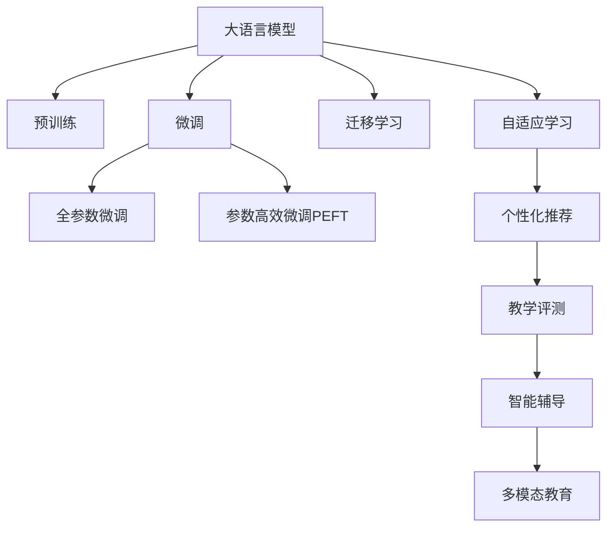

                 

# 大语言模型在教育领域的应用前景

## 1. 背景介绍

### 1.1 问题由来
近年来，随着人工智能技术的快速发展，大语言模型（Large Language Model, LLM）在教育领域的应用前景引起了广泛的关注。教育是一个知识传播和能力提升的重要环节，传统的教学方法往往依赖教师的经验和学生的参与，难以大规模、个性化地适应每个学生的学习需求。大语言模型通过预训练和微调，能够快速适应新的任务，并根据学生的输入进行实时反馈，从而实现个性化教育。

### 1.2 问题核心关键点
教育领域应用大语言模型的主要核心点包括：

- 个性化教育：大语言模型能够根据学生的个性化需求，提供量身定制的教育内容和反馈。
- 自适应学习：通过不断的交互和学习，模型能够自适应学生的学习进度和理解水平，提供个性化的学习路径。
- 知识检索：大语言模型能够快速检索出与学生问题相关的知识，帮助学生更快地找到答案。
- 智能辅导：提供24小时在线的智能辅导服务，解决学生在学习和生活中遇到的各种问题。
- 多模态教育：结合文本、图像、视频等多种模态信息，提供更加丰富、生动、直观的教育体验。

这些核心点共同构成了大语言模型在教育领域应用的重要方向。通过理解这些核心点，我们可以更好地把握大语言模型在教育中的潜在价值和挑战。

## 2. 核心概念与联系

### 2.1 核心概念概述

为了更好地理解大语言模型在教育领域的应用，本节将介绍几个密切相关的核心概念：

- 大语言模型(Large Language Model, LLM)：以自回归(如GPT)或自编码(如BERT)模型为代表的大规模预训练语言模型。通过在大规模无标签文本语料上进行预训练，学习通用的语言表示，具备强大的语言理解和生成能力。

- 预训练(Pre-training)：指在大规模无标签文本语料上，通过自监督学习任务训练通用语言模型的过程。常见的预训练任务包括言语建模、遮挡语言模型等。预训练使得模型学习到语言的通用表示。

- 微调(Fine-tuning)：指在预训练模型的基础上，使用下游任务的少量标注数据，通过有监督地训练来优化模型在该任务上的性能。通常只需要调整顶层分类器或解码器，并以较小的学习率更新全部或部分的模型参数。

- 迁移学习(Transfer Learning)：指将一个领域学习到的知识，迁移应用到另一个不同但相关的领域的学习范式。大模型的预训练-微调过程即是一种典型的迁移学习方式。

- 知识图谱(Knowledge Graph)：一种将实体和概念及其关系结构化的知识表示形式。用于辅助模型理解知识背景和语境信息，增强模型的推理能力。

- 自适应学习(Adaptive Learning)：根据学习者当前的知识水平和学习习惯，动态调整教学内容和方式的学习模式。

- 教学评测(Instruction)：指导学生进行有效学习的指令和评价方式。包括文本、语音、图像等多种形式。

- 个性化推荐(Recommendation)：根据用户的学习偏好和历史行为，推荐个性化的学习资源和内容。

这些核心概念之间的逻辑关系可以通过以下Mermaid流程图来展示：



这个流程图展示了大语言模型的核心概念及其之间的关系：

1. 大语言模型通过预训练获得基础能力。
2. 微调是对预训练模型进行任务特定的优化，可以分为全参数微调和参数高效微调（PEFT）。
3. 迁移学习是连接预训练模型与下游任务的桥梁，可以通过微调或PEFT来实现。
4. 自适应学习是动态调整教学内容和方式的学习模式。
5. 教学评测用于指导学生进行有效学习。
6. 个性化推荐结合用户学习偏好，推荐适合的学习资源。
7. 智能辅导提供24小时在线的智能辅助。
8. 多模态教育结合文本、图像、视频等多种模态信息，丰富教育体验。

这些核心概念共同构成了大语言模型在教育中的学习框架，使其能够更好地适应学生的学习需求，提升教育质量。通过理解这些核心概念，我们可以更好地把握大语言模型在教育中的潜力和应用方向。

## 3. 核心算法原理 & 具体操作步骤
### 3.1 算法原理概述

基于大语言模型的教育应用，本质上是一个有监督的细粒度迁移学习过程。其核心思想是：将预训练的大语言模型视作一个强大的"特征提取器"，通过在教育任务的数据上进行有监督地微调，使得模型输出能够匹配学生的学习反馈和需求，从而获得针对特定教育任务优化的模型。

形式化地，假设预训练模型为 $M_{\theta}$，其中 $\theta$ 为预训练得到的模型参数。给定教育任务 $T$ 的标注数据集 $D=\{(x_i, y_i)\}_{i=1}^N$，其中 $x_i$ 为学生的输入，$y_i$ 为教师对学生回答的反馈或评价，微调的目标是找到新的模型参数 $\hat{\theta}$，使得：

$$
\hat{\theta}=\mathop{\arg\min}_{\theta} \mathcal{L}(M_{\theta},D)
$$

其中 $\mathcal{L}$ 为针对任务 $T$ 设计的损失函数，用于衡量模型输出与真实标签之间的差异。常见的损失函数包括交叉熵损失、均方误差损失等。

通过梯度下降等优化算法，微调过程不断更新模型参数 $\theta$，最小化损失函数 $\mathcal{L}$，使得模型输出逼近真实标签。由于 $\theta$ 已经通过预训练获得了较好的初始化，因此即便在教育任务的少量标注数据上进行微调，也能较快收敛到理想的模型参数 $\hat{\theta}$。

### 3.2 算法步骤详解

基于大语言模型的教育微调一般包括以下几个关键步骤：

**Step 1: 准备预训练模型和数据集**
- 选择合适的预训练语言模型 $M_{\theta}$ 作为初始化参数，如 BERT、GPT 等。
- 准备教育任务 $T$ 的标注数据集 $D$，划分为训练集、验证集和测试集。一般要求标注数据与预训练数据的分布不要差异过大。

**Step 2: 添加任务适配层**
- 根据教育任务类型，在预训练模型顶层设计合适的输出层和损失函数。
- 对于分类任务，通常在顶层添加线性分类器和交叉熵损失函数。
- 对于生成任务，通常使用语言模型的解码器输出概率分布，并以负对数似然为损失函数。

**Step 3: 设置微调超参数**
- 选择合适的优化算法及其参数，如 AdamW、SGD 等，设置学习率、批大小、迭代轮数等。
- 设置正则化技术及强度，包括权重衰减、Dropout、Early Stopping等。
- 确定冻结预训练参数的策略，如仅微调顶层，或全部参数都参与微调。

**Step 4: 执行梯度训练**
- 将训练集数据分批次输入模型，前向传播计算损失函数。
- 反向传播计算参数梯度，根据设定的优化算法和学习率更新模型参数。
- 周期性在验证集上评估模型性能，根据性能指标决定是否触发 Early Stopping。
- 重复上述步骤直到满足预设的迭代轮数或 Early Stopping 条件。

**Step 5: 测试和部署**
- 在测试集上评估微调后模型 $M_{\hat{\theta}}$ 的性能，对比微调前后的精度提升。
- 使用微调后的模型对新样本进行推理预测，集成到实际的教育系统中。
- 持续收集新的数据，定期重新微调模型，以适应数据分布的变化。

以上是基于大语言模型的教育微调的一般流程。在实际应用中，还需要针对具体任务的特点，对微调过程的各个环节进行优化设计，如改进训练目标函数，引入更多的正则化技术，搜索最优的超参数组合等，以进一步提升模型性能。

### 3.3 算法优缺点

基于大语言模型的教育微调方法具有以下优点：
1. 简单高效。只需准备少量标注数据，即可对预训练模型进行快速适配，获得较大的性能提升。
2. 通用适用。适用于各种教育任务，包括阅读理解、写作指导、问题解答、知识检验等，设计简单的任务适配层即可实现微调。
3. 知识整合。大模型可以整合教师的经验知识、教材内容、测评标准等，形成更加全面、准确的知识库。
4. 互动性强。基于大语言模型的互动教学，能够实时响应用户的反馈，提供个性化的学习体验。

同时，该方法也存在一定的局限性：
1. 依赖标注数据。教育任务的标注数据准备往往需要较长时间，标注成本较高。
2. 模型鲁棒性有限。模型在面对复杂的教育场景时，可能无法完全理解学生的真实需求，造成误导。
3. 可解释性不足。教育微调模型的决策过程通常缺乏可解释性，难以对其推理逻辑进行分析和调试。
4. 伦理安全性。教育微调模型的输出可能涉及学生隐私、教学伦理等敏感问题，需要特别注意。

尽管存在这些局限性，但就目前而言，基于大语言模型的教育微调方法仍是大规模教育系统实现的重要手段。未来相关研究的重点在于如何进一步降低教育任务的标注依赖，提高模型的少样本学习和跨领域迁移能力，同时兼顾可解释性和伦理安全性等因素。

## 4. 数学模型和公式 & 详细讲解  
### 4.1 数学模型构建

本节将使用数学语言对基于大语言模型的教育微调过程进行更加严格的刻画。

记预训练语言模型为 $M_{\theta}$，其中 $\theta$ 为模型参数。假设教育任务 $T$ 的标注数据集为 $D=\{(x_i,y_i)\}_{i=1}^N$，其中 $x_i$ 为学生的输入，$y_i$ 为教师对学生回答的反馈或评价。

定义模型 $M_{\theta}$ 在数据样本 $(x,y)$ 上的损失函数为 $\ell(M_{\theta}(x),y)$，则在数据集 $D$ 上的经验风险为：

$$
\mathcal{L}(\theta) = \frac{1}{N} \sum_{i=1}^N \ell(M_{\theta}(x_i),y_i)
$$

微调的优化目标是最小化经验风险，即找到最优参数：

$$
\theta^* = \mathop{\arg\min}_{\theta} \mathcal{L}(\theta)
$$

在实践中，我们通常使用基于梯度的优化算法（如SGD、Adam等）来近似求解上述最优化问题。设 $\eta$ 为学习率，$\lambda$ 为正则化系数，则参数的更新公式为：

$$
\theta \leftarrow \theta - \eta \nabla_{\theta}\mathcal{L}(\theta) - \eta\lambda\theta
$$

其中 $\nabla_{\theta}\mathcal{L}(\theta)$ 为损失函数对参数 $\theta$ 的梯度，可通过反向传播算法高效计算。

### 4.2 公式推导过程

以下我们以阅读理解任务为例，推导交叉熵损失函数及其梯度的计算公式。

假设模型 $M_{\theta}$ 在输入 $x$ 上的输出为 $\hat{y}=M_{\theta}(x) \in [0,1]$，表示学生回答的正确概率。真实标签 $y \in \{0,1\}$。则二分类交叉熵损失函数定义为：

$$
\ell(M_{\theta}(x),y) = -[y\log \hat{y} + (1-y)\log (1-\hat{y})]
$$

将其代入经验风险公式，得：

$$
\mathcal{L}(\theta) = -\frac{1}{N}\sum_{i=1}^N [y_i\log M_{\theta}(x_i)+(1-y_i)\log(1-M_{\theta}(x_i))]
$$

根据链式法则，损失函数对参数 $\theta_k$ 的梯度为：

$$
\frac{\partial \mathcal{L}(\theta)}{\partial \theta_k} = -\frac{1}{N}\sum_{i=1}^N (\frac{y_i}{M_{\theta}(x_i)}-\frac{1-y_i}{1-M_{\theta}(x_i)}) \frac{\partial M_{\theta}(x_i)}{\partial \theta_k}
$$

其中 $\frac{\partial M_{\theta}(x_i)}{\partial \theta_k}$ 可进一步递归展开，利用自动微分技术完成计算。

在得到损失函数的梯度后，即可带入参数更新公式，完成模型的迭代优化。重复上述过程直至收敛，最终得到适应教育任务的最优模型参数 $\theta^*$。

## 5. 项目实践：代码实例和详细解释说明
### 5.1 开发环境搭建

在进行教育应用开发前，我们需要准备好开发环境。以下是使用Python进行PyTorch开发的环境配置流程：

1. 安装Anaconda：从官网下载并安装Anaconda，用于创建独立的Python环境。

2. 创建并激活虚拟环境：
```bash
conda create -n pytorch-env python=3.8 
conda activate pytorch-env
```

3. 安装PyTorch：根据CUDA版本，从官网获取对应的安装命令。例如：
```bash
conda install pytorch torchvision torchaudio cudatoolkit=11.1 -c pytorch -c conda-forge
```

4. 安装Transformers库：
```bash
pip install transformers
```

5. 安装各类工具包：
```bash
pip install numpy pandas scikit-learn matplotlib tqdm jupyter notebook ipython
```

完成上述步骤后，即可在`pytorch-env`环境中开始教育应用实践。

### 5.2 源代码详细实现

下面我们以阅读理解任务为例，给出使用Transformers库对BERT模型进行教育微调的PyTorch代码实现。

首先，定义阅读理解任务的输入输出格式：

```python
from transformers import BertTokenizer
from torch.utils.data import Dataset
import torch

class ReadingComprehensionDataset(Dataset):
    def __init__(self, passages, questions, answers, tokenizer, max_len=128):
        self.passages = passages
        self.questions = questions
        self.answers = answers
        self.tokenizer = tokenizer
        self.max_len = max_len
        
    def __len__(self):
        return len(self.questions)
    
    def __getitem__(self, item):
        passage = self.passages[item]
        question = self.questions[item]
        answer = self.answers[item]
        
        encoding = self.tokenizer(passage, question, return_tensors='pt', max_length=self.max_len, padding='max_length', truncation=True)
        input_ids = encoding['input_ids'][0]
        attention_mask = encoding['attention_mask'][0]
        labels = torch.tensor([answer2id[answer]], dtype=torch.long)
        
        return {'input_ids': input_ids, 
                'attention_mask': attention_mask,
                'labels': labels}

# 答案与id的映射
answer2id = {'correct': 0, 'incorrect': 1}
id2answer = {v: k for k, v in answer2id.items()}
```

然后，定义模型和优化器：

```python
from transformers import BertForQuestionAnswering, AdamW

model = BertForQuestionAnswering.from_pretrained('bert-base-cased', num_labels=2)

optimizer = AdamW(model.parameters(), lr=2e-5)
```

接着，定义训练和评估函数：

```python
from torch.utils.data import DataLoader
from tqdm import tqdm
from sklearn.metrics import accuracy_score

device = torch.device('cuda') if torch.cuda.is_available() else torch.device('cpu')
model.to(device)

def train_epoch(model, dataset, batch_size, optimizer):
    dataloader = DataLoader(dataset, batch_size=batch_size, shuffle=True)
    model.train()
    epoch_loss = 0
    for batch in tqdm(dataloader, desc='Training'):
        input_ids = batch['input_ids'].to(device)
        attention_mask = batch['attention_mask'].to(device)
        labels = batch['labels'].to(device)
        model.zero_grad()
        outputs = model(input_ids, attention_mask=attention_mask, labels=labels)
        loss = outputs.loss
        epoch_loss += loss.item()
        loss.backward()
        optimizer.step()
    return epoch_loss / len(dataloader)

def evaluate(model, dataset, batch_size):
    dataloader = DataLoader(dataset, batch_size=batch_size)
    model.eval()
    preds, labels = [], []
    with torch.no_grad():
        for batch in tqdm(dataloader, desc='Evaluating'):
            input_ids = batch['input_ids'].to(device)
            attention_mask = batch['attention_mask'].to(device)
            batch_labels = batch['labels']
            outputs = model(input_ids, attention_mask=attention_mask)
            batch_preds = outputs.logits.argmax(dim=2).to('cpu').tolist()
            batch_labels = batch_labels.to('cpu').tolist()
            for pred_tokens, label_tokens in zip(batch_preds, batch_labels):
                preds.append(pred_tokens[0])
                labels.append(label_tokens[0])
                
    print("Accuracy:", accuracy_score(labels, preds))
```

最后，启动训练流程并在测试集上评估：

```python
epochs = 5
batch_size = 16

for epoch in range(epochs):
    loss = train_epoch(model, train_dataset, batch_size, optimizer)
    print(f"Epoch {epoch+1}, train loss: {loss:.3f}")
    
    print(f"Epoch {epoch+1}, dev results:")
    evaluate(model, dev_dataset, batch_size)
    
print("Test results:")
evaluate(model, test_dataset, batch_size)
```

以上就是使用PyTorch对BERT进行阅读理解任务教育微调的完整代码实现。可以看到，得益于Transformers库的强大封装，我们可以用相对简洁的代码完成BERT模型的加载和微调。

### 5.3 代码解读与分析

让我们再详细解读一下关键代码的实现细节：

**ReadingComprehensionDataset类**：
- `__init__`方法：初始化输入、问题和答案，并定义分词器等关键组件。
- `__len__`方法：返回数据集的样本数量。
- `__getitem__`方法：对单个样本进行处理，将输入和问题输入编码为token ids，将答案编码为数字，并对其进行定长padding，最终返回模型所需的输入。

**answer2id和id2answer字典**：
- 定义了答案与数字id之间的映射关系，用于将预测结果解码回真实答案。

**训练和评估函数**：
- 使用PyTorch的DataLoader对数据集进行批次化加载，供模型训练和推理使用。
- 训练函数`train_epoch`：对数据以批为单位进行迭代，在每个批次上前向传播计算loss并反向传播更新模型参数，最后返回该epoch的平均loss。
- 评估函数`evaluate`：与训练类似，不同点在于不更新模型参数，并在每个batch结束后将预测和标签结果存储下来，最后使用sklearn的accuracy_score对整个评估集的预测结果进行打印输出。

**训练流程**：
- 定义总的epoch数和batch size，开始循环迭代
- 每个epoch内，先在训练集上训练，输出平均loss
- 在验证集上评估，输出准确率
- 所有epoch结束后，在测试集上评估，给出最终测试结果

可以看到，PyTorch配合Transformers库使得BERT微调的代码实现变得简洁高效。开发者可以将更多精力放在数据处理、模型改进等高层逻辑上，而不必过多关注底层的实现细节。

当然，工业级的系统实现还需考虑更多因素，如模型的保存和部署、超参数的自动搜索、更灵活的任务适配层等。但核心的微调范式基本与此类似。

## 6. 实际应用场景
### 6.1 个性化学习平台

基于大语言模型的教育应用，可以构建个性化的学习平台，为学生提供量身定制的学习内容和资源。传统教育系统往往采用一刀切的模式，难以适应不同学生的需求。而个性化学习平台可以通过大语言模型，根据学生的学习进度、兴趣、知识背景等信息，动态生成个性化的学习路径和推荐内容，从而提升学习效果。

在技术实现上，可以收集学生的学习历史数据，如学习时间、完成习题情况、阅读文章等，构建学生画像。在此基础上对预训练模型进行微调，使其能够根据学生画像生成个性化的学习推荐。同时，利用大语言模型的多模态教育能力，结合文本、图像、视频等多种形式，提供更加丰富、生动的学习体验。

### 6.2 智能教学助手

智能教学助手是一个24小时在线的教育辅助工具，可以回答学生在学习过程中遇到的各种问题。通过大语言模型，智能教学助手能够快速理解和解答学生的提问，提供及时的反馈和建议。

在应用实践中，可以构建一个多轮问答系统，通过大语言模型对学生的自然语言提问进行理解，并从知识库中检索出最相关的答案进行回复。同时，利用多模态信息融合技术，将文本、图像、视频等多种形式的信息进行整合，提供更加直观、生动的学习辅助。

### 6.3 智能评测系统

智能评测系统是一个自动化的教育评测工具，可以实时监控学生的学习情况，评估其学习效果，并提供改进建议。通过大语言模型，智能评测系统能够快速理解学生的答案，并对其进行评分和评价。

在应用实践中，可以将学生的作业、考试、项目等作为输入，利用大语言模型对答案进行解析，并根据解析结果给出评分和反馈。同时，智能评测系统可以定期生成学习报告，帮助学生了解自己的学习进度和存在的问题，及时调整学习策略。

### 6.4 未来应用展望

随着大语言模型和教育微调技术的不断发展，基于微调范式将在教育领域得到更广泛的应用，为教育体系带来变革性影响。

在智慧校园建设中，大语言模型可以为校园内的各项设施和服务提供智能化支持，如智能教室、智能图书馆、智能考试等，提升校园管理的自动化和智能化水平。

在职业培训和在线教育中，大语言模型可以帮助学员更好地理解和掌握专业知识，提供个性化的学习建议和辅导，促进职业技能提升。

在特殊教育中，大语言模型可以针对不同学生的认知特点，提供针对性的教学内容，帮助有特殊需求的学生更好地融入教育系统。

此外，在教育数据治理、教育资源管理、教育公平等多个领域，大语言模型微调技术也将不断涌现，为教育领域的数字化转型和智能化升级提供新的动力。相信随着技术的日益成熟，微调方法将成为教育系统实现智能化、个性化、自适应学习的重要手段，推动教育质量的全面提升。

## 7. 工具和资源推荐
### 7.1 学习资源推荐

为了帮助开发者系统掌握大语言模型教育微调的理论基础和实践技巧，这里推荐一些优质的学习资源：

1. 《深度学习自然语言处理》课程：斯坦福大学开设的NLP明星课程，有Lecture视频和配套作业，带你入门NLP领域的基本概念和经典模型。

2. 《Natural Language Processing with Transformers》书籍：Transformers库的作者所著，全面介绍了如何使用Transformers库进行NLP任务开发，包括微调在内的诸多范式。

3. 《Transformers for Natural Language Processing》书籍：深入介绍大语言模型和微调技术的最新进展，包括大模型结构、优化算法、应用场景等。

4. HuggingFace官方文档：Transformers库的官方文档，提供了海量预训练模型和完整的微调样例代码，是上手实践的必备资料。

5. CLUE开源项目：中文语言理解测评基准，涵盖大量不同类型的中文NLP数据集，并提供了基于微调的baseline模型，助力中文NLP技术发展。

通过对这些资源的学习实践，相信你一定能够快速掌握大语言模型教育微调的精髓，并用于解决实际的NLP问题。
###  7.2 开发工具推荐

高效的开发离不开优秀的工具支持。以下是几款用于大语言模型教育微调开发的常用工具：

1. PyTorch：基于Python的开源深度学习框架，灵活动态的计算图，适合快速迭代研究。大部分预训练语言模型都有PyTorch版本的实现。

2. TensorFlow：由Google主导开发的开源深度学习框架，生产部署方便，适合大规模工程应用。同样有丰富的预训练语言模型资源。

3. Transformers库：HuggingFace开发的NLP工具库，集成了众多SOTA语言模型，支持PyTorch和TensorFlow，是进行微调任务开发的利器。

4. Weights & Biases：模型训练的实验跟踪工具，可以记录和可视化模型训练过程中的各项指标，方便对比和调优。与主流深度学习框架无缝集成。

5. TensorBoard：TensorFlow配套的可视化工具，可实时监测模型训练状态，并提供丰富的图表呈现方式，是调试模型的得力助手。

6. Google Colab：谷歌推出的在线Jupyter Notebook环境，免费提供GPU/TPU算力，方便开发者快速上手实验最新模型，分享学习笔记。

合理利用这些工具，可以显著提升大语言模型教育微调任务的开发效率，加快创新迭代的步伐。

### 7.3 相关论文推荐

大语言模型和教育微调技术的发展源于学界的持续研究。以下是几篇奠基性的相关论文，推荐阅读：

1. Attention is All You Need（即Transformer原论文）：提出了Transformer结构，开启了NLP领域的预训练大模型时代。

2. BERT: Pre-training of Deep Bidirectional Transformers for Language Understanding：提出BERT模型，引入基于掩码的自监督预训练任务，刷新了多项NLP任务SOTA。

3. Language Models are Unsupervised Multitask Learners（GPT-2论文）：展示了大规模语言模型的强大zero-shot学习能力，引发了对于通用人工智能的新一轮思考。

4. Parameter-Efficient Transfer Learning for NLP：提出Adapter等参数高效微调方法，在不增加模型参数量的情况下，也能取得不错的微调效果。

5. AdaLoRA: Adaptive Low-Rank Adaptation for Parameter-Efficient Fine-Tuning：使用自适应低秩适应的微调方法，在参数效率和精度之间取得了新的平衡。

这些论文代表了大语言模型教育微调技术的发展脉络。通过学习这些前沿成果，可以帮助研究者把握学科前进方向，激发更多的创新灵感。

## 8. 总结：未来发展趋势与挑战
### 8.1 总结

本文对基于大语言模型的教育微调方法进行了全面系统的介绍。首先阐述了大语言模型和微调技术在教育领域的研究背景和意义，明确了微调在提供个性化教育、自适应学习、知识检索、智能辅导等多方面的独特价值。其次，从原理到实践，详细讲解了教育微调的数学原理和关键步骤，给出了教育应用开发的完整代码实例。同时，本文还广泛探讨了教育微调方法在个性化学习平台、智能教学助手、智能评测系统等多个教育场景中的应用前景，展示了微调范式的巨大潜力。此外，本文精选了教育微调技术的各类学习资源，力求为读者提供全方位的技术指引。

通过本文的系统梳理，可以看到，基于大语言模型的教育微调方法正在成为教育技术实现智能化、个性化、自适应学习的重要手段。得益于大模型对多模态信息的整合能力，教育微调模型能够提供更加丰富、生动的学习体验，从而全面提升教育质量。

### 8.2 未来发展趋势

展望未来，大语言模型教育微调技术将呈现以下几个发展趋势：

1. 模型规模持续增大。随着算力成本的下降和数据规模的扩张，预训练语言模型的参数量还将持续增长。超大规模语言模型蕴含的丰富语言知识，有望支撑更加复杂多变的教育任务微调。

2. 教育任务多样化。随着教育应用场景的不断拓展，教育微调模型将需要涵盖更多类型的教育任务，如游戏化学习、虚拟现实、社交互动等，提供更加多元化的学习体验。

3. 自适应学习算法优化。基于自适应学习的方法，将进一步提升模型的个性化程度，使得教育微调模型能够更精确地根据学生的需求和反馈，调整学习路径和内容。

4. 知识图谱和专家知识的整合。教育微调模型将更好地利用知识图谱和专家知识库，辅助模型理解知识背景和语境信息，增强推理能力。

5. 多模态教育技术的融合。未来的教育微调模型将更加注重多模态信息的融合，提供更加生动、直观的教育体验，如结合虚拟现实技术，提供沉浸式学习环境。

6. 跨领域迁移能力的提升。通过更高效的迁移学习方法，大语言模型教育微调模型将能够在更广泛的领域和任务中，快速适应新的教育需求，提供更高效、全面的教育支持。

以上趋势凸显了大语言模型教育微调技术的广阔前景。这些方向的探索发展，必将进一步提升教育系统的性能和应用范围，为教育体系的数字化转型和智能化升级提供新的动力。

### 8.3 面临的挑战

尽管大语言模型教育微调技术已经取得了瞩目成就，但在迈向更加智能化、普适化应用的过程中，它仍面临着诸多挑战：

1. 标注成本瓶颈。虽然教育任务的标注数据准备往往需要较长时间，标注成本较高。如何进一步降低教育任务的标注依赖，将是一大难题。

2. 模型鲁棒性不足。模型在面对复杂的教育场景时，可能无法完全理解学生的真实需求，造成误导。如何提高教育微调模型的鲁棒性，避免灾难性遗忘，还需要更多理论和实践的积累。

3. 可解释性不足。教育微调模型的决策过程通常缺乏可解释性，难以对其推理逻辑进行分析和调试。对于高风险应用，算法的可解释性和可审计性尤为重要。

4. 伦理安全性。教育微调模型的输出可能涉及学生隐私、教学伦理等敏感问题，需要特别注意。

5. 资源效率。大规模语言模型虽然精度高，但在实际部署时往往面临推理速度慢、内存占用大等效率问题。如何在保证性能的同时，简化模型结构，提升推理速度，优化资源占用，将是重要的优化方向。

6. 知识整合能力不足。现有的教育微调模型往往局限于知识库中已知内容，难以灵活吸收和运用更广泛的先验知识。如何让教育微调过程更好地与外部知识库、规则库等专家知识结合，形成更加全面、准确的信息整合能力，还有很大的想象空间。

正视教育微调面临的这些挑战，积极应对并寻求突破，将是大语言模型教育微调走向成熟的必由之路。相信随着学界和产业界的共同努力，这些挑战终将一一被克服，大语言模型教育微调必将在构建智能教育体系中扮演越来越重要的角色。

### 8.4 研究展望

面对大语言模型教育微调所面临的种种挑战，未来的研究需要在以下几个方面寻求新的突破：

1. 探索无监督和半监督教育微调方法。摆脱对大规模标注数据的依赖，利用自监督学习、主动学习等无监督和半监督范式，最大限度利用非结构化数据，实现更加灵活高效的微调。

2. 研究参数高效和计算高效的微调范式。开发更加参数高效的微调方法，在固定大部分预训练参数的同时，只更新极少量的任务相关参数。同时优化教育微调模型的计算图，减少前向传播和反向传播的资源消耗，实现更加轻量级、实时性的部署。

3. 融合因果和对比学习范式。通过引入因果推断和对比学习思想，增强教育微调模型建立稳定因果关系的能力，学习更加普适、鲁棒的语言表征，从而提升模型泛化性和抗干扰能力。

4. 引入更多先验知识。将符号化的先验知识，如知识图谱、逻辑规则等，与神经网络模型进行巧妙融合，引导教育微调过程学习更准确、合理的语言模型。同时加强不同模态数据的整合，实现视觉、语音等多模态信息与文本信息的协同建模。

5. 结合因果分析和博弈论工具。将因果分析方法引入教育微调模型，识别出模型决策的关键特征，增强输出解释的因果性和逻辑性。借助博弈论工具刻画人机交互过程，主动探索并规避模型的脆弱点，提高系统稳定性。

6. 纳入伦理道德约束。在教育微调模型的训练目标中引入伦理导向的评估指标，过滤和惩罚有偏见、有害的输出倾向。同时加强人工干预和审核，建立模型行为的监管机制，确保输出符合人类价值观和伦理道德。

这些研究方向的探索，必将引领大语言模型教育微调技术迈向更高的台阶，为构建安全、可靠、可解释、可控的智能教育系统铺平道路。面向未来，大语言模型教育微调技术还需要与其他人工智能技术进行更深入的融合，如知识表示、因果推理、强化学习等，多路径协同发力，共同推动教育质量的全面提升。只有勇于创新、敢于突破，才能不断拓展教育微调模型的边界，让智能技术更好地造福教育事业。

## 9. 附录：常见问题与解答

**Q1：教育微调是否适用于所有教育任务？**

A: 教育微调在大多数教育任务上都能取得不错的效果，特别是对于数据量较小的任务。但对于一些特定领域的任务，如医学、法律等，仅仅依靠通用语料预训练的模型可能难以很好地适应。此时需要在特定领域语料上进一步预训练，再进行微调，才能获得理想效果。此外，对于一些需要时效性、个性化很强的任务，如对话、推荐等，微调方法也需要针对性的改进优化。

**Q2：教育微调过程中如何选择合适的学习率？**

A: 教育微调的学习率一般要比预训练时小1-2个数量级，如果使用过大的学习率，容易破坏预训练权重，导致过拟合。一般建议从1e-5开始调参，逐步减小学习率，直至收敛。也可以使用warmup策略，在开始阶段使用较小的学习率，再逐渐过渡到预设值。需要注意的是，不同的优化器(如AdamW、Adafactor等)以及不同的学习率调度策略，可能需要设置不同的学习率阈值。

**Q3：采用大模型教育微调时会面临哪些资源瓶颈？**

A: 目前主流的预训练大模型动辄以亿计的参数规模，对算力、内存、存储都提出了很高的要求。GPU/TPU等高性能设备是必不可少的，但即便如此，超大批次的训练和推理也可能遇到显存不足的问题。因此需要采用一些资源优化技术，如梯度积累、混合精度训练、模型并行等，来突破硬件瓶颈。同时，模型的存储和读取也可能占用大量时间和空间，需要采用模型压缩、稀疏化存储等方法进行优化。

**Q4：如何缓解教育微调过程中的过拟合问题？**

A: 过拟合是教育微调面临的主要挑战，尤其是在标注数据不足的情况下。常见的缓解策略包括：
1. 数据增强：通过回译、近义替换等方式扩充训练集
2. 正则化：使用L2正则、Dropout、Early Stopping等避免过拟合
3. 对抗训练：引入对抗样本，提高模型鲁棒性
4. 参数高效微调：只调整少量参数(如Adapter、Prefix等)，减小过拟合风险
5. 多模型集成：训练多个教育微调模型，取平均输出，抑制过拟合

这些策略往往需要根据具体任务和数据特点进行灵活组合。只有在数据、模型、训练、推理等各环节进行全面优化，才能最大限度地发挥教育微调的威力。

**Q5：教育微调模型在落地部署时需要注意哪些问题？**

A: 将教育微调模型转化为实际应用，还需要考虑以下因素：
1. 模型裁剪：去除不必要的层和参数，减小模型尺寸，加快推理速度
2. 量化加速：将浮点模型转为定点模型，压缩存储空间，提高计算效率
3. 服务化封装：将模型封装为标准化服务接口，便于集成调用
4. 弹性伸缩：根据请求流量动态调整资源配置，平衡服务质量和成本
5. 监控告警：实时采集系统指标，设置异常告警阈值，确保服务稳定性
6. 安全防护：采用访问鉴权、数据脱敏等措施，保障数据和模型安全

教育微调模型为教育系统提供了智能化支持，但如何在保证性能的同时，提升系统的稳定性、安全性和可扩展性，还需要在工程实践中不断打磨。唯有从数据、算法、工程、业务等多个维度协同发力，才能真正实现教育技术的落地应用。总之，教育微调需要开发者根据具体任务，不断迭代和优化模型、数据和算法，方能得到理想的效果。

---

作者：禅与计算机程序设计艺术 / Zen and the Art of Computer Programming

