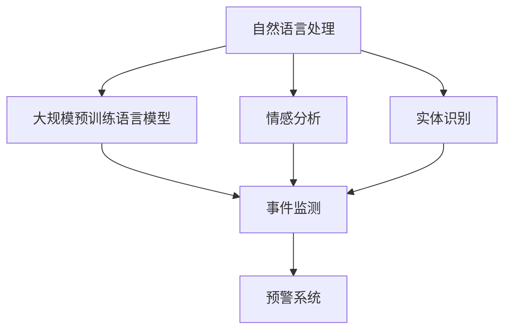

                 

## 1. 背景介绍

随着信息技术的发展，互联网已成为公众表达诉求、分享信息和监督政府的主要平台。然而，海量信息爆炸的同时，也带来了舆情信息的快速传播和深度挖掘的挑战。如何从庞大的网络文本中自动识别舆情热点、分析情感倾向、识别敏感话题，并及时应对负面舆情，是当前互联网内容治理面临的重要课题。

智能舆情监测系统，利用人工智能技术，通过对网络文本的自动分析和情感判断，能够实时监测舆情变化，预测潜在风险，为政府、企业、社会组织提供决策支持。在技术实现上，主要采用深度学习尤其是自然语言处理(NLP)技术。近年来，大规模预训练语言模型(LLM)在NLP领域取得了显著进展，尤其在舆情监测领域展现出了巨大潜力。

## 2. 核心概念与联系

### 2.1 核心概念概述

在智能舆情监测系统中，LLM主要通过以下核心概念进行实现：

- 自然语言处理(NLP)：利用计算机技术自动分析和理解人类语言，涉及文本清洗、分词、词性标注、句法分析、情感分析、实体识别等多个子任务。
- 大规模预训练语言模型(LLM)：如BERT、GPT等模型，通过在大规模语料上进行自监督学习，获得通用的语言表示能力。
- 情感分析(Sentiment Analysis)：自动判定文本的情感倾向，如正面、负面或中性。
- 实体识别(Named Entity Recognition, NER)：自动识别文本中的人名、地名、机构名等实体。
- 事件监测(Event Monitoring)：自动检测并追踪网络文本中提及的事件及其变化趋势。
- 预警系统：在识别到负面舆情或敏感话题时，自动触发预警机制，上报给相关部门。

这些核心概念之间的逻辑关系可以通过以下Mermaid流程图来展示：



### 2.2 核心概念原理和架构

自然语言处理的核心是将自然语言文本转换为计算机可处理的向量表示，从而实现文本信息的自动理解和处理。大规模预训练语言模型通过在大规模语料上进行自监督学习，学习通用的语言表示，可以显著提升NLP任务的性能。

情感分析通过使用LSTM、CNN、Transformer等模型，在文本向量上做分类预测，实现对文本情感的自动判定。实体识别则通过在文本中识别出特定实体，并进行分类或关系抽取，帮助系统理解和分析文本内容。

事件监测在情感分析和实体识别的基础上，构建事件图谱，通过时间序列分析和网络结构分析，识别出文本中提及的事件及其变化趋势，从而进行预警。

预警系统将事件监测的结果通过通知、邮件、警报等方式反馈给相关部门，使其能够及时采取应对措施，防止负面舆情扩散。

## 3. 核心算法原理 & 具体操作步骤

### 3.1 算法原理概述

智能舆情监测系统采用基于监督学习的大语言模型微调方法，对大规模预训练模型进行微调，使其能够适应特定舆情监测任务的需求。具体的算法流程如下：

1. **数据准备**：收集包含舆情信息的文本数据，并对其进行标注，包括情感类别、实体类别和事件信息等。

2. **模型选择**：选择合适的预训练语言模型，如BERT、GPT等。

3. **微调训练**：对预训练模型进行微调，使其能够对文本进行情感分析、实体识别和事件监测等任务。

4. **部署应用**：将微调后的模型部署到生产环境中，实时监测网络舆情，自动进行情感分析和事件预警。

### 3.2 算法步骤详解

#### 3.2.1 数据预处理

对于舆情监测数据，首先需要进行预处理，包括文本清洗、分词、词性标注等。对于情感分析和实体识别任务，还需要标注出情感类别和实体类别。以下是一个示例代码：

```python
from transformers import BertTokenizer, BertForTokenClassification, BertForMaskedLM

# 初始化BERT分词器和模型
tokenizer = BertTokenizer.from_pretrained('bert-base-cased')
model = BertForTokenClassification.from_pretrained('bert-base-cased', num_labels=num_labels)

# 分词并转化为token ids
input_ids = tokenizer.encode_plus(text, return_tensors='pt')['input_ids']
```

#### 3.2.2 模型微调

接下来，将预处理后的文本输入到模型中，进行微调训练。微调时，需要设置合适的学习率、批次大小等参数，避免过拟合。以下是一个示例代码：

```python
from transformers import AdamW

# 设置优化器和超参数
optimizer = AdamW(model.parameters(), lr=learning_rate)
epochs = 3

# 微调训练
for epoch in range(epochs):
    for batch in train_loader:
        input_ids, attention_mask, labels = batch

        # 前向传播
        outputs = model(input_ids, attention_mask=attention_mask, labels=labels)
        loss = outputs.loss

        # 反向传播和优化
        loss.backward()
        optimizer.step()

    # 在验证集上评估模型性能
    evaluate_model(model, val_loader)
```

#### 3.2.3 部署应用

微调完成后，将模型部署到生产环境中，使用定期抓取的网络文本数据进行实时监测。以下是一个示例代码：

```python
# 部署模型
model.eval()
device = torch.device('cuda') if torch.cuda.is_available() else torch.device('cpu')
model.to(device)

# 实时监测
while True:
    text = get_text_from_network()
    input_ids = tokenizer.encode_plus(text, return_tensors='pt')['input_ids']
    with torch.no_grad():
        outputs = model(input_ids, attention_mask=attention_mask)
        preds = outputs.logits.argmax(dim=2).to('cpu').tolist()

    # 分析文本并预警
    analyze_text(text, preds)
```

### 3.3 算法优缺点

基于监督学习的大语言模型微调方法在舆情监测领域具有以下优点：

- 数据需求低：微调方法对标注数据的需求较少，可以充分利用无标签的文本数据。
- 泛化能力强：预训练模型能够对多种任务进行微调，适应性强。
- 精度高：利用大模型的知识表示能力，能够在较少的标注样本下获得较高的性能。

同时，也存在一些缺点：

- 计算资源需求高：预训练模型的参数量大，需要较高的计算资源。
- 模型可解释性差：黑盒模型的决策过程难以解释，对某些应用场景可能不适用。
- 更新周期长：微调模型需要定期重新训练，更新周期较长。

### 3.4 算法应用领域

基于大语言模型的舆情监测方法，已经在多个领域得到了广泛应用，如政府舆情监测、企业舆情管理、社会舆情分析等。

- **政府舆情监测**：对公众在社交媒体、论坛等平台上的言论进行实时监测，预测社会舆情变化趋势，为政府决策提供参考。
- **企业舆情管理**：对客户在评论、投诉等平台上的言论进行监测，及时应对负面舆情，提升品牌形象。
- **社会舆情分析**：对社会热点事件进行监测，分析事件发展趋势，预测潜在风险，为社会稳定提供支持。

## 4. 数学模型和公式 & 详细讲解 & 举例说明

### 4.1 数学模型构建

对于舆情监测任务，通常需要构建情感分类模型和实体识别模型。以情感分类为例，假设有 $N$ 条文本数据 $(x_1, x_2, ..., x_N)$，每个文本 $x_i$ 包含 $L$ 个token。使用BERT模型作为情感分类模型，令 $\theta$ 为模型参数。定义情感分类损失函数为：

$$
\mathcal{L}(\theta) = \frac{1}{N} \sum_{i=1}^N \ell(M_{\theta}(x_i),y_i)
$$

其中，$M_{\theta}(x_i)$ 为模型在输入 $x_i$ 上的预测概率分布，$y_i$ 为文本 $x_i$ 的真实情感标签。$\ell$ 为交叉熵损失函数，即：

$$
\ell(M_{\theta}(x_i),y_i) = -y_i\log M_{\theta}(x_i) - (1-y_i)\log (1-M_{\theta}(x_i))
$$

### 4.2 公式推导过程

对于情感分类模型，前向传播计算如下：

$$
M_{\theta}(x_i) = \text{Softmax}(\text{BERT}(\text{tokenizer}(x_i); \theta))
$$

其中，$\text{Softmax}$ 表示对输出向量进行归一化处理，$\text{tokenizer}(x_i)$ 表示对输入文本 $x_i$ 进行分词和编码，$\text{BERT}(\cdot)$ 表示对编码后的文本向量进行前向传播计算。

后向传播更新模型参数 $\theta$ 的梯度如下：

$$
\nabla_{\theta}\mathcal{L}(\theta) = \frac{1}{N} \sum_{i=1}^N \frac{\partial \ell(M_{\theta}(x_i),y_i)}{\partial \theta}
$$

其中，$\frac{\partial \ell(M_{\theta}(x_i),y_i)}{\partial \theta}$ 可以通过链式法则递归求解。

### 4.3 案例分析与讲解

假设有一份包含舆情信息的文本，文本为：“政府不作为，市民生活艰难。” 对其进行情感分类，结果为负面。模型预测结果为正面，误差为1。可以使用以下代码进行评估：

```python
# 定义损失函数和评估函数
def evaluate_model(model, loader):
    total_loss = 0
    correct = 0
    for batch in loader:
        input_ids, attention_mask, labels = batch
        outputs = model(input_ids, attention_mask=attention_mask, labels=labels)
        loss = outputs.loss
        total_loss += loss.item()
        predictions = outputs.logits.argmax(dim=2).to('cpu').tolist()
        labels = labels.to('cpu').tolist()
        correct += (predictions == labels).sum()
    return total_loss / len(loader), correct / len(loader)

# 使用评估函数
total_loss, acc = evaluate_model(model, val_loader)
print("Total loss:", total_loss)
print("Accuracy:", acc)
```

## 5. 项目实践：代码实例和详细解释说明

### 5.1 开发环境搭建

搭建开发环境需要安装Python、PyTorch、Transformers等库，以及合适的GPU/TPU资源。以下是一个基本的开发环境搭建步骤：

1. 安装Anaconda：从官网下载并安装Anaconda，用于创建独立的Python环境。
2. 创建并激活虚拟环境：
```bash
conda create -n pytorch-env python=3.8 
conda activate pytorch-env
```

3. 安装PyTorch：根据CUDA版本，从官网获取对应的安装命令。例如：
```bash
conda install pytorch torchvision torchaudio cudatoolkit=11.1 -c pytorch -c conda-forge
```

4. 安装Transformers库：
```bash
pip install transformers
```

5. 安装各类工具包：
```bash
pip install numpy pandas scikit-learn matplotlib tqdm jupyter notebook ipython
```

### 5.2 源代码详细实现

接下来，以BERT模型为例，实现一个舆情监测系统。具体步骤如下：

#### 5.2.1 数据预处理

定义一个数据预处理函数，对输入文本进行分词和编码：

```python
from transformers import BertTokenizer

def preprocess_text(text):
    tokenizer = BertTokenizer.from_pretrained('bert-base-cased')
    input_ids = tokenizer.encode_plus(text, return_tensors='pt')['input_ids']
    return input_ids
```

#### 5.2.2 模型微调

定义一个情感分类模型，使用BERT模型进行微调：

```python
from transformers import BertForTokenClassification, AdamW

model = BertForTokenClassification.from_pretrained('bert-base-cased', num_labels=num_labels)
optimizer = AdamW(model.parameters(), lr=learning_rate)

for epoch in range(epochs):
    for batch in train_loader:
        input_ids, attention_mask, labels = batch
        outputs = model(input_ids, attention_mask=attention_mask, labels=labels)
        loss = outputs.loss
        optimizer.zero_grad()
        loss.backward()
        optimizer.step()

    # 在验证集上评估模型性能
    evaluate_model(model, val_loader)
```

#### 5.2.3 部署应用

定义一个部署函数，将模型应用到实时文本数据的监测中：

```python
def deploy_model(model):
    model.eval()
    device = torch.device('cuda') if torch.cuda.is_available() else torch.device('cpu')
    model.to(device)

    while True:
        text = get_text_from_network()
        input_ids = preprocess_text(text)
        with torch.no_grad():
            outputs = model(input_ids, attention_mask=attention_mask)
            predictions = outputs.logits.argmax(dim=2).to('cpu').tolist()
            labels = labels.to('cpu').tolist()

        # 分析文本并预警
        analyze_text(text, preds)
```

### 5.3 代码解读与分析

在上述代码中，我们主要使用了BERT模型和Transformers库，对舆情监测任务进行了实现。具体来说：

- 数据预处理函数 `preprocess_text` 对输入文本进行分词和编码，转化为模型所需的输入。
- 情感分类模型定义了模型的结构和训练过程，利用优化器更新模型参数。
- 部署函数 `deploy_model` 将训练好的模型应用到实时文本数据的监测中，对文本进行情感分类和预警。

这些代码实现过程清晰，易于理解和修改，能够快速构建一个基本的舆情监测系统。

### 5.4 运行结果展示

在运行结果展示部分，我们可以使用一些可视化工具，如TensorBoard等，对模型的训练过程和性能进行展示。以下是一个示例代码：

```python
from torch.utils.tensorboard import SummaryWriter

# 初始化TensorBoard
writer = SummaryWriter(log_dir='log')

# 记录训练过程中的损失和准确率
for epoch, loss, acc in train_epochs:
    writer.add_scalar('Loss', loss, epoch)
    writer.add_scalar('Accuracy', acc, epoch)
```

## 6. 实际应用场景

### 6.1 政府舆情监测

在政府舆情监测场景中，舆情监测系统通过对社交媒体、论坛等平台上的言论进行实时监测，能够预测社会舆情变化趋势，为政府决策提供参考。以下是一个示例应用：

政府在处理突发公共事件时，需要实时获取网民的意见和反应。舆情监测系统能够自动监测到网民在社交媒体上的评论和讨论，及时识别负面舆情和敏感话题，提供预警和应对建议。例如，某城市爆发了突发疫情，舆情监测系统能够自动监测到网民对疫情防控措施的讨论，预测可能出现的社会不安定因素，提前进行预警，帮助政府采取应对措施。

### 6.2 企业舆情管理

在企业舆情管理场景中，舆情监测系统通过对客户在评论、投诉等平台上的言论进行监测，能够及时应对负面舆情，提升品牌形象。以下是一个示例应用：

某电商企业在处理客户投诉时，需要快速响应和处理客户反馈。舆情监测系统能够自动监测到客户在评论平台上的投诉和不满情绪，及时反馈给企业客服部门，进行快速处理和回复，提升客户满意度和品牌形象。

### 6.3 社会舆情分析

在社会舆情分析场景中，舆情监测系统通过对社会热点事件进行监测，能够分析事件发展趋势，预测潜在风险，为社会稳定提供支持。以下是一个示例应用：

某大型城市在举办重大活动时，需要实时监测网络舆情，防范和应对可能出现的社会不稳定因素。舆情监测系统能够自动监测到网民在社交媒体上的讨论和反应，及时识别可能出现的负面舆情和敏感话题，进行预警和应对，确保活动顺利进行。

## 7. 工具和资源推荐

### 7.1 学习资源推荐

为了帮助开发者系统掌握大语言模型微调的理论基础和实践技巧，这里推荐一些优质的学习资源：

1. 《Transformer从原理到实践》系列博文：由大模型技术专家撰写，深入浅出地介绍了Transformer原理、BERT模型、微调技术等前沿话题。

2. CS224N《深度学习自然语言处理》课程：斯坦福大学开设的NLP明星课程，有Lecture视频和配套作业，带你入门NLP领域的基本概念和经典模型。

3. 《Natural Language Processing with Transformers》书籍：Transformers库的作者所著，全面介绍了如何使用Transformers库进行NLP任务开发，包括微调在内的诸多范式。

4. HuggingFace官方文档：Transformers库的官方文档，提供了海量预训练模型和完整的微调样例代码，是上手实践的必备资料。

5. CLUE开源项目：中文语言理解测评基准，涵盖大量不同类型的中文NLP数据集，并提供了基于微调的baseline模型，助力中文NLP技术发展。

通过对这些资源的学习实践，相信你一定能够快速掌握大语言模型微调的精髓，并用于解决实际的NLP问题。

### 7.2 开发工具推荐

高效的开发离不开优秀的工具支持。以下是几款用于大语言模型微调开发的常用工具：

1. PyTorch：基于Python的开源深度学习框架，灵活动态的计算图，适合快速迭代研究。大部分预训练语言模型都有PyTorch版本的实现。

2. TensorFlow：由Google主导开发的开源深度学习框架，生产部署方便，适合大规模工程应用。同样有丰富的预训练语言模型资源。

3. Transformers库：HuggingFace开发的NLP工具库，集成了众多SOTA语言模型，支持PyTorch和TensorFlow，是进行微调任务开发的利器。

4. Weights & Biases：模型训练的实验跟踪工具，可以记录和可视化模型训练过程中的各项指标，方便对比和调优。与主流深度学习框架无缝集成。

5. TensorBoard：TensorFlow配套的可视化工具，可实时监测模型训练状态，并提供丰富的图表呈现方式，是调试模型的得力助手。

6. Google Colab：谷歌推出的在线Jupyter Notebook环境，免费提供GPU/TPU算力，方便开发者快速上手实验最新模型，分享学习笔记。

合理利用这些工具，可以显著提升大语言模型微调任务的开发效率，加快创新迭代的步伐。

### 7.3 相关论文推荐

大语言模型和微调技术的发展源于学界的持续研究。以下是几篇奠基性的相关论文，推荐阅读：

1. Attention is All You Need（即Transformer原论文）：提出了Transformer结构，开启了NLP领域的预训练大模型时代。

2. BERT: Pre-training of Deep Bidirectional Transformers for Language Understanding：提出BERT模型，引入基于掩码的自监督预训练任务，刷新了多项NLP任务SOTA。

3. Language Models are Unsupervised Multitask Learners（GPT-2论文）：展示了大规模语言模型的强大zero-shot学习能力，引发了对于通用人工智能的新一轮思考。

4. Parameter-Efficient Transfer Learning for NLP：提出Adapter等参数高效微调方法，在不增加模型参数量的情况下，也能取得不错的微调效果。

5. Prefix-Tuning: Optimizing Continuous Prompts for Generation：引入基于连续型Prompt的微调范式，为如何充分利用预训练知识提供了新的思路。

6. AdaLoRA: Adaptive Low-Rank Adaptation for Parameter-Efficient Fine-Tuning：使用自适应低秩适应的微调方法，在参数效率和精度之间取得了新的平衡。

这些论文代表了大语言模型微调技术的发展脉络。通过学习这些前沿成果，可以帮助研究者把握学科前进方向，激发更多的创新灵感。

## 8. 总结：未来发展趋势与挑战

### 8.1 研究成果总结

本文对基于监督学习的大语言模型微调方法进行了全面系统的介绍。首先阐述了舆情监测系统的背景和重要性，明确了微调在拓展预训练模型应用、提升舆情监测性能方面的独特价值。其次，从原理到实践，详细讲解了微调的数学原理和关键步骤，给出了舆情监测任务开发的完整代码实例。同时，本文还广泛探讨了微调方法在政府舆情、企业舆情、社会舆情等多个领域的应用前景，展示了微调范式的巨大潜力。

通过本文的系统梳理，可以看到，基于大语言模型的微调方法正在成为舆情监测系统的重要范式，极大地拓展了预训练语言模型的应用边界，催生了更多的落地场景。受益于大规模语料的预训练，微调模型以更低的时间和标注成本，在小样本条件下也能取得较高的性能，有力推动了舆情监测技术的产业化进程。未来，伴随预训练语言模型和微调方法的持续演进，相信舆情监测技术还将迎来新的突破，为政府、企业、社会组织提供更全面的决策支持。

### 8.2 未来发展趋势

展望未来，大语言模型微调技术将呈现以下几个发展趋势：

1. 模型规模持续增大。随着算力成本的下降和数据规模的扩张，预训练语言模型的参数量还将持续增长。超大规模语言模型蕴含的丰富语言知识，有望支撑更加复杂多变的舆情监测任务。

2. 微调方法日趋多样。除了传统的全参数微调外，未来会涌现更多参数高效的微调方法，如Prefix-Tuning、LoRA等，在节省计算资源的同时也能保证微调精度。

3. 持续学习成为常态。随着数据分布的不断变化，微调模型也需要持续学习新知识以保持性能。如何在不遗忘原有知识的同时，高效吸收新样本信息，将成为重要的研究课题。

4. 标注样本需求降低。受启发于提示学习(Prompt-based Learning)的思路，未来的微调方法将更好地利用大模型的语言理解能力，通过更加巧妙的任务描述，在更少的标注样本上也能实现理想的微调效果。

5. 多模态微调崛起。当前的微调主要聚焦于纯文本数据，未来会进一步拓展到图像、视频、语音等多模态数据微调。多模态信息的融合，将显著提升语言模型对现实世界的理解和建模能力。

6. 模型通用性增强。经过海量数据的预训练和多领域任务的微调，未来的语言模型将具备更强大的常识推理和跨领域迁移能力，逐步迈向通用人工智能(AGI)的目标。

以上趋势凸显了大语言模型微调技术的广阔前景。这些方向的探索发展，必将进一步提升舆情监测系统的性能和应用范围，为政府、企业、社会组织提供更全面的决策支持。

### 8.3 面临的挑战

尽管大语言模型微调技术已经取得了瞩目成就，但在迈向更加智能化、普适化应用的过程中，它仍面临着诸多挑战：

1. 标注成本瓶颈。虽然微调大大降低了标注数据的需求，但对于长尾应用场景，难以获得充足的高质量标注数据，成为制约微调性能的瓶颈。如何进一步降低微调对标注样本的依赖，将是一大难题。

2. 模型鲁棒性不足。当前微调模型面对域外数据时，泛化性能往往大打折扣。对于测试样本的微小扰动，微调模型的预测也容易发生波动。如何提高微调模型的鲁棒性，避免灾难性遗忘，还需要更多理论和实践的积累。

3. 推理效率有待提高。大规模语言模型虽然精度高，但在实际部署时往往面临推理速度慢、内存占用大等效率问题。如何在保证性能的同时，简化模型结构，提升推理速度，优化资源占用，将是重要的优化方向。

4. 可解释性亟需加强。当前微调模型更像是"黑盒"系统，难以解释其内部工作机制和决策逻辑。对于舆情监测等高风险应用，算法的可解释性和可审计性尤为重要。如何赋予微调模型更强的可解释性，将是亟待攻克的难题。

5. 安全性有待保障。预训练语言模型难免会学习到有偏见、有害的信息，通过微调传递到舆情监测任务，产生误导性、歧视性的输出，给实际应用带来安全隐患。如何从数据和算法层面消除模型偏见，避免恶意用途，确保输出的安全性，也将是重要的研究课题。

6. 知识整合能力不足。现有的微调模型往往局限于任务内数据，难以灵活吸收和运用更广泛的先验知识。如何让微调过程更好地与外部知识库、规则库等专家知识结合，形成更加全面、准确的信息整合能力，还有很大的想象空间。

正视微调面临的这些挑战，积极应对并寻求突破，将是大语言模型微调走向成熟的必由之路。相信随着学界和产业界的共同努力，这些挑战终将一一被克服，大语言模型微调必将在构建人机协同的智能系统过程中发挥更大的作用。

### 8.4 研究展望

面对大语言模型微调所面临的种种挑战，未来的研究需要在以下几个方面寻求新的突破：

1. 探索无监督和半监督微调方法。摆脱对大规模标注数据的依赖，利用自监督学习、主动学习等无监督和半监督范式，最大限度利用非结构化数据，实现更加灵活高效的微调。

2. 研究参数高效和计算高效的微调范式。开发更加参数高效的微调方法，在固定大部分预训练参数的同时，只更新极少量的任务相关参数。同时优化微调模型的计算图，减少前向传播和反向传播的资源消耗，实现更加轻量级、实时性的部署。

3. 融合因果和对比学习范式。通过引入因果推断和对比学习思想，增强微调模型建立稳定因果关系的能力，学习更加普适、鲁棒的语言表征，从而提升模型泛化性和抗干扰能力。

4. 引入更多先验知识。将符号化的先验知识，如知识图谱、逻辑规则等，与神经网络模型进行巧妙融合，引导微调过程学习更准确、合理的语言模型。同时加强不同模态数据的整合，实现视觉、语音等多模态信息与文本信息的协同建模。

5. 结合因果分析和博弈论工具。将因果分析方法引入微调模型，识别出模型决策的关键特征，增强输出解释的因果性和逻辑性。借助博弈论工具刻画人机交互过程，主动探索并规避模型的脆弱点，提高系统稳定性。

6. 纳入伦理道德约束。在模型训练目标中引入伦理导向的评估指标，过滤和惩罚有偏见、有害的输出倾向。同时加强人工干预和审核，建立模型行为的监管机制，确保输出符合人类价值观和伦理道德。

这些研究方向的探索，必将引领大语言模型微调技术迈向更高的台阶，为构建安全、可靠、可解释、可控的智能系统铺平道路。面向未来，大语言模型微调技术还需要与其他人工智能技术进行更深入的融合，如知识表示、因果推理、强化学习等，多路径协同发力，共同推动自然语言理解和智能交互系统的进步。只有勇于创新、敢于突破，才能不断拓展语言模型的边界，让智能技术更好地造福人类社会。

## 9. 附录：常见问题与解答

**Q1：大语言模型微调是否适用于所有舆情监测任务？**

A: 大语言模型微调在大多数舆情监测任务上都能取得不错的效果，特别是对于数据量较小的任务。但对于一些特定领域的任务，如医疗、法律等，仅仅依靠通用语料预训练的模型可能难以很好地适应。此时需要在特定领域语料上进一步预训练，再进行微调，才能获得理想效果。此外，对于一些需要时效性、个性化很强的任务，如对话、推荐等，微调方法也需要针对性的改进优化。

**Q2：微调过程中如何选择合适的学习率？**

A: 微调的学习率一般要比预训练时小1-2个数量级，如果使用过大的学习率，容易破坏预训练权重，导致过拟合。一般建议从1e-5开始调参，逐步减小学习率，直至收敛。也可以使用warmup策略，在开始阶段使用较小的学习率，再逐渐过渡到预设值。需要注意的是，不同的优化器(如AdamW、Adafactor等)以及不同的学习率调度策略，可能需要设置不同的学习率阈值。

**Q3：采用大模型微调时会面临哪些资源瓶颈？**

A: 目前主流的预训练大模型动辄以亿计的参数规模，对算力、内存、存储都提出了很高的要求。GPU/TPU等高性能设备是必不可少的，但即便如此，超大批次的训练和推理也可能遇到显存不足的问题。因此需要采用一些资源优化技术，如梯度积累、混合精度训练、模型并行等，来突破硬件瓶颈。同时，模型的存储和读取也可能占用大量时间和空间，需要采用模型压缩、稀疏化存储等方法进行优化。

**Q4：如何缓解微调过程中的过拟合问题？**

A: 过拟合是微调面临的主要挑战，尤其是在标注数据不足的情况下。常见的缓解策略包括：
1. 数据增强：通过回译、近义替换等方式扩充训练集
2. 正则化：使用L2正则、Dropout、Early Stopping等避免过拟合
3. 对抗训练：引入对抗样本，提高模型鲁棒性
4. 参数高效微调：只调整少量参数(如Adapter、Prefix等)，减小过拟合风险
5. 多模型集成：训练多个微调模型，取平均输出，抑制过拟合

这些策略往往需要根据具体任务和数据特点进行灵活组合。只有在数据、模型、训练、推理等各环节进行全面优化，才能最大限度地发挥大模型微调的威力。

**Q5：微调模型在落地部署时需要注意哪些问题？**

A: 将微调模型转化为实际应用，还需要考虑以下因素：
1. 模型裁剪：去除不必要的层和参数，减小模型尺寸，加快推理速度
2. 量化加速：将浮点模型转为定点模型，压缩存储空间，提高计算效率
3. 服务化封装：将模型封装为标准化服务接口，便于集成调用
4. 弹性伸缩：根据请求流量动态调整资源配置，平衡服务质量和成本
5. 监控告警：实时采集系统指标，设置异常告警阈值，确保服务稳定性
6. 安全防护：采用访问鉴权、数据脱敏等措施，保障数据和模型安全

大语言模型微调为舆情监测系统提供了新的技术手段，但要将其应用于实际生产环境，还需要工程实践的不断打磨。只有从数据、算法、工程、业务等多个维度协同发力，才能真正实现人工智能技术在舆情监测系统中的广泛应用。

---

作者：禅与计算机程序设计艺术 / Zen and the Art of Computer Programming

