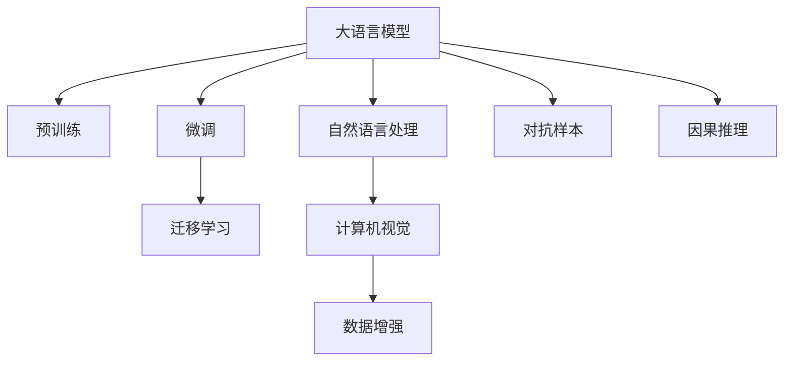

                 

## 1. 背景介绍

### 1.1 问题由来
市场调研（Market Research）是企业在做出产品决策、制定营销策略之前，对市场需求、竞争对手、消费者行为等进行调查和分析的重要环节。传统市场调研通常包括问卷调查、焦点小组讨论、销售数据分析等方法，通过收集数据和信息来揭示市场的现状和趋势，支持企业的决策制定。

然而，随着大数据和人工智能（AI）技术的快速发展，市场调研方法正在经历一场深刻变革。人工智能，特别是深度学习（Deep Learning）在自然语言处理（Natural Language Processing, NLP）、计算机视觉（Computer Vision）等领域的应用，正在改变市场调研的范式，带来新的机遇和挑战。

### 1.2 问题核心关键点
本节将详细介绍大语言模型（Large Language Model, LLM）在市场调研中的应用，以及其对传统市场调研方法提出的挑战和机遇。

## 2. 核心概念与联系

### 2.1 核心概念概述

为深入理解LLM在市场调研中的作用，本节将介绍几个关键概念：

- 大语言模型（LLM）：一种通过大规模无标签文本数据进行预训练的语言模型，如GPT-3、BERT等，能够理解和生成自然语言，具有较强的语言表示能力。
- 预训练：在大型无标签数据集上对模型进行训练，使其学习到通用的语言表示。
- 微调：在预训练模型的基础上，使用特定任务的有标签数据进行有监督训练，以提高模型在特定任务上的性能。
- 迁移学习：将预训练模型在新任务上微调，以利用已有知识，提升新任务上的表现。
- 自然语言处理（NLP）：涉及文本分析、信息提取、文本生成等领域的AI技术。
- 计算机视觉（CV）：处理图像和视频数据的AI技术，包括图像分类、目标检测等。
- 数据增强：通过数据变换增加训练数据多样性，提升模型泛化能力。
- 对抗样本：设计特定输入样本，使模型输出错误，评估模型的鲁棒性。
- 因果推理：分析事件之间的因果关系，提升模型的解释性。

这些概念之间的逻辑关系可以通过以下Mermaid流程图来展示：



这个流程图展示了大语言模型的核心概念及其之间的关系：

1. 大语言模型通过预训练获得基础能力。
2. 微调是对预训练模型进行任务特定的优化，以提高模型在特定任务上的性能。
3. 迁移学习是连接预训练模型与下游任务的桥梁，可以通过微调或直接利用预训练知识进行迁移学习。
4. 自然语言处理和计算机视觉是大语言模型处理的主要类型。
5. 数据增强和对抗样本可以提高模型的泛化能力和鲁棒性。
6. 因果推理使得模型能够建立事件之间的因果关系，增强模型的解释性。

## 3. 核心算法原理 & 具体操作步骤

### 3.1 算法原理概述

基于大语言模型的市场调研方法，其核心思想是利用大语言模型强大的自然语言处理能力，从海量文本数据中挖掘市场信息，分析消费者行为，预测市场趋势。相较于传统的问卷调查和统计分析，大语言模型方法具有自动化程度高、处理能力强的特点，能够快速处理大规模数据，并提取隐含的市场信息。

### 3.2 算法步骤详解

基于大语言模型的市场调研通常包括以下几个步骤：

**Step 1: 数据收集与预处理**

- 收集市场相关的文本数据，如新闻报道、消费者评论、社交媒体帖子等。
- 使用自然语言处理工具对数据进行清洗和预处理，去除噪音和无关信息。
- 对文本数据进行分词、去停用词、标准化等处理，便于后续分析。

**Step 2: 数据编码与嵌入**

- 将预处理后的文本数据转化为模型可以处理的数值形式，如词向量（Word Embeddings）、BERT编码等。
- 使用大语言模型对文本数据进行编码，得到高维向量表示。
- 将编码后的文本数据输入到模型中进行分析，提取市场信息。

**Step 3: 特征提取与分析**

- 使用大语言模型对文本数据进行特征提取，得到与市场相关的关键特征。
- 分析这些特征，识别市场趋势、消费者需求、竞争对手动态等信息。
- 使用因果推理方法，分析事件之间的因果关系，增强分析结果的可解释性。

**Step 4: 模型训练与评估**

- 在标注数据集上进行微调，训练模型以提高其预测准确度。
- 使用验证集对模型进行评估，优化模型参数和训练过程。
- 在测试集上对模型进行最终评估，确保模型在不同数据集上的泛化能力。

**Step 5: 结果应用**

- 将分析结果可视化，生成报告和图表，支持企业决策制定。
- 结合市场调研数据和公司内部数据，进行综合分析，制定市场策略。
- 实时监控市场动态，持续更新和优化市场调研模型。

### 3.3 算法优缺点

基于大语言模型的市场调研方法具有以下优点：

1. **自动化程度高**：能够快速处理大规模文本数据，自动化提取市场信息，减少人工成本。
2. **处理能力强大**：大语言模型能够处理多种类型的文本数据，包括新闻、评论、社交媒体等，覆盖更广泛的语料来源。
3. **分析深度高**：能够通过因果推理等方法，深入分析市场现象背后的因果关系，提供更有价值的洞察。
4. **适应性强**：模型能够根据不同市场和任务进行调整，适应不同的业务需求。

同时，该方法也存在以下局限性：

1. **依赖标注数据**：微调过程中需要标注数据进行监督学习，收集和标注高质量数据成本较高。
2. **泛化能力有限**：如果预训练语料与目标市场差异较大，模型泛化能力可能不足。
3. **可解释性不足**：模型输出的预测结果难以解释，增加了模型的复杂性。
4. **数据隐私问题**：处理敏感数据时，需要确保数据隐私和合规性。

尽管存在这些局限性，但就目前而言，基于大语言模型的市场调研方法仍是大数据分析和NLP技术落地的重要手段。未来相关研究的方向将进一步降低对标注数据的依赖，提高模型的泛化能力和可解释性，同时兼顾数据隐私和合规性要求。

### 3.4 算法应用领域

基于大语言模型的市场调研方法，在多个领域都得到了广泛应用，包括但不限于：

- **消费者行为分析**：通过分析消费者评论、社交媒体帖子等，了解消费者需求和偏好，优化产品设计和营销策略。
- **竞争对手分析**：分析竞争对手的新闻报道、产品评论等，评估竞争对手的市场动态和竞争策略。
- **市场趋势预测**：通过分析市场新闻、行业报告等，预测市场趋势和变化，制定长期发展策略。
- **市场细分**：根据消费者行为和市场信息，进行市场细分，制定有针对性的营销方案。
- **品牌声誉管理**：分析消费者评论和社交媒体讨论，评估品牌声誉，制定品牌管理策略。

除了上述这些经典应用外，大语言模型在市场调研领域的创新应用还在不断涌现，如智能客服、个性化推荐、舆情监测等，为市场调研工作带来新的思路和方法。

## 4. 数学模型和公式 & 详细讲解 & 举例说明

### 4.1 数学模型构建

在基于大语言模型的市场调研中，主要使用的数学模型包括：

- 词向量（Word Embeddings）模型：将文本数据转化为高维向量形式，便于模型处理和分析。
- 大语言模型（LLM）：使用预训练的通用语言模型，进行市场信息的提取和分析。
- 因果推理模型：使用因果图、因果推断等方法，分析事件之间的因果关系，增强模型的解释性。

### 4.2 公式推导过程

以下以BERT模型为例，推导市场调研中的因果推理公式。

假设市场调研任务为分析消费者对产品的评价，收集到的文本数据为产品评论。使用BERT模型对文本进行编码，得到嵌入向量 $x_i$。假设存在因果变量 $X$ 和结果变量 $Y$，其中 $X$ 包括产品特性、消费者需求等，$Y$ 为消费者评价。

因果推理的目标是估计 $Y$ 对 $X$ 的因果效应 $E[Y|X]$。假设 $X$ 与 $Y$ 之间的关系可以用线性模型表示，则因果效应的估计公式为：

$$
E[Y|X] = \beta_0 + \beta_1 X_1 + \cdots + \beta_k X_k + \epsilon
$$

其中 $\beta_0, \beta_1, \cdots, \beta_k$ 为回归系数，$\epsilon$ 为误差项。

使用BERT编码后的文本数据 $x_i$ 作为输入，可以构建如下因果效应模型：

$$
\hat{Y} = \mathbb{E}[Y|X] = \beta_0 + \sum_{i=1}^k \beta_i X_i + \epsilon
$$

其中 $X_i$ 为BERT编码后的特征向量，$\beta_0, \beta_1, \cdots, \beta_k$ 可以通过回归分析得到。

### 4.3 案例分析与讲解

假设某电商平台希望通过消费者评论分析产品满意度，并根据评论预测未来销量。使用BERT模型对评论文本进行编码，得到嵌入向量。构建如下线性回归模型：

$$
\hat{Y} = \beta_0 + \beta_1 X_1 + \cdots + \beta_k X_k + \epsilon
$$

其中 $Y$ 为销量，$X_i$ 为评论文本编码后的向量，$\beta_0, \beta_1, \cdots, \beta_k$ 为回归系数。

通过模型训练和验证，可以估计出每个评论特征对销量的影响，从而进行市场趋势预测。例如，某评论特征对销量的影响为0.5，表示该评论每增加1个百分点，销量平均增加0.5个百分点。

## 5. 项目实践：代码实例和详细解释说明

### 5.1 开发环境搭建

在进行市场调研实践前，我们需要准备好开发环境。以下是使用Python进行PyTorch开发的环境配置流程：

1. 安装Anaconda：从官网下载并安装Anaconda，用于创建独立的Python环境。

2. 创建并激活虚拟环境：
```bash
conda create -n pytorch-env python=3.8 
conda activate pytorch-env
```

3. 安装PyTorch：根据CUDA版本，从官网获取对应的安装命令。例如：
```bash
conda install pytorch torchvision torchaudio cudatoolkit=11.1 -c pytorch -c conda-forge
```

4. 安装Transformers库：
```bash
pip install transformers
```

5. 安装各类工具包：
```bash
pip install numpy pandas scikit-learn matplotlib tqdm jupyter notebook ipython
```

完成上述步骤后，即可在`pytorch-env`环境中开始市场调研实践。

### 5.2 源代码详细实现

下面我们以产品评论分析为例，给出使用Transformers库对BERT模型进行市场调研的PyTorch代码实现。

首先，定义市场调研的数据处理函数：

```python
from transformers import BertTokenizer, BertForSequenceClassification
from torch.utils.data import Dataset, DataLoader
import torch

class ReviewDataset(Dataset):
    def __init__(self, reviews, labels, tokenizer, max_len=128):
        self.reviews = reviews
        self.labels = labels
        self.tokenizer = tokenizer
        self.max_len = max_len
        
    def __len__(self):
        return len(self.reviews)
    
    def __getitem__(self, item):
        review = self.reviews[item]
        label = self.labels[item]
        
        encoding = self.tokenizer(review, return_tensors='pt', max_length=self.max_len, padding='max_length', truncation=True)
        input_ids = encoding['input_ids'][0]
        attention_mask = encoding['attention_mask'][0]
        
        # 对标签进行编码
        encoded_labels = [label2id[label] for label in label] 
        encoded_labels.extend([label2id['neutral']] * (self.max_len - len(encoded_labels)))
        labels = torch.tensor(encoded_labels, dtype=torch.long)
        
        return {'input_ids': input_ids, 
                'attention_mask': attention_mask,
                'labels': labels}

# 标签与id的映射
label2id = {'positive': 1, 'neutral': 0, 'negative': 2}
id2label = {v: k for k, v in label2id.items()}

# 创建dataset
tokenizer = BertTokenizer.from_pretrained('bert-base-uncased')

train_dataset = ReviewDataset(train_reviews, train_labels, tokenizer)
dev_dataset = ReviewDataset(dev_reviews, dev_labels, tokenizer)
test_dataset = ReviewDataset(test_reviews, test_labels, tokenizer)
```

然后，定义模型和优化器：

```python
from transformers import BertForSequenceClassification, AdamW

model = BertForSequenceClassification.from_pretrained('bert-base-uncased', num_labels=len(label2id))

optimizer = AdamW(model.parameters(), lr=2e-5)
```

接着，定义训练和评估函数：

```python
from tqdm import tqdm
from sklearn.metrics import classification_report

device = torch.device('cuda') if torch.cuda.is_available() else torch.device('cpu')
model.to(device)

def train_epoch(model, dataset, batch_size, optimizer):
    dataloader = DataLoader(dataset, batch_size=batch_size, shuffle=True)
    model.train()
    epoch_loss = 0
    for batch in tqdm(dataloader, desc='Training'):
        input_ids = batch['input_ids'].to(device)
        attention_mask = batch['attention_mask'].to(device)
        labels = batch['labels'].to(device)
        model.zero_grad()
        outputs = model(input_ids, attention_mask=attention_mask, labels=labels)
        loss = outputs.loss
        epoch_loss += loss.item()
        loss.backward()
        optimizer.step()
    return epoch_loss / len(dataloader)

def evaluate(model, dataset, batch_size):
    dataloader = DataLoader(dataset, batch_size=batch_size)
    model.eval()
    preds, labels = [], []
    with torch.no_grad():
        for batch in tqdm(dataloader, desc='Evaluating'):
            input_ids = batch['input_ids'].to(device)
            attention_mask = batch['attention_mask'].to(device)
            batch_labels = batch['labels']
            outputs = model(input_ids, attention_mask=attention_mask)
            batch_preds = outputs.logits.argmax(dim=2).to('cpu').tolist()
            batch_labels = batch_labels.to('cpu').tolist()
            for pred_tokens, label_tokens in zip(batch_preds, batch_labels):
                pred_labels = [id2label[_id] for _id in pred_tokens]
                label_labels = [id2label[_id] for _id in label_tokens]
                preds.append(pred_labels[:len(label_tokens)])
                labels.append(label_labels)
                
    print(classification_report(labels, preds))
```

最后，启动训练流程并在测试集上评估：

```python
epochs = 5
batch_size = 16

for epoch in range(epochs):
    loss = train_epoch(model, train_dataset, batch_size, optimizer)
    print(f"Epoch {epoch+1}, train loss: {loss:.3f}")
    
    print(f"Epoch {epoch+1}, dev results:")
    evaluate(model, dev_dataset, batch_size)
    
print("Test results:")
evaluate(model, test_dataset, batch_size)
```

以上就是使用PyTorch对BERT进行产品评论分析的完整代码实现。可以看到，得益于Transformers库的强大封装，我们可以用相对简洁的代码完成BERT模型的加载和微调。

### 5.3 代码解读与分析

让我们再详细解读一下关键代码的实现细节：

**ReviewDataset类**：
- `__init__`方法：初始化评论文本、标签、分词器等关键组件。
- `__len__`方法：返回数据集的样本数量。
- `__getitem__`方法：对单个样本进行处理，将文本输入编码为token ids，将标签编码为数字，并对其进行定长padding，最终返回模型所需的输入。

**label2id和id2label字典**：
- 定义了标签与数字id之间的映射关系，用于将预测结果解码为真实的标签。

**训练和评估函数**：
- 使用PyTorch的DataLoader对数据集进行批次化加载，供模型训练和推理使用。
- 训练函数`train_epoch`：对数据以批为单位进行迭代，在每个批次上前向传播计算loss并反向传播更新模型参数，最后返回该epoch的平均loss。
- 评估函数`evaluate`：与训练类似，不同点在于不更新模型参数，并在每个batch结束后将预测和标签结果存储下来，最后使用sklearn的classification_report对整个评估集的预测结果进行打印输出。

**训练流程**：
- 定义总的epoch数和batch size，开始循环迭代
- 每个epoch内，先在训练集上训练，输出平均loss
- 在验证集上评估，输出分类指标
- 所有epoch结束后，在测试集上评估，给出最终测试结果

可以看到，PyTorch配合Transformers库使得BERT微调的产品评论分析代码实现变得简洁高效。开发者可以将更多精力放在数据处理、模型改进等高层逻辑上，而不必过多关注底层的实现细节。

当然，工业级的系统实现还需考虑更多因素，如模型的保存和部署、超参数的自动搜索、更灵活的任务适配层等。但核心的微调范式基本与此类似。

## 6. 实际应用场景
### 6.1 智能客服系统

基于大语言模型的市场调研方法，可以广泛应用于智能客服系统的构建。传统客服往往需要配备大量人力，高峰期响应缓慢，且一致性和专业性难以保证。而使用市场调研数据进行微调后的对话模型，可以7x24小时不间断服务，快速响应客户咨询，用自然流畅的语言解答各类常见问题。

在技术实现上，可以收集客户历史对话记录，将问题和最佳答复构建成监督数据，在此基础上对预训练对话模型进行微调。微调后的对话模型能够自动理解用户意图，匹配最合适的答案模板进行回复。对于客户提出的新问题，还可以接入检索系统实时搜索相关内容，动态组织生成回答。如此构建的智能客服系统，能大幅提升客户咨询体验和问题解决效率。

### 6.2 金融舆情监测

金融机构需要实时监测市场舆论动向，以便及时应对负面信息传播，规避金融风险。传统的人工监测方式成本高、效率低，难以应对网络时代海量信息爆发的挑战。基于大语言模型微调的文本分类和情感分析技术，为金融舆情监测提供了新的解决方案。

具体而言，可以收集金融领域相关的新闻、报道、评论等文本数据，并对其进行主题标注和情感标注。在此基础上对预训练语言模型进行微调，使其能够自动判断文本属于何种主题，情感倾向是正面、中性还是负面。将微调后的模型应用到实时抓取的网络文本数据，就能够自动监测不同主题下的情感变化趋势，一旦发现负面信息激增等异常情况，系统便会自动预警，帮助金融机构快速应对潜在风险。

### 6.3 个性化推荐系统

当前的推荐系统往往只依赖用户的历史行为数据进行物品推荐，无法深入理解用户的真实兴趣偏好。基于大语言模型微调技术，个性化推荐系统可以更好地挖掘用户行为背后的语义信息，从而提供更精准、多样的推荐内容。

在实践中，可以收集用户浏览、点击、评论、分享等行为数据，提取和用户交互的物品标题、描述、标签等文本内容。将文本内容作为模型输入，用户的后续行为（如是否点击、购买等）作为监督信号，在此基础上微调预训练语言模型。微调后的模型能够从文本内容中准确把握用户的兴趣点。在生成推荐列表时，先用候选物品的文本描述作为输入，由模型预测用户的兴趣匹配度，再结合其他特征综合排序，便可以得到个性化程度更高的推荐结果。

### 6.4 未来应用展望

随着大语言模型微调技术的发展，其应用领域将会更加广泛，市场调研只是其中的一小部分。未来，LLM将在更多领域得到应用，为各行各业带来变革性影响。

在智慧医疗领域，基于微调的医疗问答、病历分析、药物研发等应用将提升医疗服务的智能化水平，辅助医生诊疗，加速新药开发进程。

在智能教育领域，微调技术可应用于作业批改、学情分析、知识推荐等方面，因材施教，促进教育公平，提高教学质量。

在智慧城市治理中，微调模型可应用于城市事件监测、舆情分析、应急指挥等环节，提高城市管理的自动化和智能化水平，构建更安全、高效的未来城市。

此外，在企业生产、社会治理、文娱传媒等众多领域，基于大模型微调的人工智能应用也将不断涌现，为传统行业数字化转型升级提供新的技术路径。相信随着技术的日益成熟，微调方法将成为人工智能落地应用的重要范式，推动人工智能技术在垂直行业的规模化落地。

## 7. 工具和资源推荐
### 7.1 学习资源推荐

为了帮助开发者系统掌握大语言模型微调的理论基础和实践技巧，这里推荐一些优质的学习资源：

1. 《Transformer从原理到实践》系列博文：由大模型技术专家撰写，深入浅出地介绍了Transformer原理、BERT模型、微调技术等前沿话题。

2. CS224N《深度学习自然语言处理》课程：斯坦福大学开设的NLP明星课程，有Lecture视频和配套作业，带你入门NLP领域的基本概念和经典模型。

3. 《Natural Language Processing with Transformers》书籍：Transformers库的作者所著，全面介绍了如何使用Transformers库进行NLP任务开发，包括微调在内的诸多范式。

4. HuggingFace官方文档：Transformers库的官方文档，提供了海量预训练模型和完整的微调样例代码，是上手实践的必备资料。

5. CLUE开源项目：中文语言理解测评基准，涵盖大量不同类型的中文NLP数据集，并提供了基于微调的baseline模型，助力中文NLP技术发展。

通过对这些资源的学习实践，相信你一定能够快速掌握大语言模型微调的精髓，并用于解决实际的NLP问题。
###  7.2 开发工具推荐

高效的开发离不开优秀的工具支持。以下是几款用于大语言模型微调开发的常用工具：

1. PyTorch：基于Python的开源深度学习框架，灵活动态的计算图，适合快速迭代研究。大部分预训练语言模型都有PyTorch版本的实现。

2. TensorFlow：由Google主导开发的开源深度学习框架，生产部署方便，适合大规模工程应用。同样有丰富的预训练语言模型资源。

3. Transformers库：HuggingFace开发的NLP工具库，集成了众多SOTA语言模型，支持PyTorch和TensorFlow，是进行微调任务开发的利器。

4. Weights & Biases：模型训练的实验跟踪工具，可以记录和可视化模型训练过程中的各项指标，方便对比和调优。与主流深度学习框架无缝集成。

5. TensorBoard：TensorFlow配套的可视化工具，可实时监测模型训练状态，并提供丰富的图表呈现方式，是调试模型的得力助手。

6. Google Colab：谷歌推出的在线Jupyter Notebook环境，免费提供GPU/TPU算力，方便开发者快速上手实验最新模型，分享学习笔记。

合理利用这些工具，可以显著提升大语言模型微调任务的开发效率，加快创新迭代的步伐。

### 7.3 相关论文推荐

大语言模型和微调技术的发展源于学界的持续研究。以下是几篇奠基性的相关论文，推荐阅读：

1. Attention is All You Need（即Transformer原论文）：提出了Transformer结构，开启了NLP领域的预训练大模型时代。

2. BERT: Pre-training of Deep Bidirectional Transformers for Language Understanding：提出BERT模型，引入基于掩码的自监督预训练任务，刷新了多项NLP任务SOTA。

3. Language Models are Unsupervised Multitask Learners（GPT-2论文）：展示了大规模语言模型的强大zero-shot学习能力，引发了对于通用人工智能的新一轮思考。

4. Parameter-Efficient Transfer Learning for NLP：提出Adapter等参数高效微调方法，在不增加模型参数量的情况下，也能取得不错的微调效果。

5. Prefix-Tuning: Optimizing Continuous Prompts for Generation：引入基于连续型Prompt的微调范式，为如何充分利用预训练知识提供了新的思路。

6. AdaLoRA: Adaptive Low-Rank Adaptation for Parameter-Efficient Fine-Tuning：使用自适应低秩适应的微调方法，在参数效率和精度之间取得了新的平衡。

这些论文代表了大语言模型微调技术的发展脉络。通过学习这些前沿成果，可以帮助研究者把握学科前进方向，激发更多的创新灵感。

## 8. 总结：未来发展趋势与挑战

### 8.1 总结

本文对基于大语言模型的市场调研方法进行了全面系统的介绍。首先阐述了市场调研的基本概念和重要性，明确了LLM在市场调研中的应用潜力。其次，从原理到实践，详细讲解了LLM市场调研的数学模型和操作步骤，给出了微调任务开发的完整代码实例。同时，本文还广泛探讨了LLM在智能客服、金融舆情、个性化推荐等多个行业领域的应用前景，展示了LLM在市场调研工作中的巨大价值。

通过本文的系统梳理，可以看到，基于大语言模型的市场调研方法正在成为市场分析的新范式，极大地拓展了市场调研技术的边界，提升了数据分析的效率和准确性。未来，伴随预训练语言模型和微调方法的不断演进，相信市场调研工作必将迎来新的变革，助力企业做出更精准的决策。

### 8.2 未来发展趋势

展望未来，大语言模型在市场调研领域的应用将呈现以下几个发展趋势：

1. 模型规模持续增大。随着算力成本的下降和数据规模的扩张，预训练语言模型的参数量还将持续增长。超大模型在处理大规模文本数据时，能够提供更精准、全面的市场分析。

2. 微调方法日趋多样。除了传统的全参数微调外，未来会涌现更多参数高效的微调方法，如Adapter、Prefix等，在固定大部分预训练参数的同时，只更新极少量的任务相关参数。

3. 因果推理深入应用。通过引入因果推理，可以更深入地分析市场现象背后的因果关系，增强模型的解释性和预测准确度。

4. 数据增强与对抗训练结合。使用数据增强和对抗训练技术，提高模型对噪音和对抗样本的鲁棒性，增强模型的泛化能力。

5. 多模态数据融合。结合文本、图像、音频等多种模态的数据，进行综合分析，提升市场调研的全面性和准确性。

6. 实时数据处理与分析。随着实时数据采集和处理的兴起，基于LLM的市场调研方法将具备更强的时效性，能够实时响应市场动态。

以上趋势凸显了大语言模型在市场调研领域的广阔前景。这些方向的探索发展，必将进一步提升市场调研工作的效率和质量，为企业的决策制定提供更强大的技术支持。

### 8.3 面临的挑战

尽管大语言模型在市场调研中展现了巨大潜力，但在实际应用中也面临诸多挑战：

1. 标注数据依赖。微调过程中需要标注数据进行监督学习，收集和标注高质量数据成本较高。如何降低对标注数据的依赖，提升模型泛化能力，仍是重要的研究方向。

2. 数据隐私与合规。处理敏感数据时，需要确保数据隐私和合规性，遵守GDPR等法律法规。如何在保证数据隐私的前提下，进行有效的市场调研，是一大难题。

3. 模型复杂性与可解释性。大语言模型通常结构复杂，难以解释其内部工作机制和决策逻辑。如何在保证模型性能的同时，增强其可解释性，增强用户信任，是未来的研究方向。

4. 鲁棒性与泛化能力。预训练模型的鲁棒性不足，面对域外数据时，泛化性能可能不足。如何提高模型的鲁棒性和泛化能力，增强其适应性，是未来需要突破的技术难点。

5. 计算资源消耗。大语言模型参数量庞大，训练和推理过程中资源消耗大。如何优化模型结构，提高计算效率，减少资源消耗，是实际应用中需要解决的问题。

6. 数据质量与真实性。市场调研数据可能存在噪音和偏见，影响分析结果的真实性。如何保证数据质量，避免数据偏见，是数据处理中需要重点考虑的问题。

尽管存在这些挑战，但随着技术的不断进步，相信大语言模型在市场调研中的应用前景将更加广阔。未来，研究者需要在数据质量、模型设计、计算资源优化等多个方面进行深入探索，才能真正发挥大语言模型在市场调研中的潜力。

### 8.4 研究展望

面对大语言模型市场调研所面临的挑战，未来的研究需要在以下几个方面寻求新的突破：

1. 探索无监督和半监督微调方法。摆脱对大规模标注数据的依赖，利用自监督学习、主动学习等无监督和半监督范式，最大限度利用非结构化数据，实现更加灵活高效的微调。

2. 研究参数高效和计算高效的微调范式。开发更加参数高效的微调方法，在固定大部分预训练参数的同时，只更新极少量的任务相关参数。同时优化微调模型的计算图，减少前向传播和反向传播的资源消耗，实现更加轻量级、实时性的部署。

3. 融合因果和对比学习范式。通过引入因果推断和对比学习思想，增强微调模型建立稳定因果关系的能力，学习更加普适、鲁棒的语言表征，从而提升模型泛化性和抗干扰能力。

4. 引入更多先验知识。将符号化的先验知识，如知识图谱、逻辑规则等，与神经网络模型进行巧妙融合，引导微调过程学习更准确、合理的语言模型。同时加强不同模态数据的整合，实现视觉、语音等多模态信息与文本信息的协同建模。

5. 结合因果分析和博弈论工具。将因果分析方法引入微调模型，识别出模型决策的关键特征，增强输出解释的因果性和逻辑性。借助博弈论工具刻画人机交互过程，主动探索并规避模型的脆弱点，提高系统稳定性。

6. 纳入伦理道德约束。在模型训练目标中引入伦理导向的评估指标，过滤和惩罚有偏见、有害的输出倾向。同时加强人工干预和审核，建立模型行为的监管机制，确保输出符合人类价值观和伦理道德。

这些研究方向的探索，必将引领大语言模型市场调研技术迈向更高的台阶，为市场调研工作提供更强大的技术支持。面向未来，大语言模型市场调研技术还需要与其他人工智能技术进行更深入的融合，如知识表示、因果推理、强化学习等，多路径协同发力，共同推动市场调研技术的进步。

## 9. 附录：常见问题与解答

**Q1：大语言模型微调是否适用于所有市场调研任务？**

A: 大语言模型微调在大多数市场调研任务上都能取得不错的效果，特别是对于数据量较小的任务。但对于一些特定领域的任务，如医学、法律等，仅仅依靠通用语料预训练的模型可能难以很好地适应。此时需要在特定领域语料上进一步预训练，再进行微调，才能获得理想效果。此外，对于一些需要时效性、个性化很强的任务，如对话、推荐等，微调方法也需要针对性的改进优化。

**Q2：微调过程中如何选择合适的学习率？**

A: 微调的学习率一般要比预训练时小1-2个数量级，如果使用过大的学习率，容易破坏预训练权重，导致过拟合。一般建议从1e-5开始调参，逐步减小学习率，直至收敛。也可以使用warmup策略，在开始阶段使用较小的学习率，再逐渐过渡到预设值。需要注意的是，不同的优化器(如AdamW、Adafactor等)以及不同的学习率调度策略，可能需要设置不同的学习率阈值。

**Q3：采用大语言模型微调时会面临哪些资源瓶颈？**

A: 目前主流的预训练大模型动辄以亿计的参数规模，对算力、内存、存储都提出了很高的要求。GPU/TPU等高性能设备是必不可少的，但即便如此，超大批次的训练和推理也可能遇到显存不足的问题。因此需要采用一些资源优化技术，如梯度积累、混合精度训练、模型并行等，来突破硬件瓶颈。同时，模型的存储和读取也可能占用大量时间和空间，需要采用模型压缩、稀疏化存储等方法进行优化。

**Q4：如何缓解微调过程中的过拟合问题？**

A: 过拟合是微调面临的主要挑战，尤其是在标注数据不足的情况下。常见的缓解策略包括：
1. 数据增强：通过回译、近义替换等方式扩充训练集
2. 正则化：使用L2正则、Dropout、Early Stopping等避免过拟合
3. 对抗训练：引入对抗样本，提高模型鲁棒性
4. 参数高效微调：只调整少量参数(如Adapter、Prefix等)，减小过拟合风险
5. 多模型集成：训练多个微调模型，取平均输出，抑制过拟合

这些策略往往需要根据具体任务和数据特点进行灵活组合。只有在数据、模型、训练、推理等各环节进行全面优化，才能最大限度地发挥大语言模型微调的威力。

**Q5：微调模型在落地部署时需要注意哪些问题？**

A: 将微调模型转化为实际应用，还需要考虑以下因素：
1. 模型裁剪：去除不必要的层和参数，减小模型尺寸，加快推理速度
2. 量化加速：将浮点模型转为定点模型，压缩存储空间，提高计算效率
3. 服务化封装：将模型封装为标准化服务接口，便于集成调用
4. 弹性伸缩：根据请求流量动态调整资源配置，平衡服务质量和成本
5. 监控告警：实时采集系统指标，设置异常告警阈值，确保服务稳定性
6. 安全防护：采用访问鉴权、数据脱敏等措施，保障数据和模型安全

大语言模型微调为市场调研工作开启了广阔的想象空间，但如何将强大的性能转化为稳定、高效、安全的业务价值，还需要工程实践的不断打磨。唯有从数据、算法、工程、业务等多个维度协同发力，才能真正实现人工智能技术在垂直行业的规模化落地。

总之，大语言模型微调在市场调研领域的应用前景广阔，但也需要解决诸多挑战，才能实现其真正的潜力。通过不断优化和创新，大语言模型市场调研技术必将为各行各业带来新的变革，推动市场调研工作迈向更高的台阶。

---

作者：禅与计算机程序设计艺术 / Zen and the Art of Computer Programming

