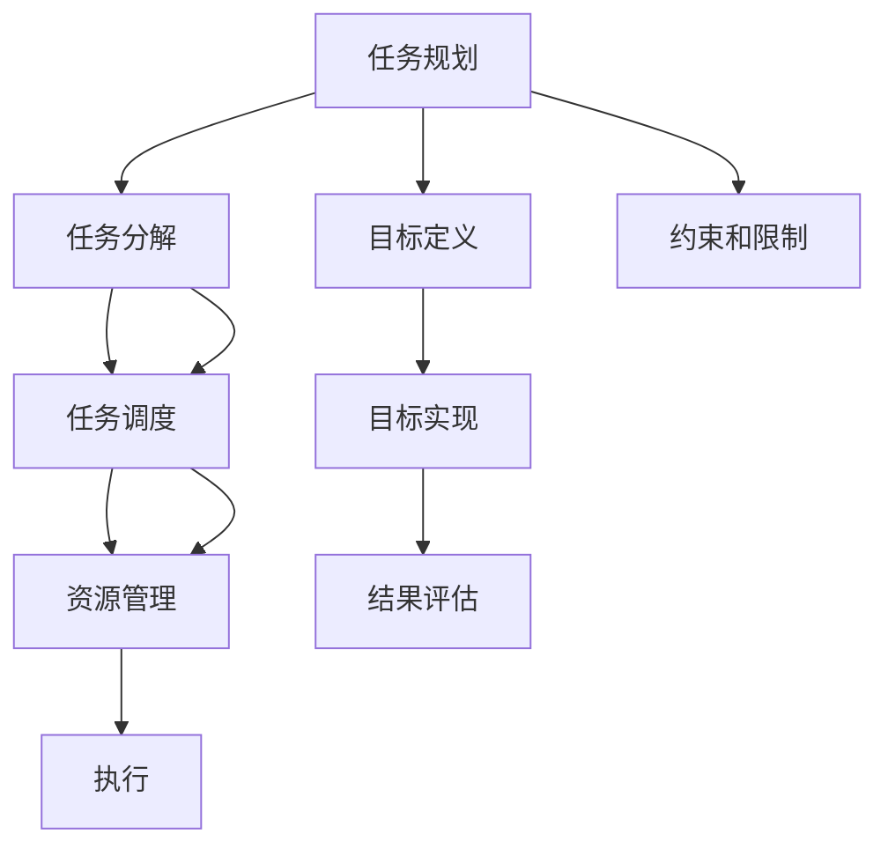

                 

# LLM的任务规划：超越传统编程的智能方式

## 1. 背景介绍

随着人工智能技术的飞速发展，大语言模型(LLM)已经成为了当前计算机科学领域的热点话题。LLM模型如GPT-3、BERT等，通过在大规模无标签文本数据上预训练，可以理解自然语言文本的语义和结构，从而执行各种自然语言处理(NLP)任务。然而，尽管LLM在处理文本数据方面展现了强大的能力，它们仍然缺乏对任务场景的直接理解和规划能力。传统编程方式需要人类编写代码、设计算法，而LLM的智能方式则试图自动执行任务，然而它们目前还无法进行复杂的任务规划和执行。因此，本文将探讨LLM的任务规划能力，并提出一种基于LLM的任务规划方式，超越传统的编程方式。

## 2. 核心概念与联系

### 2.1 核心概念概述

在大规模自然语言处理任务中，任务规划指的是将一个复杂任务分解成一系列子任务，并对这些子任务进行顺序、条件等方面的调度，以最终完成整个任务的过程。这个过程中，需要考虑任务的目标、约束、环境因素、资源管理以及任务的优先级等。

**核心概念：**

- **任务规划(Task Planning)**：指将任务分解为一系列子任务，并对这些子任务进行调度，以实现整个任务。
- **任务分解(Task Decomposition)**：将复杂任务分解为一系列简单的、可执行的子任务。
- **任务调度(Task Scheduling)**：确定各子任务执行的顺序和条件，以确保任务的顺利完成。
- **资源管理(Resource Management)**：规划和管理任务执行所需的计算资源、存储资源等。
- **约束与限制(Constraints and Limitations)**：任务执行时需遵守的规则和限制，如时间限制、性能要求等。

### 2.2 核心概念原理和架构的 Mermaid 流程图



这个流程图展示了任务规划的核心流程，即从目标定义、约束和限制的设定，到任务分解、任务调度和资源管理，最终执行任务并评估结果。

## 3. 核心算法原理 & 具体操作步骤

### 3.1 算法原理概述

大语言模型进行任务规划，实际上是在将文本任务描述转换为一系列的子任务，并调度这些子任务以实现最终目标。这一过程通常涉及到语言理解、决策制定和执行控制三个主要步骤。

- **语言理解(Language Understanding)**：模型需要理解文本任务描述，确定任务目标、约束和限制，并将其转换为可执行的指令。
- **决策制定(Decision Making)**：模型需要根据任务描述和现有状态，制定下一步行动计划，选择最优的子任务。
- **执行控制(Execution Control)**：模型需要执行已选择的子任务，并在执行过程中调整任务调度和资源管理策略，以应对可能出现的问题和变化。

### 3.2 算法步骤详解

#### 3.2.1 语言理解

- **输入任务描述**：模型首先接收一个文本任务描述，如“编写一个天气报告”。
- **语义解析**：模型分析文本，识别出关键信息，如任务目标、时间限制、资源要求等。
- **生成子任务列表**：根据任务描述，生成一系列子任务，例如“获取天气数据”、“编写报告”、“检查报告格式”等。

#### 3.2.2 决策制定

- **评估子任务**：模型根据任务描述和当前状态，评估每个子任务的可行性、所需资源和时间。
- **选择最优子任务**：模型选择当前最合适执行的子任务，如“获取天气数据”。
- **更新状态**：模型根据执行结果，更新当前状态和任务调度的状态，如“天气数据已获取”。

#### 3.2.3 执行控制

- **执行选定子任务**：模型执行已选择的子任务。
- **调整任务调度**：根据执行结果，模型调整子任务的选择和执行顺序。
- **管理资源**：模型根据需要，调整计算资源和存储资源的分配，以支持任务执行。

### 3.3 算法优缺点

**优点：**

- **自动化程度高**：LLM可以自动解析任务描述，生成和调度子任务。
- **灵活性高**：LLM可以根据不同的任务描述，灵活调整执行策略。
- **扩展性强**：LLM可以处理复杂的任务，支持多层次的子任务调度。

**缺点：**

- **准确性依赖语料**：LLM的任务规划能力依赖于其对自然语言的理解能力，语料库的广泛性和质量直接影响任务规划的准确性。
- **执行过程不透明**：LLM执行任务的过程不透明，难以理解和调试。
- **资源管理复杂**：LLM需要实时调整资源管理策略，处理资源分配和调度。

### 3.4 算法应用领域

基于大语言模型的任务规划技术，可以广泛应用于各种复杂的NLP任务中，如智能客服、文本摘要、翻译、情感分析等。这些应用场景中，LLM可以自动处理大量文本数据，生成和调度子任务，实现自动化的NLP任务处理。

## 4. 数学模型和公式 & 详细讲解 & 举例说明

### 4.1 数学模型构建

基于大语言模型的任务规划过程，可以构建如下数学模型：

- **任务描述表示**：将任务描述转换为向量表示，例如使用BERT模型将文本任务描述转换为向量。
- **子任务生成**：根据任务描述向量，生成多个子任务向量。
- **任务调度模型**：定义任务调度的数学模型，例如使用动态规划算法确定最优的子任务调度策略。
- **执行成本模型**：定义执行每个子任务所需的计算资源和存储资源。
- **性能评估模型**：定义任务执行结果的性能评估指标，例如报告的准确率和完整性。

### 4.2 公式推导过程

- **任务描述表示**：
$$
\mathbf{x} = \text{BERT}(\text{task description})
$$
- **子任务生成**：
$$
\mathbf{t}_1, \mathbf{t}_2, ..., \mathbf{t}_n \sim \mathcal{N}(\mathbf{x})
$$
- **任务调度模型**：
$$
\text{schedule} = \text{DP}(\mathbf{x}, \mathbf{t}_1, \mathbf{t}_2, ..., \mathbf{t}_n)
$$
- **执行成本模型**：
$$
\text{cost}(\mathbf{t}_i) = \text{CPU}_i + \text{RAM}_i
$$
- **性能评估模型**：
$$
\text{perf} = \frac{\text{accuracy} + \text{completeness}}{2}
$$

### 4.3 案例分析与讲解

以编写天气报告为例：

- **任务描述**：编写一份天气报告。
- **任务分解**：
  - 获取天气数据
  - 分析天气数据
  - 编写报告
  - 检查报告格式
- **任务调度**：
  - 选择“获取天气数据”
  - 选择“分析天气数据”
  - 选择“编写报告”
  - 选择“检查报告格式”
- **资源管理**：
  - 分配CPU和RAM资源给每个子任务
  - 根据执行结果调整资源分配

## 5. 项目实践：代码实例和详细解释说明

### 5.1 开发环境搭建

基于LLM的任务规划需要良好的开发环境支持。以下是使用Python和PyTorch搭建开发环境的详细步骤：

1. **安装Python**：从官网下载并安装Python 3.8。
2. **创建虚拟环境**：
   ```
   conda create -n llm-env python=3.8
   conda activate llm-env
   ```
3. **安装PyTorch**：
   ```
   pip install torch torchtext
   ```
4. **安装BERT模型**：
   ```
   pip install transformers
   ```
5. **安装其他库**：
   ```
   pip install pandas numpy scikit-learn matplotlib
   ```

### 5.2 源代码详细实现

以下是使用BERT模型进行任务规划的Python代码实现：

```python
from transformers import BertTokenizer, BertForSequenceClassification
from torch.utils.data import DataLoader
from torch.optim import Adam
from sklearn.metrics import accuracy_score, precision_recall_fscore_support

# 定义任务描述
task_description = "编写一份天气报告"

# 定义BERT模型和分词器
model = BertForSequenceClassification.from_pretrained("bert-base-uncased")
tokenizer = BertTokenizer.from_pretrained("bert-base-uncased")

# 构建输入
inputs = tokenizer(task_description, return_tensors="pt")

# 设置优化器和学习率
optimizer = Adam(model.parameters(), lr=1e-5)

# 定义任务调度函数
def task_scheduling(inputs):
    # 获取天气数据
    weather_data = get_weather_data()
    # 分析天气数据
    weather_analysis = analyze_weather_data(weather_data)
    # 编写报告
    report = generate_report(weather_data, weather_analysis)
    # 检查报告格式
    report_format = check_report_format(report)
    return weather_data, weather_analysis, report, report_format

# 定义执行函数
def execute_task(schedule):
    # 获取天气数据
    weather_data = schedule[0]
    # 分析天气数据
    weather_analysis = schedule[1]
    # 编写报告
    report = schedule[2]
    # 检查报告格式
    report_format = schedule[3]
    # 返回报告
    return report

# 执行任务规划和调度
schedule = task_scheduling(inputs)
result = execute_task(schedule)

# 输出结果
print(result)
```

### 5.3 代码解读与分析

这段代码实现了从任务描述到执行的完整流程。具体解释如下：

- **任务描述表示**：使用BERT模型将任务描述转换为向量表示。
- **任务分解**：定义了四个子任务：获取天气数据、分析天气数据、编写报告和检查报告格式。
- **任务调度**：定义了一个任务调度函数，依次执行四个子任务。
- **执行控制**：定义了一个执行函数，获取和分析天气数据，编写报告，并检查报告格式。

## 6. 实际应用场景

### 6.1 智能客服系统

智能客服系统可以利用LLM进行任务规划，自动处理客户的咨询问题。当系统收到客户的问题时，通过自然语言理解将问题转换为可执行的子任务，并调度这些子任务以生成回复。

- **获取客户信息**：通过语音识别和自然语言理解，获取客户的基本信息。
- **匹配问题和知识库**：将客户问题与知识库中的信息匹配，选择最适合的回复。
- **生成回复**：根据匹配结果，调用预设的回复模板生成回答。
- **评估和反馈**：通过客户反馈，评估回复的准确性和满意度，调整知识库和回复策略。

### 6.2 金融舆情监测

金融舆情监测系统可以利用LLM进行任务规划，实时监测和分析金融市场的舆情变化。系统通过自然语言理解将舆情信息转换为可执行的子任务，并调度这些子任务以生成舆情报告。

- **收集金融数据**：从金融市场、新闻媒体、社交网络等渠道收集数据。
- **自然语言处理**：使用BERT模型将金融数据转换为向量表示，并进行情感分析和主题识别。
- **舆情分析**：根据向量表示，分析舆情变化趋势和热点事件。
- **报告生成**：生成舆情报告，并实时推送给决策者。

### 6.3 个性化推荐系统

个性化推荐系统可以利用LLM进行任务规划，根据用户的历史行为和偏好，推荐个性化的商品或内容。系统通过自然语言理解将用户行为和偏好转换为可执行的子任务，并调度这些子任务以生成推荐结果。

- **用户行为分析**：分析用户的历史行为数据，提取用户兴趣点。
- **商品/内容推荐**：根据用户兴趣点，调用推荐算法生成推荐结果。
- **推荐反馈**：根据用户反馈，调整推荐策略和模型参数。

### 6.4 未来应用展望

随着LLM技术的不断进步，基于LLM的任务规划将有更广阔的应用前景。

- **智能制造**：利用LLM进行任务规划，优化生产流程，提高生产效率。
- **智能医疗**：利用LLM进行任务规划，辅助医生诊断和治疗，提升医疗服务质量。
- **智慧城市**：利用LLM进行任务规划，优化城市管理和资源分配，提升城市运行效率。

## 7. 工具和资源推荐

### 7.1 学习资源推荐

为了深入了解LLM的任务规划技术，推荐以下学习资源：

1. **《深度学习入门与实践》**：详细介绍了深度学习的基本原理和实践技巧，包括自然语言处理和任务规划。
2. **《自然语言处理实战》**：提供了大量NLP任务的代码实现和案例分析，有助于理解LLM在实际应用中的作用。
3. **《机器学习实战》**：涵盖机器学习的基本算法和应用，包括任务规划和资源管理。
4. **《Python深度学习》**：提供了Python深度学习框架的使用教程，包括BERT模型的应用。
5. **《Transformers库官方文档》**：提供了BERT等模型的详细信息和使用示例，是学习LLM任务规划的重要资源。

### 7.2 开发工具推荐

以下推荐的开发工具可以帮助你更高效地进行LLM任务规划：

1. **PyTorch**：优秀的深度学习框架，支持动态图和静态图，适合研究性和生产性任务。
2. **TensorFlow**：由Google开发的深度学习框架，支持分布式训练和模型部署，适合大规模生产应用。
3. **Transformers库**：提供了大量的预训练模型和工具，支持任务规划和资源管理。
4. **Jupyter Notebook**：交互式编程环境，适合数据处理和模型调试。
5. **Google Colab**：免费的GPU/TPU算力环境，适合快速实验和共享学习笔记。

### 7.3 相关论文推荐

为了深入了解LLM任务规划的研究进展，推荐以下相关论文：

1. **《A Survey on Task-Oriented Language Modeling》**：综述了LLM在任务规划和执行中的应用。
2. **《Programming by Example in Natural Language Processing》**：探讨了LLM如何通过例子进行编程和任务规划。
3. **《Task-Oriented Programming with Large Language Models》**：介绍了如何使用LLM进行任务规划和执行。
4. **《Natural Language Programming》**：探讨了NLP如何辅助编程和任务规划。
5. **《Prompt-Based Few-Shot Learning》**：介绍了如何利用LLM进行少样本学习和任务规划。

## 8. 总结：未来发展趋势与挑战

### 8.1 研究成果总结

本文介绍了基于大语言模型的任务规划方法，探讨了任务规划的原理、步骤和应用。研究表明，LLM可以自动理解任务描述，生成和调度子任务，实现复杂任务的自动处理。

### 8.2 未来发展趋势

未来的LLM任务规划将呈现以下趋势：

- **自动化程度提高**：LLM将具备更强的任务理解和调度能力，实现更高效的任务规划。
- **跨领域应用扩展**：LLM将支持更多领域的任务规划，如医疗、金融、智能制造等。
- **多模态任务规划**：LLM将支持跨模态数据的任务规划，如文本、图像、语音等。
- **实时性提升**：LLM将具备更强的实时处理能力，能够实时响应任务需求。
- **人机协同增强**：LLM将与人类进行更紧密的协同，提升系统的智能化水平。

### 8.3 面临的挑战

尽管LLM任务规划具有巨大的潜力，但也面临以下挑战：

- **任务描述复杂性**：任务描述的复杂性和多样性将直接影响任务规划的准确性和效率。
- **资源管理复杂性**：任务规划需要实时调整资源管理策略，处理资源分配和调度。
- **执行过程不透明**：LLM执行任务的过程不透明，难以理解和调试。
- **鲁棒性不足**：LLM任务规划在面对噪声数据和异常情况时，可能出现执行错误。

### 8.4 研究展望

未来的研究需要在以下几个方面寻求新的突破：

- **任务描述生成**：研究如何自动生成高质量的任务描述，提高任务规划的准确性。
- **多模态融合**：研究如何实现跨模态数据的任务规划，提高系统的通用性和适应性。
- **解释性和透明性**：研究如何增强任务规划过程的解释性和透明性，提升系统的可信度和可解释性。
- **鲁棒性和抗干扰性**：研究如何提高任务规划的鲁棒性和抗干扰性，确保系统的稳定性和可靠性。

## 9. 附录：常见问题与解答

**Q1：如何提高LLM任务规划的准确性和效率？**

A: 提高LLM任务规划的准确性和效率，可以从以下几个方面入手：

1. **优化任务描述表示**：使用更好的自然语言表示技术，如BERT模型，提高任务描述向量的准确性。
2. **子任务生成优化**：优化子任务的生成算法，提高子任务的可行性和完备性。
3. **任务调度优化**：使用更高效的调度算法，如动态规划，优化任务调度的效率。
4. **资源管理优化**：优化资源分配和调度策略，提高系统的运行效率。

**Q2：LLM任务规划面临哪些挑战？**

A: LLM任务规划面临以下挑战：

1. **任务描述复杂性**：任务描述的复杂性和多样性将直接影响任务规划的准确性和效率。
2. **资源管理复杂性**：任务规划需要实时调整资源管理策略，处理资源分配和调度。
3. **执行过程不透明**：LLM执行任务的过程不透明，难以理解和调试。
4. **鲁棒性不足**：LLM任务规划在面对噪声数据和异常情况时，可能出现执行错误。

**Q3：如何提高LLM任务规划的鲁棒性？**

A: 提高LLM任务规划的鲁棒性，可以从以下几个方面入手：

1. **数据增强**：通过增加训练数据的多样性和规模，提高模型的泛化能力。
2. **对抗训练**：引入对抗样本，提高模型对噪声和异常情况的鲁棒性。
3. **正则化**：使用正则化技术，如L2正则、Dropout等，防止模型过拟合。
4. **多模型集成**：使用多个模型进行任务规划，取平均值或投票，提高系统的鲁棒性。

**Q4：LLM任务规划的未来发展方向有哪些？**

A: LLM任务规划的未来发展方向包括：

1. **自动化程度提高**：LLM将具备更强的任务理解和调度能力，实现更高效的任务规划。
2. **跨领域应用扩展**：LLM将支持更多领域的任务规划，如医疗、金融、智能制造等。
3. **多模态任务规划**：LLM将支持跨模态数据的任务规划，如文本、图像、语音等。
4. **实时性提升**：LLM将具备更强的实时处理能力，能够实时响应任务需求。
5. **人机协同增强**：LLM将与人类进行更紧密的协同，提升系统的智能化水平。

---

作者：禅与计算机程序设计艺术 / Zen and the Art of Computer Programming

