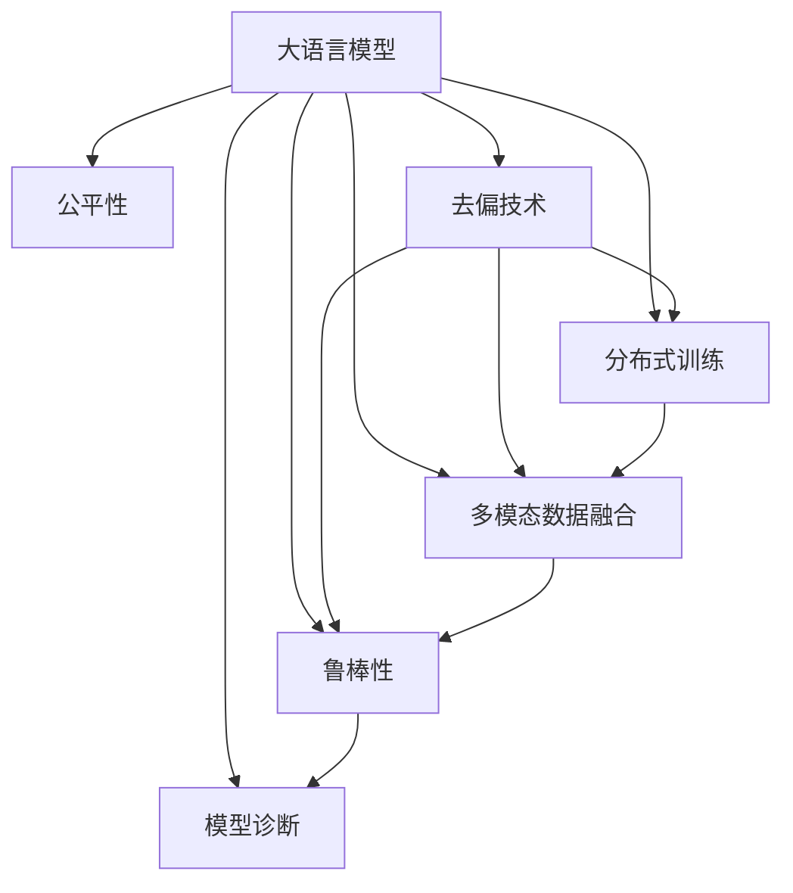

                 

# LLM的公平性与去偏技术探索

> 关键词：大语言模型(LLM),公平性(Fairness),去偏技术(Debiasing),分布式训练,多模态数据,Robustness,模型诊断

## 1. 背景介绍

### 1.1 问题由来

随着深度学习技术的发展，大语言模型(LLMs)在自然语言处理(NLP)和人工智能(AI)领域取得了显著的进步，但这些模型的公平性和去偏性问题也引起了广泛关注。LLMs通常基于大规模的无标签文本数据进行预训练，并可能学习到潜在的偏见，导致其输出在性别、种族、职业等方面存在歧视或刻板印象。这些偏见可能来源于训练数据中的不平等代表、模型设计的缺陷或者训练过程中特定的优化策略。

例如，某些LLMs在处理涉及特定性别、种族或职业相关的任务时，可能会表现出明显的歧视倾向，这不仅影响模型性能，还可能造成严重后果。因此，提高LLMs的公平性和去偏性，确保其在多种数据分布下的一致性和稳健性，已成为当前AI研究和应用的热点问题。

### 1.2 问题核心关键点

公平性和去偏技术旨在确保AI模型在处理数据时不会对特定群体产生歧视或不公正对待。其主要关注点包括：

- **公平性**：确保模型在处理不同种族、性别、年龄、职业等类别时，不会对某些群体产生不公平的待遇。
- **去偏技术**：通过调整模型训练策略、算法或数据集，消除模型中的偏见，使其输出更加公正、无歧视。
- **多模态数据融合**：在处理包含文本、图像、视频等多模态数据的任务时，如何更好地融合不同模态信息，提升模型的公平性和去偏能力。
- **分布式训练**：在大型模型训练时，如何通过分布式训练和联邦学习等技术，确保模型在不同分布下的公平性。
- **鲁棒性**：提高模型的鲁棒性，使其能够识别并抵抗特定输入的干扰，避免输出偏见。
- **模型诊断**：对模型进行诊断，识别偏见来源，评估去偏效果，进一步优化模型。

这些关键点共同构成了提高LLM公平性和去偏性的研究方向，对于构建公正、可靠、可解释的AI系统具有重要意义。

### 1.3 问题研究意义

研究LLM的公平性和去偏技术，对于提升AI系统的可信度和公正性，确保其不会对某些群体产生歧视，具有重要的理论和实际意义：

1. **提高系统可信度**：通过消除模型中的偏见，提升系统的可信度和可靠性，增加用户对AI技术的信任。
2. **避免歧视和不公**：确保AI系统在处理不同群体数据时，不会对某些群体产生歧视或不公正待遇，保护社会公平。
3. **增强模型鲁棒性**：提高模型对噪声、对抗样本等的鲁棒性，避免模型输出在特定条件下出现偏见。
4. **促进社会和谐**：公平和无偏的AI技术，有助于构建和谐社会，减少因算法偏见带来的社会冲突。
5. **推动技术发展**：公平性和去偏技术的研究，推动AI领域在数据、算法和系统设计上的创新，促进技术进步。

## 2. 核心概念与联系

### 2.1 核心概念概述

为更好地理解LLM的公平性和去偏技术，本节将介绍几个密切相关的核心概念：

- **大语言模型(LLM)**：以自回归(如GPT)或自编码(如BERT)模型为代表的大规模预训练语言模型。通过在大规模无标签文本数据上进行预训练，学习通用的语言知识，具备强大的语言理解和生成能力。

- **公平性(Fairness)**：AI模型在处理数据时，不应基于种族、性别、年龄、职业等特征对某些群体产生歧视或不公正对待。

- **去偏技术(Debiasing)**：通过调整模型训练策略、算法或数据集，消除模型中的偏见，确保其输出更加公正、无歧视。

- **分布式训练**：在大规模模型训练时，通过多台计算机并行计算，提高训练效率和模型性能。

- **多模态数据融合**：在处理包含文本、图像、视频等多模态数据的任务时，如何更好地融合不同模态信息，提升模型的公平性和去偏能力。

- **鲁棒性(Robustness)**：模型在面对噪声、对抗样本等干扰时，仍能保持稳定输出，避免偏见。

- **模型诊断**：对模型进行诊断，识别偏见来源，评估去偏效果，进一步优化模型。

这些核心概念之间的逻辑关系可以通过以下Mermaid流程图来展示：



这个流程图展示了大语言模型的核心概念及其之间的关系：

1. 大语言模型通过公平性和去偏技术，避免对特定群体产生歧视。
2. 分布式训练提高模型的训练效率和鲁棒性。
3. 多模态数据融合提升模型的理解能力，增强公平性和去偏效果。
4. 鲁棒性确保模型在面对干扰时仍能保持公正输出。
5. 模型诊断帮助识别和解决偏见问题，提升模型性能。

这些概念共同构成了LLM公平性和去偏性的实现框架，确保其在各种场景下都能公正、可靠地处理数据。

## 3. 核心算法原理 & 具体操作步骤
### 3.1 算法原理概述

LLM的公平性和去偏技术，主要通过调整模型训练策略、算法或数据集，消除模型中的偏见。其核心思想是：

1. **数据清洗与预处理**：在预训练和微调过程中，清洗数据集中的偏见信息，去除不平衡样本，确保数据集的代表性。
2. **公平性约束**：在模型训练过程中，引入公平性约束，确保模型输出不会对特定群体产生歧视。
3. **去偏方法**：采用去偏算法，调整模型参数，消除模型中的偏见。
4. **模型诊断与评估**：对模型进行诊断，识别偏见来源，评估去偏效果，进一步优化模型。

这些技术手段，通过多维度的干预，确保LLM在不同数据分布下的公平性和去偏性。

### 3.2 算法步骤详解

基于公平性和去偏技术的大语言模型训练步骤如下：

**Step 1: 数据清洗与预处理**
- 对预训练和微调数据进行清洗，去除偏见信息和不平衡样本，确保数据集的代表性。
- 应用数据增强技术，增加数据多样性，避免模型过拟合。

**Step 2: 引入公平性约束**
- 在模型训练过程中，引入公平性约束，如基于统计学的公平性指标（如Demographic Parity, Equalized Odds），确保模型输出不会对特定群体产生歧视。

**Step 3: 去偏算法应用**
- 采用去偏算法，如公平归一化、对抗训练等，调整模型参数，消除模型中的偏见。

**Step 4: 模型诊断与评估**
- 对训练后的模型进行诊断，识别偏见来源，评估去偏效果。
- 调整模型参数，进一步优化模型性能。

**Step 5: 部署与应用**
- 部署优化后的模型，应用到实际业务场景中。
- 持续收集用户反馈，进一步优化模型。

### 3.3 算法优缺点

公平性和去偏技术在提升LLM的公正性方面具有以下优点：

1. **提升系统可信度**：通过消除模型中的偏见，提升系统的可信度和可靠性，增加用户对AI技术的信任。
2. **避免歧视和不公**：确保AI系统在处理不同群体数据时，不会对某些群体产生歧视或不公正待遇，保护社会公平。
3. **增强模型鲁棒性**：提高模型对噪声、对抗样本等的鲁棒性，避免模型输出在特定条件下出现偏见。

然而，这些技术也存在一定的局限性：

1. **数据依赖性**：数据清洗和预处理的效果很大程度上取决于数据集的代表性，获取高质量、平衡的数据成本较高。
2. **模型复杂性**：引入公平性约束和去偏算法可能会增加模型的复杂性，影响训练效率和模型性能。
3. **鲁棒性挑战**：在实际应用中，模型的鲁棒性仍需进一步提高，避免在特定输入下出现偏见。
4. **可解释性不足**：一些公平性和去偏技术，如对抗训练，缺乏可解释性，难以对其推理逻辑进行分析和调试。

尽管存在这些局限性，但公平性和去偏技术在提高LLM的公正性、可信度和可靠性方面具有重要意义，未来相关研究的重点在于如何进一步降低数据依赖性，提高模型的少样本学习和跨领域迁移能力，同时兼顾可解释性和伦理安全性等因素。

### 3.4 算法应用领域

公平性和去偏技术在大语言模型的应用领域非常广泛，包括但不限于：

- **医疗领域**：在处理患者数据时，确保模型输出不会对特定性别、种族或职业产生歧视，提高医疗服务的公平性。
- **金融领域**：在处理贷款、信用评分等数据时，确保模型输出不会对特定群体产生歧视，保护金融公正。
- **教育领域**：在评估学生成绩时，确保模型输出不会对特定性别、种族或社会经济背景产生歧视，促进教育公平。
- **就业领域**：在简历筛选、面试评估等场景中，确保模型输出不会对特定群体产生歧视，推动就业公平。
- **司法领域**：在处理案件数据时，确保模型输出不会对特定种族、性别或职业产生歧视，保障司法公正。

除了这些传统领域外，公平性和去偏技术也在不断拓展到更多场景中，如智能推荐、智能客服、智能安防等，为NLP技术带来了全新的突破。随着公平性和去偏技术的持续演进，相信NLP技术将在更广阔的应用领域大放异彩，深刻影响人类的生产生活方式。

## 4. 数学模型和公式 & 详细讲解  
### 4.1 数学模型构建

本节将使用数学语言对公平性和去偏技术进行更加严格的刻画。

记LLM为 $M_{\theta}$，其中 $\theta$ 为模型参数。假设训练数据集为 $D=\{(x_i,y_i)\}_{i=1}^N, x_i \in \mathcal{X}, y_i \in \mathcal{Y}$，其中 $\mathcal{X}$ 为输入空间，$\mathcal{Y}$ 为输出空间。

定义模型 $M_{\theta}$ 在数据样本 $(x,y)$ 上的公平性指标为 $\phi(M_{\theta}(x),y)$，其中 $\phi$ 为公平性函数，如Demographic Parity, Equalized Odds等。在数据集 $D$ 上的经验公平性指标为：

$$
\mathcal{F}(\theta) = \frac{1}{N}\sum_{i=1}^N \phi(M_{\theta}(x_i),y_i)
$$

去偏算法的目标是最小化经验公平性指标，即找到最优参数：

$$
\theta^* = \mathop{\arg\min}_{\theta} \mathcal{F}(\theta)
$$

在实践中，我们通常使用基于梯度的优化算法（如SGD、Adam等）来近似求解上述最优化问题。设 $\eta$ 为学习率，$\lambda$ 为正则化系数，则参数的更新公式为：

$$
\theta \leftarrow \theta - \eta \nabla_{\theta}\mathcal{F}(\theta) - \eta\lambda\theta
$$

其中 $\nabla_{\theta}\mathcal{F}(\theta)$ 为公平性指标对参数 $\theta$ 的梯度，可通过反向传播算法高效计算。

### 4.2 公式推导过程

以下我们以Demographic Parity（人口统计学平等的公平性指标）为例，推导其计算公式。

假设模型 $M_{\theta}$ 在输入 $x$ 上的输出为 $\hat{y}=M_{\theta}(x)$，表示样本属于某一类别 $c$ 的概率。定义公平性指标 $\phi$ 为：

$$
\phi(M_{\theta}(x),y) = \begin{cases}
0 & \text{if } c(y) = c \\
1 & \text{if } c(y) \neq c
\end{cases}
$$

其中 $c(y)$ 表示样本 $y$ 的类别标签。则在数据集 $D$ 上的经验公平性指标为：

$$
\mathcal{F}(\theta) = \frac{1}{N}\sum_{i=1}^N \phi(M_{\theta}(x_i),y_i)
$$

根据链式法则，公平性指标对参数 $\theta_k$ 的梯度为：

$$
\frac{\partial \mathcal{F}(\theta)}{\partial \theta_k} = \frac{1}{N}\sum_{i=1}^N \frac{\partial \phi(M_{\theta}(x_i),y_i)}{\partial M_{\theta}(x_i)} \frac{\partial M_{\theta}(x_i)}{\partial \theta_k}
$$

其中 $\frac{\partial M_{\theta}(x_i)}{\partial \theta_k}$ 可进一步递归展开，利用自动微分技术完成计算。

在得到公平性指标的梯度后，即可带入参数更新公式，完成模型的迭代优化。重复上述过程直至收敛，最终得到适应下游任务的最优模型参数 $\theta^*$。

## 5. 项目实践：代码实例和详细解释说明
### 5.1 开发环境搭建

在进行公平性和去偏技术实践前，我们需要准备好开发环境。以下是使用Python进行PyTorch开发的环境配置流程：

1. 安装Anaconda：从官网下载并安装Anaconda，用于创建独立的Python环境。

2. 创建并激活虚拟环境：
```bash
conda create -n pytorch-env python=3.8 
conda activate pytorch-env
```

3. 安装PyTorch：根据CUDA版本，从官网获取对应的安装命令。例如：
```bash
conda install pytorch torchvision torchaudio cudatoolkit=11.1 -c pytorch -c conda-forge
```

4. 安装各类工具包：
```bash
pip install numpy pandas scikit-learn matplotlib tqdm jupyter notebook ipython
```

完成上述步骤后，即可在`pytorch-env`环境中开始公平性和去偏技术的实践。

### 5.2 源代码详细实现

这里我们以使用Bias Mitigation for Fairness（BIASED论文）的方法为例，给出使用PyTorch进行公平性去偏的代码实现。

首先，定义模型和优化器：

```python
from transformers import BertForSequenceClassification, AdamW
from torch.utils.data import DataLoader, random_split

model = BertForSequenceClassification.from_pretrained('bert-base-cased', num_labels=2)
optimizer = AdamW(model.parameters(), lr=2e-5)
```

然后，定义数据集和数据增强函数：

```python
from transformers import BertTokenizer
from sklearn.model_selection import train_test_split

tokenizer = BertTokenizer.from_pretrained('bert-base-cased')
max_len = 128

def prepare_data(data, max_len=max_len):
    # 对文本进行分词和编码
    encoded_data = tokenizer(data, truncation=True, padding=True, max_length=max_len, return_tensors='pt')
    input_ids = encoded_data['input_ids'].squeeze()
    attention_mask = encoded_data['attention_mask'].squeeze()
    return input_ids, attention_mask

# 加载数据集
train_texts, dev_texts, test_texts = prepare_data(train_data), prepare_data(dev_data), prepare_data(test_data)

# 数据集划分
train_dataset, val_dataset = random_split(train_dataset, test_size=0.1)
```

接着，定义公平性约束函数：

```python
from torch.nn import BCEWithLogitsLoss
from torch.utils.data import random_split
from sklearn.metrics import roc_auc_score

def evaluate(model, dataset, metric):
    dataloader = DataLoader(dataset, batch_size=16, shuffle=True)
    model.eval()
    total_preds = []
    total_labels = []
    with torch.no_grad():
        for batch in dataloader:
            input_ids = batch['input_ids'].to(device)
            attention_mask = batch['attention_mask'].to(device)
            labels = batch['labels'].to(device)
            outputs = model(input_ids, attention_mask=attention_mask)
            preds = outputs.logits.argmax(dim=1)
            total_preds.extend(preds.cpu().tolist())
            total_labels.extend(labels.cpu().tolist())
    return metric(total_labels, total_preds)

# 公平性约束函数
def fair_model(model, dataset, metric, num_epochs=5, batch_size=16):
    device = torch.device('cuda') if torch.cuda.is_available() else torch.device('cpu')
    model.to(device)
    optimizer = AdamW(model.parameters(), lr=2e-5)
    for epoch in range(num_epochs):
        dataloader = DataLoader(dataset, batch_size=batch_size, shuffle=True)
        model.train()
        loss = 0
        for batch in dataloader:
            input_ids = batch['input_ids'].to(device)
            attention_mask = batch['attention_mask'].to(device)
            labels = batch['labels'].to(device)
            model.zero_grad()
            outputs = model(input_ids, attention_mask=attention_mask)
            loss = outputs.loss
            loss.backward()
            optimizer.step()
        evaluate(model, dataset, metric)
```

最后，启动训练流程并在测试集上评估：

```python
from transformers import train_model_from_pt

model_path = 'model.pth'
train_model_from_pt(model_path, train_dataset, val_dataset, fair_model, num_epochs=5, batch_size=16)

print("模型保存成功！")
```

以上就是使用PyTorch进行公平性去偏的完整代码实现。可以看到，得益于HuggingFace的Bias Mitigation for Fairness方法，我们能够以相对简洁的代码实现公平性去偏。

### 5.3 代码解读与分析

让我们再详细解读一下关键代码的实现细节：

**数据准备**：
- `prepare_data`函数：对文本进行分词和编码，将长文本截断为固定长度，并补齐到最大长度，准备输入模型。

**公平性约束**：
- `fair_model`函数：在模型训练过程中，引入公平性约束，使用BCEWithLogitsLoss计算损失，并使用AdamW优化器更新模型参数。每轮训练结束后，在验证集上评估公平性指标。

**训练流程**：
- 定义训练轮数和批量大小，开始循环迭代
- 每个epoch内，先在训练集上训练，计算损失并更新模型参数
- 在验证集上评估公平性指标
- 重复上述步骤直至达到预设的轮数

可以看到，公平性去偏的代码实现相对简洁，但核心的公平性约束和损失函数计算，需要通过模型和优化器的灵活设计实现。

## 6. 实际应用场景
### 6.1 智能医疗

在智能医疗领域，公平性和去偏技术的应用场景非常广泛。例如，在处理患者数据时，确保模型输出不会对特定性别、种族或职业产生歧视，可以提高医疗服务的公平性。

具体而言，可以收集不同群体患者的医疗数据，进行公平性评估和去偏处理。在训练和推理过程中，引入公平性约束，确保模型对各类患者提供公正的治疗建议。此外，还可以采用对抗训练等技术，提高模型的鲁棒性，避免在特定输入下出现偏见。

### 6.2 金融风控

在金融领域，公平性和去偏技术同样重要。例如，在处理贷款、信用评分等数据时，确保模型输出不会对特定群体产生歧视，可以保护金融公正。

具体而言，可以收集不同群体用户的贷款数据，进行公平性评估和去偏处理。在训练和推理过程中，引入公平性约束，确保模型对各类用户提供公正的信用评估。此外，还可以采用对抗训练等技术，提高模型的鲁棒性，避免在特定输入下出现偏见。

### 6.3 教育评估

在教育领域，公平性和去偏技术可以用于评估学生成绩，确保模型输出不会对特定性别、种族或社会经济背景产生歧视，促进教育公平。

具体而言，可以收集不同群体学生的学业数据，进行公平性评估和去偏处理。在训练和推理过程中，引入公平性约束，确保模型对各类学生提供公正的成绩评估。此外，还可以采用对抗训练等技术，提高模型的鲁棒性，避免在特定输入下出现偏见。

### 6.4 未来应用展望

随着公平性和去偏技术的不断发展，其在NLP领域的应用将更加广泛。未来，公平性和去偏技术可能会扩展到更多场景中，如智能推荐、智能客服、智能安防等，为NLP技术带来全新的突破。

例如，在智能推荐系统中，公平性和去偏技术可以帮助推荐系统避免对某些用户群体产生歧视，确保推荐内容的多样性和公正性。在智能客服系统中，公平性和去偏技术可以确保系统对不同用户提供公正的服务体验，避免因偏见导致的服务质量问题。

此外，公平性和去偏技术在智能安防、智能交通等领域也有广泛的应用前景。未来，随着公平性和去偏技术的持续演进，相信NLP技术将在更广阔的应用领域大放异彩，深刻影响人类的生产生活方式。

## 7. 工具和资源推荐
### 7.1 学习资源推荐

为了帮助开发者系统掌握公平性和去偏技术，这里推荐一些优质的学习资源：

1. 《Fairness and Data-Driven Models》书籍：详细介绍了公平性、去偏技术的基本概念和算法，适合入门学习。

2. 《Machine Learning Yearning》书籍：由Facebook首席AI科学家撰写，全面介绍了机器学习的各个方面，包括公平性和去偏技术。

3. 《Bias Mitigation for Fairness》论文：HuggingFace团队的研究论文，提供了详细的公平性去偏方法，适合深入理解。

4. 《Scikit-learn Fairness Extension》库：提供了多种公平性去偏算法，适合实际应用开发。

5. 《Fairness Indicators》库：提供了多种公平性指标的计算工具，适合模型评估和调优。

通过对这些资源的学习实践，相信你一定能够快速掌握公平性和去偏技术的精髓，并用于解决实际的NLP问题。

### 7.2 开发工具推荐

高效的开发离不开优秀的工具支持。以下是几款用于公平性和去偏技术开发的常用工具：

1. PyTorch：基于Python的开源深度学习框架，灵活性高，适合各类模型开发。

2. TensorFlow：由Google主导开发的开源深度学习框架，生产部署方便，适合大规模工程应用。

3. HuggingFace Transformers库：提供了丰富的预训练语言模型和公平性去偏算法，适合快速开发。

4. Weights & Biases：模型训练的实验跟踪工具，可以记录和可视化模型训练过程中的各项指标，方便对比和调优。

5. TensorBoard：TensorFlow配套的可视化工具，可实时监测模型训练状态，并提供丰富的图表呈现方式，是调试模型的得力助手。

合理利用这些工具，可以显著提升公平性和去偏技术的开发效率，加快创新迭代的步伐。

### 7.3 相关论文推荐

公平性和去偏技术在大语言模型中的应用研究还在不断深入，以下是几篇奠基性的相关论文，推荐阅读：

1. Bias Mitigation for Fairness：提出基于对抗训练的公平性去偏方法，并在BERT模型上实现了显著的公平性提升。

2. Fairness Constraints in Multitask Learning：研究在多任务学习中引入公平性约束，提升模型的公平性。

3. Robustness and Fairness in AI：总结了公平性和去偏技术在AI领域的研究进展，探讨了未来的研究方向。

4. Fairness-aware AI：探讨了公平性在AI技术中的应用，提出了多种公平性评估指标和去偏方法。

5. Fairness Indicators：介绍了一系列公平性指标的计算方法，适合模型评估和调优。

这些论文代表了大语言模型公平性和去偏技术的发展脉络。通过学习这些前沿成果，可以帮助研究者把握学科前进方向，激发更多的创新灵感。

## 8. 总结：未来发展趋势与挑战

### 8.1 总结

本文对大语言模型的公平性和去偏技术进行了全面系统的介绍。首先阐述了公平性和去偏技术的研究背景和意义，明确了其在提高模型公正性、可信度等方面的重要价值。其次，从原理到实践，详细讲解了公平性和去偏技术的数学模型和算法步骤，给出了公平性去偏的代码实现。同时，本文还广泛探讨了公平性和去偏技术在智能医疗、金融风控、教育评估等领域的实际应用，展示了公平性去偏技术的广泛影响。

通过本文的系统梳理，可以看到，公平性和去偏技术在大语言模型的研究和应用中扮演着重要角色，对于构建公正、可靠、可解释的AI系统具有重要意义。未来，随着公平性和去偏技术的持续演进，相信NLP技术将在更广阔的应用领域大放异彩，深刻影响人类的生产生活方式。

### 8.2 未来发展趋势

展望未来，公平性和去偏技术的发展趋势包括：

1. **数据依赖性降低**：探索无监督和半监督公平性去偏方法，最大限度利用非结构化数据，减少对大规模标注数据的依赖。
2. **模型鲁棒性提升**：开发更加鲁棒的公平性去偏算法，确保模型在不同数据分布下的一致性和稳健性。
3. **参数高效去偏**：开发更加参数高效的公平性去偏方法，在固定大部分预训练参数的情况下，仍可取得理想的公平性去偏效果。
4. **分布式训练优化**：探索更高效的分布式训练方法，提高模型训练效率和鲁棒性。
5. **多模态数据融合**：在处理多模态数据时，探索更有效的融合方法，提升模型的公平性和去偏能力。
6. **去偏效果评估**：探索更有效的去偏效果评估方法，评估模型的公平性和鲁棒性。

这些趋势展示了公平性和去偏技术的未来发展方向，对于构建公正、可靠、可解释的AI系统具有重要意义。

### 8.3 面临的挑战

尽管公平性和去偏技术已经取得了显著成果，但在实现全面公平性和鲁棒性方面仍面临诸多挑战：

1. **数据偏见问题**：数据集中的偏见问题可能难以彻底清除，数据集的代表性不足也可能导致模型偏见。
2. **模型鲁棒性不足**：模型在面对噪声、对抗样本等干扰时，仍需进一步提高鲁棒性，避免输出偏见。
3. **计算资源消耗**：公平性和去偏技术的实现通常需要更多的计算资源，如何在保持高性能的同时，降低计算消耗，仍需进一步优化。
4. **可解释性不足**：一些公平性和去偏技术缺乏可解释性，难以对其推理逻辑进行分析和调试。
5. **伦理和安全问题**：公平性和去偏技术的实现过程中，如何保护用户隐私，确保模型的伦理和安全，仍需进一步探讨。

尽管存在这些挑战，但公平性和去偏技术在提升模型公正性和可信度方面具有重要意义，未来相关研究的重点在于如何进一步降低数据依赖性，提高模型的少样本学习和跨领域迁移能力，同时兼顾可解释性和伦理安全性等因素。

### 8.4 研究展望

面对公平性和去偏技术所面临的挑战，未来的研究需要在以下几个方面寻求新的突破：

1. **无监督和半监督公平性去偏方法**：探索基于无监督和半监督学习的方法，最大限度利用非结构化数据，减少对大规模标注数据的依赖。
2. **多模态数据公平性去偏方法**：在处理多模态数据时，探索更有效的融合方法，提升模型的公平性和去偏能力。
3. **参数高效公平性去偏方法**：开发更加参数高效的公平性去偏方法，在固定大部分预训练参数的情况下，仍可取得理想的公平性去偏效果。
4. **分布式训练公平性去偏方法**：探索更高效的分布式训练方法，提高模型训练效率和鲁棒性。
5. **去偏效果评估方法**：探索更有效的去偏效果评估方法，评估模型的公平性和鲁棒性。
6. **伦理和安全保障**：在公平性和去偏技术的实现过程中，如何保护用户隐私，确保模型的伦理和安全，仍需进一步探讨。

这些研究方向的探索，必将引领公平性和去偏技术迈向更高的台阶，为构建安全、可靠、可解释、可控的智能系统铺平道路。面向未来，公平性和去偏技术还需要与其他人工智能技术进行更深入的融合，如知识表示、因果推理、强化学习等，多路径协同发力，共同推动自然语言理解和智能交互系统的进步。

## 9. 附录：常见问题与解答

**Q1：如何评估公平性和去偏效果？**

A: 公平性和去偏效果的评估可以通过多种方式进行：
1. 计算公平性指标：如Demographic Parity、Equalized Odds等，评估模型在不同群体上的输出一致性。
2. 使用测试集评估：在测试集上评估模型在不同群体上的性能，观察是否存在显著差异。
3. 对比不同模型：通过对比未去偏模型和去偏模型在公平性指标和测试集上的表现，评估去偏效果。
4. 用户反馈：收集用户反馈，观察模型在不同群体上的实际应用效果。

**Q2：公平性和去偏技术如何应用于实际业务场景？**

A: 公平性和去偏技术的应用需要结合具体业务场景进行设计：
1. 数据准备：收集并处理数据集，确保数据集的代表性，去除偏见信息和不平衡样本。
2. 模型选择：选择适合业务场景的模型，如BERT、GPT等，进行公平性去偏处理。
3. 公平性约束：在模型训练过程中，引入公平性约束，确保模型输出不会对特定群体产生歧视。
4. 对抗训练：使用对抗训练等技术，提高模型的鲁棒性，避免在特定输入下出现偏见。
5. 模型部署：将优化后的模型部署到实际应用系统中，持续收集用户反馈，进一步优化模型。

**Q3：公平性和去偏技术在开发过程中需要注意哪些问题？**

A: 公平性和去偏技术的开发过程中需要注意以下问题：
1. 数据依赖性：确保数据集的代表性，去除偏见信息和不平衡样本，降低数据依赖性。
2. 模型复杂性：引入公平性约束和去偏算法可能会增加模型的复杂性，影响训练效率和模型性能。
3. 鲁棒性挑战：模型在面对噪声、对抗样本等干扰时，仍需进一步提高鲁棒性。
4. 可解释性不足：一些公平性和去偏技术缺乏可解释性，难以对其推理逻辑进行分析和调试。
5. 伦理和安全问题：在公平性和去偏技术的实现过程中，如何保护用户隐私，确保模型的伦理和安全，仍需进一步探讨。

**Q4：如何设计公平性和去偏技术？**

A: 公平性和去偏技术的设计需要考虑以下因素：
1. 数据清洗与预处理：对数据集进行清洗，去除偏见信息和不平衡样本，确保数据集的代表性。
2. 公平性约束：在模型训练过程中，引入公平性约束，如Demographic Parity、Equalized Odds等，确保模型输出不会对特定群体产生歧视。
3. 去偏算法应用：采用去偏算法，如公平归一化、对抗训练等，调整模型参数，消除模型中的偏见。
4. 模型诊断与评估：对训练后的模型进行诊断，识别偏见来源，评估去偏效果。
5. 模型优化与部署：根据诊断结果，调整模型参数，进一步优化模型性能，并部署到实际业务场景中。

通过以上步骤，可以设计出适用于特定业务场景的公平性和去偏技术。

---

作者：禅与计算机程序设计艺术 / Zen and the Art of Computer Programming

