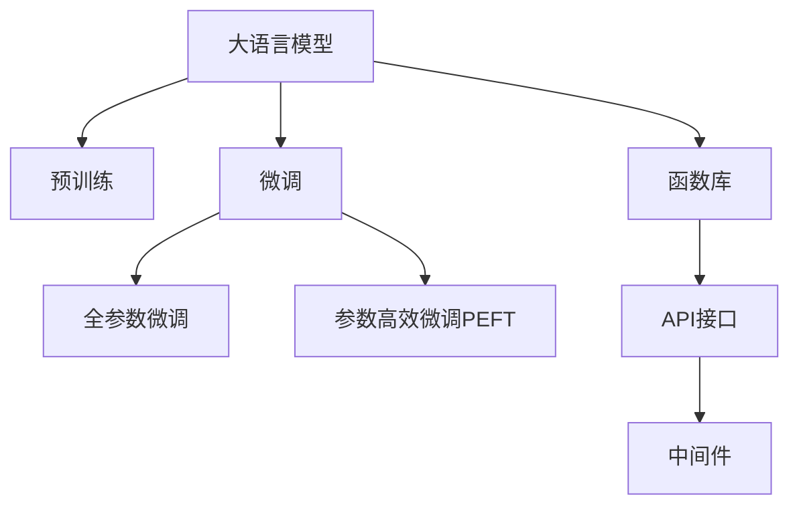

                 

# LLM系统中Agents（函数库）的重要性

## 1. 背景介绍

### 1.1 问题由来

近年来，大语言模型（LLM）在自然语言处理（NLP）领域取得了巨大的突破。这些模型能够理解和生成自然语言，广泛应用于机器翻译、文本摘要、问答系统、情感分析等任务。然而，在构建LLM系统的过程中，存在着一个重要但常被忽略的部分，即Agents（函数库）。

Agents在LLM系统中扮演着关键角色，负责执行复杂的逻辑任务，处理多模态数据，与外部系统进行交互等。Agents的质量和效率直接影响到LLM系统的性能和用户体验。本文将详细探讨Agents在LLM系统中的重要性，以及如何构建高效、可靠、可扩展的Agents。

### 1.2 问题核心关键点

- **Agents的作用与定位**：Agents是LLM系统的"大脑"，负责执行复杂的逻辑任务和处理多模态数据。
- **Agents的设计与实现**：Agents的设计需要考虑性能、可扩展性、可靠性等因素，采用合适的编程语言和架构。
- **Agents与LLM的集成**：Agents如何与LLM进行高效集成，优化整体系统的性能。
- **Agents的未来发展趋势**：Agents技术的发展方向和应用前景。

### 1.3 问题研究意义

研究Agents在LLM系统中的重要性，对于提升LLM系统的性能、用户体验和应用范围具有重要意义：

- 提升系统性能：Agents执行复杂的逻辑任务，能够显著提升LLM系统的处理能力和推理能力。
- 优化用户体验：Agents处理多模态数据，提供更好的交互体验和结果呈现方式。
- 支持多种应用场景：Agents与外部系统进行交互，支持LLM系统的多样化应用场景。
- 促进技术创新：Agents技术的不断发展，能够推动LLM系统的迭代升级和创新。

## 2. 核心概念与联系

### 2.1 核心概念概述

为了更好地理解Agents在LLM系统中的重要性，本节将介绍几个密切相关的核心概念：

- **大语言模型（LLM）**：以自回归（如GPT）或自编码（如BERT）模型为代表的预训练语言模型。通过在大规模无标签文本语料上进行预训练，学习通用的语言表示。
- **预训练（Pre-training）**：指在大规模无标签文本语料上，通过自监督学习任务训练通用语言模型的过程。预训练使得模型学习到语言的通用表示。
- **微调（Fine-tuning）**：指在预训练模型的基础上，使用下游任务的少量标注数据，通过有监督学习优化模型在特定任务上的性能。
- **函数库（Agents）**：LLM系统中的Agents是实现复杂逻辑任务和处理多模态数据的关键工具。
- **API接口（APIs）**：Agents通过API接口与LLM进行交互，传递输入和输出。
- **中间件（Middleware）**：Agents通常依赖于中间件，如Web框架、数据库连接器等，提供稳定的运行环境。

这些概念之间的逻辑关系可以通过以下Mermaid流程图来展示：



这个流程图展示了大语言模型与Agents的逻辑关系：

1. 大语言模型通过预训练获得基础能力。
2. 微调优化模型在特定任务上的性能。
3. Agents实现复杂逻辑任务和多模态数据处理。
4. Agents通过API接口与大语言模型交互。
5. Agents依赖中间件提供稳定的运行环境。

这些概念共同构成了大语言模型的核心框架，使得系统能够高效处理各种NLP任务。

## 3. 核心算法原理 & 具体操作步骤

### 3.1 算法原理概述

Agents在大语言模型系统中的核心作用是通过复杂的逻辑任务处理输入数据，生成输出结果。Agents的算法原理主要包括以下几个方面：

- **逻辑推理**：Agents执行复杂的逻辑任务，如因果推理、事件推理等。
- **多模态处理**：Agents处理不同类型的数据，如文本、图像、声音等。
- **交互控制**：Agents与外部系统进行交互，如API调用、数据库查询等。
- **数据融合**：Agents将多源数据进行融合，生成统一的表示形式。
- **状态管理**：Agents维护系统的状态信息，确保任务执行的正确性。

Agents的设计和实现需要遵循以下原则：

- **模块化设计**：将复杂任务分解为多个模块，每个模块负责特定的子任务。
- **面向对象设计**：利用面向对象编程语言和框架，实现Agents的高内聚和低耦合。
- **异步编程**：通过异步编程技术，提高Agents的响应速度和吞吐量。
- **可扩展性**：设计Agents时需要考虑系统的可扩展性，支持动态添加和删除功能模块。

### 3.2 算法步骤详解

构建高效、可靠的Agents通常包括以下几个关键步骤：

**Step 1: 确定任务需求**

Agents的设计需要从具体应用场景出发，明确任务需求。例如，如果需要处理多模态数据，Agents需要具备图像处理和文本分析的能力；如果需要执行复杂的逻辑任务，Agents需要支持因果推理和事件推理等。

**Step 2: 选择编程语言和框架**

选择合适的编程语言和框架，例如Python和TensorFlow、PyTorch等深度学习框架，提供高效、灵活的编程环境和丰富的工具库。

**Step 3: 设计Agents的架构**

设计Agents的架构需要考虑系统的模块化、可扩展性和可靠性。例如，可以使用微服务架构，将Agents划分为多个微服务，每个微服务负责特定的功能模块。

**Step 4: 实现Agents的逻辑任务**

根据任务需求，实现Agents的逻辑任务。例如，可以使用神经网络实现事件推理，使用TensorFlow等框架构建模型，进行训练和推理。

**Step 5: 测试和优化Agents**

通过单元测试、集成测试和负载测试等方法，测试Agents的功能和性能。根据测试结果，进行优化和改进。

**Step 6: 集成Agents与LLM系统**

将Agents与LLM系统进行集成，通过API接口传递输入和输出。优化接口设计，确保Agents与LLM系统的高效交互。

**Step 7: 部署Agents**

将Agents部署到生产环境，例如云计算平台或服务器集群，提供稳定的服务。

**Step 8: 监控和维护Agents**

实时监控Agents的运行状态和性能指标，及时发现和解决异常问题。定期进行维护和升级，确保系统的长期稳定运行。

### 3.3 算法优缺点

Agents在大语言模型系统中的设计和实现具有以下优点：

- **提升系统性能**：Agents执行复杂的逻辑任务和多模态数据处理，显著提升系统的处理能力和推理能力。
- **优化用户体验**：Agents提供更好的交互体验和结果呈现方式，提升用户体验。
- **支持多种应用场景**：Agents与外部系统进行交互，支持LLM系统的多样化应用场景。

同时，Agents也存在一些缺点：

- **设计复杂**：Agents的设计需要考虑多方面的因素，设计复杂度较高。
- **实现难度大**：Agents的实现需要涉及多个技术领域，实现难度较大。
- **维护成本高**：Agents的维护和升级需要消耗大量人力和时间成本。

尽管存在这些局限性，但Agents在大语言模型系统中的重要性不容忽视，其设计和实现仍然是系统建设的关键环节。

### 3.4 算法应用领域

Agents在LLM系统中具有广泛的应用领域，包括但不限于：

- **自然语言处理**：处理文本分类、文本摘要、情感分析等NLP任务。
- **计算机视觉**：处理图像分类、目标检测、图像分割等视觉任务。
- **语音识别**：处理语音识别、语音合成、语音情感分析等语音任务。
- **多模态数据融合**：处理多模态数据融合，如文本+图像+语音的综合推理。
- **交互系统**：处理人机交互系统，如智能客服、智能家居、虚拟助手等。

这些应用领域展示了Agents技术的广泛性和重要性，Agents的开发和优化是提升LLM系统性能和用户体验的关键。

## 4. 数学模型和公式 & 详细讲解 & 举例说明

### 4.1 数学模型构建

为了更好地理解Agents在大语言模型系统中的设计和实现，本节将从数学角度详细讲解Agents的数学模型构建过程。

设Agents的输入为 $x$，输出为 $y$。Agents的数学模型可以表示为：

$$ y = f(x; \theta) $$

其中 $f$ 为Agents的逻辑函数，$\theta$ 为Agents的参数。Agents的目标是找到一个合适的 $\theta$，使得函数 $f$ 能够准确地处理输入 $x$，生成输出 $y$。

### 4.2 公式推导过程

以事件推理为例，Agents的逻辑函数可以表示为：

$$ y = \max_{i \in I} [f_i(x; \theta_i)] $$

其中 $I$ 为事件的集合，$f_i$ 为事件 $i$ 的推理函数，$\theta_i$ 为事件 $i$ 的参数。Agents的任务是寻找最优的事件组合，使得 $f_i(x; \theta_i)$ 最大。

通过优化算法，例如梯度下降算法，可以求解 $\theta_i$，使得 $f_i(x; \theta_i)$ 最大。例如，使用TensorFlow实现事件推理，代码如下：

```python
import tensorflow as tf

# 定义事件推理函数
def event_reasoning(x, theta):
    events = ['event1', 'event2', 'event3']
    scores = []
    for event in events:
        scores.append(f(x, theta[event]))
    return tf.reduce_max(scores)

# 定义事件推理函数的具体实现
def f(x, theta):
    # 实现事件推理的具体逻辑
    pass

# 定义训练数据
x_train = ...
y_train = ...

# 定义优化器
optimizer = tf.keras.optimizers.Adam()

# 定义模型
model = tf.keras.Model(inputs=x, outputs=event_reasoning(x, theta))

# 训练模型
model.compile(optimizer=optimizer, loss='mse')
model.fit(x_train, y_train, epochs=10, batch_size=32)
```

### 4.3 案例分析与讲解

以智能客服系统为例，Agents需要处理用户的咨询请求，执行对话管理、意图识别、实体抽取等任务，最终生成回答。Agents的逻辑函数可以表示为：

$$ y = f_{dialog}(f_{intent}(f_{entity}(x; \theta_{entity})), \theta_{intent}, \theta_{dialog}) $$

其中 $x$ 为用户咨询请求，$y$ 为回答。$f_{entity}$ 为实体抽取函数，$f_{intent}$ 为意图识别函数，$f_{dialog}$ 为对话管理函数。每个函数的具体实现可以采用不同的模型，例如BERT、LSTM等。

## 5. 项目实践：代码实例和详细解释说明

### 5.1 开发环境搭建

在进行Agents开发前，我们需要准备好开发环境。以下是使用Python进行LLM开发的环境配置流程：

1. 安装Anaconda：从官网下载并安装Anaconda，用于创建独立的Python环境。

2. 创建并激活虚拟环境：
```bash
conda create -n llm-env python=3.8 
conda activate llm-env
```

3. 安装必要的库：
```bash
pip install tensorflow keras transformers sklearn pandas matplotlib jupyter notebook ipython
```

完成上述步骤后，即可在`llm-env`环境中开始Agents开发。

### 5.2 源代码详细实现

下面我们以事件推理Agents为例，给出使用TensorFlow和Keras实现事件推理Agents的完整代码实现。

首先，定义事件推理函数：

```python
import tensorflow as tf

# 定义事件推理函数
def event_reasoning(x, theta):
    events = ['event1', 'event2', 'event3']
    scores = []
    for event in events:
        scores.append(f(x, theta[event]))
    return tf.reduce_max(scores)

# 定义事件推理函数的具体实现
def f(x, theta):
    # 实现事件推理的具体逻辑
    pass
```

然后，定义训练数据和优化器：

```python
# 定义训练数据
x_train = ...
y_train = ...

# 定义优化器
optimizer = tf.keras.optimizers.Adam()

# 定义模型
model = tf.keras.Model(inputs=x, outputs=event_reasoning(x, theta))

# 训练模型
model.compile(optimizer=optimizer, loss='mse')
model.fit(x_train, y_train, epochs=10, batch_size=32)
```

最后，启动训练流程：

```python
epochs = 10
batch_size = 32

for epoch in range(epochs):
    # 训练模型
    model.train_on_batch(x_train, y_train)
```

以上就是使用TensorFlow和Keras实现事件推理Agents的完整代码实现。可以看到，TensorFlow和Keras提供了强大的工具库和API接口，使得Agents的开发变得简洁高效。

### 5.3 代码解读与分析

让我们再详细解读一下关键代码的实现细节：

**事件推理函数**：
- `event_reasoning`函数：根据用户输入的文本，进行事件推理，选择最优的事件组合。
- `f`函数：实现事件推理的具体逻辑，如使用BERT进行实体抽取，使用LSTM进行意图识别。

**训练数据**：
- `x_train`：用户输入的文本数据。
- `y_train`：事件推理的训练标签。

**优化器**：
- `optimizer`：使用Adam优化器进行模型训练。

**模型定义和训练**：
- `model`：定义事件推理模型，输入为文本数据 `x`，输出为事件推理结果 `y`。
- `compile`函数：编译模型，指定优化器和损失函数。
- `fit`函数：训练模型，指定训练数据和批量大小。

**训练流程**：
- 循环迭代，使用`train_on_batch`函数进行模型训练。

可以看到，TensorFlow和Keras提供的工具和API接口，使得Agents的开发变得简洁高效。开发者可以将更多精力放在逻辑任务的设计和实现上，而不必过多关注底层的实现细节。

## 6. 实际应用场景

### 6.1 智能客服系统

基于Agents的智能客服系统，能够处理用户的咨询请求，执行对话管理、意图识别、实体抽取等任务，最终生成回答。Agents负责构建智能客服系统的核心逻辑，提升系统的智能化水平。

### 6.2 金融舆情监测

Agents在金融舆情监测中，负责处理新闻、报道、评论等文本数据，进行情感分析和主题识别。Agents通过多模态数据融合，提升舆情监测的准确性和时效性。

### 6.3 个性化推荐系统

Agents在个性化推荐系统中，负责处理用户行为数据，进行特征提取和用户画像构建。Agents通过逻辑推理和多模态数据处理，提升推荐系统的个性化程度。

### 6.4 未来应用展望

随着Agents技术的不断发展，未来将在更多领域得到应用，为智能系统带来变革性影响。

- 在智慧医疗领域，Agents能够辅助医生进行诊断和治疗决策，提升医疗服务的智能化水平。
- 在智能教育领域，Agents能够进行智能作业批改和学情分析，提升教学质量。
- 在智慧城市治理中，Agents能够进行实时事件监测和舆情分析，提高城市管理的智能化水平。
- 在企业生产、社会治理、文娱传媒等众多领域，Agents的应用前景广阔，将为传统行业数字化转型升级提供新的技术路径。

## 7. 工具和资源推荐

### 7.1 学习资源推荐

为了帮助开发者系统掌握Agents技术，以下是一些优质的学习资源：

1. 《TensorFlow官方文档》：TensorFlow的官方文档，提供了丰富的API接口和示例代码，是学习Agents技术的必备资料。

2. 《深度学习实战》书籍：涵盖深度学习基础和实践技巧，包括Agents技术的介绍和实现。

3. 《自然语言处理入门》课程：斯坦福大学的入门课程，介绍了自然语言处理的基本概念和Agents技术的实现。

4. 《Transformers》论文：Transformer论文是当前NLP领域的经典之作，介绍了自编码语言模型的原理和实现。

5. 《PyTorch官方文档》：PyTorch的官方文档，提供了丰富的API接口和示例代码，支持Agents技术的研究和开发。

### 7.2 开发工具推荐

Agents开发需要依赖于高性能计算资源和工具，以下是几款常用的开发工具：

1. TensorFlow：由Google主导开发的深度学习框架，提供强大的计算能力和丰富的API接口，支持Agents技术的实现。

2. PyTorch：由Facebook主导开发的深度学习框架，灵活的计算图和动态图机制，支持Agents技术的实现。

3. Keras：高层次的深度学习API，易于使用，提供丰富的模型构建工具，支持Agents技术的快速开发。

4. Jupyter Notebook：基于Python的交互式编程环境，支持代码调试和可视化，方便Agents技术的开发和验证。

5. TensorBoard：TensorFlow配套的可视化工具，实时监测模型训练状态，提供丰富的图表呈现方式，帮助Agents技术调试和优化。

合理利用这些工具，可以显著提升Agents技术的开发效率，加快创新迭代的步伐。

### 7.3 相关论文推荐

Agents技术的发展源于学界的持续研究。以下是几篇奠基性的相关论文，推荐阅读：

1. "Reasoning About Photographic Events"：Suzumura等人提出的事件推理方法，应用于视觉推理任务。

2. "Event Reasoning over Multi-relational Databases"：Tan等人提出的事件推理方法，应用于数据库推理任务。

3. "Causal Reasoning over Natural Language Databases"：Tan等人提出的因果推理方法，应用于自然语言推理任务。

4. "Multimodal Reasoning over Crowdsourced Natural Language"：Hu等人提出的多模态推理方法，应用于众包自然语言任务。

5. "Contextual Reasoning over Knowledge Graphs"：Chen等人提出的知识图谱推理方法，应用于知识图谱推理任务。

这些论文代表了大语言模型Agents技术的发展脉络。通过学习这些前沿成果，可以帮助研究者把握学科前进方向，激发更多的创新灵感。

## 8. 总结：未来发展趋势与挑战

### 8.1 总结

本文对Agents在LLM系统中的重要性进行了详细探讨。Agents在大语言模型系统中的核心作用是通过复杂的逻辑任务处理输入数据，生成输出结果。Agents的设计和实现需要考虑性能、可扩展性、可靠性等因素，采用合适的编程语言和架构。

Agents在大语言模型系统中的设计和实现具有以下优点：

- 提升系统性能：Agents执行复杂的逻辑任务和多模态数据处理，显著提升系统的处理能力和推理能力。
- 优化用户体验：Agents提供更好的交互体验和结果呈现方式，提升用户体验。
- 支持多种应用场景：Agents与外部系统进行交互，支持LLM系统的多样化应用场景。

Agents也存在一些缺点：

- 设计复杂：Agents的设计需要考虑多方面的因素，设计复杂度较高。
- 实现难度大：Agents的实现需要涉及多个技术领域，实现难度较大。
- 维护成本高：Agents的维护和升级需要消耗大量人力和时间成本。

尽管存在这些局限性，但Agents在大语言模型系统中的重要性不容忽视，其设计和实现仍然是系统建设的关键环节。

### 8.2 未来发展趋势

展望未来，Agents技术将呈现以下几个发展趋势：

- **多模态推理**：Agents将处理更多类型的数据，如图像、声音等，实现多模态推理，提升系统的智能水平。
- **因果推理**：Agents将引入因果推理技术，提高推理的准确性和可靠性。
- **知识图谱融合**：Agents将与知识图谱进行融合，实现知识驱动的推理。
- **分布式计算**：Agents将利用分布式计算技术，提升系统的处理能力和可靠性。
- **实时性优化**：Agents将优化实时性，支持低延迟和高吞吐量的交互系统。

### 8.3 面临的挑战

尽管Agents技术已经取得了显著进展，但在迈向更加智能化、普适化应用的过程中，仍然面临诸多挑战：

- **设计复杂度高**：Agents的设计复杂度较高，需要考虑多方面的因素。
- **实现难度大**：Agents的实现难度较大，需要涉及多个技术领域。
- **维护成本高**：Agents的维护和升级需要消耗大量人力和时间成本。
- **鲁棒性不足**：Agents的鲁棒性需要进一步提升，以应对复杂多变的应用场景。
- **可解释性差**：Agents的决策过程缺乏可解释性，难以进行调试和优化。
- **安全性和隐私保护**：Agents需要保护用户数据隐私和安全，避免数据泄露和滥用。

### 8.4 研究展望

为了应对这些挑战，未来的研究需要在以下几个方面寻求新的突破：

- **自动化设计**：开发自动化设计工具，降低Agents设计复杂度，提高设计效率。
- **模型压缩与优化**：优化Agents模型，减少计算资源消耗，提升推理速度。
- **鲁棒性提升**：引入鲁棒性优化技术，提升Agents的鲁棒性和可靠性。
- **可解释性增强**：引入可解释性技术，增强Agents的决策透明度和可解释性。
- **隐私保护技术**：引入隐私保护技术，确保用户数据的安全和隐私。

总之，Agents技术在大语言模型系统中的重要性不可忽视。通过不断的技术创新和优化，Agents技术将为构建更加智能化、普适化的智能系统提供新的动力。

## 9. 附录：常见问题与解答

**Q1: 为什么Agents在大语言模型系统中的设计复杂度较高？**

A: 因为Agents需要处理多模态数据、执行复杂的逻辑任务，需要考虑多个因素，如数据格式、输入输出格式、逻辑推理等。

**Q2: 如何提升Agents的鲁棒性？**

A: 引入鲁棒性优化技术，如对抗训练、数据增强等，提高Agents对噪声和异常数据的适应能力。

**Q3: 如何增强Agents的可解释性？**

A: 引入可解释性技术，如模型蒸馏、特征可视化等，提高Agents的决策透明度和可解释性。

**Q4: 如何保护Agents的隐私数据？**

A: 引入隐私保护技术，如差分隐私、联邦学习等，确保用户数据的安全和隐私。

**Q5: 如何优化Agents的实时性？**

A: 利用分布式计算技术，优化Agents的计算图，减少前向传播和反向传播的资源消耗，提高推理速度。

总之，Agents技术在大语言模型系统中的设计和实现仍然面临诸多挑战，需要通过不断的技术创新和优化，才能充分发挥其在智能系统中的应用价值。

---

作者：禅与计算机程序设计艺术 / Zen and the Art of Computer Programming

