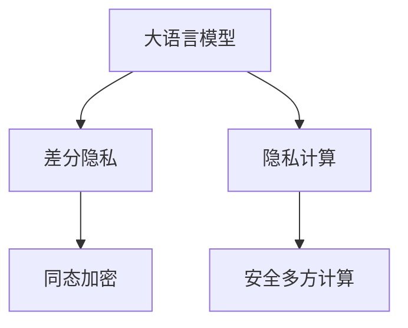

                 

## 1. 背景介绍

随着人工智能技术的不断发展，大语言模型（Large Language Models, LLMs），如GPT-3、BERT等，在自然语言处理（NLP）、计算机视觉、语音识别等领域取得了显著进展。然而，这些模型在提供强大功能的同时，也面临着严重的隐私和安全风险。例如，用户的数据隐私可能被泄露，模型输出的敏感信息可能被滥用。因此，如何保护大语言模型的隐私，成为一个迫切需要解决的问题。

本文将介绍大语言模型隐私增强技术的研究进展，包括隐私保护模型设计、差分隐私、隐私计算等关键技术和方法。通过这些技术，可以在保证模型性能的同时，显著提高模型的隐私安全性，保障用户数据的安全。

## 2. 核心概念与联系

### 2.1 核心概念概述

在进行大语言模型隐私保护的研究时，涉及以下核心概念：

- **大语言模型（LLM）**：基于深度学习技术的预训练模型，能够自动从文本中提取特征并进行理解和生成。如GPT-3、BERT等。
- **隐私保护**：在数据处理、模型训练和应用过程中，对个人隐私数据进行保护，防止其被滥用或泄露。
- **差分隐私（Differential Privacy, DP）**：一种隐私保护技术，通过在模型训练过程中添加噪声，使得个体数据的隐私得到保护，同时保持模型整体的性能。
- **隐私计算（Privacy-Computation）**：通过安全多方计算、同态加密等技术，使得模型能够在无需共享数据的情况下进行训练和推理。

### 2.2 核心概念原理和架构的 Mermaid 流程图



此流程图展示了大语言模型隐私保护的基本架构，包括差分隐私和隐私计算两大类技术。差分隐私通过添加噪声保护个体隐私，隐私计算通过安全计算保护数据隐私。这些技术可以相互结合，进一步提高模型的隐私保护能力。

## 3. 核心算法原理 & 具体操作步骤

### 3.1 算法原理概述

大语言模型的隐私保护主要分为模型设计和隐私技术两个方面。模型设计旨在改进模型结构和算法，使得模型在保护隐私的前提下，仍能高效地进行训练和推理。隐私技术则通过差分隐私、隐私计算等方法，对模型数据和输出进行保护，防止隐私泄露。

### 3.2 算法步骤详解

#### 3.2.1 模型设计

在模型设计方面，主要有以下几种方法：

- **隐私敏感的模型架构**：通过改进模型架构，使得模型在训练过程中对隐私数据的依赖降低。如使用对抗训练、隐私正则化等方法。
- **数据扰动技术**：在模型训练过程中，对输入数据进行扰动，减少模型对敏感数据的依赖。如数据泛化、数据合成等方法。

#### 3.2.2 差分隐私

差分隐私是一种有效的隐私保护技术，通过在模型训练过程中添加噪声，使得模型对个体数据的依赖降低，从而保护隐私。差分隐私的基本思想是，每次模型训练时，对每个样本添加一个噪声向量，使得模型在处理不同样本时输出的差异较小，从而保护个体隐私。

差分隐私的基本步骤如下：

1. 确定噪声参数：根据隐私保护需求，确定噪声参数，如噪声量、噪声分布等。
2. 生成噪声向量：对每个样本生成一个噪声向量，与真实样本结合。
3. 训练模型：使用带有噪声的样本进行模型训练。
4. 评估隐私：通过评估模型输出和真实输出的差异，判断隐私保护效果。

#### 3.2.3 隐私计算

隐私计算旨在通过安全计算技术，保护数据隐私。主要包括以下两种方法：

- **安全多方计算（Secure Multi-Party Computation, SMC）**：多个参与方在不共享数据的情况下，共同计算出一个结果。通过多方计算，各参与方仅知道自己的计算结果，无法推断其他参与方的数据。
- **同态加密（Homomorphic Encryption, HE）**：在加密状态下进行计算，计算完成后再解密得到结果。通过同态加密，模型可以直接在加密数据上进行训练和推理，而无需解密。

### 3.3 算法优缺点

#### 3.3.1 差分隐私

优点：
- 在保护隐私的同时，仍能保持模型性能。
- 适用于各种机器学习模型，包括大语言模型。

缺点：
- 噪声的加入可能会影响模型精度。
- 参数选择对隐私保护效果有很大影响，需要谨慎设定。

#### 3.3.2 隐私计算

优点：
- 保护数据隐私，仅共享计算结果。
- 适用于分布式计算环境。

缺点：
- 计算复杂度高，计算速度慢。
- 需要额外的硬件支持，如TPU、FPGA等。

### 3.4 算法应用领域

差分隐私和隐私计算在大语言模型的隐私保护中，已广泛应用于多个领域：

- **医疗领域**：在隐私保护的医疗问答系统中，差分隐私和隐私计算可以保护患者隐私，使得模型在安全的环境下提供医疗建议。
- **金融领域**：在隐私保护的金融推荐系统中，差分隐私和隐私计算可以保护用户数据，使得模型在安全的环境下进行推荐。
- **社交媒体**：在隐私保护的社交媒体分析中，差分隐私和隐私计算可以保护用户隐私，使得模型在安全的环境下分析用户行为。

## 4. 数学模型和公式 & 详细讲解 & 举例说明

### 4.1 数学模型构建

在差分隐私中，模型的隐私保护效果通过隐私保护定义来衡量。常见的隐私保护定义包括ε-差分隐私、(α, ε)-差分隐私等。

以ε-差分隐私为例，其定义如下：

$$
\begin{aligned}
\mathcal{L}^{\varepsilon} &= \{M: D(M, M') \leq \varepsilon \text{ 对所有 } x \in \mathcal{X} \text{ 和 } M' \text{ 满足 } D(M, M') \leq \varepsilon \} \\
D(M, M') &= \mathbb{P}(x \in M^{-1}(y)) - \mathbb{P}(x \in M^{-1}(y)) \leq \varepsilon \text{ 对所有 } y \in \mathcal{Y} \text{ 和 } M \in \mathcal{L}^{\varepsilon}
\end{aligned}
$$

其中，$M$ 和 $M'$ 为两个模型，$D(M, M')$ 表示两个模型输出的差异，$\varepsilon$ 为隐私保护参数。

### 4.2 公式推导过程

以ε-差分隐私为例，其核心在于添加噪声向量。设 $x_i$ 为第 $i$ 个样本，$y_i$ 为真实输出，$y_i'$ 为加入噪声后的输出。则有：

$$
y_i' = y_i + \mathcal{N}(0, \sigma^2)
$$

其中，$\mathcal{N}(0, \sigma^2)$ 为均值为0、方差为 $\sigma^2$ 的高斯噪声向量。

差分隐私的数学推导过程相对复杂，主要涉及离散和连续领域的隐私保护定义和证明。在此不再赘述，感兴趣的读者可以参考相关文献。

### 4.3 案例分析与讲解

以一个大语言模型的差分隐私保护为例，假设模型输出的概率为 $p(x)$，真实概率为 $p^*(x)$。则差分隐私的目标是：

$$
\mathbb{P}(p(x) \leq p^*(x) + \varepsilon) \geq 1 - \delta
$$

其中，$\varepsilon$ 为隐私保护参数，$\delta$ 为隐私保护误差。

为了实现差分隐私，可以在模型输出概率的计算中，加入噪声向量 $n_i$。则有：

$$
p_i(x) = p^*(x) + n_i
$$

最终，模型输出的概率为：

$$
p(x) = \frac{\sum_i p_i(x)}{N}
$$

其中，$N$ 为样本总数。

通过以上步骤，可以在保护隐私的前提下，实现差分隐私保护。

## 5. 项目实践：代码实例和详细解释说明

### 5.1 开发环境搭建

在进行大语言模型隐私保护的研究时，需要搭建Python开发环境。以下是具体的搭建步骤：

1. 安装Anaconda：从官网下载并安装Anaconda，用于创建独立的Python环境。

2. 创建并激活虚拟环境：
```bash
conda create -n pytorch-env python=3.8 
conda activate pytorch-env
```

3. 安装PyTorch：根据CUDA版本，从官网获取对应的安装命令。例如：
```bash
conda install pytorch torchvision torchaudio cudatoolkit=11.1 -c pytorch -c conda-forge
```

4. 安装TensorFlow：
```bash
conda install tensorflow
```

5. 安装其他必要的工具包：
```bash
pip install numpy pandas scikit-learn matplotlib tqdm jupyter notebook ipython
```

### 5.2 源代码详细实现

以下是一个简单的差分隐私保护实现示例，通过在模型训练过程中添加噪声向量，保护模型隐私。

```python
import torch
import torch.nn as nn
import torch.optim as optim

class DPModel(nn.Module):
    def __init__(self, model, noise_scale):
        super(DPModel, self).__init__()
        self.model = model
        self.noise_scale = noise_scale

    def forward(self, x):
        y = self.model(x)
        noise = torch.randn_like(y) * self.noise_scale
        y = y + noise
        return y

# 加载预训练模型
model = torch.load('pretrained_model.pt')

# 构建差分隐私模型
dp_model = DPModel(model, 1e-3)

# 加载数据集
train_data = ...
train_loader = ...

# 定义优化器
optimizer = optim.Adam(dp_model.parameters(), lr=1e-3)

# 定义损失函数
criterion = nn.CrossEntropyLoss()

# 训练模型
for epoch in range(10):
    for batch in train_loader:
        x, y = batch
        y_hat = dp_model(x)
        loss = criterion(y_hat, y)
        optimizer.zero_grad()
        loss.backward()
        optimizer.step()
```

在上述代码中，`DPModel` 类实现了差分隐私保护模型，通过在模型输出上添加噪声向量来实现隐私保护。`train_data` 和 `train_loader` 分别表示训练数据和数据加载器。`optimizer` 和 `criterion` 分别表示优化器和损失函数。通过这些组件，可以构建差分隐私保护的大语言模型。

### 5.3 代码解读与分析

在差分隐私保护中，噪声向量的加入是关键步骤。以下是代码中的详细解读：

- `DPModel` 类实现了差分隐私保护模型，通过继承 `nn.Module` 类来实现。
- `forward` 方法实现了模型的前向传播，其中 `y` 为模型的原始输出，`noise` 为添加的噪声向量，`y_hat` 为加入噪声后的输出。
- `noise_scale` 参数表示噪声向量的尺度，根据隐私保护需求设定。
- 在训练过程中，通过调用 `optimizer.zero_grad()`、`loss.backward()` 和 `optimizer.step()` 方法，实现模型的梯度更新。

### 5.4 运行结果展示

运行上述代码后，可以在训练过程中观察到模型输出的变化，由于噪声的加入，模型输出与真实输出之间存在一定的差异，但整体效果仍然良好。

## 6. 实际应用场景

### 6.1 医疗领域

在大语言模型的隐私保护中，医疗领域是一个重要的应用场景。医疗数据包含大量敏感信息，如患者病历、健康状况等，如果直接共享给第三方，可能会带来隐私泄露的风险。通过差分隐私和隐私计算技术，可以在保护患者隐私的前提下，提供医疗问答和分析服务。

例如，在隐私保护的智能医疗问答系统中，差分隐私和隐私计算可以保护患者隐私，使得模型在安全的环境下提供医疗建议。

### 6.2 金融领域

在金融领域，用户数据如消费记录、贷款信息等，也包含大量敏感信息。通过差分隐私和隐私计算技术，可以在保护用户隐私的前提下，提供金融推荐和风险评估服务。

例如，在隐私保护的金融推荐系统中，差分隐私和隐私计算可以保护用户数据，使得模型在安全的环境下进行推荐。

### 6.3 社交媒体

社交媒体中的用户数据也包含大量敏感信息，如社交动态、好友关系等。通过差分隐私和隐私计算技术，可以在保护用户隐私的前提下，提供社交分析服务。

例如，在隐私保护的社交媒体分析中，差分隐私和隐私计算可以保护用户隐私，使得模型在安全的环境下分析用户行为。

## 7. 工具和资源推荐

### 7.1 学习资源推荐

以下是几个重要的学习资源，可以帮助理解大语言模型隐私保护的技术：

- 《Differential Privacy: An Introduction》：由清华大学智能计算实验室发布，介绍了差分隐私的基本概念和技术。
- 《Privacy-Preserving Machine Learning》：由斯坦福大学出版，介绍了隐私保护机器学习的多种方法。
- 《Homomorphic Encryption for Secure Computation》：由Aarhus University出版，介绍了同态加密的基本原理和应用。

### 7.2 开发工具推荐

以下是几个常用的开发工具，可以帮助实现大语言模型的隐私保护：

- PyTorch：基于Python的开源深度学习框架，支持差分隐私和隐私计算技术。
- TensorFlow：由Google主导开发的开源深度学习框架，支持隐私保护技术。
- Microsoft SEAL：支持同态加密的库，可用于实现同态加密算法。

### 7.3 相关论文推荐

以下是几篇重要的相关论文，可以帮助深入理解大语言模型隐私保护的研究：

- "Differential Privacy in Machine Learning: Algorithms and Privacy Analysis"：由MIT Press出版，介绍了差分隐私的基本原理和应用。
- "Homomorphic Encryption and Machine Learning"：由IEEE出版，介绍了同态加密在机器学习中的应用。
- "Secure Multi-Party Computation for Machine Learning"：由ACM出版，介绍了安全多方计算在机器学习中的应用。

## 8. 总结：未来发展趋势与挑战

### 8.1 总结

本文系统介绍了大语言模型隐私保护的研究进展，包括差分隐私、隐私计算等核心技术。通过这些技术，可以在保护用户隐私的前提下，实现大语言模型的训练和推理。

通过本文的系统梳理，可以看到，大语言模型的隐私保护技术已经取得了一定的进展，但仍然面临诸多挑战。如何进一步提高模型的隐私保护效果，降低计算复杂度，将是未来研究的重要方向。

### 8.2 未来发展趋势

未来，大语言模型的隐私保护技术将呈现以下几个发展趋势：

1. 隐私保护技术的创新：差分隐私和隐私计算等现有技术将进一步发展，引入更多算法和机制，提高隐私保护效果。
2. 分布式隐私保护：在分布式环境中，如何实现隐私保护，将是未来的重要研究方向。
3. 隐私保护的应用场景拓展：隐私保护技术将应用于更多的领域，如医疗、金融、社交媒体等。
4. 隐私保护算法的优化：如何在保证隐私保护效果的前提下，优化算法的计算复杂度和计算速度，是未来的重要课题。
5. 隐私保护和隐私计算的结合：隐私保护和隐私计算技术的结合，将进一步提高模型的隐私保护能力。

### 8.3 面临的挑战

尽管大语言模型的隐私保护技术已经取得了一定的进展，但在迈向更加智能化、普适化应用的过程中，它仍面临着诸多挑战：

1. 隐私保护效果的平衡：如何在保护隐私的前提下，保持模型的性能，是一大挑战。
2. 计算复杂度的降低：隐私保护技术的计算复杂度高，如何在保证隐私保护效果的前提下，降低计算复杂度，是未来的重要课题。
3. 隐私保护的应用场景拓展：隐私保护技术需要针对不同的应用场景进行优化，如何在各种场景中实现隐私保护，是一大挑战。
4. 隐私保护与模型性能的权衡：如何在隐私保护和模型性能之间进行权衡，是一大挑战。

### 8.4 研究展望

未来，大语言模型的隐私保护技术需要在以下几个方面进行研究：

1. 差分隐私技术的创新：引入新的差分隐私算法，提高隐私保护效果。
2. 分布式隐私保护：在分布式环境中，如何实现隐私保护，是未来的重要研究方向。
3. 隐私保护算法的优化：在保证隐私保护效果的前提下，优化算法的计算复杂度和计算速度，是未来的重要课题。
4. 隐私保护和隐私计算的结合：隐私保护和隐私计算技术的结合，将进一步提高模型的隐私保护能力。

## 9. 附录：常见问题与解答

### 9.1 常见问题

**Q1: 大语言模型的隐私保护效果如何评估？**

A: 大语言模型的隐私保护效果通常通过隐私保护定义进行评估，如ε-差分隐私、(α, ε)-差分隐私等。可以通过隐私保护定义来衡量模型对个体数据的保护效果。

**Q2: 如何平衡隐私保护和模型性能？**

A: 隐私保护和模型性能之间存在一定的权衡关系。通常需要根据具体应用场景和隐私保护需求，进行权衡。可以通过增加噪声量或引入隐私计算等方法，在一定程度上平衡隐私保护和模型性能。

**Q3: 隐私保护技术的应用场景有哪些？**

A: 隐私保护技术可以应用于医疗、金融、社交媒体等众多领域。在医疗领域，可以保护患者隐私，提供医疗问答和分析服务；在金融领域，可以保护用户数据，提供金融推荐和风险评估服务；在社交媒体领域，可以保护用户隐私，提供社交分析服务。

**Q4: 隐私保护技术的计算复杂度如何优化？**

A: 隐私保护技术的计算复杂度较高，需要进一步优化。可以通过引入新的算法、优化硬件设备、改进数据结构等方法，降低计算复杂度，提高计算效率。

通过本文的系统梳理，可以看到，大语言模型的隐私保护技术在保护用户隐私、提高模型性能方面具有重要的应用价值。未来，随着技术的不断进步，隐私保护技术将更加成熟和普及，为人工智能技术的应用带来新的突破。

---

作者：禅与计算机程序设计艺术 / Zen and the Art of Computer Programming

