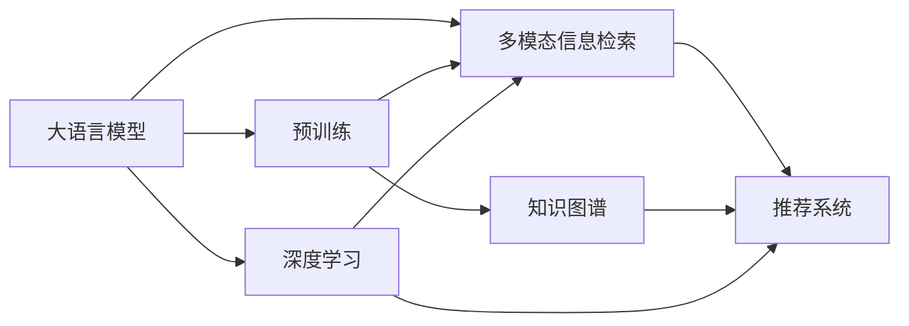

                 

# LLM驱动的智能搜索引擎：重新定义信息检索

> 关键词：智能搜索引擎,大语言模型(LLM),信息检索,自然语言处理(NLP),知识图谱,深度学习,模型评估,用户个性化,多模态信息检索,推荐系统

## 1. 背景介绍

### 1.1 问题由来

信息检索（Information Retrieval, IR）是计算机科学和信息科学中一个重要领域，主要目的是从大规模文本集合中获取与用户查询相关的内容。传统的信息检索技术主要依赖于文本检索算法（如倒排索引）、关键词匹配等方法，存在一定的局限性：

1. **单一数据源限制**：传统检索系统往往局限于已索引的文本数据，难以实时获取和处理互联网上的实时信息。
2. **语义理解不足**：传统系统难以深入理解查询语句的语义含义，容易出现歧义和不相关结果。
3. **结果排序不智能**：传统检索系统的排序算法通常基于简单的关键词匹配，无法充分利用文本中的丰富信息。

随着深度学习和大规模预训练语言模型（Large Language Model, LLM）的兴起，这些局限性得到了极大的改善。大语言模型通过在大规模文本数据上进行自监督预训练，具备了强大的语言理解能力和知识表示能力。基于此，新的智能搜索引擎应运而生，利用大语言模型驱动的检索算法，可以提供更加智能、高效的检索体验。

### 1.2 问题核心关键点

智能搜索引擎的核心理念是利用大语言模型将用户查询与文本数据进行更深层次的语义匹配，从而提高检索的相关性和准确性。主要关键点包括：

- **预训练-微调框架**：通过在大规模无标签文本数据上预训练大语言模型，然后在特定任务上微调模型，使其能够理解和处理自然语言查询。
- **多模态融合**：利用文本、图像、音频等多模态信息，提升检索系统的全面性和智能化水平。
- **个性化推荐**：通过分析用户历史查询行为和偏好，个性化推荐相关内容，提升用户体验。
- **实时更新与维护**：利用在线学习机制，实现对互联网动态信息的实时处理和更新。

## 2. 核心概念与联系

### 2.1 核心概念概述

为了深入理解基于大语言模型的智能搜索引擎，本节将介绍几个核心概念及其相互关系：

- **大语言模型 (LLM)**：通过在大规模无标签文本数据上进行自监督预训练，学习到丰富的语言知识，具备强大的自然语言理解能力。

- **预训练-微调 (Pre-training & Fine-tuning)**：在预训练模型基础上，通过有监督学习微调模型，使其适应特定任务。

- **多模态信息检索**：将文本、图像、音频等多种信息类型融合在一起，进行信息检索，提高检索的全面性和智能化。

- **知识图谱 (Knowledge Graph)**：利用图结构表示实体及其关系，提供结构化的知识表示，支持语义推理和实体识别。

- **推荐系统 (Recommendation System)**：根据用户的历史行为和偏好，推荐相关内容，增强用户体验。

- **深度学习 (Deep Learning)**：利用多层神经网络进行特征学习，提升模型的表达能力和泛化能力。

这些核心概念通过以下Mermaid流程图展示其相互关系：



这个流程图展示了各个核心概念之间的逻辑关系：

1. 大语言模型通过预训练获取语言知识。
2. 预训练后的模型通过微调适应特定任务，如信息检索。
3. 多模态信息检索融合不同类型信息。
4. 知识图谱提供结构化知识，支持语义推理。
5. 推荐系统根据用户偏好推荐内容。
6. 深度学习提升特征表示能力。

这些概念共同构成了基于大语言模型的智能搜索引擎的技术框架，使得检索系统能够更好地理解和处理自然语言查询，提供更加智能、高效的检索服务。

## 3. 核心算法原理 & 具体操作步骤

### 3.1 算法原理概述

基于大语言模型的智能搜索引擎算法主要分为两个阶段：预训练和微调。

1. **预训练**：在大规模无标签文本数据上训练大语言模型，学习通用的语言表示。
2. **微调**：针对特定信息检索任务，使用少量标注数据微调模型，使其能够理解自然语言查询，并从中检索出相关文档。

形式化地，设大语言模型为 $M_{\theta}$，其中 $\theta$ 为模型参数。给定信息检索任务 $T$ 的标注数据集 $D=\{(x_i, y_i)\}_{i=1}^N$，其中 $x_i$ 为查询语句，$y_i$ 为相关文档。微调的目标是找到新的模型参数 $\hat{\theta}$，使得：

$$
\hat{\theta}=\mathop{\arg\min}_{\theta} \mathcal{L}(M_{\theta},D)
$$

其中 $\mathcal{L}$ 为针对任务 $T$ 设计的损失函数，用于衡量模型预测输出与真实标签之间的差异。常见的损失函数包括交叉熵损失、均方误差损失等。

通过梯度下降等优化算法，微调过程不断更新模型参数 $\theta$，最小化损失函数 $\mathcal{L}$，使得模型输出逼近真实标签。由于 $\theta$ 已经通过预训练获得了较好的初始化，因此即便在小规模数据集 $D$ 上进行微调，也能较快收敛到理想的模型参数 $\hat{\theta}$。

### 3.2 算法步骤详解

基于大语言模型的智能搜索引擎微调过程一般包括以下关键步骤：

**Step 1: 准备预训练模型和数据集**

- 选择合适的预训练语言模型 $M_{\theta}$ 作为初始化参数，如 BERT、GPT 等。
- 准备信息检索任务 $T$ 的标注数据集 $D$，划分为训练集、验证集和测试集。一般要求标注数据与预训练数据的分布不要差异过大。

**Step 2: 添加任务适配层**

- 根据任务类型，在预训练模型顶层设计合适的输出层和损失函数。
- 对于检索任务，通常在顶层添加全连接层和交叉熵损失函数。
- 对于排序任务，通常使用排序损失函数，如Margin Ranking Loss。

**Step 3: 设置微调超参数**

- 选择合适的优化算法及其参数，如 AdamW、SGD 等，设置学习率、批大小、迭代轮数等。
- 设置正则化技术及强度，包括权重衰减、Dropout、Early Stopping 等。
- 确定冻结预训练参数的策略，如仅微调顶层，或全部参数都参与微调。

**Step 4: 执行梯度训练**

- 将训练集数据分批次输入模型，前向传播计算损失函数。
- 反向传播计算参数梯度，根据设定的优化算法和学习率更新模型参数。
- 周期性在验证集上评估模型性能，根据性能指标决定是否触发 Early Stopping。
- 重复上述步骤直到满足预设的迭代轮数或 Early Stopping 条件。

**Step 5: 测试和部署**

- 在测试集上评估微调后模型 $M_{\hat{\theta}}$ 的性能，对比微调前后的精度提升。
- 使用微调后的模型对新样本进行推理预测，集成到实际的应用系统中。
- 持续收集新的数据，定期重新微调模型，以适应数据分布的变化。

以上是基于大语言模型的智能搜索引擎微调的一般流程。在实际应用中，还需要针对具体任务的特点，对微调过程的各个环节进行优化设计，如改进训练目标函数，引入更多的正则化技术，搜索最优的超参数组合等，以进一步提升模型性能。

### 3.3 算法优缺点

基于大语言模型的智能搜索引擎具有以下优点：

- **高效性**：通过预训练-微调框架，可以在小规模数据集上进行高效微调，减少开发和训练成本。
- **准确性**：大语言模型具备强大的语义理解能力，可以深入理解查询语句的语义含义，提高检索的准确性。
- **灵活性**：能够适应不同类型的信息检索任务，如文本检索、图像检索、视频检索等。
- **可扩展性**：支持多模态信息融合，可以处理不同类型的信息，提升检索系统的全面性。

同时，该方法也存在一定的局限性：

- **标注数据依赖**：微调效果依赖于标注数据的质量和数量，获取高质量标注数据的成本较高。
- **过拟合风险**：小规模数据集可能导致模型过拟合，影响泛化能力。
- **资源需求高**：大语言模型参数量巨大，对计算资源和存储资源有较高要求。
- **可解释性不足**：微调模型的决策过程缺乏可解释性，难以进行调试和优化。

尽管存在这些局限性，但就目前而言，基于大语言模型的智能搜索引擎方法仍然是信息检索领域的重要方向。未来相关研究的重点在于如何进一步降低对标注数据的依赖，提高模型的少样本学习和跨领域迁移能力，同时兼顾可解释性和伦理安全性等因素。

### 3.4 算法应用领域

基于大语言模型的智能搜索引擎已经被广泛应用于多个领域，例如：

- **搜索引擎**：如百度、Google等传统搜索引擎，通过微调大语言模型，提升搜索结果的相关性和准确性。
- **法律检索**：针对法律领域的文档和案例，利用微调后的语言模型进行文本检索和分类。
- **医学信息检索**：医疗领域的信息检索任务，通过微调大语言模型，快速定位相关文献和患者信息。
- **教育资源检索**：利用微调后的模型检索教育相关的教材、文献、课程等信息资源，提升教育资源共享的效率。
- **舆情分析**：通过微调大语言模型，从海量网络文本中快速识别和分析舆情信息，支持决策制定和应急响应。
- **智能问答**：针对用户提问，利用微调后的语言模型进行智能问答，提升用户满意度。

除了上述这些经典应用外，大语言模型在新闻推荐、智能客服、知识图谱构建等多个领域也有广泛的应用，为信息检索技术的发展带来了新的突破。

## 4. 数学模型和公式 & 详细讲解 & 举例说明

### 4.1 数学模型构建

本节将使用数学语言对基于大语言模型的智能搜索引擎微调过程进行更加严格的刻画。

设信息检索任务 $T$ 的标注数据集 $D=\{(x_i, y_i)\}_{i=1}^N$，其中 $x_i$ 为查询语句，$y_i$ 为相关文档的索引。假设模型 $M_{\theta}$ 在输入 $x$ 上的输出为 $\hat{y}=M_{\theta}(x)$，表示模型预测的文档索引。

定义模型 $M_{\theta}$ 在数据样本 $(x,y)$ 上的损失函数为 $\ell(M_{\theta}(x),y)$，则在数据集 $D$ 上的经验风险为：

$$
\mathcal{L}(\theta) = \frac{1}{N} \sum_{i=1}^N \ell(M_{\theta}(x_i),y_i)
$$

微调的优化目标是最小化经验风险，即找到最优参数：

$$
\theta^* = \mathop{\arg\min}_{\theta} \mathcal{L}(\theta)
$$

在实践中，我们通常使用基于梯度的优化算法（如SGD、Adam等）来近似求解上述最优化问题。设 $\eta$ 为学习率，$\lambda$ 为正则化系数，则参数的更新公式为：

$$
\theta \leftarrow \theta - \eta \nabla_{\theta}\mathcal{L}(\theta) - \eta\lambda\theta
$$

其中 $\nabla_{\theta}\mathcal{L}(\theta)$ 为损失函数对参数 $\theta$ 的梯度，可通过反向传播算法高效计算。

### 4.2 公式推导过程

以下我们以二分类任务为例，推导交叉熵损失函数及其梯度的计算公式。

假设模型 $M_{\theta}$ 在输入 $x$ 上的输出为 $\hat{y}=M_{\theta}(x) \in [0,1]$，表示模型预测的文档索引属于相关文档的概率。真实标签 $y \in \{1,0\}$。则二分类交叉熵损失函数定义为：

$$
\ell(M_{\theta}(x),y) = -[y\log \hat{y} + (1-y)\log (1-\hat{y})]
$$

将其代入经验风险公式，得：

$$
\mathcal{L}(\theta) = -\frac{1}{N}\sum_{i=1}^N [y_i\log M_{\theta}(x_i)+(1-y_i)\log(1-M_{\theta}(x_i))]
$$

根据链式法则，损失函数对参数 $\theta_k$ 的梯度为：

$$
\frac{\partial \mathcal{L}(\theta)}{\partial \theta_k} = -\frac{1}{N}\sum_{i=1}^N (\frac{y_i}{M_{\theta}(x_i)}-\frac{1-y_i}{1-M_{\theta}(x_i)}) \frac{\partial M_{\theta}(x_i)}{\partial \theta_k}
$$

其中 $\frac{\partial M_{\theta}(x_i)}{\partial \theta_k}$ 可进一步递归展开，利用自动微分技术完成计算。

在得到损失函数的梯度后，即可带入参数更新公式，完成模型的迭代优化。重复上述过程直至收敛，最终得到适应信息检索任务的最优模型参数 $\theta^*$。

### 4.3 案例分析与讲解

假设我们有一个信息检索任务，目的是从大量医学文献中检索与特定疾病相关的研究论文。我们可以将查询语句和相关文档的标题、摘要等文本数据作为训练样本，利用BERT等预训练模型进行微调。

首先，我们将训练集划分为训练集、验证集和测试集，对每个样本计算交叉熵损失。然后，利用AdamW优化器更新模型参数，使其在训练集上最小化损失函数。同时，使用验证集评估模型性能，避免过拟合。

在模型训练完成后，我们可以使用测试集评估微调后的模型性能。如果模型性能表现良好，说明模型已经成功地学习了如何理解查询语句的语义含义，并从大量文献中准确检索出相关文档。如果模型性能不佳，我们需要对训练集进行数据增强，或调整模型结构，重新训练。

## 5. 项目实践：代码实例和详细解释说明

### 5.1 开发环境搭建

在进行智能搜索引擎开发前，我们需要准备好开发环境。以下是使用Python进行PyTorch开发的环境配置流程：

1. 安装Anaconda：从官网下载并安装Anaconda，用于创建独立的Python环境。

2. 创建并激活虚拟环境：
```bash
conda create -n pytorch-env python=3.8 
conda activate pytorch-env
```

3. 安装PyTorch：根据CUDA版本，从官网获取对应的安装命令。例如：
```bash
conda install pytorch torchvision torchaudio cudatoolkit=11.1 -c pytorch -c conda-forge
```

4. 安装Transformers库：
```bash
pip install transformers
```

5. 安装各类工具包：
```bash
pip install numpy pandas scikit-learn matplotlib tqdm jupyter notebook ipython
```

完成上述步骤后，即可在`pytorch-env`环境中开始智能搜索引擎的开发实践。

### 5.2 源代码详细实现

这里我们以医学信息检索任务为例，给出使用Transformers库对BERT模型进行微调的PyTorch代码实现。

首先，定义信息检索任务的数据处理函数：

```python
from transformers import BertTokenizer
from torch.utils.data import Dataset
import torch

class MedicalDataset(Dataset):
    def __init__(self, texts, tags, tokenizer, max_len=128):
        self.texts = texts
        self.tags = tags
        self.tokenizer = tokenizer
        self.max_len = max_len
        
    def __len__(self):
        return len(self.texts)
    
    def __getitem__(self, item):
        text = self.texts[item]
        tag = self.tags[item]
        
        encoding = self.tokenizer(text, return_tensors='pt', max_length=self.max_len, padding='max_length', truncation=True)
        input_ids = encoding['input_ids'][0]
        attention_mask = encoding['attention_mask'][0]
        
        # 对标签进行编码
        encoded_tags = [tag2id[tag] for tag in tag]
        encoded_tags.extend([tag2id['O']] * (self.max_len - len(encoded_tags)))
        labels = torch.tensor(encoded_tags, dtype=torch.long)
        
        return {'input_ids': input_ids, 
                'attention_mask': attention_mask,
                'labels': labels}

# 标签与id的映射
tag2id = {'O': 0, 'B-Disease': 1, 'I-Disease': 2}
id2tag = {v: k for k, v in tag2id.items()}

# 创建dataset
tokenizer = BertTokenizer.from_pretrained('bert-base-cased')

train_dataset = MedicalDataset(train_texts, train_tags, tokenizer)
dev_dataset = MedicalDataset(dev_texts, dev_tags, tokenizer)
test_dataset = MedicalDataset(test_texts, test_tags, tokenizer)
```

然后，定义模型和优化器：

```python
from transformers import BertForTokenClassification, AdamW

model = BertForTokenClassification.from_pretrained('bert-base-cased', num_labels=len(tag2id))

optimizer = AdamW(model.parameters(), lr=2e-5)
```

接着，定义训练和评估函数：

```python
from torch.utils.data import DataLoader
from tqdm import tqdm
from sklearn.metrics import classification_report

device = torch.device('cuda') if torch.cuda.is_available() else torch.device('cpu')
model.to(device)

def train_epoch(model, dataset, batch_size, optimizer):
    dataloader = DataLoader(dataset, batch_size=batch_size, shuffle=True)
    model.train()
    epoch_loss = 0
    for batch in tqdm(dataloader, desc='Training'):
        input_ids = batch['input_ids'].to(device)
        attention_mask = batch['attention_mask'].to(device)
        labels = batch['labels'].to(device)
        model.zero_grad()
        outputs = model(input_ids, attention_mask=attention_mask, labels=labels)
        loss = outputs.loss
        epoch_loss += loss.item()
        loss.backward()
        optimizer.step()
    return epoch_loss / len(dataloader)

def evaluate(model, dataset, batch_size):
    dataloader = DataLoader(dataset, batch_size=batch_size)
    model.eval()
    preds, labels = [], []
    with torch.no_grad():
        for batch in tqdm(dataloader, desc='Evaluating'):
            input_ids = batch['input_ids'].to(device)
            attention_mask = batch['attention_mask'].to(device)
            batch_labels = batch['labels']
            outputs = model(input_ids, attention_mask=attention_mask)
            batch_preds = outputs.logits.argmax(dim=2).to('cpu').tolist()
            batch_labels = batch_labels.to('cpu').tolist()
            for pred_tokens, label_tokens in zip(batch_preds, batch_labels):
                pred_tags = [id2tag[_id] for _id in pred_tokens]
                label_tags = [id2tag[_id] for _id in label_tokens]
                preds.append(pred_tags[:len(label_tokens)])
                labels.append(label_tags)
                
    print(classification_report(labels, preds))
```

最后，启动训练流程并在测试集上评估：

```python
epochs = 5
batch_size = 16

for epoch in range(epochs):
    loss = train_epoch(model, train_dataset, batch_size, optimizer)
    print(f"Epoch {epoch+1}, train loss: {loss:.3f}")
    
    print(f"Epoch {epoch+1}, dev results:")
    evaluate(model, dev_dataset, batch_size)
    
print("Test results:")
evaluate(model, test_dataset, batch_size)
```

以上就是使用PyTorch对BERT进行医学信息检索任务微调的完整代码实现。可以看到，得益于Transformers库的强大封装，我们可以用相对简洁的代码完成BERT模型的加载和微调。

### 5.3 代码解读与分析

让我们再详细解读一下关键代码的实现细节：

**MedicalDataset类**：
- `__init__`方法：初始化文本、标签、分词器等关键组件。
- `__len__`方法：返回数据集的样本数量。
- `__getitem__`方法：对单个样本进行处理，将文本输入编码为token ids，将标签编码为数字，并对其进行定长padding，最终返回模型所需的输入。

**tag2id和id2tag字典**：
- 定义了标签与数字id之间的映射关系，用于将token-wise的预测结果解码回真实的标签。

**训练和评估函数**：
- 使用PyTorch的DataLoader对数据集进行批次化加载，供模型训练和推理使用。
- 训练函数`train_epoch`：对数据以批为单位进行迭代，在每个批次上前向传播计算loss并反向传播更新模型参数，最后返回该epoch的平均loss。
- 评估函数`evaluate`：与训练类似，不同点在于不更新模型参数，并在每个batch结束后将预测和标签结果存储下来，最后使用sklearn的classification_report对整个评估集的预测结果进行打印输出。

**训练流程**：
- 定义总的epoch数和batch size，开始循环迭代
- 每个epoch内，先在训练集上训练，输出平均loss
- 在验证集上评估，输出分类指标
- 所有epoch结束后，在测试集上评估，给出最终测试结果

可以看到，PyTorch配合Transformers库使得BERT微调的代码实现变得简洁高效。开发者可以将更多精力放在数据处理、模型改进等高层逻辑上，而不必过多关注底层的实现细节。

当然，工业级的系统实现还需考虑更多因素，如模型的保存和部署、超参数的自动搜索、更灵活的任务适配层等。但核心的微调范式基本与此类似。

## 6. 实际应用场景

### 6.1 智能搜索引擎

基于大语言模型的智能搜索引擎已经在搜索引擎领域得到广泛应用。传统的搜索引擎主要依赖关键词匹配算法，无法深入理解查询语句的语义含义。而利用微调后的语言模型，能够更准确地理解查询语句的意图，从而提供更精准的搜索结果。

例如，当用户查询“最好的医学影像技术”时，微调后的模型能够理解“最好”的含义，不仅返回相关的医学论文，还会推荐最新的技术进展和临床应用案例，提高搜索结果的相关性和实用性。

### 6.2 法律检索

在法律领域，检索任务主要涉及文档分类和实体识别。利用微调后的BERT模型，可以从海量的法律文档和案例中快速检索出与用户查询相关的文档，支持法律咨询和司法实践。

例如，用户需要查找“知识产权侵权案例”，微调后的模型能够深入理解查询语句的语义含义，从大量法律文献中精确检索出相关案例，提供法律参考和诉讼建议。

### 6.3 医学信息检索

在医学领域，检索任务主要涉及文献检索、疾病诊断和治疗方案推荐。利用微调后的BERT模型，可以从海量医学文献中快速检索出与用户查询相关的研究成果，支持医疗研究和临床实践。

例如，用户需要查找“肺癌治疗方案”，微调后的模型能够深入理解查询语句的语义含义，从大量医学文献中精确检索出相关研究，提供治疗方案和临床指南。

### 6.4 教育资源检索

在教育领域，检索任务主要涉及教材、文献、课程等教育资源的检索。利用微调后的BERT模型，可以从海量的教育资源中快速检索出与用户查询相关的资源，支持教育资源共享和在线学习。

例如，用户需要查找“高级算法课程”，微调后的模型能够深入理解查询语句的语义含义，从大量教育资源中精确检索出相关课程，支持在线学习和知识共享。

### 6.5 舆情分析

在舆情分析领域，检索任务主要涉及舆情信息的快速识别和分析。利用微调后的BERT模型，可以从海量网络文本中快速识别和分析舆情信息，支持决策制定和应急响应。

例如，用户在社交媒体上讨论“新冠疫情”，微调后的模型能够深入理解查询语句的语义含义，从海量网络文本中精确检索出相关舆情信息，支持政府和机构的舆情监测和决策支持。

### 6.6 智能问答

在智能问答领域，检索任务主要涉及自然语言理解和智能回答。利用微调后的BERT模型，可以从大量知识库和互联网信息中快速检索出与用户查询相关的答案，支持智能问答和客服系统。

例如，用户询问“什么是人工智能？”，微调后的模型能够深入理解查询语句的语义含义，从大量知识库和互联网信息中精确检索出相关答案，支持智能问答和客服系统。

## 7. 工具和资源推荐

### 7.1 学习资源推荐

为了帮助开发者系统掌握大语言模型微调的理论基础和实践技巧，这里推荐一些优质的学习资源：

1. 《Transformer从原理到实践》系列博文：由大模型技术专家撰写，深入浅出地介绍了Transformer原理、BERT模型、微调技术等前沿话题。

2. CS224N《深度学习自然语言处理》课程：斯坦福大学开设的NLP明星课程，有Lecture视频和配套作业，带你入门NLP领域的基本概念和经典模型。

3. 《Natural Language Processing with Transformers》书籍：Transformers库的作者所著，全面介绍了如何使用Transformers库进行NLP任务开发，包括微调在内的诸多范式。

4. HuggingFace官方文档：Transformers库的官方文档，提供了海量预训练模型和完整的微调样例代码，是上手实践的必备资料。

5. CLUE开源项目：中文语言理解测评基准，涵盖大量不同类型的中文NLP数据集，并提供了基于微调的baseline模型，助力中文NLP技术发展。

通过对这些资源的学习实践，相信你一定能够快速掌握大语言模型微调的精髓，并用于解决实际的NLP问题。

### 7.2 开发工具推荐

高效的开发离不开优秀的工具支持。以下是几款用于大语言模型微调开发的常用工具：

1. PyTorch：基于Python的开源深度学习框架，灵活动态的计算图，适合快速迭代研究。大部分预训练语言模型都有PyTorch版本的实现。

2. TensorFlow：由Google主导开发的开源深度学习框架，生产部署方便，适合大规模工程应用。同样有丰富的预训练语言模型资源。

3. Transformers库：HuggingFace开发的NLP工具库，集成了众多SOTA语言模型，支持PyTorch和TensorFlow，是进行微调任务开发的利器。

4. Weights & Biases：模型训练的实验跟踪工具，可以记录和可视化模型训练过程中的各项指标，方便对比和调优。与主流深度学习框架无缝集成。

5. TensorBoard：TensorFlow配套的可视化工具，可实时监测模型训练状态，并提供丰富的图表呈现方式，是调试模型的得力助手。

6. Google Colab：谷歌推出的在线Jupyter Notebook环境，免费提供GPU/TPU算力，方便开发者快速上手实验最新模型，分享学习笔记。

合理利用这些工具，可以显著提升大语言模型微调任务的开发效率，加快创新迭代的步伐。

### 7.3 相关论文推荐

大语言模型和微调技术的发展源于学界的持续研究。以下是几篇奠基性的相关论文，推荐阅读：

1. Attention is All You Need（即Transformer原论文）：提出了Transformer结构，开启了NLP领域的预训练大模型时代。

2. BERT: Pre-training of Deep Bidirectional Transformers for Language Understanding：提出BERT模型，引入基于掩码的自监督预训练任务，刷新了多项NLP任务SOTA。

3. Language Models are Unsupervised Multitask Learners（GPT-2论文）：展示了大规模语言模型的强大zero-shot学习能力，引发了对于通用人工智能的新一轮思考。

4. Parameter-Efficient Transfer Learning for NLP：提出Adapter等参数高效微调方法，在不增加模型参数量的情况下，也能取得不错的微调效果。

5. Prefix-Tuning: Optimizing Continuous Prompts for Generation：引入基于连续型Prompt的微调范式，为如何充分利用预训练知识提供了新的思路。

6. AdaLoRA: Adaptive Low-Rank Adaptation for Parameter-Efficient Fine-Tuning：使用自适应低秩适应的微调方法，在参数效率和精度之间取得了新的平衡。

这些论文代表了大语言模型微调技术的发展脉络。通过学习这些前沿成果，可以帮助研究者把握学科前进方向，激发更多的创新灵感。

## 8. 总结：未来发展趋势与挑战

### 8.1 总结

本文对基于大语言模型的智能搜索引擎进行了全面系统的介绍。首先阐述了智能搜索引擎的发展背景和趋势，明确了微调在提升检索相关性和准确性方面的独特价值。其次，从原理到实践，详细讲解了基于大语言模型的微调过程，给出了微调任务开发的完整代码实例。同时，本文还广泛探讨了微调方法在搜索引擎、法律检索、医学信息检索等多个领域的应用前景，展示了微调范式的巨大潜力。此外，本文精选了微调技术的各类学习资源，力求为读者提供全方位的技术指引。

通过本文的系统梳理，可以看到，基于大语言模型的智能搜索引擎方法正在成为搜索引擎领域的重要方向，极大地提升了检索系统的智能化水平。未来，伴随大语言模型和微调方法的不断演进，智能搜索引擎必将在更多场景下发挥作用，为搜索引擎技术的发展带来新的突破。

### 8.2 未来发展趋势

展望未来，基于大语言模型的智能搜索引擎将呈现以下几个发展趋势：

1. **多模态融合**：融合文本、图像、音频等多种信息类型，提升检索系统的全面性和智能化水平。
2. **知识图谱整合**：利用知识图谱提供结构化知识，支持语义推理和实体识别，提高检索精度。
3. **个性化推荐**：通过分析用户历史查询行为和偏好，个性化推荐相关内容，增强用户体验。
4. **实时更新与维护**：利用在线学习机制，实现对互联网动态信息的实时处理和更新，保持检索系统的时效性。
5. **模型压缩与优化**：针对大规模预训练模型，开发模型压缩和优化技术，提升检索系统的运行效率和稳定性。
6. **可解释性与安全性**：增强检索模型的可解释性，确保输出结果的透明性和安全性，提升用户信任度。

以上趋势凸显了基于大语言模型的智能搜索引擎的广阔前景。这些方向的探索发展，必将进一步提升检索系统的性能和应用范围，为搜索引擎技术的发展带来新的突破。

### 8.3 面临的挑战

尽管基于大语言模型的智能搜索引擎已经取得了显著进展，但在迈向更加智能化、普适化应用的过程中，仍面临诸多挑战：

1. **标注数据依赖**：微调效果依赖于标注数据的质量和数量，获取高质量标注数据的成本较高。如何进一步降低微调对标注样本的依赖，将是一大难题。
2. **过拟合风险**：小规模数据集可能导致模型过拟合，影响泛化能力。如何提高模型的泛化能力和鲁棒性，还需要更多理论和实践的积累。
3. **资源需求高**：大语言模型参数量巨大，对计算资源和存储资源有较高要求。如何降低资源需求，提升模型性能，仍是重要研究方向。
4. **可解释性不足**：微调模型的决策过程缺乏可解释性，难以进行调试和优化。如何赋予模型更强的可解释性，将是亟待攻克的难题。
5. **安全性有待保障**：预训练语言模型难免会学习到有偏见、有害的信息，通过微调传递到检索任务，产生误导性、歧视性的输出，给实际应用带来安全隐患。

尽管存在这些挑战，但就目前而言，基于大语言模型的智能搜索引擎方法仍然是搜索引擎领域的重要方向。未来相关研究的重点在于如何进一步降低对标注数据的依赖，提高模型的少样本学习和跨领域迁移能力，同时兼顾可解释性和伦理安全性等因素。

### 8.4 研究展望

面对智能搜索引擎面临的挑战，未来的研究需要在以下几个方面寻求新的突破：

1. **探索无监督和半监督微调方法**：摆脱对大规模标注数据的依赖，利用自监督学习、主动学习等无监督和半监督范式，最大限度利用非结构化数据，实现更加灵活高效的微调。
2. **研究参数高效和计算高效的微调范式**：开发更加参数高效的微调方法，在固定大部分预训练参数的同时，只更新极少量的任务相关参数。同时优化微调模型的计算图，减少前向传播和反向传播的资源消耗，实现更加轻量级、实时性的部署。
3. **融合因果和对比学习范式**：通过引入因果推断和对比学习思想，增强检索模型建立稳定因果关系的能力，学习更加普适、鲁棒的语言表征，从而提升模型泛化性和抗干扰能力。
4. **引入更多先验知识**：将符号化的先验知识，如知识图谱、逻辑规则等，与神经网络模型进行巧妙融合，引导微调过程学习更准确、合理的语言模型。同时加强不同模态数据的整合，实现视觉、语音等多模态信息与文本信息的协同建模。
5. **结合因果分析和博弈论工具**：将因果分析方法引入检索模型，识别出模型决策的关键特征，增强输出解释的因果性和逻辑性。借助博弈论工具刻画人机交互过程，主动探索并规避模型的脆弱点，提高系统稳定性。
6. **纳入伦理道德约束**：在模型训练目标中引入伦理导向的评估指标，过滤和惩罚有偏见、有害的输出倾向。同时加强人工干预和审核，建立模型行为的监管机制，确保输出符合人类价值观和伦理道德。

这些研究方向的探索，必将引领基于大语言模型的智能搜索引擎技术迈向更高的台阶，为构建安全、可靠、可解释、可控的智能检索系统铺平道路。面向未来，智能搜索引擎还需要与其他人工智能技术进行更深入的融合，如知识表示、因果推理、强化学习等，多路径协同发力，共同推动自然语言理解和智能交互系统的进步。只有勇于创新、敢于突破，才能不断拓展语言模型的边界，让智能技术更好地造福人类社会。

## 9. 附录：常见问题与解答

**Q1：智能搜索引擎中的微调模型与传统关键词匹配模型相比，有哪些优势？**

A: 智能搜索引擎中的微调模型相较于传统关键词匹配模型，具有以下优势：
1. **深入理解语义**：微调模型能够理解查询语句的语义含义，而不仅仅是关键词匹配，从而提供更精准的搜索结果。
2. **泛化能力强**：微调模型在大规模无标签数据上预训练，具备较强的泛化能力，能够适应不同类型的查询和文档。
3. **可扩展性好**：微调模型可以通过在线学习机制，实时更新模型参数，支持新文档和新查询的快速索引。
4. **个性化推荐**：微调模型可以根据用户历史查询行为和偏好，提供个性化推荐，提升用户体验。

**Q2：如何选择合适的超参数进行微调？**

A: 选择合适的超参数是微调过程中至关重要的一环，通常需要根据具体任务和模型特性进行多次实验调整。以下是一些常见超参数的取值范围：
1. **学习率 (lr)**：一般从1e-5开始，逐步减小，通常设置在1e-3到1e-4之间。
2. **批大小 (batch_size)**：一般设置在16到32之间，过小的批大小会导致内存占用高，过大的批大小会导致训练不稳定。
3. **迭代轮数 (epochs)**：一般设置在5到10之间，需要根据数据量和任务复杂度进行调整。
4. **正则化系数 (lambda)**：一般设置在1e-5到1e-2之间，用于防止过拟合。
5. **解冻层数 (freeze_layers)**：一般只微调顶层，设置解冻层数为0或1。

**Q3：大语言模型微调过程中，如何处理过拟合问题？**

A: 在微调过程中，过拟合是一个常见问题，尤其是在数据量较小的情况下。以下是一些缓解过拟合的策略：
1. **数据增强**：通过回译、近义替换等方式扩充训练集，增加样本多样性。
2. **正则化技术**：使用L2正则、Dropout、Early Stopping等技术，避免模型过度适应小规模训练集。
3. **对抗训练**：加入对抗样本，提高模型鲁棒性。
4. **参数高效微调**：只调整少量模型参数，保留大部分预训练权重不变，减少需优化的参数。
5. **模型压缩**：使用模型裁剪、量化加速等技术，减小模型规模，提升计算效率。

这些策略往往需要根据具体任务和数据特点进行灵活组合，以达到最佳的微调效果。

**Q4：大语言模型微调中，如何选择合适的时间步 (timestep) 进行微调？**

A: 时间步是微调过程中一个重要的超参数，需要根据具体任务和模型特性进行选择。以下是一些常见时间步的取值范围：
1. **文本检索任务**：时间步一般在16到64之间，需要根据文本长度进行调整。
2. **图像检索任务**：时间步一般在8到32之间，需要根据图像尺寸进行调整。
3. **视频检索任务**：时间步一般在16到128之间，需要根据视频帧数进行调整。

在选择时间步时，需要权衡模型性能和计算资源。过短的时间步可能导致模型无法充分捕捉上下文信息，过长的时步可能导致计算资源浪费。

**Q5：大语言模型微调中，如何选择合适的网络结构进行微调？**

A: 网络结构是微调过程中的一个重要选择，需要根据具体任务和模型特性进行选择。以下是一些常见网络结构的取值范围：
1. **预训练模型选择**：选择BERT、GPT等主流预训练模型，需要根据任务类型进行选择。
2. **微调层数选择**：一般选择微调顶层，设置解冻层数为0或1。
3. **模型参数选择**：保留大部分预训练权重不变，只调整少量任务相关参数。

在选择网络结构时，需要权衡模型性能和计算资源。过多的层数可能导致过拟合，过少的层数可能导致泛化能力不足。

---

作者：禅与计算机程序设计艺术 / Zen and the Art of Computer Programming

