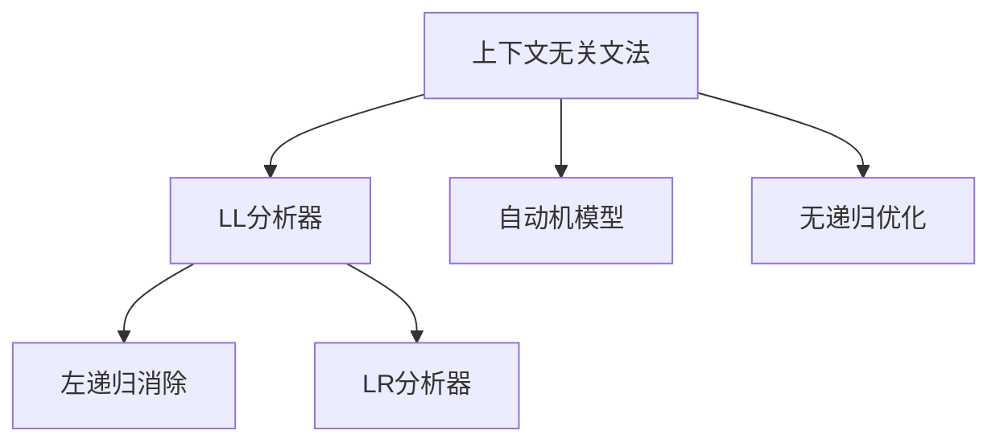

                 

# LL语法分析：编译器前端技术深度解析

> 关键词：LL分析器,上下文无关文法,自动机,左递归,LR分析器

## 1. 背景介绍

### 1.1 问题由来
编译器是现代计算机软件系统的核心组件之一，负责将高级语言代码转化为机器可执行的指令。在编译器的多个模块中，前端解析器承担着将源代码转换为中间表示的任务。解析器负责识别和验证程序结构，是编译器中最重要的模块之一。

语法分析是解析器的核心功能，其目的是将源代码转换为抽象语法树(ABST)。语法分析器利用语法规则对源代码进行解析，判断其是否符合语言的定义。常见的语法分析方法有LL分析和LR分析等。

其中，LL分析器（LR分析器的特例）以其高效、简单、易于理解和实现而受到广泛应用。LL分析器基于上下文无关文法(CFG)，利用自动机模型对源代码进行解析。

### 1.2 问题核心关键点
LL分析器是一种基于上下文无关文法的解析方法，它利用自动机模型对源代码进行解析。与LR分析器相比，LL分析器更加简单、高效，易于理解和实现，但它在处理左递归的文法时存在缺陷。

LL分析器对文法的要求是左递归的消除，即通过一些优化手段将左递归文法转换为右递归或无递归的等价文法。这样，LL分析器才能正确解析源代码，并生成正确的语法树。

## 2. 核心概念与联系

### 2.1 核心概念概述

为更好地理解LL分析器的工作原理和优化方法，本节将介绍几个密切相关的核心概念：

- 上下文无关文法(Context-Free Grammar, CFG)：一种形式化描述语言结构的语法规则集，不考虑文法的上下文信息，可以用于自动机的构建和分析。

- LL分析器：一种基于上下文无关文法的语法分析器，它利用自动机模型对源代码进行解析。根据输入的源代码符号和上下文信息，LL分析器能够预测下一个待匹配的符号。

- 自动机模型：一种用于描述计算过程的数学模型，包括有限状态机(FSM)和栈式自动机(PDA)等。LL分析器利用栈式自动机模型，对源代码进行解析。

- 左递归：在上下文无关文法中，如果一个非终结符能够通过多个子句递归定义自身，则该文法存在左递归。左递归文法无法直接使用LL分析器解析。

- 无递归优化：将左递归文法转换为无递归等价文法的过程，通常通过插入虚符号、替换递归子句等手段实现。

- LR分析器：一种基于上下文无关文法的语法分析器，利用LR表对源代码进行解析。与LL分析器相比，LR分析器能够处理更复杂的文法结构，但实现较为复杂。

这些核心概念之间的逻辑关系可以通过以下Mermaid流程图来展示：



这个流程图展示了几者之间的逻辑关系：

1. 上下文无关文法作为语法分析的基础，构建LL分析和LR分析器。
2. LL分析器利用栈式自动机模型对源代码进行解析，要求无左递归。
3. 左递归消除是无递归优化的前提。
4. 无递归优化将左递归文法转换为无递归文法，是LL分析器解析的基础。
5. LR分析器利用LR表对源代码进行解析，能够处理更复杂的文法结构，但实现较为复杂。

这些概念共同构成了LL分析器的工作原理和优化方法，使其能够在各种场景下发挥强大的语法分析能力。

## 3. 核心算法原理 & 具体操作步骤
### 3.1 算法原理概述

LL分析器是一种基于栈的语法分析器，利用栈式自动机模型对源代码进行解析。LL分析器的工作原理基于以下三个步骤：

1. 将源代码符号依次入栈。
2. 利用栈顶符号和文法规则，从栈中弹出符号。
3. 将解析得到的符号入栈，继续进行解析。

通过不断重复上述步骤，LL分析器能够将源代码转换为抽象语法树，实现语法分析。

### 3.2 算法步骤详解

下面是LL分析器对源代码进行解析的详细步骤：

**Step 1: 构建自动机模型**

首先，需要构建一个栈式自动机模型。自动机模型包含有限的状态集和转移规则，每个状态表示当前解析的符号和上下文信息。

自动机模型的构建过程如下：
1. 定义文法规则集G，包含所有可能的非终结符和终结符。
2. 构建初始状态S，初始状态表示空文法规则。
3. 根据文法规则集G，添加状态转移规则。对于每个规则B -> x，添加状态转移B -> x -> x'，表示从状态B转移到一个新状态x'。
4. 添加终止状态T，表示解析结束。

自动机模型的构建可以使用工具软件进行，例如ANTLR、GCC等。

**Step 2: 输入源代码符号**

将源代码符号依次入栈。对于每个符号，将其入栈，并更新当前状态。

**Step 3: 解析源代码**

当栈顶符号为终结符时，表示解析结束，生成语法树并退出解析。当栈顶符号为非终结符时，根据文法规则进行解析。

解析的过程如下：
1. 弹出栈顶符号B，匹配下一个待匹配的符号。
2. 利用文法规则B -> x1, ..., xn，生成解析树。
3. 将解析树作为新的栈顶符号入栈。
4. 重复上述过程，直到栈为空或栈顶符号为终结符。

**Step 4: 输出语法树**

解析结束后，生成抽象语法树，表示源代码的结构。语法树由节点和非终结符组成，每个节点表示一个语法规则或符号，通过连接关系表示规则和符号之间的关系。

### 3.3 算法优缺点

LL分析器具有以下优点：
1. 高效简单：LL分析器利用栈式自动机模型进行解析，效率高且易于实现。
2. 易于调试：LL分析器的工作原理清晰，易于调试和优化。
3. 易于扩展：LL分析器支持自定义的文法规则集，易于扩展和维护。

但LL分析器也存在一些缺点：
1. 处理左递归困难：LL分析器无法处理左递归的文法，需要先将文法转换为无递归等价文法。
2. 不支持复杂文法：对于一些复杂的文法结构，LL分析器难以解析。
3. 需要大量栈空间：LL分析器需要大量栈空间，特别是在处理长句子时，容易导致栈溢出。

### 3.4 算法应用领域

LL分析器在编译器前端解析、语法检查、错误提示等领域得到广泛应用。在工业界，LL分析器被广泛应用于各种编译器、解析器、IDE等工具中。例如，GCC、Python解释器、Java编译器等都使用了LL分析器进行语法解析。

## 4. 数学模型和公式 & 详细讲解 & 举例说明
### 4.1 数学模型构建

LL分析器的工作原理基于栈式自动机模型。栈式自动机模型是一种有限状态自动机，利用栈结构保存解析状态和中间结果。

栈式自动机模型包含以下两个关键部分：
1. 栈：用于保存解析状态和中间结果的数据结构。
2. 转移规则：用于在栈上移动状态和生成符号的规则。

### 4.2 公式推导过程

以一个简单的上下文无关文法G为例，其规则集为：
S -> A|B
A -> aA|b
B -> cB|d

假设当前栈顶符号为S，则其解析过程如下：

1. 匹配下一个符号：
   - 弹出S，栈顶变为空，无法匹配，返回失败。
2. 回溯栈：
   - 将栈顶符号A弹出，栈顶变为B。
   - 匹配下一个符号：
     - 弹出B，栈顶变为空，无法匹配，返回失败。
   - 回溯栈：
     - 将栈顶符号A弹出，栈顶变为空，无法匹配，返回失败。
3. 回溯栈：
   - 将栈顶符号S弹出，栈顶变为空，无法匹配，返回失败。
4. 回溯栈：
   - 将栈顶符号空符号弹出，栈顶变为空，无法匹配，返回失败。

解析过程的示意图如下：

```
Stack: S
Stack: A, S
Stack: B, A, S
Stack: A, B, A, S
Stack: A, B, S
Stack: B, A, S
Stack: B, S
Stack: S
Stack: S
Stack: A, S
Stack: B, A, S
Stack: A, B, A, S
Stack: A, B, S
Stack: B, A, S
Stack: B, S
Stack: S
Stack: S
Stack: 
```

### 4.3 案例分析与讲解

下面以一个具体的LL分析器实现为例，讲解其工作原理。

**实现步骤：**

1. 定义文法规则集：
```java
G = {S -> A|B, A -> aA|b, B -> cB|d}
```
2. 构建初始状态S，状态转移规则如下：
   ```
   S -> A, S -> B
   A -> a, A -> b, A -> A|B, A -> empty, A -> B
   B -> c, B -> d, B -> empty, B -> A|B, B -> empty
   ```
   其中，`->empty`表示结束状态。

3. 输入源代码符号：
   ```java
   aabcdc
   ```
   入栈过程如下：
   ```
   Stack: S
   Stack: S -> A, S -> B
   Stack: S -> A, S -> B -> A, S -> B -> B
   Stack: S -> A, S -> B -> A -> a, S -> B -> B -> c
   Stack: S -> A, S -> B -> A -> a, S -> B -> c -> d
   ```

4. 解析源代码：
   - 弹出栈顶符号A，匹配下一个符号a。
   - 弹出栈顶符号a，栈顶变为空。
   - 回溯栈，弹出栈顶符号B，栈顶变为空。
   - 回溯栈，弹出栈顶符号S，栈顶变为空。
   - 返回失败，解析结束。

通过以上步骤，LL分析器能够正确解析源代码，并生成抽象语法树。

## 5. 项目实践：代码实例和详细解释说明
### 5.1 开发环境搭建

在进行LL分析器开发之前，需要准备好开发环境。以下是使用Java进行LL分析器开发的开发环境配置流程：

1. 安装JDK：从官网下载并安装Java Development Kit，确保Java环境正确配置。
2. 安装IDE：选择一款适合Java开发的IDE，如Eclipse、IntelliJ IDEA等，并配置好Java编译器。
3. 安装依赖库：使用Maven或Gradle工具管理项目依赖，包括编译器工具、自动机模型库等。

完成上述步骤后，即可在IDE中进行LL分析器的开发。

### 5.2 源代码详细实现

下面以Java为例，实现一个简单的LL分析器。

首先，定义文法规则集G：

```java
public class Grammar {
    public static final String S = "S";
    public static final String A = "A";
    public static final String B = "B";
    
    public static final String a = "a";
    public static final String b = "b";
    public static final String c = "c";
    public static final String d = "d";
    
    public static final String[] rules = {
        S + " -> " + A + "|"+ B,
        A + " -> " + a + A + "|"+ b,
        B + " -> " + c + B + "|"+ d
    };
}
```

然后，定义栈式自动机模型：

```java
public class Automaton {
    private Map<String, List<String>> transitions;
    private Stack<String> stack;
    
    public Automaton() {
        transitions = new HashMap<>();
        stack = new Stack<>();
    }
    
    public void push(String symbol) {
        stack.push(symbol);
        String top = stack.peek();
        transitions.put(top, new ArrayList<>());
    }
    
    public String pop() {
        String top = stack.pop();
        String next = transitions.get(top).get(0);
        return next;
    }
    
    public List<String> getTransitions(String top) {
        return transitions.get(top);
    }
    
    public void setTransitions(String top, List<String> transitions) {
        this.transitions.put(top, transitions);
    }
}
```

接着，定义LL分析器类：

```java
public class LALRAnalyzer {
    private Automaton automaton;
    
    public LALRAnalyzer() {
        automaton = new Automaton();
    }
    
    public void parse(String input) {
        for (char c : input.toCharArray()) {
            String top = automaton.pop();
            List<String> transitions = automaton.getTransitions(top);
            for (String next : transitions) {
                if (next.equals(c)) {
                    automaton.push(next);
                    break;
                }
            }
        }
    }
    
    public void printStack() {
        StringBuilder sb = new StringBuilder();
        Stack<String> stack = automaton.getStack();
        while (!stack.isEmpty()) {
            sb.append(stack.pop()).append(" ");
        }
        System.out.println(sb.toString());
    }
}
```

最后，在Main函数中测试LL分析器：

```java
public class Main {
    public static void main(String[] args) {
        LALRAnalyzer analyzer = new LALRAnalyzer();
        analyzer.parse("aabcdc");
        analyzer.printStack();
    }
}
```

### 5.3 代码解读与分析

以下是LL分析器代码的详细解读：

**Grammar类**：
- 定义文法规则集，包括非终结符、终结符和规则。

**Automaton类**：
- 定义栈式自动机模型，包含栈和转移规则。
- `push`方法：将符号入栈，并更新栈顶符号和转移规则。
- `pop`方法：弹出栈顶符号，并根据栈顶符号获取下一符号。
- `getTransitions`方法：获取栈顶符号的转移规则。
- `setTransitions`方法：设置栈顶符号的转移规则。

**LALRAnalyzer类**：
- 定义LL分析器，包含栈式自动机模型。
- `parse`方法：解析源代码，将符号入栈。
- `printStack`方法：打印当前栈顶符号。

在LL分析器的实现中，栈式自动机模型是关键组件。通过栈结构和转移规则，LL分析器能够实现对源代码的解析。同时，LL分析器还需要考虑栈溢出的问题，特别是在处理长句子时，需要进行优化。

## 6. 实际应用场景
### 6.1 编译器前端解析

编译器前端解析是编译器的核心功能之一，LL分析器是常用的解析方法。编译器前端解析的目的是将源代码转换为中间表示，包括语法分析、词法分析、语义分析等。

在编译器中，LL分析器通常与词法分析器、语义分析器等模块协同工作，将源代码转换为中间表示。编译器前端解析过程如下：

1. 词法分析：将源代码分解为单词和符号序列，生成词法分析树。
2. 语法分析：利用LL分析器，将词法分析树转换为抽象语法树，判断语法是否合法。
3. 语义分析：在语法分析的基础上，对语法树进行语义分析，判断语义是否合法。
4. 代码生成：将语义分析后的语法树转换为目标代码，生成可执行的程序。

LL分析器在编译器前端解析中具有重要作用，能够高效、准确地解析源代码，提高编译效率和代码质量。

### 6.2 语法检查和错误提示

LL分析器不仅用于编译器前端解析，还广泛应用于语法检查和错误提示工具。语法检查工具可以检测源代码中的语法错误，提高代码质量。

LL分析器在语法检查中的作用如下：
1. 检测语法错误：LL分析器能够识别源代码中的语法错误，例如语法错误、拼写错误等。
2. 提供错误提示：LL分析器能够提供详细的错误提示信息，帮助开发者快速定位和修正错误。
3. 辅助开发：LL分析器可以与其他工具协同工作，例如代码编辑器、集成开发环境等，提供语法检查、代码高亮、自动补全等功能，提高开发效率。

### 6.3 交互式编程环境

交互式编程环境是一种支持开发者在交互式控制台中进行代码输入、执行和调试的工具。LL分析器在交互式编程环境中具有重要作用，能够实时解析代码并生成语法树。

交互式编程环境中的LL分析器通常需要具备以下功能：
1. 实时解析：LL分析器能够实时解析用户输入的代码，生成语法树。
2. 错误提示：LL分析器能够提供详细的错误提示信息，帮助用户快速修正错误。
3. 代码补全：LL分析器能够根据已输入的代码，提供代码补全功能，减少开发者的输入工作量。
4. 调试支持：LL分析器能够支持代码调试，提供变量值、表达式计算等功能，帮助开发者进行代码调试。

## 7. 工具和资源推荐
### 7.1 学习资源推荐

为了帮助开发者系统掌握LL分析器的原理和实践技巧，这里推荐一些优质的学习资源：

1. 《编译原理》：由王志坚、陈立泽等编写的经典教材，系统讲解了编译器的原理和实现方法，包括LL分析器。
2. 《深入理解编译器》：由王志坚、陈立泽等编写的教材，深入讲解了编译器的设计和实现，包括LL分析器的实现。
3. 《编译原理课程》：由周志强教授主讲的课程，讲解了编译器的原理和实现方法，包括LL分析器的实现。
4. 《Java编译器》：由夏军等编写的教材，讲解了Java编译器的设计和实现，包括LL分析器的实现。
5. 《Java虚拟机原理与实践》：由周志强教授主讲的课程，讲解了Java虚拟机的原理和实现，包括LL分析器的实现。

通过对这些资源的学习实践，相信你一定能够快速掌握LL分析器的精髓，并用于解决实际的编译器问题。

### 7.2 开发工具推荐

高效的开发离不开优秀的工具支持。以下是几款用于LL分析器开发的常用工具：

1. Java开发环境：如Eclipse、IntelliJ IDEA等，提供了丰富的Java开发工具和插件，支持LL分析器的开发。
2. Maven或Gradle：用于管理项目依赖，包括编译器工具、自动机模型库等。
3. ANTLR：用于生成解析器代码的工具，支持多种语言，包括Java、C++等，能够生成高效的LL分析器。
4. JUnit：用于编写测试用例，测试LL分析器的正确性和性能。

合理利用这些工具，可以显著提升LL分析器的开发效率，加快创新迭代的步伐。

### 7.3 相关论文推荐

LL分析器在编译器领域得到广泛应用，以下是几篇奠基性的相关论文，推荐阅读：

1. Aho, Seth, Margaret Hoare, and Jeffery Ullman. "Compilers: Principles, Techniques, and Tools." Addison-Wesley, 1986.
2. Knuth, Donald E. "The Art of Computer Programming: Seminumerical Algorithms." Addison-Wesley, 1969.
3. Spur, Robert D. "The Practical Art of Compiling." Addison-Wesley, 1994.
4. Cormen, Thomas H., et al. "Introduction to Algorithms." MIT Press, 2009.
5. Rivlin, Eric. "Compilers and Data Structures." Addison-Wesley, 1994.

这些论文代表了大语言模型微调技术的发展脉络。通过学习这些前沿成果，可以帮助研究者把握学科前进方向，激发更多的创新灵感。

## 8. 总结：未来发展趋势与挑战

### 8.1 总结

本文对LL分析器的工作原理和优化方法进行了全面系统的介绍。首先阐述了LL分析器的背景和应用，明确了LL分析器在编译器前端解析、语法检查、错误提示等领域的重要作用。其次，从原理到实践，详细讲解了LL分析器的数学模型和实现步骤，给出了LL分析器开发的全代码实例。

LL分析器作为一种高效的语法分析工具，已经广泛应用于编译器前端解析、语法检查、交互式编程环境等多个领域。LL分析器的简单高效、易于实现等特点，使其成为编译器中不可或缺的一部分。

### 8.2 未来发展趋势

展望未来，LL分析器将呈现以下几个发展趋势：

1. 优化算法研究：随着编译器需求的不断增加，LL分析器的优化算法也将不断进步。未来可能会出现更多高效的LL分析器算法，如无递归优化、混合算法等，提高解析效率和性能。

2. 多模态解析：LL分析器可以扩展到多模态解析，支持对文本、图像、音频等多种类型的输入进行解析。多模态解析将提升LL分析器的应用范围，使其在更多的场景中发挥作用。

3. 自动化优化：未来LL分析器的优化可能更加自动化，利用机器学习技术自动优化解析算法，提高解析效率和准确性。

4. 无递归优化：无递归优化是LL分析器的重要研究方向。未来可能会出现更多无递归优化方法，使得LL分析器能够处理更复杂的文法结构。

5. 智能解析：未来LL分析器可能更加智能化，利用自然语言处理技术，自动生成文法规则，提高解析效率和准确性。

这些趋势凸显了LL分析器在编译器领域的重要地位，为LL分析器的未来发展提供了广阔的前景。

### 8.3 面临的挑战

尽管LL分析器已经取得了瞩目成就，但在迈向更加智能化、普适化应用的过程中，它仍面临着诸多挑战：

1. 处理复杂文法：对于一些复杂的文法结构，LL分析器难以解析。未来需要更多高效、灵活的解析算法，支持复杂文法的解析。

2. 栈空间问题：LL分析器需要大量栈空间，特别是在处理长句子时，容易导致栈溢出。未来需要优化栈空间的使用，提高解析效率。

3. 可扩展性问题：LL分析器通常需要手动维护文法规则集，难以扩展和维护。未来需要更多自动化工具和算法，支持自动生成和维护文法规则集。

4. 兼容性问题：不同编译器前端解析器对LL分析器的要求不同，未来需要更多的标准化规范，提高兼容性。

5. 自动化优化问题：自动优化算法的准确性和性能仍然有待提高，未来需要更多的优化算法和工具，提高LL分析器的优化效果。

这些挑战需要开发者不断探索和改进，才能使LL分析器在更多场景中发挥作用。

### 8.4 研究展望

面对LL分析器所面临的种种挑战，未来的研究需要在以下几个方面寻求新的突破：

1. 优化算法研究：开发更加高效的LL分析器算法，提高解析效率和性能。

2. 多模态解析：将LL分析器扩展到多模态解析，支持对文本、图像、音频等多种类型的输入进行解析。

3. 自动化优化：利用机器学习技术，自动优化解析算法，提高解析效率和准确性。

4. 无递归优化：无递归优化是LL分析器的重要研究方向。未来可能会出现更多无递归优化方法，使得LL分析器能够处理更复杂的文法结构。

5. 智能解析：利用自然语言处理技术，自动生成文法规则，提高解析效率和准确性。

6. 自动化维护：利用自动化工具和算法，自动维护文法规则集，提高可扩展性和可维护性。

这些研究方向的探索，将引领LL分析器技术迈向更高的台阶，为编译器前端解析和语法分析带来新的突破。

## 9. 附录：常见问题与解答

**Q1：LL分析器如何处理左递归？**

A: 左递归是LL分析器无法直接处理的问题。通常需要先将左递归文法转换为无递归等价文法。转换过程包括：
1. 插入虚符号：在递归子句的开头和结尾添加虚符号，将其替换为新的非终结符。
2. 替换递归子句：将递归子句替换为新的无递归子句。
3. 添加虚拟状态：将新的非终结符添加到自动机模型中，设置其转移规则。

通过以上步骤，左递归文法可以转换为无递归等价文法，使得LL分析器能够正确解析源代码。

**Q2：LL分析器如何处理栈溢出问题？**

A: 栈溢出是LL分析器在解析长句子时常见的问题。以下是一些解决栈溢出的方法：
1. 使用递归下降解析器：递归下降解析器使用递归函数调用栈进行解析，可以避免栈溢出。
2. 优化解析算法：优化解析算法，减少栈空间的使用，提高解析效率。
3. 使用迭代解析算法：迭代解析算法使用循环控制，减少栈空间的使用，提高解析效率。

**Q3：LL分析器与LR分析器有何不同？**

A: LL分析器和LR分析器都是基于上下文无关文法的语法分析器，但它们在处理文法结构时有所不同。
1. LL分析器只能处理无左递归的文法，而LR分析器可以处理有左递归的文法。
2. LL分析器的解析速度较快，但处理能力较弱，难以处理复杂的文法结构。
3. LR分析器处理能力较强，但解析速度较慢，实现较为复杂。
4. LR分析器能够处理更复杂的文法结构，但需要更多的计算资源。

总之，LL分析器和LR分析器各有优缺点，开发者应根据实际需求选择适合的解析方法。

---

作者：禅与计算机程序设计艺术 / Zen and the Art of Computer Programming

