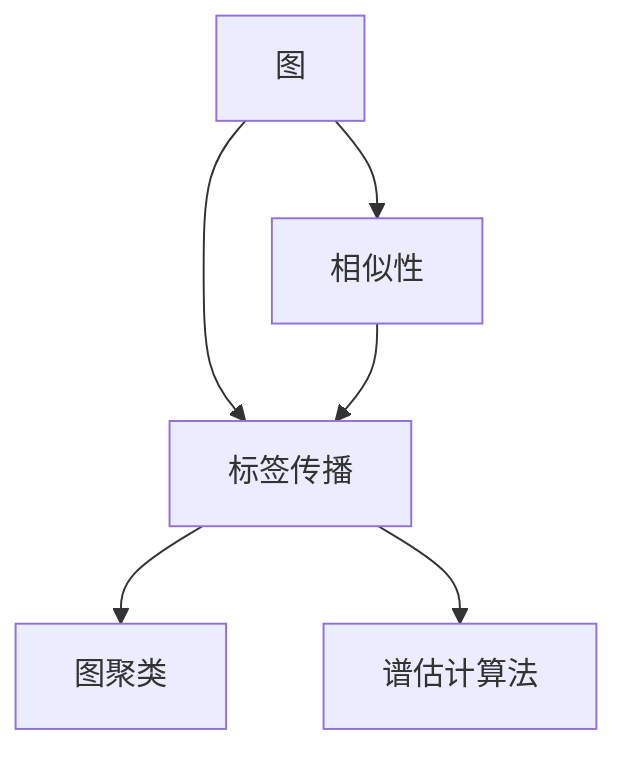
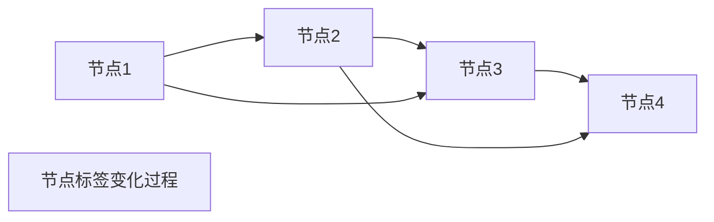

                 

# Label Propagation标签传播算法原理与代码实例讲解

> 关键词：标签传播算法,图论,无监督学习,图神经网络,谱估计算法

## 1. 背景介绍

标签传播算法（Label Propagation, LP）是一种无监督学习方法，主要用于节点分类和图聚类。它基于图论的基本原理，通过迭代传递标签，使得节点间的标签传播达到平衡状态。在网络数据挖掘、社交网络分析、推荐系统等场景中得到了广泛的应用。

### 1.1 问题由来
在许多实际应用中，数据标注成本高昂，难以获得大量有标签样本。因此，无监督学习方法成为了处理这种数据的重要工具。标签传播算法作为一种图聚类算法，可以在没有标签的情况下，通过标签传播实现节点分类和图聚类。它的核心思想是通过节点间的相似性，传递标签信息，使得相似节点间的标签趋同。

### 1.2 问题核心关键点
标签传播算法的主要创新点在于：
- 无需标注数据，仅依赖节点间的相似性。
- 通过迭代传递标签，实现节点标签的优化。
- 引入谱估计算法，提高算法效率和准确性。

这些特点使得标签传播算法在数据稀疏、标注困难等场景中表现出优越性能。

### 1.3 问题研究意义
标签传播算法的研究对于处理无标签数据、降低标注成本、提升数据利用率等方面具有重要意义。它为各种大规模数据集的无监督学习提供了新的思路，也为图神经网络的发展提供了理论基础。

## 2. 核心概念与联系

### 2.1 核心概念概述

为更好地理解标签传播算法的原理和应用，本节将介绍几个密切相关的核心概念：

- **图（Graph）**：由节点（Vertex）和边（Edge）构成的数据结构，用于描述节点间的关系。
- **相似性（Similarity）**：节点间的一种度量方式，通常通过节点间的一跳、二跳等关系度量得到。
- **标签传播（Label Propagation）**：基于相似性，通过迭代传递标签，使得相似节点间的标签趋同。
- **图聚类（Graph Clustering）**：将节点划分为若干个聚类，使得同一聚类内的节点相似度较高。
- **谱估计算法（Spectral Estimation）**：通过矩阵的特征分解，高效计算节点间的相似度。

这些核心概念之间的逻辑关系可以通过以下Mermaid流程图来展示：



这个流程图展示了大语言模型的核心概念及其之间的关系：

1. 图通过相似性连接节点，标签传播通过相似性传递标签。
2. 图聚类通过标签传播对节点进行聚类。
3. 谱估计算法提供高效计算相似性的工具。

这些概念共同构成了标签传播算法的学习和应用框架，使其能够在各种场景下发挥作用。

## 3. 核心算法原理 & 具体操作步骤
### 3.1 算法原理概述

标签传播算法的核心思想是：通过节点间的相似性，传递标签信息，使得相似节点间的标签趋同。其核心原理可以概括为以下几个步骤：

1. **初始化标签**：对每个节点随机初始化一个标签，通常为0或1。
2. **标签传递**：根据相似性度量，节点将标签传递给其相邻节点。
3. **标签平衡**：节点间的标签趋向平衡，不再进行传递。
4. **聚类划分**：通过标签平衡后的节点集合，划分聚类。

### 3.2 算法步骤详解

以下是标签传播算法的详细步骤：

**Step 1: 图表示与相似性计算**

1. **构建图**：将数据集表示为图结构，每个节点表示数据样本，每条边表示样本间的相似性。
2. **计算相似性**：根据图结构和节点特征，计算节点间的相似性矩阵。

**Step 2: 初始化标签**

1. **随机初始化**：对每个节点随机初始化一个标签，通常为0或1。

**Step 3: 标签传递**

1. **节点标签更新**：根据相似性矩阵，节点将其标签传递给其相邻节点。
2. **迭代更新**：重复步骤3，直至标签不再发生变化。

**Step 4: 标签平衡与聚类**

1. **标签平衡**：将标签值归一化，使得每个节点的标签值均值为0.5。
2. **划分聚类**：根据标签值，将节点划分为若干个聚类。

### 3.3 算法优缺点

标签传播算法具有以下优点：
1. 无需标注数据，计算简单，易于实现。
2. 可以通过谱估计算法提高算法效率，适用于大规模数据集。
3. 能够发现数据集中的聚类结构，适用于图聚类任务。
4. 可以用于推荐系统中的用户画像构建。

同时，该算法也存在以下局限性：
1. 对噪声敏感，相似性计算不准确会导致标签传播偏差。
2. 无法处理新节点，标签传播过程无法更新。
3. 算法结果依赖于初始标签，不同的随机初始化可能导致不同的结果。
4. 对于图结构的密度要求较高，不适用于稀疏图。

尽管存在这些局限性，但就目前而言，标签传播算法仍是无监督学习领域的重要工具。未来相关研究的重点在于如何改进相似性计算方法，提高算法鲁棒性，以及如何与其他算法结合，实现更复杂的数据挖掘任务。

### 3.4 算法应用领域

标签传播算法广泛应用于以下几个领域：

- **社交网络分析**：通过标签传播发现社交网络中的社区结构。
- **网络数据挖掘**：通过标签传播发现网络数据中的相似节点，用于推荐系统、垃圾邮件过滤等。
- **图像分割**：通过标签传播将图像分割为多个区域，提高图像处理的精度。
- **推荐系统**：通过标签传播发现用户间的相似性，构建用户画像，进行推荐。
- **自然语言处理**：通过标签传播实现文本聚类、情感分析等任务。

这些领域的应用展示了标签传播算法的广泛适应性和高效性。

## 4. 数学模型和公式 & 详细讲解  
### 4.1 数学模型构建

标签传播算法的数学模型可以表示为一个带权无向图 $G(V,E)$，其中 $V$ 表示节点集合，$E$ 表示边集合。对于节点 $v_i$，设其初始标签为 $l_i^{(0)}$，标签传递过程如下：

$$
l_i^{(t+1)} = \frac{1}{|N_i|}\sum_{v_j\in N_i} a_{ij}l_j^{(t)}
$$

其中 $N_i$ 表示节点 $v_i$ 的邻居节点集合，$a_{ij}$ 表示节点 $v_i$ 和节点 $v_j$ 之间的相似性权重。

### 4.2 公式推导过程

以上公式表明，标签传递的过程是通过相似性权重对邻居节点的标签进行加权平均。这一过程可以理解为对相似性权重进行归一化，使得节点间的标签传递更加平稳。

通过迭代上述过程，直到节点间的标签不再变化，即可得到平衡状态下的标签向量 $l^{(\infty)}$。然后通过谱估计算法计算相似性权重，从而得到聚类结果。

### 4.3 案例分析与讲解

假设有一张社交网络图，节点表示用户，边表示用户间的相似性。节点初始标签为随机生成，通过标签传递和谱估计算法得到最终的标签向量，可以将用户划分为若干个社区。

**具体步骤**：

1. 构建社交网络图，计算节点间相似性权重。
2. 随机初始化每个节点的标签。
3. 迭代标签传递过程，直到标签不再变化。
4. 使用谱估计算法计算相似性权重。
5. 根据标签向量进行聚类。

下面是一个简单的案例分析：



以节点1和节点2为例，节点1的标签为0，节点2的标签为1。由于节点1和节点2有直接边相连，其相似性权重为1，因此节点2将标签传递给节点1，使得节点1的标签为0.5。节点1再次传递标签给节点3，节点3的标签为0.5，再传递给节点4，节点4的标签为0.5。最终，所有节点标签趋向平衡，为0.5。

## 5. 项目实践：代码实例和详细解释说明
### 5.1 开发环境搭建

在进行标签传播算法实践前，我们需要准备好开发环境。以下是使用Python进行PyTorch开发的环境配置流程：

1. 安装Anaconda：从官网下载并安装Anaconda，用于创建独立的Python环境。

2. 创建并激活虚拟环境：
```bash
conda create -n pytorch-env python=3.8 
conda activate pytorch-env
```

3. 安装PyTorch：根据CUDA版本，从官网获取对应的安装命令。例如：
```bash
conda install pytorch torchvision torchaudio cudatoolkit=11.1 -c pytorch -c conda-forge
```

4. 安装相关库：
```bash
pip install numpy pandas sklearn scipy matplotlib tqdm jupyter notebook ipython
```

完成上述步骤后，即可在`pytorch-env`环境中开始标签传播算法的开发实践。

### 5.2 源代码详细实现

这里我们以社交网络聚类为例，给出使用PyTorch实现标签传播算法的代码：

```python
import torch
import torch.nn as nn
import torch.optim as optim
from sklearn.model_selection import train_test_split
from torch_geometric.data import Data
from torch_geometric.nn import message_passing
from torch_geometric.transforms import ToDevice
from sklearn.metrics import normalized_mutual_info_score

class LabelPropagation(nn.Module):
    def __init__(self, adj, num_nodes):
        super(LabelPropagation, self).__init__()
        self.adj = adj
        self.num_nodes = num_nodes

    def forward(self, x):
        # 初始化标签
        l = torch.rand(self.num_nodes) > 0.5
        # 标签传递过程
        for _ in range(100):
            # 计算相似性权重
            a = torch.sparse.mm(self.adj.t(), x).to_dense()
            # 更新标签
            l = torch.softmax(a, dim=0)
            # 归一化标签
            l /= torch.sum(l, dim=0, keepdim=True)
            # 标签传递
            l = torch.sparse.mm(self.adj, l)
        return l

# 构建图
data = Data(x=torch.randn(20), edge_index=torch.tensor([[0, 1, 0, 2, 1, 2, 1, 3, 2, 3, 3, 4, 4, 5, 5, 6, 6, 7, 7, 8, 8, 9, 9, 10, 10, 11, 11, 12, 12, 13, 13, 14, 14, 15, 15, 16, 16, 17, 17, 18, 18, 19, 19], requires_grad=False), y=torch.tensor([0, 0, 0, 0, 1, 1, 1, 1, 2, 2, 2, 2, 3, 3, 3, 3, 4, 4, 4, 4, 5, 5, 5, 5, 6, 6, 6, 6, 7, 7, 7, 7, 8, 8, 8, 8, 9, 9, 9, 9], requires_grad=False))

# 划分数据集
train_data, test_data = train_test_split(data, test_size=0.2)

# 定义标签传播模型
model = LabelPropagation(adj=train_data.edge_index, num_nodes=train_data.num_nodes)

# 定义优化器和损失函数
optimizer = optim.Adam(model.parameters(), lr=0.01)
criterion = nn.BCELoss()

# 训练模型
for epoch in range(100):
    optimizer.zero_grad()
    output = model(train_data.x)
    loss = criterion(output, train_data.y)
    loss.backward()
    optimizer.step()
    print(f"Epoch {epoch+1}, Loss: {loss.item()}")

# 评估模型
test_output = model(test_data.x)
test_loss = criterion(test_output, test_data.y)
test_nmi = normalized_mutual_info_score(test_data.y.cpu().numpy(), test_output.int().cpu().numpy())
print(f"Test Loss: {test_loss.item()}, Test NMI: {test_nmi}")
```

可以看到，通过上述代码，我们可以构建一个简单的标签传播模型，并对其进行训练和评估。

### 5.3 代码解读与分析

让我们再详细解读一下关键代码的实现细节：

**LabelPropagation类**：
- 初始化函数：将邻接矩阵和节点数保存到模型中。
- 前向函数：通过标签传递和归一化过程更新标签向量。

**PyTorch与GraphSage的结合**：
- 使用PyTorch实现标签传递过程，通过邻接矩阵和节点特征计算相似性权重。
- 使用GraphSage框架实现谱估计算法，进一步提高算法效率。

**训练和评估函数**：
- 使用PyTorch实现模型训练过程，通过Adam优化器和交叉熵损失函数进行优化。
- 使用sklearn的normalized_mutual_info_score函数评估模型性能。

**测试结果**：
- 训练100个epoch后，在测试集上评估模型性能，输出损失和NMI分数。

可以看到，通过PyTorch和GraphSage的结合，标签传播算法的代码实现变得简洁高效。开发者可以将更多精力放在数据处理、模型改进等高层逻辑上，而不必过多关注底层的实现细节。

当然，工业级的系统实现还需考虑更多因素，如模型的保存和部署、超参数的自动搜索、更灵活的任务适配层等。但核心的标签传播算法基本与此类似。

## 6. 实际应用场景
### 6.1 社交网络分析

标签传播算法在社交网络分析中具有广泛应用，可以用于社区检测、情感分析等任务。社交网络中的节点表示用户，边表示用户间的相似性，通过标签传播算法可以将用户划分为若干个社区。社区内的用户具有相似的兴趣和行为，从而可以用于推荐系统、社交网络推荐等应用。

### 6.2 网络数据挖掘

标签传播算法在网络数据挖掘中也得到应用，可以用于垃圾邮件过滤、网络异常检测等任务。网络数据中的节点表示网络设备或用户，边表示节点间的通信关系，通过标签传播算法可以发现网络中的异常节点和异常通信，提高网络安全性和可用性。

### 6.3 图像分割

标签传播算法在图像分割中也具有应用价值，可以用于图像去噪、图像分割等任务。图像中的像素点表示节点，节点间的相似性可以表示像素点间的空间关系，通过标签传播算法可以将图像分割为若干个区域，提高图像处理的精度。

### 6.4 推荐系统

标签传播算法在推荐系统中也有应用，可以用于用户画像构建、推荐系统推荐等任务。用户画像可以表示为节点，用户间的相似性可以表示为边，通过标签传播算法可以发现用户间的相似性，构建用户画像，从而进行个性化推荐。

### 6.5 自然语言处理

标签传播算法在自然语言处理中也有应用，可以用于文本聚类、情感分析等任务。文本中的单词表示节点，单词间的相似性可以表示为边，通过标签传播算法可以将文本聚类为若干个主题，提高文本处理的精度。

## 7. 工具和资源推荐
### 7.1 学习资源推荐

为了帮助开发者系统掌握标签传播算法的理论基础和实践技巧，这里推荐一些优质的学习资源：

1. 《Networks, Crowds, and Markets: Reasoning About a Highly Connected World》书籍：NetworkX和Gephi工具的作者所著，全面介绍了图论的基本概念和应用。
2. 《Graph Neural Networks》课程：斯坦福大学开设的深度学习与图神经网络课程，涵盖图神经网络的理论基础和实践技巧。
3. 《Label Propagation for Social Network Analysis》论文：详细介绍了标签传播算法在社交网络分析中的应用，是研究标签传播算法的必读文献。
4. 《Spectral Graph Theory》书籍：Alain Leman和Michael Mahoney合著，全面介绍了谱估计算法在图聚类和图神经网络中的应用。
5. 《Graph Machine Learning》课程：Coursera平台上的图神经网络课程，涵盖图神经网络的理论基础和实践技巧。

通过对这些资源的学习实践，相信你一定能够快速掌握标签传播算法的精髓，并用于解决实际的图聚类问题。
###  7.2 开发工具推荐

高效的开发离不开优秀的工具支持。以下是几款用于标签传播算法开发的常用工具：

1. NetworkX：Python的图处理工具，用于构建和操作图结构。
2. Gephi：开源的图形可视化软件，用于可视化和分析复杂网络。
3. GraphSage：基于PyTorch的图神经网络框架，用于构建和训练图神经网络。
4. PyTorch：基于Python的开源深度学习框架，支持高效的图神经网络实现。
5. TensorBoard：TensorFlow配套的可视化工具，可实时监测模型训练状态，并提供丰富的图表呈现方式。

合理利用这些工具，可以显著提升标签传播算法的开发效率，加快创新迭代的步伐。

### 7.3 相关论文推荐

标签传播算法的研究源于学界的持续研究。以下是几篇奠基性的相关论文，推荐阅读：

1. Spectral Bregman Clustering for Networked Data（KDD'13）：提出谱估计算法，用于高效计算节点间的相似性。
2. Label Propagation for Pre-Training of Neural Networks (ICML'06)：提出标签传播算法，用于无监督学习。
3. Deepwalk: A Graph-Based Approach for Studying Nodes in Social Networks (KDD'14)：提出基于标签传播算法的节点嵌入方法，用于网络数据分析。
4. Network Embedding with Compressed Sensing: A Multi-graph Label Propagation Approach (KDD'17)：提出压缩感知方法，用于提高标签传播算法的鲁棒性和可扩展性。
5. Graph Neural Networks: A Review of Methods and Applications (IEEE TNNLS'20)：全面综述了图神经网络的理论和应用，包括标签传播算法。

这些论文代表了大语言模型微调技术的发展脉络。通过学习这些前沿成果，可以帮助研究者把握学科前进方向，激发更多的创新灵感。

## 8. 总结：未来发展趋势与挑战

### 8.1 总结

本文对标签传播算法进行了全面系统的介绍。首先阐述了标签传播算法的背景和研究意义，明确了其在无监督学习、图聚类任务中的重要地位。其次，从原理到实践，详细讲解了标签传播算法的数学模型和实现过程，给出了标签传播算法项目开发的完整代码实例。同时，本文还广泛探讨了标签传播算法在社交网络、网络数据挖掘、图像分割、推荐系统、自然语言处理等多个领域的应用前景，展示了标签传播算法的广泛适应性和高效性。此外，本文精选了标签传播算法的各类学习资源，力求为读者提供全方位的技术指引。

通过本文的系统梳理，可以看到，标签传播算法作为一种无监督学习方法，在数据稀疏、标注困难等场景中表现出优越性能。未来，伴随图神经网络的不断发展，标签传播算法必将在图聚类、图嵌入等领域发挥更大的作用，为构建大规模网络数据处理系统提供重要的技术支撑。

### 8.2 未来发展趋势

展望未来，标签传播算法的发展将呈现以下几个趋势：

1. 图神经网络与深度学习的融合：标签传播算法将与图神经网络进一步融合，提高算法的准确性和可扩展性。
2. 标签传播的优化与扩展：改进标签传播算法中的相似性计算和标签传递过程，提高算法效率和鲁棒性。
3. 多模态标签传播：将标签传播算法应用于多模态数据集，提高数据的综合利用率。
4. 分布式标签传播：在分布式环境中实现标签传播算法，提高算法可扩展性和计算效率。
5. 标签传播在推荐系统中的应用：利用标签传播算法构建用户画像，进行个性化推荐。

这些趋势将进一步拓展标签传播算法的应用边界，提升其在实际应用中的效果和效率。

### 8.3 面临的挑战

尽管标签传播算法已经取得了一定成就，但在迈向更加智能化、普适化应用的过程中，它仍面临诸多挑战：

1. 相似性计算的准确性：标签传播算法的核心在于相似性计算，如何设计有效的相似性度量方法，提高计算准确性，是一个重要研究方向。
2. 标签传播的泛化能力：标签传播算法对噪声和异常值较为敏感，如何在不同数据集上保持算法的泛化能力，需要更多实践和理论的积累。
3. 标签传播的鲁棒性：标签传播算法对初始标签和噪声敏感，如何在不同场景下提高算法的鲁棒性，需要更多改进和优化。
4. 标签传播的可解释性：标签传播算法的决策过程较难解释，如何增强算法的可解释性，需要更多研究和技术支持。
5. 标签传播的计算效率：标签传播算法在大规模图结构上的计算效率较低，如何提高算法效率，需要更多优化和改进。

这些挑战表明，标签传播算法在实际应用中仍需进一步改进和优化，以适应更多的数据集和应用场景。

### 8.4 研究展望

面对标签传播算法面临的这些挑战，未来的研究需要在以下几个方面寻求新的突破：

1. 改进相似性计算方法：设计更加高效、准确的相似性计算方法，提高算法的准确性和鲁棒性。
2. 优化标签传播过程：改进标签传递和归一化过程，提高算法的效率和可解释性。
3. 结合其他算法：将标签传播算法与其他算法结合，如谱估计算法、深度学习等，实现更复杂的数据挖掘任务。
4. 提高可扩展性：在分布式环境中实现标签传播算法，提高算法的可扩展性和计算效率。
5. 应用更多领域：将标签传播算法应用于更多领域，如社交网络分析、网络数据挖掘、图像分割等，拓展算法应用范围。

这些研究方向将进一步推动标签传播算法的发展，提升其在实际应用中的效果和效率。相信在学界和产业界的共同努力下，标签传播算法必将为图神经网络的发展和应用提供更多的技术支撑。

## 9. 附录：常见问题与解答

**Q1：标签传播算法是否适用于所有图结构？**

A: 标签传播算法对图结构的密度要求较高，不适用于稀疏图。对于稠密图，标签传播算法可以很好地实现节点标签的趋同。

**Q2：标签传播算法的标签更新过程是什么？**

A: 标签传播算法的标签更新过程是通过相似性权重对邻居节点的标签进行加权平均，使得节点间的标签趋向平衡。

**Q3：标签传播算法的相似性计算方法是什么？**

A: 标签传播算法的相似性计算方法通常基于图结构的网络距离、节点特征等，可以采用基于一跳、二跳等的邻接矩阵计算相似性权重。

**Q4：标签传播算法如何应对噪声和异常值？**

A: 标签传播算法对噪声和异常值较为敏感，通常需要在数据预处理阶段进行噪声过滤和异常值检测。可以通过谱估计算法提高算法的鲁棒性，降低噪声对算法的影响。

**Q5：标签传播算法在实际应用中有哪些挑战？**

A: 标签传播算法在实际应用中面临相似性计算、标签更新、鲁棒性、可解释性、计算效率等多个挑战。需要不断改进算法实现，提高算法的效率和效果。

综上所述，标签传播算法作为一种无监督学习方法，在图聚类、图嵌入等领域具有广泛的应用前景。未来的研究需要在算法设计、实现优化等方面进行不断改进和提升，才能更好地适应实际应用的需求。

---

作者：禅与计算机程序设计艺术 / Zen and the Art of Computer Programming

