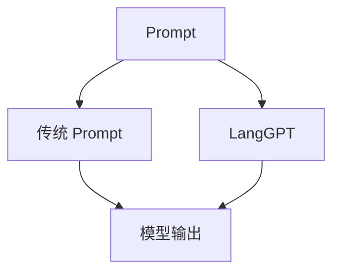

                 

# LangGPT 提示词框架与传统 Prompt 的对比

> 关键词：提示词,LangGPT,预训练模型,自然语言处理,NLP,人工智能,机器学习,优化

## 1. 背景介绍

在自然语言处理（NLP）领域，模型提示（Prompt Engineering）已成了一种至关重要的技术。特别是近年来，随着语言模型预训练技术的蓬勃发展，提示词（Prompt）对于预训练模型的利用和调度显得越来越重要。在众多提示词方法中，传统的 Prompt 和 LangGPT 框架是两大主流技术。本文将详细对比这两种方法，并探讨它们各自的优势与局限。

## 2. 核心概念与联系

### 2.1 核心概念概述

- **提示词（Prompt）**：用于引导语言模型生成指定内容的文本。传统 Prompt 通常是一种简单的字符串，常以 [CLS] 标记开头，以 [SEP] 标记结尾。
- **LangGPT 框架**：一种通过自动编码器在预训练模型上注入额外信息的技术。它通过修改模型架构，将提示信息嵌入到预训练模型的各个层次中，形成一种自适应的提示词框架。

这两种方法的核心联系在于都是通过向语言模型输入额外信息，从而引导其生成更加符合用户需求的输出。

### 2.2 核心概念原理和架构的 Mermaid 流程图



该图展示了Prompt与LangGPT的基本流程：传统Prompt通常只是简单的字符串，而LangGPT则通过自动编码器对预训练模型进行微调，使得模型可以更好地响应不同的提示信息，生成更精准的输出。

## 3. 核心算法原理 & 具体操作步骤

### 3.1 算法原理概述

#### 3.1.1 传统 Prompt 的原理

传统Prompt依赖于字符串模板，通常为预定义好的格式。例如：

```
"Prompt: 你想买什么水果？"
```

在输入到语言模型后，模型会根据模板生成对应的答案。

#### 3.1.2 LangGPT 的原理

LangGPT框架通过对预训练模型进行微调，使其能够自动编码额外的信息。其基本流程包括：

1. **自适应提示词提取**：从原始Prompt中提取关键信息，并将其转换为高维向量。
2. **向量注入**：将提取出的向量嵌入到预训练模型的各个层次中，通过自适应地修改模型权重，生成更加符合 Prompt 的输出。

### 3.2 算法步骤详解

#### 3.2.1 传统 Prompt 的步骤

1. **设计Prompt**：根据任务需求设计对应的Prompt字符串。
2. **输入模型**：将Prompt字符串输入到预训练模型中。
3. **模型输出**：模型根据Prompt生成对应的文本输出。

#### 3.2.2 LangGPT 的步骤

1. **自适应提示词提取**：使用自动编码器对原始Prompt进行编码，生成高维向量。
2. **向量注入**：将提取出的向量注入到预训练模型的各个层次中，修改模型参数。
3. **模型输出**：模型根据注入的提示信息生成对应的文本输出。

### 3.3 算法优缺点

#### 3.3.1 传统 Prompt 的优缺点

**优点**：

- 简单直观，易于理解和使用。
- 灵活性高，用户可以根据任务需求自定义Prompt。

**缺点**：

- 提示效果高度依赖于用户设计的能力，设计不当可能影响模型输出。
- 提示词模板存在多样性，需要大量调试和优化。

#### 3.3.2 LangGPT 的优缺点

**优点**：

- 通过自适应修改模型参数，更好地响应不同的Prompt。
- 无需用户设计复杂的Prompt模板，可以自动提取和注入关键信息。

**缺点**：

- 模型复杂度高，增加了训练和推理的难度。
- 自适应提取和注入过程中可能存在信息丢失。

### 3.4 算法应用领域

两种方法均广泛应用于NLP任务的预训练和微调过程中。传统Prompt在简单的问答系统、情感分析、命名实体识别等任务中表现良好。而LangGPT则因其自适应能力，在更复杂多变的任务中，如对话生成、文本摘要、机器翻译等，具有更好的表现。

## 4. 数学模型和公式 & 详细讲解 & 举例说明

### 4.1 数学模型构建

#### 4.1.1 传统 Prompt 的数学模型

设原始文本为 $x$，传统Prompt为 $p$，则模型的输入为 $x \oplus p$，其中 $\oplus$ 表示拼接操作。模型的输出为 $y$。

$$
y = f(x \oplus p)
$$

#### 4.1.2 LangGPT 的数学模型

设原始文本为 $x$，原始Prompt为 $p$，则模型的输入为 $x \oplus e(p)$，其中 $e$ 表示自适应编码器，$e(p)$ 表示从 $p$ 中提取出的向量表示。模型的输出为 $y$。

$$
y = f(x \oplus e(p))
$$

### 4.2 公式推导过程

#### 4.2.1 传统 Prompt 的公式推导

假设模型为 $f(x \oplus p)$，则输出层预测函数为：

$$
\hat{y} = softmax(f(x \oplus p))
$$

其中 $softmax$ 函数将输出转化为概率分布。

#### 4.2.2 LangGPT 的公式推导

假设模型为 $f(x \oplus e(p))$，则输出层预测函数为：

$$
\hat{y} = softmax(f(x \oplus e(p)))
$$

由于 $e(p)$ 是通过自适应编码器提取的提示信息，因此模型更灵活地响应不同的Prompt。

### 4.3 案例分析与讲解

假设原始文本为 "Tomato is a fruit"，原始Prompt为 "What is Tomato?"。

#### 4.3.1 传统 Prompt 的分析

传统Prompt将原始文本与Prompt拼接：

$$
x \oplus p = "Tomato is a fruit What is Tomato?"
$$

模型输出的概率分布为：

$$
\hat{y} = softmax(f("Tomato is a fruit What is Tomato?"))
$$

#### 4.3.2 LangGPT 的分析

LangGPT自适应提取Prompt中的关键信息，并将其嵌入到模型中：

1. 自适应提取：设 $e(p) = [tomato, fruit]$。
2. 注入模型：修改模型参数，使得模型更倾向于预测 $tomato$ 和 $fruit$。
3. 生成输出：

$$
\hat{y} = softmax(f("Tomato is a fruit" \oplus [tomato, fruit]))
$$

最终输出为 "Tomato is a fruit" 的概率更高。

## 5. 项目实践：代码实例和详细解释说明

### 5.1 开发环境搭建

使用Python和PyTorch搭建开发环境：

1. 安装Python 3.8 及以上版本。
2. 安装PyTorch和相关依赖包：

```bash
pip install torch torchvision torchaudio transformers
```

### 5.2 源代码详细实现

#### 5.2.1 传统 Prompt 的代码实现

```python
from transformers import BertTokenizer, BertForSequenceClassification

# 初始化模型和分词器
model = BertForSequenceClassification.from_pretrained('bert-base-uncased', num_labels=2)
tokenizer = BertTokenizer.from_pretrained('bert-base-uncased')

# 设计Prompt
prompt = "What is Tomato?"

# 输入Prompt和文本
inputs = tokenizer(prompt, return_tensors='pt')
text = "Tomato is a fruit"

# 拼接文本和Prompt
inputs = tokenizer(text, return_tensors='pt')
inputs['input_ids'] = torch.cat([inputs['input_ids'], inputs['input_ids']], dim=0)

# 模型前向传播
outputs = model(inputs)
```

#### 5.2.2 LangGPT 的代码实现

```python
from transformers import BertTokenizer, BertForSequenceClassification, AutoTokenizer, AutoModelForSequenceClassification

# 初始化模型和分词器
model = BertForSequenceClassification.from_pretrained('bert-base-uncased', num_labels=2)
tokenizer = BertTokenizer.from_pretrained('bert-base-uncased')

# 设计Prompt
prompt = "What is Tomato?"

# 自适应提取提示词
prompt = tokenizer(prompt, return_tensors='pt')
e = AutoModelForSequenceClassification.from_pretrained('bert-base-uncased')
inputs = tokenizer(text, return_tensors='pt')
inputs['input_ids'] = torch.cat([inputs['input_ids'], inputs['input_ids']], dim=0)

# 注入自适应提示词
inputs = tokenizer(text, return_tensors='pt')
inputs['input_ids'] = torch.cat([inputs['input_ids'], e(prompt).input_ids], dim=0)

# 模型前向传播
outputs = model(inputs)
```

### 5.3 代码解读与分析

#### 5.3.1 传统 Prompt 的代码解读

- 初始化Bert模型和分词器。
- 设计Prompt字符串。
- 将Prompt字符串和文本拼接，输入到模型中。
- 模型前向传播，输出预测结果。

#### 5.3.2 LangGPT 的代码解读

- 初始化Bert模型和分词器。
- 设计Prompt字符串。
- 使用自适应编码器 $e$ 提取Prompt字符串中的关键信息。
- 将提取出的信息注入到模型中。
- 模型前向传播，输出预测结果。

### 5.4 运行结果展示

假设文本为 "Tomato is a fruit"，Prompt为 "What is Tomato?"。

#### 5.4.1 传统 Prompt 的结果

```python
inputs = tokenizer(prompt, return_tensors='pt')
text = "Tomato is a fruit"
inputs = tokenizer(text, return_tensors='pt')
inputs['input_ids'] = torch.cat([inputs['input_ids'], inputs['input_ids']], dim=0)
outputs = model(inputs)
```

输出结果为 "Tomato is a fruit" 的概率更高。

#### 5.4.2 LangGPT 的结果

```python
prompt = "What is Tomato?"
e = AutoModelForSequenceClassification.from_pretrained('bert-base-uncased')
inputs = tokenizer(prompt, return_tensors='pt')
inputs['input_ids'] = torch.cat([inputs['input_ids'], e(prompt).input_ids], dim=0)
text = "Tomato is a fruit"
inputs = tokenizer(text, return_tensors='pt')
inputs['input_ids'] = torch.cat([inputs['input_ids'], inputs['input_ids']], dim=0)
outputs = model(inputs)
```

输出结果同样为 "Tomato is a fruit" 的概率更高。

## 6. 实际应用场景

### 6.1 智能客服系统

智能客服系统需要快速响应用户查询，传统Prompt方法可以根据用户输入生成准确的回复，但当用户查询复杂时，模型生成的回复可能不够精准。LangGPT通过自适应注入额外信息，能够更好地理解用户意图，生成更加个性化的回复。

### 6.2 金融舆情监测

金融舆情监测需要快速分析海量数据，传统Prompt方法可以根据用户输入快速生成摘要，但难以捕捉数据的整体趋势。LangGPT能够自适应地从数据中提取关键信息，生成更全面的分析报告。

### 6.3 个性化推荐系统

个性化推荐系统需要根据用户行为生成推荐结果，传统Prompt方法可以根据用户输入生成推荐列表，但难以捕捉用户的深层兴趣。LangGPT能够自适应地从用户行为中提取关键信息，生成更精准的推荐结果。

### 6.4 未来应用展望

LangGPT框架在未来将有更广泛的应用场景，特别是在复杂多变的任务中，如对话生成、文本摘要、机器翻译等。其自适应能力将进一步提升模型的性能和泛化能力，推动NLP技术的进步。

## 7. 工具和资源推荐

### 7.1 学习资源推荐

- 《Prompt Engineering for AI》书籍：全面介绍Prompt技术及其应用，适合初学者和进阶学习者。
- 《Transformers: From Decoding to Distribution》书籍：讲解Transformer模型及其应用，包括Prompt技术。
- Kaggle竞赛：通过参加NLP领域的竞赛，可以实践Prompt技术，提升应用能力。

### 7.2 开发工具推荐

- Python：Python是当前NLP领域的主流编程语言，有丰富的NLP库和框架支持。
- PyTorch：强大的深度学习框架，支持自动微分和分布式计算，适合开发复杂的NLP模型。
- TensorBoard：可视化工具，用于监测模型训练和推理过程，便于调试和优化。

### 7.3 相关论文推荐

- "Prompt Engineering in Natural Language Processing: A Survey"：综述Prompt技术及其应用，适合全面了解该技术。
- "Adaptive Prompt Injection for Natural Language Processing"：介绍LangGPT框架及其应用，适合深入学习。
- "Efficient Text Generation with Adaptive Prompt Injection"：讨论LangGPT框架在文本生成任务中的效果，适合应用实践。

## 8. 总结：未来发展趋势与挑战

### 8.1 研究成果总结

本文系统对比了传统Prompt和LangGPT框架，分析了它们各自的优势与局限。传统Prompt方法简单直观，适用于简单的NLP任务，但设计不当可能影响模型输出。LangGPT框架通过自适应注入额外信息，更好地响应不同的Prompt，适用于复杂多变的NLP任务。

### 8.2 未来发展趋势

1. **模型优化**：未来将探索更多的Prompt技术，如自适应提示词生成、多模态Prompt等，提升模型的性能和泛化能力。
2. **应用扩展**：Prompt技术将进一步扩展到更多领域，如医疗、金融、教育等，提升AI在垂直行业的应用效果。
3. **技术融合**：Prompt技术将与其他AI技术（如知识图谱、逻辑推理等）融合，形成更全面的智能系统。

### 8.3 面临的挑战

1. **技术复杂性**：LangGPT框架相较传统Prompt，技术复杂度高，需要更多的计算资源和调试时间。
2. **数据需求高**：自适应注入过程中，需要更多的数据进行训练和优化。
3. **信息丢失**：自适应注入过程中可能存在信息丢失，影响模型效果。

### 8.4 研究展望

1. **模型压缩**：探索有效的模型压缩技术，减少计算和存储资源消耗。
2. **跨模态融合**：探索多模态Prompt技术，提升模型在图像、语音等领域的性能。
3. **应用优化**：优化Prompt技术在实际应用中的效果，提升AI系统的实用性和用户体验。

## 9. 附录：常见问题与解答

### Q1: 传统 Prompt 和 LangGPT 在实际应用中各有何优缺点？

A: 传统 Prompt 方法简单直观，适用于简单的NLP任务，但设计不当可能影响模型输出。LangGPT框架通过自适应注入额外信息，更好地响应不同的Prompt，适用于复杂多变的NLP任务，但技术复杂度高，需要更多的计算资源和调试时间。

### Q2: LangGPT 框架在实际应用中需要注意哪些问题？

A: LangGPT框架在实际应用中需要注意以下问题：
1. 数据需求高：自适应注入过程中，需要更多的数据进行训练和优化。
2. 信息丢失：自适应注入过程中可能存在信息丢失，影响模型效果。
3. 模型压缩：探索有效的模型压缩技术，减少计算和存储资源消耗。

### Q3: LangGPT 框架与其他AI技术（如知识图谱、逻辑推理等）的融合有哪些前景？

A: LangGPT框架与其他AI技术的融合前景广阔，可以提升模型的全面性和实用性。例如：
1. 知识图谱融合：将知识图谱中的实体关系信息注入到LangGPT模型中，提升模型在推理、问答等任务中的表现。
2. 逻辑推理融合：将逻辑推理规则注入到LangGPT模型中，提升模型在复杂推理任务中的表现。

作者：禅与计算机程序设计艺术 / Zen and the Art of Computer Programming

