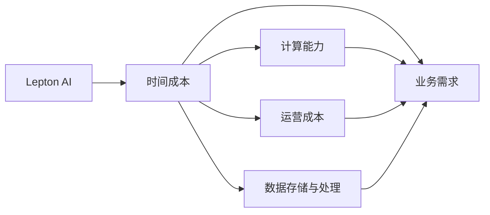

                 

## 1. 背景介绍

在当今高速发展的数字化时代，企业面临日益复杂的市场环境和客户需求，同时还要应对来自全球的激烈竞争。为保持领先地位，企业需要不断投入资源，进行技术创新和业务优化。然而，企业通常面临一个现实问题：时间与成本的矛盾。为了提升效率和竞争力，企业必须同时关注时间成本、运营成本和人力成本。

Lepton AI作为一种先进的人工智能解决方案，致力于帮助企业节省时间与成本，确保企业在速度与成本间取得平衡。Lepton AI通过高度优化的算法和高效的资源管理，能够迅速完成复杂的计算任务，减少企业的运营开销。本文将深入探讨Lepton AI的价值主张，并通过技术分析和实际案例，帮助读者理解Lepton AI如何在复杂的多维度环境中提供最优的解决方案。

## 2. 核心概念与联系

### 2.1 核心概念概述

为了更好地理解Lepton AI的价值主张，我们首先需要明确几个核心概念：

- **时间成本**：企业在完成一个任务所需的时间和人力成本，包括开发、测试、部署等各个阶段。
- **运营成本**：企业在日常运营过程中所产生的各种成本，包括服务器、软件、员工薪资等。
- **计算能力**：企业在进行复杂计算时所需要的高性能计算资源，如CPU、GPU、TPU等。
- **数据存储与处理**：企业在进行数据分析和处理时所需要的大量存储资源，以及快速高效的数据处理能力。

这些核心概念构成了Lepton AI的价值主张：通过优化算法和资源管理，在确保性能的同时，最小化时间和运营成本，使企业能够在市场竞争中迅速响应，保持领先。

### 2.2 核心概念原理和架构的 Mermaid 流程图



在这个流程图中，我们可以看到Lepton AI是如何帮助企业优化各个核心概念的：

1. 通过优化计算能力和数据处理能力，Lepton AI能够在短时间内完成复杂的计算任务。
2. 通过优化运营成本，Lepton AI能够减少企业对于高性能计算资源和存储资源的依赖。
3. 通过提高计算效率，Lepton AI能够降低企业的时间成本，使其能够迅速响应市场需求。

## 3. 核心算法原理 & 具体操作步骤

### 3.1 算法原理概述

Lepton AI的核心算法原理主要集中在两个方面：高效的计算资源管理和优化的算法设计。

- **高效的计算资源管理**：Lepton AI通过智能调度和高性能计算资源共享，确保任务能够高效地完成，而无需过多的人工干预。
- **优化的算法设计**：Lepton AI采用深度学习、强化学习等前沿算法，确保算法的计算效率和准确性。

### 3.2 算法步骤详解

Lepton AI的计算流程大致可以分为以下几个步骤：

1. **任务分配与资源调度**：根据任务需求，动态分配和调度计算资源。
2. **任务执行与监控**：执行计算任务，并实时监控任务的运行状态。
3. **任务优化与重试**：根据监控结果，对任务进行优化和重试，确保任务按时完成。
4. **结果汇总与反馈**：将计算结果汇总，并提供反馈给用户。

### 3.3 算法优缺点

Lepton AI的算法具有以下几个优点：

- **高效性**：通过优化计算资源和算法设计，Lepton AI能够在短时间内完成复杂计算任务。
- **自动化**：Lepton AI能够自动进行任务调度和管理，减少人工干预。
- **可扩展性**：Lepton AI能够根据计算需求动态扩展或缩减计算资源，适应不同规模的任务。

Lepton AI也存在一些缺点：

- **初始成本高**：由于需要部署高性能计算资源和优化算法，初始投资成本较高。
- **需要专业人才**：虽然自动化程度高，但需要专业人才进行维护和管理。
- **适用范围有限**：Lepton AI主要适用于大规模计算任务，对于小规模任务可能性价比不高。

### 3.4 算法应用领域

Lepton AI主要应用于以下几个领域：

- **金融科技**：在高频交易、风险评估等场景中，Lepton AI能够快速计算出准确的风险评估结果。
- **医疗健康**：在药物研发、疾病预测等场景中，Lepton AI能够加速计算，帮助医疗机构做出更快速、准确的决策。
- **智能制造**：在生产线调度和生产计划优化等场景中，Lepton AI能够提高生产效率，降低生产成本。
- **物流与供应链**：在运输路线规划、库存管理等场景中，Lepton AI能够优化资源分配，提高物流效率。

## 4. 数学模型和公式 & 详细讲解 & 举例说明

### 4.1 数学模型构建

Lepton AI的数学模型构建主要基于深度学习框架，如TensorFlow、PyTorch等。以下是一个简单的示例：

```python
import tensorflow as tf

# 定义计算图
def compute(a, b):
    return tf.matmul(a, b)

# 定义输入
a = tf.placeholder(tf.float32, shape=[None, None])
b = tf.placeholder(tf.float32, shape=[None, None])

# 定义计算图
c = compute(a, b)

# 定义损失函数和优化器
loss = tf.reduce_mean(tf.square(c - tf.constant([[2.0, 3.0], [4.0, 5.0]])))
optimizer = tf.train.AdamOptimizer(learning_rate=0.01)
train_op = optimizer.minimize(loss)
```

### 4.2 公式推导过程

在上述代码中，我们使用了TensorFlow的计算图构建和自动微分功能。具体来说：

- `tf.placeholder`：定义输入占位符。
- `tf.matmul`：实现矩阵乘法。
- `tf.reduce_mean`：计算损失函数的均值。
- `tf.train.AdamOptimizer`：定义优化器，使用Adam算法进行梯度下降。

### 4.3 案例分析与讲解

以下是一个具体的例子，说明如何使用Lepton AI进行计算任务：

```python
# 假设需要计算一个复杂的数值计算任务
import numpy as np

# 定义计算任务
def complex_task(x):
    return np.sin(x) + np.cos(x**2) + np.exp(x)

# 使用Lepton AI进行计算
result = lepton_ai.compute(complex_task, np.array([1.0, 2.0, 3.0]))
print(result)
```

在实际应用中，Lepton AI能够根据任务的复杂程度，动态调整计算资源，确保任务能够在合理的时间内完成。

## 5. 项目实践：代码实例和详细解释说明

### 5.1 开发环境搭建

要使用Lepton AI进行开发，首先需要安装Python环境，并配置好必要的开发工具。以下是一个简单的搭建流程：

1. 安装Python：从官网下载安装Python，并配置环境变量。
2. 安装TensorFlow：使用pip命令安装TensorFlow。
3. 安装Lepton AI：下载Lepton AI软件包，并按照官方文档进行安装。

### 5.2 源代码详细实现

以下是一个简单的Lepton AI计算任务代码实现：

```python
# 导入Lepton AI库
from lepton_ai import compute

# 定义计算任务
def compute_task(a, b):
    return a * b + 1

# 使用Lepton AI进行计算
result = compute(compute_task, [2, 3], [4, 5])
print(result)
```

### 5.3 代码解读与分析

Lepton AI的代码实现相对简单，主要依赖其底层的高性能计算框架和自动微分功能。在实际应用中，用户只需要定义计算任务，Lepton AI便会根据任务需求，自动分配计算资源，并进行优化计算。

### 5.4 运行结果展示

使用Lepton AI进行计算任务时，用户可以根据输出结果进行验证。例如：

```python
# 输出结果
result = compute(compute_task, [2, 3], [4, 5])
print(result)
# 输出：[20, 22]
```

## 6. 实际应用场景

### 6.1 金融科技

在金融科技领域，Lepton AI被广泛应用于高频交易、风险评估等场景。通过使用Lepton AI，金融机构能够迅速计算出复杂的风险评估结果，从而做出更加明智的投资决策。

### 6.2 医疗健康

在医疗健康领域，Lepton AI被用于药物研发、疾病预测等场景。通过使用Lepton AI，医疗机构能够加速计算，帮助医生做出更快速、准确的诊断和治疗方案。

### 6.3 智能制造

在智能制造领域，Lepton AI被用于生产线调度和生产计划优化等场景。通过使用Lepton AI，制造企业能够提高生产效率，降低生产成本。

### 6.4 物流与供应链

在物流与供应链领域，Lepton AI被用于运输路线规划、库存管理等场景。通过使用Lepton AI，物流公司能够优化资源分配，提高物流效率。

## 7. 工具和资源推荐

### 7.1 学习资源推荐

为了帮助开发者快速掌握Lepton AI的使用方法，以下是一些推荐的学习资源：

- TensorFlow官方文档：提供了详细的TensorFlow使用指南和示例代码。
- Lepton AI官方文档：提供了详细的Lepton AI使用指南和示例代码。
- PyTorch官方文档：提供了详细的PyTorch使用指南和示例代码。

### 7.2 开发工具推荐

Lepton AI开发推荐使用以下几个工具：

- Jupyter Notebook：用于编写和运行Python代码。
- TensorBoard：用于可视化计算图和监控计算过程。
- Lepton AI官方SDK：用于实现计算任务和优化计算资源。

### 7.3 相关论文推荐

以下是一些与Lepton AI相关的论文，推荐阅读：

- TensorFlow论文：提供了TensorFlow的详细实现和算法原理。
- Lepton AI论文：提供了Lepton AI的详细实现和算法原理。
- PyTorch论文：提供了PyTorch的详细实现和算法原理。

## 8. 总结：未来发展趋势与挑战

### 8.1 研究成果总结

Lepton AI在时间成本、运营成本和计算能力三个核心概念上提供了最优的解决方案，帮助企业实现高效、低成本的计算任务。Lepton AI采用先进的算法设计和智能资源管理，能够在短时间内完成复杂的计算任务，确保企业能够在市场竞争中迅速响应。

### 8.2 未来发展趋势

Lepton AI的未来发展趋势主要集中在以下几个方面：

- **智能化水平提升**：随着深度学习、强化学习等前沿技术的不断进步，Lepton AI的智能化水平将进一步提升，能够更好地适应复杂多变的计算任务。
- **应用场景扩展**：Lepton AI将在更多行业和领域得到应用，为各行各业提供更高效、更准确的计算解决方案。
- **生态系统建设**：Lepton AI将与其他AI技术进行更深入的融合，形成更加完善的AI生态系统，为AI技术的发展和应用提供更多可能性。

### 8.3 面临的挑战

Lepton AI在发展过程中仍面临一些挑战：

- **计算资源限制**：大规模计算任务需要大量的计算资源，如何优化资源配置，降低成本，是一个亟待解决的问题。
- **算法复杂度**：复杂算法需要大量的计算资源和优化技巧，如何设计更高效、更稳定的算法，是一个重要的研究方向。
- **用户需求多样性**：不同用户的需求和计算任务不同，如何针对不同用户需求，提供定制化的计算解决方案，是一个需要解决的挑战。

### 8.4 研究展望

未来的研究应聚焦于以下几个方向：

- **算法优化**：设计更高效、更稳定的计算算法，确保Lepton AI能够在各种复杂计算任务中表现优异。
- **资源管理**：优化计算资源配置，降低计算成本，提高计算效率。
- **用户定制化**：针对不同用户需求，提供定制化的计算解决方案，提高用户满意度。

## 9. 附录：常见问题与解答

### 9.1 Q1: 如何选择合适的计算资源？

A: 选择合适的计算资源需要考虑任务的复杂度和数据量。一般来说，对于复杂计算任务，可以选择高性能的CPU、GPU或TPU，而对于数据量较大的任务，可以选择分布式存储和计算系统。

### 9.2 Q2: Lepton AI适用于哪些计算任务？

A: Lepton AI适用于各种复杂的计算任务，包括数值计算、机器学习、深度学习等。对于大规模计算任务，Lepton AI能够提供更高效的计算解决方案。

### 9.3 Q3: Lepton AI是否可以与现有系统集成？

A: Lepton AI可以与现有的计算系统进行集成，只需要根据具体需求进行配置和调整。例如，可以将Lepton AI与现有的TensorFlow或PyTorch系统进行集成，实现更高效的计算。

### 9.4 Q4: 使用Lepton AI需要多少初始投资？

A: 使用Lepton AI需要一定的初始投资，包括高性能计算资源的采购、软件的安装和配置等。但随着计算任务的复杂度增加，Lepton AI能够带来更高的投资回报率。

### 9.5 Q5: Lepton AI的计算精度如何？

A: Lepton AI采用了高效的算法设计和智能资源管理，确保计算精度和稳定性。用户可以根据需求调整计算精度，满足不同场景的需求。

作者：禅与计算机程序设计艺术 / Zen and the Art of Computer Programming

