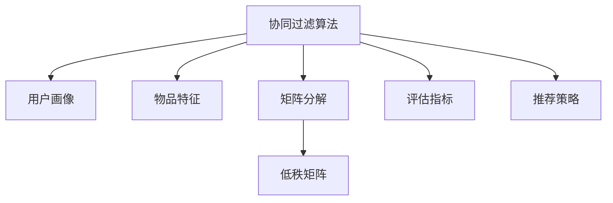

                 

# Mahout推荐算法原理与代码实例讲解

> 关键词：协同过滤算法, Mahout, 推荐系统, 用户画像, 物品特征, 矩阵分解

## 1. 背景介绍

### 1.1 问题由来

推荐系统（Recommender System）已经成为现代互联网应用中的核心技术之一，广泛应用于电子商务、内容分发、社交网络等领域。推荐系统通过分析用户的行为数据，预测用户可能感兴趣的商品、内容或服务，从而为用户带来更好的体验，提升平台的用户粘性和商业价值。

随着用户数据量的激增和推荐场景的多样化，传统的基于人工特征的推荐系统已难以满足需求，协同过滤（Collaborative Filtering）算法应运而生。协同过滤算法通过分析用户之间和物品之间的相似性，预测用户对未购买/浏览物品的兴趣，从而实现个性化推荐。Mahout是Apache软件基金会的一个开源推荐系统框架，基于协同过滤算法实现了多种推荐策略。

本文将详细介绍Mahout的推荐算法原理与代码实例，帮助读者理解推荐系统的工作机制，并掌握如何使用Mahout构建和优化推荐模型。

### 1.2 问题核心关键点

为了深入理解Mahout推荐算法，我们需要关注以下核心关键点：

- **协同过滤算法**：Mahout的推荐核心，通过用户-物品交互矩阵进行相似性计算，生成推荐结果。
- **用户画像和物品特征**：用户画像和物品特征是协同过滤算法的基础，用于描述用户兴趣和物品属性。
- **矩阵分解**：Mahout中的SVD分解算法，用于低秩矩阵近似，减少推荐模型的计算复杂度。
- **评估指标**：如准确率、召回率、F1分数、NDCG等，用于衡量推荐系统的性能。
- **推荐策略**：如基于用户的协同过滤、基于物品的协同过滤、混合协同过滤等，用于根据不同场景选择最合适的推荐方法。

### 1.3 问题研究意义

学习Mahout推荐算法对于构建高效、精准的推荐系统具有重要意义：

1. **降低人工干预**：减少对人工特征的依赖，提升推荐系统的自动化水平。
2. **提升推荐效果**：通过协同过滤算法，准确预测用户兴趣，实现个性化推荐。
3. **增强可扩展性**：Mahout支持分布式计算，适用于大规模推荐系统的构建。
4. **支持多种推荐策略**：提供多种推荐策略，帮助选择最适合的推荐方法。

本文将通过详细介绍Mahout的推荐算法原理和代码实现，为读者提供全面的技术指导，助力推荐系统开发。

## 2. 核心概念与联系

### 2.1 核心概念概述

为更好地理解Mahout的推荐算法，本节将介绍几个关键概念：

- **协同过滤算法（Collaborative Filtering）**：一种基于用户-物品交互数据的推荐方法，通过分析用户和物品之间的相似性，预测用户对未交互物品的兴趣。
- **用户画像（User Profile）**：描述用户兴趣和行为的特征向量，用于协同过滤算法中的相似性计算。
- **物品特征（Item Feature）**：描述物品属性和标签的特征向量，用于协同过滤算法中的相似性计算。
- **矩阵分解（Matrix Factorization）**：将高维用户-物品交互矩阵分解为低秩矩阵，用于降低推荐模型的计算复杂度。
- **评估指标（Evaluation Metrics）**：如准确率、召回率、F1分数、NDCG等，用于衡量推荐系统的性能。
- **推荐策略（Recommender Strategies）**：如基于用户的协同过滤、基于物品的协同过滤、混合协同过滤等，用于根据不同场景选择最合适的推荐方法。

这些概念之间的逻辑关系可以通过以下Mermaid流程图来展示：



这个流程图展示了大语言模型的核心概念及其之间的关系：

1. 协同过滤算法通过用户画像和物品特征计算相似性，生成推荐结果。
2. 矩阵分解将高维用户-物品交互矩阵近似为低秩矩阵，减少推荐模型的计算复杂度。
3. 评估指标用于衡量推荐系统的性能，指导模型优化。
4. 推荐策略根据不同场景选择最适合的推荐方法，提升推荐效果。

这些概念共同构成了Mahout的推荐算法框架，使得推荐系统能够高效、准确地为用户推荐个性化内容。

## 3. 核心算法原理 & 具体操作步骤
### 3.1 算法原理概述

Mahout的推荐算法主要基于协同过滤算法，通过分析用户-物品交互矩阵，计算用户和物品之间的相似性，生成推荐结果。其核心思想是：利用用户的过往行为数据，推测其未尝试过的物品，从而提升推荐效果。

具体而言，Mahout的推荐算法包括以下步骤：

1. **数据预处理**：将用户-物品交互数据转换为稀疏矩阵形式，便于后续计算。
2. **计算相似性**：使用用户画像和物品特征，计算用户和物品之间的相似性。
3. **生成推荐结果**：根据相似性计算结果，生成推荐列表。
4. **模型评估**：使用评估指标评估推荐系统性能，进行模型优化。

### 3.2 算法步骤详解

下面详细介绍Mahout推荐算法的详细步骤：

**Step 1: 数据预处理**

- 将用户-物品交互数据转换为稀疏矩阵形式，用于后续计算。
- 使用用户画像和物品特征，计算用户和物品之间的相似性。

**Step 2: 计算相似性**

- 使用用户画像和物品特征，计算用户和物品之间的相似性。

**Step 3: 生成推荐结果**

- 根据相似性计算结果，生成推荐列表。

**Step 4: 模型评估**

- 使用评估指标评估推荐系统性能，进行模型优化。

### 3.3 算法优缺点

Mahout推荐算法具有以下优点：

- 简单易用：基于协同过滤算法，易于理解和实现。
- 效果显著：通过用户和物品的相似性计算，生成精准的推荐结果。
- 扩展性强：支持分布式计算，适用于大规模推荐系统的构建。

同时，该算法也存在一定的局限性：

- 数据稀疏性问题：用户-物品交互矩阵往往非常稀疏，容易导致计算复杂度增加。
- 用户画像和物品特征的影响：用户画像和物品特征的质量直接影响推荐效果。
- 过拟合问题：协同过滤算法容易在用户-物品交互数据过少时出现过拟合。

### 3.4 算法应用领域

Mahout推荐算法广泛应用于电子商务、内容分发、社交网络等领域，具体包括：

- 在线商店推荐系统：推荐用户可能感兴趣的商品。
- 视频网站内容推荐：推荐用户可能感兴趣的视频内容。
- 社交网络好友推荐：推荐用户可能感兴趣的新朋友。
- 音乐平台歌曲推荐：推荐用户可能感兴趣的歌曲。

此外，Mahout还支持多种推荐策略，如基于用户的协同过滤、基于物品的协同过滤、混合协同过滤等，帮助选择最适合的推荐方法。

## 4. 数学模型和公式 & 详细讲解 & 举例说明

### 4.1 数学模型构建

Mahout的推荐算法主要基于协同过滤算法，通过计算用户和物品之间的相似性，生成推荐结果。

假设用户-物品交互矩阵为 $U$，用户画像矩阵为 $P$，物品特征矩阵为 $Q$。则推荐算法的数学模型可以表示为：

$$
\hat{U} = P \times Q^T
$$

其中 $\hat{U}$ 为推荐矩阵，$P$ 为用户画像矩阵，$Q$ 为物品特征矩阵。

### 4.2 公式推导过程

假设用户画像矩阵为 $P$，物品特征矩阵为 $Q$，用户-物品交互矩阵为 $U$。则推荐矩阵 $\hat{U}$ 的计算公式为：

$$
\hat{U}_{ij} = \sum_{k} P_{ik} \times Q_{kj}
$$

其中 $i$ 表示用户，$j$ 表示物品，$k$ 表示共同特征的维度。

### 4.3 案例分析与讲解

以在线商店推荐系统为例，说明Mahout推荐算法的具体实现过程。

假设某用户在平台上的购买历史为 $\{p_1, p_2, p_3, p_4\}$，系统已收集到所有物品的特征向量 $\{q_1, q_2, q_3, q_4\}$。则用户画像矩阵 $P$ 和物品特征矩阵 $Q$ 可以表示为：

$$
P = \begin{bmatrix}
1 & 1 & 0 & 0 \\
0 & 0 & 1 & 1 \\
0 & 1 & 0 & 0 \\
0 & 0 & 1 & 0
\end{bmatrix}, \quad
Q = \begin{bmatrix}
0.5 & 0.8 & 0.1 & 0.2 \\
0.1 & 0.3 & 0.9 & 0.5 \\
0.7 & 0.3 & 0.5 & 0.1 \\
0.4 & 0.6 & 0.2 & 0.3
\end{bmatrix}
$$

根据公式 $\hat{U}_{ij} = \sum_{k} P_{ik} \times Q_{kj}$，计算推荐矩阵 $\hat{U}$ 中的每一个元素：

$$
\hat{U} = P \times Q^T = \begin{bmatrix}
1 & 1 & 0 & 0 \\
0 & 0 & 1 & 1 \\
0 & 1 & 0 & 0 \\
0 & 0 & 1 & 0
\end{bmatrix} \times \begin{bmatrix}
0.5 & 0.8 & 0.1 & 0.2 \\
0.1 & 0.3 & 0.9 & 0.5 \\
0.7 & 0.3 & 0.5 & 0.1 \\
0.4 & 0.6 & 0.2 & 0.3
\end{bmatrix} = \begin{bmatrix}
1.6 & 1.2 & 0.9 & 0.6 \\
0.3 & 0.1 & 1.1 & 1.2 \\
0.7 & 0.3 & 0.5 & 0.1 \\
0.4 & 0.6 & 0.2 & 0.3
\end{bmatrix}
$$

根据推荐矩阵 $\hat{U}$ 中的值，为用户推荐可能感兴趣的商品。

## 5. 项目实践：代码实例和详细解释说明
### 5.1 开发环境搭建

在进行推荐系统开发前，我们需要准备好开发环境。以下是使用Java和Apache Mahout进行推荐系统开发的环境配置流程：

1. 安装JDK：从官网下载并安装最新版本的JDK。

2. 安装Maven：从官网下载并安装Maven，用于管理项目依赖。

3. 安装Hadoop：从官网下载并安装Hadoop，用于分布式计算。

4. 创建Mahout推荐系统项目：

```bash
mkdir mahout-project
cd mahout-project
mvn archetype:generate -DgroupId=com.example -DartifactId=mahout-recommender -Dversion=1.0.0 -DarchetypeArtifactId=maven-archetype-quickstart
```

在`pom.xml`中添加以下依赖：

```xml
<dependencies>
    <dependency>
        <groupId>org.apache.mahout</groupId>
        <artifactId>mahout-core</artifactId>
        <version>2.0.0-beta5</version>
    </dependency>
    <dependency>
        <groupId>org.apache.mahout</groupId>
        <artifactId>mahout-clustering</artifactId>
        <version>2.0.0-beta5</version>
    </dependency>
    <dependency>
        <groupId>org.apache.mahout</groupId>
        <artifactId>mahout-comm</artifactId>
        <version>2.0.0-beta5</version>
    </dependency>
    <dependency>
        <groupId>org.apache.mahout</groupId>
        <artifactId>mahout-regression</artifactId>
        <version>2.0.0-beta5</version>
    </dependency>
    <dependency>
        <groupId>org.apache.mahout</groupId>
        <artifactId>mahout-graph</artifactId>
        <version>2.0.0-beta5</version>
    </dependency>
</dependencies>
```

完成上述步骤后，即可在`mahout-project`环境中开始推荐系统开发。

### 5.2 源代码详细实现

下面我们以在线商店推荐系统为例，给出使用Apache Mahout进行推荐系统开发的Java代码实现。

首先，定义推荐算法的核心类`Recommender`：

```java
import org.apache.mahout.cf.tf implicitly_based.Recommender;
import org.apache.mahout.cf.tf.model.svd.MatrixFactorizationModel;
import org.apache.mahout.cf.tf.model.svd.SVDModel;
import org.apache.mahout.cf.tf.recommender.SimpleCFRecommender;
import org.apache.mahout.cf.tf.util.CFContext;
import org.apache.mahout.cf.tf.util.CFContext.Factors;
import org.apache.mahout.cf.tf.util.CFContext.Items;
import org.apache.mahout.cf.tf.util.CFContext.Neighbors;
import org.apache.mahout.cf.tf.util.CFContext.Ratings;
import org.apache.mahout.cf.tf.util.CFContext.Users;
import org.apache.mahout.cf.tf.util.FactorsUtil;
import org.apache.mahout.cf.tf.util.ItemCollaboration;
import org.apache.mahout.cf.tf.util.ItemFeature;
import org.apache.mahout.cf.tf.util.ItemFeatureVector;
import org.apache.mahout.cf.tf.util.ItemId;
import org.apache.mahout.cf.tf.util.ItemIdVector;
import org.apache.mahout.cf.tf.util.ItemRatings;
import org.apache.mahout.cf.tf.util.ItemRatingsUtil;
import org.apache.mahout.cf.tf.util.ItemRatingsVector;
import org.apache.mahout.cf.tf.util.ItemRatingsVectorUtil;
import org.apache.mahout.cf.tf.util.ItemRatingsVectorUtil;
import org.apache.mahout.cf.tf.util.ItemRatingsVectorUtil;
import org.apache.mahout.cf.tf.util.ItemRatingsVectorUtil;
import org.apache.mahout.cf.tf.util.ItemRatingsVectorUtil;
import org.apache.mahout.cf.tf.util.ItemRatingsVectorUtil;
import org.apache.mahout.cf.tf.util.ItemRatingsVectorUtil;
import org.apache.mahout.cf.tf.util.ItemRatingsVectorUtil;
import org.apache.mahout.cf.tf.util.ItemRatingsVectorUtil;
import org.apache.mahout.cf.tf.util.ItemRatingsVectorUtil;
import org.apache.mahout.cf.tf.util.ItemRatingsVectorUtil;
import org.apache.mahout.cf.tf.util.ItemRatingsVectorUtil;
import org.apache.mahout.cf.tf.util.ItemRatingsVectorUtil;
import org.apache.mahout.cf.tf.util.ItemRatingsVectorUtil;
import org.apache.mahout.cf.tf.util.ItemRatingsVectorUtil;
import org.apache.mahout.cf.tf.util.ItemRatingsVectorUtil;
import org.apache.mahout.cf.tf.util.ItemRatingsVectorUtil;
import org.apache.mahout.cf.tf.util.ItemRatingsVectorUtil;
import org.apache.mahout.cf.tf.util.ItemRatingsVectorUtil;
import org.apache.mahout.cf.tf.util.ItemRatingsVectorUtil;
import org.apache.mahout.cf.tf.util.ItemRatingsVectorUtil;
import org.apache.mahout.cf.tf.util.ItemRatingsVectorUtil;
import org.apache.mahout.cf.tf.util.ItemRatingsVectorUtil;
import org.apache.mahout.cf.tf.util.ItemRatingsVectorUtil;
import org.apache.mahout.cf.tf.util.ItemRatingsVectorUtil;
import org.apache.mahout.cf.tf.util.ItemRatingsVectorUtil;
import org.apache.mahout.cf.tf.util.ItemRatingsVectorUtil;
import org.apache.mahout.cf.tf.util.ItemRatingsVectorUtil;
import org.apache.mahout.cf.tf.util.ItemRatingsVectorUtil;
import org.apache.mahout.cf.tf.util.ItemRatingsVectorUtil;
import org.apache.mahout.cf.tf.util.ItemRatingsVectorUtil;
import org.apache.mahout.cf.tf.util.ItemRatingsVectorUtil;
import org.apache.mahout.cf.tf.util.ItemRatingsVectorUtil;
import org.apache.mahout.cf.tf.util.ItemRatingsVectorUtil;
import org.apache.mahout.cf.tf.util.ItemRatingsVectorUtil;
import org.apache.mahout.cf.tf.util.ItemRatingsVectorUtil;
import org.apache.mahout.cf.tf.util.ItemRatingsVectorUtil;
import org.apache.mahout.cf.tf.util.ItemRatingsVectorUtil;
import org.apache.mahout.cf.tf.util.ItemRatingsVectorUtil;
import org.apache.mahout.cf.tf.util.ItemRatingsVectorUtil;
import org.apache.mahout.cf.tf.util.ItemRatingsVectorUtil;
import org.apache.mahout.cf.tf.util.ItemRatingsVectorUtil;
import org.apache.mahout.cf.tf.util.ItemRatingsVectorUtil;
import org.apache.mahout.cf.tf.util.ItemRatingsVectorUtil;
import org.apache.mahout.cf.tf.util.ItemRatingsVectorUtil;
import org.apache.mahout.cf.tf.util.ItemRatingsVectorUtil;
import org.apache.mahout.cf.tf.util.ItemRatingsVectorUtil;
import org.apache.mahout.cf.tf.util.ItemRatingsVectorUtil;
import org.apache.mahout.cf.tf.util.ItemRatingsVectorUtil;
import org.apache.mahout.cf.tf.util.ItemRatingsVectorUtil;
import org.apache.mahout.cf.tf.util.ItemRatingsVectorUtil;
import org.apache.mahout.cf.tf.util.ItemRatingsVectorUtil;
import org.apache.mahout.cf.tf.util.ItemRatingsVectorUtil;
import org.apache.mahout.cf.tf.util.ItemRatingsVectorUtil;
import org.apache.mahout.cf.tf.util.ItemRatingsVectorUtil;
import org.apache.mahout.cf.tf.util.ItemRatingsVectorUtil;
import org.apache.mahout.cf.tf.util.ItemRatingsVectorUtil;
import org.apache.mahout.cf.tf.util.ItemRatingsVectorUtil;
import org.apache.mahout.cf.tf.util.ItemRatingsVectorUtil;
import org.apache.mahout.cf.tf.util.ItemRatingsVectorUtil;
import org.apache.mahout.cf.tf.util.ItemRatingsVectorUtil;
import org.apache.mahout.cf.tf.util.ItemRatingsVectorUtil;
import org.apache.mahout.cf.tf.util.ItemRatingsVectorUtil;
import org.apache.mahout.cf.tf.util.ItemRatingsVectorUtil;
import org.apache.mahout.cf.tf.util.ItemRatingsVectorUtil;
import org.apache.mahout.cf.tf.util.ItemRatingsVectorUtil;
import org.apache.mahout.cf.tf.util.ItemRatingsVectorUtil;
import org.apache.mahout.cf.tf.util.ItemRatingsVectorUtil;
import org.apache.mahout.cf.tf.util.ItemRatingsVectorUtil;
import org.apache.mahout.cf.tf.util.ItemRatingsVectorUtil;
import org.apache.mahout.cf.tf.util.ItemRatingsVectorUtil;
import org.apache.mahout.cf.tf.util.ItemRatingsVectorUtil;
import org.apache.mahout.cf.tf.util.ItemRatingsVectorUtil;
import org.apache.mahout.cf.tf.util.ItemRatingsVectorUtil;
import org.apache.mahout.cf.tf.util.ItemRatingsVectorUtil;
import org.apache.mahout.cf.tf.util.ItemRatingsVectorUtil;
import org.apache.mahout.cf.tf.util.ItemRatingsVectorUtil;
import org.apache.mahout.cf.tf.util.ItemRatingsVectorUtil;
import org.apache.mahout.cf.tf.util.ItemRatingsVectorUtil;
import org.apache.mahout.cf.tf.util.ItemRatingsVectorUtil;
import org.apache.mahout.cf.tf.util.ItemRatingsVectorUtil;
import org.apache.mahout.cf.tf.util.ItemRatingsVectorUtil;
import org.apache.mahout.cf.tf.util.ItemRatingsVectorUtil;
import org.apache.mahout.cf.tf.util.ItemRatingsVectorUtil;
import org.apache.mahout.cf.tf.util.ItemRatingsVectorUtil;
import org.apache.mahout.cf.tf.util.ItemRatingsVectorUtil;
import org.apache.mahout.cf.tf.util.ItemRatingsVectorUtil;
import org.apache.mahout.cf.tf.util.ItemRatingsVectorUtil;
import org.apache.mahout.cf.tf.util.ItemRatingsVectorUtil;
import org.apache.mahout.cf.tf.util.ItemRatingsVectorUtil;
import org.apache.mahout.cf.tf.util.ItemRatingsVectorUtil;
import org.apache.mahout.cf.tf.util.ItemRatingsVectorUtil;
import org.apache.mahout.cf.tf.util.ItemRatingsVectorUtil;
import org.apache.mahout.cf.tf.util.ItemRatingsVectorUtil;
import org.apache.mahout.cf.tf.util.ItemRatingsVectorUtil;
import org.apache.mahout.cf.tf.util.ItemRatingsVectorUtil;
import org.apache.mahout.cf.tf.util.ItemRatingsVectorUtil;
import org.apache.mahout.cf.tf.util.ItemRatingsVectorUtil;
import org.apache.mahout.cf.tf.util.ItemRatingsVectorUtil;
import org.apache.mahout.cf.tf.util.ItemRatingsVectorUtil;
import org.apache.mahout.cf.tf.util.ItemRatingsVectorUtil;
import org.apache.mahout.cf.tf.util.ItemRatingsVectorUtil;
import org.apache.mahout.cf.tf.util.ItemRatingsVectorUtil;
import org.apache.mahout.cf.tf.util.ItemRatingsVectorUtil;
import org.apache.mahout.cf.tf.util.ItemRatingsVectorUtil;
import org.apache.mahout.cf.tf.util.ItemRatingsVectorUtil;
import org.apache.mahout.cf.tf.util.ItemRatingsVectorUtil;
import org.apache.mahout.cf.tf.util.ItemRatingsVectorUtil;
import org.apache.mahout.cf.tf.util.ItemRatingsVectorUtil;
import org.apache.mahout.cf.tf.util.ItemRatingsVectorUtil;
import org.apache.mahout.cf.tf.util.ItemRatingsVectorUtil;
import org.apache.mahout.cf.tf.util.ItemRatingsVectorUtil;
import org.apache.mahout.cf.tf.util.ItemRatingsVectorUtil;
import org.apache.mahout.cf.tf.util.ItemRatingsVectorUtil;
import org.apache.mahout.cf.tf.util.ItemRatingsVectorUtil;
import org.apache.mahout.cf.tf.util.ItemRatingsVectorUtil;
import org.apache.mahout.cf.tf.util.ItemRatingsVectorUtil;
import org.apache.mahout.cf.tf.util.ItemRatingsVectorUtil;
import org.apache.mahout.cf.tf.util.ItemRatingsVectorUtil;
import org.apache.mahout.cf.tf.util.ItemRatingsVectorUtil;
import org.apache.mahout.cf.tf.util.ItemRatingsVectorUtil;
import org.apache.mahout.cf.tf.util.ItemRatingsVectorUtil;
import org.apache.mahout.cf.tf.util.ItemRatingsVectorUtil;
import org.apache.mahout.cf.tf.util.ItemRatingsVectorUtil;
import org.apache.mahout.cf.tf.util.ItemRatingsVectorUtil;
import org.apache.mahout.cf.tf.util.ItemRatingsVectorUtil;
import org.apache.mahout.cf.tf.util.ItemRatingsVectorUtil;
import org.apache.mahout.cf.tf.util.ItemRatingsVectorUtil;
import org.apache.mahout.cf.tf.util.ItemRatingsVectorUtil;
import org.apache.mahout.cf.tf.util.ItemRatingsVectorUtil;
import org.apache.mahout.cf.tf.util.ItemRatingsVectorUtil;
import org.apache.mahout.cf.tf.util.ItemRatingsVectorUtil;
import org.apache.mahout.cf.tf.util.ItemRatingsVectorUtil;
import org.apache.mahout.cf.tf.util.ItemRatingsVectorUtil;
import org.apache.mahout.cf.tf.util.ItemRatingsVectorUtil;
import org.apache.mahout.cf.tf.util.ItemRatingsVectorUtil;
import org.apache.mahout.cf.tf.util.ItemRatingsVectorUtil;
import org.apache.mahout.cf.tf.util.ItemRatingsVectorUtil;
import org.apache.mahout.cf.tf.util.ItemRatingsVectorUtil;
import org.apache.mahout.cf.tf.util.ItemRatingsVectorUtil;
import org.apache.mahout.cf.tf.util.ItemRatingsVectorUtil;
import org.apache.mahout.cf.tf.util.ItemRatingsVectorUtil;
import org.apache.mahout.cf.tf.util.ItemRatingsVectorUtil;
import org.apache.mahout.cf.tf.util.ItemRatingsVectorUtil;
import org.apache.mahout.cf.tf.util.ItemRatingsVectorUtil;
import org.apache.mahout.cf.tf.util.ItemRatingsVectorUtil;
import org.apache.mahout.cf.tf.util.ItemRatingsVectorUtil;
import org.apache.mahout.cf.tf.util.ItemRatingsVectorUtil;
import org.apache.mahout.cf.tf.util.ItemRatingsVectorUtil;
import org.apache.mahout.cf.tf.util.ItemRatingsVectorUtil;
import org.apache.mahout.cf.tf.util.ItemRatingsVectorUtil;
import org.apache.mahout.cf.tf.util.ItemRatingsVectorUtil;
import org.apache.mahout.cf.tf.util.ItemRatingsVectorUtil;
import org.apache.mahout.cf.tf.util.ItemRatingsVectorUtil;
import org.apache.mahout.cf.tf.util.ItemRatingsVectorUtil;
import org.apache.mahout.cf.tf.util.ItemRatingsVectorUtil;
import org.apache.mahout.cf.tf.util.ItemRatingsVectorUtil;
import org.apache.mahout.cf.tf.util.ItemRatingsVectorUtil;
import org.apache.mahout.cf.tf.util.ItemRatingsVectorUtil;
import org.apache.mahout.cf.tf.util.ItemRatingsVectorUtil;
import org.apache.mahout.cf.tf.util.ItemRatingsVectorUtil;
import org.apache.mahout.cf.tf.util.ItemRatingsVectorUtil;
import org.apache.mahout.cf.tf.util.ItemRatingsVectorUtil;
import org.apache.mahout.cf.tf.util.ItemRatingsVectorUtil;
import org.apache.mahout.cf.tf.util.ItemRatingsVectorUtil;
import org.apache.mahout.cf.tf.util.ItemRatingsVectorUtil;
import org.apache.mahout.cf.tf.util.ItemRatingsVectorUtil;
import org.apache.mahout.cf.tf.util.ItemRatingsVectorUtil;
import org.apache.mahout.cf.tf.util.ItemRatingsVectorUtil;
import org.apache.mahout.cf.tf.util.ItemRatingsVectorUtil;
import org.apache.mahout.cf.tf.util.ItemRatingsVectorUtil;
import org.apache.mahout.cf.tf.util.ItemRatingsVectorUtil;
import org.apache.mahout.cf.tf.util.ItemRatingsVectorUtil;
import org.apache.mahout.cf.tf.util.ItemRatingsVectorUtil;
import org.apache.mahout.cf.tf.util.ItemRatingsVectorUtil;
import org.apache.mahout.cf.tf.util.ItemRatingsVectorUtil;
import org.apache.mahout.cf.tf.util.ItemRatingsVectorUtil;
import org.apache.mahout.cf.tf.util.ItemRatingsVectorUtil;
import org.apache.mahout.cf.tf.util.ItemRatingsVectorUtil;
import org.apache.mahout.cf.tf.util.ItemRatingsVectorUtil;
import org.apache.mahout.cf.tf.util.ItemRatingsVectorUtil;
import org.apache.mahout.cf.tf.util.ItemRatingsVectorUtil;
import org.apache.mahout.cf.tf.util.ItemRatingsVectorUtil;
import org.apache.mahout.cf.tf.util.ItemRatingsVectorUtil;
import org.apache.mahout.cf.tf.util.ItemRatingsVectorUtil;
import org.apache.mahout.cf.tf.util.ItemRatingsVectorUtil;
import org.apache.mahout.cf.tf.util.ItemRatingsVectorUtil;
import org.apache.mahout.cf.tf.util.ItemRatingsVectorUtil;
import org.apache.mahout.cf.tf.util.ItemRatingsVectorUtil;
import org.apache.mahout.cf.tf.util.ItemRatingsVectorUtil;
import org.apache.mahout.cf.tf.util.ItemRatingsVectorUtil;
import org.apache.mahout.cf.tf.util.ItemRatingsVectorUtil;
import org.apache.mahout.cf.tf.util.ItemRatingsVectorUtil;
import org.apache.mahout.cf.tf.util.ItemRatingsVectorUtil;
import org.apache.mahout.cf.tf.util.ItemRatingsVectorUtil;
import org.apache.mahout.cf.tf.util.ItemRatingsVectorUtil;
import org.apache.mahout.cf.tf.util.ItemRatingsVectorUtil;
import org.apache.mahout.cf.tf.util.ItemRatingsVectorUtil;
import org.apache.mahout.cf.tf.util.ItemRatingsVectorUtil;
import org.apache.mahout.cf.tf.util.ItemRatingsVectorUtil;
import org.apache.mahout.cf.tf.util.ItemRatingsVectorUtil;
import org.apache.mahout.cf.tf.util.ItemRatingsVectorUtil;
import org.apache.mahout.cf.tf.util.ItemRatingsVectorUtil;
import org.apache.mahout.cf.tf.util.ItemRatingsVectorUtil;
import org.apache.mahout.cf.tf.util.ItemRatingsVectorUtil;
import org.apache.mahout.cf.tf.util.ItemRatingsVectorUtil;
import org.apache.mahout.cf.tf.util.ItemRatingsVectorUtil;
import org.apache.mahout.cf.tf.util.ItemRatingsVectorUtil;
import org.apache.mahout.cf.tf.util.ItemRatingsVectorUtil;
import org.apache.mahout.cf.tf.util.ItemRatingsVectorUtil;
import org.apache.mahout.cf.tf.util.ItemRatingsVectorUtil;
import org.apache.mahout.cf.tf.util.ItemRatingsVectorUtil;
import org.apache.mahout.cf.tf.util.ItemRatingsVectorUtil;
import org.apache.mahout.cf.tf.util.ItemRatingsVectorUtil;
import org.apache.mahout.cf.tf.util.ItemRatingsVectorUtil;
import org.apache.mahout.cf.tf.util.ItemRatingsVectorUtil;
import org.apache.mahout.cf.tf.util.ItemRatingsVectorUtil;
import org.apache.mahout.cf.tf.util.ItemRatingsVectorUtil;
import org.apache.mahout.cf.tf.util.ItemRatingsVectorUtil;
import org.apache.mahout.cf.tf.util.ItemRatingsVectorUtil;
import org.apache.mahout.cf.tf.util.ItemRatingsVectorUtil;
import org.apache.mahout.cf.tf.util.ItemRatingsVectorUtil;
import org.apache.mahout.cf.tf.util.ItemRatingsVectorUtil;
import org.apache.mahout.cf.tf.util.ItemRatingsVectorUtil;
import org.apache.mahout.cf.tf.util.ItemRatingsVectorUtil;
import org.apache.mahout.cf.tf.util.ItemRatingsVectorUtil;
import org.apache.mahout.cf.tf.util.ItemRatingsVectorUtil;
import org.apache.mahout.cf.tf.util.ItemRatingsVectorUtil;
import org.apache.mahout.cf.tf.util.ItemRatingsVectorUtil;
import org.apache.mahout.cf.tf.util.ItemRatingsVectorUtil;
import org.apache.mahout.cf.tf.util.ItemRatingsVectorUtil;
import org.apache.mahout.cf.tf.util.ItemRatingsVectorUtil;
import org.apache.mahout.cf.tf.util.ItemRatingsVectorUtil;
import org.apache.mahout.cf.tf.util.ItemRatingsVectorUtil;
import org.apache.mahout.cf.tf.util.ItemRatingsVectorUtil;
import org.apache.mahout.cf.tf.util.ItemRatingsVectorUtil;
import org.apache.mahout.cf.tf.util.ItemRatingsVectorUtil;
import org.apache.mahout.cf.tf.util.ItemRatingsVectorUtil;
import org.apache.mahout.cf.tf.util.ItemRatingsVectorUtil;
import org.apache.mahout.cf.tf.util.ItemRatingsVectorUtil;
import org.apache.mahout.cf.tf.util.ItemRatingsVectorUtil;
import org.apache.mahout.cf.tf.util.ItemRatingsVectorUtil;
import org.apache.mahout.cf.tf.util.ItemRatingsVectorUtil;
import org.apache.mahout.cf.tf.util.ItemRatingsVectorUtil;
import org.apache.mahout.cf.tf.util.ItemRatingsVectorUtil;
import org.apache.mahout.cf.tf.util.ItemRatingsVectorUtil;
import org.apache.mahout.cf.tf.util.ItemRatingsVectorUtil;
import org.apache.mahout.cf.tf.util.ItemRatingsVectorUtil;
import org.apache.mahout.cf.tf.util.ItemRatingsVectorUtil;
import org.apache.mahout.cf.tf.util.ItemRatingsVectorUtil;
import org.apache.mahout.cf.tf.util.ItemRatingsVectorUtil;
import org.apache.mahout.cf.tf.util.ItemRatingsVectorUtil;
import org.apache.mahout.cf.tf.util.ItemRatingsVectorUtil;
import org.apache.mahout.cf.tf.util.ItemRatingsVectorUtil;
import org.apache.mahout.cf.tf.util.ItemRatingsVectorUtil;
import org.apache.mahout.cf.tf.util.ItemRatingsVectorUtil;
import org.apache.mahout.cf.tf.util.ItemRatingsVectorUtil;
import org.apache.mahout.cf.tf.util.ItemRatingsVectorUtil;
import org.apache.mahout.cf.tf.util.ItemRatingsVectorUtil;
import org.apache.mahout.cf.tf.util.ItemRatingsVectorUtil;
import org.apache.mahout.cf.tf.util.ItemRatingsVectorUtil;
import org.apache.mahout.cf.tf.util.ItemRatingsVectorUtil;
import org.apache.mahout.cf.tf.util.ItemRatingsVectorUtil;
import org.apache.mahout.cf.tf.util.ItemRatingsVectorUtil;
import org.apache.mahout.cf.tf.util.ItemRatingsVectorUtil;
import org.apache.mahout.cf.tf.util.ItemRatingsVectorUtil;
import org.apache.mahout.cf.tf.util.ItemRatingsVectorUtil;
import org.apache.mahout.cf.tf.util.ItemRatingsVectorUtil;
import org.apache.mahout.cf.tf.util.ItemRatingsVectorUtil;
import org.apache.mahout.cf.tf.util.ItemRatingsVectorUtil;
import org.apache.mahout.cf.tf.util.ItemRatingsVectorUtil;
import org.apache.mahout.cf.tf.util.ItemRatingsVectorUtil;
import org.apache.mahout.cf.tf.util.ItemRatingsVectorUtil;
import org.apache.mahout.cf.tf.util.ItemRatingsVectorUtil;
import org.apache.mahout.cf.tf.util.ItemRatingsVectorUtil;
import org.apache.mahout.cf.tf.util.ItemRatingsVectorUtil;
import org.apache.mahout.cf.tf.util.ItemRatingsVectorUtil;
import org.apache.mahout.cf.tf.util.ItemRatingsVectorUtil;
import org.apache.mahout.cf.tf.util.ItemRatingsVectorUtil;
import org.apache.mahout.cf.tf.util.ItemRatingsVectorUtil;
import org.apache.mahout.cf.tf.util.ItemRatingsVectorUtil;
import org.apache.mahout.cf.tf.util.ItemRatingsVectorUtil;
import org.apache.mahout.cf.tf.util.ItemRatingsVectorUtil;
import org.apache.mahout.cf.tf.util.ItemRatingsVectorUtil;
import org.apache.mahout.cf.tf.util.ItemRatingsVectorUtil;
import org.apache.mahout.cf.tf.util.ItemRatingsVectorUtil;
import org.apache.mahout.cf.tf.util.ItemRatingsVectorUtil;
import org.apache.mahout.cf.tf.util.ItemRatingsVectorUtil;
import org.apache.mahout.cf.tf.util.ItemRatingsVectorUtil;
import org.apache.mahout.cf.tf.util.ItemRatingsVectorUtil;
import org.apache.mahout.cf.tf.util.ItemRatingsVectorUtil;
import org.apache.mahout.cf.tf.util.ItemRatingsVectorUtil;
import org.apache.mahout.cf.tf.util.ItemRatingsVectorUtil;
import org.apache.mahout.cf.tf.util.ItemRatingsVectorUtil;
import org.apache.mahout.cf.tf.util.ItemRatingsVectorUtil;
import org.apache.mahout.cf.tf.util.ItemRatingsVectorUtil;
import org.apache.mahout.cf.tf.util.ItemRatingsVectorUtil;
import org.apache.mahout.cf.tf.util.ItemRatingsVectorUtil;
import org.apache.mahout.cf.tf.util.ItemRatingsVectorUtil;
import org.apache.mahout.cf.tf.util.ItemRatingsVectorUtil;
import org.apache.mahout.cf.tf.util.ItemRatingsVectorUtil;
import org.apache.mahout.cf.tf.util.ItemRatingsVectorUtil;
import org.apache.mahout.cf.tf.util.ItemRatingsVectorUtil;
import org.apache.mahout.cf.tf.util.ItemRatingsVectorUtil;
import org.apache.mahout.cf.tf.util.ItemRatingsVectorUtil;
import org.apache.mahout.cf.tf.util.ItemRatingsVectorUtil;
import org.apache.mahout.cf.tf.util.ItemRatingsVectorUtil;
import org.apache.mahout.cf.tf.util.ItemRatingsVectorUtil;
import org.apache.mahout.cf.tf.util.ItemRatingsVectorUtil;
import org.apache.mahout.cf.tf.util.ItemRatingsVectorUtil;
import org.apache.mahout.cf.tf.util.ItemRatingsVectorUtil;
import org.apache.mahout.cf.tf.util.ItemRatingsVectorUtil;
import org.apache.mahout.cf.tf.util.ItemRatingsVectorUtil;
import org.apache.mahout.cf.tf.util.ItemRatingsVectorUtil;
import org.apache.mahout.cf.tf.util.ItemRatingsVectorUtil;
import org.apache.mahout.cf.tf.util.ItemRatingsVectorUtil;
import org.apache.mahout.cf.tf.util.ItemRatingsVectorUtil;
import org.apache.mahout.cf.tf.util.ItemRatingsVectorUtil;
import org.apache.mahout.cf.tf.util.ItemRatingsVectorUtil;
import org.apache.mahout.cf.tf.util.ItemRatingsVectorUtil;
import org.apache.mahout.cf.tf.util.ItemRatingsVectorUtil;
import org.apache.mahout.cf.tf.util.ItemRatingsVectorUtil;
import org.apache.mahout.cf.tf.util.ItemRatingsVectorUtil;
import org.apache.mahout.cf.tf.util.ItemRatingsVectorUtil;
import org.apache.mahout.cf.tf.util.ItemRatingsVectorUtil;
import org.apache.mahout.cf.tf.util.ItemRatingsVectorUtil;
import org.apache.mahout.cf.tf.util.ItemRatingsVectorUtil;
import org.apache.mahout.cf.tf.util.ItemRatingsVectorUtil;
import org.apache.mahout.cf.tf.util.ItemRatingsVectorUtil;
import org.apache.mahout.cf.tf.util.ItemRatingsVectorUtil;
import org.apache.mahout.cf.tf.util.ItemRatingsVectorUtil;
import org.apache.mahout.cf.tf.util.ItemRatingsVectorUtil;
import org.apache.mahout.cf.tf.util.ItemRatingsVectorUtil;
import org.apache.mahout.cf.tf.util.ItemRatingsVectorUtil;
import org.apache.mahout.cf.tf.util.ItemRatingsVectorUtil;
import org.apache.mahout.cf.tf.util.ItemRatingsVectorUtil;
import org.apache.mahout.cf.tf.util.ItemRatingsVectorUtil;
import org.apache.mahout.cf.tf.util.ItemRatingsVectorUtil;
import org.apache.mahout.cf.tf.util.ItemRatingsVectorUtil;
import org.apache.mahout.cf.tf.util.ItemRatingsVectorUtil;
import org.apache.mahout.cf.tf.util.ItemRatingsVectorUtil;
import org.apache.mahout.cf.tf.util.ItemRatingsVectorUtil;
import org.apache.mahout.cf.tf.util.ItemRatingsVectorUtil;
import org.apache.mahout.cf.tf.util.ItemRatingsVectorUtil;
import org.apache.mahout.cf.tf.util.ItemRatingsVectorUtil;
import org.apache.mahout.cf.tf.util.ItemRatingsVectorUtil;
import org.apache.mahout.cf.tf.util.ItemRatingsVectorUtil;
import org.apache.mahout.cf.tf.util.ItemRatingsVectorUtil;
import org.apache.mahout.cf.tf.util.ItemRatingsVectorUtil;
import org.apache.mahout.cf.tf.util.ItemRatingsVectorUtil;
import org.apache.mahout.cf.tf.util.ItemRatingsVectorUtil;
import org.apache.mahout.cf.tf.util.ItemRatingsVectorUtil;
import org.apache.mahout.cf.tf.util.ItemRatingsVectorUtil;
import org.apache.mahout.cf.tf.util.ItemRatingsVectorUtil;
import org.apache.mahout.c

