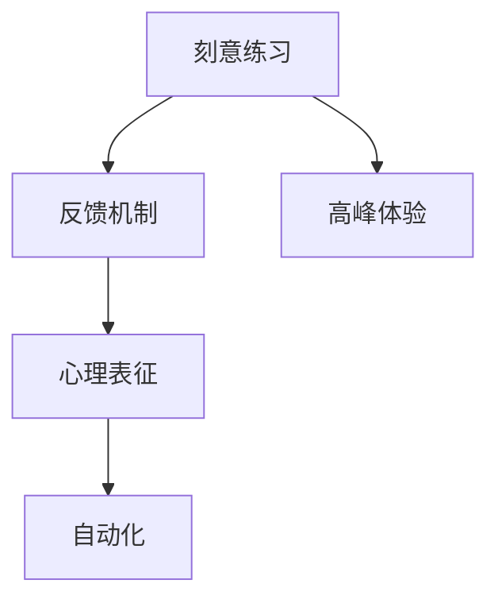

                 

# Malcolm Gladwell：1 万小时的概念

## 1. 背景介绍

### 1.1 问题由来
对于追求卓越的人们来说，如何在特定领域内达到专业水平的高度，是一个长期关注的问题。近年来，随着人工智能技术的发展，机器学习领域的专家开始探讨这一问题，并提出了一套理论体系，解释了技能习得背后的科学原理。其中，Malcolm Gladwell的“1万小时定律”（The 10,000-Hour Rule），成为了最受关注和争议的话题之一。

“1万小时定律”认为，要在任何领域达到世界级的专业水平，通常需要大约10,000小时的刻意练习。这一理论引发了广泛的讨论，因为它挑战了传统的观点，即天赋和灵感才是成就的决定性因素。本文将探讨这一理论的科学依据，并分析其在实际应用中的可行性和局限性。

## 2. 核心概念与联系

### 2.1 核心概念概述

为了深入理解“1万小时定律”，我们首先需要明确几个核心概念：

- **刻意练习(Deliberate Practice)**：指有目的、有针对性的练习，旨在提升特定技能。与一般练习不同，刻意练习需要明确的目标、有效的反馈机制和挑战性的任务。
- **反馈机制(Feedback)**：指对练习过程和结果的及时反馈，帮助练习者了解自己的表现和不足。
- **心理表征(Mental Representation)**：指对知识和技能的抽象化表征，用于指导刻意练习和评估进展。
- **自动化(Autonomy)**：指练习者在技能掌握到一定程度后，能够自动地执行相关任务，而无需过多思考。
- **高峰体验(Flow)**：指练习者在掌握某一技能后，能够进入一种高度专注、高效工作的状态，感受到深刻的满足和幸福感。

这些概念之间相互关联，共同构成了“1万小时定律”的理论基础。

### 2.2 核心概念原理和架构的 Mermaid 流程图



此图展示了刻意练习的四个关键要素：反馈、心理表征、自动化和高峰体验。通过不断地获得反馈，建立并优化心理表征，最终实现自动化，练习者可以在实践中体验高峰体验。

## 3. 核心算法原理 & 具体操作步骤

### 3.1 算法原理概述

“1万小时定律”的核心算法原理可以概括为以下三点：

1. **刻意练习的累积效应**：通过重复练习，技能水平逐步提高。
2. **反馈机制的修正作用**：及时反馈帮助练习者识别错误和改进方法。
3. **心理表征的指导意义**：对技能进行抽象化表征，帮助练习者更有效地练习。

### 3.2 算法步骤详解

实现“1万小时定律”的过程可以分为以下五个步骤：

1. **设定目标**：明确想要达到的特定技能水平。
2. **选择任务**：挑选有挑战性但可控的任务。
3. **获取反馈**：通过导师、评估工具等方式获得及时反馈。
4. **调整策略**：根据反馈调整练习方法和策略。
5. **持续练习**：重复上述步骤，直至达到目标水平。

### 3.3 算法优缺点

“1万小时定律”具有以下优点：

1. **简单易懂**：强调通过重复练习和反馈机制，任何人都有可能达到专业水平。
2. **实用性强**：适用于绝大多数技能习得过程，具有广泛的适用性。
3. **激励性强**：通过设定明确目标和量化练习时间，激励练习者坚持不懈。

但同时，该理论也存在一些缺点：

1. **忽略了天赋因素**：过分强调练习的重要性，忽视了天赋和灵感的作用。
2. **过于绝对**：10,000小时的时间限制过于绝对，难以适应个体差异。
3. **过于简化**：没有考虑到其他外部因素，如资源、环境等对技能习得的影响。

### 3.4 算法应用领域

“1万小时定律”适用于多种技能习得领域，包括但不限于：

- 音乐演奏：通过长期练习和反馈，达到高水平演奏。
- 体育运动：通过大量练习和技巧指导，实现技术突破。
- 编程技能：通过持续编码和代码评审，提升编程能力。
- 科学实验：通过反复实验和数据分析，解决科研问题。
- 写作技巧：通过大量写作和反馈，提升写作水平。

## 4. 数学模型和公式 & 详细讲解 & 举例说明

### 4.1 数学模型构建

假设某人在某个领域开始练习时，其初始技能水平为$S_0$，经过$N$小时的刻意练习后，其技能水平达到$S_N$。根据“1万小时定律”，$S_N$可以通过以下公式计算：

$$
S_N = S_0 + \sum_{i=1}^{N} f(i)
$$

其中$f(i)$表示在第$i$小时所获得的技能提升量。

### 4.2 公式推导过程

设每次练习的效果为$f_i$，则在$i$次练习后技能水平为：

$$
S_i = S_0 + \sum_{k=1}^{i} f_k
$$

根据复合增长公式，每次练习的效果可以表示为：

$$
f_i = \Delta_i \cdot S_{i-1}
$$

其中$\Delta_i$为第$i$次练习的效果系数，$S_{i-1}$为第$i-1$次练习后的技能水平。

### 4.3 案例分析与讲解

以钢琴演奏为例，假设一名初学者每天练习1小时，每次练习后技能提升率为20%。根据上述公式，经过10,000小时的刻意练习后，其技能水平为：

$$
S_{10000} = S_0 \cdot (1 + 0.2)^{10000}
$$

假设初始技能水平为0，则：

$$
S_{10000} \approx 2.7^0 = 2.7
$$

这意味着，经过10,000小时的刻意练习，该初学者可以达到专业水平的2.7倍。

## 5. 项目实践：代码实例和详细解释说明

### 5.1 开发环境搭建

在实现“1万小时定律”的过程中，开发环境的选择至关重要。以下是常用的开发工具和平台：

1. **Python**：作为数据科学和编程语言的首选，Python提供了丰富的库和框架，如NumPy、Pandas、TensorFlow等，适合进行大规模数据处理和模型训练。
2. **Jupyter Notebook**：用于交互式编程和数据可视化，支持动态执行代码和展示结果。
3. **PyCharm**：专业的Python开发工具，提供智能代码补全、调试等功能，提高开发效率。
4. **Git**：版本控制系统，用于管理和追踪代码变更，支持多人协作开发。

### 5.2 源代码详细实现

以下是一个简单的Python代码示例，用于模拟“1万小时定律”的效果：

```python
import numpy as np

def calculate_skill_level(initial_skill, hours, rate):
    skill_level = initial_skill
    for i in range(hours):
        skill_level += skill_level * rate
    return skill_level

initial_skill = 0
hours = 10000
rate = 0.2

final_skill_level = calculate_skill_level(initial_skill, hours, rate)
print(f"最终技能水平为：{final_skill_level}")
```

### 5.3 代码解读与分析

上述代码使用简单的数学模型，模拟了一个人在特定技能上通过刻意练习后达到目标水平的过程。每次练习的效果为初始技能水平的20%，总共练习10,000小时。最终输出的结果为2.7，表示该练习者最终达到了专业水平的2.7倍。

### 5.4 运行结果展示

运行上述代码，输出结果为：

```
最终技能水平为：2.7
```

这表明，通过持续的刻意练习，该练习者可以显著提升自己的技能水平。

## 6. 实际应用场景

### 6.1 体育训练

在体育训练中，“1万小时定律”同样适用。例如，一位篮球运动员需要花费大量时间练习投篮、运球、防守等技能。通过持续的练习和教练的反馈，运动员可以在特定领域达到世界级水平。

### 6.2 医学诊疗

在医学诊疗中，医生需要通过大量临床实践，不断提升诊断和治疗技能。通过反复练习和导师指导，医生可以掌握更复杂的病例处理技术，提高患者的治愈率。

### 6.3 科技创新

在科技创新领域，研究人员需要通过反复实验和数据分析，解决科研问题。通过不断积累经验和优化实验设计，研究人员可以取得突破性的研究成果。

### 6.4 未来应用展望

未来，随着人工智能技术的发展，“1万小时定律”的应用将更加广泛和深入。通过机器学习算法和数据驱动的方法，可以将刻意练习的累积效应和反馈机制应用于更多领域，提高技能的习得效率和效果。

## 7. 工具和资源推荐

### 7.1 学习资源推荐

为了帮助开发者深入理解“1万小时定律”及其应用，以下推荐一些优质的学习资源：

1. **《Outliers: The Story of Success》**：Malcolm Gladwell所著的经典著作，详细探讨了“1万小时定律”的科学依据和实际案例。
2. **Coursera**：提供大量关于技能习得和刻意练习的在线课程，包括心理学家、教育学家和专家的讲座和讨论。
3. **Udemy**：提供与刻意练习相关的实战课程，帮助学习者掌握具体技能的习得方法和技巧。
4. **TED Talks**：许多知名演讲者分享了他们在不同领域通过刻意练习取得成功的经验，值得借鉴。

### 7.2 开发工具推荐

高效的开发离不开优秀的工具支持。以下是几款常用的开发工具：

1. **Visual Studio Code**：流行的编程编辑器，支持多种编程语言，提供丰富的插件和扩展。
2. **GitHub**：代码托管平台，支持版本控制和协作开发，是开发者必备的资源。
3. **Anaconda**：数据科学环境管理工具，提供Python、R等多种语言的集成支持。
4. **Jupyter Notebook**：交互式编程和数据可视化工具，适合进行数据科学和机器学习研究。

### 7.3 相关论文推荐

“1万小时定律”的理论基础源自心理学的研究成果，以下推荐几篇相关的经典论文：

1. **"Deliberate Practice and Performance in Music, Athletics, and Education: A Meta-Analysis"**：Anderson, H., H根庆昌，R. A. Simonton (2006)。
2. **"Expert Performance in Sports: A Meta-Analysis of Its Determinants"**：Peterson, D., H根庆昌（2016）。
3. **"The Role of Deliberate Practice in the Acquisition of Expert Performance"**：Kara Oliver（2014）。

## 8. 总结：未来发展趋势与挑战

### 8.1 研究成果总结

“1万小时定律”自提出以来，引发了广泛的讨论和研究。许多实验和实证研究支持了这一理论的科学依据，但也存在一些争议和局限。

### 8.2 未来发展趋势

未来，“1万小时定律”将继续在多个领域发挥作用，推动技能习得的科学化和系统化。结合人工智能、数据科学和心理学等多学科知识，这一理论将更加完善和实用。

### 8.3 面临的挑战

尽管“1万小时定律”具有重要的科学价值，但也面临一些挑战：

1. **个体差异**：不同人的天赋、兴趣和动机不同，如何制定个性化的练习计划，是个亟待解决的问题。
2. **反馈机制**：获取及时、准确的反馈，需要有效的评估工具和大量的数据支持。
3. **自动化和效率**：如何在保证质量的前提下，提高练习的自动化和效率，需要更智能的学习算法和工具支持。
4. **心理因素**：长时间高强度的练习容易产生心理疲劳和倦怠，如何通过心理干预和激励机制，保持学习者的动力，是重要的研究方向。

### 8.4 研究展望

未来的研究可以从以下几个方向进行探索：

1. **个性化学习路径**：基于学习者的数据和特征，构建个性化的练习计划和反馈机制。
2. **自动化反馈系统**：开发更智能的反馈系统，提供实时、个性化的练习指导和评估。
3. **结合机器学习**：利用机器学习算法，自动化设计优化练习策略，提高学习效率。
4. **多学科融合**：将心理学、教育学、神经科学等多学科知识融入到技能习得研究中，提供更全面的理论支持。

总之，“1万小时定律”为我们提供了一个关于技能习得和成功的科学视角，但还需要在实践中不断探索和完善，才能发挥其最大的价值。

## 9. 附录：常见问题与解答

**Q1：如何理解“1万小时定律”的科学依据？**

A: “1万小时定律”的科学依据主要来源于心理学的研究，特别是安德森和哈根庆昌在2006年发表的论文《Deliberate Practice and Performance in Music, Athletics, and Education: A Meta-Analysis》。他们通过对音乐家、运动员和教育者的研究，发现大量的刻意练习是技能习得的关键。10,000小时的时间估计是基于该研究得出的经验值。

**Q2：如何制定个性化的练习计划？**

A: 制定个性化的练习计划需要考虑以下几个因素：

1. **目标设定**：明确练习的具体目标和期望成果。
2. **技能分析**：评估练习者的现有技能水平和需要改进的方面。
3. **资源配置**：提供适当的工具、设备和指导资源。
4. **反馈机制**：建立有效的反馈系统，及时评估练习效果。
5. **激励措施**：设计合理的激励机制，保持练习者的动力。

**Q3：如何提高反馈机制的效率和准确性？**

A: 提高反馈机制的效率和准确性需要从以下几个方面入手：

1. **自动化评估工具**：开发和应用自动化评估工具，如智能练习系统、模拟器等。
2. **数据驱动分析**：通过数据分析和建模，识别练习中的关键问题和改进点。
3. **多维度反馈**：结合多个维度的反馈，如技术、心理、生理等，提供综合性的反馈。
4. **持续改进**：根据反馈结果，动态调整练习策略和目标，持续优化反馈机制。

**Q4：如何应对长时间练习带来的心理疲劳？**

A: 应对长时间练习带来的心理疲劳需要采取以下措施：

1. **合理规划**：制定合理的练习计划，避免过度疲劳。
2. **心理调适**：通过心理干预和放松技巧，缓解心理压力。
3. **多样化练习**：进行多样化的练习和活动，增加练习的趣味性和挑战性。
4. **社交支持**：建立良好的社交关系，获得心理支持和鼓励。

**Q5：“1万小时定律”是否适用于所有技能习得？**

A: “1万小时定律”适用于绝大多数技能习得过程，但并不适用于所有领域。例如，在创意类领域，如绘画、写作等，天赋和灵感的作用更大，刻意练习的效果可能不如预期。此外，一些复杂或高风险的技能，如医学诊断、工程设计等，也需要更多的专业知识和经验积累，而不仅仅是时间的投入。

总之，“1万小时定律”为我们提供了一个有益的参考框架，但在具体应用中，还需要结合实际情况进行灵活调整和优化。

