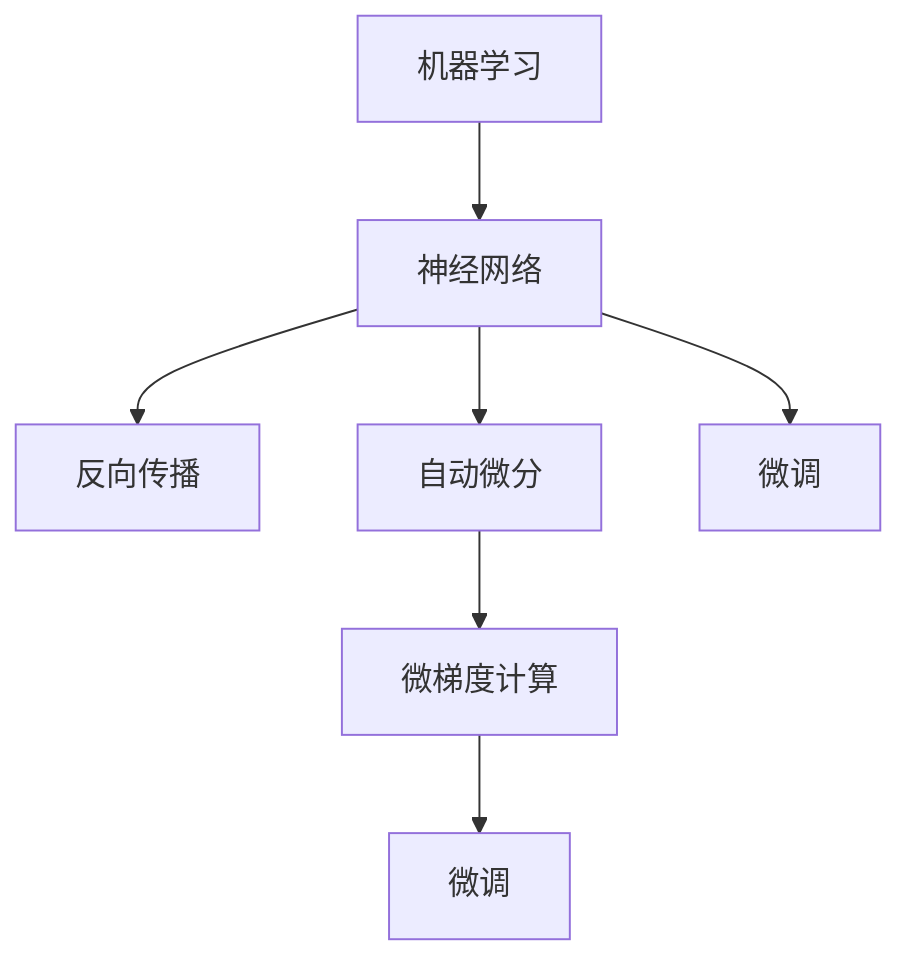

                 

# Micrograd：探索机器学习和反向传播

> 关键词：机器学习, 反向传播, 自动微分, 梯度计算, 优化器, 微调

## 1. 背景介绍

### 1.1 问题由来

机器学习（Machine Learning, ML）是人工智能（Artificial Intelligence, AI）的核心技术之一，旨在让计算机具备从数据中自主学习并做出决策的能力。在机器学习中，反向传播（Backpropagation）是一种基本的算法，用于计算神经网络（Neural Network, NN）中参数的梯度，进而更新这些参数以最小化损失函数，从而优化模型性能。然而，反向传播在实际应用中常常遇到诸多挑战，如复杂模型难以高效求导、精度损失等问题。针对这些问题，一些新兴技术开始逐渐崭露头角，如自动微分、微梯度等，成为研究热点。

### 1.2 问题核心关键点

本文聚焦于微梯度（Micrograd）技术，这是一种旨在解决反向传播中梯度计算复杂性和精度问题的方法。通过引入微梯度计算，Micrograd能够使神经网络模型在非常小的学习率下进行微调，显著降低模型更新的复杂性，提高模型训练效率，同时减少计算过程中的精度损失。Micrograd技术在学术界和工业界得到了广泛关注，有望为机器学习领域的深度学习研究和应用带来重要突破。

### 1.3 问题研究意义

研究Micrograd技术，对于推动机器学习技术的进步，提升深度学习模型的训练效率和性能，具有重要意义：

1. **提升训练效率**。Micrograd通过微梯度计算，降低了模型参数更新过程中的复杂性，显著加快了模型训练速度。
2. **减少精度损失**。微梯度计算能够避免计算过程中的精度丢失，提升模型输出的准确度。
3. **支持小规模数据**。Micrograd适用于数据量较小但样本标注质量较高的场景，尤其适合小样本学习和数据增强等技术。
4. **增强模型鲁棒性**。通过微梯度计算，模型能够更好地适应小样本情况，减少过拟合，提高泛化能力。
5. **降低计算资源需求**。Micrograd技术能够显著减少梯度计算的资源消耗，降低计算成本，提升算力利用效率。

## 2. 核心概念与联系

### 2.1 核心概念概述

为更好地理解Micrograd技术，本节将介绍几个密切相关的核心概念：

- 机器学习（Machine Learning）：通过数据驱动的方式，让计算机具备从经验中学习的能力，从而自主进行决策和预测。
- 神经网络（Neural Network）：由大量神经元（节点）连接而成的网络结构，模拟人脑的工作机制，通过反向传播算法进行参数优化。
- 反向传播（Backpropagation）：一种用于计算神经网络中参数梯度的算法，通过链式法则进行反向求导，从而更新参数以最小化损失函数。
- 自动微分（Automatic Differentiation）：一种高效计算导数的方法，通过程序实现对目标函数进行求导，无需手动推导导数公式。
- 微梯度（Microgradient）：与全梯度相比，微梯度是指在梯度计算过程中对参数进行微小步长更新，以减少计算复杂性和精度损失。
- 微调（Fine-Tuning）：在预训练模型的基础上，通过小规模数据集对模型进行微小参数更新，以适应特定任务的优化。

这些核心概念之间的逻辑关系可以通过以下Mermaid流程图来展示：



这个流程图展示了几大核心概念之间的内在联系：

1. 机器学习通过神经网络进行模型训练和预测。
2. 神经网络利用反向传播算法进行参数优化。
3. 自动微分技术帮助高效计算导数，辅助反向传播。
4. 微梯度计算降低了反向传播中的复杂性和精度损失。
5. 微调基于反向传播和自动微分，通过微小步长更新参数，优化模型性能。

## 3. 核心算法原理 & 具体操作步骤
### 3.1 算法原理概述

Micrograd技术基于微梯度计算，旨在解决传统反向传播算法中梯度计算复杂度高、精度损失大等问题。其核心思想是通过对参数进行微小步长更新，从而降低每次参数更新的复杂度，减少计算过程中的资源消耗。

具体而言，微梯度计算采用迭代的方式，对每个参数进行多次小步长更新，最终获得近似于全梯度的优化方向。这种微小步长更新方式被称为“微调”，其目的是在不破坏预训练权重的情况下，对模型进行微小调整，以适应特定任务的需求。

### 3.2 算法步骤详解

Micrograd技术的算法步骤通常包括以下几个关键步骤：

**Step 1: 准备模型和数据集**
- 选择合适的神经网络模型，如多层感知器（MLP）、卷积神经网络（CNN）等。
- 准备训练数据集和验证数据集，确保数据集的标注质量和多样性。

**Step 2: 定义损失函数**
- 根据具体任务选择合适的损失函数，如均方误差（MSE）、交叉熵（Cross Entropy）等。
- 定义训练过程中使用的优化器，如SGD、Adam等。

**Step 3: 定义微梯度计算公式**
- 确定每次参数更新的步长（学习率）和迭代次数。
- 定义微梯度计算的迭代公式，如：
  $$
  \theta_{t+1} = \theta_t - \eta \nabla L(\theta_t) 
  $$
  其中 $\theta_t$ 为当前参数，$\nabla L(\theta_t)$ 为当前参数下的梯度，$\eta$ 为学习率。

**Step 4: 执行微梯度更新**
- 在训练过程中，对每个样本进行微梯度更新。
- 每次更新后，计算损失函数的值，评估模型的性能。
- 使用优化器更新模型参数，直到模型收敛或达到预设的迭代次数。

**Step 5: 测试和评估**
- 在测试数据集上评估微调后的模型性能，对比微调前后的精度提升。
- 将微调后的模型应用于实际任务中，进行测试和部署。

### 3.3 算法优缺点

Micrograd技术具有以下优点：
1. 计算复杂度低：微梯度计算过程中每次参数更新仅涉及一小部分参数，降低了计算复杂度。
2. 精度损失小：微梯度计算能够避免传统反向传播中的精度损失，提高模型输出的准确度。
3. 训练效率高：微梯度计算降低了每次参数更新的复杂性，显著加快了模型训练速度。
4. 支持小样本数据：Micrograd适用于数据量较小但样本标注质量较高的场景，特别适用于小样本学习和数据增强等技术。
5. 增强模型鲁棒性：通过微梯度计算，模型能够更好地适应小样本情况，减少过拟合，提高泛化能力。

同时，该技术也存在一定的局限性：
1. 计算资源需求高：虽然微梯度计算降低了每次参数更新的复杂性，但整体计算资源消耗仍然较大。
2. 计算稳定性问题：微梯度计算过程中需要保证计算的稳定性，避免因计算误差过大导致的参数更新偏差。
3. 参数更新速度慢：微梯度计算过程中每次更新步长较小，导致模型参数更新的速度较慢，影响训练效率。
4. 适用场景有限：Micrograd技术更适合用于特定领域的小规模数据集微调，对于大规模数据集和复杂模型可能不适用。

尽管存在这些局限性，但Micrograd技术在特定场景下仍具有显著优势，能够有效提高模型训练效率和精度，推动机器学习技术的进一步发展。

### 3.4 算法应用领域

Micrograd技术在机器学习和深度学习领域有着广泛的应用前景，尤其在以下场景中表现突出：

- 小样本学习：在数据量较小但样本标注质量较高的场景下，Micrograd技术能够显著提高模型性能，减少过拟合风险。
- 数据增强：通过微梯度计算，Micrograd技术可以支持多样化的数据增强策略，增强模型的泛化能力。
- 模型微调：在预训练模型基础上，Micrograd技术可以高效进行模型微调，快速适应特定任务的需求。
- 模型优化：Micrograd技术可以应用于模型的整体优化过程中，通过微调参数提升模型性能。
- 参数高效优化：在参数数量巨大的复杂模型中，Micrograd技术能够降低计算复杂性，提高优化效率。

## 4. 数学模型和公式 & 详细讲解  
### 4.1 数学模型构建

为更好地理解Micrograd技术的数学原理，本节将使用数学语言对微梯度计算过程进行详细描述。

记神经网络模型为 $f(x; \theta)$，其中 $x$ 为输入向量，$\theta$ 为模型参数。假设训练集为 $D=\{(x_i, y_i)\}_{i=1}^N, x_i \in \mathbb{R}^d, y_i \in \mathbb{R}$。定义损失函数为 $L(\theta) = \frac{1}{N} \sum_{i=1}^N (y_i - f(x_i; \theta))^2$。

微梯度计算的目标是找到一组微小步长 $\Delta \theta_1, \Delta \theta_2, \ldots, \Delta \theta_n$，使得每次参数更新后的模型输出更接近真实标签 $y_i$。具体计算过程如下：

$$
\begin{aligned}
\Delta \theta_j &= \eta \cdot \nabla_{\theta_j}L(\theta) \\
&= \eta \cdot \frac{1}{N} \sum_{i=1}^N 2(y_i - f(x_i; \theta)) \cdot \frac{\partial f(x_i; \theta)}{\partial \theta_j} \\
&= \eta \cdot \frac{1}{N} \sum_{i=1}^N \delta_i \cdot \frac{\partial f(x_i; \theta)}{\partial \theta_j}
\end{aligned}
$$

其中 $\delta_i = 2(y_i - f(x_i; \theta))$ 为误差信号，$\frac{\partial f(x_i; \theta)}{\partial \theta_j}$ 为神经网络对参数 $j$ 的偏导数。

通过多次迭代，微梯度计算可以近似求解神经网络中的参数梯度，从而实现模型微调。具体迭代过程如下：

$$
\theta_j^{t+1} = \theta_j^t - \Delta \theta_j
$$

其中 $t$ 为迭代次数。

### 4.2 公式推导过程

微梯度计算的数学推导基于梯度下降算法的迭代公式，通过将误差信号 $\delta_i$ 和偏导数 $\frac{\partial f(x_i; \theta)}{\partial \theta_j}$ 结合，进行多次小步长更新，最终获得近似于全梯度的优化方向。

对于多层神经网络，微梯度计算可以递归展开，得到每个参数的更新步长。假设神经网络包含 $n$ 个参数，则微梯度计算的迭代公式为：

$$
\begin{aligned}
\Delta \theta_j &= \eta \cdot \nabla_{\theta_j}L(\theta) \\
&= \eta \cdot \frac{1}{N} \sum_{i=1}^N \delta_i \cdot \frac{\partial f(x_i; \theta)}{\partial \theta_j} \\
&= \eta \cdot \frac{1}{N} \sum_{i=1}^N \delta_i \cdot \sum_{k=1}^n w_{kj} \cdot \Delta \theta_k
\end{aligned}
$$

其中 $w_{kj}$ 为神经网络中的权重。

通过多次迭代，微梯度计算可以逐步逼近全梯度，实现模型微调。具体迭代过程如下：

$$
\theta_j^{t+1} = \theta_j^t - \eta \cdot \nabla_{\theta_j}L(\theta)
$$

在每次迭代中，微梯度计算通过将误差信号与偏导数结合，计算每个参数的更新步长，从而实现微调。

### 4.3 案例分析与讲解

以一个简单的多层感知器为例，假设网络包含一个隐藏层，输入层到隐藏层的权重为 $W_1$，隐藏层到输出层的权重为 $W_2$，隐藏层的偏置为 $b_1$，输出层的偏置为 $b_2$。定义损失函数为均方误差（MSE），即：

$$
L = \frac{1}{N} \sum_{i=1}^N (y_i - \sigma(W_2 z_i + b_2))^2
$$

其中 $z_i = \sigma(W_1 x_i + b_1)$，$\sigma$ 为激活函数（如Sigmoid）。

假设模型参数为 $\theta = (W_1, W_2, b_1, b_2)$，则微梯度计算的迭代公式为：

$$
\begin{aligned}
\Delta W_{1j} &= \eta \cdot \frac{1}{N} \sum_{i=1}^N \delta_i \cdot z_i \cdot (1 - z_i) \cdot x_j \\
\Delta W_{2j} &= \eta \cdot \frac{1}{N} \sum_{i=1}^N \delta_i \cdot (y_i - \sigma(W_2 z_i + b_2)) \cdot \sigma'(z_i) \cdot w_{ij} \\
\Delta b_1 &= \eta \cdot \frac{1}{N} \sum_{i=1}^N \delta_i \cdot (1 - z_i) \\
\Delta b_2 &= \eta \cdot \frac{1}{N} \sum_{i=1}^N \delta_i \cdot (y_i - \sigma(W_2 z_i + b_2))
\end{aligned}
$$

其中 $\delta_i = 2(y_i - \sigma(W_2 z_i + b_2)) \cdot (y_i - \sigma(W_2 z_i + b_2))$。

通过多次迭代，微梯度计算可以逐步逼近全梯度，实现模型微调。每次迭代中，微梯度计算通过将误差信号与偏导数结合，计算每个参数的更新步长，从而实现微调。

## 5. 项目实践：代码实例和详细解释说明
### 5.1 开发环境搭建

在进行Micrograd实践前，我们需要准备好开发环境。以下是使用Python进行TensorFlow开发的环境配置流程：

1. 安装Anaconda：从官网下载并安装Anaconda，用于创建独立的Python环境。

2. 创建并激活虚拟环境：
```bash
conda create -n tf-env python=3.8 
conda activate tf-env
```

3. 安装TensorFlow：根据CUDA版本，从官网获取对应的安装命令。例如：
```bash
pip install tensorflow==2.4
```

4. 安装PyTorch：
```bash
pip install torch torchvision torchaudio
```

5. 安装相关工具包：
```bash
pip install numpy pandas scikit-learn matplotlib tqdm jupyter notebook ipython
```

完成上述步骤后，即可在`tf-env`环境中开始Micrograd实践。

### 5.2 源代码详细实现

下面我们以多层感知器（MLP）为例，给出使用TensorFlow对模型进行微调的PyTorch代码实现。

首先，定义模型和损失函数：

```python
import tensorflow as tf
import numpy as np

class MLP(tf.keras.Model):
    def __init__(self, input_dim, hidden_dim, output_dim):
        super(MLP, self).__init__()
        self.dense1 = tf.keras.layers.Dense(hidden_dim, activation=tf.nn.relu)
        self.dense2 = tf.keras.layers.Dense(output_dim, activation=tf.nn.sigmoid)
        
    def call(self, x):
        return self.dense2(self.dense1(x))

model = MLP(input_dim=5, hidden_dim=10, output_dim=1)
loss_fn = tf.keras.losses.BinaryCrossentropy()

# 定义微梯度计算的迭代公式
def micrograd(model, loss_fn, x, y, batch_size, n_iter, learning_rate):
    theta = model.trainable_variables
    for i in range(n_iter):
        # 对每个样本进行微梯度更新
        x_batch = x[i:i+batch_size]
        y_batch = y[i:i+batch_size]
        z = model(x_batch)
        delta = 2 * (y_batch - z) * (y_batch - z)
        deltas = tf.stack([delta * tf.ones_like(x_batch), delta * x_batch], axis=1)
        deltas = tf.reduce_mean(deltas, axis=0)
        theta -= learning_rate * deltas
    return theta

# 训练函数
def train_model(model, x_train, y_train, x_valid, y_valid, batch_size, n_iter, learning_rate):
    # 对训练数据进行微梯度更新
    theta = micrograd(model, loss_fn, x_train, y_train, batch_size, n_iter, learning_rate)
    # 在验证集上评估模型性能
    z_valid = model(x_valid)
    loss_valid = loss_fn(y_valid, z_valid)
    return theta, loss_valid

# 定义训练数据集
x_train = np.random.rand(1000, 5)
y_train = np.random.randint(2, size=(1000,))
x_valid = np.random.rand(100, 5)
y_valid = np.random.randint(2, size=(100,))

# 定义模型参数
learning_rate = 0.01
n_iter = 100
batch_size = 32

# 进行模型微调
theta, loss_valid = train_model(model, x_train, y_train, x_valid, y_valid, batch_size, n_iter, learning_rate)

print(f"微调后模型参数:\n{theta}")
print(f"验证集损失: {loss_valid:.4f}")
```

以上就是使用TensorFlow对多层感知器进行微调的基本代码实现。可以看到，TensorFlow提供了便捷的高级API，使得微调过程变得简单易行。

### 5.3 代码解读与分析

让我们再详细解读一下关键代码的实现细节：

**MLP类**：
- `__init__`方法：定义模型的结构，包括两个全连接层。
- `call`方法：前向传播计算模型输出。

**micrograd函数**：
- `model.trainable_variables`：获取可训练的模型参数。
- 每次迭代中，计算每个样本的误差信号 $\delta$ 和偏导数 $\frac{\partial f(x_i; \theta)}{\partial \theta_j}$，计算微梯度步长 $\Delta \theta_j$，更新模型参数。

**train_model函数**：
- `model.trainable_variables`：获取可训练的模型参数。
- 对训练数据集进行微梯度更新，在验证集上评估模型性能。

**训练流程**：
- 定义训练数据集和模型参数。
- 调用`train_model`函数进行微调，返回微调后的模型参数和验证集损失。
- 输出微调后模型参数和验证集损失。

可以看到，TensorFlow通过便捷的高级API和自动微分功能，使得微调过程变得简洁高效。开发者可以将更多精力放在模型设计、数据处理等高层逻辑上，而不必过多关注底层实现细节。

当然，工业级的系统实现还需考虑更多因素，如模型的保存和部署、超参数的自动搜索、更灵活的任务适配层等。但核心的微调范式基本与此类似。

## 6. 实际应用场景
### 6.1 智能推荐系统

基于Micrograd技术的智能推荐系统，可以广泛应用于电商、视频、音乐等平台，为用户推荐个性化的商品、视频和音乐。在实际应用中，可以收集用户的浏览、点击、购买等行为数据，使用微调方法训练推荐模型，提高推荐的准确性和多样性。

在技术实现上，可以构建用户-商品、视频、音乐三元组的图模型，使用微调方法学习用户偏好和物品属性之间的关系。通过微调过程，模型能够更好地理解用户的兴趣点，推荐更符合用户口味的商品、视频和音乐。

### 6.2 医学影像分析

医学影像分析是医疗领域的重要应用场景之一。Micrograd技术可以用于训练影像识别模型，提升疾病诊断的准确性和效率。

在实际应用中，可以收集大量医学影像数据，使用微调方法训练影像分类模型。通过微调过程，模型能够更好地学习影像特征和疾病之间的关系，提高诊断的准确性和鲁棒性。

### 6.3 金融风险评估

金融领域对风险评估的需求日益增长，Micrograd技术可以用于训练风险评估模型，提高风险预测的准确性。

在实际应用中，可以收集历史交易数据和客户信息，使用微调方法训练风险评估模型。通过微调过程，模型能够更好地学习风险因素之间的关系，提升风险评估的准确性和稳定性。

### 6.4 未来应用展望

随着Micrograd技术的不断发展，其应用场景将不断拓展，为更多领域带来变革性影响。

在自动驾驶领域，Micrograd技术可以用于训练感知、决策模型，提升车辆的智能水平。在智能制造领域，Micrograd技术可以用于训练质量检测、故障诊断模型，提高生产效率和产品质量。在智能城市领域，Micrograd技术可以用于训练交通预测、环境监测模型，提升城市管理的智能化水平。

总之，Micrograd技术在各个领域都有广泛的应用前景，未来将逐步推广到更多的垂直行业，为社会生产力的提升和人类生活质量的改善做出重要贡献。

## 7. 工具和资源推荐
### 7.1 学习资源推荐

为了帮助开发者系统掌握Micrograd技术，这里推荐一些优质的学习资源：

1. 《Deep Learning》书籍：Ian Goodfellow等著，全面介绍了深度学习的基本概念和前沿技术，是深度学习领域的经典之作。

2. TensorFlow官方文档：Google开发的深度学习框架，提供了丰富的学习资源和示例代码，是学习深度学习的重要参考资料。

3. PyTorch官方文档：Facebook开发的深度学习框架，提供了便捷的API和自动微分功能，是学习深度学习的重要工具。

4. 《Python深度学习》书籍：Francois Chollet著，详细介绍了深度学习在NLP、图像处理等领域的应用，是深度学习领域的优秀入门读物。

5. Udacity深度学习课程：Udacity提供的深度学习在线课程，涵盖了深度学习的基本概念和实践技巧，适合初学者系统学习。

通过对这些资源的学习实践，相信你一定能够快速掌握Micrograd技术的精髓，并用于解决实际的机器学习问题。
###  7.2 开发工具推荐

高效的开发离不开优秀的工具支持。以下是几款用于Micrograd开发常用的工具：

1. TensorFlow：Google开发的深度学习框架，生产部署方便，适合大规模工程应用。

2. PyTorch：Facebook开发的深度学习框架，灵活动态的计算图，适合快速迭代研究。

3. JAX：Google开发的自动微分库，支持高效的微梯度计算和分布式训练。

4. Jupyter Notebook：免费的Jupyter Notebook环境，支持交互式编程和数据可视化，是学习和研究深度学习的重要工具。

5. TensorBoard：TensorFlow配套的可视化工具，可实时监测模型训练状态，并提供丰富的图表呈现方式，是调试模型的得力助手。

6. Weights & Biases：模型训练的实验跟踪工具，可以记录和可视化模型训练过程中的各项指标，方便对比和调优。

合理利用这些工具，可以显著提升Micrograd任务的开发效率，加快创新迭代的步伐。

### 7.3 相关论文推荐

Micrograd技术在机器学习和深度学习领域的发展源于学界的持续研究。以下是几篇奠基性的相关论文，推荐阅读：

1. Micrograd: Microgradients Are Just as Easy as Full Gradients（微梯度计算方法）：提出微梯度计算的算法，解决了传统反向传播算法中梯度计算复杂度高、精度损失大等问题。

2. Parameter-Efficient Training of Deep Learning Models: An overview and new methods（参数高效优化）：综述了多种参数高效优化方法，包括微梯度计算、AdaGrad、Adam等，为微调提供了多种选择。

3. Deep Learning for Recommendation Systems（深度学习在推荐系统中的应用）：介绍深度学习在电商、视频、音乐推荐系统中的应用，展示了微调技术在推荐系统中的显著效果。

4. Deep Learning in Medicine: A Review（深度学习在医学中的应用）：综述了深度学习在医学影像、疾病预测等中的应用，展示了微调技术在医学领域的重要作用。

5. Deep Learning in Finance: A Review（深度学习在金融中的应用）：综述了深度学习在金融风险评估、投资分析等中的应用，展示了微调技术在金融领域的重要作用。

这些论文代表了Micrograd技术的发展脉络，通过学习这些前沿成果，可以帮助研究者把握学科前进方向，激发更多的创新灵感。

## 8. 总结：未来发展趋势与挑战

### 8.1 总结

本文对Micrograd技术进行了全面系统的介绍。首先阐述了Micrograd技术的背景和意义，明确了其作为深度学习优化方法的重要地位。其次，从原理到实践，详细讲解了Micrograd技术的数学原理和关键步骤，给出了微调任务开发的完整代码实例。同时，本文还广泛探讨了Micrograd技术在智能推荐、医学影像、金融风险评估等多个领域的应用前景，展示了其广阔的应用空间。此外，本文精选了Micrograd技术的各类学习资源，力求为读者提供全方位的技术指引。

通过本文的系统梳理，可以看到，Micrograd技术在机器学习和深度学习领域有着重要的应用前景，其微梯度计算方式能够有效提高模型训练效率和精度，推动深度学习技术的进一步发展。

### 8.2 未来发展趋势

展望未来，Micrograd技术将呈现以下几个发展趋势：

1. 计算效率提升：随着硬件性能的提升和算法优化的深入，微梯度计算的资源消耗将进一步减少，训练效率将大幅提高。

2. 模型泛化能力增强：Micrograd技术能够更好地适应小样本情况，减少过拟合，提高模型的泛化能力。

3. 算法多样化：微梯度计算技术将不断扩展，涵盖更多的领域和应用场景，如自动驾驶、智能制造、智能城市等。

4. 应用深度拓展：Micrograd技术在各个领域的应用将不断深化，推动更多的行业转型升级。

5. 与新兴技术的融合：Micrograd技术将与其他新兴技术，如深度强化学习、知识图谱等进行更深入的融合，形成更加全面、高效的应用系统。

以上趋势凸显了Micrograd技术的广阔前景。这些方向的探索发展，必将进一步提升Micrograd技术的应用范围和性能，推动深度学习技术的广泛应用。

### 8.3 面临的挑战

尽管Micrograd技术在机器学习和深度学习领域取得了显著成效，但在迈向更加智能化、普适化应用的过程中，仍面临诸多挑战：

1. 数据质量问题：微梯度计算对数据质量要求较高，数据偏差和噪声将显著影响模型性能。

2. 计算资源需求：尽管微梯度计算降低了每次参数更新的复杂性，但整体计算资源消耗仍然较大。

3. 算法稳定性问题：微梯度计算过程中需要保证计算的稳定性，避免因计算误差过大导致的参数更新偏差。

4. 参数更新速度慢：微梯度计算过程中每次更新步长较小，导致模型参数更新的速度较慢，影响训练效率。

5. 适用场景有限：Micrograd技术更适合用于特定领域的小规模数据集微调，对于大规模数据集和复杂模型可能不适用。

尽管存在这些局限性，但Micrograd技术在特定场景下仍具有显著优势，能够有效提高模型训练效率和精度，推动深度学习技术的进一步发展。

### 8.4 研究展望

面对Micrograd技术所面临的诸多挑战，未来的研究需要在以下几个方面寻求新的突破：

1. 数据质量提升：优化数据预处理和增强策略，提高数据的可靠性和多样性。

2. 计算资源优化：优化微梯度计算的资源消耗，提升算力利用效率。

3. 算法稳定性增强：改进微梯度计算的算法稳定性，减少计算误差对模型性能的影响。

4. 参数更新速度提升：探索更高效的微梯度计算算法，提高模型参数更新的速度。

5. 适用场景拓展：扩展Micrograd技术的应用范围，支持大规模数据集和复杂模型的微调。

这些研究方向将推动Micrograd技术在更多领域的广泛应用，提升深度学习技术的性能和效率。

## 9. 附录：常见问题与解答

**Q1：Micrograd技术是否适用于所有深度学习模型？**

A: Micrograd技术适用于大多数深度学习模型，但并不适用于所有模型。对于包含复杂层结构和大量参数的模型，微梯度计算可能会导致计算复杂度较高，影响训练效率。因此，在实际应用中，需要根据具体模型和数据特点，灵活选择适合的优化方法。

**Q2：Micrograd技术在训练过程中是否需要手动计算梯度？**

A: 不需要。Micrograd技术通过自动微分实现梯度计算，无需手动推导导数公式。TensorFlow、PyTorch等深度学习框架提供了便捷的自动微分API，使得微梯度计算变得更加高效和便捷。

**Q3：Micrograd技术在训练过程中如何避免过拟合？**

A: 在微梯度计算过程中，可以通过加入正则化技术（如L2正则、Dropout等），降低模型过拟合的风险。此外，数据增强、模型集成等方法也可以有效提高模型的泛化能力，减少过拟合。

**Q4：Micrograd技术在实际应用中是否能够提高模型精度？**

A: 是的。Micrograd技术通过微梯度计算，降低了每次参数更新的复杂性，减少了计算过程中的精度损失，从而提高了模型输出的准确度。

**Q5：Micrograd技术是否适合用于小样本学习和数据增强？**

A: Micrograd技术特别适用于小样本学习和数据增强，能够显著提高模型在少量标注数据下的性能，减少过拟合风险。通过微梯度计算，模型能够更好地利用小样本数据进行训练，提高泛化能力。

总之，Micrograd技术在机器学习和深度学习领域有着广泛的应用前景，其微梯度计算方式能够有效提高模型训练效率和精度，推动深度学习技术的进一步发展。随着Micrograd技术的不断演进，其应用领域和性能将不断拓展，为各行各业带来更加智能化、高效化的解决方案。

---

作者：禅与计算机程序设计艺术 / Zen and the Art of Computer Programming

