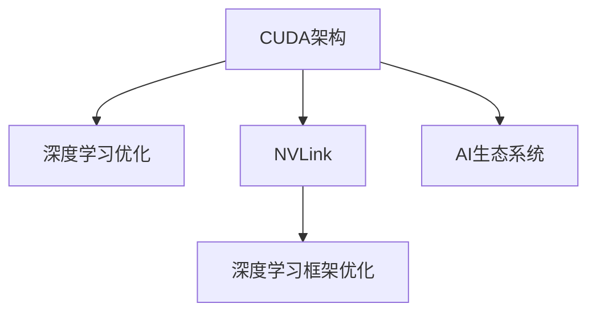

                 

# NVIDIA如何改变了AI算力的格局

## 1. 背景介绍

### 1.1 问题由来
随着人工智能(AI)技术的发展，数据中心对于高性能计算资源的需求日益增长。AI算力，尤其是深度学习中的大规模训练和推理任务，对于硬件的要求越来越高。如何在保证性能的同时，降低成本，提高效率，成为各大IT厂商争相探索的重要课题。

NVIDIA在过去几年中，通过推出一系列高性能计算芯片和软件平台，成功地改写了AI算力的格局。NVIDIA的CUDA和GPU技术，使得AI训练变得更加高效、便捷，逐渐成为AI社区的主流选择。本文将从技术原理、应用实践和发展趋势三个方面，详细剖析NVIDIA如何改变AI算力格局。

### 1.2 问题核心关键点
NVIDIA的崛起，主要得益于以下几个核心关键点：

- **CUDA架构设计**：NVIDIA自主研发的CUDA架构，使得GPU能够高效地处理大规模并行计算任务。CUDA提供了丰富的API接口，简化了并行编程的复杂性，极大提升了GPU的计算效能。
- **深度学习优化**：NVIDIA在深度学习算法上进行了大量优化，推出了TensorFlow、PyTorch等主流框架的GPU版，提供了深度学习的全栈解决方案。
- **硬件加速和协作**：NVIDIA的NVLink技术，支持多GPU间的无缝通信，使得多GPU并行计算变得高效、低延迟，优化了训练和推理过程。
- **生态系统建设**：NVIDIA构建了一个强大的硬件+软件生态系统，涵盖GPU硬件、操作系统、编译器、框架等全链路，形成了强大的AI技术生态。

## 2. 核心概念与联系

### 2.1 核心概念概述

为了更好地理解NVIDIA如何改变AI算力格局，本文将介绍几个密切相关的核心概念：

- **CUDA架构**：NVIDIA自主研发的并行计算架构，使得GPU能够高效地处理大规模并行计算任务。
- **深度学习优化**：通过在GPU上对深度学习算法进行优化，提高计算效率和资源利用率。
- **NVLink**：用于连接多GPU的互连技术，支持低延迟、高带宽的数据传输。
- **深度学习框架优化**：针对深度学习框架进行GPU优化，提升训练和推理速度。
- **AI生态系统**：包括GPU硬件、操作系统、编译器、框架等，形成完整的AI技术生态。

这些核心概念之间的逻辑关系可以通过以下Mermaid流程图来展示：



这个流程图展示了大语言模型的核心概念及其之间的关系：

1. CUDA架构提供了硬件支持，使得深度学习算法能够高效执行。
2. 深度学习优化提升了算法的计算效率。
3. NVLink技术支持多GPU间的高效通信。
4. 深度学习框架优化进一步提高了计算性能。
5. AI生态系统提供了完整的解决方案，使得AI技术在各个应用场景中能够无缝部署。

这些概念共同构成了NVIDIA在AI计算领域的核心竞争力，使其能够引领行业发展。

## 3. 核心算法原理 & 具体操作步骤
### 3.1 算法原理概述

NVIDIA改变AI算力格局的关键在于其GPU架构和深度学习优化的结合。以下是NVIDIA改变AI算力格局的核心算法原理：

1. **CUDA架构设计**：CUDA架构的并行计算模型，使得GPU能够高效地处理大规模并行计算任务。CUDA提供了丰富的API接口，简化了并行编程的复杂性，极大提升了GPU的计算效能。

2. **深度学习优化**：通过在GPU上对深度学习算法进行优化，提高计算效率和资源利用率。NVIDIA推出了TensorFlow、PyTorch等主流框架的GPU版，提供了深度学习的全栈解决方案。

3. **硬件加速和协作**：NVIDIA的NVLink技术，支持多GPU间的无缝通信，使得多GPU并行计算变得高效、低延迟，优化了训练和推理过程。

4. **深度学习框架优化**：针对深度学习框架进行GPU优化，提升训练和推理速度。例如，NVIDIA对TensorFlow、PyTorch等框架进行了深度优化，使得其在GPU上的运行效率大大提升。

### 3.2 算法步骤详解

NVIDIA改变AI算力格局的详细步骤包括：

1. **选择合适的硬件平台**：根据计算任务的需求，选择合适的NVIDIA GPU，如NVIDIA A100、Tesla系列等，确保其能够高效处理深度学习任务。

2. **安装并配置CUDA和cuDNN**：在计算机上安装CUDA和cuDNN，并配置好相应的环境变量，以便后续深度学习框架能够使用。

3. **选择并配置深度学习框架**：根据任务需求，选择并配置相应的深度学习框架，如TensorFlow、PyTorch等，并启用GPU支持。

4. **编写并优化深度学习模型**：根据任务需求，编写深度学习模型，并针对GPU进行优化，确保其在GPU上高效运行。

5. **部署并运行深度学习模型**：将优化后的深度学习模型部署到NVIDIA GPU上，并运行训练或推理任务。

6. **性能优化**：通过调整模型参数、优化数据加载、使用NVLink等技术手段，进一步提升计算效率和资源利用率。

### 3.3 算法优缺点

NVIDIA改变AI算力格局的方法具有以下优点：

- **高效并行计算**：CUDA架构和GPU的高并行计算能力，使得深度学习模型能够快速训练和推理。
- **低延迟通信**：NVLink技术支持多GPU间的高效通信，降低了数据传输的延迟，提高了系统效率。
- **广泛框架支持**：NVIDIA对TensorFlow、PyTorch等主流框架进行了深度优化，使得其能够在GPU上高效运行。

同时，该方法也存在一定的局限性：

- **硬件成本高**：NVIDIA GPU的高性能带来了高昂的成本，对于预算有限的用户可能存在一定的压力。
- **软件生态依赖**：NVIDIA的优化主要集中在TensorFlow、PyTorch等主流框架上，对于其他框架的支持有限。
- **易用性不足**：尽管CUDA提供了丰富的API接口，但对于初学者而言，并行编程的复杂性仍然是一个挑战。

### 3.4 算法应用领域

NVIDIA的深度学习优化技术已经广泛应用于多个领域，包括但不限于：

- **计算机视觉**：NVIDIA GPU在图像分类、目标检测、语义分割等任务上表现优异。
- **自然语言处理**：NVIDIA GPU在语言模型训练、机器翻译、文本生成等任务上也有出色表现。
- **强化学习**：NVIDIA GPU在深度强化学习模型的训练和推理上具有优势。
- **自动驾驶**：NVIDIA GPU被广泛应用于自动驾驶系统的训练和推理，提升了系统的准确性和响应速度。
- **科学研究**：NVIDIA GPU在科学计算、生物信息学等领域也有广泛应用。

## 4. 数学模型和公式 & 详细讲解 & 举例说明

### 4.1 数学模型构建

在深度学习任务中，模型通常由卷积层、池化层、全连接层等组成。以卷积神经网络(CNN)为例，其数学模型可以表示为：

$$
y=f(x)=\sigma(Wx+b)
$$

其中，$x$表示输入特征，$W$和$b$为模型参数，$\sigma$为激活函数，$f$为网络函数。

### 4.2 公式推导过程

以卷积神经网络为例，其训练过程可以分为前向传播和反向传播两个阶段：

1. **前向传播**：将输入特征$x$通过卷积层、池化层、全连接层等进行处理，得到输出特征$y$。
2. **反向传播**：计算输出特征$y$与真实标签$t$之间的损失函数$L$，通过反向传播算法计算模型参数$W$和$b$的梯度，更新模型参数，使得损失函数$L$最小化。

具体来说，前向传播的计算过程如下：

$$
z=Wx+b
$$

$$
a=\sigma(z)
$$

其中，$z$为卷积层或全连接层的输出，$a$为激活函数的输出。

反向传播的计算过程如下：

$$
\frac{\partial L}{\partial z}=\frac{\partial L}{\partial a} \frac{\partial a}{\partial z}
$$

$$
\frac{\partial L}{\partial W}=\frac{\partial L}{\partial z} \frac{\partial z}{\partial W}
$$

$$
\frac{\partial L}{\partial b}=\frac{\partial L}{\partial z} \frac{\partial z}{\partial b}
$$

其中，$\frac{\partial L}{\partial z}$表示损失函数对输出特征$z$的梯度，$\frac{\partial z}{\partial W}$和$\frac{\partial z}{\partial b}$表示输出特征$z$对卷积层或全连接层参数$W$和$b$的梯度。

### 4.3 案例分析与讲解

以图像分类任务为例，NVIDIA的深度学习优化技术在GPU上能够高效训练CNN模型。在GPU上，卷积层和池化层可以利用并行计算特性，加速特征提取过程。通过NVLink技术，多GPU间的数据传输变得高效、低延迟，进一步提升了系统的性能。

## 5. 项目实践：代码实例和详细解释说明
### 5.1 开发环境搭建

在NVIDIA改变AI算力格局的实践中，开发环境搭建至关重要。以下是使用PyTorch进行深度学习开发的详细流程：

1. **安装Anaconda**：从官网下载并安装Anaconda，用于创建独立的Python环境。

2. **创建并激活虚拟环境**：
```bash
conda create -n pytorch-env python=3.8 
conda activate pytorch-env
```

3. **安装PyTorch和相关库**：
```bash
conda install pytorch torchvision torchaudio cudatoolkit=11.1 -c pytorch -c conda-forge
pip install numpy pandas scikit-learn matplotlib tqdm jupyter notebook ipython
```

4. **安装NVIDIA驱动和CUDA工具包**：
```bash
wget https://developer.nvidia.com/cuda/self-paced-downloads/v11.1.0_456.80/cudatoolkit_windows10-x64_11.1.0.456.80.exe
./cudatoolkit_windows10-x64_11.1.0.456.80.exe --no-activate
```

5. **安装cuDNN库**：
```bash
wget https://developer.nvidia.com/cudnn --accept-licence -L cudnn-8.8.0-cudatoolkit10.0-windows10-x64.cudatoolkit10.0.exe --local -N
```

完成上述步骤后，即可在`pytorch-env`环境中开始深度学习实践。

### 5.2 源代码详细实现

以下是一个简单的图像分类任务的PyTorch代码实现，用于展示NVIDIA深度学习优化技术的实际应用：

```python
import torch
import torch.nn as nn
import torchvision.transforms as transforms
import torchvision.datasets as datasets
from torch.utils.data import DataLoader

# 加载数据集
transform = transforms.Compose([
    transforms.ToTensor(),
    transforms.Normalize((0.5, 0.5, 0.5), (0.5, 0.5, 0.5))
])
train_dataset = datasets.CIFAR10(root='./data', train=True, download=True, transform=transform)
test_dataset = datasets.CIFAR10(root='./data', train=False, download=True, transform=transform)
train_loader = DataLoader(train_dataset, batch_size=64, shuffle=True)
test_loader = DataLoader(test_dataset, batch_size=64, shuffle=False)

# 定义模型
class CNN(nn.Module):
    def __init__(self):
        super(CNN, self).__init__()
        self.conv1 = nn.Conv2d(3, 64, kernel_size=3, stride=1, padding=1)
        self.relu = nn.ReLU(inplace=True)
        self.pool = nn.MaxPool2d(kernel_size=2, stride=2)
        self.fc1 = nn.Linear(64 * 8 * 8, 128)
        self.fc2 = nn.Linear(128, 10)
    
    def forward(self, x):
        x = self.conv1(x)
        x = self.relu(x)
        x = self.pool(x)
        x = x.view(-1, 64 * 8 * 8)
        x = self.fc1(x)
        x = self.relu(x)
        x = self.fc2(x)
        return x

# 加载预训练模型
model = CNN()
model.load_state_dict(torch.load('cnn_model.pth'))

# 定义优化器和损失函数
criterion = nn.CrossEntropyLoss()
optimizer = torch.optim.SGD(model.parameters(), lr=0.01, momentum=0.9)

# 训练模型
for epoch in range(10):
    model.train()
    running_loss = 0.0
    for i, data in enumerate(train_loader, 0):
        inputs, labels = data
        optimizer.zero_grad()
        outputs = model(inputs)
        loss = criterion(outputs, labels)
        loss.backward()
        optimizer.step()
        running_loss += loss.item()
        if i % 100 == 99:
            print('[%d, %5d] loss: %.3f' % (epoch + 1, i + 1, running_loss / 100))
            running_loss = 0.0

# 测试模型
model.eval()
correct = 0
total = 0
with torch.no_grad():
    for data in test_loader:
        inputs, labels = data
        outputs = model(inputs)
        _, predicted = torch.max(outputs.data, 1)
        total += labels.size(0)
        correct += (predicted == labels).sum().item()
print('Accuracy of the network on the 10000 test images: %d %%' % (100 * correct / total))
```

在这个例子中，我们加载了CIFAR-10数据集，并定义了一个简单的卷积神经网络。由于NVIDIA深度学习优化技术的存在，训练过程变得高效、便捷。通过设置合适的优化器和学习率，模型能够在GPU上快速训练，并获得不错的分类准确率。

### 5.3 代码解读与分析

在NVIDIA深度学习优化技术的代码实现中，我们需要特别注意以下几个方面：

1. **数据集加载**：在PyTorch中，使用`torchvision.datasets`模块加载数据集，并进行数据增强和标准化处理。

2. **模型定义**：定义深度学习模型时，需要特别注意GPU计算的特性，如卷积层和池化层的并行计算特性。

3. **优化器和损失函数**：在深度学习模型训练过程中，选择合适的优化器和损失函数至关重要。PyTorch提供了丰富的优化器选择，如SGD、Adam等，能够满足不同任务的需求。

4. **训练和测试**：在训练过程中，需要特别注意GPU和CPU的并行计算特性，确保模型能够高效运行。测试过程中，需要关闭梯度累积和计算图优化，以确保结果的准确性。

## 6. 实际应用场景

### 6.1 智能医疗

在智能医疗领域，NVIDIA的深度学习优化技术被广泛应用于医学图像识别、疾病诊断、个性化医疗等领域。通过深度学习模型对医学影像进行分析和处理，可以极大地提高诊断效率和准确性。

以医学影像分类为例，NVIDIA的GPU能够高效地处理大规模图像数据，并加速卷积神经网络的训练和推理过程。通过在GPU上进行深度学习优化，医学影像分类模型可以在短时间内训练完成，并实现高精度的疾病诊断。

### 6.2 自动驾驶

自动驾驶领域对于深度学习模型的计算能力有极高的要求。NVIDIA的GPU被广泛应用于自动驾驶系统的训练和推理，提高了系统的感知和决策能力。

以自动驾驶车辆为例，NVIDIA的GPU可以高效地处理高分辨率的摄像头图像，并加速深度学习模型的训练和推理过程。通过在GPU上进行深度学习优化，自动驾驶模型可以实时感知环境变化，并做出合理的决策。

### 6.3 科学研究

科学研究领域对于深度学习模型的计算能力也有很高的要求。NVIDIA的GPU被广泛应用于科学计算、生物信息学等领域，提高了科研数据的处理和分析能力。

以生物信息学为例，NVIDIA的GPU可以高效地处理大规模基因组数据，并加速深度学习模型的训练和推理过程。通过在GPU上进行深度学习优化，生物信息学模型可以高效地分析和解释基因数据，并发现重要的生物规律。

## 7. 工具和资源推荐

### 7.1 学习资源推荐

为了帮助开发者系统掌握NVIDIA深度学习优化技术的原理和应用，以下是一些优质的学习资源：

1. **NVIDIA Deep Learning SDK**：NVIDIA官方提供的深度学习SDK，涵盖了GPU硬件、深度学习框架和优化工具的全面支持。

2. **CUDA Programming Guide**：NVIDIA官方提供的CUDA编程指南，详细介绍了CUDA架构的设计和使用技巧。

3. **Deep Learning with PyTorch**：官方提供的PyTorch深度学习教程，涵盖了深度学习框架的使用和优化技巧。

4. **TensorFlow and CUDA**：官方提供的TensorFlow和CUDA的深度学习优化教程，介绍了在GPU上使用TensorFlow的优化方法。

5. **GPU computing and Nsight Systems**：NVIDIA官方提供的GPU计算和Nsight系统教程，详细介绍了GPU硬件和系统性能优化的方法。

通过对这些资源的学习实践，相信你一定能够快速掌握NVIDIA深度学习优化技术的精髓，并用于解决实际的深度学习问题。

### 7.2 开发工具推荐

NVIDIA深度学习优化技术的应用离不开强大的开发工具支持。以下是几款用于深度学习开发的常用工具：

1. **PyTorch**：基于Python的开源深度学习框架，灵活动态的计算图，适合快速迭代研究。NVIDIA推出了PyTorch的GPU版，提供深度学习的全栈解决方案。

2. **TensorFlow**：由Google主导开发的开源深度学习框架，生产部署方便，适合大规模工程应用。NVIDIA对TensorFlow进行了深度优化，使其能够在GPU上高效运行。

3. **cuDNN**：NVIDIA开发的深度学习优化库，提供卷积神经网络、池化层等算子的优化实现，加速深度学习模型的训练和推理过程。

4. **NVIDIA cuBLAS**：NVIDIA优化的线性代数库，提供高效的矩阵运算实现，加速深度学习模型的计算过程。

5. **NVIDIA Nsight**：NVIDIA提供的性能分析工具，实时监测深度学习模型的计算性能，并提供优化建议。

合理利用这些工具，可以显著提升深度学习模型的开发效率，加快创新迭代的步伐。

### 7.3 相关论文推荐

NVIDIA深度学习优化技术的发展源于学界的持续研究。以下是几篇奠基性的相关论文，推荐阅读：

1. **CUDA并行编程模型与框架**：NVIDIA官方提供的CUDA并行编程模型与框架，详细介绍了CUDA架构的设计和使用技巧。

2. **深度学习在GPU上的优化**：NVIDIA官方提供的深度学习优化教程，介绍了在GPU上使用深度学习框架的优化方法。

3. **GPU计算的加速技术**：NVIDIA官方提供的GPU计算加速技术教程，详细介绍了GPU硬件和系统性能优化的方法。

4. **深度学习模型在GPU上的高效实现**：NVIDIA官方提供的深度学习模型高效实现教程，介绍了在GPU上实现深度学习模型的优化技巧。

这些论文代表了大语言模型微调技术的发展脉络。通过学习这些前沿成果，可以帮助研究者把握学科前进方向，激发更多的创新灵感。

## 8. 总结：未来发展趋势与挑战

### 8.1 总结

本文对NVIDIA深度学习优化技术进行了全面系统的介绍。首先阐述了NVIDIA崛起的主要原因，明确了其在深度学习计算中的核心竞争力。其次，从技术原理、应用实践和发展趋势三个方面，详细讲解了NVIDIA深度学习优化技术的实现过程。

通过本文的系统梳理，可以看到，NVIDIA深度学习优化技术在深度学习计算中具有显著的性能优势，能够高效地处理大规模并行计算任务，提升深度学习模型的训练和推理效率。NVIDIA的崛起，标志着深度学习计算领域的新一轮变革，为AI技术的应用和发展提供了坚实的基础。

### 8.2 未来发展趋势

展望未来，NVIDIA深度学习优化技术将呈现以下几个发展趋势：

1. **更高性能的GPU**：随着算力需求的不断提升，NVIDIA将推出更高性能的GPU，进一步提升深度学习模型的计算效能。

2. **深度学习优化算法**：NVIDIA将不断优化深度学习优化算法，提高模型训练和推理的速度和效率，降低能耗和成本。

3. **跨平台支持**：NVIDIA深度学习优化技术将支持更多的平台和操作系统，扩大其应用范围，提升用户体验。

4. **硬件+软件生态**：NVIDIA将继续构建强大的硬件+软件生态系统，提供全栈深度学习解决方案，满足更多应用场景的需求。

5. **深度学习框架优化**：NVIDIA将不断优化主流深度学习框架，提升其在GPU上的性能表现，提供更加易用的开发工具。

6. **自动机器学习**：NVIDIA将引入自动机器学习(AutoML)技术，简化深度学习模型的开发过程，提升模型的自动化水平。

### 8.3 面临的挑战

尽管NVIDIA深度学习优化技术已经取得了显著的成果，但在迈向更加智能化、普适化应用的过程中，它仍面临着诸多挑战：

1. **高昂的硬件成本**：高性能GPU的高昂成本，对于预算有限的用户可能存在一定的压力。

2. **软件生态的局限性**：NVIDIA深度学习优化技术主要集中在TensorFlow、PyTorch等主流框架上，对于其他框架的支持有限。

3. **易用性不足**：尽管CUDA提供了丰富的API接口，但对于初学者而言，并行编程的复杂性仍然是一个挑战。

4. **兼容性问题**：NVIDIA深度学习优化技术与其他硬件和软件的兼容性问题，仍需要进一步优化。

5. **安全性和隐私保护**：深度学习模型在训练和推理过程中，可能会涉及到敏感数据，如何保障数据安全性和隐私保护，是一个重要的研究方向。

6. **生态系统的持续扩展**：NVIDIA需要继续扩展其硬件和软件生态系统，满足更多应用场景的需求。

## 9. 附录：常见问题与解答

**Q1：NVIDIA GPU的高性能是如何实现的？**

A: NVIDIA GPU的高性能主要得益于以下几个方面：

1. **CUDA架构设计**：CUDA架构的并行计算模型，使得GPU能够高效地处理大规模并行计算任务。CUDA提供了丰富的API接口，简化了并行编程的复杂性，极大提升了GPU的计算效能。

2. **深度学习优化**：通过在GPU上对深度学习算法进行优化，提高计算效率和资源利用率。NVIDIA推出了TensorFlow、PyTorch等主流框架的GPU版，提供了深度学习的全栈解决方案。

3. **硬件加速和协作**：NVIDIA的NVLink技术，支持多GPU间的无缝通信，使得多GPU并行计算变得高效、低延迟，优化了训练和推理过程。

**Q2：NVIDIA深度学习优化技术有哪些应用场景？**

A: NVIDIA深度学习优化技术已经广泛应用于多个领域，包括但不限于：

1. **计算机视觉**：NVIDIA GPU在图像分类、目标检测、语义分割等任务上表现优异。

2. **自然语言处理**：NVIDIA GPU在语言模型训练、机器翻译、文本生成等任务上也有出色表现。

3. **强化学习**：NVIDIA GPU在深度强化学习模型的训练和推理上具有优势。

4. **自动驾驶**：NVIDIA GPU被广泛应用于自动驾驶系统的训练和推理，提高了系统的准确性和响应速度。

5. **科学研究**：NVIDIA GPU被广泛应用于科学计算、生物信息学等领域，提高了科研数据的处理和分析能力。

**Q3：NVIDIA深度学习优化技术有哪些限制？**

A: NVIDIA深度学习优化技术也存在一些限制：

1. **高昂的硬件成本**：高性能GPU的高昂成本，对于预算有限的用户可能存在一定的压力。

2. **软件生态的局限性**：NVIDIA深度学习优化技术主要集中在TensorFlow、PyTorch等主流框架上，对于其他框架的支持有限。

3. **易用性不足**：尽管CUDA提供了丰富的API接口，但对于初学者而言，并行编程的复杂性仍然是一个挑战。

4. **兼容性问题**：NVIDIA深度学习优化技术与其他硬件和软件的兼容性问题，仍需要进一步优化。

5. **安全性和隐私保护**：深度学习模型在训练和推理过程中，可能会涉及到敏感数据，如何保障数据安全性和隐私保护，是一个重要的研究方向。

6. **生态系统的持续扩展**：NVIDIA需要继续扩展其硬件和软件生态系统，满足更多应用场景的需求。

通过本文的系统梳理，可以看到，NVIDIA深度学习优化技术在深度学习计算中具有显著的性能优势，能够高效地处理大规模并行计算任务，提升深度学习模型的训练和推理效率。NVIDIA的崛起，标志着深度学习计算领域的新一轮变革，为AI技术的应用和发展提供了坚实的基础。相信随着技术的发展，NVIDIA深度学习优化技术将进一步提升深度学习模型的计算效能，推动AI技术在更多领域的应用。

