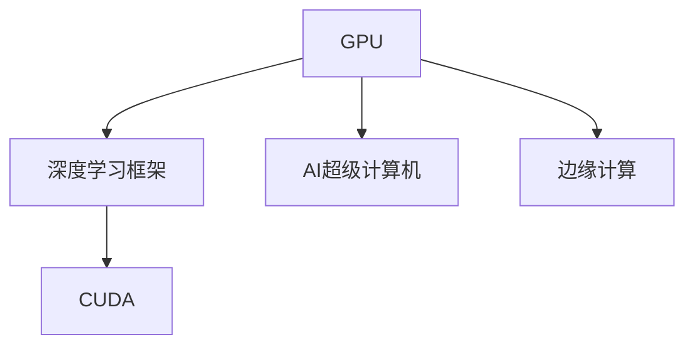

                 

# NVIDIA的算力支持

## 1. 背景介绍

随着人工智能（AI）和机器学习（ML）技术的不断进步，算力成为推动这些技术发展的重要引擎。NVIDIA作为全球领先的GPU制造商，为AI领域提供了强大的算力支持。从深度学习框架到AI超级计算机，从边缘计算到云服务，NVIDIA的算力产品覆盖了从基础研究到实际应用的各个层面。本文将深入探讨NVIDIA的算力支持，包括其核心产品、架构优势以及应用场景，并展望未来发展趋势。

## 2. 核心概念与联系

### 2.1 核心概念概述

为更好地理解NVIDIA的算力支持，本节将介绍几个关键概念：

- **GPU (图形处理单元)**：一种专用硬件，能够并行处理大量数据，显著提高计算速度。GPU在深度学习和图像处理等领域得到了广泛应用。
- **深度学习框架**：如TensorFlow、PyTorch等，提供了用于构建、训练和部署深度学习模型的工具和接口。NVIDIA的CUDA平台是许多深度学习框架的基础。
- **CUDA (Compute Unified Device Architecture)**：NVIDIA开发的一种编程模型和API，用于在GPU上并行处理数据，是深度学习应用的主要加速方式。
- **AI超级计算机**：一种能够进行大规模机器学习和高性能计算的计算机系统，通常由多个GPU组成。
- **边缘计算**：将数据处理和分析工作分布到靠近数据源的本地设备上，以减少网络延迟和带宽消耗。

这些概念共同构成了NVIDIA算力支持的核心，涵盖了从硬件加速到软件生态的各个方面。

### 2.2 核心概念原理和架构的 Mermaid 流程图



这个流程图展示了GPU、深度学习框架、CUDA和AI超级计算机之间的关系。GPU提供硬件加速能力，深度学习框架提供软件工具，CUDA提供编程接口，AI超级计算机和边缘计算则利用GPU实现高效的计算和数据处理。

## 3. 核心算法原理 & 具体操作步骤

### 3.1 算法原理概述

NVIDIA的算力支持主要基于GPU的强大并行计算能力，通过深度学习框架和CUDA平台进行高效的软件加速。其核心原理包括：

- **并行计算**：GPU能够同时处理大量数据，通过并行计算加速深度学习模型的训练和推理过程。
- **自动微分**：深度学习模型的训练通常涉及大量的参数更新和梯度计算，GPU的高效自动微分机制可以显著提高计算效率。
- **内存管理**：GPU的内存管理技术，如统一内存架构（Unified Memory），能够高效地管理和使用内存资源，优化深度学习模型的运行效率。

### 3.2 算法步骤详解

NVIDIA的算力支持主要包括以下几个关键步骤：

**Step 1: 选择合适的GPU硬件**

- 根据应用需求和预算，选择适合的NVIDIA GPU，如NVIDIA GeForce系列、NVIDIA Tesla系列等。
- 考虑GPU的计算能力（Gigaflops）、内存大小（GB）、内存容量（MB）等因素。

**Step 2: 安装和配置CUDA平台**

- 下载并安装CUDA工具包，包括CUDA驱动程序、CUDA运行时库和CUDA SDK。
- 配置CUDA环境变量，以便深度学习框架能够正确识别和利用GPU。

**Step 3: 选择合适的深度学习框架**

- 根据应用需求和技术栈，选择合适的深度学习框架，如TensorFlow、PyTorch等。
- 在选择的框架中，使用NVIDIA提供的优化工具和API，如NVIDIA Apex、NVIDIA NCCL等，进一步提升性能。

**Step 4: 编写和训练模型**

- 在配置好的GPU和深度学习框架下，编写和训练深度学习模型。
- 利用CUDA并行计算和自动微分功能，最大化GPU的计算能力。

**Step 5: 模型部署和优化**

- 将训练好的模型部署到目标硬件或云平台上。
- 使用NVIDIA提供的工具和API，如NVIDIA DeepSpeed、NVIDIA TensorRT等，进一步优化模型的推理速度和资源使用。

### 3.3 算法优缺点

NVIDIA的算力支持具有以下优点：

- **高性能**：GPU的强大并行计算能力显著提升了深度学习模型的训练和推理速度。
- **易用性**：NVIDIA提供了一套完整的软件生态系统，包括CUDA、深度学习框架等，使得开发者能够快速上手。
- **可扩展性**：NVIDIA GPU支持大规模分布式训练，能够适应大规模深度学习任务的需求。

同时，也存在以下缺点：

- **成本高**：高性能的GPU和AI超级计算机价格较高，对中小企业或个人开发者可能负担较重。
- **能耗高**：GPU的高性能计算带来了较高的能耗需求，需要良好的散热和供电系统支持。
- **学习曲线陡峭**：深度学习框架和CUDA平台的复杂性可能会给初学者带来一定的学习曲线。

### 3.4 算法应用领域

NVIDIA的算力支持广泛应用于以下几个领域：

- **深度学习研究**：科研机构和大学利用NVIDIA GPU进行深度学习模型的研究和开发。
- **高性能计算**：大规模机器学习任务和科学计算，如基因组学、气候模拟等。
- **云服务**：NVIDIA云服务，如AWS、Google Cloud等提供的GPU实例，支持大规模分布式深度学习任务。
- **边缘计算**：物联网设备、自动驾驶、工业自动化等场景中的实时数据处理和分析。
- **游戏和娱乐**：虚拟现实（VR）、增强现实（AR）等领域的图形处理和渲染。

## 4. 数学模型和公式 & 详细讲解 & 举例说明

### 4.1 数学模型构建

深度学习模型的训练通常涉及参数优化问题。以神经网络为例，模型的参数表示为 $\theta$，目标是最小化损失函数 $L(\theta)$，即：

$$
\min_\theta L(\theta)
$$

其中，$L(\theta)$ 可以是一个分类交叉熵损失、均方误差损失等。

### 4.2 公式推导过程

在深度学习模型中，梯度下降是最常用的优化算法之一。其基本思想是通过反向传播计算每个参数的梯度，然后根据梯度更新参数。公式如下：

$$
\theta \leftarrow \theta - \eta \nabla_\theta L(\theta)
$$

其中，$\eta$ 为学习率，$\nabla_\theta L(\theta)$ 为损失函数对参数 $\theta$ 的梯度。

### 4.3 案例分析与讲解

以一个简单的二分类问题为例，使用CUDA加速训练。假设模型输出为 $y_i$，真实标签为 $t_i$，则交叉熵损失函数为：

$$
L(\theta) = -\frac{1}{N} \sum_{i=1}^N t_i \log y_i + (1-t_i) \log (1-y_i)
$$

在CUDA下，可以将模型的前向传播和反向传播过程进行并行计算，以加速模型的训练。具体实现可以参考以下代码示例：

```python
import torch
import torch.nn as nn
import torch.optim as optim
from torchvision import datasets, transforms

# 加载数据集
train_dataset = datasets.MNIST(root='./data', train=True, transform=transforms.ToTensor(), download=True)
test_dataset = datasets.MNIST(root='./data', train=False, transform=transforms.ToTensor(), download=True)

# 定义模型
model = nn.Sequential(
    nn.Linear(784, 256),
    nn.ReLU(),
    nn.Linear(256, 128),
    nn.ReLU(),
    nn.Linear(128, 10)
)

# 定义损失函数和优化器
criterion = nn.CrossEntropyLoss()
optimizer = optim.SGD(model.parameters(), lr=0.01, momentum=0.9)

# CUDA加速
device = torch.device('cuda')
model.to(device)

# 训练模型
for epoch in range(10):
    model.train()
    for data, target in train_loader:
        data, target = data.to(device), target.to(device)
        optimizer.zero_grad()
        output = model(data)
        loss = criterion(output, target)
        loss.backward()
        optimizer.step()

    model.eval()
    with torch.no_grad():
        correct = 0
        total = 0
        for data, target in test_loader:
            data, target = data.to(device), target.to(device)
            output = model(data)
            _, predicted = torch.max(output.data, 1)
            total += target.size(0)
            correct += (predicted == target).sum().item()

    print('Epoch {}: Acc = {:.2f}%'.format(epoch+1, 100 * correct / total))
```

## 5. 项目实践：代码实例和详细解释说明

### 5.1 开发环境搭建

在进行NVIDIA算力支持实践前，我们需要准备好开发环境。以下是使用Python进行CUDA开发的环境配置流程：

1. 安装Anaconda：从官网下载并安装Anaconda，用于创建独立的Python环境。

2. 创建并激活虚拟环境：
```bash
conda create -n pytorch-env python=3.8 
conda activate pytorch-env
```

3. 安装CUDA和CUDA工具包：
```bash
conda install -c pytorch cuda==11.1
```

4. 安装深度学习框架：
```bash
conda install -c pytorch torch torchvision torchaudio
```

5. 安装NVIDIA提供的优化工具和API：
```bash
conda install -c pytorch apex
conda install -c pytorch tensorrt
```

完成上述步骤后，即可在`pytorch-env`环境中开始NVIDIA算力支持的实践。

### 5.2 源代码详细实现

下面我们以图像分类任务为例，给出使用NVIDIA GPU进行深度学习模型训练的PyTorch代码实现。

```python
import torch
import torch.nn as nn
import torch.optim as optim
from torchvision import datasets, transforms

# 加载数据集
train_dataset = datasets.MNIST(root='./data', train=True, transform=transforms.ToTensor(), download=True)
test_dataset = datasets.MNIST(root='./data', train=False, transform=transforms.ToTensor(), download=True)

# 定义模型
class Net(nn.Module):
    def __init__(self):
        super(Net, self).__init__()
        self.fc1 = nn.Linear(784, 512)
        self.fc2 = nn.Linear(512, 128)
        self.fc3 = nn.Linear(128, 10)
    
    def forward(self, x):
        x = x.view(-1, 784)
        x = torch.relu(self.fc1(x))
        x = torch.relu(self.fc2(x))
        x = self.fc3(x)
        return x

# 定义损失函数和优化器
criterion = nn.CrossEntropyLoss()
optimizer = optim.SGD(Net.parameters(), lr=0.01, momentum=0.9)

# CUDA加速
device = torch.device('cuda')
model = Net().to(device)

# 训练模型
for epoch in range(10):
    model.train()
    for data, target in train_loader:
        data, target = data.to(device), target.to(device)
        optimizer.zero_grad()
        output = model(data)
        loss = criterion(output, target)
        loss.backward()
        optimizer.step()

    model.eval()
    with torch.no_grad():
        correct = 0
        total = 0
        for data, target in test_loader:
            data, target = data.to(device), target.to(device)
            output = model(data)
            _, predicted = torch.max(output.data, 1)
            total += target.size(0)
            correct += (predicted == target).sum().item()

    print('Epoch {}: Acc = {:.2f}%'.format(epoch+1, 100 * correct / total))
```

### 5.3 代码解读与分析

让我们再详细解读一下关键代码的实现细节：

**Net类**：
- `__init__`方法：定义模型的结构，包括三个线性层。
- `forward`方法：实现模型的前向传播过程。

**train_loader和test_loader**：
- 使用PyTorch的DataLoader对数据集进行批次化加载，供模型训练和推理使用。

**优化器**：
- 使用SGD优化器进行参数更新，设置学习率和动量。

**模型训练**：
- 在每个epoch内，对训练集进行前向传播和反向传播，计算损失并更新模型参数。
- 在每个epoch结束时，对验证集进行评估，输出模型精度。

**模型推理**：
- 在测试集上，使用模型进行推理预测，并计算精度。

可以看到，NVIDIA的算力支持使得深度学习模型的训练和推理更加高效，能够快速迭代并取得优秀结果。

## 6. 实际应用场景

### 6.1 医疗影像诊断

在医疗领域，深度学习模型可以用于医学影像的自动诊断。NVIDIA的GPU和深度学习框架在处理高分辨率医学影像时表现出色，能够快速进行图像分割、特征提取和分类任务。

具体而言，可以使用NVIDIA GPU加速医学影像的卷积神经网络（CNN）模型训练，通过医疗影像数据集进行模型微调，使其能够自动识别肿瘤、病变等病理特征。在实际应用中，医生可以利用微调好的模型进行初步筛查，节省时间和精力，提升诊断效率和准确性。

### 6.2 自动驾驶

自动驾驶是深度学习技术的重要应用场景之一，涉及对大量传感器数据的实时处理和分析。NVIDIA的GPU和深度学习框架在自动驾驶系统中扮演了关键角色。

在自动驾驶汽车中，摄像头、雷达等传感器收集的数据需要实时处理和分析，以生成驾驶决策。NVIDIA GPU的高性能计算能力能够支持复杂的深度学习模型，实时处理高分辨率图像和点云数据。通过使用NVIDIA GPU加速模型训练，自动驾驶系统能够更加准确地识别交通信号、障碍物和其他车辆，提升驾驶安全性和效率。

### 6.3 金融风险管理

金融市场数据的处理和分析是深度学习模型应用的重要场景。NVIDIA GPU能够加速大规模数据集的处理和计算，支持高维数据的实时分析。

在金融风险管理中，NVIDIA GPU可以加速深度学习模型的训练和推理，实时处理和分析大量的市场数据，如股票价格、交易量、新闻报道等。通过使用微调好的模型，金融机构能够预测市场趋势、识别异常交易行为，及时规避金融风险。

### 6.4 未来应用展望

随着NVIDIA算力支持的不断发展，未来将有更多领域受益于深度学习技术的应用：

- **智慧城市**：在城市管理、交通控制、环境监测等方面，NVIDIA GPU能够加速大规模数据的实时处理和分析，提升城市管理水平。
- **工业自动化**：在制造、能源等领域，NVIDIA GPU能够支持大规模工业数据的实时分析和处理，提升生产效率和质量。
- **农业智能**：在农业生产、病虫害防治等方面，NVIDIA GPU能够加速深度学习模型的训练和推理，提升农业生产智能化水平。

## 7. 工具和资源推荐

### 7.1 学习资源推荐

为了帮助开发者系统掌握NVIDIA算力支持的理论基础和实践技巧，这里推荐一些优质的学习资源：

1. **NVIDIA官方文档**：提供完整的GPU和深度学习框架的使用指南和最佳实践。

2. **NVIDIA GPU Deep Learning Workshop**：提供深度学习技术相关的实战培训课程。

3. **NVIDIA AI Blog**：NVIDIA的官方博客，涵盖深度学习、高性能计算等领域的最新动态和技术分享。

4. **Coursera - Deep Learning Specialization**：由深度学习专家Andrew Ng教授的深度学习课程，涵盖深度学习的基本概念和实际应用。

5. **GitHub - NVIDIA Deep Learning**：NVIDIA深度学习框架和模型的源代码，提供丰富的实践样例。

通过对这些资源的学习实践，相信你一定能够快速掌握NVIDIA算力支持的技术精髓，并用于解决实际的深度学习问题。

### 7.2 开发工具推荐

高效的开发离不开优秀的工具支持。以下是几款用于NVIDIA算力支持开发的常用工具：

1. **NVIDIA CUDA Toolkit**：提供完整的CUDA编程环境，支持GPU加速的深度学习模型开发和优化。

2. **PyTorch**：基于Python的深度学习框架，提供高效的数据处理和模型训练功能，支持NVIDIA GPU的并行计算。

3. **TensorRT**：NVIDIA提供的深度学习推理平台，支持高精度的模型推理和加速，适用于实时应用场景。

4. **NVIDIA Apex**：提供一系列深度学习优化工具和API，支持混合精度训练和模型压缩，提升模型性能和效率。

5. **NVIDIA DeepSpeed**：支持分布式深度学习训练，适用于大规模模型和高性能计算场景。

6. **NVIDIA Triton Inference Server**：提供深度学习模型推理的优化和管理，支持多种推理引擎和模型格式。

合理利用这些工具，可以显著提升NVIDIA算力支持任务的开发效率，加快创新迭代的步伐。

### 7.3 相关论文推荐

NVIDIA的算力支持源于学界的持续研究。以下是几篇奠基性的相关论文，推荐阅读：

1. **GPU-Accelerated Deep Learning**：NVIDIA团队发表的深度学习加速论文，详细介绍GPU在深度学习中的应用。

2. **CUDA Programming for the GPU Parallel Computing Paradigm**：NVIDIA CUDA平台的基础文档，详细介绍CUDA编程模型和API。

3. **TensorRT: Inference Server for Deep Learning Applications**：NVIDIA TensorRT的官方文档，详细介绍深度学习模型的推理加速。

4. **GPU Computing and Deep Learning with NVIDIA CUDA**：NVIDIA CUDA的实践指南，详细介绍GPU加速深度学习的基本原理和应用场景。

这些论文代表了大语言模型微调技术的发展脉络。通过学习这些前沿成果，可以帮助研究者把握学科前进方向，激发更多的创新灵感。

## 8. 总结：未来发展趋势与挑战

### 8.1 总结

本文对NVIDIA的算力支持进行了全面系统的介绍。首先阐述了NVIDIA GPU和深度学习框架的强大性能，明确了其在深度学习模型训练和推理中的关键作用。其次，从原理到实践，详细讲解了NVIDIA算力支持的数学原理和关键步骤，给出了算力支持任务开发的完整代码实例。同时，本文还广泛探讨了NVIDIA算力支持在医疗影像诊断、自动驾驶、金融风险管理等多个领域的应用前景，展示了其广阔的应用潜力。最后，本文精选了NVIDIA算力支持的学习资源，力求为读者提供全方位的技术指引。

通过本文的系统梳理，可以看到，NVIDIA的算力支持在深度学习模型训练和推理中发挥了重要作用，极大地提升了计算效率和模型性能。未来，伴随深度学习技术的持续发展，NVIDIA算力支持必将在更多领域得到应用，为AI技术的产业化进程注入新的动力。

### 8.2 未来发展趋势

展望未来，NVIDIA的算力支持将呈现以下几个发展趋势：

1. **更高的计算能力**：随着NVIDIA GPU的不断升级，其计算能力和性能将进一步提升，支持更大规模和更复杂的应用场景。

2. **更广泛的应用领域**：NVIDIA GPU将支持更多领域的深度学习应用，如医疗、金融、自动驾驶、工业自动化等。

3. **更灵活的编程接口**：NVIDIA将提供更灵活的编程接口和工具，支持更多编程语言和框架，提升开发效率和模型性能。

4. **更智能的优化工具**：NVIDIA将开发更智能的优化工具和算法，自动进行模型压缩、混合精度训练等，提升模型推理速度和资源使用效率。

5. **更强大的生态系统**：NVIDIA将进一步完善其深度学习生态系统，提供更多的资源和支持，帮助开发者快速上手和迭代。

以上趋势凸显了NVIDIA算力支持技术的前景。这些方向的探索发展，将进一步推动深度学习技术的应用，为各行各业带来变革性影响。

### 8.3 面临的挑战

尽管NVIDIA的算力支持已经取得了显著成就，但在迈向更加智能化、普适化应用的过程中，它仍面临诸多挑战：

1. **高成本**：高性能的GPU和AI超级计算机价格较高，对中小企业或个人开发者可能负担较重。

2. **能耗高**：GPU的高性能计算带来了较高的能耗需求，需要良好的散热和供电系统支持。

3. **学习曲线陡峭**：深度学习框架和CUDA平台的复杂性可能会给初学者带来一定的学习曲线。

4. **模型迁移能力不足**：不同厂商的深度学习框架可能存在兼容性问题，模型迁移和共享能力有待提升。

5. **安全性和隐私保护**：深度学习模型的预测过程缺乏透明度，存在隐私泄露和模型误导的风险。

6. **数据隐私和伦理问题**：深度学习模型的训练和应用可能涉及大量个人数据，数据隐私和伦理问题需要引起重视。

解决这些挑战，需要NVIDIA和广大开发者共同努力，推动技术进步和应用普及。

### 8.4 研究展望

面对NVIDIA算力支持所面临的挑战，未来的研究需要在以下几个方面寻求新的突破：

1. **更高效的计算模型**：研究新的GPU架构和计算模型，提升计算能力和能效比，支持更大规模和更复杂的应用场景。

2. **更灵活的编程模型**：研究更灵活的编程模型和接口，支持更多编程语言和框架，提升开发效率和模型性能。

3. **更智能的优化算法**：研究更智能的优化算法和工具，自动进行模型压缩、混合精度训练等，提升模型推理速度和资源使用效率。

4. **更透明和可解释的模型**：研究更透明和可解释的深度学习模型，提升模型的可解释性和可信度，解决模型隐私和伦理问题。

5. **更强大的数据管理和隐私保护技术**：研究更强大的数据管理和隐私保护技术，确保数据安全和隐私保护，避免数据泄露和滥用。

这些研究方向的探索，将引领NVIDIA算力支持技术迈向更高的台阶，为构建安全、可靠、可解释、可控的智能系统铺平道路。面向未来，NVIDIA算力支持技术还需要与其他人工智能技术进行更深入的融合，如知识表示、因果推理、强化学习等，多路径协同发力，共同推动人工智能技术的进步。

## 9. 附录：常见问题与解答

**Q1：如何选择适合的NVIDIA GPU硬件？**

A: 根据应用需求和预算，选择适合的NVIDIA GPU。对于深度学习应用，推荐使用NVIDIA Tesla系列或GeForce RTX系列，这些GPU具有较高的计算能力和内存大小。同时考虑GPU的功耗和散热需求，确保稳定运行。

**Q2：如何安装和配置CUDA平台？**

A: 下载并安装CUDA工具包，包括CUDA驱动程序、CUDA运行时库和CUDA SDK。配置CUDA环境变量，以便深度学习框架能够正确识别和利用GPU。

**Q3：如何使用NVIDIA GPU加速深度学习模型？**

A: 使用NVIDIA提供的深度学习框架，如PyTorch、TensorFlow等，结合NVIDIA CUDA平台进行并行计算和自动微分。确保模型和数据在GPU上进行训练和推理，提升计算效率和模型性能。

**Q4：如何优化NVIDIA GPU的计算性能？**

A: 使用NVIDIA提供的优化工具和API，如NVIDIA Apex、NVIDIA TensorRT等，进行混合精度训练和模型压缩，提升模型推理速度和资源使用效率。同时，合理利用NVIDIA DeepSpeed等工具进行分布式训练，加速模型训练过程。

**Q5：如何应对NVIDIA算力支持的挑战？**

A: 解决NVIDIA算力支持所面临的挑战需要多方面的努力。对于高成本问题，可以考虑使用云计算平台提供的GPU实例，降低硬件成本。对于能耗问题，优化散热和供电系统，确保稳定运行。对于学习曲线问题，可以参加深度学习相关的培训课程，提升技能水平。对于模型迁移和隐私问题，采用标准化的数据和模型格式，加强数据管理和隐私保护技术。

总之，NVIDIA的算力支持为深度学习技术提供了强大的硬件和软件基础，应用前景广阔。然而，面对技术挑战，需要持续创新和优化，才能实现其潜力，推动AI技术的广泛应用。

---

作者：禅与计算机程序设计艺术 / Zen and the Art of Computer Programming

