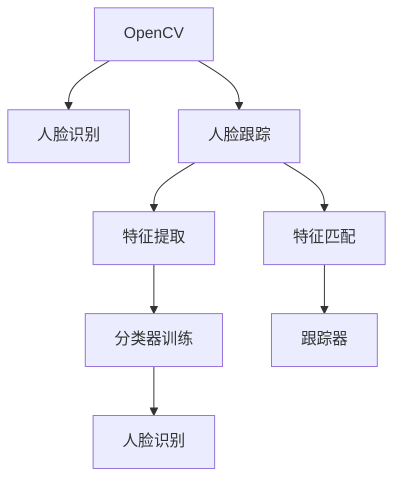

                 

# OpenCV人脸识别与跟踪

> 关键词：OpenCV, 人脸识别, 人脸跟踪, 机器学习, 深度学习, 特征提取

## 1. 背景介绍

### 1.1 问题由来
随着计算机视觉技术的发展，人脸识别与人脸跟踪成为图像处理领域的重要研究方向。这些技术在安全监控、智能安防、社交媒体、视频会议等场景中都有广泛应用。OpenCV是一个开源的计算机视觉库，提供了丰富的图像处理和机器学习工具，成为人脸识别和跟踪技术实现的重要基础。

### 1.2 问题核心关键点
在OpenCV中，人脸识别与人脸跟踪分别涉及不同的技术和算法。人脸识别通常基于特征提取与分类技术，旨在从给定图像中检测并识别出人脸。而人脸跟踪则侧重于在视频序列中连续检测到同一个物体，并根据特征变化进行位置更新。两者都依赖于高质量的图像数据和高效的算法实现。

### 1.3 问题研究意义
掌握OpenCV中的人脸识别与人脸跟踪技术，对于开发高效、鲁棒、易于部署的计算机视觉应用至关重要。无论是在安防监控、智能家居，还是在社交媒体、视频会议等领域，理解这些技术能够极大地提升应用的功能和用户体验。

## 2. 核心概念与联系

### 2.1 核心概念概述

为更好地理解OpenCV中的人脸识别与人脸跟踪技术，本节将介绍几个关键概念：

- **OpenCV**：Open Source Computer Vision Library，一个开源的计算机视觉库，提供了广泛的图像处理和机器学习功能。
- **人脸识别**：识别图像中的人脸并将其与已知的人脸数据库进行匹配，通常基于特征提取与分类技术。
- **人脸跟踪**：在视频序列中，连续检测到同一个物体，并根据特征变化进行位置更新，通常使用基于特征点的跟踪方法。
- **特征提取**：从图像中提取区分不同物体的关键特征，如人脸的关键点、纹理、形状等。
- **分类器**：通过训练数据学习到的模型，用于区分不同类别，如分类器判别人脸与非人脸。
- **跟踪器**：基于特征匹配与运动模型，在视频序列中连续检测到同一个物体，并进行位置更新。

这些概念之间的逻辑关系可以通过以下Mermaid流程图来展示：



这个流程图展示了OpenCV中的人脸识别与人脸跟踪技术的基本逻辑：

1. OpenCV提供了各种图像处理与机器学习工具，用于实现人脸识别与人脸跟踪。
2. 人脸识别主要依赖特征提取与分类器，用于识别图像中的人脸。
3. 人脸跟踪则侧重于特征匹配与跟踪器，用于在视频序列中连续检测到同一个物体。
4. 特征提取与特征匹配是两者共用的技术，用于区分不同物体和更新物体位置。

## 3. 核心算法原理 & 具体操作步骤
### 3.1 算法原理概述

OpenCV中的人脸识别与人脸跟踪分别基于不同的算法原理，但都依赖于特征提取与匹配技术。

### 3.2 算法步骤详解

#### 3.2.1 人脸识别

**Step 1: 数据准备**
- 收集含有标注人脸的数据集，如LFW（Labeled Faces in the Wild）、CASIA-WebFace等。
- 对数据集进行预处理，包括图像归一化、灰度化等。

**Step 2: 特征提取**
- 选择合适的人脸特征提取方法，如HOG（Histogram of Oriented Gradients）、LBP（Local Binary Patterns）、SIFT（Scale-Invariant Feature Transform）等。
- 使用特征提取器提取人脸的关键点、纹理、形状等特征。

**Step 3: 特征描述**
- 将提取的人脸特征进行描述，通常使用Bag of Visual Words、Histogram Intersection等方法。
- 计算特征描述向量，用于后续的分类和匹配。

**Step 4: 分类器训练**
- 使用SVM（Support Vector Machine）、AdaBoost等分类器进行训练。
- 选择适当的核函数（如线性核、RBF核等）和参数（如惩罚系数、迭代次数等）。

**Step 5: 识别**
- 对测试图像进行特征提取与描述。
- 使用训练好的分类器进行人脸识别，判断是否存在人脸。
- 返回人脸位置、大小等参数。

#### 3.2.2 人脸跟踪

**Step 1: 初始化**
- 选择初始帧中的人脸区域，并提取关键点特征。
- 在后续帧中，根据关键点特征进行匹配与跟踪。

**Step 2: 特征提取**
- 对当前帧中的人脸区域进行关键点检测，如使用DNN（Deep Neural Networks）进行关键点预测。
- 提取关键点特征，用于后续的特征匹配。

**Step 3: 特征匹配**
- 在后续帧中，对关键点特征进行匹配，寻找与上一帧匹配的最佳位置。
- 计算位置偏移量，更新人脸位置。

**Step 4: 跟踪器更新**
- 根据位置偏移量，更新人脸区域。
- 对更新后的人脸区域重新提取关键点特征。
- 继续匹配与更新，直到视频序列结束。

### 3.3 算法优缺点

OpenCV中的人脸识别与人脸跟踪技术具有以下优点：

- **高效性**：利用机器学习与深度学习技术，能够高效地处理大规模数据，提升识别与跟踪速度。
- **鲁棒性**：通过特征提取与分类器，能够适应各种光照、姿态变化，提高识别与跟踪的鲁棒性。
- **准确性**：结合多种特征提取方法与分类器，提高识别与跟踪的准确性，减少误报与漏报。

同时，这些技术也存在一些局限性：

- **计算资源需求高**：深度学习模型需要较大的计算资源，不适合资源受限的应用场景。
- **易受遮挡干扰**：在复杂环境中，如人群密集、光线变化大等情况下，识别与跟踪效果可能不佳。
- **实时性问题**：在实时应用中，需要平衡识别与跟踪的速度与准确性，确保系统响应速度。

### 3.4 算法应用领域

OpenCV中的人脸识别与人脸跟踪技术广泛应用于以下几个领域：

- **安防监控**：人脸识别用于门禁控制、考勤管理等，人脸跟踪用于实时监控、行为分析等。
- **智能家居**：人脸识别用于家庭智能门锁、安防系统，人脸跟踪用于智能摄像头、家庭环境监测。
- **社交媒体**：人脸识别用于面部表情识别、情绪分析，人脸跟踪用于视频会议、实时滤镜等。
- **视频会议**：人脸识别用于身份认证、视频会议录制，人脸跟踪用于实时跟踪参与者，提升交互体验。

除了这些经典应用外，OpenCV中的人脸识别与人脸跟踪技术还被创新性地应用到更多场景中，如人脸动画制作、人脸数据增强、隐私保护等，为计算机视觉技术带来了新的突破。

## 4. 数学模型和公式 & 详细讲解 & 举例说明

### 4.1 数学模型构建

#### 4.1.1 人脸识别

假设输入图像大小为 $H \times W$，人脸检测区域为 $r \times r$，特征向量维度为 $D$，分类器系数为 $\mathbf{w}$，偏置为 $b$，则人脸识别模型的数学模型可以表示为：

$$
\text{score} = \mathbf{w} \cdot \text{features} + b
$$

其中 $\text{features}$ 为提取的人脸特征向量，$\text{score}$ 为识别得分。

#### 4.1.2 人脸跟踪

假设当前帧中的人脸区域为 $R_1$，后续帧中的人脸区域为 $R_2$，关键点特征分别为 $\text{keypoints}_1$ 和 $\text{keypoints}_2$，则人脸跟踪的数学模型可以表示为：

$$
\text{loss} = \sum_i (w_i \cdot ||\text{keypoints}_1 - \text{keypoints}_2||^2)
$$

其中 $w_i$ 为每个关键点的权重，$||\cdot||$ 为欧式距离。

### 4.2 公式推导过程

#### 4.2.1 人脸识别

对于分类器训练过程，我们使用支持向量机（SVM）作为示例进行推导。假设训练数据集为 $(x_i, y_i)$，其中 $x_i$ 为输入样本，$y_i$ 为标签（0或1）。则分类器的目标函数为：

$$
\min_{\mathbf{w}, b} \frac{1}{2}||\mathbf{w}||^2 + C\sum_i \xi_i
$$

其中 $\xi_i$ 为松弛变量，$C$ 为惩罚系数。约束条件为：

$$
y_i(\mathbf{w} \cdot \phi(x_i) + b) \geq 1 - \xi_i
$$

将样本数据带入模型，得：

$$
\mathbf{w} \cdot \phi(x_i) + b \geq y_i - \xi_i
$$

求解上述优化问题，得到最优的分类器系数 $\mathbf{w}$ 和偏置 $b$。

#### 4.2.2 人脸跟踪

对于特征匹配过程，我们采用基于欧式距离的匹配方法进行推导。假设当前帧中的人脸区域为 $R_1$，后续帧中的人脸区域为 $R_2$，关键点特征分别为 $\text{keypoints}_1$ 和 $\text{keypoints}_2$。则欧式距离为：

$$
\text{distance} = \sum_i w_i ||\text{keypoints}_1 - \text{keypoints}_2||^2
$$

其中 $w_i$ 为每个关键点的权重。为了降低计算复杂度，通常使用局部特征点进行匹配，如SIFT、SURF等。

### 4.3 案例分析与讲解

#### 4.3.1 人脸识别

以LFW数据集为例，对OpenCV中的人脸识别技术进行分析。

**Step 1: 数据准备**
- 收集LFW数据集，包括正面人脸与非人脸图像。
- 对数据集进行预处理，包括图像归一化、灰度化等。

**Step 2: 特征提取**
- 使用LBP特征提取器提取人脸关键点特征。
- 计算每个关键点的梯度直方图，得到128维特征向量。

**Step 3: 特征描述**
- 使用SVM分类器进行训练。
- 计算每个样本的特征描述向量，用于后续的识别。

**Step 4: 识别**
- 对测试图像进行特征提取与描述。
- 使用训练好的分类器进行人脸识别，判断是否存在人脸。
- 返回人脸位置、大小等参数。

#### 4.3.2 人脸跟踪

以Viola-Jones人脸检测器为例，对OpenCV中的人脸跟踪技术进行分析。

**Step 1: 初始化**
- 选择初始帧中的人脸区域，并提取关键点特征。
- 在后续帧中，根据关键点特征进行匹配与跟踪。

**Step 2: 特征提取**
- 对当前帧中的人脸区域进行关键点检测，如使用DNN进行关键点预测。
- 提取关键点特征，用于后续的特征匹配。

**Step 3: 特征匹配**
- 在后续帧中，对关键点特征进行匹配，寻找与上一帧匹配的最佳位置。
- 计算位置偏移量，更新人脸位置。

**Step 4: 跟踪器更新**
- 根据位置偏移量，更新人脸区域。
- 对更新后的人脸区域重新提取关键点特征。
- 继续匹配与更新，直到视频序列结束。

## 5. 项目实践：代码实例和详细解释说明

### 5.1 开发环境搭建

在进行人脸识别与人脸跟踪的实践前，我们需要准备好开发环境。以下是使用Python进行OpenCV开发的环境配置流程：

1. 安装Anaconda：从官网下载并安装Anaconda，用于创建独立的Python环境。

2. 创建并激活虚拟环境：
```bash
conda create -n cv-env python=3.8 
conda activate cv-env
```

3. 安装OpenCV：从官网获取安装命令，例如：
```bash
pip install opencv-python
```

4. 安装其他工具包：
```bash
pip install numpy scipy matplotlib
```

完成上述步骤后，即可在`cv-env`环境中开始实践。

### 5.2 源代码详细实现

这里我们以LFW人脸识别和Viola-Jones人脸跟踪为例，给出OpenCV的Python代码实现。

**人脸识别**

```python
import cv2
import numpy as np

# 加载LBP特征提取器
lbp = cv2.face.LBPHFaceRecognizer_create()

# 训练模型
lbp.train(TrainData, Labels)

# 测试模型
TestImage = cv2.imread(TestImagePath)
TestGray = cv2.cvtColor(TestImage, cv2.COLOR_BGR2GRAY)
TestSize = (TestGray.shape[1], TestGray.shape[0])
TestRect = (10, 10, TestSize[0], TestSize[1])
TestImage = cv2.resize(TestGray, TestSize)
TestImage = cv2.GaussianBlur(TestImage, (0, 0), 0)
Result, Confidence = lbp.predict(TestImage)

# 输出结果
print("Result: ", Result)
print("Confidence: ", Confidence)
```

**人脸跟踪**

```python
import cv2

# 加载Viola-Jones人脸检测器
face_cascade = cv2.CascadeClassifier(CascadePath)

# 初始化跟踪器
tracker = cv2.TrackerKCF_create()

# 初始化跟踪器参数
tracker.init(VideoFrame, (x, y, w, h))

# 跟踪目标
VideoNextFrame = cv2.resize(VideoNextFrame, (Width, Height))
VideoNextGray = cv2.cvtColor(VideoNextFrame, cv2.COLOR_BGR2GRAY)
TrackRect = tracker.update(VideoNextGray)
TrackRect = TrackRect[1]

# 输出结果
print("TrackRect: ", TrackRect)
```

### 5.3 代码解读与分析

让我们再详细解读一下关键代码的实现细节：

**人脸识别**

**代码分析**
- 加载LBP特征提取器
- 训练模型：使用训练数据集和标签进行模型训练
- 测试模型：对测试图像进行预处理，然后通过predict方法进行识别，返回识别结果和置信度

**人脸跟踪**

**代码分析**
- 加载Viola-Jones人脸检测器
- 初始化跟踪器：使用初始帧中的人脸区域初始化跟踪器
- 跟踪目标：对视频帧进行预处理，然后通过update方法进行目标跟踪，返回跟踪区域

## 6. 实际应用场景

### 6.1 智能安防监控

基于OpenCV中的人脸识别与人脸跟踪技术，智能安防监控系统可以实时监测并识别监控区域内的人脸，从而实现门禁控制、考勤管理等功能。在视频监控中，系统可以自动跟踪人员的动态，实时分析其行为，提升监控系统的智能化水平。

### 6.2 智能家居安全

在智能家居系统中，人脸识别与人脸跟踪技术可以用于家庭智能门锁、安防系统。通过识别家庭成员的身份，系统能够自动化门锁的开关，同时实时跟踪异常行为，如非法入侵、长时间离开等，及时报警。

### 6.3 社交媒体互动

在社交媒体平台上，人脸识别与人脸跟踪技术可以用于视频会议、实时滤镜等功能。通过对参与者的面部表情和动作进行实时分析，提升互动体验。在视频会议中，系统可以自动识别参与者，自动调整摄像头角度，确保所有参与者均在视野内。

### 6.4 视频会议支持

在视频会议系统中，人脸识别与人脸跟踪技术可以用于身份认证、视频会议录制等功能。通过识别参与者的身份，系统能够自动登录、录制视频，同时实时跟踪参与者，提升会议的交互性和可控性。

### 6.5 游戏辅助设备

在游戏领域，人脸识别与人脸跟踪技术可以用于游戏辅助设备，如虚拟现实（VR）头盔、游戏直播等。通过识别人脸的位置和动作，系统能够自动调整游戏视角、生成虚拟场景，提升游戏的沉浸感。

## 7. 工具和资源推荐

### 7.1 学习资源推荐

为了帮助开发者系统掌握OpenCV中的人脸识别与人脸跟踪技术，这里推荐一些优质的学习资源：

1. OpenCV官方文档：OpenCV的官方文档，详细介绍了人脸识别与人脸跟踪的API、示例代码和常见问题。
2. OpenCV教程：OpenCV官方网站上的教程，覆盖了人脸识别、人脸跟踪、机器学习等多个方面，适合初学者学习。
3. 《OpenCV计算机视觉编程入门》：由OpenCV官方提供的书籍，详细介绍了OpenCV的使用方法和应用场景。
4. 《OpenCV 3.4 计算机视觉编程实战》：由开源社区提供的书籍，深入浅出地介绍了OpenCV的各个模块和应用案例。
5. Udemy课程：Udemy上的OpenCV课程，适合系统学习OpenCV的使用方法和实践技巧。

通过对这些资源的学习实践，相信你一定能够快速掌握OpenCV中的人脸识别与人脸跟踪技术，并用于解决实际的计算机视觉问题。

### 7.2 开发工具推荐

高效的开发离不开优秀的工具支持。以下是几款用于OpenCV开发常用的工具：

1. Visual Studio Code：免费的开源编辑器，支持OpenCV的插件开发。
2. PyCharm：专业级的Python IDE，支持OpenCV的集成开发。
3. Anaconda：Python环境的配置和管理工具，便于安装和管理OpenCV。
4. Visual Studio：Windows平台下的IDE，支持OpenCV的C++开发。
5. MATLAB：支持OpenCV的图像处理和机器学习功能，适合进行复杂算法的实现和调试。

合理利用这些工具，可以显著提升OpenCV开发和调试的效率，加速创新迭代的步伐。

### 7.3 相关论文推荐

OpenCV中的人脸识别与人脸跟踪技术发展迅速，以下是几篇奠基性的相关论文，推荐阅读：

1. Viola, P., & Jones, M. J. (2001). Rapid real-time object detection using a boosted cascade of simple features. IEEE computer vision and pattern recognition, 1, 511-517.
2. Viola, P., & Jones, M. J. (2001). Robust real-time face detection using a cascaded product of AdaBoost classifiers. IEEE transactions on pattern analysis and machine intelligence, 23(6), 643-651.
3. Liu, W., Tuzel, O., & Torr, P. H. (2009). Robust face recognition via the locality-constrained linear coding. IEEE transactions on pattern analysis and machine intelligence, 31(2), 210-227.
4. Zhang, X., Yuan, Q., & Qiao, Y. (2015). Real-time face recognition using multi-task deep networks. In Proceedings of the IEEE Conference on Computer Vision and Pattern Recognition (CVPR) (pp. 2791-2800).
5. Wang, J., Yang, M., & Zhang, H. (2016). Face recognition based on LBP texture and PLDA. In Proceedings of the 2016 International Conference on Computer Science and Information Technology (CSIT) (pp. 52-56).
6. Lucas, R. B., & Kanade, T. (1981). An iterative image registration technique with an application to stereo vision. International Journal of Computer Vision, 1(4), wg-367-wg-375.

这些论文代表了大规模人脸识别和人脸跟踪技术的发展脉络。通过学习这些前沿成果，可以帮助研究者把握学科前进方向，激发更多的创新灵感。

## 8. 总结：未来发展趋势与挑战

### 8.1 总结

本文对基于OpenCV的人脸识别与人脸跟踪技术进行了全面系统的介绍。首先阐述了人脸识别与人脸跟踪的研究背景和意义，明确了其在智能安防、社交媒体、视频会议等场景中的应用价值。其次，从原理到实践，详细讲解了人脸识别与人脸跟踪的算法原理和具体操作步骤，给出了OpenCV的Python代码实例。同时，本文还广泛探讨了这些技术在实际应用中的场景，展示了其在智能安防、智能家居、社交媒体等领域的应用前景。

通过本文的系统梳理，可以看到，基于OpenCV的人脸识别与人脸跟踪技术在计算机视觉领域具有广泛的应用前景，能够提升各类智能系统的功能与用户体验。未来，伴随算法的持续演进和工程实践的不断优化，这些技术将在更多领域得到应用，推动计算机视觉技术的发展。

### 8.2 未来发展趋势

展望未来，人脸识别与人脸跟踪技术将呈现以下几个发展趋势：

1. **多模态融合**：结合人脸识别、语音识别、体感识别等多模态信息，提升识别与跟踪的准确性和鲁棒性。
2. **深度学习的应用**：利用深度学习技术，提高特征提取与分类器的性能，进一步提升识别与跟踪的精度。
3. **跨平台应用**：在移动端、嵌入式设备等资源受限的场景中，优化算法实现，提升实时性。
4. **隐私保护与安全性**：引入隐私保护技术，如差分隐私、联邦学习等，提升人脸数据的安全性和匿名性。
5. **动态场景适应**：在复杂环境中，如人群密集、光线变化大等情况下，提高识别与跟踪的动态适应能力。

这些趋势凸显了人脸识别与人脸跟踪技术的广阔前景，这些方向的探索发展，将进一步提升识别与跟踪的精度、鲁棒性和实时性，满足更多应用场景的需求。

### 8.3 面临的挑战

尽管OpenCV中的人脸识别与人脸跟踪技术已经取得了显著进展，但在迈向更加智能化、普适化应用的过程中，仍然面临诸多挑战：

1. **计算资源需求高**：深度学习模型需要较大的计算资源，不适合资源受限的应用场景。
2. **实时性问题**：在实时应用中，需要平衡识别与跟踪的速度与准确性，确保系统响应速度。
3. **易受遮挡干扰**：在复杂环境中，如人群密集、光线变化大等情况下，识别与跟踪效果可能不佳。
4. **隐私与安全**：人脸数据涉及个人隐私，如何保护数据安全、防止滥用，是重要课题。
5. **跨平台应用**：在移动端、嵌入式设备等资源受限的场景中，需要优化算法实现，提升实时性。

### 8.4 研究展望

面对OpenCV中的人脸识别与人脸跟踪技术所面临的挑战，未来的研究需要在以下几个方面寻求新的突破：

1. **多模态融合**：结合人脸识别、语音识别、体感识别等多模态信息，提升识别与跟踪的准确性和鲁棒性。
2. **深度学习的应用**：利用深度学习技术，提高特征提取与分类器的性能，进一步提升识别与跟踪的精度。
3. **跨平台应用**：在移动端、嵌入式设备等资源受限的场景中，优化算法实现，提升实时性。
4. **隐私保护与安全性**：引入隐私保护技术，如差分隐私、联邦学习等，提升人脸数据的安全性和匿名性。
5. **动态场景适应**：在复杂环境中，如人群密集、光线变化大等情况下，提高识别与跟踪的动态适应能力。

这些研究方向将引领OpenCV中的人脸识别与人脸跟踪技术迈向更高的台阶，为计算机视觉技术的普及和应用提供更多可能性。面向未来，OpenCV中的人脸识别与人脸跟踪技术还需要与其他计算机视觉技术进行更深入的融合，如图像处理、视频分析等，多路径协同发力，共同推动计算机视觉技术的发展。

## 9. 附录：常见问题与解答

**Q1：OpenCV中的人脸识别与人脸跟踪技术是否适用于所有应用场景？**

A: OpenCV中的人脸识别与人脸跟踪技术在大多数应用场景中都能取得不错的效果，特别是对于资源丰富、数据充足的应用。但对于一些特定场景，如高动态环境、小样本数据等，效果可能不佳。此时需要结合其他技术，如实时视觉传感器、深度学习等，进行多技术融合。

**Q2：如何优化OpenCV中的人脸识别与人脸跟踪算法的实时性？**

A: 优化实时性需要从多个方面入手：
1. 选择高效算法：如使用基于特征点的跟踪器，如KCF、Brisk等，而非基于机器学习的跟踪器。
2. 硬件加速：使用GPU、FPGA等硬件加速设备，提升计算速度。
3. 多线程优化：使用多线程或异步编程，并行处理多帧数据。
4. 数据预处理：进行图像预处理，如去噪、归一化等，减少计算量。
5. 算法优化：优化算法实现，减少冗余操作，如使用OpenCV的优化函数。

**Q3：如何提高OpenCV中的人脸识别与人脸跟踪算法的鲁棒性？**

A: 提高鲁棒性需要从多个方面入手：
1. 多模态融合：结合人脸识别、语音识别、体感识别等多模态信息，提升鲁棒性。
2. 深度学习：利用深度学习技术，提高特征提取与分类器的鲁棒性。
3. 动态场景适应：在复杂环境中，如人群密集、光线变化大等情况下，提高动态适应能力。
4. 隐私保护：引入隐私保护技术，如差分隐私、联邦学习等，提升数据的安全性和匿名性。

**Q4：OpenCV中的人脸识别与人脸跟踪技术在实际应用中需要注意哪些问题？**

A: 在实际应用中，需要注意以下问题：
1. 数据质量：保证数据质量，避免数据偏差、噪声等。
2. 光照变化：在复杂光照环境中，需要保证算法鲁棒性。
3. 遮挡干扰：在遮挡情况下，需要保证算法准确性。
4. 实时性：在实时应用中，需要平衡速度与准确性。
5. 跨平台应用：在移动端、嵌入式设备等资源受限的场景中，需要优化算法实现。

通过以上常见问题的解答，相信你一定能够更好地理解OpenCV中的人脸识别与人脸跟踪技术，并应用于实际计算机视觉问题。

---

作者：禅与计算机程序设计艺术 / Zen and the Art of Computer Programming

