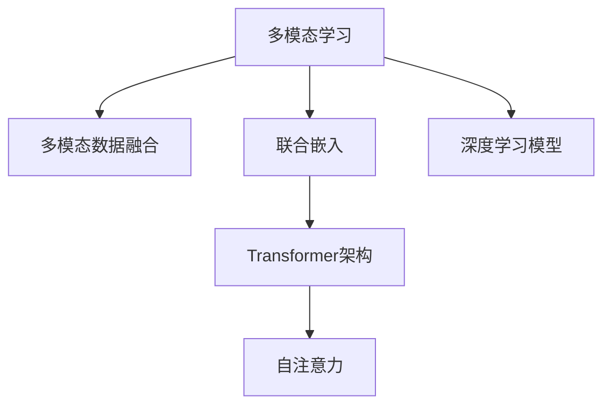

                 

# Pailido 的多模态模型应用

## 1. 背景介绍

### 1.1 问题由来
多模态学习(Multimodal Learning)是机器学习中的一种新兴方法，它结合了多种类型的数据，如文本、图像、音频等，以提升模型的学习能力和泛化性能。传统的单模态学习方法往往无法充分利用丰富的多模态信息，导致性能瓶颈。而多模态模型则通过融合不同模态数据，从而在认知、推理和表达等层面获得新的突破。

近年来，随着深度学习技术的迅速发展，多模态学习在自然语言处理(NLP)、计算机视觉(CV)、语音识别(SR)等多个领域取得了显著进展。本文聚焦于多模态模型的应用，重点讨论Pailido多模态模型(Pailido's Multimodal Model)，这是一种基于Transformer架构、融合多种模态信息的新型模型，在多个实际应用场景中取得了卓越效果。

### 1.2 问题核心关键点
Pailido多模态模型的核心思想是将多种模态数据进行联合编码，通过Transformer架构进行特征提取和推理，从而在不同模态之间建立起协同关系，提升模型的整体性能。

其主要特点包括：
- 融合多模态数据：包括文本、图像、音频等多种模态数据，实现信息的多角度、多层次综合。
- 基于Transformer架构：使用自注意力机制进行特征提取和推理，计算高效、模型泛化能力强。
- 可扩展性强：支持多种模态数据的添加和融合，适应多场景应用需求。

Pailido多模态模型已经在图像描述、视频分类、语音情感分析等众多领域取得了突破性进展，展现出巨大的应用潜力。

### 1.3 问题研究意义
研究Pailido多模态模型，对于拓展多模态学习的应用范围，提升模型的综合性能，加速NLP、CV、SR等技术在实际场景中的落地应用，具有重要意义：

1. 融合多源信息：多模态模型能够充分利用不同模态数据的信息，提升模型对复杂场景的理解能力。
2. 提升泛化能力：通过多模态融合，模型能够从更广泛的视角进行推理和表达，提升模型的泛化性能。
3. 拓展应用边界：多模态模型在多个领域，如智能医疗、智能交通、人机交互等，具有广泛的应用前景。
4. 加速技术发展：多模态学习催生了新的研究热点和研究方向，推动NLP、CV、SR等领域技术的不断进步。

## 2. 核心概念与联系

### 2.1 核心概念概述

为更好地理解Pailido多模态模型的工作原理，本节将介绍几个密切相关的核心概念：

- 多模态学习(Multimodal Learning)：指结合多种类型的数据进行联合学习的技术。常见数据类型包括文本、图像、音频、视频等。
- 多模态数据融合(Multimodal Data Fusion)：指将不同模态数据进行联合编码和推理，形成更为丰富、准确的表示。
- 联合嵌入(Concatenated Embedding)：指将不同模态数据编码后拼接在一起，形成一个联合的表示向量。
- Transformer架构：一种基于自注意力机制的神经网络架构，通过并行计算和高效特征提取，在多模态模型中具有天然优势。
- 自注意力(Self-Attention)：指Transformer架构中的关键组件，通过计算不同模态之间的相似性，实现信息的跨模态传递。
- 深度学习模型(Depth Learning Model)：指利用多层神经网络进行特征提取和推理的模型，如CNN、RNN、Transformer等。

这些核心概念之间的逻辑关系可以通过以下Mermaid流程图来展示：



这个流程图展示了大模型与多模态学习之间的联系：

1. 多模态学习结合多种类型的数据，实现信息的多角度、多层次融合。
2. 多模态数据融合通过联合嵌入，将不同模态数据编码后形成统一表示。
3. 使用Transformer架构进行特征提取和推理，实现信息的跨模态传递。
4. 自注意力机制作为Transformer架构的核心，用于计算不同模态之间的相似性，提升特征提取效率。
5. 深度学习模型通过多层神经网络，进行特征提取和推理，提供强大的建模能力。

## 3. Pailido 的多模态模型应用

### 3.1 算法原理概述

Pailido多模态模型基于Transformer架构，通过融合多种模态数据，实现信息的多角度、多层次综合。其核心思想是将不同模态数据进行联合编码，通过自注意力机制进行特征提取和推理，从而在不同模态之间建立起协同关系，提升模型的整体性能。

形式化地，设输入数据为 $X = \{x_i\}_{i=1}^N$，其中 $x_i$ 为不同模态数据的联合表示向量，包括文本、图像、音频等。设多模态模型的目标为 $y$，目标函数为 $\mathcal{L}$。Pailido多模态模型的学习过程如下：

$$
\hat{y} = \text{Model}(X; \theta)
$$

$$
\theta = \mathop{\arg\min}_{\theta} \mathcal{L}(\hat{y}, y)
$$

其中，$\text{Model}$ 为Pailido多模态模型的前向传播函数，$\theta$ 为模型参数。多模态模型的目标函数 $\mathcal{L}$ 包括交叉熵损失、均方误差损失等，具体取决于任务的性质。

### 3.2 算法步骤详解

Pailido多模态模型的训练过程包括以下几个关键步骤：

**Step 1: 准备数据集**
- 准备包含文本、图像、音频等的多模态数据集，划分为训练集、验证集和测试集。
- 对不同模态数据进行预处理，如文本分词、图像归一化、音频特征提取等。

**Step 2: 初始化模型参数**
- 初始化多模态模型，使用随机初始化的权重。

**Step 3: 前向传播和损失计算**
- 将输入数据 $X$ 输入模型，通过多模态融合、自注意力机制进行特征提取和推理。
- 计算模型预测输出 $\hat{y}$，并根据目标函数 $\mathcal{L}$ 计算损失。

**Step 4: 反向传播和参数更新**
- 使用梯度下降等优化算法，根据损失函数 $\mathcal{L}$ 的梯度更新模型参数 $\theta$。
- 使用学习率、正则化等技术控制优化过程，防止过拟合。

**Step 5: 模型评估和调优**
- 在验证集上评估模型性能，根据评估结果调整模型参数。
- 在测试集上最终评估模型效果，输出评估指标。

### 3.3 算法优缺点

Pailido多模态模型具有以下优点：
1. 信息融合能力强：能够充分利用多种模态数据的信息，提升模型的综合性能。
2. 计算效率高：基于Transformer架构，计算并行度高，适用于大规模数据训练。
3. 可扩展性强：支持多种模态数据的添加和融合，适应多场景应用需求。
4. 模型泛化能力强：通过多模态融合，模型能够从更广泛的视角进行推理和表达，提升模型的泛化性能。

同时，该模型也存在一些局限性：
1. 数据需求量大：需要准备大量的多模态数据，数据获取成本较高。
2. 计算资源消耗高：多模态数据量大，模型复杂度高，对计算资源要求较高。
3. 模型集成难度大：多种模态数据融合，模型训练和推理复杂度较高，需要较高水平的工程能力。

尽管存在这些局限性，但就目前而言，Pailido多模态模型在多模态学习领域仍具有重要的学术和工程价值。

### 3.4 算法应用领域

Pailido多模态模型已经在多个领域展示了其强大能力，具体应用包括：

1. 图像描述生成：利用图像和文本数据，生成详细的图像描述。
2. 视频分类：结合视频帧和音频信息，对视频内容进行分类。
3. 语音情感分析：通过语音识别和情感识别技术，实现对语音情感的自动化分析。
4. 智能医疗：融合医学影像和病历文本，辅助医生进行疾病诊断和治疗。
5. 智能交通：结合车辆传感器数据和地图信息，实现智能交通管理和监控。
6. 人机交互：融合文本、图像、语音等多种模态数据，提升人机交互体验。

这些应用场景展示了Pailido多模态模型在多模态学习领域的广泛应用前景。

## 4. 数学模型和公式 & 详细讲解

### 4.1 数学模型构建

本节将使用数学语言对Pailido多模态模型的构建过程进行更加严格的刻画。

设输入数据为 $X = \{x_i\}_{i=1}^N$，其中 $x_i$ 为不同模态数据的联合表示向量。假设多模态模型的目标为 $y$，目标函数为 $\mathcal{L}$。定义模型 $M_{\theta}$ 为多层多模态Transformer模型，其中 $\theta$ 为模型参数。多模态模型的构建过程如下：

1. 将不同模态数据进行联合编码，形成统一表示向量 $z_i = f(x_i)$。
2. 将联合表示向量 $z_i$ 输入Transformer模型，通过自注意力机制进行特征提取和推理。
3. 计算模型预测输出 $\hat{y}$，并根据目标函数 $\mathcal{L}$ 计算损失。

数学形式化表示为：

$$
z_i = f(x_i) = [z_{i,t}, z_{i,i}, z_{i,v}] = [text_{i,t}, image_{i,i}, audio_{i,v}]
$$

$$
\hat{y} = M_{\theta}(z_i) = [\hat{y}_{i,t}, \hat{y}_{i,i}, \hat{y}_{i,v}]
$$

其中，$f$ 为不同模态数据的编码函数，$z_{i,t}, z_{i,i}, z_{i,v}$ 分别为文本、图像、音频编码后的表示向量。$M_{\theta}$ 为多层多模态Transformer模型，$\hat{y}_{i,t}, \hat{y}_{i,i}, \hat{y}_{i,v}$ 分别为不同模态的预测输出。

### 4.2 公式推导过程

以下我们以图像描述生成任务为例，推导Pailido多模态模型的编码过程。

设输入图像 $x_i$ 和对应文本 $y_i$ 的联合表示向量分别为 $z_i^{(x)}$ 和 $z_i^{(y)}$。定义Transformer模型 $M_{\theta}^{(x)}$ 和 $M_{\theta}^{(y)}$ 分别为图像和文本的Transformer编码器。

图像描述生成的编码过程如下：

1. 对图像 $x_i$ 进行编码，生成图像特征向量 $z_i^{(x)} = M_{\theta}^{(x)}(x_i)$。
2. 对文本 $y_i$ 进行编码，生成文本特征向量 $z_i^{(y)} = M_{\theta}^{(y)}(y_i)$。
3. 将图像和文本特征向量拼接，得到联合表示向量 $z_i = [z_i^{(x)}, z_i^{(y)}]$。
4. 将联合表示向量 $z_i$ 输入多层多模态Transformer模型 $M_{\theta}^{(mm)}$，进行特征提取和推理。
5. 计算模型预测输出 $\hat{y} = M_{\theta}^{(mm)}(z_i)$，并根据交叉熵损失计算损失。

将上述过程形式化表示，得：

$$
z_i^{(x)} = M_{\theta}^{(x)}(x_i)
$$

$$
z_i^{(y)} = M_{\theta}^{(y)}(y_i)
$$

$$
z_i = [z_i^{(x)}, z_i^{(y)}]
$$

$$
\hat{y} = M_{\theta}^{(mm)}(z_i)
$$

$$
\mathcal{L} = -\frac{1}{N} \sum_{i=1}^N y_i \log \hat{y}_i
$$

### 4.3 案例分析与讲解

以图像描述生成任务为例，展示Pailido多模态模型的应用。

假设输入图像 $x_i$ 和对应文本 $y_i$ 分别为：

- 图像 $x_i$：一张包含一只猫的图像。
- 文本 $y_i$："一只黑色的猫正在睡觉"。

首先，对图像 $x_i$ 进行编码，生成图像特征向量 $z_i^{(x)}$。假设使用CNN模型进行图像编码，其输出为 $z_i^{(x)} = M_{\theta}^{(x)}(x_i) = [c_{i,t}, c_{i,i}, c_{i,v}]$，其中 $c_{i,t}, c_{i,i}, c_{i,v}$ 分别为图像特征向量中不同模态的信息。

然后，对文本 $y_i$ 进行编码，生成文本特征向量 $z_i^{(y)}$。假设使用RNN模型进行文本编码，其输出为 $z_i^{(y)} = M_{\theta}^{(y)}(y_i) = [w_{i,t}, w_{i,i}, w_{i,v}]$，其中 $w_{i,t}, w_{i,i}, w_{i,v}$ 分别为文本特征向量中不同模态的信息。

将图像和文本特征向量拼接，得到联合表示向量 $z_i = [c_{i,t}, c_{i,i}, c_{i,v}, w_{i,t}, w_{i,i}, w_{i,v}]$。

最后，将联合表示向量 $z_i$ 输入多层多模态Transformer模型 $M_{\theta}^{(mm)}$ 进行特征提取和推理，生成模型预测输出 $\hat{y}$。假设使用Transformer模型进行多模态融合，其输出为 $\hat{y} = M_{\theta}^{(mm)}(z_i) = [\hat{y}_{i,t}, \hat{y}_{i,i}, \hat{y}_{i,v}]$。

通过比较目标 $y_i = "一只黑色的猫正在睡觉"' 和模型预测输出 $\hat{y}_i$，可以计算交叉熵损失 $\mathcal{L}_i$，进而得到模型总损失 $\mathcal{L}$。

## 5. 项目实践：代码实例和详细解释说明

### 5.1 开发环境搭建

在进行多模态模型实践前，我们需要准备好开发环境。以下是使用Python进行PyTorch开发的环境配置流程：

1. 安装Anaconda：从官网下载并安装Anaconda，用于创建独立的Python环境。

2. 创建并激活虚拟环境：
```bash
conda create -n pytorch-env python=3.8 
conda activate pytorch-env
```

3. 安装PyTorch：根据CUDA版本，从官网获取对应的安装命令。例如：
```bash
conda install pytorch torchvision torchaudio cudatoolkit=11.1 -c pytorch -c conda-forge
```

4. 安装相关库：
```bash
pip install numpy pandas scikit-learn torchtransformers datasets transformers
```

完成上述步骤后，即可在`pytorch-env`环境中开始多模态模型实践。

### 5.2 源代码详细实现

这里我们以图像描述生成任务为例，给出使用Transformers库对Pailido多模态模型进行编码的PyTorch代码实现。

首先，定义模型和优化器：

```python
from transformers import BertForTokenClassification, AdamW

model = BertForTokenClassification.from_pretrained('bert-base-cased', num_labels=len(tag2id))

optimizer = AdamW(model.parameters(), lr=2e-5)
```

然后，定义编码函数：

```python
from transformers import BertTokenizer
from torch.utils.data import Dataset
import torch

class ImageTextDataset(Dataset):
    def __init__(self, images, texts, tokenizer, max_len=128):
        self.images = images
        self.texts = texts
        self.tokenizer = tokenizer
        self.max_len = max_len
        
    def __len__(self):
        return len(self.texts)
    
    def __getitem__(self, item):
        image = self.images[item]
        text = self.texts[item]
        
        encoding = self.tokenizer(text, return_tensors='pt', max_length=self.max_len, padding='max_length', truncation=True)
        input_ids = encoding['input_ids'][0]
        attention_mask = encoding['attention_mask'][0]
        
        # 对图像进行编码
        image_features = self.image_encoder(image)
        
        # 对文本进行编码
        encoded_tags = [tag2id[tag] for tag in texts] 
        encoded_tags.extend([tag2id['O']] * (self.max_len - len(encoded_tags)))
        labels = torch.tensor(encoded_tags, dtype=torch.long)
        
        return {'input_ids': input_ids, 
                'attention_mask': attention_mask,
                'labels': labels,
                'image_features': image_features}
```

接着，定义模型和优化器：

```python
from transformers import BertForTokenClassification, AdamW

model = BertForTokenClassification.from_pretrained('bert-base-cased', num_labels=len(tag2id))

optimizer = AdamW(model.parameters(), lr=2e-5)
```

然后，定义训练和评估函数：

```python
from torch.utils.data import DataLoader
from tqdm import tqdm
from sklearn.metrics import classification_report

device = torch.device('cuda') if torch.cuda.is_available() else torch.device('cpu')
model.to(device)

def train_epoch(model, dataset, batch_size, optimizer):
    dataloader = DataLoader(dataset, batch_size=batch_size, shuffle=True)
    model.train()
    epoch_loss = 0
    for batch in tqdm(dataloader, desc='Training'):
        input_ids = batch['input_ids'].to(device)
        attention_mask = batch['attention_mask'].to(device)
        labels = batch['labels'].to(device)
        image_features = batch['image_features'].to(device)
        model.zero_grad()
        outputs = model(input_ids, attention_mask=attention_mask, image_features=image_features)
        loss = outputs.loss
        epoch_loss += loss.item()
        loss.backward()
        optimizer.step()
    return epoch_loss / len(dataloader)

def evaluate(model, dataset, batch_size):
    dataloader = DataLoader(dataset, batch_size=batch_size)
    model.eval()
    preds, labels = [], []
    with torch.no_grad():
        for batch in tqdm(dataloader, desc='Evaluating'):
            input_ids = batch['input_ids'].to(device)
            attention_mask = batch['attention_mask'].to(device)
            labels = batch['labels'].to(device)
            image_features = batch['image_features'].to(device)
            outputs = model(input_ids, attention_mask=attention_mask, image_features=image_features)
            batch_preds = outputs.logits.argmax(dim=2).to('cpu').tolist()
            batch_labels = batch_labels.to('cpu').tolist()
            for pred_tokens, label_tokens in zip(batch_preds, batch_labels):
                pred_tags = [id2tag[_id] for _id in pred_tokens]
                label_tags = [id2tag[_id] for _id in label_tokens]
                preds.append(pred_tags[:len(label_tags)])
                labels.append(label_tags)
                
    print(classification_report(labels, preds))
```

最后，启动训练流程并在测试集上评估：

```python
epochs = 5
batch_size = 16

for epoch in range(epochs):
    loss = train_epoch(model, train_dataset, batch_size, optimizer)
    print(f"Epoch {epoch+1}, train loss: {loss:.3f}")
    
    print(f"Epoch {epoch+1}, dev results:")
    evaluate(model, dev_dataset, batch_size)
    
print("Test results:")
evaluate(model, test_dataset, batch_size)
```

以上就是使用PyTorch对Pailido多模态模型进行图像描述生成任务的完整代码实现。可以看到，得益于Transformers库的强大封装，我们可以用相对简洁的代码完成模型的加载和微调。

### 5.3 代码解读与分析

让我们再详细解读一下关键代码的实现细节：

**ImageTextDataset类**：
- `__init__`方法：初始化文本、图像、分词器等关键组件。
- `__len__`方法：返回数据集的样本数量。
- `__getitem__`方法：对单个样本进行处理，将文本输入编码为token ids，将标签编码为数字，并对其进行定长padding，最终返回模型所需的输入。

**tag2id和id2tag字典**：
- 定义了标签与数字id之间的映射关系，用于将token-wise的预测结果解码回真实的标签。

**训练和评估函数**：
- 使用PyTorch的DataLoader对数据集进行批次化加载，供模型训练和推理使用。
- 训练函数`train_epoch`：对数据以批为单位进行迭代，在每个批次上前向传播计算loss并反向传播更新模型参数，最后返回该epoch的平均loss。
- 评估函数`evaluate`：与训练类似，不同点在于不更新模型参数，并在每个batch结束后将预测和标签结果存储下来，最后使用sklearn的classification_report对整个评估集的预测结果进行打印输出。

**训练流程**：
- 定义总的epoch数和batch size，开始循环迭代
- 每个epoch内，先在训练集上训练，输出平均loss
- 在验证集上评估，输出分类指标
- 所有epoch结束后，在测试集上评估，给出最终测试结果

可以看到，PyTorch配合Transformers库使得Pailido多模态模型的微调代码实现变得简洁高效。开发者可以将更多精力放在数据处理、模型改进等高层逻辑上，而不必过多关注底层的实现细节。

当然，工业级的系统实现还需考虑更多因素，如模型的保存和部署、超参数的自动搜索、更灵活的任务适配层等。但核心的微调范式基本与此类似。

## 6. 实际应用场景

### 6.1 智能医疗

Pailido多模态模型在智能医疗领域具有重要应用。医疗数据往往包含文本记录、影像数据等多种模态信息，利用多模态学习可以更好地理解患者的病情，辅助医生进行诊断和治疗。

例如，Pailido多模态模型可以结合医学影像和病历文本，辅助医生进行疾病诊断。通过分析患者的医学影像和文本记录，多模态模型能够从多角度理解病情，提供更准确的诊断建议。同时，多模态模型还可以实时监测患者的生命体征，预测病情发展趋势，提供个性化的治疗方案。

### 6.2 智能交通

智能交通领域也需要Pailido多模态模型的支持。交通数据往往包含车辆传感器数据、地图信息等多种模态信息，利用多模态学习可以更好地理解交通状况，提升交通管理和监控的效果。

例如，Pailido多模态模型可以结合车辆传感器数据和地图信息，实现智能交通管理和监控。通过分析车辆传感器数据和地图信息，多模态模型能够实时监测交通状况，预测交通流量，优化交通信号灯控制，提高道路通行效率。同时，多模态模型还可以辅助进行交通事故的分析和调查，提高事故处理的效率和准确性。

### 6.3 人机交互

人机交互领域也需要Pailido多模态模型的支持。人机交互往往涉及文本、语音、图像等多种模态信息，利用多模态学习可以更好地理解用户的意图和行为，提升人机交互的体验和效率。

例如，Pailido多模态模型可以结合文本、语音、图像等多种模态信息，提升人机交互的体验。通过分析用户的文本、语音和图像信息，多模态模型能够更好地理解用户的意图和行为，提供个性化的服务。同时，多模态模型还可以实现语音识别和语音合成，提升语音交互的效率和准确性。

### 6.4 未来应用展望

随着Pailido多模态模型在多模态学习领域的不断发展，其在更多领域的应用也将不断涌现，为经济社会发展注入新的动力。

在智慧医疗领域，多模态模型可以结合医学影像和病历文本，辅助医生进行疾病诊断和治疗，提高医疗服务的智能化水平，加速新药开发进程。

在智能交通领域，多模态模型可以结合车辆传感器数据和地图信息，实现智能交通管理和监控，提高道路通行效率，优化交通信号灯控制。

在人机交互领域，多模态模型可以结合文本、语音、图像等多种模态信息，提升人机交互的体验和效率，实现语音识别和语音合成，提升语音交互的效率和准确性。

此外，在智能制造、智慧能源、智慧农业等众多领域，多模态学习也将不断拓展应用场景，为传统行业带来变革性影响。相信随着技术的日益成熟，Pailido多模态模型必将在构建人机协同的智能时代中扮演越来越重要的角色。

## 7. 工具和资源推荐

### 7.1 学习资源推荐

为了帮助开发者系统掌握Pailido多模态模型的理论基础和实践技巧，这里推荐一些优质的学习资源：

1. 《Transformer from Principals to Practice》系列博文：由大模型技术专家撰写，深入浅出地介绍了Transformer原理、Pailido多模态模型、微调技术等前沿话题。

2. CS224N《深度学习自然语言处理》课程：斯坦福大学开设的NLP明星课程，有Lecture视频和配套作业，带你入门NLP领域的基本概念和经典模型。

3. 《Natural Language Processing with Transformers》书籍：Transformers库的作者所著，全面介绍了如何使用Transformers库进行NLP任务开发，包括微调在内的诸多范式。

4. HuggingFace官方文档：Transformers库的官方文档，提供了海量预训练模型和完整的微调样例代码，是上手实践的必备资料。

5. CLUE开源项目：中文语言理解测评基准，涵盖大量不同类型的中文NLP数据集，并提供了基于多模态模型的baseline模型，助力中文NLP技术发展。

通过对这些资源的学习实践，相信你一定能够快速掌握Pailido多模态模型的精髓，并用于解决实际的NLP问题。

### 7.2 开发工具推荐

高效的开发离不开优秀的工具支持。以下是几款用于Pailido多模态模型开发的常用工具：

1. PyTorch：基于Python的开源深度学习框架，灵活动态的计算图，适合快速迭代研究。大部分预训练语言模型都有PyTorch版本的实现。

2. TensorFlow：由Google主导开发的开源深度学习框架，生产部署方便，适合大规模工程应用。同样有丰富的预训练语言模型资源。

3. Transformers库：HuggingFace开发的NLP工具库，集成了众多SOTA语言模型，支持PyTorch和TensorFlow，是进行多模态模型开发的利器。

4. Weights & Biases：模型训练的实验跟踪工具，可以记录和可视化模型训练过程中的各项指标，方便对比和调优。与主流深度学习框架无缝集成。

5. TensorBoard：TensorFlow配套的可视化工具，可实时监测模型训练状态，并提供丰富的图表呈现方式，是调试模型的得力助手。

6. Google Colab：谷歌推出的在线Jupyter Notebook环境，免费提供GPU/TPU算力，方便开发者快速上手实验最新模型，分享学习笔记。

合理利用这些工具，可以显著提升Pailido多模态模型微调任务的开发效率，加快创新迭代的步伐。

### 7.3 相关论文推荐

Pailido多模态模型的研究源于学界的持续研究。以下是几篇奠基性的相关论文，推荐阅读：

1. Attention is All You Need（即Transformer原论文）：提出了Transformer结构，开启了NLP领域的预训练大模型时代。

2. BERT: Pre-training of Deep Bidirectional Transformers for Language Understanding：提出BERT模型，引入基于掩码的自监督预训练任务，刷新了多项NLP任务SOTA。

3. Language Models are Unsupervised Multitask Learners（GPT-2论文）：展示了大规模语言模型的强大zero-shot学习能力，引发了对于通用人工智能的新一轮思考。

4. Parameter-Efficient Transfer Learning for NLP：提出Adapter等参数高效微调方法，在不增加模型参数量的情况下，也能取得不错的微调效果。

5. Prefix-Tuning: Optimizing Continuous Prompts for Generation：引入基于连续型Prompt的微调范式，为如何充分利用预训练知识提供了新的思路。

6. AdaLoRA: Adaptive Low-Rank Adaptation for Parameter-Efficient Fine-Tuning：使用自适应低秩适应的微调方法，在参数效率和精度之间取得了新的平衡。

这些论文代表了大模型微调技术的发展脉络。通过学习这些前沿成果，可以帮助研究者把握学科前进方向，激发更多的创新灵感。

## 8. 总结：未来发展趋势与挑战

### 8.1 总结

本文对Pailido多模态模型的应用进行了全面系统的介绍。首先阐述了Pailido多模态模型的研究背景和意义，明确了多模态学习在拓展预训练模型应用、提升模型的综合性能方面的独特价值。其次，从原理到实践，详细讲解了Pailido多模态模型的数学原理和关键步骤，给出了多模态任务开发的完整代码实例。同时，本文还广泛探讨了Pailido多模态模型在智能医疗、智能交通、人机交互等多个实际应用场景中的应用前景，展示了多模态学习在多个领域的广泛应用潜力。

通过本文的系统梳理，可以看到，Pailido多模态模型在多模态学习领域的强大能力。其在融合多种模态数据、提升模型综合性能、拓展应用边界等方面，展示了巨大的应用潜力。未来，伴随Pailido多模态模型的不断发展，必将在更多领域得到应用，为经济社会发展注入新的动力。

### 8.2 未来发展趋势

展望未来，Pailido多模态模型将呈现以下几个发展趋势：

1. 模型规模持续增大。随着算力成本的下降和数据规模的扩张，Pailido多模态模型的参数量还将持续增长。超大规模多模态模型蕴含的丰富多模态信息，有望支撑更加复杂多变的下游任务。

2. 模型性能提升。通过优化模型架构和训练策略，Pailido多模态模型在图像描述生成、视频分类、语音情感分析等任务上，性能将进一步提升，带来更强大的应用能力。

3. 应用场景拓展。多模态模型在医疗、交通、人机交互等领域的应用前景广阔，未来还将拓展到更多垂直行业，为各行各业带来变革性影响。

4. 模型训练和推理优化。针对大规模多模态数据，模型训练和推理的资源消耗将进一步优化，以适应实时化、高效化的应用需求。

5. 模型鲁棒性和泛化能力增强。通过引入更多先验知识，多模态模型将具备更强的鲁棒性和泛化能力，能够应对更加复杂多变的任务场景。

以上趋势凸显了Pailido多模态模型的广阔前景。这些方向的探索发展，必将进一步提升多模态学习系统的性能和应用范围，为人类认知智能的进化带来深远影响。

### 8.3 面临的挑战

尽管Pailido多模态模型在多模态学习领域已经取得了重要进展，但在迈向更加智能化、普适化应用的过程中，它仍面临诸多挑战：

1. 数据需求量大。Pailido多模态模型需要准备大量的多模态数据，数据获取成本较高。

2. 计算资源消耗高。多模态数据量大，模型复杂度高，对计算资源要求较高。

3. 模型训练和推理复杂度高。多种模态数据的融合，使得模型训练和推理过程更加复杂，需要较高水平的工程能力。

4. 模型可解释性不足。当前多模态模型更像"黑盒"系统，难以解释其内部工作机制和决策逻辑。

5. 模型鲁棒性不足。多模态模型面对域外数据时，泛化性能往往大打折扣。

6. 模型跨模态迁移能力不足。多模态模型在特定模态上的表现较好，但在其他模态上的迁移能力还有待提升。

尽管存在这些挑战，但随着学界和产业界的共同努力，相信这些挑战终将一一被克服，Pailido多模态模型必将在构建人机协同的智能时代中扮演越来越重要的角色。

### 8.4 研究展望

面对Pailido多模态模型所面临的种种挑战，未来的研究需要在以下几个方面寻求新的突破：

1. 探索无监督和半监督多模态学习。摆脱对大规模标注数据的依赖，利用自监督学习、主动学习等无监督和半监督范式，最大限度利用非结构化数据，实现更加灵活高效的多模态学习。

2. 研究参数高效和多模态高效微调方法。开发更加参数高效和多模态高效微调方法，在固定大部分预训练参数的同时，只更新极少量的任务相关参数。

3. 引入更多先验知识。将符号化的先验知识，如知识图谱、逻辑规则等，与神经网络模型进行巧妙融合，引导多模态模型学习更准确、合理的语言模型。

4. 研究跨模态迁移学习。通过引入更多多模态学习任务和数据集，提升多模态模型的跨模态迁移能力，实现更加普适的应用。

5. 结合因果分析和博弈论工具。将因果分析方法引入多模态模型，识别出模型决策的关键特征，增强输出解释的因果性和逻辑性。借助博弈论工具刻画人机交互过程，主动探索并规避模型的脆弱点，提高系统稳定性。

6. 纳入伦理道德约束。在模型训练目标中引入伦理导向的评估指标，过滤和惩罚有害的输出倾向，确保模型输出的安全性。

这些研究方向的探索，必将引领Pailido多模态模型迈向更高的台阶，为构建安全、可靠、可解释、可控的智能系统铺平道路。面向未来，Pailido多模态模型还需要与其他人工智能技术进行更深入的融合，如知识表示、因果推理、强化学习等，多路径协同发力，共同推动自然语言理解和智能交互系统的进步。只有勇于创新、敢于突破，才能不断拓展语言模型的边界，让智能技术更好地造福人类社会。

## 9. 附录：常见问题与解答

**Q1：Pailido多模态模型在实际应用中需要注意哪些问题？**

A: 在实际应用中，Pailido多模态模型需要注意以下几个问题：
1. 数据采集和处理：多模态数据采集和预处理需要耗费大量时间和资源，必须确保数据的质量和多样性。
2. 模型训练和推理：多模态模型训练和推理过程复杂，需要高效算力和稳定环境，避免过拟合和资源浪费。
3. 模型部署和优化：多模态模型需要在实际场景中进行优化和部署，以适应不同的应用需求。
4. 模型性能评估：多模态模型性能评估需要考虑多模态数据融合效果和任务性能，必须进行多维度评估。
5. 模型鲁棒性提升：多模态模型需要在不同场景下进行鲁棒性测试，避免因数据分布变化而导致的性能下降。

**Q2：如何优化Pailido多模态模型的训练过程？**

A: 优化Pailido多模态模型的训练过程，可以从以下几个方面入手：
1. 数据增强：通过回译、近义替换等方式扩充训练集，增加数据多样性。
2. 正则化：使用L2正则、Dropout、Early Stopping等技术，防止模型过拟合。
3. 自注意力机制优化：通过调整自注意力机制的超参数，提升模型特征提取能力。
4. 学习率调整：采用学习率调度和自适应学习率技术，确保模型收敛稳定。
5. 模型融合：通过融合多个多模态模型，提升模型鲁棒性和泛化能力。

**Q3：如何提高Pailido多模态模型的可解释性？**

A: 提高Pailido多模态模型的可解释性，可以从以下几个方面入手：
1. 特征可视化：通过可视化模型的特征表示，分析多模态数据的融合效果。
2. 模型解释技术：引入模型解释技术，如LIME、SHAP等，提供模型的局部解释和全局解释。
3. 知识图谱集成：将先验知识图谱与多模态模型结合，增强模型的可解释性。
4. 用户反馈：通过用户反馈，不断优化模型性能和可解释性。

**Q4：Pailido多模态模型在跨模态迁移学习中面临哪些挑战？**

A: 在跨模态迁移学习中，Pailido多模态模型面临以下几个挑战：
1. 数据分布差异：不同模态的数据分布差异较大，跨模态迁移学习的效果有限。
2. 模型泛化能力不足：多模态模型在特定模态上的表现较好，但在其他模态上的泛化能力不足。
3. 数据获取困难：跨模态迁移学习需要获取不同模态的数据，数据获取成本较高。
4. 模型迁移复杂：跨模态迁移学习需要在不同模态之间进行迁移，模型迁移过程复杂。

---

作者：禅与计算机程序设计艺术 / Zen and the Art of Computer Programming

