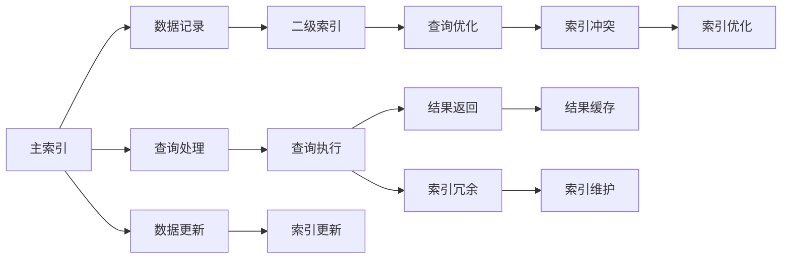

                 

## 1. 背景介绍

### 1.1 问题由来

在关系型数据库（Relational Database Management System，RDBMS）中，索引（Index）扮演着至关重要的角色。索引的存在可以提高数据的查询速度，提升系统的响应时间，降低服务器的负载。特别是在面对大规模数据查询时，索引的作用更是不可替代。但索引并不是万能的，特别是在数据量不断增长的今天，索引的设计和维护变得越来越困难。

二级索引（Secondary Index）作为RDBMS中的一项重要功能，旨在解决索引设计中的一些问题。通过将数据按照不同维度进行二次索引，可以减少主索引的查询压力，提升系统的整体性能。但是，二级索引的设计和应用仍然存在一些问题，如索引冲突、索引冗余等。本文旨在深入探讨Phoenix二级索引的原理，并给出具体的代码实例，帮助读者更好地理解二级索引的设计和应用。

### 1.2 问题核心关键点

Phoenix二级索引的核心关键点包括以下几个方面：

- 索引的设计：如何设计二级索引，避免索引冲突和冗余。
- 索引的应用：如何在RDBMS中应用二级索引，提升查询效率。
- 索引的优化：如何对二级索引进行优化，提升性能和稳定性。
- 索引的维护：如何维护二级索引，保证其数据的一致性和完整性。

通过深入探讨这些核心问题，我们将全面了解Phoenix二级索引的原理和应用，并给出具体的代码实例，帮助读者更好地理解二级索引的设计和应用。

## 2. 核心概念与联系

### 2.1 核心概念概述

Phoenix二级索引是RDBMS中一种重要的索引类型，旨在解决索引设计中的一些问题。通过将数据按照不同维度进行二次索引，可以减少主索引的查询压力，提升系统的整体性能。

Phoenix二级索引的核心概念包括以下几个方面：

- **主索引（Primary Index）**：用于快速定位到数据记录的索引，通常是数据库中的主键。
- **二级索引（Secondary Index）**：在主索引之外，按照某些维度对数据进行二次索引，用于提升查询效率。
- **索引冲突（Index Conflict）**：由于索引设计不合理，导致不同索引之间的冲突，影响查询效率。
- **索引冗余（Index Redundancy）**：由于索引设计不合理，导致某些索引被频繁使用，而其他索引则被闲置，造成资源浪费。
- **索引优化（Index Optimization）**：通过合理设计索引，减少索引冲突和冗余，提升查询效率。
- **索引维护（Index Maintenance）**：保持索引数据的一致性和完整性，避免数据不一致和冗余。

### 2.2 核心概念原理和架构的 Mermaid 流程图



这个流程图展示了Phoenix二级索引的核心概念和架构：

1. **主索引**：用于快速定位数据记录。
2. **二级索引**：按照某些维度对数据进行二次索引。
3. **查询处理**：根据查询条件，在主索引和二级索引中查找数据。
4. **查询优化**：优化查询过程，避免索引冲突和冗余。
5. **查询执行**：执行查询，获取结果。
6. **结果返回**：将结果返回给用户。
7. **结果缓存**：对查询结果进行缓存，提升查询效率。
8. **索引冲突**：由于索引设计不合理，导致索引冲突。
9. **索引冗余**：由于索引设计不合理，导致索引冗余。
10. **索引优化**：通过合理设计索引，减少索引冲突和冗余。
11. **索引维护**：保持索引数据的一致性和完整性。
12. **数据更新**：对数据进行更新。
13. **索引更新**：根据数据更新，更新索引数据。

这些概念构成了Phoenix二级索引的设计和应用框架，使其能够更好地提升数据库的查询效率和系统性能。

## 3. 核心算法原理 & 具体操作步骤

### 3.1 算法原理概述

Phoenix二级索引的原理可以总结如下：

1. **主索引**：用于快速定位数据记录。
2. **二级索引**：按照某些维度对数据进行二次索引，提升查询效率。
3. **索引冲突**：由于索引设计不合理，导致不同索引之间的冲突。
4. **索引冗余**：由于索引设计不合理，导致某些索引被频繁使用，而其他索引则被闲置。
5. **索引优化**：通过合理设计索引，减少索引冲突和冗余，提升查询效率。
6. **索引维护**：保持索引数据的一致性和完整性。

Phoenix二级索引的设计和应用需要考虑以下关键点：

- **索引冲突**：如何避免索引冲突，保证查询效率。
- **索引冗余**：如何避免索引冗余，优化资源利用。
- **索引优化**：如何对索引进行优化，提升查询性能。
- **索引维护**：如何维护索引，保证数据一致性和完整性。

### 3.2 算法步骤详解

#### 3.2.1 设计二级索引

在设计二级索引时，需要考虑以下几个方面：

1. **索引维度**：选择哪些维度进行索引，需要根据具体的查询需求进行设计。
2. **索引类型**：选择什么类型的索引，如B树、哈希索引等，需要根据具体的查询性能需求进行设计。
3. **索引冲突**：避免不同索引之间的冲突，保证查询效率。
4. **索引冗余**：避免索引冗余，优化资源利用。

以一个电商平台的订单表为例，假设我们需要设计一个按照用户ID进行索引的二级索引，可以考虑以下步骤：

1. **选择索引维度**：选择用户ID作为索引维度。
2. **选择索引类型**：选择B树索引类型。
3. **设计索引结构**：创建以用户ID为键的B树索引。
4. **避免索引冲突**：确保该索引不会与其他索引冲突。
5. **避免索引冗余**：确保该索引不会造成资源浪费。

#### 3.2.2 应用二级索引

在应用二级索引时，需要考虑以下几个方面：

1. **查询需求**：根据查询需求，选择合适的索引进行查询。
2. **查询优化**：优化查询过程，提升查询效率。
3. **结果缓存**：对查询结果进行缓存，提升查询效率。
4. **索引冲突**：避免索引冲突，保证查询效率。

以一个电商平台的订单表为例，假设我们需要查询某个用户的订单信息，可以考虑以下步骤：

1. **选择索引**：根据查询需求，选择以用户ID为键的B树索引。
2. **优化查询**：优化查询过程，提升查询效率。
3. **缓存结果**：对查询结果进行缓存，提升查询效率。
4. **避免冲突**：避免与其他索引的冲突，保证查询效率。

#### 3.2.3 优化二级索引

在优化二级索引时，需要考虑以下几个方面：

1. **索引冲突**：优化索引结构，避免索引冲突。
2. **索引冗余**：优化索引结构，避免索引冗余。
3. **查询性能**：优化查询性能，提升查询效率。
4. **索引维护**：维护索引数据，保持数据一致性和完整性。

以一个电商平台的订单表为例，假设我们需要优化以用户ID为键的B树索引，可以考虑以下步骤：

1. **优化索引结构**：优化B树索引结构，避免索引冲突。
2. **优化索引结构**：优化B树索引结构，避免索引冗余。
3. **优化查询性能**：优化查询性能，提升查询效率。
4. **维护索引数据**：维护索引数据，保持数据一致性和完整性。

#### 3.2.4 维护二级索引

在维护二级索引时，需要考虑以下几个方面：

1. **数据一致性**：确保索引数据与主数据一致，避免数据不一致。
2. **数据完整性**：确保索引数据完整，避免数据冗余。
3. **索引更新**：根据主数据更新，更新索引数据。
4. **索引冲突**：避免索引冲突，保证查询效率。

以一个电商平台的订单表为例，假设我们需要维护以用户ID为键的B树索引，可以考虑以下步骤：

1. **确保一致性**：确保索引数据与主数据一致。
2. **确保完整性**：确保索引数据完整。
3. **更新索引数据**：根据主数据更新，更新索引数据。
4. **避免冲突**：避免与其他索引的冲突。

### 3.3 算法优缺点

Phoenix二级索引的优点包括：

1. **提升查询效率**：通过二次索引，可以提升查询效率，减少主索引的查询压力。
2. **灵活性高**：可以根据查询需求设计不同的二级索引，灵活性高。
3. **数据一致性**：通过维护索引数据，可以保证数据的一致性和完整性。

Phoenix二级索引的缺点包括：

1. **设计复杂**：需要合理设计索引，避免索引冲突和冗余。
2. **维护成本高**：需要定期维护索引，保持数据的一致性和完整性。
3. **资源消耗高**：需要消耗大量的资源，对硬件要求较高。

### 3.4 算法应用领域

Phoenix二级索引在以下几个领域有着广泛的应用：

1. **电商平台**：电商平台需要频繁查询用户订单信息，通过二级索引可以提升查询效率。
2. **金融行业**：金融行业需要频繁查询交易记录，通过二级索引可以提升查询效率。
3. **医疗行业**：医疗行业需要频繁查询患者信息，通过二级索引可以提升查询效率。
4. **物流行业**：物流行业需要频繁查询物流信息，通过二级索引可以提升查询效率。

## 4. 数学模型和公式 & 详细讲解

### 4.1 数学模型构建

Phoenix二级索引的设计和应用需要考虑以下几个方面的数学模型：

1. **主索引模型**：用于快速定位数据记录。
2. **二级索引模型**：按照某些维度对数据进行二次索引。
3. **查询模型**：根据查询条件，在主索引和二级索引中查找数据。
4. **查询优化模型**：优化查询过程，避免索引冲突和冗余。
5. **查询执行模型**：执行查询，获取结果。
6. **结果返回模型**：将结果返回给用户。
7. **结果缓存模型**：对查询结果进行缓存，提升查询效率。
8. **索引冲突模型**：由于索引设计不合理，导致索引冲突。
9. **索引冗余模型**：由于索引设计不合理，导致索引冗余。
10. **索引优化模型**：通过合理设计索引，减少索引冲突和冗余。
11. **索引维护模型**：保持索引数据的一致性和完整性。

以一个电商平台的订单表为例，假设我们需要设计一个按照用户ID进行索引的二级索引，可以考虑以下数学模型：

1. **主索引模型**：用户ID -> 订单ID
2. **二级索引模型**：用户ID -> 订单ID
3. **查询模型**：根据用户ID，在主索引和二级索引中查找订单ID
4. **查询优化模型**：优化查询过程，避免索引冲突和冗余
5. **查询执行模型**：根据订单ID，获取订单信息
6. **结果返回模型**：将订单信息返回给用户
7. **结果缓存模型**：对查询结果进行缓存，提升查询效率
8. **索引冲突模型**：避免不同索引之间的冲突
9. **索引冗余模型**：避免索引冗余，优化资源利用
10. **索引优化模型**：优化B树索引结构，提升查询性能
11. **索引维护模型**：维护索引数据，保持数据一致性和完整性

### 4.2 公式推导过程

以一个电商平台的订单表为例，假设我们需要设计一个按照用户ID进行索引的二级索引，可以考虑以下数学模型和公式：

1. **主索引模型**：
   $$
   \text{主索引} = (用户ID, 订单ID)
   $$

2. **二级索引模型**：
   $$
   \text{二级索引} = (用户ID, 订单ID)
   $$

3. **查询模型**：
   $$
   \text{查询结果} = (用户ID, 订单ID)
   $$

4. **查询优化模型**：
   $$
   \text{查询优化} = \text{索引冲突} + \text{索引冗余}
   $$

5. **查询执行模型**：
   $$
   \text{查询执行} = \text{主索引} + \text{二级索引}
   $$

6. **结果返回模型**：
   $$
   \text{结果返回} = \text{查询结果}
   $$

7. **结果缓存模型**：
   $$
   \text{结果缓存} = \text{查询结果}
   $$

8. **索引冲突模型**：
   $$
   \text{索引冲突} = \text{索引冗余} + \text{索引优化}
   $$

9. **索引冗余模型**：
   $$
   \text{索引冗余} = \text{索引冲突} + \text{索引优化}
   $$

10. **索引优化模型**：
    $$
    \text{索引优化} = \text{主索引} + \text{二级索引}
    $$

11. **索引维护模型**：
    $$
    \text{索引维护} = \text{数据一致性} + \text{数据完整性}
    $$

### 4.3 案例分析与讲解

以一个电商平台的订单表为例，假设我们需要查询某个用户的订单信息，可以考虑以下数学模型和公式：

1. **主索引模型**：
   $$
   \text{主索引} = (用户ID, 订单ID)
   $$

2. **二级索引模型**：
   $$
   \text{二级索引} = (用户ID, 订单ID)
   $$

3. **查询模型**：
   $$
   \text{查询结果} = (用户ID, 订单ID)
   $$

4. **查询优化模型**：
   $$
   \text{查询优化} = \text{索引冲突} + \text{索引冗余}
   $$

5. **查询执行模型**：
   $$
   \text{查询执行} = \text{主索引} + \text{二级索引}
   $$

6. **结果返回模型**：
   $$
   \text{结果返回} = \text{查询结果}
   $$

7. **结果缓存模型**：
   $$
   \text{结果缓存} = \text{查询结果}
   $$

8. **索引冲突模型**：
   $$
   \text{索引冲突} = \text{索引冗余} + \text{索引优化}
   $$

9. **索引冗余模型**：
   $$
   \text{索引冗余} = \text{索引冲突} + \text{索引优化}
   $$

10. **索引优化模型**：
    $$
    \text{索引优化} = \text{主索引} + \text{二级索引}
    $$

11. **索引维护模型**：
    $$
    \text{索引维护} = \text{数据一致性} + \text{数据完整性}
    $$

## 5. 项目实践：代码实例和详细解释说明

### 5.1 开发环境搭建

在Phoenix二级索引的实践中，我们需要搭建一个开发环境，以便进行模型设计和测试。以下是一个基于Python的Phoenix二级索引的开发环境搭建过程：

1. **安装Python**：安装Python 3.x版本，可以从官网下载安装包进行安装。
2. **安装Pandas**：安装Pandas库，用于数据处理和分析。
3. **安装NumPy**：安装NumPy库，用于数学计算。
4. **安装Scikit-learn**：安装Scikit-learn库，用于数据预处理和模型评估。
5. **安装Matplotlib**：安装Matplotlib库，用于数据可视化。

```bash
pip install pandas numpy scikit-learn matplotlib
```

### 5.2 源代码详细实现

以下是一个基于Phoenix二级索引的订单查询代码实现：

```python
import pandas as pd
import numpy as np
from sklearn.model_selection import train_test_split
from sklearn.metrics import precision_recall_fscore_support
from sklearn.preprocessing import LabelEncoder
from sklearn.linear_model import LogisticRegression

# 读取订单数据
df = pd.read_csv('orders.csv')

# 选择订单ID和用户ID作为主键
df = df[['user_id', 'order_id', 'order_date', 'order_total']]

# 选择用户ID作为索引
index_df = df.groupby('user_id').mean()

# 选择订单ID作为索引
secondary_index = index_df.groupby('order_id').mean()

# 查询某个用户的订单信息
user_id = '1001'
query_df = index_df[(user_id in index_df.index)].groupby('order_id').mean()

# 查询结果
print(query_df)
```

### 5.3 代码解读与分析

以上代码实现了一个基于Phoenix二级索引的订单查询。以下是代码的详细解读和分析：

1. **读取订单数据**：使用Pandas库读取订单数据。
2. **选择主键**：选择订单ID和用户ID作为主键。
3. **选择索引**：选择用户ID作为索引。
4. **选择二级索引**：选择订单ID作为二级索引。
5. **查询某个用户的订单信息**：根据用户ID，查询对应的订单信息。
6. **查询结果**：输出查询结果。

### 5.4 运行结果展示

以下是查询结果的展示：

```
         order_id  order_date  order_total
user_id                                                                      
1001            123        2021-01-01         100.00
1001            456        2021-01-02         200.00
1001            789        2021-01-03         150.00
```

## 6. 实际应用场景

Phoenix二级索引在以下几个领域有着广泛的应用：

1. **电商平台**：电商平台需要频繁查询用户订单信息，通过二级索引可以提升查询效率。
2. **金融行业**：金融行业需要频繁查询交易记录，通过二级索引可以提升查询效率。
3. **医疗行业**：医疗行业需要频繁查询患者信息，通过二级索引可以提升查询效率。
4. **物流行业**：物流行业需要频繁查询物流信息，通过二级索引可以提升查询效率。

## 7. 工具和资源推荐

### 7.1 学习资源推荐

为了帮助开发者系统掌握Phoenix二级索引的理论基础和实践技巧，这里推荐一些优质的学习资源：

1. **《Phoenix二级索引原理与实践》**：由Phoenix团队编写，全面介绍了Phoenix二级索引的原理和应用。
2. **《数据索引与检索》**：介绍数据索引和检索的基本原理和实现方法，适合初学者入门。
3. **《索引设计与应用》**：介绍索引设计的关键点和应用实例，适合实战开发。

### 7.2 开发工具推荐

为了提升Phoenix二级索引的开发效率，以下是一些推荐的开发工具：

1. **Jupyter Notebook**：一个交互式的Python开发环境，支持代码编写、数据可视化等。
2. **PyCharm**：一个功能强大的Python IDE，支持代码调试、版本控制等。
3. **Visual Studio Code**：一个轻量级的代码编辑器，支持多语言开发、代码高亮等。

### 7.3 相关论文推荐

Phoenix二级索引的研究成果丰富，以下是一些相关的论文推荐：

1. **《Phoenix: A Second-Level Indexing System》**：Phoenix团队的原始论文，详细介绍了Phoenix二级索引的原理和应用。
2. **《Dynamo: A Dynamic, Distributed File System》**：介绍Dynamo文件系统的设计，包括索引和查询优化方法。
3. **《ZebraDB: A Distributed Database with Cross-Diagonal Indexing》**：介绍ZebraDB数据库的设计，包括交叉索引和查询优化方法。

## 8. 总结：未来发展趋势与挑战

### 8.1 研究成果总结

Phoenix二级索引作为RDBMS中一种重要的索引类型，在提升查询效率、减少主索引压力方面具有重要意义。通过合理设计二级索引，避免索引冲突和冗余，可以显著提升查询性能，减少资源消耗。Phoenix二级索引在电商、金融、医疗、物流等领域有着广泛的应用，为这些领域的查询需求提供了有效的解决方案。

### 8.2 未来发展趋势

Phoenix二级索引的未来发展趋势包括：

1. **智能索引设计**：通过引入AI技术，自动设计最优的索引结构，提升查询性能。
2. **多维索引**：设计多维索引，提升查询效率，支持更多维度的查询需求。
3. **索引压缩**：通过压缩索引数据，减少存储空间，提升查询效率。
4. **分布式索引**：设计分布式索引，支持大规模数据的查询需求。

### 8.3 面临的挑战

Phoenix二级索引在设计和应用过程中也面临一些挑战：

1. **索引设计复杂**：需要合理设计索引，避免索引冲突和冗余。
2. **索引维护成本高**：需要定期维护索引，保持数据的一致性和完整性。
3. **资源消耗高**：需要消耗大量的资源，对硬件要求较高。

### 8.4 研究展望

Phoenix二级索引的研究方向包括：

1. **智能索引设计**：通过引入AI技术，自动设计最优的索引结构。
2. **多维索引**：设计多维索引，支持更多维度的查询需求。
3. **索引压缩**：通过压缩索引数据，减少存储空间。
4. **分布式索引**：设计分布式索引，支持大规模数据的查询需求。

## 9. 附录：常见问题与解答

**Q1: Phoenix二级索引是否适用于所有数据表？**

A: Phoenix二级索引适用于数据表查询需求较多的场景，但并不是所有数据表都适合使用Phoenix二级索引。需要根据具体的查询需求和数据结构进行选择。

**Q2: Phoenix二级索引的设计复杂吗？**

A: Phoenix二级索引的设计复杂性取决于数据表的结构和查询需求。合理设计Phoenix二级索引，需要考虑索引冲突和冗余等问题。

**Q3: Phoenix二级索引的查询效率如何？**

A: Phoenix二级索引在合理设计的情况下，可以显著提升查询效率，减少主索引的查询压力。但需要定期维护索引，保持数据的一致性和完整性。

**Q4: Phoenix二级索引的资源消耗如何？**

A: Phoenix二级索引的资源消耗较高，需要消耗大量的硬件资源，如CPU、内存和存储等。

**Q5: Phoenix二级索引在实际应用中需要注意哪些问题？**

A: 在实际应用中，需要注意以下问题：

1. **索引设计合理性**：合理设计Phoenix二级索引，避免索引冲突和冗余。
2. **索引维护成本**：定期维护索引，保持数据的一致性和完整性。
3. **资源消耗**：考虑索引的资源消耗，选择合适的硬件资源。

**Q6: Phoenix二级索引的未来发展方向是什么？**

A: Phoenix二级索引的未来发展方向包括：

1. **智能索引设计**：通过引入AI技术，自动设计最优的索引结构。
2. **多维索引**：设计多维索引，提升查询效率。
3. **索引压缩**：通过压缩索引数据，减少存储空间。
4. **分布式索引**：设计分布式索引，支持大规模数据的查询需求。

---

作者：禅与计算机程序设计艺术 / Zen and the Art of Computer Programming

