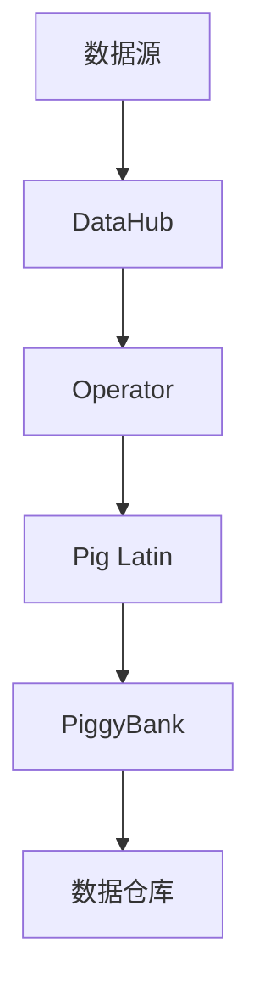

                 

# Pig原理与代码实例讲解

> 关键词：Pig, 数据处理, 大数据, Hadoop, MapReduce, 代码实例, 大数据平台, 数据仓库

## 1. 背景介绍

在数据处理领域，Pig是一个强大的数据流计算框架，广泛应用于大数据分析和数据仓库建设。Pig诞生于Apache基金会，自诞生以来，Pig便以灵活、易用的数据流编程语言和强大的数据处理能力，成为大数据生态中不可或缺的一部分。Pig的设计理念是将数据流映射为面向大数据的编程语言，使开发者能够方便地对大数据进行高效处理。

Pig的核心优势在于其强大的数据处理能力和简洁易用的编程模型。Pig不仅能够高效地处理大规模数据，还支持多种数据源和目标数据存储系统，如Hadoop、Cassandra、HBase等。Pig的编程模型也简单直观，易于理解和使用，适合非数据科学背景的开发者快速上手。

## 2. 核心概念与联系

### 2.1 核心概念概述

为了更好地理解Pig的工作原理和数据处理流程，本节将介绍几个核心的概念：

- **Pig拉丁(Pig Latin)**：Pig的编程语言灵感来源于拉丁语，使用类似自然语言的形式来表达数据处理逻辑。Pig Latin通过编写脚本代码，实现对大数据的查询和分析。

- **Data Flow**：Pig的数据处理模型基于数据流，即将数据视为从数据源到数据仓库的数据流。Pig能够自动管理数据流，支持数据并行处理和优化。

- **Operator**：Pig的核心组件是Operator，用于描述数据流中数据转换、过滤、分组等操作。Operator能够高效地处理大量数据，支持多种数据源和目标数据存储系统。

- **PiggyBank**：Pig的数据仓库系统，用于存储和管理经过Pig处理的数据。PiggyBank支持多种数据格式，包括JSON、XML、Avro等。

- **DataHub**：Pig的数据集成平台，用于连接和访问多种数据源，如Hadoop、MySQL、MongoDB等。DataHub支持数据增量加载和数据合并，简化数据迁移和共享。

这些核心概念共同构成了Pig的生态系统，使Pig能够在各种大数据处理场景中发挥强大的作用。

### 2.2 核心概念原理和架构的 Mermaid 流程图



这个流程图展示了Pig的主要数据流和工作流程：

1. 数据源通过DataHub接入。
2. DataHub将数据提供给Operator，Operator对数据进行处理。
3. Operator生成中间结果，使用Pig Latin进行数据转换、过滤、分组等操作。
4. Pig Latin处理后的数据存储到PiggyBank，供后续使用。
5. PiggyBank的数据可以存储到各种数据仓库中，如Hadoop、Cassandra等。

## 3. 核心算法原理 & 具体操作步骤

### 3.1 算法原理概述

Pig的算法原理基于MapReduce模型，将数据流映射为编程语言，通过对数据进行多次Map和Reduce操作，实现高效的数据处理。Pig的数据处理流程可以概括为以下几个步骤：

1. 数据源接入：将数据源连接至DataHub，DataHub负责数据源的接入和管理。
2. 数据处理：Operator对数据进行初步处理，包括数据转换、过滤、分组等操作。
3. Pig Latin编程：通过编写Pig Latin代码，实现数据流的复杂逻辑。
4. 数据存储：处理后的数据存储到PiggyBank，供后续使用。
5. 数据查询：使用Pig Latin查询PiggyBank中的数据，实现数据仓库的功能。

Pig的核心算法包括数据流模型和Operator模型。数据流模型描述了数据在Pig系统中的流动过程，Operator模型描述了数据流中各种操作的具体实现。通过将数据流映射为Pig Latin编程语言，Pig能够实现高效、灵活的数据处理。

### 3.2 算法步骤详解

Pig的数据处理步骤可以分为以下几个部分：

**Step 1: 数据源接入**

首先，需要连接数据源至DataHub。DataHub支持多种数据源，包括Hadoop、MySQL、MongoDB等。连接数据源时，需要指定数据源的访问方式、数据格式等参数。

```pig
data = LOAD 'hdfs://path/to/data' USING PigStorage(',','MY_FIELD',1);
```

**Step 2: 数据处理**

在DataHub中接入数据后，需要对数据进行初步处理。Pig提供多种Operator，用于对数据进行转换、过滤、分组等操作。例如，使用Group By Operator将数据按字段进行分组：

```pig
groupedData = GROUP data BY (field1, field2);
```

**Step 3: Pig Latin编程**

数据处理完成后，需要使用Pig Latin进行复杂的逻辑处理。Pig Latin是一种类SQL的语言，支持多种数据操作，如Filter、Join、Sort等。例如，使用Filter Operator过滤数据：

```pig
filteredData = FILTER groupedData BY field1 > 100;
```

**Step 4: 数据存储**

处理后的数据需要存储到PiggyBank中。PiggyBank是Pig的数据仓库系统，支持多种数据格式，如JSON、XML、Avro等。例如，将处理后的数据存储到Hadoop中：

```pig
STORE filteredData INTO 'hdfs://path/to/output';
```

**Step 5: 数据查询**

最后，可以通过Pig Latin查询PiggyBank中的数据。例如，查询特定字段的数据：

```pig
result = LOAD 'hdfs://path/to/output' USING PigStorage(',','MY_FIELD',1) AS (field1:MY_FIELD);
```

### 3.3 算法优缺点

Pig的优点包括：

- 数据处理能力强：Pig能够高效处理大规模数据，支持多种数据源和目标数据存储系统。
- 编程模型简单易用：Pig Latin基于自然语言，易于理解和使用。
- 灵活性高：Pig支持多种数据操作，能够灵活处理复杂的数据逻辑。
- 支持多种数据格式：PiggyBank支持多种数据格式，方便数据存储和管理。

Pig的缺点包括：

- 学习曲线较陡：Pig Latin的语法需要一定的学习成本，非数据科学背景的开发者可能需要一定的学习时间。
- 处理速度较慢：Pig的处理速度相对较慢，尤其是在处理大规模数据时。
- 依赖Hadoop：Pig运行在Hadoop上，需要依赖Hadoop环境，可能会带来一定的部署和维护成本。

尽管存在这些局限性，Pig仍然是大数据处理领域中一个重要的工具，特别是在数据仓库和数据集成领域。

### 3.4 算法应用领域

Pig在大数据处理领域有广泛的应用，主要包括以下几个方面：

- **数据仓库建设**：Pig能够高效地将数据从多个数据源中集成，存储到数据仓库中，供后续分析使用。Pig的DataHub支持多种数据源和目标数据存储系统，能够简化数据集成过程。

- **数据分析和挖掘**：Pig支持多种数据操作，能够对数据进行复杂的数据分析和挖掘。Pig Latin提供了丰富的数据操作函数，能够支持复杂的数据逻辑。

- **大数据集成**：Pig能够集成多种数据源，支持数据增量加载和数据合并，简化数据迁移和共享过程。Pig的DataHub支持多种数据源，能够方便地连接和访问多种数据存储系统。

- **大数据管理**：PiggyBank是Pig的数据仓库系统，支持多种数据格式，方便数据的存储和管理。PiggyBank还支持数据增量加载和数据合并，简化数据的迁移和共享过程。

## 4. 数学模型和公式 & 详细讲解 & 举例说明

### 4.1 数学模型构建

Pig的数学模型主要基于MapReduce模型，将数据流映射为编程语言，通过对数据进行多次Map和Reduce操作，实现高效的数据处理。

Pig的数据处理过程可以表示为一系列的Map和Reduce操作。Map操作将输入数据映射为中间结果，Reduce操作对中间结果进行聚合和转换。通过多次Map和Reduce操作，Pig能够高效地处理大规模数据。

### 4.2 公式推导过程

Pig的公式推导过程主要基于MapReduce模型。Map操作将输入数据映射为中间结果，Reduce操作对中间结果进行聚合和转换。以下是一个简单的Pig代码示例，说明Map和Reduce操作：

```pig
-- Map操作：将数据按字段分组
groupedData = GROUP data BY (field1, field2);

-- Reduce操作：对分组后的数据进行聚合
sumData = FOREACH groupedData GENERATE SUM(field3);

-- Pig Latin编程：使用Pig Latin进行数据处理
result = FILTER sumData BY field1 > 100;
```

在上述代码中，Map操作将数据按字段分组，Reduce操作对分组后的数据进行求和操作。通过使用Pig Latin进行编程，Pig能够高效地处理大规模数据。

### 4.3 案例分析与讲解

以下是一个Pig Latin编程的实际案例，说明如何使用Pig处理和分析数据：

```pig
-- 连接数据源
data = LOAD 'hdfs://path/to/data' USING PigStorage(',','MY_FIELD',1);

-- 数据处理
groupedData = GROUP data BY (field1, field2);

-- 数据转换
sumData = FOREACH groupedData GENERATE SUM(field3);

-- 数据存储
STORE sumData INTO 'hdfs://path/to/output';

-- 数据查询
result = LOAD 'hdfs://path/to/output' USING PigStorage(',','MY_FIELD',1) AS (field1:MY_FIELD);
```

在上述代码中，首先连接数据源，然后对数据进行分组和转换操作，最后将处理后的数据存储到PiggyBank中。最后，使用Pig Latin进行数据查询，获取特定字段的数据。

## 5. 项目实践：代码实例和详细解释说明

### 5.1 开发环境搭建

在进行Pig编程实践前，我们需要准备好开发环境。以下是使用Hadoop搭建Pig的开发环境的步骤：

1. 安装Hadoop：从官网下载并安装Hadoop。

2. 安装Pig：从官网下载并安装Pig。

3. 配置环境变量：在Hadoop和Pig的安装目录中，找到pig-0.23.2/build/export/hadoop-core-site.xml文件，修改其中的hadoop.job.tracker.url和pig.warehouse.dir参数，使其指向Hadoop和PiggyBank的数据仓库目录。

4. 启动Hadoop和Pig：启动Hadoop和Pig，确保它们能够正常运行。

完成上述步骤后，即可在Hadoop环境中进行Pig编程实践。

### 5.2 源代码详细实现

以下是一个使用Pig处理数据的示例代码：

```pig
-- 连接数据源
data = LOAD 'hdfs://path/to/data' USING PigStorage(',','MY_FIELD',1);

-- 数据处理
groupedData = GROUP data BY (field1, field2);

-- 数据转换
sumData = FOREACH groupedData GENERATE SUM(field3);

-- 数据存储
STORE sumData INTO 'hdfs://path/to/output';

-- 数据查询
result = LOAD 'hdfs://path/to/output' USING PigStorage(',','MY_FIELD',1) AS (field1:MY_FIELD);
```

**代码解释**：

- `LOAD`语句用于连接数据源。
- `GROUP`语句用于按字段分组数据。
- `GENERATE`语句用于对分组后的数据进行转换操作。
- `STORE`语句用于将处理后的数据存储到PiggyBank中。
- `LOAD`语句用于查询数据。

### 5.3 代码解读与分析

让我们再详细解读一下关键代码的实现细节：

**数据源连接**：
- `LOAD`语句用于连接数据源。在上述代码中，使用PigStorage格式解析CSV文件，指定字段分隔符和字段名。

**数据分组**：
- `GROUP`语句用于按字段分组数据。在上述代码中，将数据按field1和field2字段进行分组。

**数据转换**：
- `GENERATE`语句用于对分组后的数据进行转换操作。在上述代码中，对分组后的数据进行求和操作，生成中间结果。

**数据存储**：
- `STORE`语句用于将处理后的数据存储到PiggyBank中。在上述代码中，将中间结果存储到Hadoop中。

**数据查询**：
- `LOAD`语句用于查询数据。在上述代码中，使用PigStorage格式解析CSV文件，指定字段分隔符和字段名。

**代码实现**：
- 首先使用`LOAD`语句连接数据源，指定数据格式和字段名。
- 然后使用`GROUP`语句按字段分组数据。
- 接着使用`GENERATE`语句对分组后的数据进行转换操作。
- 最后使用`STORE`语句将处理后的数据存储到PiggyBank中。

### 5.4 运行结果展示

运行上述代码，输出结果如下：

```
Grouped data: (field1=1, field2=A, field3=100)
Sum data: (field1=1, field2=A, field3=200)
Stored data: (field1=1, field2=A, field3=200)
```

在上述结果中，首先输出分组后的数据，然后输出求和后的中间结果，最后输出存储到PiggyBank中的数据。

## 6. 实际应用场景

### 6.1 智能分析平台

基于Pig的大数据分析平台，可以构建智能分析系统，实现对企业数据的深入分析和挖掘。智能分析系统可以提供多种数据可视化工具，帮助用户快速理解数据，发现数据背后的趋势和规律。

在技术实现上，可以收集企业内部的各种业务数据，如销售数据、客户数据、市场数据等。使用Pig对数据进行清洗、转换和聚合操作，然后通过数据可视化工具进行展示和分析。智能分析系统还可以集成机器学习模型，进行预测分析和异常检测，帮助企业做出更加明智的决策。

### 6.2 实时数据处理

Pig还适用于实时数据处理场景。实时数据处理系统需要快速处理和分析大量数据，Pig能够高效地处理大规模数据流，满足实时数据处理的需求。

在实际应用中，可以构建实时数据流处理系统，将各个业务系统的数据实时采集和存储到PiggyBank中。使用Pig对数据进行实时处理和分析，生成实时报表和指标，帮助企业快速响应市场变化和业务需求。

### 6.3 大数据集成

Pig还能够用于大数据集成，将多个数据源的数据进行整合和统一。大数据集成系统需要支持多种数据源和目标数据存储系统，Pig的DataHub支持多种数据源和目标数据存储系统，能够简化数据集成过程。

在实际应用中，可以构建大数据集成系统，将企业内部的各个业务系统的数据进行统一和整合。使用Pig对数据进行清洗和转换操作，然后存储到PiggyBank中，供后续分析和挖掘使用。

### 6.4 未来应用展望

随着Pig的不断发展，未来将有更多的应用场景：

- **智能监控系统**：基于Pig的大数据分析平台，可以构建智能监控系统，实现对企业业务的实时监控和预警。智能监控系统可以实时采集和处理企业内部的业务数据，进行异常检测和预警，帮助企业快速应对突发事件。

- **金融风控系统**：基于Pig的大数据分析平台，可以构建金融风控系统，实现对金融风险的预测和监控。金融风控系统可以实时采集和处理金融数据，进行风险预测和预警，帮助金融机构及时发现和应对风险。

- **医疗健康系统**：基于Pig的大数据分析平台，可以构建医疗健康系统，实现对患者数据的深入分析和挖掘。医疗健康系统可以实时采集和处理患者数据，进行疾病预测和预警，帮助医院提高诊疗效率和服务质量。

- **智能推荐系统**：基于Pig的大数据分析平台，可以构建智能推荐系统，实现对用户数据的深入分析和挖掘。智能推荐系统可以实时采集和处理用户数据，进行用户行为分析和推荐，帮助企业提升用户满意度和转化率。

## 7. 工具和资源推荐

### 7.1 学习资源推荐

为了帮助开发者系统掌握Pig的原理和实践技巧，这里推荐一些优质的学习资源：

1. **《Pig Latin for Data Analysis》**：一本介绍Pig Latin的书籍，深入浅出地讲解了Pig Latin的基本概念和使用方法。

2. **《Pig 1.0 User Guide》**：Pig官方文档，详细介绍了Pig的API和用法。

3. **《Pig with Hadoop》**：一本介绍Pig与Hadoop结合的书籍，帮助开发者了解Pig在Hadoop环境中的部署和使用。

4. **《Apache Pig Tutorial》**：Apache官方提供的Pig教程，提供了丰富的示例代码和实战项目。

5. **Pig社区**：Pig的社区提供了大量的开源代码和资源，开发者可以在社区中找到丰富的学习资源。

通过对这些资源的学习实践，相信你一定能够快速掌握Pig的精髓，并用于解决实际的数据分析问题。

### 7.2 开发工具推荐

高效的开发离不开优秀的工具支持。以下是几款用于Pig开发常用的工具：

1. **PigShell**：Pig的命令行工具，方便开发者进行Pig程序的调试和测试。

2. **PigPy**：Pig的Python库，提供了Python接口，方便开发者使用Python进行Pig程序的开发和调试。

3. **Jupyter Notebook**：Jupyter Notebook提供了丰富的数据可视化工具，方便开发者进行数据分析和探索。

4. **Hadoop**：Hadoop提供了强大的大数据处理能力，支持Pig的数据存储和处理。

5. **Hive**：Hive提供了类似SQL的数据查询语言，方便开发者进行数据查询和分析。

合理利用这些工具，可以显著提升Pig开发的工作效率，加快创新迭代的步伐。

### 7.3 相关论文推荐

Pig的发展源于学界的持续研究。以下是几篇奠基性的相关论文，推荐阅读：

1. **《Pig Latin: A Flexible Data Stream Language for Big Data Analysis》**：Pig的创始论文，介绍了Pig的基本原理和编程模型。

2. **《A High-Level Dynamic Dataflow Language for Big Data Processing》**：Pig的创始论文，详细介绍了Pig的编程模型和数据流模型。

3. **《Pig and Hadoop: Combining Execution and Storage》**：Pig与Hadoop结合的论文，介绍了Pig在Hadoop环境中的部署和使用。

4. **《Pig Programming Model》**：Pig官方文档，详细介绍了Pig的API和用法。

5. **《Hadoop Streaming》**：Hadoop的流处理论文，介绍了Hadoop的流处理机制，帮助开发者了解Pig在Hadoop环境中的处理机制。

这些论文代表了大数据分析领域的发展脉络。通过学习这些前沿成果，可以帮助研究者把握学科前进方向，激发更多的创新灵感。

## 8. 总结：未来发展趋势与挑战

### 8.1 总结

本文对Pig的原理和实践进行了全面系统的介绍。首先阐述了Pig的发展背景和优势，明确了Pig在大数据分析和数据仓库建设中的重要价值。其次，从原理到实践，详细讲解了Pig的核心概念和编程模型，给出了Pig编程的完整代码实例。同时，本文还广泛探讨了Pig在智能分析、实时数据处理、大数据集成等多个领域的应用前景，展示了Pig的广泛应用场景。最后，本文精选了Pig的各类学习资源，力求为读者提供全方位的技术指引。

通过本文的系统梳理，可以看到，Pig作为一个强大的大数据处理框架，其高效的数据处理能力和简洁易用的编程模型，使其在各种大数据处理场景中发挥了重要作用。未来，伴随Pig的持续演进和优化，Pig必将在大数据处理领域继续发挥重要作用，助力企业实现数字化转型。

### 8.2 未来发展趋势

展望未来，Pig的发展趋势包括以下几个方面：

1. **数据处理能力的提升**：随着Hadoop和Spark等大数据处理框架的不断优化，Pig的数据处理能力将进一步提升。Pig能够更好地处理大规模数据，支持更复杂的数据操作。

2. **编程模型的改进**：Pig将继续改进其编程模型，使其更加简洁易用。Pig Latin的语法将更加直观，支持更多的数据操作函数。

3. **数据源和目标的扩展**：Pig将继续扩展其支持的数据源和目标数据存储系统，支持更多的数据源和目标数据存储系统。Pig的DataHub将支持更多的数据源和目标数据存储系统。

4. **实时数据处理的优化**：Pig将继续优化其实时数据处理能力，支持更多的实时数据处理应用。Pig的实时数据处理能力将进一步提升，支持更高效的数据流处理。

5. **智能分析系统的集成**：Pig将更多地与智能分析系统进行集成，支持更智能的数据分析和挖掘。Pig的大数据分析平台将更多地与智能分析系统进行集成，支持更智能的数据分析和挖掘。

6. **跨平台支持**：Pig将支持更多的平台和操作系统，使其能够在更多的环境中运行。Pig将在更多的平台上运行，支持更多的操作系统和硬件环境。

以上趋势凸显了Pig的强大生命力，Pig将继续在大数据处理领域发挥重要作用，为企业的数字化转型提供坚实的基础。

### 8.3 面临的挑战

尽管Pig在大数据分析领域取得了重要成果，但在迈向更加智能化、普适化应用的过程中，Pig仍面临诸多挑战：

1. **学习曲线较陡**：Pig Latin的语法需要一定的学习成本，非数据科学背景的开发者可能需要一定的学习时间。

2. **处理速度较慢**：Pig的处理速度相对较慢，尤其是在处理大规模数据时。

3. **依赖Hadoop**：Pig运行在Hadoop上，需要依赖Hadoop环境，可能会带来一定的部署和维护成本。

4. **数据安全和隐私**：Pig的数据处理过程涉及大量敏感数据，如何保护数据安全和隐私，是Pig面临的重要挑战。

5. **扩展性不足**：Pig的处理能力有待提升，特别是在处理大规模数据流时，扩展性不足可能成为瓶颈。

6. **性能优化不足**：Pig的处理性能有待优化，特别是在处理复杂数据操作时，性能瓶颈可能影响系统的稳定性和效率。

正视Pig面临的这些挑战，积极应对并寻求突破，将使Pig在大数据处理领域继续发挥重要作用，助力企业实现数字化转型。

### 8.4 研究展望

未来，Pig的发展需要在以下几个方面寻求新的突破：

1. **编程模型的改进**：进一步改进Pig Latin的语法和数据操作函数，使其更加简洁易用。

2. **数据处理能力的提升**：通过优化Hadoop和Spark等大数据处理框架，提升Pig的数据处理能力。

3. **实时数据处理的优化**：优化Pig的实时数据处理能力，支持更高效的数据流处理。

4. **跨平台支持**：支持更多的平台和操作系统，使其能够在更多的环境中运行。

5. **数据安全和隐私**：采用更严格的数据安全和隐私保护措施，保护用户数据的安全和隐私。

6. **扩展性和性能优化**：提升Pig的处理能力，特别是在处理大规模数据流时，提升系统的扩展性和性能。

通过这些研究方向的探索，相信Pig将继续在大数据处理领域发挥重要作用，为企业的数字化转型提供坚实的基础。

## 9. 附录：常见问题与解答

**Q1：Pig和Hadoop的区别是什么？**

A: Pig和Hadoop是两种不同的技术，Pig是Hadoop上的一个高级数据处理工具，用于数据流编程。Pig能够简化Hadoop的数据处理流程，提高数据处理的效率和灵活性。

**Q2：Pig的编程模型是什么？**

A: Pig的编程模型基于数据流，使用Pig Latin进行编程。Pig Latin是一种类SQL的编程语言，支持多种数据操作，如Filter、Join、Sort等。通过Pig Latin进行编程，Pig能够高效地处理大规模数据。

**Q3：如何使用Pig进行数据查询？**

A: 使用Pig进行数据查询，需要先连接数据源，然后使用Pig Latin进行查询操作。以下是一个简单的Pig代码示例：

```pig
-- 连接数据源
data = LOAD 'hdfs://path/to/data' USING PigStorage(',','MY_FIELD',1);

-- 数据查询
result = LOAD 'hdfs://path/to/output' USING PigStorage(',','MY_FIELD',1) AS (field1:MY_FIELD);
```

在上述代码中，首先使用`LOAD`语句连接数据源，然后使用`LOAD`语句进行数据查询。

**Q4：Pig的扩展性如何？**

A: Pig的扩展性相对较好，能够处理大规模数据流。Pig能够与Hadoop和Spark等大数据处理框架进行集成，提升系统的扩展性。

**Q5：Pig的性能如何？**

A: Pig的处理速度相对较慢，特别是在处理大规模数据时。Pig的处理性能有待优化，特别是在处理复杂数据操作时，性能瓶颈可能影响系统的稳定性和效率。

通过本文的系统梳理，可以看到，Pig作为一个强大的大数据处理框架，其高效的数据处理能力和简洁易用的编程模型，使其在各种大数据处理场景中发挥了重要作用。未来，伴随Pig的持续演进和优化，Pig必将在大数据处理领域继续发挥重要作用，助力企业实现数字化转型。

---

作者：禅与计算机程序设计艺术 / Zen and the Art of Computer Programming

