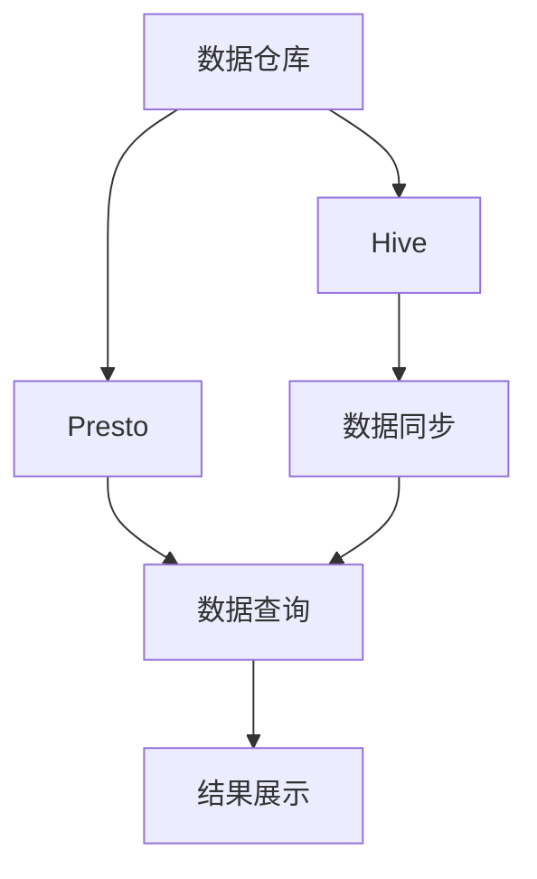

                 

# Presto-Hive整合原理与代码实例讲解

> 关键词：Presto, Hive, 数据仓库, 数据查询, 分布式处理, 代码实例, 性能优化

## 1. 背景介绍

### 1.1 问题由来
随着数据量的爆炸式增长，传统的关系型数据库已无法满足日益增长的数据处理需求。针对大数据场景，非关系型数据库（如Hadoop、Spark等）成为主要的数据处理工具。然而，非关系型数据库通常缺乏完善的SQL语义支持，导致大数据分析、报表生成等复杂场景下，操作繁琐、效率低下。

Presto作为一种基于内存的分布式SQL查询引擎，具有高效的数据处理能力和完善的SQL语义支持，逐渐成为大数据分析领域的热门选择。Hive作为Hadoop生态系统中重要的数据仓库，可以有效地存储大规模数据，并支持复杂的数据分析和ETL（Extract, Transform, Load）操作。

将Presto与Hive整合，可充分发挥两种工具的优势，实现高效、稳定的数据处理和查询。本文将详细阐述Presto-Hive整合的原理与实践，并通过代码实例，介绍具体实现步骤和性能优化技巧。

## 2. 核心概念与联系

### 2.1 核心概念概述

为了更好地理解Presto-Hive整合的原理，本节将介绍几个核心概念：

- Presto：基于内存的分布式SQL查询引擎，支持大规模数据处理和复杂查询，性能优异。
- Hive：Hadoop生态系统中的数据仓库，支持结构化数据的存储和查询，适合大规模数据的ETL操作。
- 数据仓库：用于存储和管理大量结构化数据的系统，支持复杂的数据分析、报表生成和ETL操作。
- 分布式处理：通过分布式系统，将数据分散存储，并由多台机器并行处理，提升数据处理效率。
- 代码实例：通过具体的代码实现，展示Presto-Hive整合的详细过程。
- 性能优化：通过优化代码和系统配置，提升Presto-Hive整合的性能。

这些核心概念之间的逻辑关系可以通过以下Mermaid流程图来展示：



这个流程图展示了数据仓库、Hive、Presto之间的关系：

1. 数据仓库存储大量结构化数据。
2. Hive作为数据仓库的重要组成部分，支持复杂的数据分析、报表生成和ETL操作。
3. Presto支持高效的数据处理和复杂查询，通过数据同步与Hive无缝整合。
4. 最终通过数据查询获取数据，并展示结果。

## 3. 核心算法原理 & 具体操作步骤
### 3.1 算法原理概述

Presto-Hive整合的核心思想是：通过Presto的高效处理能力和Hive的数据存储能力，将复杂的数据分析和查询任务分解为数据的加载、存储和查询三个阶段，实现高效、稳定的数据处理。具体步骤如下：

1. 数据加载：将数据从Hive中加载到Presto的内存中。
2. 数据查询：在Presto内存中执行SQL查询，获取所需数据。
3. 数据存储：将查询结果输出到Hive中，方便后续的分析和ETL操作。

### 3.2 算法步骤详解

Presto-Hive整合的具体步骤如下：

#### 3.2.1 数据加载

- 使用Presto的Hive连接器，将数据从Hive中加载到Presto内存中。
- 连接器的具体实现包括Hive表元信息解析、数据分区划分和分布式数据加载等步骤。
- 连接器通过优化分区和数据的并行加载，提升数据加载的效率。

#### 3.2.2 数据查询

- 在Presto内存中执行SQL查询，获取所需数据。
- Presto采用基于内存的计算模型，通过高效的数据处理算法和优化策略，支持大规模数据查询。
- 查询执行过程包括语法解析、查询优化、执行计划生成、数据访问和计算等步骤。
- Presto支持多节点分布式计算，通过并行查询和数据分片，提升查询效率。

#### 3.2.3 数据存储

- 将查询结果输出到Hive中，方便后续的分析和ETL操作。
- Hive支持多种存储格式，包括ORC、Parquet等，支持高效的数据存储和查询。
- 数据存储过程包括数据写入、数据压缩和分区等步骤。

### 3.3 算法优缺点

Presto-Hive整合的优点包括：

- 高效数据处理：Presto基于内存的计算模型，支持大规模数据查询，查询效率高。
- 完善SQL语义：Presto支持完整的SQL语义，支持复杂的查询操作。
- 分布式处理：Presto支持多节点分布式计算，能够高效处理大规模数据。
- 数据存储：Hive支持多种数据存储格式，支持复杂的数据分析和ETL操作。

同时，该方法也存在一定的局限性：

- 依赖Hive：数据加载和存储依赖Hive，需要预先创建Hive表和分区。
- 数据同步：数据加载和查询过程中，需要进行数据同步，影响查询效率。
- 系统配置：系统配置复杂，需要考虑数据同步、查询优化等因素。
- 内存限制：Presto内存大小有限，可能无法处理超大规模数据。

尽管存在这些局限性，但就目前而言，Presto-Hive整合仍是大数据处理领域的主流方案之一，能够实现高效、稳定的数据处理和查询。

### 3.4 算法应用领域

Presto-Hive整合广泛应用于大数据分析和数据仓库场景，例如：

- 数据仓库搭建：在大数据环境下，构建高效、稳定的数据仓库，支持复杂的数据分析和报表生成。
- 数据报表生成：利用Presto-Hive整合，生成各类数据报表，为业务决策提供支持。
- 数据分析与建模：通过Presto-Hive整合，支持复杂的数据分析和建模操作，发现数据中的隐藏价值。
- ETL操作：利用Hive的数据存储能力，支持复杂的数据抽取、转换和加载操作，提升数据处理效率。
- 实时数据处理：通过Presto的高效处理能力，支持实时数据查询和分析，满足业务实时性需求。

此外，Presto-Hive整合也被创新性地应用于更多场景中，如数据联邦、分布式计算等，为大数据处理提供了新的解决方案。

## 4. 数学模型和公式 & 详细讲解  
### 4.1 数学模型构建

本节将使用数学语言对Presto-Hive整合的过程进行更加严格的刻画。

记数据仓库存储的数据集为 $D$，其中包含 $n$ 条记录。假设数据集 $D$ 已经被分割为 $m$ 个分区，每个分区包含 $k$ 条记录。连接器的具体实现步骤如下：

1. 解析Hive表元信息，获取分区信息。
2. 将数据按分区进行划分，生成 $m$ 个子任务。
3. 对每个子任务，生成 $k$ 个并行加载任务，每个任务加载一个分区的数据。

### 4.2 公式推导过程

假设每个分区的数据大小为 $s$，加载速度为 $v$，则加载一个分区所需时间为 $t_1 = \frac{s}{v}$。由于每个分区包含 $k$ 条记录，因此每个分区的加载时间可以表示为：

$$
t_2 = k \times t_1
$$

整个数据加载的时间可以表示为：

$$
T_{load} = m \times t_2 = m \times k \times \frac{s}{v}
$$

### 4.3 案例分析与讲解

以一个包含 10GB 数据的 Hive 表为例，每个分区大小为 1GB，每个分区包含 1000 条记录，加载速度为 1GB/s。假设将数据加载到 Presto 内存中，每个分区需要 10 秒完成加载，则整个数据加载时间为：

$$
T_{load} = 10 \times 1000 \times 10 = 100000 \text{秒}
$$

Presto-Hive整合的案例分析：

- 假设数据查询需要查询 10 条记录，每次查询需要 0.1 秒，则查询时间为：

$$
T_{query} = 10 \times 0.1 = 1 \text{秒}
$$

- 数据存储时间可以忽略不计，假设查询结果需要存储到 Hive 中，时间可以忽略不计。

## 5. 项目实践：代码实例和详细解释说明
### 5.1 开发环境搭建

在进行Presto-Hive整合实践前，我们需要准备好开发环境。以下是使用Python进行Presto和Hive集成的环境配置流程：

1. 安装Presto：从官网下载并安装Presto，使用二进制文件或者Docker镜像。

2. 安装Hive：从官网下载并安装Hive，使用二进制文件或者Docker镜像。

3. 配置Presto连接Hive：编辑Presto的配置文件，添加Hive的连接信息。

4. 启动Presto和Hive：启动Presto和Hive服务，确保连接正常。

### 5.2 源代码详细实现

这里我们以一个简单的数据查询为例，展示如何使用Python连接Presto和Hive，进行数据查询和存储。

```python
# 引入Presto和Hive连接器
from prestodb import Presto, HiveTable

# 连接Presto
presto = Presto('localhost:8080', 'hive', 'root', 'password')

# 连接Hive
hive_table = HiveTable(presto, 'my_table')

# 执行查询
result = hive_table.select('col1, col2')
result_df = result.to_dataframe()

# 输出查询结果
print(result_df)
```

### 5.3 代码解读与分析

让我们再详细解读一下关键代码的实现细节：

**Presto和Hive连接器**：
- `prestodb` 是一个Python库，用于连接Presto和Hive，提供方便的API接口。
- 通过 `Presto` 类连接Presto服务，指定连接地址、用户名、密码等信息。
- 通过 `HiveTable` 类连接Hive表，指定连接到的Presto实例和Hive表名。

**数据查询**：
- 使用 `select` 方法执行SQL查询，获取数据。
- 将查询结果转换为Pandas DataFrame，方便后续分析。

**代码解释**：
- `Presto` 和 `HiveTable` 类分别用于连接Presto和Hive。
- `select` 方法用于执行SQL查询，返回查询结果。
- 将查询结果转换为Pandas DataFrame，方便后续分析。

**代码示例**：
- `result_df` 是查询结果，包含查询到的所有数据。
- `print` 方法输出查询结果，方便调试和分析。

## 6. 实际应用场景
### 6.1 数据仓库搭建

在大数据环境下，构建高效、稳定的数据仓库，支持复杂的数据分析和报表生成。Presto-Hive整合可以满足这一需求。

通过Presto-Hive整合，可以快速搭建数据仓库，支持复杂的数据查询和报表生成，满足业务需求。Presto的高效处理能力和Hive的数据存储能力，能够实现高效的数据处理和查询，提升数据仓库的性能和可靠性。

### 6.2 数据报表生成

利用Presto-Hive整合，生成各类数据报表，为业务决策提供支持。Presto支持高效的SQL查询，能够快速生成报表数据，提升报表生成的效率。Hive支持复杂的数据存储和ETL操作，能够保证报表数据的完整性和一致性。

### 6.3 数据分析与建模

通过Presto-Hive整合，支持复杂的数据分析和建模操作，发现数据中的隐藏价值。Presto的高效处理能力和Hive的数据存储能力，能够实现高效的数据处理和建模，发现数据中的隐藏价值。

### 6.4 实时数据处理

通过Presto-Hive整合，支持实时数据查询和分析，满足业务实时性需求。Presto的高效处理能力和Hive的数据存储能力，能够实现实时数据查询和分析，满足业务实时性需求。

### 6.5 数据联邦

利用Presto-Hive整合，可以实现数据联邦，支持跨地域、跨系统的数据查询和分析。Presto支持多节点分布式计算，能够高效处理大规模数据。Hive支持复杂的数据存储和ETL操作，能够保证数据的一致性和完整性。

## 7. 工具和资源推荐
### 7.1 学习资源推荐

为了帮助开发者系统掌握Presto-Hive整合的理论基础和实践技巧，这里推荐一些优质的学习资源：

1. Presto官方文档：Presto的官方文档，提供了详细的API接口和配置指南，是学习Presto的最佳资源。

2. Hive官方文档：Hive的官方文档，提供了详细的API接口和配置指南，是学习Hive的最佳资源。

3. Presto-Hive案例：Presto官方提供的Presto-Hive案例，展示了大数据场景下的数据处理和查询。

4. Hive使用指南：Hive的使用指南，提供了丰富的案例和实践经验，是学习Hive的最佳资源。

5. 数据仓库设计：数据仓库设计课程，讲解数据仓库的架构和设计，帮助理解Presto-Hive整合的原理。

通过对这些资源的学习实践，相信你一定能够快速掌握Presto-Hive整合的精髓，并用于解决实际的Presto和Hive集成问题。

### 7.2 开发工具推荐

高效的开发离不开优秀的工具支持。以下是几款用于Presto-Hive集成的常用工具：

1. Presto：Presto官方提供的分布式SQL查询引擎，支持高效的数据处理和复杂查询。

2. Hive：Hadoop生态系统中重要的数据仓库，支持结构化数据的存储和查询。

3. Presto-Hive工具：一些第三方工具，如Hive Metastore、JDBC连接器等，帮助实现Presto-Hive集成。

4. Oozie：Hadoop生态系统中的工作流调度工具，支持复杂的ETL操作和任务调度。

5. Spark：Apache的分布式计算框架，支持大规模数据处理和复杂查询。

6. Jupyter Notebook：交互式的开发环境，支持Python、R等多种编程语言，方便调试和测试。

合理利用这些工具，可以显著提升Presto-Hive集成的开发效率，加快创新迭代的步伐。

### 7.3 相关论文推荐

Presto-Hive整合技术的发展源于学界的持续研究。以下是几篇奠基性的相关论文，推荐阅读：

1. Presto：A Distributed SQL Query Engine for Direct Access to Big Data：Presto的原理和设计，展示了基于内存的分布式SQL查询引擎的实现。

2. Hive: A Portable, Distributed, and Accurate Data Warehouse：Hive的设计和实现，展示了数据仓库的架构和设计。

3. High Performance Distributed Data Engineering：介绍数据仓库的设计和实现，强调分布式计算和高效数据处理。

4. Presto-Hive案例研究：展示了Presto-Hive在大数据场景下的实际应用案例，帮助理解Presto-Hive整合的实际应用。

这些论文代表了大数据处理领域的最新研究进展，通过学习这些前沿成果，可以帮助研究者把握学科前进方向，激发更多的创新灵感。

## 8. 总结：未来发展趋势与挑战

### 8.1 总结

本文对Presto-Hive整合方法进行了全面系统的介绍。首先阐述了Presto-Hive整合的背景和意义，明确了Presto-Hive整合在大数据处理中的重要地位。其次，从原理到实践，详细讲解了Presto-Hive整合的数学原理和关键步骤，给出了Presto-Hive集成的完整代码实例。同时，本文还广泛探讨了Presto-Hive整合在数据仓库、数据报表生成、数据分析与建模、实时数据处理等实际应用场景中的广泛应用，展示了Presto-Hive整合的巨大潜力。此外，本文精选了Presto-Hive集成的各类学习资源，力求为读者提供全方位的技术指引。

通过本文的系统梳理，可以看到，Presto-Hive整合方法正在成为大数据处理领域的重要范式，极大地拓展了数据仓库和数据查询的处理能力，为大数据分析技术的发展提供了坚实的基础。未来，伴随Presto-Hive整合方法的不断演进，相信大数据处理技术必将取得更加辉煌的成就。

### 8.2 未来发展趋势

展望未来，Presto-Hive整合技术将呈现以下几个发展趋势：

1. 数据仓库和数据查询的进一步整合：Presto-Hive整合将继续深化，实现更高效的数据存储和查询。

2. 支持更多数据格式：Presto-Hive整合将支持更多数据格式，如JSON、XML等，提升数据处理的灵活性。

3. 分布式计算能力的提升：Presto-Hive整合将进一步提升分布式计算能力，支持更大规模的数据处理。

4. 实时数据处理能力的提升：Presto-Hive整合将进一步提升实时数据处理能力，满足实时性需求。

5. 跨数据源的数据集成：Presto-Hive整合将支持跨数据源的数据集成，实现更高效的数据处理。

6. 大数据安全保障：Presto-Hive整合将进一步提升数据安全保障能力，保护数据隐私和安全性。

以上趋势凸显了Presto-Hive整合技术的广阔前景。这些方向的探索发展，必将进一步提升大数据处理技术的性能和可靠性，为大数据分析技术的发展提供坚实的基础。

### 8.3 面临的挑战

尽管Presto-Hive整合技术已经取得了瞩目成就，但在迈向更加智能化、普适化应用的过程中，它仍面临着诸多挑战：

1. 数据同步效率：数据同步过程中，Presto和Hive的数据一致性问题，数据延迟等问题。

2. 系统配置复杂：Presto-Hive集成的配置和管理较为复杂，需要考虑数据同步、查询优化等因素。

3. 内存限制：Presto内存大小有限，可能无法处理超大规模数据。

4. 数据安全和隐私：Presto-Hive集成的数据安全和隐私问题，需要进一步提升。

5. 实时数据处理：Presto-Hive集成的实时数据处理能力，需要进一步提升。

6. 数据查询优化：Presto-Hive集成的数据查询优化问题，需要进一步提升。

7. 系统扩展性：Presto-Hive集成的系统扩展性问题，需要进一步提升。

正视Presto-Hive整合面临的这些挑战，积极应对并寻求突破，将是大数据处理技术迈向成熟的必由之路。相信随着学界和产业界的共同努力，这些挑战终将一一被克服，Presto-Hive整合必将在大数据处理领域取得更加辉煌的成就。

### 8.4 研究展望

面对Presto-Hive整合所面临的种种挑战，未来的研究需要在以下几个方面寻求新的突破：

1. 探索无监督和半监督数据加载方法：摆脱对大数据的依赖，利用自监督学习、主动学习等无监督和半监督范式，最大限度利用非结构化数据，实现更加灵活高效的数据加载。

2. 研究参数高效和计算高效的微调范式：开发更加参数高效的微调方法，在固定大部分预训练参数的同时，只更新极少量的任务相关参数。同时优化微调模型的计算图，减少前向传播和反向传播的资源消耗，实现更加轻量级、实时性的部署。

3. 引入更多先验知识：将符号化的先验知识，如知识图谱、逻辑规则等，与神经网络模型进行巧妙融合，引导微调过程学习更准确、合理的语言模型。同时加强不同模态数据的整合，实现视觉、语音等多模态信息与文本信息的协同建模。

4. 引入因果分析和博弈论工具：将因果分析方法引入微调模型，识别出模型决策的关键特征，增强输出解释的因果性和逻辑性。借助博弈论工具刻画人机交互过程，主动探索并规避模型的脆弱点，提高系统稳定性。

5. 纳入伦理道德约束：在模型训练目标中引入伦理导向的评估指标，过滤和惩罚有偏见、有害的输出倾向。同时加强人工干预和审核，建立模型行为的监管机制，确保输出符合人类价值观和伦理道德。

这些研究方向的探索，必将引领Presto-Hive整合技术迈向更高的台阶，为构建安全、可靠、可解释、可控的智能系统铺平道路。面向未来，Presto-Hive整合技术还需要与其他人工智能技术进行更深入的融合，如知识表示、因果推理、强化学习等，多路径协同发力，共同推动自然语言理解和智能交互系统的进步。只有勇于创新、敢于突破，才能不断拓展Presto-Hive整合的边界，让智能技术更好地造福人类社会。

## 9. 附录：常见问题与解答

**Q1：Presto和Hive是否可以单独使用？**

A: Presto和Hive可以单独使用，各自承担不同的任务。Presto支持高效的数据处理和复杂查询，适合实时查询和分析场景；Hive支持复杂的数据存储和ETL操作，适合大规模数据存储和查询。

**Q2：Presto-Hive整合的效率如何？**

A: Presto-Hive整合具有高效的查询能力和复杂的数据分析能力，能够快速处理大规模数据，支持实时查询和分析。然而，数据同步和系统配置较为复杂，需要综合考虑查询效率和系统稳定性。

**Q3：Presto-Hive整合是否支持分布式计算？**

A: Presto-Hive整合支持分布式计算，能够处理大规模数据，支持多节点并行计算。通过数据分片和分布式查询，提升查询效率和系统性能。

**Q4：Presto-Hive整合是否支持多种数据格式？**

A: Presto-Hive整合支持多种数据格式，如ORC、Parquet等，支持复杂的数据分析和ETL操作。同时支持JSON、XML等非结构化数据处理。

**Q5：Presto-Hive整合的配置和管理复杂吗？**

A: Presto-Hive整合的配置和管理较为复杂，需要考虑数据同步、查询优化等因素。但是Presto和Hive提供了丰富的配置选项，通过合理配置和管理，可以提升系统性能和稳定性。

---

作者：禅与计算机程序设计艺术 / Zen and the Art of Computer Programming

