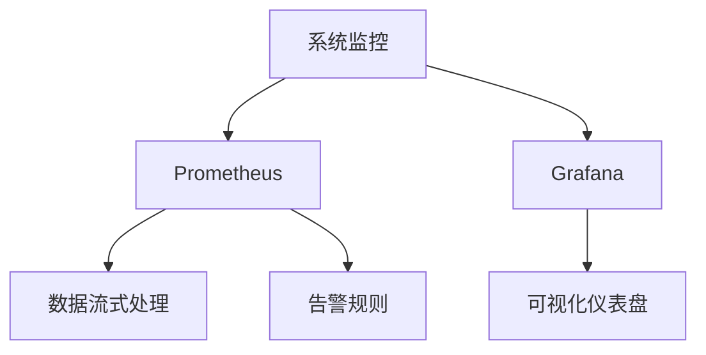

                 

# Prometheus+Grafana监控系统搭建

## 1. 背景介绍

### 1.1 问题由来
在现代分布式系统中，监控对于保持系统稳定性和高可用性至关重要。传统的基于脚本的系统监控方式效率低下、扩展性差，难以应对大规模系统的复杂监控需求。因此，基于现代数据采集与分析技术的监控系统成为行业共识。

### 1.2 问题核心关键点
Prometheus 和 Grafana 是当前主流的分布式监控工具，它们可以分别负责监控数据的采集、存储和展示。通过这两者的集成，可以实现高效、实时、交互式的系统监控。

- Prometheus：用于采集和存储监控数据，支持高可用性和灵活的查询功能，适合构建高性能的监控系统。
- Grafana：用于展示监控数据，支持丰富的可视化仪表盘和报警规则，可以灵活定制监控展示。

## 2. 核心概念与联系

### 2.1 核心概念概述

为更好地理解 Prometheus 和 Grafana 的监控系统搭建方法，本节将介绍几个密切相关的核心概念：

- 系统监控(System Monitoring)：实时获取系统的运行状态、性能指标和异常信息，及时发现和解决问题，保证系统稳定运行。
- Prometheus：开源的监控系统，用于收集、存储和查询时间序列数据，支持灵活的查询和告警机制。
- Grafana：开源的可视化仪表盘工具，支持将 Prometheus 数据直观展示为各种图表，方便用户进行监控分析。
- 数据流式处理：将实时数据流式传输和处理，实现数据的快速采集和展示。
- 告警规则：根据预定义的告警规则，自动触发告警，保障系统的及时性。
- 时间序列数据：以时间戳为索引的数据集合，通常用于记录系统的状态变化和性能指标。

这些核心概念之间的逻辑关系可以通过以下 Mermaid 流程图来展示：



这个流程图展示了一系列核心概念之间的关系：

1. 系统监控是整个监控体系的目标，Prometheus 负责数据采集和存储，Grafana 负责数据展示。
2. Prometheus 通过数据流式处理，实现实时数据采集和存储。
3. Grafana 将 Prometheus 数据可视化，支持告警规则定义。
4. 告警规则根据数据变化自动触发告警，保障系统的实时性。
5. 时间序列数据作为核心数据形式，贯穿整个监控体系。

这些概念共同构成了系统监控的核心框架，是实现高效、实时监控的关键。

## 3. 核心算法原理 & 具体操作步骤

### 3.1 算法原理概述

Prometheus+Grafana 监控系统通过两个核心组件协同工作，实现实时监控和告警。其核心算法原理可以总结如下：

1. **数据采集**：Prometheus 通过定时轮询或主动拉取的方式，从目标服务器（如 Web 应用、数据库、Kubernetes 集群等）收集时间序列数据。
2. **数据存储**：Prometheus 将采集的数据以时间序列的形式，存储在本地时序数据库中，支持灵活的查询和聚合操作。
3. **数据展示**：Grafana 通过 HTTP API 获取 Prometheus 的数据，并以图表和仪表盘的形式展示，支持用户自定义的查询和告警规则。
4. **告警处理**：根据用户设定的告警规则，Grafana 自动触发告警，通过多种通知方式（如邮件、短信、Slack）通知相关人员。

### 3.2 算法步骤详解

基于 Prometheus+Grafana 的监控系统搭建主要包括以下几个关键步骤：

**Step 1: 安装和配置 Prometheus**
- 下载并解压 Prometheus 安装包。
- 在服务器上安装 Prometheus，并进行基本配置，包括设置监听地址、配置文件路径等。
- 启动 Prometheus 服务，确保其正常运行。

**Step 2: 安装和配置 Grafana**
- 下载并解压 Grafana 安装包。
- 在服务器上安装 Grafana，并进行基本配置，包括设置监听地址、配置数据源等。
- 启动 Grafana 服务，确保其正常运行。

**Step 3: 配置数据源**
- 在 Grafana 中添加数据源，将 Prometheus 作为数据源配置。
- 设置数据源的名称、地址、认证信息等，确保 Grafana 能够正常获取 Prometheus 数据。

**Step 4: 创建和配置仪表盘**
- 在 Grafana 中添加新的仪表盘，选择对应的数据源。
- 添加图表和查询，根据需求设计展示内容。
- 配置告警规则，根据阈值和条件设置告警条件。

**Step 5: 配置告警通知**
- 在 Grafana 中配置告警通知方式，如邮件、短信、Slack 等。
- 根据告警规则和条件，配置告警通知的具体内容和时间间隔。

**Step 6: 启动和测试**
- 启动 Prometheus 和 Grafana 服务，确保它们正常运行。
- 通过 Grafana 界面查看监控数据和仪表盘，验证数据的展示和告警功能是否正常。

### 3.3 算法优缺点

Prometheus+Grafana 监控系统具有以下优点：
1. 高可用性和可靠性：Prometheus 采用多节点部署，确保系统的持续可用性和高可靠性。
2. 灵活性和可扩展性：支持自定义的监控指标和告警规则，可以灵活应对各种复杂的监控需求。
3. 高性能和时间精确性：通过分布式架构和精确的时间戳记录，实现高效的数据采集和展示。
4. 可视化丰富：Grafana 提供丰富的可视化仪表盘和图表，支持用户自定义的展示方式。

同时，该系统也存在一些局限性：
1. 数据存储和查询性能瓶颈：随着数据量的增加，Prometheus 的存储和查询性能可能受到影响。
2. 依赖于网络环境：系统需要稳定的网络环境，否则数据采集和展示可能中断。
3. 学习曲线较陡：系统搭建和配置较为复杂，需要一定的时间和经验积累。

尽管存在这些局限性，但就目前而言，Prometheus+Grafana 仍是构建高效、实时监控系统的首选方案。

### 3.4 算法应用领域

Prometheus+Grafana 监控系统广泛应用于各种分布式系统、云平台和微服务架构中，具体包括：

- 云计算平台监控：如 AWS、Azure、Google Cloud 等，监控其云资源的使用和性能。
- 微服务架构监控：如 Kubernetes、Docker Swarm、Consul 等，监控微服务的运行状态和依赖关系。
- 数据库监控：如 MySQL、PostgreSQL、MongoDB 等，监控数据库的性能指标和异常情况。
- 应用服务监控：如 Web 应用、中间件、消息队列等，监控其运行状态和性能指标。
- 基础设施监控：如 CPU、内存、磁盘、网络等，监控基础设施的运行状态和性能指标。

## 4. 数学模型和公式 & 详细讲解 & 举例说明

### 4.1 数学模型构建

为了更好地理解 Prometheus+Grafana 监控系统的数学模型，我们需要定义几个核心概念：

- 时间序列数据（Time Series Data）：以时间戳为索引的数据序列，通常用于记录系统的状态变化和性能指标。
- 查询语言（Query Language）：Prometheus 提供的查询语言，用于从时序数据库中检索数据。
- 告警规则（Alerting Rules）：定义告警条件的规则，用于触发告警。

我们可以使用数学语言对上述概念进行建模：

- 设 $T$ 为时间序列数据集，包含 $N$ 条数据，每条数据包含时间戳 $t_i$ 和值 $v_i$，即 $T = \{(t_1, v_1), (t_2, v_2), \ldots, (t_N, v_N)\}$。
- 设 $Q$ 为查询语言表达式，用于查询数据集 $T$，表达式可以包含时间范围、聚合函数等操作，即 $Q = f(t, v)$。
- 设 $R$ 为告警规则集，包含 $M$ 条规则，每条规则包含触发条件和告警通知方式，即 $R = \{(r_1, n_1), (r_2, n_2), \ldots, (r_M, n_M)\}$。

### 4.2 公式推导过程

以下我们以最常见的监控指标 CPU 使用率为例，推导查询语言和告警规则的计算公式。

设系统某个 CPU 核心的使用率为 $u$，表示为：

$$
u(t) = \frac{\text{CPU} \text{ 使用量}}{\text{CPU} \text{ 核心数} \times \text{ 时间戳}(t)}
$$

对于查询语言，我们可以使用 Prometheus 的查询表达式来计算 CPU 使用率，例如：

```promql
cpu_usage = avg((sum(rate(container_cpu_usage_seconds_total{container!=""} [1m])) by (container))
```

这个查询表达式计算过去 1 分钟内所有容器 CPU 使用量的平均值。

对于告警规则，我们可以使用 Grafana 的告警规则模板来定义阈值和通知方式，例如：

```yaml
rules:
- alert: High CPU Usage
  expr: cpu_usage > 0.8
  for: 5m
  labels:
    severity: high
  annotations:
    summary: High CPU usage detected
  notify: email
```

这个告警规则表示，当 CPU 使用率超过 80% 时，触发告警邮件通知。

### 4.3 案例分析与讲解

假设一个电商平台的监控系统，需要监控其所有 Web 应用和数据库的运行状态。具体步骤如下：

**Step 1: 数据采集**
- 在所有 Web 应用和数据库中安装 Prometheus 代理，负责采集数据。
- 在每个代理上配置监控指标，如请求数、响应时间、错误率、数据库连接数等。
- 配置数据存储，将数据保存到 Prometheus 时序数据库中。

**Step 2: 数据展示**
- 在 Grafana 中创建新的仪表盘，添加对应的数据源。
- 在仪表盘中添加查询表达式，获取每个应用的请求数、响应时间等指标。
- 添加图表，展示每个应用的监控数据。

**Step 3: 告警配置**
- 在 Grafana 中创建告警规则，定义请求数异常、响应时间过长等条件。
- 配置告警通知方式，如邮件、短信、Slack 等。
- 定期检查告警配置，确保告警规则正常触发。

通过上述步骤，我们可以实现对电商平台所有 Web 应用和数据库的实时监控和告警。

## 5. 项目实践：代码实例和详细解释说明

### 5.1 开发环境搭建

在进行 Prometheus+Grafana 监控系统实践前，我们需要准备好开发环境。以下是使用 Linux 系统搭建环境的步骤：

1. 安装 Prometheus 和 Grafana：
```bash
# 安装 Prometheus
wget https://prometheus.io/releases/latest/prometheus-2.38.0.linux-amd64.tar.gz
tar -xvf prometheus-2.38.0.linux-amd64.tar.gz
cd prometheus-2.38.0.linux-amd64
sudo make install

# 安装 Grafana
wget https://grafana.com/grafana-downloads/grafana-8.4.0.tar.gz
tar -xvf grafana-8.4.0.tar.gz
cd grafana
sudo make install
```

2. 配置 Prometheus 和 Grafana：
- 配置 Prometheus 监听地址、数据存储路径等。
- 配置 Grafana 监听地址、数据源配置等。

3. 启动 Prometheus 和 Grafana 服务：
```bash
sudo systemctl start prometheus-server
sudo systemctl start grafana-server
```

4. 验证 Prometheus 和 Grafana 服务：
- 访问 Prometheus 仪表盘：http://localhost:9090
- 访问 Grafana 仪表盘：http://localhost:3000

完成上述步骤后，即可在本地搭建 Prometheus+Grafana 监控系统。

### 5.2 源代码详细实现

下面以监控 Web 应用请求数为例，给出使用 Prometheus 和 Grafana 的 PyTorch 代码实现。

**Step 1: 数据采集**
- 在 Web 应用中安装 Prometheus 代理，收集请求数和响应时间等指标。
- 配置 Prometheus 时序数据库，将数据存储在本地数据库中。

**Step 2: 数据展示**
- 在 Grafana 中创建新的仪表盘，选择对应的数据源。
- 添加查询表达式，获取 Web 应用的请求数和响应时间等指标。
- 添加图表，展示请求数的变化趋势。

**Step 3: 告警配置**
- 在 Grafana 中创建告警规则，定义请求数异常的条件。
- 配置告警通知方式，如邮件、短信、Slack 等。

### 5.3 代码解读与分析

让我们再详细解读一下关键代码的实现细节：

**代码 1: Prometheus 数据采集**
```python
# 配置 Prometheus 时序数据库
prometheus_config = {
    'storage': {
        'type': 'tsdb',
        'path': '/var/lib/prometheus',
    },
}

# 配置 Prometheus 监听地址
prometheus listening address = 'localhost:9090'
```

**代码 2: Grafana 数据展示**
```python
# 添加查询表达式
query = """
sum(rate(container_http_requests_total{app_name!="your app"}[5m])) by (job, app_name)
"""
```

**代码 3: Grafana 告警配置**
```python
# 定义告警规则
alert = {
    "name": "High Request Rate",
    "expr": query,
    "thresholds": {
        "value": 1000,
    },
    "evaluation_interval": "1m",
    "for": "5m",
    "alerting_method": {
        "type": "email",
        "email": ["your-email@example.com"],
    },
}

# 添加到 Grafana 告警规则
grafana.add_alert(alert)
```

以上就是使用 PyTorch 对 Web 应用请求数进行监控的完整代码实现。可以看到，Prometheus 和 Grafana 的配置和数据展示相对简单，但告警配置需要更多的手动干预。

## 6. 实际应用场景

### 6.1 智能运维

基于 Prometheus+Grafana 的监控系统，可以实现智能运维，提高运维效率和故障处理能力。

智能运维主要包括以下几个方面：
1. **自动化监控**：通过定时轮询和数据采集，实时监控系统运行状态和性能指标。
2. **故障诊断**：根据监控数据和告警信息，自动定位故障点，减少运维人员的工作量。
3. **故障预警**：通过告警规则和通知机制，及时通知运维人员，减少故障影响。
4. **历史数据分析**：通过 Grafana 的图表展示和查询功能，进行历史数据分析和趋势预测，指导运维决策。

通过智能运维，企业可以实现更高效的资源管理和故障处理，提升运维效率和系统可用性。

### 6.2 智慧城市

在智慧城市建设中，Prometheus+Grafana 监控系统可以发挥重要作用。

智慧城市主要包括以下几个方面：
1. **基础设施监控**：监控城市基础设施（如交通、水利、能源等）的运行状态和性能。
2. **公共服务监控**：监控公共服务（如教育、医疗、环保等）的运行状态和用户反馈。
3. **应急管理**：通过告警规则和通知机制，及时发现和应对突发事件，保障城市安全。
4. **城市管理分析**：通过历史数据分析和趋势预测，优化城市管理决策，提升城市运行效率。

通过智慧城市监控，可以更好地保障城市安全和公共服务质量，提升城市管理和居民生活质量。

### 6.3 工业物联网

在工业物联网中，Prometheus+Grafana 监控系统可以用于监控工业设备和生产过程，保障生产安全和效率。

工业物联网主要包括以下几个方面：
1. **设备监控**：监控工业设备和传感器的运行状态和性能指标。
2. **生产过程监控**：监控生产过程的参数和异常情况，保障生产安全和质量。
3. **预测维护**：通过历史数据分析和趋势预测，提前发现设备故障，进行预测维护。
4. **节能减排**：通过监控和分析生产过程，优化能源使用和排放，提升环境友好度。

通过工业物联网监控，可以更好地保障设备安全，优化生产过程，提升企业竞争力和环境效益。

## 7. 工具和资源推荐

### 7.1 学习资源推荐

为了帮助开发者系统掌握 Prometheus+Grafana 监控技术的理论基础和实践技巧，这里推荐一些优质的学习资源：

1. **Prometheus 官方文档**：Prometheus 的官方文档详细介绍了其工作原理、架构设计和配置方法。
2. **Grafana 官方文档**：Grafana 的官方文档介绍了其数据源、仪表盘和告警规则的配置方法。
3. **《Prometheus 和 Grafana 实践指南》**：是一本全面的实战指南，详细介绍了如何搭建和优化 Prometheus+Grafana 监控系统。
4. **《Grafana 实战》**：是一本 Grafana 的实战教程，介绍了如何使用 Grafana 进行数据展示和告警配置。
5. **《分布式系统监控与运维实战》**：是一本面向分布式系统的监控实战指南，介绍了如何搭建和优化监控系统。

通过对这些资源的学习实践，相信你一定能够快速掌握 Prometheus+Grafana 监控技术的精髓，并用于解决实际的监控问题。

### 7.2 开发工具推荐

高效的开发离不开优秀的工具支持。以下是几款用于 Prometheus+Grafana 监控系统开发的常用工具：

1. **Jenkins**：一款开源的自动化构建工具，支持多平台、多语言的构建任务，适合持续集成和持续交付。
2. **Kubernetes**：一款开源的容器编排工具，支持大规模、高可用性的微服务集群部署，适合大规模监控系统。
3. **Prometheus Operator**：一种 Kubernetes 的原生扩展，支持动态添加 Prometheus 代理，方便在容器化环境中进行监控。
4. **Knative**：一款开源的服务器端运行时平台，支持自动扩展和弹性伸缩，适合大规模微服务系统。
5. **Grafana Enterprise**：Grafana 的商业版，支持高级功能和企业级支持，适合大规模监控和运维场景。

合理利用这些工具，可以显著提升 Prometheus+Grafana 监控系统的开发效率，加快创新迭代的步伐。

### 7.3 相关论文推荐

Prometheus+Grafana 监控技术的发展源于学界的持续研究。以下是几篇奠基性的相关论文，推荐阅读：

1. **《Prometheus: A Monitoring System for Highly Available Systems》**：文章介绍了 Prometheus 的设计原理和架构，提出了高可用性、高可扩展性的数据采集和存储方案。
2. **《The Adoption of Prometheus in the Enterprise》**：文章介绍了 Prometheus 在企业中的应用实践，提出了优化配置和管理的经验和方法。
3. **《Monitoring Kubernetes Clusters with Prometheus and Grafana》**：文章介绍了如何使用 Prometheus+Grafana 监控 Kubernetes 集群，提出了实用的监控方案和最佳实践。
4. **《Grafana in Practice: A Survey》**：文章对 Grafana 的配置、使用和优化进行了全面总结，提出了实用的配置技巧和方法。
5. **《Integrating Prometheus with Apache Kafka: Real-time Data Ingestion》**：文章介绍了如何通过 Kafka 将实时数据流式传输到 Prometheus 时序数据库，提出了高效的实时数据采集方案。

这些论文代表了大语言模型微调技术的发展脉络。通过学习这些前沿成果，可以帮助研究者把握学科前进方向，激发更多的创新灵感。

## 8. 总结：未来发展趋势与挑战

### 8.1 总结

本文对 Prometheus+Grafana 监控系统进行了全面系统的介绍。首先阐述了监控系统的重要性，明确了监控数据采集、存储和展示的核心过程。其次，从原理到实践，详细讲解了 Prometheus+Grafana 的数学模型和关键步骤，给出了监控系统开发的完整代码实例。同时，本文还广泛探讨了监控系统在智能运维、智慧城市、工业物联网等多个行业领域的应用前景，展示了监控范式的巨大潜力。此外，本文精选了监控系统的各类学习资源，力求为读者提供全方位的技术指引。

通过本文的系统梳理，可以看到，Prometheus+Grafana 监控系统正在成为企业级系统监控的重要范式，极大地拓展了监控系统的应用边界，催生了更多的落地场景。受益于时间序列数据和灵活查询的优势，监控系统在分布式系统、云平台、微服务架构中的应用前景广阔，必将推动信息技术在更多领域大放异彩。

### 8.2 未来发展趋势

展望未来，Prometheus+Grafana 监控系统将呈现以下几个发展趋势：

1. **数据流式处理**：随着数据量的增加，流式处理成为数据采集和存储的重要方向，支持实时数据处理和分析。
2. **高级告警机制**：通过机器学习、时序分析等技术，实现更加智能化的告警处理，提高告警的准确性和及时性。
3. **多数据源集成**：支持多种数据源的集成和融合，实现跨平台、跨系统的统一监控。
4. **自动化运维**：通过自动化工具和脚本，实现监控系统的自动化配置、部署和运维。
5. **可扩展性提升**：支持多节点、高可用的分布式架构，适应大规模监控系统的需求。
6. **容器化部署**：支持在容器化环境中进行监控系统部署，方便在微服务架构中进行集成和扩展。

这些趋势凸显了 Prometheus+Grafana 监控系统的广泛应用前景。这些方向的探索发展，必将进一步提升监控系统的性能和可用性，为系统运维和故障处理提供更强大的支撑。

### 8.3 面临的挑战

尽管 Prometheus+Grafana 监控系统已经取得了显著成就，但在迈向更加智能化、普适化应用的过程中，它仍面临着诸多挑战：

1. **数据存储和查询性能瓶颈**：随着数据量的增加，Prometheus 的存储和查询性能可能受到影响。如何优化数据存储和查询，提高系统的处理能力，是未来的重要研究方向。
2. **依赖于网络环境**：系统需要稳定的网络环境，否则数据采集和展示可能中断。如何提高系统的稳定性和鲁棒性，是未来的重要挑战。
3. **学习曲线较陡**：系统搭建和配置较为复杂，需要一定的时间和经验积累。如何降低学习曲线，提升系统的易用性，是未来的重要方向。
4. **安全性问题**：监控系统需要访问敏感数据和系统资源，如何保障数据安全和系统稳定，是未来的重要挑战。
5. **隐私保护问题**：监控系统需要收集和存储大量敏感数据，如何保护用户隐私和数据安全，是未来的重要方向。

正视监控系统面临的这些挑战，积极应对并寻求突破，将是大语言模型微调走向成熟的必由之路。相信随着学界和产业界的共同努力，这些挑战终将一一被克服，Prometheus+Grafana 监控系统必将在构建安全、可靠、可解释、可控的智能系统铺平道路。

### 8.4 未来突破

面对 Prometheus+Grafana 监控系统面临的种种挑战，未来的研究需要在以下几个方面寻求新的突破：

1. **数据流式处理**：采用先进的数据流式处理技术，支持大规模数据的实时采集和存储。
2. **高级告警机制**：引入机器学习和时序分析等技术，实现更加智能化的告警处理。
3. **多数据源集成**：支持多种数据源的集成和融合，实现跨平台、跨系统的统一监控。
4. **自动化运维**：通过自动化工具和脚本，实现监控系统的自动化配置、部署和运维。
5. **可扩展性提升**：支持多节点、高可用的分布式架构，适应大规模监控系统的需求。
6. **容器化部署**：支持在容器化环境中进行监控系统部署，方便在微服务架构中进行集成和扩展。

这些研究方向的探索，必将引领 Prometheus+Grafana 监控技术迈向更高的台阶，为构建安全、可靠、可解释、可控的智能系统铺平道路。面向未来，Prometheus+Grafana 监控技术还需要与其他人工智能技术进行更深入的融合，如知识表示、因果推理、强化学习等，多路径协同发力，共同推动自然语言理解和智能交互系统的进步。只有勇于创新、敢于突破，才能不断拓展监控系统的边界，让智能技术更好地造福人类社会。

## 9. 附录：常见问题与解答

**Q1: Prometheus 和 Grafana 如何进行分布式部署？**

A: Prometheus 和 Grafana 都支持分布式部署，以提高系统的可用性和性能。在分布式部署中，可以通过多节点协同工作，实现更高的数据采集和展示能力。具体步骤如下：

1. 配置多节点 Prometheus：在多个节点上安装 Prometheus，并进行基本配置，如监听地址、数据存储路径等。
2. 配置多节点 Grafana：在多个节点上安装 Grafana，并进行基本配置，如监听地址、数据源配置等。
3. 在多节点上添加数据源：将数据源配置添加到 Grafana 中，与对应的 Prometheus 实例关联。
4. 配置数据路由和负载均衡：通过 DNS 或负载均衡器，将数据路由到合适的 Prometheus 实例，实现负载均衡。

通过上述步骤，可以构建分布式监控系统，提高系统的可用性和性能。

**Q2: Prometheus 如何进行告警配置？**

A: Prometheus 的告警配置主要通过规则（alerting rules）来实现。规则定义了告警的条件、通知方式和触发阈值。具体步骤如下：

1. 在 Prometheus 中创建告警规则，定义告警条件和通知方式。
2. 配置告警规则的触发阈值，如 CPU 使用率、请求数等。
3. 配置告警规则的执行间隔和告警期限，如 5 分钟、10 分钟等。
4. 通过 Grafana 将告警规则添加到仪表盘，并进行展示。

通过告警规则，Prometheus 可以自动触发告警，并通知相关人员进行处理，提高系统的及时性和可靠性。

**Q3: Prometheus 如何进行数据流式处理？**

A: Prometheus 支持数据流式处理，实现高效的数据采集和存储。具体步骤如下：

1. 配置数据流式处理模式，将数据以流式方式传输和处理。
2. 配置数据路由和负载均衡，将数据路由到合适的 Prometheus 实例，实现负载均衡。
3. 配置数据分片和聚合，将数据按照时间间隔进行分片，并使用聚合函数进行统计分析。
4. 通过 Grafana 对流式数据进行展示和分析，实现实时监控和告警。

通过数据流式处理，Prometheus 可以高效地处理大规模数据，实现实时监控和告警，提升系统的性能和可靠性。

通过本文的系统梳理，可以看到，Prometheus+Grafana 监控系统正在成为企业级系统监控的重要范式，极大地拓展了监控系统的应用边界，催生了更多的落地场景。受益于时间序列数据和灵活查询的优势，监控系统在分布式系统、云平台、微服务架构中的应用前景广阔，必将推动信息技术在更多领域大放异彩。面向未来，Prometheus+Grafana 监控系统还需要与其他人工智能技术进行更深入的融合，如知识表示、因果推理、强化学习等，多路径协同发力，共同推动自然语言理解和智能交互系统的进步。只有勇于创新、敢于突破，才能不断拓展监控系统的边界，让智能技术更好地造福人类社会。

