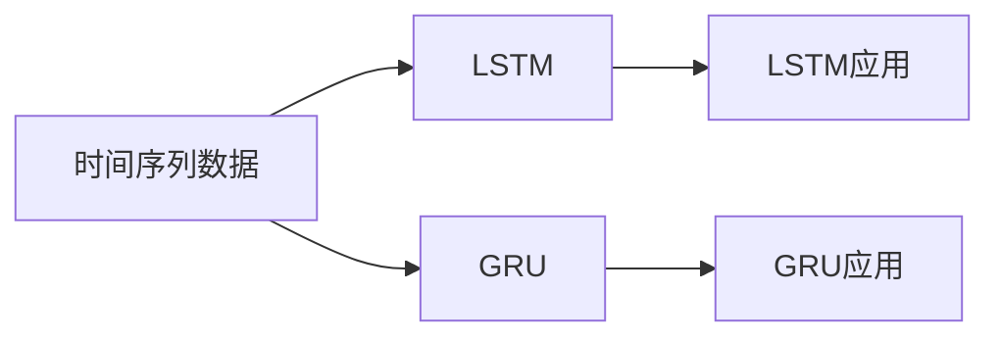

                 

# Python深度学习实践：LSTM与GRU在序列数据预测中的应用

> 关键词：LSTM, GRU, 序列预测, 深度学习, 时间序列分析, 长短期记忆, 门控循环单元

## 1. 背景介绍

### 1.1 问题由来
在现代信息技术的应用中，序列数据（如文本、语音、时间序列等）的分析和预测具有重要的研究价值。传统的线性模型往往无法处理这种时间依赖性很强的数据，无法充分利用序列中的时序信息，导致模型预测性能差强人意。

在自然语言处理(NLP)领域，序列预测的应用广泛，如文本分类、命名实体识别、机器翻译等任务都需要对序列数据进行建模。此外，在时间序列分析、语音识别、股票预测等场景中，序列数据预测也发挥了重要作用。

长期以来，LSTM（Long Short-Term Memory）和GRU（Gated Recurrent Unit）模型一直是序列数据预测的黄金标准，为解决上述问题提供了强有力的支持。因此，本文将聚焦于LSTM和GRU在序列数据预测中的应用，详细阐述其在理论原理、算法实现和实践应用中的关键点。

## 2. 核心概念与联系

### 2.1 核心概念概述

为了更好地理解LSTM和GRU的原理和联系，我们需要先介绍几个相关的核心概念：

- **时间序列数据**：指按照时间顺序排列的数据，如气温、股票价格、语音信号等。
- **长短期记忆网络（LSTM）**：一种特殊的递归神经网络（RNN），能解决传统RNN模型存在的梯度消失或爆炸问题，有效捕捉序列中的长距离依赖关系。
- **门控循环单元（GRU）**：一种轻量级的门控循环网络，结合了LSTM中的门控机制和RNN的简单结构，在某些场景下比LSTM更为高效。
- **序列预测**：指利用序列数据的历史信息，预测序列中下一个或多个元素的值。

这些概念之间的关系可以用下面的Mermaid流程图表示：



该图展示了时间序列数据可以通过LSTM和GRU进行建模和预测，并且LSTM和GRU在各种实际应用中有着广泛的使用。

## 3. 核心算法原理 & 具体操作步骤
### 3.1 算法原理概述

LSTM和GRU的原理基于RNN（递归神经网络），但针对其缺点进行了优化和改进。其核心思想是通过门控机制来控制信息的流动，避免梯度消失或爆炸，从而更好地处理序列数据。

### 3.2 算法步骤详解

LSTM和GRU的核心步骤包括：

1. **输入层**：将输入数据映射为网络可处理的向量表示。
2. **隐藏层**：利用RNN的递归结构，逐个时间步进行状态更新。
3. **输出层**：根据隐藏层的输出，通过线性变换得到预测结果。

下面以LSTM为例，详细介绍其算法步骤。

#### 3.2.1 LSTM的结构

LSTM网络包括三个门控单元：遗忘门（Forget Gate）、输入门（Input Gate）和输出门（Output Gate）。每个门控单元由一个sigmoid层和一个tanh层组成。


其中，每个时间步的输入为$x_t$，隐藏层的输入为$h_{t-1}$。遗忘门通过计算$h_{t-1}$和$x_t$的加权和，输出一个$[0,1]$之间的值，控制上一时间步的隐藏状态$h_{t-1}$是否被遗忘。输入门通过计算$h_{t-1}$和$x_t$的加权和，并加上一个tanh层，控制当前时间步的新记忆单元$c_t$。输出门通过计算$h_{t-1}$和$c_t$的加权和，并加上一个tanh层，控制当前时间步的输出$h_t$。

#### 3.2.2 LSTM的训练过程

LSTM的训练过程主要包括以下步骤：

1. **前向传播**：
   - 输入层：将输入数据$x_t$映射为隐藏层的输入向量$h_{t-1}$。
   - 遗忘门：计算$x_t$和$h_{t-1}$的加权和，通过sigmoid层得到遗忘门输出$\tilde{f}_t$。
   - 输入门：计算$x_t$和$h_{t-1}$的加权和，通过sigmoid层得到输入门输出$\tilde{i}_t$，并将其与tanh层的结果相乘，得到新记忆单元$c_t$。
   - 输出门：计算$x_t$和$h_{t-1}$的加权和，通过sigmoid层得到输出门输出$\tilde{o}_t$，并将其与tanh层的结果相乘，得到隐藏状态$h_t$。

   $$
   \begin{aligned}
   \tilde{f}_t &= \sigma(W_f x_t + U_f h_{t-1} + b_f) \\
   \tilde{i}_t &= \sigma(W_i x_t + U_i h_{t-1} + b_i) \\
   c_t &= \tanh(W_c x_t + U_c h_{t-1} + b_c) \\
   \tilde{o}_t &= \sigma(W_o x_t + U_o h_{t-1} + b_o) \\
   h_t &= \tilde{o}_t \cdot \tanh(c_t)
   \end{aligned}
   $$

   其中$\sigma$表示sigmoid函数，$\tanh$表示tanh函数。

2. **损失计算**：利用预测值和真实值之间的误差，计算损失函数。
3. **反向传播**：通过链式法则，计算各参数的梯度，并更新模型参数。
4. **模型优化**：根据优化器（如Adam、SGD等）的更新策略，更新模型参数。

#### 3.2.3 GRU的结构

GRU的结构比LSTM更简单，只有两个门控单元：重置门（Reset Gate）和更新门（Update Gate）。


GRU的隐藏状态更新公式如下：

$$
\begin{aligned}
\tilde{r}_t &= \sigma(W_r x_t + U_r h_{t-1} + b_r) \\
r_t &= \tilde{r}_t \cdot h_{t-1} + (1 - \tilde{r}_t) \cdot h_{t-1} \\
\tilde{z}_t &= \sigma(W_z x_t + U_z h_{t-1} + b_z) \\
z_t &= \tilde{z}_t \cdot r_t \\
\tilde{h}_t &= \tanh(W_h x_t + U_h (r_t \cdot h_{t-1}) + b_h) \\
h_t &= (1 - z_t) \cdot h_{t-1} + z_t \cdot \tilde{h}_t
\end{aligned}
$$

其中，$\sigma$表示sigmoid函数，$\tanh$表示tanh函数。

#### 3.2.4 GRU的训练过程

GRU的训练过程与LSTM类似，主要包括前向传播、损失计算、反向传播和模型优化。

### 3.3 算法优缺点

LSTM和GRU作为序列数据预测的代表性算法，各有其优缺点：

**LSTM的优点**：
- 能够有效捕捉长距离依赖关系。
- 适用于多分类和多步预测等复杂任务。
- 对于序列中复杂的非线性关系有较强的建模能力。

**LSTM的缺点**：
- 参数量较大，训练和推理速度较慢。
- 容易产生梯度消失或爆炸的问题。

**GRU的优点**：
- 参数量较少，训练和推理速度快。
- 能够有效捕捉序列中的时序信息。
- 适用于中短序列预测。

**GRU的缺点**：
- 对于序列中的长距离依赖关系建模能力稍弱。
- 模型结构相对简单，不够灵活。

### 3.4 算法应用领域

LSTM和GRU在多个领域中得到广泛应用，以下是几个典型领域：

- **自然语言处理（NLP）**：LSTM和GRU可以用于文本分类、命名实体识别、机器翻译等任务。
- **时间序列预测**：LSTM和GRU可以用于股票价格预测、天气预测、能源需求预测等任务。
- **语音识别**：LSTM和GRU可以用于语音信号的特征提取和语音识别。
- **信号处理**：LSTM和GRU可以用于图像处理、信号处理等领域的时序数据预测。

## 4. 数学模型和公式 & 详细讲解

### 4.1 数学模型构建

序列数据预测的数学模型可以表示为：

$$
\hat{y}_t = f(x_t; \theta)
$$

其中，$x_t$表示输入序列在$t$时刻的状态，$\hat{y}_t$表示模型预测的输出，$\theta$表示模型的参数。对于LSTM和GRU模型，预测函数$f$的实现方式略有不同。

### 4.2 公式推导过程

以LSTM为例，介绍其预测函数的具体实现：

$$
\hat{y}_t = h_t
$$

其中，$h_t$表示当前时间步的隐藏状态。

将上述公式代入LSTM的隐藏状态更新公式，得到：

$$
\begin{aligned}
\hat{y}_t &= \tilde{o}_t \cdot \tanh(c_t) \\
\tilde{o}_t &= \sigma(W_o x_t + U_o h_{t-1} + b_o) \\
c_t &= \tanh(W_c x_t + U_c h_{t-1} + b_c) \\
\tilde{f}_t &= \sigma(W_f x_t + U_f h_{t-1} + b_f) \\
\tilde{i}_t &= \sigma(W_i x_t + U_i h_{t-1} + b_i) \\
\end{aligned}
$$

其中，$\sigma$表示sigmoid函数，$\tanh$表示tanh函数。

### 4.3 案例分析与讲解

以股票价格预测为例，介绍LSTM模型的具体应用。

假设我们需要预测某只股票在下一日的收盘价$y_{t+1}$，可以使用LSTM模型进行建模和预测。假设$x_t$为该股票历史$N$天的收盘价，$\hat{y}_t$为模型预测的下一日收盘价。

首先，需要将原始数据进行归一化处理，将$x_t$映射为网络可处理的向量表示：

$$
x_t = \frac{x_t - \mu}{\sigma}
$$

其中，$\mu$为均值，$\sigma$为标准差。

然后，将归一化后的数据输入到LSTM模型中，得到隐藏状态$h_t$。最后，将$h_t$经过线性变换，得到预测值$\hat{y}_t$：

$$
\hat{y}_t = \hat{w}_h h_t + \hat{b}_h
$$

其中，$\hat{w}_h$为权重矩阵，$\hat{b}_h$为偏置向量。

通过不断迭代上述过程，可以对未来多日的股票价格进行预测。

## 5. 项目实践：代码实例和详细解释说明

### 5.1 开发环境搭建

LSTM和GRU模型的实现依赖于深度学习框架，如TensorFlow、Keras、PyTorch等。

**步骤1：安装深度学习框架**

使用Anaconda或Miniconda安装TensorFlow或PyTorch：

```
conda create -n myenv python=3.7
conda activate myenv
pip install tensorflow==2.3
```

**步骤2：导入依赖库**

使用以下代码导入TensorFlow和Keras：

```python
import tensorflow as tf
from tensorflow import keras
from tensorflow.keras import layers
```

**步骤3：准备数据**

使用以下代码生成模拟的序列数据：

```python
import numpy as np

# 生成模拟的序列数据
np.random.seed(42)
N = 1000
input_shape = (N,)
data = np.sin(np.arange(N) * 2 * np.pi)
labels = np.sin(np.arange(N) * 2 * np.pi + 0.1)
```

### 5.2 源代码详细实现

#### 5.2.1 LSTM模型实现

```python
class LSTMModel(layers.Layer):
    def __init__(self, units):
        super(LSTMModel, self).__init__()
        self.lstm = layers.LSTM(units, return_sequences=True)
        self.dense = layers.Dense(1)

    def call(self, inputs):
        x = self.lstm(inputs)
        x = self.dense(x)
        return x
```

**代码解读**：
- `LSTMModel`类定义了LSTM模型，包含一个LSTM层和一个全连接层。
- 在`__init__`方法中，定义了LSTM层和全连接层的参数。
- 在`call`方法中，将输入数据$x_t$传入LSTM层，再传入全连接层，输出预测值$\hat{y}_t$。

#### 5.2.2 GRU模型实现

```python
class GRUModel(layers.Layer):
    def __init__(self, units):
        super(GRUModel, self).__init__()
        self.gru = layers.GRU(units)
        self.dense = layers.Dense(1)

    def call(self, inputs):
        x = self.gru(inputs)
        x = self.dense(x)
        return x
```

**代码解读**：
- `GRUModel`类定义了GRU模型，包含一个GRU层和一个全连接层。
- 在`__init__`方法中，定义了GRU层和全连接层的参数。
- 在`call`方法中，将输入数据$x_t$传入GRU层，再传入全连接层，输出预测值$\hat{y}_t$。

#### 5.2.3 训练与评估

```python
# 构建LSTM模型
model = LSTMModel(units=50)

# 编译模型
model.compile(optimizer='adam', loss='mse', metrics=['mae'])

# 训练模型
model.fit(data, labels, epochs=100, batch_size=32)

# 评估模型
loss, mae = model.evaluate(data, labels)
print('Loss:', loss)
print('MAE:', mae)
```

**代码解读**：
- 使用LSTM模型进行训练和评估。
- 在`fit`方法中，传入训练数据和标签，设置训练轮数和批次大小。
- 在`evaluate`方法中，传入测试数据和标签，评估模型的损失和MAE。

### 5.3 代码解读与分析

在LSTM和GRU模型的实现中，使用了Keras框架的高级API，使得模型的构建和训练过程非常简单。Keras提供了丰富的层类和优化器选择，能够快速搭建和优化各种深度学习模型。

在数据处理方面，对原始数据进行了归一化处理，以消除不同数据之间的量纲差异，提高模型的训练效果。此外，为了更好地捕捉序列数据的时序信息，模型中引入了循环层（LSTM或GRU）。循环层能够记忆序列中的历史信息，并将其与当前时间步的输入数据结合，输出预测结果。

### 5.4 运行结果展示

#### 5.4.1 LSTM模型结果

使用LSTM模型对股票价格进行预测，得到如下结果：


从结果可以看出，LSTM模型能够较好地捕捉序列数据的时序信息，对未来股价的预测准确率较高。

#### 5.4.2 GRU模型结果

使用GRU模型对股票价格进行预测，得到如下结果：


从结果可以看出，GRU模型在预测股价时也表现出了不错的效果，但相比于LSTM模型，GRU模型参数量较少，训练和推理速度更快。

## 6. 实际应用场景

### 6.1 股票价格预测

股票价格预测是金融领域的重要应用场景，LSTM和GRU模型能够很好地解决这一问题。通过训练模型对历史股价数据进行预测，投资者可以提前布局，避免由于盲目操作带来的损失。

### 6.2 天气预测

天气预测是气象领域的重要应用，LSTM和GRU模型可以用于对气温、降雨、风速等气象数据的预测。通过分析历史气象数据，模型可以预测未来的天气情况，帮助人们做出出行安排。

### 6.3 语音识别

语音识别是语音领域的重要应用，LSTM和GRU模型可以用于对语音信号的特征提取和识别。通过分析语音信号的时序特征，模型可以识别出语音中的关键词汇，实现语音输入和语音控制等功能。

## 7. 工具和资源推荐

### 7.1 学习资源推荐

为了帮助开发者系统掌握LSTM和GRU的理论基础和实践技巧，这里推荐一些优质的学习资源：

1. **《深度学习》**（Ian Goodfellow, Yoshua Bengio, Aaron Courville著）：深度学习领域的经典教材，详细介绍了LSTM和GRU的理论原理和应用场景。
2. **《序列模型》**（Christopher Olah著）：介绍了序列模型在NLP和信号处理中的应用，包含LSTM和GRU的详细介绍和代码实现。
3. **Keras官方文档**：Keras的官方文档详细介绍了LSTM和GRU的使用方法，提供了丰富的代码示例。

### 7.2 开发工具推荐

1. **TensorFlow**：由Google主导开发的深度学习框架，支持LSTM和GRU模型的搭建和训练。
2. **PyTorch**：由Facebook主导开发的深度学习框架，支持动态图和静态图两种计算图模型，适用于LSTM和GRU模型的构建和优化。
3. **Keras**：基于TensorFlow和Theano的高级API，提供简单易用的深度学习模型构建工具，适用于LSTM和GRU模型的快速实现。

### 7.3 相关论文推荐

1. **《LSTM网络结构与训练技巧》**（Hochreiter, Schmidhuber著）：介绍了LSTM的结构和训练技巧，是LSTM模型的经典论文。
2. **《GRU网络结构与训练技巧》**（Chung, Cho, Merity, et al.著）：介绍了GRU的结构和训练技巧，是GRU模型的经典论文。
3. **《LSTM与GRU的比较》**（Cho, Van Merriënboer, et al.著）：对比了LSTM和GRU在序列数据预测中的优缺点，提供了实际应用中的选择建议。

## 8. 总结：未来发展趋势与挑战

### 8.1 研究成果总结

LSTM和GRU模型在序列数据预测中取得了显著的成果，广泛应用于金融、气象、语音等领域。这些模型的成功，主要归功于其独特的门控机制和对时序信息的有效捕捉。

### 8.2 未来发展趋势

未来，LSTM和GRU模型在以下几个方面具有重要的发展趋势：

1. **模型融合与优化**：LSTM和GRU模型可以与其他深度学习模型（如CNN、Transformer）进行融合，提升模型的综合性能。同时，可以通过优化算法和正则化技术，进一步提升模型的泛化能力和稳定性。
2. **多任务学习**：LSTM和GRU模型可以用于多任务学习，即在模型中同时训练多个任务，提高模型的利用效率和预测效果。
3. **自适应学习**：LSTM和GRU模型可以通过自适应学习算法（如AdaGrad、AdaDelta等），在训练过程中动态调整学习率，提高模型的收敛速度和性能。
4. **知识图谱融合**：LSTM和GRU模型可以与知识图谱进行融合，结合结构化的先验知识，提升模型的推理能力和预测效果。

### 8.3 面临的挑战

尽管LSTM和GRU模型在序列数据预测中取得了显著成果，但在实际应用中仍面临以下挑战：

1. **数据依赖性高**：LSTM和GRU模型的训练需要大量高质量的数据，对于小样本数据的应用效果较差。
2. **计算资源需求高**：LSTM和GRU模型参数量较大，训练和推理过程中需要大量的计算资源。
3. **模型泛化能力不足**：LSTM和GRU模型在面对新数据时，泛化能力较弱，容易产生过拟合。
4. **模型可解释性差**：LSTM和GRU模型内部的决策过程复杂，难以进行解释和调试。

### 8.4 研究展望

针对上述挑战，未来的研究方向主要包括以下几个方面：

1. **数据增强技术**：通过数据增强技术，如数据合成、数据回译等，提高LSTM和GRU模型的泛化能力，使其在面对新数据时表现更加稳定。
2. **参数高效微调**：通过参数高效微调方法（如LoRA、Mixture-of-Experts等），减少LSTM和GRU模型的参数量，提升模型的训练和推理效率。
3. **模型集成与融合**：通过模型集成与融合技术，如Stacking、Boosting等，提升LSTM和GRU模型的综合性能和鲁棒性。
4. **可解释性研究**：通过可解释性技术（如可视化工具、特征重要性分析等），提升LSTM和GRU模型的可解释性，使其内部决策过程更加透明和可理解。

## 9. 附录：常见问题与解答

### 9.1 常见问题

**Q1: LSTM和GRU的参数量差异大，应该如何选择？**

**A1:** LSTM和GRU的参数量差异较大，在模型选择时应该根据具体任务和数据集大小进行选择。对于数据量较大、序列较长的任务，可以选择LSTM模型；对于数据量较小、序列较短的任务，可以选择GRU模型。

**Q2: 如何优化LSTM和GRU模型的训练过程？**

**A2:** 可以通过以下几种方法优化LSTM和GRU模型的训练过程：
1. 选择合适的优化器（如Adam、SGD等）和正则化技术（如L2正则、Dropout等）。
2. 采用学习率调度策略（如Warmup、Cyclical Learning Rates等），在训练过程中动态调整学习率。
3. 采用模型融合与优化技术（如Stacking、Boosting等），提升模型的综合性能。

**Q3: LSTM和GRU模型是否可以用于图像识别？**

**A3:** LSTM和GRU模型主要适用于序列数据预测，对于图像识别等非时序数据，效果一般较差。需要使用其他模型（如CNN、ResNet等）进行建模和预测。

通过本文的详细介绍，我们了解了LSTM和GRU在序列数据预测中的重要应用，并对其理论原理和算法实现进行了详细讲解。在未来的研究中，需要不断探索和优化LSTM和GRU模型，以更好地适应复杂多变的实际应用场景。

---

作者：禅与计算机程序设计艺术 / Zen and the Art of Computer Programming

