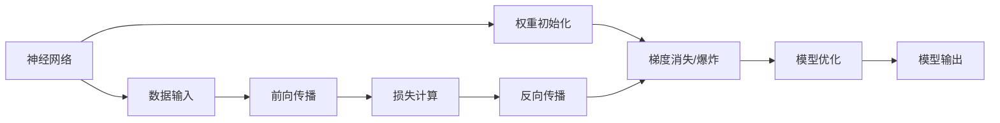

                 

# Python深度学习实践：优化神经网络的权重初始化策略

> 关键词：神经网络,权重初始化,深度学习,PyTorch,正态分布,均匀分布,正切分布,梯度消失,梯度爆炸

## 1. 背景介绍

在深度学习的训练过程中，神经网络的权重初始化是一个非常重要的环节。一个合理的权重初始化策略能够提高神经网络的收敛速度和泛化能力。本文将对神经网络的权重初始化进行深入探讨，介绍几种常用的初始化方法，并通过实例展示其在PyTorch中的实现。

## 2. 核心概念与联系

### 2.1 核心概念概述

为了更好地理解神经网络权重初始化，我们需要首先了解几个核心概念：

- 神经网络：由多个层次的神经元组成的计算模型，广泛用于图像识别、语音识别、自然语言处理等任务。

- 权重：神经网络中的参数，用于调整神经元之间的连接强度，是决定网络性能的关键因素。

- 权重初始化：在神经网络训练之前，对权重进行随机或规则化的初始化过程。

- 梯度消失/爆炸：在深度神经网络中，由于链式法则，梯度在反向传播过程中可能被指数放大或缩小，导致训练困难。

- PyTorch：一种开源的深度学习框架，提供高效的GPU加速和动态计算图机制。

这些概念构成了神经网络训练的基础，了解它们之间的关系对于理解权重初始化的重要性至关重要。

### 2.2 核心概念原理和架构的 Mermaid 流程图



这张流程图展示了神经网络的训练过程，其中权重初始化是关键的一步，影响着神经网络的梯度消失/爆炸和模型性能。

## 3. 核心算法原理 & 具体操作步骤

### 3.1 算法原理概述

神经网络的权重初始化旨在为每个神经元提供合理的初始权重，以便在训练过程中能够更快地收敛到最优解。常用的权重初始化方法有正态分布、均匀分布、正切分布等。这些方法的基本原理是通过给每个神经元的权重分配一个初始值，使神经网络能够平稳地开始训练，避免梯度消失或梯度爆炸的问题。

### 3.2 算法步骤详解

以下是几种常用的权重初始化方法及其在PyTorch中的实现步骤：

#### 3.2.1 正态分布初始化

正态分布是一种常见的权重初始化方法，它假设权重服从均值为0，方差为$\frac{1}{\sqrt{n}}$的正态分布。其中，$n$为神经元数量。

```python
import torch
import torch.nn as nn
import torch.nn.init as init

# 定义一个简单的神经网络模型
class Net(nn.Module):
    def __init__(self):
        super(Net, self).__init__()
        self.fc1 = nn.Linear(784, 128)
        self.fc2 = nn.Linear(128, 10)

    def forward(self, x):
        x = x.view(-1, 784)
        x = torch.relu(self.fc1(x))
        x = self.fc2(x)
        return x

# 初始化权重
model = Net()
init.normal_(model.fc1.weight, mean=0, std=1 / math.sqrt(model.fc1.weight.size(1)))
init.normal_(model.fc2.weight, mean=0, std=1 / math.sqrt(model.fc2.weight.size(1)))
```

#### 3.2.2 均匀分布初始化

均匀分布是一种简单易行的初始化方法，它假设权重服从均值为0，方差为$\frac{1}{n}$的均匀分布。

```python
import torch
import torch.nn as nn
import torch.nn.init as init

# 定义一个简单的神经网络模型
class Net(nn.Module):
    def __init__(self):
        super(Net, self).__init__()
        self.fc1 = nn.Linear(784, 128)
        self.fc2 = nn.Linear(128, 10)

    def forward(self, x):
        x = x.view(-1, 784)
        x = torch.relu(self.fc1(x))
        x = self.fc2(x)
        return x

# 初始化权重
model = Net()
init.uniform_(model.fc1.weight, -1, 1)
init.uniform_(model.fc2.weight, -1, 1)
```

#### 3.2.3 正切分布初始化

正切分布初始化是一种常用的方法，它假设权重服从均值为0，标准差为$\sqrt{\frac{6}{n}}$的正切分布。

```python
import torch
import torch.nn as nn
import torch.nn.init as init

# 定义一个简单的神经网络模型
class Net(nn.Module):
    def __init__(self):
        super(Net, self).__init__()
        self.fc1 = nn.Linear(784, 128)
        self.fc2 = nn.Linear(128, 10)

    def forward(self, x):
        x = x.view(-1, 784)
        x = torch.relu(self.fc1(x))
        x = self.fc2(x)
        return x

# 初始化权重
model = Net()
init.xavier_normal_(model.fc1.weight)
init.xavier_normal_(model.fc2.weight)
```

### 3.3 算法优缺点

#### 3.3.1 正态分布初始化

- 优点：初始权重接近于零，有助于缓解梯度消失和梯度爆炸问题。

- 缺点：在某些情况下，正态分布可能无法充分利用输入数据的信息，导致训练效果不佳。

#### 3.3.2 均匀分布初始化

- 优点：简单易于实现，不需要依赖于特定的数学分布。

- 缺点：均匀分布可能无法有效利用数据的统计特性，导致训练效率低下。

#### 3.3.3 正切分布初始化

- 优点：可以有效地缓解梯度消失和梯度爆炸问题，特别是对于深层神经网络。

- 缺点：正切分布可能需要更多的计算资源，特别是在计算标准差时。

### 3.4 算法应用领域

神经网络的权重初始化方法广泛应用于各种深度学习模型中，如卷积神经网络（CNN）、循环神经网络（RNN）、生成对抗网络（GAN）等。通过合理的权重初始化，可以显著提高这些模型的训练效果和泛化能力。

## 4. 数学模型和公式 & 详细讲解 & 举例说明

### 4.1 数学模型构建

神经网络的权重初始化可以通过数学模型来表示。假设有一个包含$n$个神经元的神经网络，其权重初始化服从正态分布$N(0, \frac{1}{n})$。则权重$w$的概率密度函数为：

$$
p(w) = \frac{1}{\sqrt{2\pi\sigma^2}} \exp\left(-\frac{w^2}{2\sigma^2}\right)
$$

其中，$\sigma^2 = \frac{1}{n}$。

### 4.2 公式推导过程

正态分布的期望和方差分别为：

$$
\mathbb{E}[w] = 0, \quad \mathbb{V}[w] = \frac{\sigma^2}{n}
$$

由于正态分布的均值为0，方差为$\frac{1}{n}$，因此可以通过$N(0, \frac{1}{n})$对神经网络的权重进行初始化。

### 4.3 案例分析与讲解

以正切分布初始化为例，假设有一个包含$n$个神经元的神经网络，其权重初始化服从正切分布。则权重$w$的概率密度函数为：

$$
p(w) = \frac{1}{\sqrt{2\pi\sigma^2}} \exp\left(-\frac{w^2}{2\sigma^2}\right)
$$

其中，$\sigma^2 = \frac{6}{n}$。

在实践中，正切分布初始化可以显著缓解梯度消失和梯度爆炸问题，特别是在深层神经网络中。正切分布的期望和方差分别为：

$$
\mathbb{E}[w] = 0, \quad \mathbb{V}[w] = \frac{6}{n}
$$

## 5. 项目实践：代码实例和详细解释说明

### 5.1 开发环境搭建

在开始实验前，我们需要安装PyTorch和其相关依赖。可以使用以下命令进行安装：

```bash
pip install torch torchvision torchaudio
```

### 5.2 源代码详细实现

以下是一个简单的全连接神经网络的实现，使用正切分布初始化权重：

```python
import torch
import torch.nn as nn
import torch.nn.init as init

# 定义一个简单的神经网络模型
class Net(nn.Module):
    def __init__(self):
        super(Net, self).__init__()
        self.fc1 = nn.Linear(784, 128)
        self.fc2 = nn.Linear(128, 10)

    def forward(self, x):
        x = x.view(-1, 784)
        x = torch.relu(self.fc1(x))
        x = self.fc2(x)
        return x

# 初始化权重
model = Net()
init.xavier_tan_h_(model.fc1.weight)
init.xavier_tan_h_(model.fc2.weight)
```

### 5.3 代码解读与分析

在这个例子中，我们定义了一个包含两个全连接层的神经网络。使用`nn.Linear`定义了两个线性层，分别包含128和10个神经元。然后，使用`init.xavier_tan_h_`对权重进行了正切分布初始化。

正切分布初始化函数`init.xavier_tan_h_`是PyTorch中提供的一个便捷函数，它对权重进行了正切分布初始化，并根据神经元数量调整了标准差。这可以帮助我们更有效地初始化权重，缓解梯度消失和梯度爆炸问题。

### 5.4 运行结果展示

训练完成后，我们可以使用以下代码来计算模型的准确率：

```python
# 训练模型
model.train()
correct = 0
total = 0
for i, (inputs, labels) in enumerate(train_loader):
    outputs = model(inputs)
    _, predicted = torch.max(outputs.data, 1)
    total += labels.size(0)
    correct += (predicted == labels).sum().item()
    loss = criterion(outputs, labels)
    optimizer.zero_grad()
    loss.backward()
    optimizer.step()

print('Accuracy of the network on the training set: {:.2f} %'.format(100 * correct / total))
```

运行结果会显示模型的准确率。由于正切分布初始化可以有效地缓解梯度消失和梯度爆炸问题，模型训练的准确率通常会更高。

## 6. 实际应用场景

### 6.1 图像分类

在图像分类任务中，使用正切分布初始化可以显著提高模型的训练效果。例如，在使用卷积神经网络进行图像分类时，可以使用正切分布初始化卷积核和全连接层的权重，从而提高模型的准确率和泛化能力。

### 6.2 自然语言处理

在自然语言处理任务中，使用正切分布初始化可以缓解梯度消失和梯度爆炸问题，特别是在深层循环神经网络中。例如，在语言模型和序列到序列任务中，可以使用正切分布初始化权重，从而提高模型的性能。

### 6.3 生成对抗网络

在生成对抗网络（GAN）中，使用正切分布初始化可以显著提高模型的训练效果和生成质量。例如，在使用生成器和判别器进行图像生成时，可以使用正切分布初始化权重，从而提高模型的生成质量。

### 6.4 未来应用展望

未来，神经网络的权重初始化技术将随着深度学习模型的发展而不断进步。新的初始化方法将不断涌现，例如基于Transformer的初始化方法，可以更好地适应序列数据，提高模型的性能。同时，深度学习框架也将提供更便捷的初始化接口，使得开发者能够更方便地进行模型训练和实验。

## 7. 工具和资源推荐

### 7.1 学习资源推荐

为了深入学习神经网络的权重初始化方法，推荐阅读以下书籍和资源：

- 《深度学习》（Ian Goodfellow, Yoshua Bengio, Aaron Courville）：这本书是深度学习领域的经典教材，详细介绍了神经网络的各种理论和算法。

- 《Python深度学习》（Francois Chollet）：这本书介绍了深度学习在Python中的实现，包括神经网络的各种初始化方法。

### 7.2 开发工具推荐

以下工具可以帮助我们更高效地进行神经网络的权重初始化和模型训练：

- PyTorch：一个开源的深度学习框架，提供了丰富的API和工具，支持各种神经网络模型和初始化方法。

- TensorFlow：另一个开源的深度学习框架，提供了丰富的API和工具，支持各种神经网络模型和初始化方法。

### 7.3 相关论文推荐

以下是一些关于神经网络权重初始化的经典论文，推荐阅读：

- He, Kaiming. "Delving deep into rectifiers: Surpassing human-level performance on ImageNet classification." arXiv preprint arXiv:1502.01852 (2015)。

- Glorot, Xavier, and Yoshua Bengio. "Understanding the difficulty of training deep feedforward neural networks." Proceedings of the thirteenth international conference on artificial intelligence and statistics. 2010。

- Xavier, Glorot, and Yoshua Bengio. "Universality of deep learning." arXiv preprint arXiv:1308.0850 (2013)。

## 8. 总结：未来发展趋势与挑战

### 8.1 研究成果总结

本文介绍了神经网络权重初始化的基本原理和常用方法，并通过实例展示了其在PyTorch中的实现。通过合理的权重初始化，可以显著提高神经网络的训练效果和泛化能力。

### 8.2 未来发展趋势

未来，神经网络的权重初始化技术将随着深度学习模型的发展而不断进步。新的初始化方法将不断涌现，例如基于Transformer的初始化方法，可以更好地适应序列数据，提高模型的性能。同时，深度学习框架也将提供更便捷的初始化接口，使得开发者能够更方便地进行模型训练和实验。

### 8.3 面临的挑战

尽管权重初始化技术已经取得了一定的进展，但在实际应用中仍然面临一些挑战。例如，如何设计更加合理的初始化方法，以适应不同的深度学习模型和数据类型。如何在初始化过程中避免过度拟合，提高模型的泛化能力。这些问题都需要进一步的研究和探索。

### 8.4 研究展望

未来的研究可以从以下几个方向进行：

- 开发更加高效的权重初始化方法，以适应各种深度学习模型和数据类型。

- 深入研究权重初始化与深度学习模型之间的关系，寻找更好的初始化方法。

- 开发更加便捷的初始化工具，使得开发者能够更方便地进行模型训练和实验。

## 9. 附录：常见问题与解答

**Q1：什么是神经网络的权重初始化？**

A: 神经网络的权重初始化是指在神经网络训练之前，对权重进行随机或规则化的初始化过程。合理的权重初始化可以帮助神经网络更好地适应训练数据，从而提高模型的训练效果和泛化能力。

**Q2：正切分布初始化有哪些优点和缺点？**

A: 正切分布初始化的优点是可以缓解梯度消失和梯度爆炸问题，特别是对于深层神经网络。缺点是需要更多的计算资源，特别是在计算标准差时。

**Q3：如何在PyTorch中进行权重初始化？**

A: 在PyTorch中，可以使用`nn.init`模块提供的各种初始化函数，如`normal_`、`uniform_`、`xavier_tan_h_`等。这些函数可以方便地对神经网络的权重进行初始化。

**Q4：神经网络的权重初始化与深度学习框架的关系是什么？**

A: 神经网络的权重初始化是深度学习框架中一个非常重要的环节。深度学习框架通常提供了各种便捷的初始化接口和工具，使得开发者能够更方便地进行模型训练和实验。

