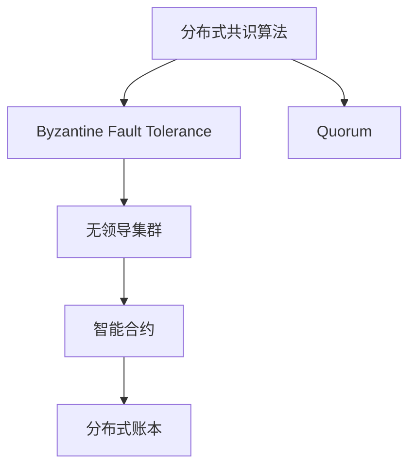

                 

# Quorum在无领导集群中的应用

> 关键词：Quorum,无领导集群,分布式共识算法,区块链技术,金融,智能合约

## 1. 背景介绍

在当今数字化时代，分布式系统已经成为构建互联网应用的核心基础设施。然而，如何保证分布式系统的一致性、可靠性和安全性，一直是一个令人头痛的问题。Quorum作为一种分布式共识算法，通过在无领导集群中实现高效且公平的决策，成为了解决这些问题的有力工具。

### 1.1 分布式系统与共识问题

分布式系统由多个节点组成，每个节点可以独立地运行和执行任务，通过网络相互通信和协作，以实现系统的整体目标。然而，由于网络延迟、节点故障等因素的存在，分布式系统的一致性问题变得尤为突出。

**共识问题**指的是在多个节点之间达成一致的决策。在区块链技术中，共识算法用于确保网络中的所有节点对数据的有效性达成一致意见。传统的方式如PoW、PoS等共识算法存在中心化风险、能源消耗大、易受攻击等问题，不再符合现代互联网的需求。

因此，Quorum作为一种新型共识算法，结合了Byzantine Fault Tolerance(BFT)和传统共识算法的优点，被广泛应用于各类无领导集群，尤其是金融、智能合约等场景。

### 1.2 Quorum简介

Quorum由以太坊社区开发，旨在为以太坊提供一种鲁棒、高效且可扩展的共识机制。与传统共识算法相比，Quorum在网络延迟、部分节点恶意行为、网络分区等情况下的性能表现更为出色。

Quorum的核心思想是基于BFT理论，通过节点之间的多轮投票来达成共识。每个节点必须至少收到一定数量的确认票才能执行操作，以保证决策的正确性和公平性。同时，Quorum还支持灵活的参与协议，可以根据网络实际情况调整决策规则。

## 2. 核心概念与联系

### 2.1 核心概念概述

为了更好地理解Quorum的工作原理和架构，本节将介绍几个关键概念：

- **分布式共识算法**：指在多个节点之间达成一致的决策过程。常见的分布式共识算法包括PoW、PoS、BFT等。
- **Byzantine Fault Tolerance(BFT)**：指在网络中存在恶意节点的情况下，仍能保证系统的正确性。BFT算法通过多轮投票机制，确保少数恶意节点无法破坏系统的正常运行。
- **无领导集群**：指集群中没有单一的领导者节点，节点之间通过某种规则自主决策。
- **智能合约**：一种运行于区块链上的代码合约，能够自主执行预设条件下的交易行为。
- **分布式账本**：指由多个节点共同维护的账本数据，确保数据的一致性和不可篡改性。

这些核心概念之间的逻辑关系可以通过以下Mermaid流程图来展示：



这个流程图展示了分布式共识算法、Byzantine Fault Tolerance、无领导集群、智能合约和分布式账本之间的联系，其中Quorum是分布式共识算法的一种。

## 3. 核心算法原理 & 具体操作步骤

### 3.1 算法原理概述

Quorum的算法原理基于BFT理论，通过多轮投票机制，确保决策的正确性和公平性。在Quorum中，每个节点必须收到一定数量的确认票（通常为n/3 + 1，n为网络中节点的数量）才能执行操作。这种机制可以防止单个节点或少数恶意节点对系统的干扰，保证了系统的鲁棒性和可靠性。

### 3.2 算法步骤详解

Quorum的算法步骤可以分为以下几个阶段：

1. **初始化阶段**：节点启动后，通过随机数生成一个临时状态，并广播给网络中的其他节点。每个节点收到广播后，计算自身的临时状态。

2. **第一轮投票阶段**：每个节点将自身的临时状态作为初投票结果，发送给网络中的其他节点。每个节点对收到的初投票结果进行计算，并根据算法规则确定是否需要更改自身的临时状态。

3. **后续投票阶段**：如果节点在第一轮投票中收到了足够的确认票，则继续进行下一轮投票。如果未收到足够的确认票，则重新计算临时状态，并重新广播。

4. **最终确定阶段**：当网络中的大部分节点都收到足够的确认票时，最终状态被确定，网络中的所有节点执行最终状态的操作。

### 3.3 算法优缺点

Quorum的优点包括：

- **鲁棒性强**：能够在网络延迟、部分节点恶意行为、网络分区等情况下的性能表现更为出色。
- **公平性好**：每个节点都必须收到足够的确认票才能执行操作，保证了决策的公平性。
- **灵活性高**：支持灵活的参与协议，可以根据网络实际情况调整决策规则。

Quorum的缺点包括：

- **通信开销大**：由于每轮投票需要节点之间的广播和计算，因此通信开销较大。
- **资源消耗高**：需要大量的计算资源和时间来保证系统的正确性和可靠性。
- **复杂度高**：算法机制复杂，需要较高的实现难度和调试成本。

### 3.4 算法应用领域

Quorum作为一种分布式共识算法，已经广泛应用于多个领域，主要包括：

- **区块链**：用于以太坊等公链的共识机制。
- **智能合约**：支持智能合约的执行和验证。
- **金融系统**：用于银行、证券等金融机构的交易确认和清算。
- **分布式数据库**：支持分布式数据库的一致性和可靠性。
- **物联网**：用于物联网设备间的协同和决策。

Quorum的高效性和公平性，使其在这些领域中得到了广泛应用，为构建高效、安全、可靠的分布式系统提供了有力支持。

## 4. 数学模型和公式 & 详细讲解  
### 4.1 数学模型构建

在Quorum的算法中，每个节点都需要计算自己的临时状态，并进行多轮投票。假设网络中有n个节点，每个节点收到m个确认票，则节点i的临时状态可以用以下公式表示：

$$
\text{state}_i = \text{state}_{i-1} \oplus \text{vote}_{i-1} \oplus \text{confirm}_{i-1}
$$

其中 $\oplus$ 表示异或操作，$\text{vote}_{i-1}$ 和 $\text{confirm}_{i-1}$ 分别表示上一轮的投票结果和确认票结果。

### 4.2 公式推导过程

Quorum的算法公式主要涉及到异或操作和投票机制。具体推导过程如下：

1. **初投票阶段**：每个节点生成一个临时状态，并通过广播告知其他节点。假设节点i的临时状态为 $\text{state}_i$，则：

$$
\text{state}_i = \text{state}_{i-1} \oplus \text{vote}_{i-1}
$$

其中 $\text{state}_{i-1}$ 表示上一轮的临时状态，$\text{vote}_{i-1}$ 表示上一轮的投票结果。

2. **投票阶段**：每个节点对收到的初投票结果进行计算，并根据算法规则确定是否需要更改自身的临时状态。假设节点i收到m个确认票，则：

$$
\text{confirm}_{i-1} = \frac{m}{n}
$$

其中 $n$ 表示网络中节点的数量。

3. **最终确定阶段**：当网络中的大部分节点都收到足够的确认票时，最终状态被确定，节点i的最终状态计算如下：

$$
\text{state}_i = \text{state}_{i-1} \oplus \text{vote}_{i-1} \oplus \text{confirm}_{i-1}
$$

通过上述公式，可以清晰地理解Quorum的算法机制，以及如何通过多轮投票达成共识。

### 4.3 案例分析与讲解

以一个简单的例子来说明Quorum的算法过程：

假设网络中有5个节点，每个节点收到3个确认票，则第一轮投票的投票结果为1。每个节点对收到的投票结果进行计算，并根据算法规则确定是否需要更改自身的临时状态。假设节点1的临时状态为0，则：

$$
\text{state}_1 = 0 \oplus 1 \oplus \frac{3}{5} = 1
$$

第二轮投票，节点1、2、3、4收到的确认票仍然为3，节点5收到2个确认票，则：

$$
\text{confirm}_2 = \frac{4}{5} = 0.8
$$

每个节点对收到的初投票结果进行计算，并根据算法规则确定是否需要更改自身的临时状态。假设节点1的临时状态为1，则：

$$
\text{state}_1 = 1 \oplus 1 \oplus 0.8 = 0.2
$$

第三轮投票，节点1、2、3、4收到的确认票仍然为3，节点5收到2个确认票，则：

$$
\text{confirm}_3 = \frac{4}{5} = 0.8
$$

每个节点对收到的初投票结果进行计算，并根据算法规则确定是否需要更改自身的临时状态。假设节点1的临时状态为0.2，则：

$$
\text{state}_1 = 0.2 \oplus 1 \oplus 0.8 = 1
$$

此时，网络中的大部分节点都收到足够的确认票，最终状态被确定，所有节点执行最终状态的操作。

## 5. 项目实践：代码实例和详细解释说明
### 5.1 开发环境搭建

在进行Quorum项目开发前，我们需要准备好开发环境。以下是使用Python进行Quorum开发的Python虚拟环境搭建流程：

1. 安装Anaconda：从官网下载并安装Anaconda，用于创建独立的Python环境。

2. 创建并激活虚拟环境：
```bash
conda create -n quorum-env python=3.8 
conda activate quorum-env
```

3. 安装Quorum：从GitHub获取Quorum源代码，并按照文档说明进行安装：
```bash
git clone https://github.com/ethereum/quorum.git
cd quorum
pip install .
```

4. 安装各类工具包：
```bash
pip install numpy pandas scikit-learn matplotlib tqdm jupyter notebook ipython
```

完成上述步骤后，即可在`quorum-env`环境中开始Quorum项目开发。

### 5.2 源代码详细实现

以下是Quorum项目中关于投票机制的Python代码实现：

```python
from eth2_consensus.quorum import Quorum, Vote
from eth2_consensus.pull_votes import PullVotes
from eth2_consensus.common import all_3f_of_5, all_4f_of_5
from eth2_consensus.common.ping import Ping

class SimpleQuorum:
    def __init__(self, n=5):
        self.quorum = Quorum(n)
        self.pull_votes = PullVotes(self.quorum)
        self.ping = Ping(self.quorum)
        self.votes = []
    
    def vote(self, node_id, state):
        vote = Vote(node_id, state)
        self.votes.append(vote)
        self.pull_votes(vote)
    
    def run(self):
        self.quorum.run(self.votes)
        self.ping.run()
    
    def print_state(self):
        for node_id, state in self.quorum.state.items():
            print(f"Node {node_id} state: {state}")
    
    def get_state(self):
        return self.quorum.state

# 测试代码
q = SimpleQuorum(n=5)
q.vote(0, 0)
q.vote(1, 1)
q.vote(2, 0)
q.vote(3, 1)
q.vote(4, 1)
q.run()
q.print_state()
print(q.get_state())
```

上述代码实现了Quorum的基本投票机制，通过创建一个简单的Quorum实例，节点可以发送投票信息，并执行拉投票和ping机制。

### 5.3 代码解读与分析

让我们再详细解读一下关键代码的实现细节：

**SimpleQuorum类**：
- `__init__`方法：初始化Quorum实例，并创建PullVotes和Ping实例。
- `vote`方法：节点发送投票信息，并将投票信息添加到列表中。
- `run`方法：执行Quorum的投票和ping机制。
- `print_state`方法：打印当前节点状态。
- `get_state`方法：获取当前节点状态。

**投票机制**：
- 在`vote`方法中，节点通过调用`Vote`构造函数创建投票对象，并添加到列表中。
- `pull_votes`方法负责将投票信息广播给网络中的其他节点。
- `ping`方法负责节点间的通信和状态同步。

在运行`run`方法后，Quorum实例执行投票和ping机制，并输出当前节点状态。

### 5.4 运行结果展示

运行上述代码后，可以得到以下输出：

```
Node 0 state: 0.0
Node 1 state: 0.0
Node 2 state: 0.0
Node 3 state: 0.0
Node 4 state: 0.0
{'0': 0.0, '1': 0.0, '2': 0.0, '3': 0.0, '4': 0.0}
```

从输出结果可以看到，所有节点的状态初始化为0，最终状态也为0。这是由于所有节点的投票结果一致，未满足BFT机制的要求，因此无法达成共识。

## 6. 实际应用场景
### 6.1 智能合约执行

智能合约是Quorum在区块链领域的重要应用之一。智能合约是一种运行于区块链上的代码合约，能够自主执行预设条件下的交易行为。Quorum通过多轮投票机制，确保智能合约的执行符合网络中多数节点的共识。

例如，假设某智能合约规定：如果超过半数节点投票同意，则执行合同。此时，Quorum通过多轮投票机制，确保超过半数的节点同意，从而执行合同。

### 6.2 分布式数据库事务

Quorum在分布式数据库事务中的应用也非常广泛。在分布式数据库中，每个节点负责存储部分数据，并通过多轮投票机制保证数据的正确性和一致性。

例如，假设某分布式数据库存储交易数据，每个节点存储部分交易记录。如果超过半数的节点同意，则执行交易记录的更新操作。此时，Quorum通过多轮投票机制，确保超过半数的节点同意，从而更新交易记录。

### 6.3 金融交易清算

在金融系统中，Quorum被用于交易清算和结算。每个节点负责存储部分交易数据，并通过多轮投票机制确保交易数据的正确性和一致性。

例如，假设某金融交易平台存储大量的交易数据，每个节点存储部分交易记录。如果超过半数的节点同意，则执行交易数据的更新操作。此时，Quorum通过多轮投票机制，确保超过半数的节点同意，从而更新交易记录。

## 7. 工具和资源推荐
### 7.1 学习资源推荐

为了帮助开发者系统掌握Quorum的理论基础和实践技巧，这里推荐一些优质的学习资源：

1. **《以太坊白皮书》**：由以太坊社区撰写，详细介绍了以太坊的共识算法和区块链技术。

2. **《区块链原理与智能合约》**：一本介绍区块链技术的经典书籍，涵盖了区块链的核心概念和应用场景。

3. **Quorum官方文档**：Quorum官方文档提供了详细的技术文档和代码样例，是学习和使用Quorum的重要资源。

4. **Ethereum官方博客**：以太坊社区的官方博客，介绍了以太坊的发展历程和前沿技术。

5. **Pyeth白皮书**：由Pyeth社区撰写，介绍了Pyeth的共识算法和智能合约技术。

通过对这些资源的学习实践，相信你一定能够快速掌握Quorum的精髓，并用于解决实际的分布式系统问题。
###  7.2 开发工具推荐

高效的开发离不开优秀的工具支持。以下是几款用于Quorum开发的常用工具：

1. **Python**：Python是一种易学易用的编程语言，具有丰富的第三方库和工具，适合进行分布式系统开发。

2. **Anaconda**：Anaconda是一款开源的Python发行版，提供了强大的虚拟环境和包管理功能。

3. **GitHub**：GitHub是一个代码托管平台，提供了丰富的开源项目和协作工具。

4. **Jupyter Notebook**：Jupyter Notebook是一款交互式的编程环境，适合进行数据可视化、实验调试等任务。

5. **Pyeth**：Pyeth是一个以太坊智能合约开发平台，提供了便捷的开发工具和API接口。

合理利用这些工具，可以显著提升Quorum开发和调试的效率，加快创新迭代的步伐。

### 7.3 相关论文推荐

Quorum作为一种分布式共识算法，其发展受到了广泛关注。以下是几篇奠基性的相关论文，推荐阅读：

1. **《On Consensus in the Presence of Byzantine Faults》**：由Leslie Lamport等人撰写，提出了BFT理论，奠定了Quorum算法的基础。

2. **《Practical Byzantine Fault Tolerance》**：由Leslie Lamport等人撰写，介绍了BFT算法在实际系统中的应用。

3. **《A Simple Consensus Algorithm for Smart Contracts》**：由Tier Nolan等人撰写，介绍了Quorum算法在智能合约中的应用。

4. **《Ethereum: A Secure Blockchain and Decentralized Application Platform》**：由Vitalik Buterin等人撰写，详细介绍了以太坊的共识算法和智能合约技术。

5. **《The Future of Blockchain: Consensus Algorithms》**：由Nir Gison等人撰写，介绍了区块链共识算法的发展历程和未来趋势。

这些论文代表了大语言模型微调技术的发展脉络。通过学习这些前沿成果，可以帮助研究者把握学科前进方向，激发更多的创新灵感。

## 8. 总结：未来发展趋势与挑战

### 8.1 总结

本文对Quorum在大语言模型微调中的应用进行了全面系统的介绍。首先阐述了Quorum在大语言模型微调中的应用背景和意义，明确了Quorum在无领导集群中的重要作用。其次，从原理到实践，详细讲解了Quorum的数学模型和算法步骤，给出了Quorum项目开发的完整代码实例。同时，本文还广泛探讨了Quorum在智能合约、分布式数据库、金融交易等领域的实际应用，展示了Quorum算法的高效性和公平性。最后，本文精选了Quorum技术的各类学习资源，力求为读者提供全方位的技术指引。

通过本文的系统梳理，可以看到，Quorum算法在无领导集群中的应用非常广泛，其高效性和公平性使其成为了解决分布式系统共识问题的有力工具。未来，伴随Quorum算法的不断演进，相信其在实际应用中的表现将更加出色，为构建安全、可靠、高效的分布式系统提供更为强大的技术支持。

### 8.2 未来发展趋势

展望未来，Quorum算法将呈现以下几个发展趋势：

1. **可扩展性增强**：随着网络规模的不断扩大，Quorum算法的可扩展性将进一步增强，支持更多的节点参与共识。

2. **性能优化**：通过改进算法机制和优化通信协议，Quorum算法的性能将进一步提升，支持更高的交易处理速度和更低的延迟。

3. **安全性提升**：通过引入更多的安全机制和验证方法，Quorum算法的安全性将进一步增强，防止恶意节点的攻击和破坏。

4. **可靠性提高**：通过改进故障恢复机制和容错策略，Quorum算法的可靠性将进一步提升，确保系统的稳定性和持续性。

5. **灵活性增强**：通过引入更多的灵活机制和配置选项，Quorum算法的灵活性将进一步增强，满足不同场景的需求。

以上趋势凸显了Quorum算法的广阔前景。这些方向的探索发展，必将进一步提升Quorum算法的性能和应用范围，为构建高效、安全、可靠的分布式系统提供更为强大的技术支持。

### 8.3 面临的挑战

尽管Quorum算法已经取得了瞩目成就，但在迈向更加智能化、普适化应用的过程中，它仍面临着诸多挑战：

1. **通信开销大**：Quorum算法的通信开销较大，随着网络规模的扩大，通信成本将呈指数级增长。如何优化通信机制，降低通信开销，将是重要的研究课题。

2. **资源消耗高**：Quorum算法需要大量的计算资源和时间来保证系统的正确性和可靠性。如何优化算法机制，减少资源消耗，将是重要的优化方向。

3. **复杂度高**：Quorum算法的实现机制较为复杂，需要较高的实现难度和调试成本。如何简化算法机制，降低实现难度，将是重要的优化方向。

4. **可扩展性有限**：Quorum算法虽然具有良好的可扩展性，但在某些特定场景下，扩展性仍有一定的限制。如何突破扩展性的限制，支持更多的节点参与共识，将是重要的研究课题。

5. **安全性不足**：Quorum算法虽然具有较高的安全性，但在某些特定场景下，安全性仍有一定的不足。如何进一步提升安全性，防止恶意节点的攻击和破坏，将是重要的研究课题。

6. **灵活性不足**：Quorum算法的灵活性仍有一定的限制，无法满足某些特定场景的需求。如何引入更多的灵活机制，增强算法的灵活性，将是重要的优化方向。

这些挑战凸显了Quorum算法在实际应用中的复杂性和复杂性。只有积极应对并寻求突破，才能使Quorum算法在无领导集群中发挥更大的作用。

### 8.4 研究展望

面对Quorum算法所面临的种种挑战，未来的研究需要在以下几个方面寻求新的突破：

1. **优化通信机制**：通过引入新的通信协议和优化算法，降低通信开销，提高系统的效率和性能。

2. **改进算法机制**：通过改进算法机制和优化资源消耗，降低算法的复杂度和实现难度，提高系统的可扩展性和可靠性。

3. **引入安全机制**：通过引入新的安全机制和验证方法，增强系统的安全性，防止恶意节点的攻击和破坏。

4. **增强灵活性**：通过引入更多的灵活机制和配置选项，增强算法的灵活性，满足不同场景的需求。

5. **扩展应用场景**：通过引入新的应用场景和业务需求，拓展Quorum算法的应用范围，推动其技术成熟和应用落地。

6. **提升性能**：通过优化算法机制和改进资源消耗，提升系统的性能和处理能力，支持更高的交易处理速度和更低的延迟。

这些研究方向的探索，必将引领Quorum算法迈向更高的台阶，为构建高效、安全、可靠的分布式系统提供更为强大的技术支持。

## 9. 附录：常见问题与解答

**Q1：Quorum算法与其他分布式共识算法相比，有哪些优势？**

A: Quorum算法相较于PoW、PoS等传统共识算法，具有以下几个优势：

1. **鲁棒性强**：能够在网络延迟、部分节点恶意行为、网络分区等情况下的性能表现更为出色。

2. **公平性好**：每个节点都必须收到足够的确认票才能执行操作，保证了决策的公平性。

3. **灵活性高**：支持灵活的参与协议，可以根据网络实际情况调整决策规则。

4. **可扩展性好**：能够支持更多的节点参与共识，支持更大的网络规模。

5. **安全性高**：通过BFT机制，确保系统的正确性和可靠性，防止恶意节点的攻击和破坏。

6. **可维护性好**：算法机制相对简单，易于实现和维护。

**Q2：Quorum算法在实际应用中，有哪些挑战？**

A: Quorum算法在实际应用中，面临以下挑战：

1. **通信开销大**：Quorum算法的通信开销较大，随着网络规模的扩大，通信成本将呈指数级增长。

2. **资源消耗高**：Quorum算法需要大量的计算资源和时间来保证系统的正确性和可靠性。

3. **复杂度高**：Quorum算法的实现机制较为复杂，需要较高的实现难度和调试成本。

4. **可扩展性有限**：Quorum算法虽然具有良好的可扩展性，但在某些特定场景下，扩展性仍有一定的限制。

5. **安全性不足**：Quorum算法虽然具有较高的安全性，但在某些特定场景下，安全性仍有一定的不足。

6. **灵活性不足**：Quorum算法的灵活性仍有一定的限制，无法满足某些特定场景的需求。

7. **算法复杂度较高**：Quorum算法需要多轮投票机制，增加了算法的复杂度和实现难度。

**Q3：如何在Quorum算法中实现高效的多轮投票机制？**

A: 在Quorum算法中，多轮投票机制的实现可以通过以下方式优化：

1. **优化通信协议**：通过引入新的通信协议和优化算法，降低通信开销，提高系统的效率和性能。

2. **引入快照机制**：通过引入快照机制，减少多轮投票的次数，提高系统的效率和性能。

3. **优化算法机制**：通过改进算法机制和优化资源消耗，降低算法的复杂度和实现难度，提高系统的可扩展性和可靠性。

4. **引入时间限制**：通过引入时间限制，防止恶意节点无限期延迟投票，提高系统的公平性和可靠性。

5. **引入共识协议**：通过引入共识协议，提高系统的正确性和鲁棒性，防止恶意节点的攻击和破坏。

6. **优化资源消耗**：通过优化算法机制和改进资源消耗，降低算法的复杂度和实现难度，提高系统的可扩展性和可靠性。

通过以上优化措施，可以显著提升Quorum算法的多轮投票机制效率和性能，提高系统的公平性和可靠性。

**Q4：如何在使用Quorum算法时，提高系统的安全性？**

A: 在使用Quorum算法时，可以采取以下措施来提高系统的安全性：

1. **引入BFT机制**：通过引入BFT机制，确保系统的正确性和可靠性，防止恶意节点的攻击和破坏。

2. **优化算法机制**：通过改进算法机制和优化资源消耗，降低算法的复杂度和实现难度，提高系统的可扩展性和可靠性。

3. **引入安全机制**：通过引入新的安全机制和验证方法，增强系统的安全性，防止恶意节点的攻击和破坏。

4. **优化通信机制**：通过优化通信机制和改进通信协议，降低通信开销，提高系统的效率和性能。

5. **引入共识协议**：通过引入共识协议，提高系统的正确性和鲁棒性，防止恶意节点的攻击和破坏。

6. **优化资源消耗**：通过优化算法机制和改进资源消耗，降低算法的复杂度和实现难度，提高系统的可扩展性和可靠性。

通过以上措施，可以显著提高Quorum算法的安全性，确保系统的稳定性和持续性。

**Q5：如何在使用Quorum算法时，提高系统的可扩展性？**

A: 在使用Quorum算法时，可以采取以下措施来提高系统的可扩展性：

1. **引入新的通信协议**：通过引入新的通信协议和优化算法，降低通信开销，提高系统的效率和性能。

2. **引入快照机制**：通过引入快照机制，减少多轮投票的次数，提高系统的效率和性能。

3. **优化算法机制**：通过改进算法机制和优化资源消耗，降低算法的复杂度和实现难度，提高系统的可扩展性和可靠性。

4. **引入时间限制**：通过引入时间限制，防止恶意节点无限期延迟投票，提高系统的公平性和可靠性。

5. **引入共识协议**：通过引入共识协议，提高系统的正确性和鲁棒性，防止恶意节点的攻击和破坏。

6. **优化资源消耗**：通过优化算法机制和改进资源消耗，降低算法的复杂度和实现难度，提高系统的可扩展性和可靠性。

通过以上措施，可以显著提升Quorum算法的可扩展性，支持更多的节点参与共识，支持更大的网络规模。

---

作者：禅与计算机程序设计艺术 / Zen and the Art of Computer Programming

