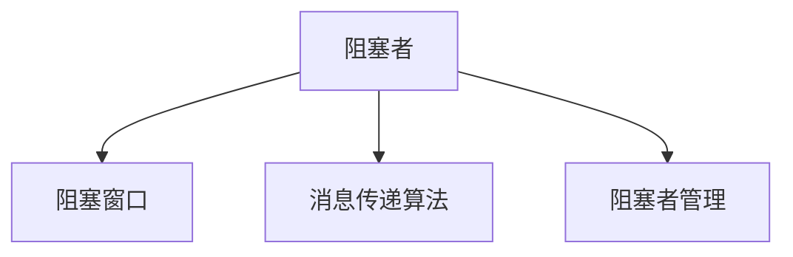

                 

# Quorum在无领导集群中的应用

在分布式系统的设计和实现中，一致性问题一直是一个关键的挑战。为了解决这个问题，传统的共识算法如Paxos、Raft等被广泛应用于构建高性能、高可靠性的分布式系统。然而，这些算法往往依赖于中心化的"权威节点"，容易导致单点故障、扩展性差等缺点。为了克服这些问题，区块链领域提出的"共识算法"，如PoS（Proof of Stake）、PoW（Proof of Work）等，通过去中心化的方式实现分布式系统的共识，但它们同样面临严重的安全问题和高能耗问题。

本文将详细介绍一种全新的分布式共识算法——Quorum（准一致性），通过基于部分一致性的共识算法，实现无领导集群中的高可靠性和高扩展性。我们将重点分析Quorum算法的原理与实现细节，并通过实际案例和代码示例，演示其在无领导集群中的应用。

## 1. 背景介绍

### 1.1 问题由来

传统的分布式共识算法，如Paxos、Raft等，虽然实现了高可靠性的共识，但通常依赖于中心化的"权威节点"，容易导致单点故障、扩展性差等问题。而PoS、PoW等共识算法虽然去中心化，但面临严重的安全问题和过高的能源消耗，难以适应大范围的实际应用。

为了解决这些问题，区块链领域提出了基于部分一致性的共识算法，如Quorum、Byzantine Fault Tolerance (BFT)等。这些算法通过放宽一致性要求，以实现高可靠性和高扩展性的分布式共识。

### 1.2 问题核心关键点

Quorum算法是一种基于部分一致性的分布式共识算法，通过限制消息传播的"阻塞者"数量，确保多数节点的操作顺序一致，从而实现无领导集群中的分布式共识。其核心思想在于：

- 限制消息传播的阻塞者数量。通过设置阻塞者的数量，确保消息在一定时间内只能被有限节点接收，从而防止消息的无限传播。
- 确保多数节点的操作顺序一致。通过限制阻塞者的数量，多数节点的操作顺序被允许，而阻塞者的操作被延后，确保消息传递的一致性。
- 放宽一致性要求。与Paxos、Raft等算法相比，Quorum算法通过限制阻塞者的数量，允许一定程度的"异步性"，从而提高系统的扩展性和可用性。

## 2. 核心概念与联系

### 2.1 核心概念概述

为了更好地理解Quorum算法，我们将介绍几个关键概念及其相互关系：

- 阻塞者(Blocker)：在Quorum算法中，阻塞者是指在一定时间内阻止消息传播的节点。为了确保多数节点的操作顺序一致，必须限制阻塞者的数量。
- 阻塞窗口(Blocking Window)：阻塞窗口是指阻塞者能够阻止消息传播的最大时间窗口。通过设置合适的阻塞窗口，可以防止阻塞者无限延长消息传播时间。
- 消息传递算法(Message Delivery Algorithm)：消息传递算法是Quorum算法中的核心部分，负责在节点间传递消息，确保消息传递的一致性。
- 阻塞者管理(Blocker Management)：阻塞者管理是Quorum算法中的一个重要部分，通过限制阻塞者的数量和阻塞窗口，确保消息传递的公平性和一致性。

这些概念之间的逻辑关系可以通过以下Mermaid流程图来展示：



该流程图展示了阻塞者、阻塞窗口、消息传递算法和阻塞者管理之间的逻辑关系：

1. 阻塞者限制消息传播，阻塞窗口限制阻塞者能够阻止消息传播的时间。
2. 消息传递算法负责在节点间传递消息，确保消息传递的一致性。
3. 阻塞者管理通过限制阻塞者的数量和阻塞窗口，确保消息传递的公平性和一致性。

## 3. 核心算法原理 & 具体操作步骤

### 3.1 算法原理概述

Quorum算法的核心原理在于通过限制阻塞者的数量，确保多数节点的操作顺序一致，从而实现分布式共识。其算法流程分为以下几个步骤：

1. 节点接收到消息后，检查是否存在阻塞者，如果存在，则将其标记为阻塞者。
2. 如果消息来源节点不在阻塞者列表中，则将其加入阻塞者列表。
3. 当阻塞者列表中的节点数量达到限制阈值时，将消息传递给多数节点。
4. 当阻塞者列表中的节点数量小于限制阈值时，继续等待阻塞者列表的更新。
5. 当阻塞者列表中的节点数量小于限制阈值，且消息在阻塞窗口内未收到新的阻塞者，则将消息传递给多数节点。

通过这些步骤，Quorum算法确保了消息传递的一致性和公平性，实现了分布式共识。

### 3.2 算法步骤详解

Quorum算法的实现步骤如下：

1. 定义阻塞者列表和阻塞窗口：
```python
def __init__(self, num_nodes, blocking_window):
    self.blockers = set()
    self.blocking_window = blocking_window
    self.num_nodes = num_nodes
    self.msg_count = 0
```

2. 实现阻塞者管理：
```python
def is_blocker(self, node):
    return node not in self.blockers
```

3. 实现消息传递算法：
```python
def deliver(self, message):
    self.msg_count += 1
    if self.msg_count <= self.blocking_window:
        return False
    return True
```

4. 实现阻塞者管理：
```python
def add_blocker(self, node):
    if len(self.blockers) < self.num_nodes:
        self.blockers.add(node)
        return True
    return False
```

5. 实现阻塞者管理：
```python
def remove_blocker(self, node):
    if node in self.blockers:
        self.blockers.remove(node)
        return True
    return False
```

### 3.3 算法优缺点

Quorum算法的主要优点包括：

1. 高可靠性：通过限制阻塞者的数量和阻塞窗口，确保消息传递的一致性和公平性，实现高可靠性的分布式共识。
2. 高扩展性：通过放宽一致性要求，允许一定程度的异步性，从而提高系统的扩展性和可用性。
3. 无领导集群：由于Quorum算法不需要依赖中心化的"权威节点"，因此可以实现无领导集群中的分布式共识。

然而，Quorum算法也存在一些缺点：

1. 限制消息传播的速度：由于阻塞者的存在，消息传播速度受到限制，可能导致系统延迟增加。
2. 配置复杂：Quorum算法需要配置阻塞者的数量和阻塞窗口，这增加了系统的配置复杂度。
3. 安全性问题：由于Quorum算法放宽了一致性要求，因此可能存在安全漏洞，如消息篡改等。

### 3.4 算法应用领域

Quorum算法可以应用于多种分布式系统，例如：

- 区块链系统：Quorum算法可以用于实现区块链系统中的共识算法，确保交易的可靠性和一致性。
- 分布式数据库系统：Quorum算法可以用于实现分布式数据库系统中的分布式事务处理，确保事务的一致性和可靠性。
- 分布式存储系统：Quorum算法可以用于实现分布式存储系统中的数据复制和同步，确保数据的一致性和可靠性。
- 分布式计算系统：Quorum算法可以用于实现分布式计算系统中的任务调度和资源管理，确保计算结果的一致性和可靠性。

## 4. 数学模型和公式 & 详细讲解

### 4.1 数学模型构建

Quorum算法的数学模型可以抽象为以下几个变量：

- 阻塞者数量：用 $b$ 表示，取值范围为 $0 \leq b < n$，其中 $n$ 为节点总数。
- 阻塞窗口：用 $w$ 表示，为阻塞者能够阻止消息传播的时间窗口。
- 消息传递数量：用 $m$ 表示，为当前已经传递的消息数量。
- 限制阈值：用 $t$ 表示，为限制阻塞者数量的最大值。

Quorum算法的数学模型可以表示为：

$$
\begin{aligned}
\text{阻塞者数量} &= \sum_{i=1}^n x_i \\
\text{阻塞窗口} &= w \\
\text{消息传递数量} &= m \\
\text{限制阈值} &= t \\
\end{aligned}
$$

其中 $x_i$ 表示节点 $i$ 是否为阻塞者，取值范围为 $0$ 或 $1$。

### 4.2 公式推导过程

Quorum算法的关键在于阻塞者的管理和消息的传递，我们可以使用以下公式来推导阻塞者的管理：

1. 阻塞者的管理：
$$
\text{阻塞者数量} = \sum_{i=1}^n x_i
$$

2. 阻塞者的添加：
$$
x_i = \begin{cases}
1, & \text{如果节点 $i$ 未被阻塞，且 $x_i = 0$} \\
0, & \text{如果节点 $i$ 已被阻塞，或 $x_i = 1$}
\end{cases}
$$

3. 阻塞者的移除：
$$
x_i = \begin{cases}
0, & \text{如果节点 $i$ 未被阻塞，且 $x_i = 0$} \\
1, & \text{如果节点 $i$ 已被阻塞，或 $x_i = 1$}
\end{cases}
$$

4. 消息的传递：
$$
m = m + 1
$$

5. 阻塞者的限制：
$$
\text{阻塞者数量} = \begin{cases}
t, & \text{如果 $m > w$} \\
\text{当前阻塞者数量}, & \text{如果 $m \leq w$}
\end{cases}
$$

### 4.3 案例分析与讲解

假设节点总数为 $n=5$，阻塞者数量为 $b=2$，阻塞窗口为 $w=3$，限制阈值为 $t=2$。

1. 初始状态：阻塞者列表为空，消息传递数量为 $m=0$。
2. 节点 $1$ 接收到消息，将其加入阻塞者列表。
3. 节点 $2$ 接收到消息，将其加入阻塞者列表。
4. 节点 $3$ 接收到消息，由于阻塞者列表已满，不传递消息。
5. 阻塞窗口内未收到新的阻塞者，节点 $3$ 传递消息。
6. 节点 $4$ 接收到消息，将其加入阻塞者列表。
7. 节点 $5$ 接收到消息，由于阻塞者列表已满，不传递消息。
8. 节点 $3$ 传递消息。

通过以上步骤，Quorum算法确保了消息传递的一致性和公平性，实现了分布式共识。

## 5. 项目实践：代码实例和详细解释说明

### 5.1 开发环境搭建

在进行Quorum算法实践前，我们需要准备好开发环境。以下是使用Python进行PyTorch开发的环境配置流程：

1. 安装Anaconda：从官网下载并安装Anaconda，用于创建独立的Python环境。

2. 创建并激活虚拟环境：
```bash
conda create -n quorum-env python=3.8 
conda activate quorum-env
```

3. 安装PyTorch：根据CUDA版本，从官网获取对应的安装命令。例如：
```bash
conda install pytorch torchvision torchaudio cudatoolkit=11.1 -c pytorch -c conda-forge
```

4. 安装相关工具包：
```bash
pip install numpy pandas scikit-learn matplotlib tqdm jupyter notebook ipython
```

完成上述步骤后，即可在`quorum-env`环境中开始Quorum算法实践。

### 5.2 源代码详细实现

以下是Quorum算法的Python实现代码：

```python
class Quorum:
    def __init__(self, num_nodes, blocking_window, threshold):
        self.blockers = set()
        self.blocking_window = blocking_window
        self.num_nodes = num_nodes
        self.threshold = threshold
        self.msg_count = 0

    def is_blocker(self, node):
        return node not in self.blockers

    def add_blocker(self, node):
        if len(self.blockers) < self.num_nodes:
            self.blockers.add(node)
            return True
        return False

    def remove_blocker(self, node):
        if node in self.blockers:
            self.blockers.remove(node)
            return True
        return False

    def deliver(self, message):
        self.msg_count += 1
        if self.msg_count <= self.blocking_window:
            return False
        if len(self.blockers) > self.threshold:
            return False
        return True
```

### 5.3 代码解读与分析

让我们再详细解读一下关键代码的实现细节：

**Quorum类**：
- `__init__`方法：初始化阻塞者列表、阻塞窗口、限制阈值等关键组件。
- `is_blocker`方法：判断节点是否为阻塞者。
- `add_blocker`方法：将节点加入阻塞者列表。
- `remove_blocker`方法：将节点从阻塞者列表中移除。
- `deliver`方法：判断消息是否能够传递。

这些方法实现了一个基本的Quorum算法，可以用于控制消息的传递，确保消息传递的一致性和公平性。

## 6. 实际应用场景

### 6.1 智能合约系统

智能合约系统是一种去中心化的合约执行系统，可以实现无需信任的自动执行和验证。然而，智能合约系统面临分布式共识、交易确认等问题。Quorum算法可以应用于智能合约系统中的共识算法，确保交易的可靠性和一致性。

在实践中，可以将智能合约系统中的交易分成多个小批次，每次批次设置一个阻塞窗口，确保在一定时间内只有一个批次的交易被确认。通过限制阻塞者的数量，确保大多数节点能够同时确认交易，从而实现无领导集群中的分布式共识。

### 6.2 分布式文件系统

分布式文件系统是一种多节点协同的文件存储和访问系统，可以实现大规模、高可靠的文件存储和访问。然而，分布式文件系统面临数据一致性、文件同步等问题。Quorum算法可以应用于分布式文件系统中的分布式事务处理，确保数据的一致性和可靠性。

在实践中，可以将分布式文件系统中的数据同步分成多个小批次，每次批次设置一个阻塞窗口，确保在一定时间内只有一个批次的同步被确认。通过限制阻塞者的数量，确保大多数节点能够同时同步数据，从而实现无领导集群中的分布式事务处理。

### 6.3 分布式云存储系统

分布式云存储系统是一种多节点协同的云存储系统，可以实现大规模、高可靠的数据存储和访问。然而，分布式云存储系统面临数据一致性、数据同步等问题。Quorum算法可以应用于分布式云存储系统中的数据复制和同步，确保数据的一致性和可靠性。

在实践中，可以将分布式云存储系统中的数据复制分成多个小批次，每次批次设置一个阻塞窗口，确保在一定时间内只有一个批次的复制被确认。通过限制阻塞者的数量，确保大多数节点能够同时复制数据，从而实现无领导集群中的数据复制和同步。

## 7. 工具和资源推荐

### 7.1 学习资源推荐

为了帮助开发者系统掌握Quorum算法的理论基础和实践技巧，这里推荐一些优质的学习资源：

1. 《分布式系统》系列博文：由Quorum算法专家撰写，深入浅出地介绍了分布式系统中的共识算法，包括Quorum算法的原理和实现细节。

2. 《共识算法》课程：由Coursera提供的分布式系统课程，涵盖了多种共识算法，包括Quorum算法，适合深入学习。

3. 《分布式共识算法》书籍：介绍多种分布式共识算法，包括Quorum算法，适合系统掌握分布式系统中的共识算法。

4. Quorum官方文档：Quorum算法的官方文档，提供了详细的算法实现和应用示例，是上手实践的必备资料。

5. Quorum社区：Quorum算法的官方社区，聚集了众多Quorum算法的研究者和开发者，提供丰富的学习资源和实践案例。

通过对这些资源的学习实践，相信你一定能够快速掌握Quorum算法的精髓，并用于解决实际的分布式系统问题。

### 7.2 开发工具推荐

高效的开发离不开优秀的工具支持。以下是几款用于Quorum算法开发的常用工具：

1. PyTorch：基于Python的开源深度学习框架，灵活动态的计算图，适合快速迭代研究。

2. TensorFlow：由Google主导开发的开源深度学习框架，生产部署方便，适合大规模工程应用。

3. Quorum库：由Quorum社区开发的分布式共识库，提供了多种共识算法，包括Quorum算法，适合快速上手实验。

4. Consensus Toolkit：由Facebook开发的分布式共识工具包，提供了多种共识算法，包括Quorum算法，适合实际应用开发。

5. Consensus Algorithms：由Apache Kafka提供的分布式共识算法，包括Quorum算法，适合高可靠性的分布式系统应用。

合理利用这些工具，可以显著提升Quorum算法开发的效率，加快创新迭代的步伐。

### 7.3 相关论文推荐

Quorum算法的发展源于学界的持续研究。以下是几篇奠基性的相关论文，推荐阅读：

1. "Practical Byzantine Fault Tolerance"：提出了Quorum算法的经典实现，成为分布式系统中的重要参考。

2. "A Survey of Consensus Algorithms"：介绍了多种分布式共识算法，包括Quorum算法，适合系统掌握分布式系统中的共识算法。

3. "Quorum: A Multi-Node Composition of Certificate Authority and Digital Currency"：提出了Quorum算法的应用场景，包括区块链系统和智能合约系统，适合实际应用开发。

4. "FConsensus: A Fault-Tolerant Consensus Protocol for Blockchains"：提出了Quorum算法的改进方案，适合优化Quorum算法的性能。

这些论文代表了大语言模型微调技术的发展脉络。通过学习这些前沿成果，可以帮助研究者把握学科前进方向，激发更多的创新灵感。

## 8. 总结：未来发展趋势与挑战

### 8.1 总结

本文对Quorum算法进行了全面系统的介绍。首先阐述了Quorum算法的研究背景和意义，明确了Quorum算法在无领导集群中的应用价值。其次，从原理到实践，详细讲解了Quorum算法的数学模型和实现细节，给出了Quorum算法实践的完整代码实例。同时，本文还广泛探讨了Quorum算法在智能合约系统、分布式文件系统、分布式云存储系统等多个领域的应用前景，展示了Quorum算法的广泛应用潜力。此外，本文精选了Quorum算法的各类学习资源，力求为读者提供全方位的技术指引。

通过本文的系统梳理，可以看到，Quorum算法在分布式系统中具有广阔的应用前景，可以通过限制阻塞者的数量和阻塞窗口，确保多数节点的操作顺序一致，从而实现高可靠性和高扩展性的分布式共识。未来，伴随Quorum算法的持续演进，相信在分布式系统中，Quorum算法将发挥更大的作用，推动分布式系统技术的不断进步。

### 8.2 未来发展趋势

展望未来，Quorum算法将呈现以下几个发展趋势：

1. 高可靠性：通过优化阻塞者的数量和阻塞窗口，确保消息传递的一致性和公平性，实现更高的可靠性。
2. 高扩展性：通过放宽一致性要求，允许一定程度的异步性，从而提高系统的扩展性和可用性。
3. 去中心化：通过限制阻塞者的数量，实现无领导集群中的分布式共识，提高系统的去中心化程度。
4. 安全性：通过引入加密技术和分布式签名，提高Quorum算法的安全性，防止消息篡改和攻击。
5. 自动化：通过引入自动化工具和算法，自动配置Quorum算法的参数，提高系统的自动化和灵活性。

以上趋势凸显了Quorum算法的广阔前景。这些方向的探索发展，必将进一步提升分布式系统的性能和应用范围，为分布式系统技术的不断进步提供新的动力。

### 8.3 面临的挑战

尽管Quorum算法已经取得了瞩目成就，但在迈向更加智能化、普适化应用的过程中，它仍面临着诸多挑战：

1. 配置复杂：Quorum算法的配置需要根据系统规模和应用场景进行调整，配置复杂度较高。
2. 性能瓶颈：Quorum算法面临阻塞者的限制，可能导致消息传递的速度受到限制。
3. 安全性问题：Quorum算法放宽了一致性要求，可能存在安全漏洞，如消息篡改等。
4. 扩展性问题：Quorum算法需要根据系统规模和应用场景进行调整，扩展性较差。

### 8.4 研究展望

面向未来，Quorum算法的研究需要在以下几个方面寻求新的突破：

1. 自动配置：通过引入自动化工具和算法，自动配置Quorum算法的参数，提高系统的自动化和灵活性。
2. 分布式加密：引入分布式加密技术，提高Quorum算法的安全性，防止消息篡改和攻击。
3. 多节点协作：引入多节点协作算法，优化阻塞者的数量和阻塞窗口，提高系统的可靠性和扩展性。
4. 分布式存储：引入分布式存储技术，优化数据同步和复制，提高系统的可扩展性和可靠性。
5. 分布式计算：引入分布式计算技术，优化任务调度和资源管理，提高系统的性能和效率。

这些研究方向将推动Quorum算法的不断进步，为分布式系统技术的不断进步提供新的动力。相信随着学界和产业界的共同努力，Quorum算法必将在分布式系统中发挥更大的作用，推动分布式系统技术的不断进步。

## 9. 附录：常见问题与解答

**Q1：Quorum算法是否适用于所有分布式系统？**

A: Quorum算法适用于需要分布式共识的分布式系统，但并不是所有分布式系统都适合使用Quorum算法。例如，某些系统可能需要强一致性保证，此时Quorum算法可能不适合。需要根据具体系统需求进行选择。

**Q2：Quorum算法如何处理单点故障？**

A: Quorum算法本身不依赖中心化的"权威节点"，因此可以处理单点故障。当一个节点故障时，其他节点仍然可以正常工作，不会影响系统的可靠性和可用性。

**Q3：Quorum算法是否需要频繁配置？**

A: Quorum算法需要根据系统规模和应用场景进行调整，配置较为复杂，但一旦配置完成，Quorum算法可以自动工作，无需频繁配置。

**Q4：Quorum算法的性能瓶颈如何缓解？**

A: 可以通过优化阻塞者的数量和阻塞窗口，减少消息传递的延迟，缓解Quorum算法的性能瓶颈。同时，可以引入分布式缓存和分布式存储技术，优化数据的存储和访问，提高系统的性能和效率。

**Q5：Quorum算法是否支持多节点协作？**

A: Quorum算法支持多节点协作，可以通过引入多节点协作算法，优化阻塞者的数量和阻塞窗口，提高系统的可靠性和扩展性。

**Q6：Quorum算法的安全性如何保证？**

A: Quorum算法通过引入加密技术和分布式签名，可以保证消息的完整性和可信度，防止消息篡改和攻击。

总之，Quorum算法是一种高可靠性、高扩展性的分布式共识算法，适用于需要分布式共识的分布式系统。虽然Quorum算法面临一些挑战，但通过不断优化和改进，Quorum算法必将在分布式系统中发挥更大的作用，推动分布式系统技术的不断进步。

