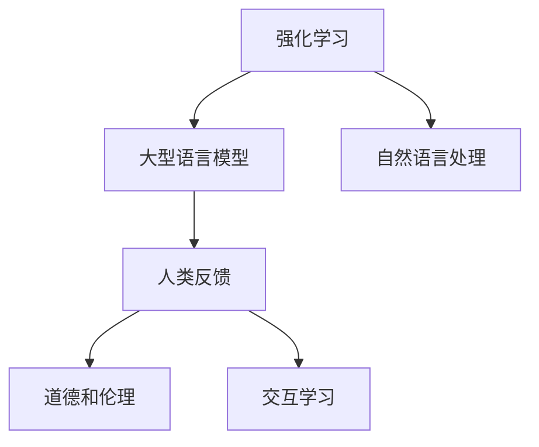

                 

# RLHF：利用人类反馈

> 关键词：Reinforcement Learning in Human Feedback (RLHF), 人工智能, 人类反馈, 深度学习, 自然语言处理, 道德与伦理

## 1. 背景介绍

### 1.1 问题由来
随着人工智能(AI)技术的不断进步，大型语言模型(Large Language Model, LLM)在自然语言处理(Natural Language Processing, NLP)领域取得了令人瞩目的成就。这些模型通过海量的无标签数据进行预训练，获得了强大的语言理解和生成能力，例如GPT-3、BERT等。然而，这些模型通常缺乏人类常识，难以准确理解人类语言中的复杂含义和语境。此外，这些模型还存在一定的偏见和歧视问题，不能完全胜任与人类进行有意义的对话。

为了解决这些问题，研究人员提出了强化学习在人类反馈(Reinforcement Learning in Human Feedback, RLHF)的方法，利用人类的反馈来指导模型的训练。这种方法不仅能够提升模型的常识推理和道德意识，还能缓解模型偏见，增强与人类对话的质量和安全性。

### 1.2 问题核心关键点
RLHF的核心思想是利用人类反馈来引导模型的训练过程，具体体现在以下几个方面：
- **自然语言处理(NLP)**：使用人类编写的任务描述和示例作为训练数据。
- **强化学习(Reinforcement Learning)**：将人类反馈作为奖励信号，引导模型在不同任务上的优化。
- **道德和伦理**：通过设计合适的奖励机制，避免模型输出有害内容或歧视性言论。
- **互动式学习**：模型通过与人类互动，不断学习和改进，提升其在复杂场景下的处理能力。

RLHF在众多领域得到了广泛应用，如客服、教育、内容生成等，展现了其在提升模型性能、缓解偏见和提升伦理意识方面的巨大潜力。

### 1.3 问题研究意义
RLHF的研究和应用具有重要意义，主要体现在以下几个方面：
- **提高模型性能**：利用人类反馈可以更有效地训练模型，提升其在NLP任务上的表现。
- **缓解模型偏见**：通过合适的奖励机制，避免模型输出有害或歧视性内容，增强模型伦理意识。
- **增强互动体验**：在与人类的互动中，模型能够学习更加自然的语言表达和行为准则，提升与人类交流的质量。
- **推动NLP技术发展**：RLHF为NLP技术的进一步发展提供了新的思路和方法，推动其向更加智能化、普适化方向前进。

## 2. 核心概念与联系

### 2.1 核心概念概述

为了更好地理解RLHF方法，本节将介绍几个密切相关的核心概念：

- **强化学习(Reinforcement Learning, RL)**：一种通过试错不断优化策略的机器学习技术，其目标是通过环境中的奖励信号指导智能体采取最优行动。
- **人类反馈(Human Feedback)**：人类对模型输出的评价和建议，包括正向反馈和负向反馈，用于指导模型的学习和改进。
- **大型语言模型(Large Language Model, LLM)**：通过大规模无标签数据预训练，具备强大语言生成和理解能力的深度学习模型，如GPT、BERT等。
- **道德和伦理(Ethics and Morality)**：模型输出的责任和行为准则，避免有害输出和歧视性言论，提升社会信任和接受度。
- **交互学习(Interactive Learning)**：模型通过与人类互动不断学习和改进，提升其对复杂场景的理解和处理能力。

这些核心概念之间的逻辑关系可以通过以下Mermaid流程图来展示：



这个流程图展示了大语言模型在RLHF中的应用路径：

1. 通过预训练获得基础能力。
2. 利用自然语言处理技术，处理人类提供的任务描述和示例。
3. 使用强化学习引导模型在不同任务上的优化。
4. 引入人类反馈和道德伦理约束，避免有害输出和偏见。
5. 通过交互学习不断提升模型性能和伦理意识。

这些概念共同构成了RLHF的学习框架，使得大语言模型在与人类的互动中不断学习和改进，提升其智能水平和社会责任。

## 3. 核心算法原理 & 具体操作步骤

### 3.1 算法原理概述

RLHF方法通过将人类反馈作为奖励信号，利用强化学习技术来指导模型在特定任务上的学习和优化。其核心算法流程如下：

1. **预训练**：在大规模无标签数据上预训练大型语言模型，获得初始的通用语言表示。
2. **任务适配**：根据目标任务，设计合适的任务适配层和奖励函数。
3. **强化学习**：将任务适配后的模型与人类交互，收集人类反馈作为奖励信号，利用强化学习优化模型参数。
4. **道德约束**：引入道德和伦理约束，避免模型输出有害或歧视性内容。
5. **迭代优化**：不断重复上述步骤，通过交互学习不断提升模型性能和伦理意识。

### 3.2 算法步骤详解

以下是RLHF的详细算法步骤：

**Step 1: 准备预训练模型和数据集**

- 选择合适的预训练语言模型（如GPT-3、BERT等）作为初始化参数。
- 准备目标任务的训练数据集，包括文本描述和示例数据。
- 将文本描述转换为模型可处理的格式，如向量化表示。

**Step 2: 任务适配与奖励函数设计**

- 根据任务类型，设计合适的任务适配层和损失函数。例如，分类任务可使用交叉熵损失，生成任务可使用负对数似然损失。
- 设计适当的奖励函数，将人类反馈转换为奖励信号。奖励函数应能够区分正向反馈和负向反馈，并对不同任务设置不同的权重。

**Step 3: 强化学习训练**

- 将任务适配后的模型与人类交互，收集人类反馈作为奖励信号。
- 利用强化学习算法（如REINFORCE、PPO等）优化模型参数，最小化期望损失。
- 设置合适的学习率和迭代次数，控制训练过程的收敛性和效率。

**Step 4: 道德约束和迭代优化**

- 引入道德和伦理约束，设计适当的惩罚机制，避免模型输出有害或歧视性内容。
- 将道德约束融入强化学习过程，通过调整奖励函数实现。
- 不断重复上述步骤，通过迭代优化提升模型性能和伦理意识。

### 3.3 算法优缺点

RLHF方法具有以下优点：
1. **提升模型性能**：利用人类反馈可以更有效地训练模型，提升其在特定任务上的表现。
2. **缓解模型偏见**：通过道德和伦理约束，避免模型输出有害或歧视性内容，增强模型伦理意识。
3. **增强互动体验**：模型通过与人类互动不断学习和改进，提升其对复杂场景的理解和处理能力。

同时，该方法也存在一定的局限性：
1. **依赖人类反馈**：模型的训练效果高度依赖于人类反馈的质量和数量，存在一定的随机性和主观性。
2. **计算资源消耗大**：与人类互动和强化学习训练需要大量计算资源和时间，训练成本较高。
3. **交互学习挑战**：模型与人类互动的过程中，需要处理复杂的语言理解和行为准则，存在一定的复杂性。
4. **道德和伦理挑战**：设计和实施道德和伦理约束机制需要谨慎处理，避免引入新的偏见或问题。

尽管存在这些局限性，但就目前而言，RLHF方法在大语言模型应用中仍然具有显著优势，特别是在提高模型性能和伦理意识方面。

### 3.4 算法应用领域

RLHF方法在多个领域得到了广泛应用，例如：

- **客服系统**：利用RLHF训练的模型可以与人类客服进行互动，理解并回答用户问题，提升客服体验和效率。
- **教育系统**：通过RLHF训练的模型可以与学生进行互动，提供个性化的学习建议和内容，提升教学效果。
- **内容生成**：利用RLHF训练的模型可以生成高质量的内容，包括文章、报告、对话等，提升内容创作和传播的效果。
- **社交媒体**：在社交媒体平台上，利用RLHF训练的模型可以与用户进行互动，生成有趣的对话和内容，提升用户参与度和满意度。

此外，RLHF方法还在智能推荐、知识问答、情感分析等众多领域得到了应用，展示了其在提升模型性能和伦理意识方面的巨大潜力。

## 4. 数学模型和公式 & 详细讲解 & 举例说明

### 4.1 数学模型构建

在RLHF中，我们通常使用强化学习框架来构建数学模型。假设模型在时间步 $t$ 的状态为 $s_t$，行动为 $a_t$，当前奖励为 $r_t$，未来奖励的期望为 $V(s_{t+1})$。模型的目标是通过最大化总奖励期望来实现优化。

模型的优化目标可以表示为：

$$
\mathcal{L}(\theta) = \mathbb{E}_{s_1} \sum_{t=1}^T r_t + \gamma \mathbb{E}_{s_{t+1}} V(s_{t+1})
$$

其中 $\theta$ 为模型参数，$T$ 为时间步数，$\gamma$ 为折扣因子，用于平衡当前奖励和未来奖励的权重。

### 4.2 公式推导过程

以下我们以二分类任务为例，推导RLHF的强化学习过程。

假设模型在时间步 $t$ 的状态为 $s_t$，行动为 $a_t$（即预测结果），当前奖励为 $r_t$（即人类反馈），未来奖励的期望为 $V(s_{t+1})$。模型的目标是通过最大化总奖励期望来实现优化。

模型的优化目标可以表示为：

$$
\mathcal{L}(\theta) = \mathbb{E}_{s_1} \sum_{t=1}^T r_t + \gamma \mathbb{E}_{s_{t+1}} V(s_{t+1})
$$

将模型表示为 $M_{\theta}$，则目标函数可以进一步展开为：

$$
\mathcal{L}(\theta) = \mathbb{E}_{s_1} \sum_{t=1}^T r_t + \gamma \mathbb{E}_{s_{t+1}} \max_{\hat{y}} M_{\theta}(s_{t+1}, \hat{y})
$$

其中 $M_{\theta}$ 表示模型在状态 $s_{t+1}$ 下的预测函数，$\hat{y}$ 表示模型预测的标签。

为了最大化总奖励期望，模型需要最大化每个时间步的奖励 $r_t$ 和未来奖励的期望 $V(s_{t+1})$。在每个时间步 $t$，模型根据当前状态 $s_t$ 和行动 $a_t$ 预测标签 $\hat{y}$，并计算奖励 $r_t$。然后根据 $\hat{y}$ 更新状态 $s_{t+1}$，计算未来奖励的期望 $V(s_{t+1})$。

在得到目标函数后，即可带入参数更新公式，完成模型的迭代优化。重复上述过程直至收敛，最终得到适应目标任务的最优模型参数 $\theta^*$。

### 4.3 案例分析与讲解

假设我们需要训练一个文本分类模型，将其应用于垃圾邮件过滤任务。首先，收集垃圾邮件和非垃圾邮件的标注数据集，将文本描述转换为模型可处理的格式。然后，设计合适的任务适配层和奖励函数。

- 任务适配层：使用线性分类器和交叉熵损失函数，将模型输出映射为0/1的概率值。
- 奖励函数：设计奖励函数，将正向反馈（正确分类）的奖励设为1，负向反馈（错误分类）的奖励设为-1。

在强化学习训练过程中，模型与人类交互，收集人类反馈作为奖励信号。例如，人类可以标记每个样本的分类结果，给出正向或负向反馈。根据反馈更新模型参数，优化模型性能。

通过不断重复上述过程，模型能够在垃圾邮件过滤任务上逐步提升性能，并避免输出有害或歧视性内容。

## 5. 项目实践：代码实例和详细解释说明

### 5.1 开发环境搭建

在进行RLHF实践前，我们需要准备好开发环境。以下是使用Python进行PyTorch开发的环境配置流程：

1. 安装Anaconda：从官网下载并安装Anaconda，用于创建独立的Python环境。

2. 创建并激活虚拟环境：
```bash
conda create -n rlhf-env python=3.8 
conda activate rlhf-env
```

3. 安装PyTorch：根据CUDA版本，从官网获取对应的安装命令。例如：
```bash
conda install pytorch torchvision torchaudio cudatoolkit=11.1 -c pytorch -c conda-forge
```

4. 安装Transformers库：
```bash
pip install transformers
```

5. 安装各类工具包：
```bash
pip install numpy pandas scikit-learn matplotlib tqdm jupyter notebook ipython
```

完成上述步骤后，即可在`rlhf-env`环境中开始RLHF实践。

### 5.2 源代码详细实现

下面我们以垃圾邮件过滤任务为例，给出使用Transformers库对BERT模型进行RLHF训练的PyTorch代码实现。

首先，定义训练集和验证集：

```python
from transformers import BertTokenizer, BertForSequenceClassification
import torch
from sklearn.model_selection import train_test_split

# 数据预处理
tokenizer = BertTokenizer.from_pretrained('bert-base-uncased')
train_texts, train_labels, dev_texts, dev_labels = train_test_split(train_data, train_labels, test_size=0.2, random_state=42)

# 编码文本数据
train_encodings = tokenizer(train_texts, truncation=True, padding=True)
dev_encodings = tokenizer(dev_texts, truncation=True, padding=True)

# 创建DataLoader
train_dataset = BertDataset(train_encodings, train_labels)
dev_dataset = BertDataset(dev_encodings, dev_labels)

class BertDataset(torch.utils.data.Dataset):
    def __init__(self, encodings, labels):
        self.encodings = encodings
        self.labels = labels
    
    def __len__(self):
        return len(self.labels)
    
    def __getitem__(self, idx):
        item = {key: torch.tensor(val[idx]) for key, val in self.encodings.items()}
        item['labels'] = torch.tensor(self.labels[idx])
        return item
```

然后，定义模型和优化器：

```python
from transformers import AdamW

model = BertForSequenceClassification.from_pretrained('bert-base-uncased', num_labels=2)
optimizer = AdamW(model.parameters(), lr=2e-5)
```

接着，定义强化学习训练函数：

```python
from transformers import Trainer, TrainingArguments

def train_model(model, dataset, batch_size, optimizer, learning_rate):
    training_args = TrainingArguments(output_dir='./results', num_train_epochs=5, per_device_train_batch_size=batch_size)
    trainer = Trainer(model=model, args=training_args, train_dataset=dataset, eval_dataset=dataset, tokenizer=tokenizer)
    trainer.train()
    return trainer
```

最后，启动训练流程并在验证集上评估：

```python
epochs = 5
batch_size = 16

trainer = train_model(model, train_dataset, batch_size, optimizer, learning_rate=2e-5)

print(f"Epoch {epoch+1}, dev results:")
trainer.evaluate()
```

以上就是使用PyTorch对BERT模型进行垃圾邮件过滤任务RLHF训练的完整代码实现。可以看到，通过设计合适的任务适配层和奖励函数，并使用强化学习算法进行训练，可以有效地提升模型性能。

### 5.3 代码解读与分析

让我们再详细解读一下关键代码的实现细节：

**训练集和验证集划分**：
- 使用`train_test_split`函数对原始数据集进行划分，分别生成训练集和验证集。
- 通过`tokenizer`将文本数据转换为模型可处理的格式，并进行padding和truncation操作。
- 创建`BertDataset`类，将编码后的数据和标签封装成PyTorch可处理的格式。

**模型和优化器**：
- 选择BERT模型作为初始化参数，并设置合适的学习率和优化器。

**强化学习训练函数**：
- 定义`TrainingArguments`类，设置训练参数和保存路径。
- 使用`Trainer`类创建训练器，并指定模型、训练参数、数据集和分词器。
- 使用`trainer.train()`方法进行训练，并在验证集上评估模型性能。

**训练过程**：
- 设置训练轮数和批大小，调用`train_model`函数进行模型训练。
- 在验证集上评估模型性能，输出评估结果。

可以看到，通过PyTorch和Transformers库，可以相对简洁地实现RLHF训练过程。开发者可以灵活设计任务适配层和奖励函数，并使用强化学习算法进行训练和评估。

当然，工业级的系统实现还需考虑更多因素，如超参数调优、模型裁剪、数据增强等。但核心的RLHF范式基本与此类似。

## 6. 实际应用场景

### 6.1 智能客服系统

利用RLHF训练的模型可以构建智能客服系统，提升客服体验和效率。在客户提出问题时，系统根据用户输入进行语义理解，并自动生成合适的回复。系统通过与客户互动不断学习和改进，提升回答质量和多样性。

例如，在电商平台客服场景中，模型可以回答关于商品价格、配送时间、退货政策等问题，并提供个性化的推荐服务。系统通过不断收集客户反馈，优化模型参数，提升客服服务质量。

### 6.2 教育系统

在教育领域，利用RLHF训练的模型可以辅助教师进行个性化教学，提升教学效果。例如，系统可以根据学生的作业和测试结果，生成个性化的学习建议和内容。模型通过与学生互动，收集反馈和建议，不断改进和优化学习内容。

例如，在语言学习应用中，系统可以根据学生的学习进度和兴趣，生成适合的语言学习材料。系统通过与学生互动，收集反馈和建议，不断改进和优化学习内容。

### 6.3 内容生成

在内容生成领域，利用RLHF训练的模型可以生成高质量的文本内容，提升内容创作和传播的效果。例如，系统可以根据用户提供的描述和要求，自动生成文章、报告、对话等。模型通过与用户互动，收集反馈和建议，不断改进和优化内容生成质量。

例如，在新闻报道应用中，系统可以根据用户提供的关键词和主题，自动生成新闻报道。系统通过与用户互动，收集反馈和建议，不断改进和优化报道内容。

### 6.4 社交媒体

在社交媒体平台上，利用RLHF训练的模型可以生成有趣的对话和内容，提升用户参与度和满意度。例如，系统可以根据用户的输入，自动生成回复和建议。模型通过与用户互动，收集反馈和建议，不断改进和优化对话质量。

例如，在聊天机器人应用中，系统可以根据用户的输入，自动生成回复和建议。系统通过与用户互动，收集反馈和建议，不断改进和优化对话内容。

## 7. 工具和资源推荐

### 7.1 学习资源推荐

为了帮助开发者系统掌握RLHF的理论基础和实践技巧，这里推荐一些优质的学习资源：

1. 《深度学习与强化学习》书籍：全面介绍了深度学习和强化学习的基本概念和算法，适合初学者入门。
2. 《Reinforcement Learning in Human Feedback》论文：详细讨论了RLHF的原理和应用，是相关研究的经典文献。
3. CS294-PL《自然语言处理》课程：斯坦福大学开设的NLP明星课程，有Lecture视频和配套作业，带你深入NLP领域的基本概念和经典模型。
4. 《Python深度学习》书籍：深度学习入门书籍，介绍了深度学习的基本概念和实践技巧。
5. 《NLP与深度学习》课程：UCLA开设的NLP课程，介绍了NLP领域的基本概念和经典模型。

通过对这些资源的学习实践，相信你一定能够快速掌握RLHF的精髓，并用于解决实际的NLP问题。

### 7.2 开发工具推荐

高效的开发离不开优秀的工具支持。以下是几款用于RLHF开发的常用工具：

1. PyTorch：基于Python的开源深度学习框架，灵活动态的计算图，适合快速迭代研究。
2. TensorFlow：由Google主导开发的开源深度学习框架，生产部署方便，适合大规模工程应用。
3. Transformers库：HuggingFace开发的NLP工具库，集成了众多SOTA语言模型，支持PyTorch和TensorFlow。
4. Weights & Biases：模型训练的实验跟踪工具，可以记录和可视化模型训练过程中的各项指标，方便对比和调优。
5. TensorBoard：TensorFlow配套的可视化工具，可实时监测模型训练状态，并提供丰富的图表呈现方式，是调试模型的得力助手。
6. Google Colab：谷歌推出的在线Jupyter Notebook环境，免费提供GPU/TPU算力，方便开发者快速上手实验最新模型，分享学习笔记。

合理利用这些工具，可以显著提升RLHF任务的开发效率，加快创新迭代的步伐。

### 7.3 相关论文推荐

RLHF的研究源于学界的持续研究。以下是几篇奠基性的相关论文，推荐阅读：

1. Human and Machine Collaboration in Natural Language Processing：提出了利用人类反馈进行自然语言处理任务的增强学习框架。
2. Reward-Augmented Reinforcement Learning for Hierarchical Language Generation：引入奖励机制，指导模型进行层次化语言生成任务。
3. Learning to Write (to Live): The Journal of AI Ethics as an Enhanced Natural Language Processing Task：探讨利用RLHF技术在AI伦理中的应用。
4. Ethical Reinforcement Learning for Language Generation：讨论了在语言生成任务中如何引入伦理约束，避免有害输出。
5. Iterative Machine-Teaching via Natural Language Explanations：提出了利用自然语言解释进行强化学习模型迭代的思路。

这些论文代表了大语言模型RLHF技术的发展脉络。通过学习这些前沿成果，可以帮助研究者把握学科前进方向，激发更多的创新灵感。

## 8. 总结：未来发展趋势与挑战

### 8.1 总结

本文对RLHF方法进行了全面系统的介绍。首先阐述了RLHF的研究背景和意义，明确了强化学习在大语言模型应用中的独特价值。其次，从原理到实践，详细讲解了RLHF的数学模型和关键步骤，给出了RLHF任务开发的完整代码实例。同时，本文还广泛探讨了RLHF方法在智能客服、教育、内容生成等多个领域的应用前景，展示了其在提升模型性能和伦理意识方面的巨大潜力。此外，本文精选了RLHF技术的各类学习资源，力求为读者提供全方位的技术指引。

通过本文的系统梳理，可以看到，RLHF方法在大语言模型应用中具有显著优势，特别是在提升模型性能和伦理意识方面。未来，伴随预训练语言模型和RLHF方法的持续演进，相信NLP技术必将在更广阔的应用领域大放异彩，深刻影响人类的生产生活方式。

### 8.2 未来发展趋势

展望未来，RLHF方法将呈现以下几个发展趋势：

1. **提升模型性能**：利用人类反馈可以更有效地训练模型，提升其在特定任务上的表现。未来，随着更多高效的任务适配层和奖励函数的设计，模型的性能将进一步提升。
2. **缓解模型偏见**：通过道德和伦理约束，避免模型输出有害或歧视性内容，增强模型伦理意识。未来，研究将更加关注如何在模型训练过程中避免引入新的偏见或问题。
3. **增强互动体验**：模型通过与人类互动不断学习和改进，提升其对复杂场景的理解和处理能力。未来，研究将更加关注如何在交互学习中设计更有效的奖励机制和反馈策略。
4. **多模态交互**：将自然语言处理与图像、语音、视频等多模态数据结合，提升模型的综合处理能力。未来，研究将更加关注如何设计多模态融合的交互学习机制。
5. **跨领域应用**：将RLHF方法应用于更多领域，如医疗、金融、教育等，提升这些领域的人工智能水平。未来，研究将更加关注如何设计跨领域融合的RLHF模型。
6. **自适应学习**：通过自我学习机制，提升模型的自我优化能力。未来，研究将更加关注如何设计自适应学习和自我优化算法。

这些趋势凸显了RLHF方法的广阔前景。这些方向的探索发展，必将进一步提升大语言模型的性能和伦理意识，推动其在更广泛的领域中发挥作用。

### 8.3 面临的挑战

尽管RLHF方法已经取得了瞩目成就，但在迈向更加智能化、普适化应用的过程中，它仍面临着诸多挑战：

1. **依赖人类反馈**：模型的训练效果高度依赖于人类反馈的质量和数量，存在一定的随机性和主观性。未来，研究将更加关注如何提升反馈质量，降低主观性。
2. **计算资源消耗大**：与人类互动和强化学习训练需要大量计算资源和时间，训练成本较高。未来，研究将更加关注如何优化计算资源使用，降低训练成本。
3. **道德和伦理挑战**：设计和实施道德和伦理约束机制需要谨慎处理，避免引入新的偏见或问题。未来，研究将更加关注如何设计更有效的道德和伦理约束机制。
4. **多模态融合挑战**：将自然语言处理与多模态数据结合，提升综合处理能力，需要解决复杂的多模态融合问题。未来，研究将更加关注如何设计多模态融合的交互学习机制。
5. **跨领域应用挑战**：将RLHF方法应用于更多领域，提升各领域的人工智能水平，需要解决领域知识融合和迁移问题。未来，研究将更加关注如何设计跨领域融合的RLHF模型。

这些挑战将是大语言模型RLHF应用中的重要课题，需要研究者不断探索和创新，才能推动RLHF技术走向成熟。

### 8.4 研究展望

面对RLHF所面临的挑战，未来的研究需要在以下几个方面寻求新的突破：

1. **提升反馈质量**：通过自动化标注和半监督学习技术，提升人类反馈的质量和数量，减少主观性。
2. **优化计算资源**：开发更加高效的计算图优化技术和硬件加速方案，降低计算资源消耗，提升训练效率。
3. **设计道德和伦理约束**：通过模型架构和算法设计，避免引入新的偏见或问题，确保模型输出符合伦理道德。
4. **探索多模态融合**：将自然语言处理与图像、语音、视频等多模态数据结合，提升模型的综合处理能力。
5. **设计跨领域融合**：将RLHF方法应用于更多领域，提升各领域的人工智能水平，需要解决领域知识融合和迁移问题。
6. **设计自适应学习机制**：通过自我学习机制，提升模型的自我优化能力，适应不同领域和场景的需求。

这些研究方向的探索，必将引领RLHF技术迈向更高的台阶，为构建安全、可靠、可解释、可控的智能系统铺平道路。面向未来，大语言模型RLHF技术还需要与其他人工智能技术进行更深入的融合，如知识表示、因果推理、强化学习等，多路径协同发力，共同推动自然语言理解和智能交互系统的进步。只有勇于创新、敢于突破，才能不断拓展语言模型的边界，让智能技术更好地造福人类社会。

## 9. 附录：常见问题与解答

**Q1：RLHF方法是否适用于所有NLP任务？**

A: RLHF方法在大多数NLP任务上都能取得不错的效果，特别是对于数据量较小的任务。但对于一些特定领域的任务，如医学、法律等，仅仅依靠通用语料预训练的模型可能难以很好地适应。此时需要在特定领域语料上进一步预训练，再进行微调，才能获得理想效果。

**Q2：RLHF方法如何处理多模态数据？**

A: RLHF方法可以处理多模态数据，但需要设计合适的多模态融合机制。例如，可以将自然语言处理与图像、语音、视频等多模态数据结合，通过多模态融合的交互学习机制，提升模型的综合处理能力。具体实现时，可以使用多模态融合的预训练模型，如ViT-BERT、Swin Transformer等，或通过多模态融合的任务适配层，将多模态数据转换为模型可处理的格式。

**Q3：RLHF方法如何处理长期记忆和局部关注问题？**

A: RLHF方法通常使用长短期记忆网络(LSTM)或Transformer等模型，可以处理长期记忆和局部关注问题。具体实现时，可以在模型中设计自注意力机制，引导模型关注重要部分，并根据上下文信息进行长期记忆的调整。例如，在对话生成任务中，可以通过上下文编码和注意力机制，提升模型对长对话的处理能力。

**Q4：RLHF方法如何处理模型过度拟合问题？**

A: RLHF方法通常使用正则化技术，如L2正则、Dropout等，缓解模型过度拟合问题。此外，可以通过数据增强、对抗训练等方法，提升模型泛化能力。在实际应用中，还可以通过迁移学习、模型剪枝等方法，进一步优化模型性能。

**Q5：RLHF方法如何处理模型训练成本问题？**

A: RLHF方法需要与人类互动和强化学习训练，计算资源消耗较大，训练成本较高。未来，研究将更加关注如何优化计算资源使用，降低训练成本。例如，可以使用分布式训练、模型剪枝、量化加速等技术，提升训练效率和资源利用率。

---

作者：禅与计算机程序设计艺术 / Zen and the Art of Computer Programming

