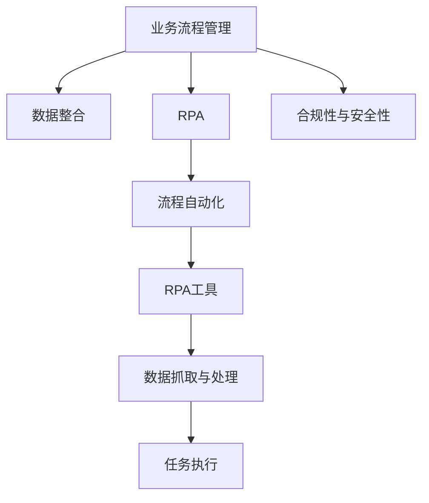

                 

# RPA 软件目标与应用

## 1. 背景介绍

### 1.1 问题由来
RPA（Robotic Process Automation，机器人流程自动化）是一种利用软件机器人模拟人工流程的技术，它通过无干扰地执行重复性任务，有效提高了工作效率，降低了人为错误，改善了数据准确性和一致性。近年来，随着企业数字化转型的加速，RPA在各行各业的应用越来越广泛，尤其在财务、人力资源、供应链管理等领域，RPA帮助企业实现了运营效率的大幅提升。

### 1.2 问题核心关键点
RPA的核心在于通过模拟人工操作来自动化复杂、重复的任务，从而实现成本节约、效率提升和质量保证。然而，RPA的成功应用需要明确的业务目标和准确的流程理解，这成为RPA项目实施的难点。如何设定合理的RPA目标，选择适合的RPA工具和技术，以及实施过程中如何应对业务流程的变化和挑战，是RPA应用需要解决的关键问题。

### 1.3 问题研究意义
研究RPA的目标与应用，对于提升企业数字化转型水平、降低运营成本、提高服务质量和促进企业创新具有重要意义：

1. **提升运营效率**：RPA通过自动执行重复性任务，减少了人工干预，加速了业务流程的执行，提升了整体运营效率。
2. **降低成本**：RPA减少了人力需求，降低了企业运营成本，使企业能够更专注于核心业务。
3. **提高服务质量**：RPA减少了人为错误，提高了数据准确性和流程一致性，提升了服务质量。
4. **促进业务创新**：RPA为业务流程的重新设计和优化提供了可能，支持企业创新发展。

## 2. 核心概念与联系

### 2.1 核心概念概述

为更好地理解RPA的应用目标和方法，本节将介绍几个密切相关的核心概念：

- **RPA**：通过软件机器人模拟人工操作，自动执行重复性任务的技术，涵盖了从数据抓取、数据处理到任务执行的全流程。
- **流程自动化**：通过自动化工具和软件，实现企业内部流程的无缝连接和优化，提升流程效率和质量。
- **业务流程管理(BPM)**：包括流程建模、流程分析和流程优化，是实现RPA应用的重要基础。
- **数据整合**：通过RPA将分散在不同系统中的数据整合到统一平台，提高数据质量和一致性。
- **合规性与安全性**：RPA应用中需要遵守相关法规和行业标准，确保数据和操作的安全性。

这些核心概念之间的逻辑关系可以通过以下Mermaid流程图来展示：



这个流程图展示了几大核心概念的联系：

1. 业务流程管理(BPM)为RPA应用提供流程设计指导。
2. 数据整合通过RPA实现数据集中和统一，提高数据质量。
3. RPA工具通过模拟人工操作，实现流程自动化。
4. 数据抓取与处理是RPA的基础功能，保证任务执行的准确性。
5. 任务执行是RPA的核心应用场景，实现自动化操作。
6. 合规与安全是RPA应用的重要保障，确保操作的合法合规。

## 3. 核心算法原理 & 具体操作步骤
### 3.1 算法原理概述

RPA的算法原理主要基于模拟人工操作的原理，通过自动化工具实现业务流程的自动化。其核心思想是：

1. **任务建模**：分析业务流程，确定需要自动化的任务和步骤。
2. **自动化实现**：利用RPA工具模拟人工操作，实现任务的自动化执行。
3. **持续优化**：根据业务流程的变化和反馈，持续优化自动化流程。

### 3.2 算法步骤详解

RPA的实施通常包括以下几个关键步骤：

**Step 1: 需求分析**
- 与业务部门沟通，明确需要自动化的业务流程和任务。
- 收集流程中的关键数据点、决策点和操作点，分析任务的复杂度和频率。

**Step 2: 流程建模**
- 使用BPM工具（如Bizagi、Bizagi Studio等）绘制流程模型，记录每个任务的步骤和参数。
- 在模型中添加变量、条件判断和流程控制，确保模型的完整性和正确性。

**Step 3: 工具选择与配置**
- 根据需求选择合适的RPA工具（如UiPath、Blue Prism、Automation Anywhere等），进行必要的配置。
- 配置RPA机器人，包括登录信息、任务执行路径、异常处理策略等。

**Step 4: 任务执行与测试**
- 使用RPA工具对流程模型进行测试，检查每一步任务的执行结果。
- 记录测试中的异常情况和错误信息，进行故障排除和修复。
- 逐步优化和调整，确保任务执行的准确性和稳定性。

**Step 5: 部署与监控**
- 将优化后的RPA流程部署到生产环境，并设置定时任务执行。
- 使用监控工具（如UiPath Monitor、Blue Prism Management等）实时监控流程执行情况，及时发现和处理异常。
- 定期进行流程维护和更新，确保RPA系统的持续高效运行。

### 3.3 算法优缺点

RPA在提升企业运营效率、降低成本和提高服务质量方面具有显著优势，但也存在一些局限性：

**优点**：
1. **高效率**：RPA能够快速执行重复性任务，提高工作效率。
2. **高精度**：RPA减少了人为错误，保证了数据准确性。
3. **高稳定性**：RPA执行不受人为因素影响，稳定性高。
4. **低成本**：RPA减少了人力需求，降低了运营成本。
5. **灵活性**：RPA可以根据业务需求快速调整和优化。

**缺点**：
1. **初期投入高**：RPA系统开发和配置需要一定的时间和资源。
2. **技术门槛高**：需要具备一定的技术知识和技能。
3. **依赖数据质量**：RPA的执行依赖高质量的数据输入。
4. **扩展性差**：现有RPA系统可能难以扩展到复杂的多步骤流程。
5. **依赖工具**：RPA依赖特定的RPA工具和平台，迁移难度大。

尽管存在这些局限性，但就目前而言，RPA仍然是提升企业自动化水平和效率的重要手段。未来相关研究的重点在于如何进一步降低RPA的开发和实施成本，提高系统的扩展性和灵活性，同时兼顾数据质量和工具兼容性等因素。

### 3.4 算法应用领域

RPA在各行各业的应用已经相当广泛，以下是一些主要的应用领域：

- **财务与会计**：自动化发票处理、账目核对、财务报表生成等。
- **人力资源**：员工入职/离职流程、薪资管理、考勤记录等。
- **供应链管理**：订单处理、库存管理、物流跟踪等。
- **客户服务**：客户信息录入、客户投诉处理、客户数据整理等。
- **市场营销**：市场调研、广告投放、客户关系管理等。

除了这些常见应用领域外，RPA还在金融、医疗、制造等多个行业领域得到广泛应用，为企业带来了显著的效益提升。

## 4. 数学模型和公式 & 详细讲解 & 举例说明

### 4.1 数学模型构建

RPA的实施通常需要建立数学模型来描述业务流程和任务。这里以财务报表自动化生成为例，说明如何构建数学模型：

1. **输入数据建模**：假设输入数据包括收入、成本、费用等财务数据，以及对应的科目编码、日期等信息。
2. **任务步骤建模**：将财务报表的生成分为多个步骤，如数据录入、计算、校验等。
3. **输出数据建模**：定义输出报表的格式和内容，包括科目、金额、时间等字段。

### 4.2 公式推导过程

以财务报表自动化生成为例，推导其数学模型的关键步骤：

1. **数据预处理**：将输入数据进行清洗、格式化，如去除异常值、转换数据类型等。
2. **数据计算**：根据财务公式进行数据计算，如收入减成本、费用等。
3. **报表生成**：将计算结果按照预设格式输出到报表模板中。

### 4.3 案例分析与讲解

假设一个企业需要自动化生成月度财务报表，具体流程如下：

1. **数据获取**：从财务系统中获取本月所有财务数据，包括收入、成本、费用等。
2. **数据计算**：根据预设的财务公式，计算净利润、成本率等关键指标。
3. **报表输出**：将计算结果按照预设格式输出到财务报表模板中，生成最终的报表文件。

## 5. 项目实践：代码实例和详细解释说明
### 5.1 开发环境搭建

在进行RPA项目实践前，我们需要准备好开发环境。以下是使用Python进行UiPath开发的环境配置流程：

1. 安装Anaconda：从官网下载并安装Anaconda，用于创建独立的Python环境。

2. 创建并激活虚拟环境：
```bash
conda create -n uipath-env python=3.8 
conda activate uipath-env
```

3. 安装UiPath Studio：从官网下载并安装UiPath Studio，作为RPA开发工具。

4. 安装UiPath Orchestrator：作为RPA流程监控和管理工具，用于部署和管理RPA流程。

完成上述步骤后，即可在`uipath-env`环境中开始RPA项目实践。

### 5.2 源代码详细实现

这里我们以财务报表自动化生成为例，给出使用UiPath Studio对RPA流程进行开发的Python代码实现。

```python
# 导入UiPath Studio库
from uipath import Robot, Session

# 创建会话
session = Session()

# 登录UiPath Orchestrator
session.login("orchestrator-url", "orchestrator-username", "orchestrator-password")

# 创建一个新的机器人
robot = Robot()

# 定义财务报表生成的RPA流程
def generate_financial_report():
    # 步骤1：获取财务数据
    data = robot.Document("""{{
        "财务数据": {
            "收入": 100000,
            "成本": 50000,
            "费用": 20000,
            "时间": "2021-01-31"
        }
    }}""")
    # 步骤2：计算净利润
    profit = data["收入"] - data["成本"] - data["费用"]
    # 步骤3：生成报表
    report = data["时间"] + "财务报表"
    report_data = {
        "科目": ["收入", "成本", "费用"],
        "金额": [data["收入"], data["成本"], data["费用"]],
        "利润": profit
    }
    robot.Document(report_data)
    # 保存报表文件
    robot.SaveFile(report, "财务报表.csv")

# 调用RPA流程
generate_financial_report()
```

以上代码实现了一个简单的财务报表自动化生成流程。其中，`Data`对象用于存储输入数据，`Robot.Document`方法用于在文档中添加数据，`Robot.SaveFile`方法用于保存报表文件。

### 5.3 代码解读与分析

让我们再详细解读一下关键代码的实现细节：

** Robot类**：
- `Robot`类是UiPath Studio的核心类，用于创建和管理RPA机器人。

** `Document`方法**：
- `Robot.Document`方法用于在UiPath Document中操作，创建和修改文档内容。

** `SaveFile`方法**：
- `Robot.SaveFile`方法用于保存RPA生成的报表文件。

** `Session`类**：
- `Session`类用于创建和管理UiPath Studio会话，方便进行RPA流程的开发和管理。

通过这些方法和类，可以轻松实现复杂的RPA流程，自动化生成财务报表。

## 6. 实际应用场景
### 6.1 智能客服系统

RPA在智能客服系统中的应用，可以显著提升客服效率和服务质量。传统客服往往需要配备大量人力，高峰期响应缓慢，且服务质量难以保证。通过RPA，可以自动处理常见的客户咨询和问题，快速响应客户需求，用自然流畅的语言解答各类常见问题，提高客户满意度。

在技术实现上，可以收集企业内部的历史客服对话记录，将问题和最佳答复构建成监督数据，在此基础上对RPA机器人进行微调。微调后的RPA机器人能够自动理解用户意图，匹配最合适的答案模板进行回复，实现快速、高效、准确的客户服务。

### 6.2 金融舆情监测

金融机构需要实时监测市场舆论动向，以便及时应对负面信息传播，规避金融风险。RPA可以帮助金融机构自动化处理大量的新闻、报道、评论等文本数据，自动提取关键信息和情感倾向，及时发现市场波动和舆情变化，帮助决策者快速应对潜在的金融风险。

### 6.3 个性化推荐系统

RPA可以帮助企业自动化处理用户数据，根据用户行为和历史数据，生成个性化推荐结果。RPA可以自动抓取用户浏览、点击、评论、分享等行为数据，提取和用户交互的物品标题、描述、标签等文本内容，结合用户的后续行为，生成推荐列表，从而提高个性化推荐的效果。

### 6.4 未来应用展望

随着RPA技术的发展，其在各行各业的应用将越来越广泛。未来，RPA将进一步扩展到更多领域，如医疗、教育、物流等，为企业提供更多的自动化解决方案。RPA与人工智能、大数据、区块链等新兴技术的结合，也将带来更多创新应用，提升企业数字化转型的水平。

## 7. 工具和资源推荐
### 7.1 学习资源推荐

为了帮助开发者系统掌握RPA的理论基础和实践技巧，这里推荐一些优质的学习资源：

1. **UiPath Academy**：提供免费的在线课程，涵盖RPA的基础知识、实践技巧和高级应用。
2. **Blue Prism University**：提供全面的RPA培训课程，从入门到高级，全面覆盖RPA知识体系。
3. **Automation Anywhere Academy**：提供自动化技术的在线课程，帮助开发者掌握RPA技能。
4. **《UiPath Orchestrator技术手册》**：详细介绍了UiPath Orchestrator的配置和管理，是RPA实施的重要参考。
5. **《UiPath Studio技术手册》**：介绍了UiPath Studio的使用方法和最佳实践，是RPA开发的必备指南。

通过对这些资源的学习实践，相信你一定能够快速掌握RPA的精髓，并用于解决实际的业务问题。

### 7.2 开发工具推荐

高效的开发离不开优秀的工具支持。以下是几款用于RPA开发的常用工具：

1. **UiPath Studio**：UiPath的官方RPA开发工具，提供图形化的流程设计和调试功能，支持Python脚本开发。
2. **Blue Prism Studio**：Blue Prism的官方RPA开发工具，提供完整的流程建模和调试功能，支持多种语言开发。
3. **Automation Anywhere Bot Studio**：Automation Anywhere的RPA开发工具，支持图形化设计和脚本开发，提供了丰富的流程库和组件。
4. **UiPath Orchestrator**：UiPath的流程监控和管理工具，支持自动化任务的部署、监控和优化。
5. **Blue Prism Orchestrator**：Blue Prism的流程监控和管理工具，提供全面的流程管理和分析功能。

合理利用这些工具，可以显著提升RPA项目的开发效率，加快创新迭代的步伐。

### 7.3 相关论文推荐

RPA的研究和发展源于学界的持续研究。以下是几篇奠基性的相关论文，推荐阅读：

1. **《RPA: The Future of Work》**：由UiPath公司撰写，介绍了RPA技术的现状和未来发展方向。
2. **《Process Mining: A Survey》**：介绍了过程挖掘技术的发展和应用，是RPA流程建模的重要参考。
3. **《Robot Process Automation: Trends and Challenges》**：讨论了RPA技术的趋势和挑战，提供了RPA实施的指导和建议。
4. **《Robotic Process Automation in Healthcare》**：介绍了RPA在医疗领域的应用和效果，提供了医疗行业RPA实施的案例分析。
5. **《Robotic Process Automation for Customer Service》**：讨论了RPA在客户服务中的应用，提供了客户服务RPA实施的指导和建议。

## 8. 总结：未来发展趋势与挑战

### 8.1 总结

本文对RPA的目标与应用进行了全面系统的介绍。首先阐述了RPA的目标设定、工具选择和实施流程，明确了RPA在提升运营效率、降低成本和提高服务质量方面的独特价值。其次，从原理到实践，详细讲解了RPA的算法原理和操作步骤，给出了RPA项目开发的完整代码实例。同时，本文还广泛探讨了RPA在智能客服、金融舆情、个性化推荐等多个行业领域的应用前景，展示了RPA范式的巨大潜力。

通过本文的系统梳理，可以看到，RPA通过模拟人工操作，实现业务流程的自动化，显著提高了企业的运营效率和质量。未来，伴随RPA技术的发展和应用，企业将能够更高效、更准确地完成各种重复性任务，推动数字化转型的进程。

### 8.2 未来发展趋势

展望未来，RPA技术将呈现以下几个发展趋势：

1. **自动化程度提升**：未来RPA将具备更高的自动化程度，能够处理更复杂的业务流程和任务。
2. **智能交互增强**：RPA将引入人工智能技术，实现更加智能化的交互和决策。
3. **跨平台支持**：RPA将支持跨平台操作，无缝集成到各种系统和工具中。
4. **数据整合能力增强**：RPA将具备更强大的数据整合和处理能力，实现跨系统数据共享。
5. **安全性和合规性提升**：RPA将引入更多的安全措施和合规性检查，保障数据和操作的安全性。
6. **人机协作优化**：RPA将与人类工作者协作，实现更高效、更精准的业务处理。

以上趋势凸显了RPA技术的广泛应用前景。这些方向的探索发展，必将进一步提升RPA系统的性能和应用范围，为企业的数字化转型和运营效率的提升提供新的动力。

### 8.3 面临的挑战

尽管RPA技术已经取得了显著的成果，但在迈向更加智能化、普适化应用的过程中，它仍面临着诸多挑战：

1. **技术门槛高**：RPA的开发和实施需要一定的技术知识和技能，企业需要投入一定的培训和资源。
2. **数据依赖性强**：RPA的执行依赖高质量的数据输入，数据的准确性和完整性对RPA效果有重要影响。
3. **扩展性差**：现有RPA系统可能难以扩展到复杂的多步骤流程，需要进行额外的定制和开发。
4. **依赖工具**：RPA依赖特定的工具和平台，迁移和升级的难度较大。
5. **安全性和合规性问题**：RPA的实施需要考虑数据和操作的安全性，确保符合相关法规和行业标准。

尽管存在这些挑战，但通过不断的技术创新和改进，RPA必将克服这些难题，实现更广泛的应用和推广。

### 8.4 研究展望

未来的研究需要在以下几个方面寻求新的突破：

1. **降低技术门槛**：开发更加易用的RPA开发工具和平台，降低技术门槛，提高RPA应用的普及度。
2. **提升数据质量**：引入数据清洗和验证技术，提高数据质量，确保RPA的准确性和稳定性。
3. **增强扩展性**：开发更具扩展性的RPA系统，支持复杂的多步骤流程和多领域应用。
4. **引入AI技术**：将人工智能技术引入RPA系统，实现更智能、更高效的任务处理。
5. **优化安全性和合规性**：引入安全措施和合规性检查，保障RPA系统的操作安全性和合法合规性。

这些研究方向将推动RPA技术的发展，为企业的数字化转型和运营效率提升提供新的助力。

## 9. 附录：常见问题与解答

**Q1: RPA是否适用于所有业务流程？**

A: RPA适用于具有重复性、规则明确的任务，对于复杂的多步骤流程和高决策场景，需要结合人工干预。选择合适的业务流程进行RPA实施，可以显著提升运营效率和质量。

**Q2: 如何选择合适的RPA工具？**

A: 选择合适的RPA工具需要考虑企业的业务需求、数据复杂度和技术能力。常用的RPA工具包括UiPath、Blue Prism、Automation Anywhere等，每个工具都有其优势和适用场景，需要根据具体需求进行选择。

**Q3: 如何评估RPA的效果？**

A: 评估RPA的效果需要考虑任务完成时间、错误率、自动化程度等多个指标。通过对比RPA前后的业务指标变化，可以评估RPA的实际效果。

**Q4: RPA在实施过程中需要注意哪些问题？**

A: 在RPA实施过程中，需要注意数据质量、任务定义的准确性、系统兼容性和安全性等问题。确保数据输入的准确性和完整性，清晰定义任务步骤，保证系统兼容性和安全性，才能实现高效的RPA实施。

**Q5: RPA的未来发展方向是什么？**

A: RPA的未来发展方向包括自动化程度提升、智能交互增强、跨平台支持、数据整合能力增强、安全性和合规性提升和人机协作优化。这些方向将推动RPA技术的发展，提升企业的数字化转型和运营效率。

---

作者：禅与计算机程序设计艺术 / Zen and the Art of Computer Programming

