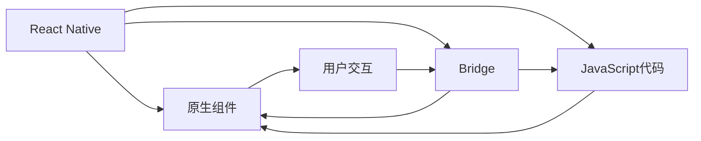

                 

# React Native与原生交互

## 1. 背景介绍

### 1.1 问题由来
在现代移动应用开发中，开发者面临着一个重要的挑战：如何在不同操作系统（iOS、Android等）上实现统一的开发体验和性能表现。传统方式是分别开发原生应用，但这需要投入大量的时间和资源。React Native作为Facebook推出的跨平台移动开发框架，提供了一种高效的解决方案，使得开发者可以使用一套代码库构建iOS和Android应用。

### 1.2 问题核心关键点
React Native通过JavaScript代码实现对原生UI组件的调用，在性能上需要同时兼顾JavaScript和原生的优势。因此，如何在React Native中实现与原生组件的交互，是一个重要的研究方向。本文将详细探讨这一问题，并给出具体的实现方法和实践案例。

## 2. 核心概念与联系

### 2.1 核心概念概述

为了更好地理解React Native与原生交互的核心概念，我们需要首先理解React Native的基本架构和运行机制。

- **React Native**：一种基于React的开源移动应用开发框架，由Facebook开发，支持iOS和Android平台。通过JavaScript和原生组件的桥梁，实现跨平台开发。
- **原生UI组件**：指iOS和Android平台的UI组件，如View、Text、Button等，是原生应用的基础。
- **Bridge**：React Native中的桥梁模块，用于在JavaScript和原生组件之间传递数据和事件。
- **Hybrid**：指React Native应用中的混合组件，同时包含JavaScript代码和原生代码。
- **性能优化**：在跨平台应用开发中，如何实现JavaScript和原生组件的协同工作，以达到最优的性能表现。

### 2.2 核心概念原理和架构的 Mermaid 流程图



这个流程图展示了React Native的基本架构和工作流程：

1. React Native通过Bridge模块与原生组件进行交互。
2. JavaScript代码通过Bridge模块调用原生组件。
3. 用户交互首先由原生组件处理，再通过Bridge模块将事件传递给JavaScript代码。
4. 通过Bridge模块，JavaScript代码可以调用原生组件的方法和属性，同时也可以定义新的原生组件。

## 3. 核心算法原理 & 具体操作步骤

### 3.1 算法原理概述

React Native中的桥接机制是基于原生模块的。当JavaScript代码调用原生组件时，会通过Bridge模块发送一个请求，原生组件接收到请求后，处理完事件，并将结果通过Bridge模块返回给JavaScript代码。

### 3.2 算法步骤详解

在React Native中实现与原生组件的交互，需要遵循以下步骤：

1. 创建一个React Native项目，并初始化iOS和Android环境。
2. 通过Bridge模块定义原生组件的接口，使其可以在JavaScript代码中调用。
3. 编写JavaScript代码，使用Bridge模块调用原生组件。
4. 实现原生组件的事件处理逻辑，将处理结果通过Bridge模块返回给JavaScript代码。

### 3.3 算法优缺点

React Native与原生交互的优势在于，可以通过一套代码实现跨平台开发，节省开发时间和成本。同时，JavaScript代码的动态特性也使得React Native应用具有较好的灵活性和可维护性。

然而，React Native的桥接机制也存在一定的缺点，如性能损耗、代码复杂度高等。在处理大量数据或复杂事件时，原生组件的性能可能不如纯原生应用。此外，Bridge模块的实现和维护也需要耗费大量的时间和精力。

### 3.4 算法应用领域

React Native与原生交互的应用领域非常广泛，涵盖移动应用、游戏、广告、金融等多个行业。通过React Native，开发者可以高效地构建iOS和Android应用，满足不同平台的用户需求。

## 4. 数学模型和公式 & 详细讲解 & 举例说明

### 4.1 数学模型构建

为了更好地理解React Native与原生交互的桥接机制，我们需要构建一个简单的数学模型。假设React Native应用中有一个原生组件A，可以通过Bridge模块在JavaScript代码中调用。

### 4.2 公式推导过程

设原生组件A的事件处理函数为f(x)，其中x为事件参数。当JavaScript代码调用A时，会通过Bridge模块发送一个请求，原生态组件A接收到请求后，处理完事件，并将结果返回给JavaScript代码。

$$
f(x) = \text{处理结果}
$$

### 4.3 案例分析与讲解

以React Native中的Toast组件为例，讲解如何通过Bridge模块在JavaScript代码中调用原生Toast组件。

首先，在iOS和Android项目中定义Toast组件的接口，并实现其事件处理逻辑：

```java
// iOS
@interface RNToast : NSObject

- (void)showToast:(NSString *)msg;

@end

@implementation RNToast

- (void)showToast:(NSString *)msg {
    NSLog(@"Show Toast: %@", msg);
}

@end

// Android
public class RNToast extends ReactContextBaseJavaModule {
    public RNToast(ReactApplicationContext reactContext) {
        super(reactContext);
    }

    @Override
    public void showToast(String msg) {
        Log.i("Toast", "Show Toast: " + msg);
    }

    @ReactMethod
    public void showToastJS(String msg) {
        showToast(msg);
    }
}
```

然后，在React Native代码中定义Toast组件，并通过Bridge模块调用原生Toast组件：

```javascript
import { Toast } from 'react-native';

class MyToast extends React.Component {
    constructor(props) {
        super(props);
        this.state = {
            msg: '',
        };
    }

    showToast() {
        Toast.show(this.state.msg);
    }

    render() {
        return (
            <div>
                <input type="text" onChange={(e) => this.setState({ msg: e.target.value })} />
                <button onClick={() => this.showToast()}>Show Toast</button>
            </div>
        );
    }
}
```

在上述代码中，MyToast组件通过Bridge模块调用了原生Toast组件，实现了在JavaScript代码中显示Toast弹窗的功能。

## 5. 项目实践：代码实例和详细解释说明

### 5.1 开发环境搭建

在React Native项目中，开发环境搭建包括以下步骤：

1. 安装Node.js和npm，配置环境变量。
2. 安装React Native CLI和相关依赖。
3. 初始化React Native项目，并配置iOS和Android环境。

### 5.2 源代码详细实现

以下是一个简单的React Native应用示例，实现了在JavaScript代码中调用原生Toast组件的功能。

首先，在iOS和Android项目中定义Toast组件的接口，并实现其事件处理逻辑：

```java
// iOS
@interface RNToast : NSObject

- (void)showToast:(NSString *)msg;

@end

@implementation RNToast

- (void)showToast:(NSString *)msg {
    NSLog(@"Show Toast: %@", msg);
}

@end

// Android
public class RNToast extends ReactContextBaseJavaModule {
    public RNToast(ReactApplicationContext reactContext) {
        super(reactContext);
    }

    @Override
    public void showToast(String msg) {
        Log.i("Toast", "Show Toast: " + msg);
    }

    @ReactMethod
    public void showToastJS(String msg) {
        showToast(msg);
    }
}
```

然后，在React Native代码中定义Toast组件，并通过Bridge模块调用原生Toast组件：

```javascript
import { Toast } from 'react-native';

class MyToast extends React.Component {
    constructor(props) {
        super(props);
        this.state = {
            msg: '',
        };
    }

    showToast() {
        Toast.show(this.state.msg);
    }

    render() {
        return (
            <div>
                <input type="text" onChange={(e) => this.setState({ msg: e.target.value })} />
                <button onClick={() => this.showToast()}>Show Toast</button>
            </div>
        );
    }
}
```

最后，启动React Native应用，并在模拟器中测试Toast组件的功能。

### 5.3 代码解读与分析

React Native中的Bridge模块是通过原生模块实现的，因此需要对原生模块有一定的了解。通过Bridge模块，JavaScript代码可以调用原生组件的方法和属性，同时也可以定义新的原生组件。在React Native中，Bridge模块的实现依赖于原生模块，因此需要开发者熟悉iOS和Android的原生开发技术。

## 6. 实际应用场景

### 6.1 移动应用开发

React Native与原生交互在移动应用开发中的应用非常广泛。通过React Native，开发者可以高效地构建iOS和Android应用，满足不同平台的用户需求。在移动应用中，原生组件可以提供更好的性能表现，而React Native的动态特性则可以实现更好的用户体验。

### 6.2 游戏开发

在移动游戏开发中，React Native与原生交互同样具有重要的作用。通过React Native，开发者可以高效地构建跨平台游戏应用，减少开发时间和成本。同时，原生组件可以提供更好的性能表现，提升游戏的运行流畅度和响应速度。

### 6.3 广告开发

在广告开发中，React Native与原生交互可以用于实现广告位的动态更新和用户交互。通过React Native，开发者可以高效地构建跨平台广告应用，提升广告投放的覆盖率和转化率。

### 6.4 金融开发

在金融开发中，React Native与原生交互可以用于实现复杂界面的交互和数据处理。通过React Native，开发者可以高效地构建跨平台金融应用，提升用户体验和业务处理能力。

## 7. 工具和资源推荐

### 7.1 学习资源推荐

为了帮助开发者掌握React Native与原生交互的技术，以下是一些优质的学习资源：

1. React Native官方文档：React Native官方提供的文档，详细介绍了React Native的基本概念和使用方法。
2. NativeBase文档：NativeBase提供了丰富的React Native组件库，可以快速实现原生组件的功能。
3. Expo文档：Expo提供了完整的React Native开发环境和工具，可以方便地构建跨平台应用。
4. React Native社区：React Native社区提供了大量的技术讨论和资源分享，可以帮助开发者解决实际问题。

### 7.2 开发工具推荐

React Native与原生交互的开发需要使用一些常用的开发工具：

1. Visual Studio Code：功能强大的代码编辑器，支持JavaScript和React Native开发。
2. Android Studio：用于Android应用开发的IDE，可以方便地调试原生组件。
3. Xcode：用于iOS应用开发的IDE，可以方便地调试原生组件。
4. Expo CLI：Expo提供的命令行工具，可以方便地构建跨平台应用。

### 7.3 相关论文推荐

为了深入理解React Native与原生交互的技术，以下是一些重要的相关论文：

1. "React Native: A Framework for Building Native Apps with JavaScript and React"：介绍React Native的基本架构和设计思想。
2. "Native UI Components for React Native"：介绍如何在React Native中实现原生UI组件。
3. "React Native and Native Bridge: Performance Optimization Strategies"：介绍React Native和原生桥接机制的性能优化策略。

## 8. 总结：未来发展趋势与挑战

### 8.1 研究成果总结

React Native与原生交互技术已经成为移动应用开发的重要工具。通过React Native，开发者可以高效地构建跨平台应用，提升开发效率和用户体验。然而，桥接机制的性能和复杂度仍然是制约React Native发展的瓶颈。

### 8.2 未来发展趋势

未来的React Native与原生交互技术将呈现以下几个发展趋势：

1. 桥接机制的优化：React Native将进一步优化桥接机制，减少性能损耗，提升应用性能。
2. 原生组件的丰富：React Native将提供更多的原生组件，提升应用的用户体验。
3. 跨平台应用的标准化：React Native将制定跨平台应用的标准，提升应用的互操作性。
4. 生态系统的完善：React Native将建立完善的生态系统，提供更多的第三方组件和工具。

### 8.3 面临的挑战

尽管React Native与原生交互技术已经取得了很大的进展，但仍然面临一些挑战：

1. 性能瓶颈：桥接机制的性能瓶颈仍然是制约React Native发展的关键因素。
2. 兼容性问题：不同平台之间的兼容性问题仍然存在，需要更多的优化和改进。
3. 开发难度：原生组件的实现和调试相对复杂，需要开发者具备较高的技术水平。
4. 生态系统的不完善：React Native的生态系统还需要进一步完善，提供更多的第三方组件和工具。

### 8.4 研究展望

未来的React Native与原生交互技术需要在以下几个方面进行深入研究：

1. 桥接机制的优化：进一步优化桥接机制，减少性能损耗，提升应用性能。
2. 原生组件的丰富：提供更多的原生组件，提升应用的用户体验。
3. 跨平台应用的标准化：制定跨平台应用的标准，提升应用的互操作性。
4. 生态系统的完善：建立完善的生态系统，提供更多的第三方组件和工具。

## 9. 附录：常见问题与解答

**Q1：React Native与原生交互的性能如何？**

A: React Native与原生交互的性能在很大程度上取决于桥接机制的优化程度。通过优化桥接机制，React Native可以实现接近原生应用的表现。同时，React Native中的JavaScript代码也可以进行性能优化，提升应用的响应速度。

**Q2：React Native中如何进行原生组件的交互？**

A: React Native中可以通过Bridge模块进行原生组件的交互。原生组件的接口通过Bridge模块传递给JavaScript代码，JavaScript代码通过Bridge模块调用原生组件的方法和属性。

**Q3：React Native中如何进行性能优化？**

A: React Native中的性能优化可以从以下几个方面入手：

1. 减少桥接调用：通过减少桥接调用次数，减少性能损耗。
2. 使用原生组件：使用原生组件可以减少JavaScript代码的运行时间，提升应用的响应速度。
3. 代码优化：优化JavaScript代码，减少不必要的计算和渲染。

**Q4：React Native中如何进行跨平台应用的标准化？**

A: React Native可以通过制定跨平台应用的标准，提升应用的互操作性。例如，可以使用React Native的组件库，提供统一的组件接口，减少开发难度和维护成本。

**Q5：React Native中如何进行生态系统的完善？**

A: React Native可以通过提供更多的第三方组件和工具，完善生态系统。同时，可以通过社区协作，加速组件和工具的开发和更新，提升开发效率。

---

作者：禅与计算机程序设计艺术 / Zen and the Art of Computer Programming

