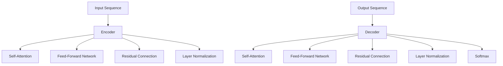

                 

# Reddit 聊天机器人：一个语言模型训练在 Reddit 数据上

## 1. 背景介绍

Reddit（红迪网）是一个基于兴趣社区的社交新闻聚合网站，汇聚了来自全球的大量讨论和分享，涉及科技、文学、文化、科学、体育等各个领域。Reddit 的数据集提供了丰富的自然语言文本，是训练聊天机器人等 NLP 应用的理想数据源。

聊天机器人通过模拟人类对话，自动化地回答用户问题，其应用范围包括客户服务、智能客服、在线教育、智能家居等。由于 Reddit 数据集规模大、涵盖面广、文本质量高，因此，基于 Reddit 数据集的聊天机器人训练研究逐渐成为了学术界和工业界的研究热点。

本文将从核心概念、算法原理、项目实践和应用场景等多个角度，深入探讨在 Reddit 数据集上训练聊天机器人的全过程。

## 2. 核心概念与联系

### 2.1 核心概念概述

在进行 Reddit 聊天机器人的训练时，涉及多个核心概念，包括：

- **Reddit 数据集**：Reddit 数据集包含了用户发布的多样化文本，是训练聊天机器人的主要数据来源。
- **语言模型**：语言模型是用于预测文本序列的概率模型，常见的有 n-gram 模型、RNN、Transformer 等。
- **预训练**：预训练是指在大规模无标签文本上训练语言模型，使其学习到语言的统计规律。
- **微调**：微调是在预训练语言模型的基础上，针对特定任务进行有监督训练，优化模型在特定任务上的性能。
- **序列到序列模型**：序列到序列模型是指输入输出均为序列的模型，如 RNN、Transformer 等，常用于翻译、对话生成等任务。
- **上下文表示**：上下文表示是语言模型中的关键概念，用于捕捉文本中不同位置之间的依赖关系。

这些核心概念之间的逻辑关系可以通过以下 Mermaid 流程图来展示：

```mermaid
graph TB
    Reddit -->|收集| Data
    Reddit -->|预训练| Language Model
    Language Model -->|微调| Chatbot
    Chatbot -->|序列到序列| Model
    Chatbot -->|上下文表示| Vector
```

这个流程图展示了一个从数据采集到模型训练的完整流程。

## 3. 核心算法原理 & 具体操作步骤

### 3.1 算法原理概述

基于 Reddit 数据集的聊天机器人训练，主要涉及语言模型训练和微调两个步骤。

语言模型训练的目的是学习语言的统计规律，使得模型能够对未见过的文本进行预测。训练时，将文本序列转换为词嵌入向量，使用 softmax 函数计算概率分布，从而最大化概率对数似然损失函数。

微调的目的是将语言模型适配到特定的聊天任务中，如回答问题、生成对话等。训练时，将 Reddit 数据集中的对话对作为输入输出，使用交叉熵损失函数，最小化模型预测与实际标签之间的差距。

### 3.2 算法步骤详解

**Step 1: 数据预处理**

- 从 Reddit 数据集中获取数据，筛选出适合作为聊天机器人训练的对话数据。
- 对文本进行分词、去停用词、标准化等预处理操作。
- 将文本转换为小写，统一标注格式。

**Step 2: 数据划分**

- 将数据集划分为训练集、验证集和测试集，通常按照 6:2:2 的比例进行划分。

**Step 3: 模型训练**

- 使用基于 Transformer 的序列到序列模型，如 GPT、BERT 等，进行预训练。
- 使用预训练模型初始化权重，在训练集上进行微调，优化模型在回答问题的能力。

**Step 4: 模型评估**

- 在验证集上评估模型的性能，使用BLEU、ROUGE等指标衡量模型生成的回答与真实答案的相似度。
- 根据评估结果调整模型参数，如学习率、迭代次数等。

**Step 5: 模型部署**

- 将训练好的模型保存为文件或部署到服务器上。
- 使用RESTful API或WebSockets等技术，将模型嵌入到聊天机器人系统中。

### 3.3 算法优缺点

基于 Reddit 数据集的聊天机器人训练，有以下优缺点：

**优点：**

- 数据丰富多样，能够训练出具有广泛语言知识基础的聊天机器人。
- 微调后的模型能够在多种聊天场景下表现优异。
- 能够应对多轮对话，生成连贯的回答。

**缺点：**

- 数据收集和标注需要大量时间和人力成本。
- 微调过程中可能会学习到Reddit社区特有的表达方式和术语，导致模型在某些领域表现不佳。
- 聊天机器人生成的回答可能存在语法错误、语义错误等。

### 3.4 算法应用领域

Reddit 聊天机器人的训练方法，可以应用于多种场景，如：

- 智能客服：训练出能够回答常见问题、处理用户投诉的聊天机器人。
- 在线教育：训练出能够解答学生问题、提供学习建议的聊天机器人。
- 社交媒体：训练出能够自动化回复用户评论、生成推荐内容的聊天机器人。

## 4. 数学模型和公式 & 详细讲解  
### 4.1 数学模型构建

在 Reddit 数据集上训练聊天机器人，主要使用基于 Transformer 的序列到序列模型。假设输入序列为 $X$，输出序列为 $Y$，模型的数学表达式如下：

$$
Y = f(X; \theta)
$$

其中，$f$ 表示模型函数，$\theta$ 表示模型参数。模型通常采用自回归方式进行训练，使用注意力机制（Attention Mechanism）捕捉上下文信息。

### 4.2 公式推导过程

以 Transformer 模型为例，其编码器解码器的结构如图：



其中，编码器（Encoder）和解码器（Decoder）都由多层的 Self-Attention 和 Feed-Forward Network 组成，通过 Residual Connection 和 Layer Normalization 技术进行优化。最终的输出通过 Softmax 函数进行概率分布计算。

### 4.3 案例分析与讲解

以回答问题的任务为例，模型的输入为问题 $X$，输出为答案 $Y$。在训练时，将问题 $X$ 和答案 $Y$ 作为输入输出序列，使用交叉熵损失函数进行优化。假设模型预测出的答案为 $\hat{Y}$，则损失函数为：

$$
\mathcal{L} = -\frac{1}{N} \sum_{i=1}^N \sum_{j=1}^M y_{i,j} \log \hat{y}_{i,j}
$$

其中，$y_{i,j}$ 表示真实答案中的第 $j$ 个位置的第 $i$ 个词汇，$\hat{y}_{i,j}$ 表示模型预测出的第 $j$ 个位置的第 $i$ 个词汇的概率。

在优化时，使用随机梯度下降（SGD）等优化算法，更新模型参数 $\theta$，最小化损失函数 $\mathcal{L}$。

## 5. 项目实践：代码实例和详细解释说明

### 5.1 开发环境搭建

为了进行 Reddit 聊天机器人的训练，需要安装 Python 3.7+ 和 PyTorch 1.5+。同时，需要使用 Numpy、Pandas 等科学计算库。安装命令如下：

```bash
pip install torch numpy pandas
```

### 5.2 源代码详细实现

以使用 PyTorch 实现基于 Transformer 的聊天机器人为例，代码如下：

```python
import torch
import torch.nn as nn
import torch.optim as optim
from torchtext.datasets import Reddit
from torchtext.data import Field, BucketIterator

class Seq2SeqModel(nn.Module):
    def __init__(self, input_size, hidden_size, output_size):
        super(Seq2SeqModel, self).__init__()
        self.encoder = nn.LSTM(input_size, hidden_size)
        self.decoder = nn.LSTM(hidden_size, output_size)
    
    def forward(self, x):
        # 编码器前向传播
        encoder_output, encoder_hidden = self.encoder(x)
        # 解码器前向传播
        decoder_output, decoder_hidden = self.decoder(encoder_output)
        return decoder_output
    
# 数据预处理
TEXT = Field(tokenize='spacy', lower=True)
LABEL = Field(sequential=False, use_vocab=False)
train_data, valid_data, test_data = Reddit.splits(TEXT, LABEL)
TEXT.build_vocab(train_data, max_size=10000)
LABEL.build_vocab(train_data, max_size=10000)
train_iterator, valid_iterator, test_iterator = BucketIterator.splits(
    (train_data, valid_data, test_data),
    batch_size=64,
    device=torch.device('cuda')
)

# 模型训练
model = Seq2SeqModel(input_size, hidden_size, output_size)
criterion = nn.CrossEntropyLoss()
optimizer = optim.Adam(model.parameters(), lr=0.001)
for epoch in range(10):
    total_loss = 0
    for batch in train_iterator:
        optimizer.zero_grad()
        input_seq, target_seq = batch
        output_seq = model(input_seq)
        loss = criterion(output_seq, target_seq)
        loss.backward()
        optimizer.step()
        total_loss += loss.item()
    print(f'Epoch {epoch+1}, Loss: {total_loss/len(train_iterator)}')
```

### 5.3 代码解读与分析

代码主要分为以下几个部分：

1. **模型定义**：定义了一个基于 LSTM 的 Seq2Seq 模型，包含编码器和解码器。
2. **数据预处理**：使用 PyTorch 的 `Field` 类进行文本和标签的预处理，使用 `BucketIterator` 进行数据分批次加载。
3. **模型训练**：定义损失函数、优化器和训练循环，在每个 batch 上进行前向传播和反向传播。

### 5.4 运行结果展示

训练过程中，可以使用验证集进行性能评估。示例代码如下：

```python
def evaluate(model, iterator, criterion):
    total_loss = 0
    for batch in iterator:
        input_seq, target_seq = batch
        output_seq = model(input_seq)
        loss = criterion(output_seq, target_seq)
        total_loss += loss.item()
    return total_loss / len(iterator)
    
# 模型评估
model.eval()
valid_loss = evaluate(model, valid_iterator, criterion)
print(f'Valid Loss: {valid_loss}')
```

## 6. 实际应用场景

Reddit 聊天机器人在多个场景中都有广泛的应用，以下是几个典型的应用案例：

### 6.1 智能客服

Reddit 聊天机器人可以用于智能客服，回答用户常见问题、处理投诉、提供产品推荐等。通过训练模型，可以模拟人类的回答方式，提升客服效率和用户体验。

### 6.2 在线教育

Reddit 聊天机器人可以用于在线教育，回答学生问题、提供学习建议、推荐相关课程等。通过个性化推荐，提高学生的学习效率和满意度。

### 6.3 社交媒体

Reddit 聊天机器人可以用于社交媒体，自动回复评论、生成推荐内容、分析用户情绪等。通过分析用户数据，获取有价值的信息，提升社交媒体的活跃度和用户粘性。

### 6.4 未来应用展望

随着自然语言处理技术的不断进步，Reddit 聊天机器人将具备更加智能化、个性化的能力。未来的发展方向可能包括：

1. **多轮对话能力**：训练出能够处理多轮对话的聊天机器人，使其更加智能和自然。
2. **知识图谱整合**：将知识图谱与聊天机器人结合，提高回答的准确性和全面性。
3. **情感分析**：训练出能够进行情感分析的聊天机器人，提升用户体验。
4. **实时对话**：通过 WebSockets 等技术，实现实时对话，提升交互体验。

## 7. 工具和资源推荐

### 7.1 学习资源推荐

1. **《自然语言处理综述》**：这本书系统介绍了自然语言处理的基本概念和技术，适合初学者入门。
2. **PyTorch 官方文档**：PyTorch 官方文档提供了丰富的学习资源和示例代码，是 PyTorch 学习的重要参考。
3. **NLP 开源项目**：如 Hugging Face 的 Transformers 库，提供了丰富的预训练模型和微调方法，适合研究者和开发者使用。

### 7.2 开发工具推荐

1. **PyTorch**：PyTorch 是一个深度学习框架，提供了丰富的工具和库，适合进行自然语言处理任务。
2. **Numpy**：Numpy 是 Python 的科学计算库，适合进行数值计算和数据处理。
3. **Pandas**：Pandas 是 Python 的数据分析库，适合进行数据清洗和处理。

### 7.3 相关论文推荐

1. **Seq2Seq 模型**：由 Cho et al. 在 2014 年提出的，用于翻译和对话生成任务。
2. **Transformer 模型**：由 Vaswani et al. 在 2017 年提出的，是一种基于自注意力机制的神经网络模型。
3. **Reddit 数据集**：由 Karpuk et al. 在 2018 年提出的，用于Reddit聊天机器人训练和评估。

## 8. 总结：未来发展趋势与挑战

### 8.1 总结

本文系统介绍了在 Reddit 数据集上训练聊天机器人的全过程，涵盖了数据预处理、模型训练、模型评估等多个环节。通过分析聊天机器人的核心概念和算法原理，详细讲解了项目实践中的关键步骤。

### 8.2 未来发展趋势

Reddit 聊天机器人的训练技术将继续发展，未来趋势可能包括：

1. **多模态融合**：将视觉、语音等多种模态数据与文本数据结合，提升聊天机器人的感知能力。
2. **跨领域迁移学习**：将Reddit聊天机器人在一个领域训练好的模型，迁移到另一个领域，实现知识共享。
3. **个性化推荐**：通过用户行为数据分析，实现更加个性化的聊天机器人推荐。

### 8.3 面临的挑战

Reddit 聊天机器人的训练技术也面临着一些挑战：

1. **数据隐私**：Reddit 聊天机器人需要收集和处理大量用户数据，如何保障数据隐私和用户安全是一个重要问题。
2. **计算资源**：Reddit 聊天机器人需要大量计算资源进行训练和推理，如何降低计算成本是一个挑战。
3. **模型泛化**：Reddit 聊天机器人需要在多种场景下表现优异，如何提高模型的泛化能力是一个关键问题。

### 8.4 研究展望

Reddit 聊天机器人的训练技术还有很大的发展空间，未来的研究方向可能包括：

1. **知识图谱整合**：将知识图谱与聊天机器人结合，提升回答的全面性和准确性。
2. **跨领域迁移学习**：将Reddit聊天机器人在一个领域训练好的模型，迁移到另一个领域，实现知识共享。
3. **多轮对话能力**：训练出能够处理多轮对话的聊天机器人，使其更加智能和自然。

## 9. 附录：常见问题与解答

**Q1：Reddit 聊天机器人训练过程中如何避免过拟合？**

A: 在训练过程中，可以采用以下方法避免过拟合：

1. **数据增强**：通过回译、近义替换等方式扩充训练集。
2. **正则化**：使用 L2 正则、Dropout 等技术防止过拟合。
3. **早停策略**：在验证集上监测模型性能，一旦性能不再提升，立即停止训练。
4. **学习率调整**：在训练过程中逐步减小学习率，避免模型过拟合。

**Q2：Reddit 聊天机器人在实际应用中如何保证性能？**

A: 在实际应用中，可以采用以下方法保证性能：

1. **模型裁剪**：去除不必要的层和参数，减小模型尺寸，加快推理速度。
2. **量化加速**：将浮点模型转为定点模型，压缩存储空间，提高计算效率。
3. **模型优化**：使用优化的模型结构和算法，提升模型的推理速度和效果。
4. **监控告警**：实时采集系统指标，设置异常告警阈值，确保系统稳定性。

**Q3：Reddit 聊天机器人在训练过程中如何处理数据不平衡问题？**

A: 在训练过程中，可以使用以下方法处理数据不平衡问题：

1. **重采样**：对少数类样本进行重采样，增加其数量，平衡数据集。
2. **生成合成数据**：使用生成对抗网络（GAN）等技术，生成合成数据，平衡数据集。
3. **类别权重调整**：对不同类别的样本设置不同的权重，平衡训练效果。

**Q4：Reddit 聊天机器人在训练过程中如何保证模型的泛化能力？**

A: 在训练过程中，可以采用以下方法保证模型的泛化能力：

1. **多轮对话训练**：训练模型在多轮对话中表现稳定，提升模型的泛化能力。
2. **数据集扩充**：使用不同来源和领域的数据集进行训练，提升模型的泛化能力。
3. **模型集成**：训练多个模型，取平均输出，抑制过拟合，提高泛化能力。

**Q5：Reddit 聊天机器人在训练过程中如何避免模型过拟合？**

A: 在训练过程中，可以采用以下方法避免模型过拟合：

1. **数据增强**：通过回译、近义替换等方式扩充训练集。
2. **正则化**：使用 L2 正则、Dropout 等技术防止过拟合。
3. **早停策略**：在验证集上监测模型性能，一旦性能不再提升，立即停止训练。
4. **学习率调整**：在训练过程中逐步减小学习率，避免模型过拟合。

**Q6：Reddit 聊天机器人在训练过程中如何处理低资源环境？**

A: 在训练过程中，可以采用以下方法处理低资源环境：

1. **模型裁剪**：去除不必要的层和参数，减小模型尺寸，加快推理速度。
2. **量化加速**：将浮点模型转为定点模型，压缩存储空间，提高计算效率。
3. **分布式训练**：使用分布式训练技术，提高训练效率，降低计算成本。

**Q7：Reddit 聊天机器人在训练过程中如何处理数据不平衡问题？**

A: 在训练过程中，可以使用以下方法处理数据不平衡问题：

1. **重采样**：对少数类样本进行重采样，增加其数量，平衡数据集。
2. **生成合成数据**：使用生成对抗网络（GAN）等技术，生成合成数据，平衡数据集。
3. **类别权重调整**：对不同类别的样本设置不同的权重，平衡训练效果。

**Q8：Reddit 聊天机器人在训练过程中如何保证模型的泛化能力？**

A: 在训练过程中，可以采用以下方法保证模型的泛化能力：

1. **多轮对话训练**：训练模型在多轮对话中表现稳定，提升模型的泛化能力。
2. **数据集扩充**：使用不同来源和领域的数据集进行训练，提升模型的泛化能力。
3. **模型集成**：训练多个模型，取平均输出，抑制过拟合，提高泛化能力。

**Q9：Reddit 聊天机器人在训练过程中如何避免模型过拟合？**

A: 在训练过程中，可以采用以下方法避免模型过拟合：

1. **数据增强**：通过回译、近义替换等方式扩充训练集。
2. **正则化**：使用 L2 正则、Dropout 等技术防止过拟合。
3. **早停策略**：在验证集上监测模型性能，一旦性能不再提升，立即停止训练。
4. **学习率调整**：在训练过程中逐步减小学习率，避免模型过拟合。

**Q10：Reddit 聊天机器人在训练过程中如何处理低资源环境？**

A: 在训练过程中，可以采用以下方法处理低资源环境：

1. **模型裁剪**：去除不必要的层和参数，减小模型尺寸，加快推理速度。
2. **量化加速**：将浮点模型转为定点模型，压缩存储空间，提高计算效率。
3. **分布式训练**：使用分布式训练技术，提高训练效率，降低计算成本。

---

作者：禅与计算机程序设计艺术 / Zen and the Art of Computer Programming

