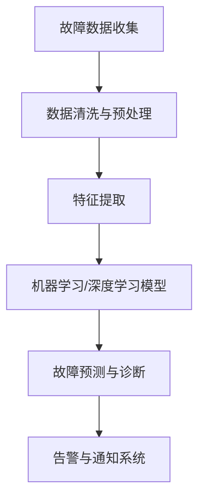

                 

## 1. 背景介绍

系统运维工程师（SRE，Site Reliability Engineering）在企业数字化转型和云计算时代，发挥着越来越重要的作用。面对业务复杂度增加、系统规模扩大带来的挑战，SRE不仅需要保证服务的稳定性和可用性，还要快速诊断和解决问题，保证业务的连续性。SRE故障诊断与问题定位作为SRE工作中至关重要的一环，直接决定了故障处理的速度和效果，对保障服务质量、提升用户体验有着重要的影响。

### 1.1 问题由来

随着企业的业务规模不断扩大，系统复杂度越来越高，故障的诊断和定位变得更加困难。传统的基于经验的手动排查方法已经无法适应现代云计算环境下快速变化和动态扩展的要求。因此，利用自动化工具和数据驱动的方法，构建高效、准确的故障诊断与问题定位系统，成为SRE工作的迫切需求。

### 1.2 问题核心关键点

故障诊断与问题定位的核心在于快速、准确地找到问题发生的位置和原因，并采取有效措施进行修复。关键点包括：

- **数据收集**：从系统日志、监控数据、用户反馈等多个渠道收集故障信息。
- **数据清洗和预处理**：对收集到的数据进行清洗和预处理，提取有用的信息。
- **特征提取**：将数据转化为可以用于模型训练的特征向量。
- **模型训练**：选择合适的机器学习或深度学习模型，对提取的特征进行训练，学习故障诊断和问题定位的规律。
- **故障诊断与定位**：使用训练好的模型对新的故障数据进行预测，识别故障的根本原因。
- **告警和通知**：及时将诊断结果通知相关人员，并触发相应的故障处理流程。

## 2. 核心概念与联系

### 2.1 核心概念概述

SRE故障诊断与问题定位涉及多个关键概念，包括：

- **故障数据收集**：通过日志、监控、告警等方式收集故障数据。
- **数据清洗与预处理**：对收集到的数据进行清洗、去重、过滤等预处理，保证数据质量。
- **特征提取**：从原始数据中提取有用的特征向量，供模型训练使用。
- **机器学习/深度学习模型**：用于故障诊断与定位的核心工具，可以从数据中学习故障特征和规律。
- **故障预测与诊断**：使用模型对新故障数据进行预测和诊断，识别故障原因。
- **告警与通知系统**：将诊断结果通知相关人员，并触发相应的故障处理流程。

这些概念之间的逻辑关系可以通过以下Mermaid流程图来展示：



这个流程图展示了故障诊断与问题定位的基本流程，从数据收集开始，经过预处理和特征提取，到模型训练和故障预测，最后发出告警通知，整个过程紧密相连。

## 3. 核心算法原理 & 具体操作步骤

### 3.1 算法原理概述

SRE故障诊断与问题定位的本质是一种基于数据驱动的机器学习/深度学习模型。其核心思想是通过训练模型，学习故障数据中的模式和规律，从而对新的故障数据进行预测和分类，识别故障的根本原因。

具体而言，假设故障数据为 $\mathbf{X}$，其中 $\mathbf{X} = [\mathbf{x}_1, \mathbf{x}_2, ..., \mathbf{x}_n]$，每个样本 $\mathbf{x}_i$ 由多个特征组成，即 $\mathbf{x}_i = [x_{i1}, x_{i2}, ..., x_{im}]$。故障类型用标签 $y$ 表示，$y \in \{1, 2, ..., k\}$，其中 $k$ 为故障类型的数量。

故障诊断与问题定位的目标是找到一个模型 $f$，使得 $f(\mathbf{x}) = y$ 对新的故障数据 $\mathbf{x'}$ 的预测尽可能准确。模型 $f$ 的训练过程如下：

1. **数据准备**：收集历史故障数据，并进行清洗和预处理。
2. **特征提取**：将原始数据转化为可以用于训练的特征向量。
3. **模型训练**：选择适当的机器学习或深度学习算法，对特征向量进行训练，得到故障诊断模型。
4. **故障预测与诊断**：使用训练好的模型对新的故障数据进行预测，识别故障类型。
5. **告警与通知**：将诊断结果通知相关人员，并触发相应的故障处理流程。

### 3.2 算法步骤详解

下面详细讲解SRE故障诊断与问题定位的算法步骤：

#### 3.2.1 数据准备

**Step 1: 收集故障数据**
- 收集历史故障数据，包括系统日志、监控数据、告警信息等。
- 数据格式应包含故障发生的时间、地点、类型、影响范围等信息。

**Step 2: 数据清洗与预处理**
- 去重和过滤：去除重复的数据，删除无用或异常的数据。
- 时间对齐：将所有数据的时间戳对齐，便于后续处理。
- 特征工程：提取有用的特征，如CPU利用率、内存使用率、网络延迟等。

#### 3.2.2 特征提取

**Step 3: 特征提取**
- 提取时间特征：将时间戳转化为日期、小时、分钟等时间特征。
- 提取系统特征：提取CPU、内存、网络等系统特征。
- 提取业务特征：提取业务相关的数据，如访问量、响应时间等。
- 特征编码：将提取的特征进行编码，转化为模型可以处理的数值型数据。

#### 3.2.3 模型训练

**Step 4: 模型选择与训练**
- 选择适当的机器学习或深度学习模型，如逻辑回归、决策树、随机森林、梯度提升树、深度神经网络等。
- 使用训练数据对模型进行训练，得到故障诊断模型。

#### 3.2.4 故障预测与诊断

**Step 5: 故障预测与诊断**
- 使用训练好的模型对新的故障数据进行预测，识别故障类型。
- 计算模型的预测准确率、召回率和F1分数，评估模型的性能。

#### 3.2.5 告警与通知

**Step 6: 告警与通知**
- 将诊断结果通知相关人员，并触发相应的故障处理流程。
- 使用告警系统，将故障信息展示给监控中心，并触发告警。

### 3.3 算法优缺点

**优点：**
- **自动化和高效性**：利用机器学习/深度学习模型，可以自动分析和处理故障数据，显著提高故障诊断与问题定位的效率。
- **可扩展性**：可以根据需要，灵活调整模型的参数和特征，适应不同的故障场景。
- **高精度**：通过训练大量的故障数据，模型可以学习到复杂的故障模式和规律，预测结果准确率高。
- **智能预警**：可以在故障发生前，通过模型的预测结果，提前发出告警，避免系统瘫痪。

**缺点：**
- **数据依赖**：模型的性能依赖于数据的质量和数量，需要大量的故障数据进行训练。
- **模型复杂性**：深度学习模型的结构复杂，训练和调参难度较大。
- **解释性差**：模型往往是"黑盒"系统，难以解释其内部工作机制和决策逻辑。
- **鲁棒性不足**：在面对噪声数据和异常情况时，模型的鲁棒性可能不足。

### 3.4 算法应用领域

SRE故障诊断与问题定位可以应用于多个领域，包括但不限于：

- **云计算平台**：对云服务中的故障进行诊断与定位，保障云服务的稳定性和可用性。
- **金融交易系统**：对交易系统中的故障进行诊断与定位，保障金融交易的安全性和高效性。
- **网络安全系统**：对网络安全系统中的故障进行诊断与定位，保障网络安全。
- **智能交通系统**：对智能交通系统中的故障进行诊断与定位，保障交通系统的稳定性和安全性。
- **医疗健康系统**：对医疗健康系统中的故障进行诊断与定位，保障医疗服务的稳定性和可靠性。

## 4. 数学模型和公式 & 详细讲解 & 举例说明

### 4.1 数学模型构建

假设故障数据 $\mathbf{X}$ 由 $m$ 个特征组成，每个特征 $x_i$ 表示为数值型数据。故障类型用 $y$ 表示，其中 $y \in \{1, 2, ..., k\}$，$k$ 为故障类型的数量。故障诊断模型的目标是找到最优参数 $\theta$，使得模型 $f$ 对新的故障数据 $\mathbf{x'}$ 的预测尽可能准确。

### 4.2 公式推导过程

#### 4.2.1 逻辑回归模型

逻辑回归模型是一种常用的机器学习模型，用于二分类任务。假设训练集为 $\mathcal{D} = \{(\mathbf{x}_i, y_i)\}_{i=1}^N$，其中 $\mathbf{x}_i$ 为样本特征，$y_i$ 为标签。逻辑回归模型的目标是最小化损失函数：

$$
L(\mathbf{X}, \theta) = -\frac{1}{N}\sum_{i=1}^N(y_i \log f(\mathbf{x}_i) + (1-y_i) \log (1-f(\mathbf{x}_i)))
$$

其中 $f(\mathbf{x}_i) = \sigma(\mathbf{W} \mathbf{x}_i + b)$，$\sigma$ 为sigmoid函数，$\mathbf{W}$ 和 $b$ 为模型的权重和偏置。

#### 4.2.2 深度神经网络模型

深度神经网络模型是一种常用的深度学习模型，用于多分类任务。假设训练集为 $\mathcal{D} = \{(\mathbf{x}_i, y_i)\}_{i=1}^N$，其中 $\mathbf{x}_i$ 为样本特征，$y_i$ 为标签。深度神经网络模型的目标是最小化损失函数：

$$
L(\mathbf{X}, \theta) = -\frac{1}{N}\sum_{i=1}^N \sum_{j=1}^k y_{ij} \log f_j(\mathbf{x}_i)
$$

其中 $f_j(\mathbf{x}_i) = \sigma(\mathbf{W}_j \mathbf{x}_i + b_j)$，$\sigma$ 为softmax函数，$\mathbf{W}_j$ 和 $b_j$ 为模型的权重和偏置。

### 4.3 案例分析与讲解

**案例：云服务故障诊断**

- **数据准备**：收集历史云服务故障数据，包括时间戳、CPU利用率、内存使用率、网络延迟等信息。
- **特征提取**：提取时间特征、CPU利用率、内存使用率、网络延迟等特征。
- **模型训练**：使用逻辑回归模型对特征进行训练，得到故障诊断模型。
- **故障预测与诊断**：使用训练好的模型对新的故障数据进行预测，识别故障类型。
- **告警与通知**：将诊断结果通知云服务运维人员，并触发相应的故障处理流程。

## 5. 项目实践：代码实例和详细解释说明

### 5.1 开发环境搭建

#### 5.1.1 安装Python环境

- **安装Anaconda**：从官网下载并安装Anaconda，用于创建独立的Python环境。
- **创建虚拟环境**：
  ```bash
  conda create -n sre-env python=3.8
  conda activate sre-env
  ```

#### 5.1.2 安装必要的Python包

- **安装TensorFlow和Keras**：
  ```bash
  pip install tensorflow==2.4.1 keras==2.5.0
  ```

#### 5.1.3 准备数据集

- **准备数据集**：准备一个包含故障数据和标签的CSV文件，数据集格式应如下：
  ```
  time,cpu_utilization,mem_utilization,net_latency,fault_type
  2021-01-01 10:00:00,80%,70%,50ms,A
  2021-01-01 10:01:00,90%,80%,60ms,B
  ...
  ```

### 5.2 源代码详细实现

**代码实现**：

```python
import pandas as pd
from sklearn.model_selection import train_test_split
from tensorflow.keras.models import Sequential
from tensorflow.keras.layers import Dense, Dropout
from tensorflow.keras.optimizers import Adam

# 加载数据集
data = pd.read_csv('data.csv')

# 特征工程
X = data[['cpu_utilization', 'mem_utilization', 'net_latency']]
y = data['fault_type']

# 划分训练集和测试集
X_train, X_test, y_train, y_test = train_test_split(X, y, test_size=0.2, random_state=42)

# 构建模型
model = Sequential()
model.add(Dense(64, input_dim=3, activation='relu'))
model.add(Dropout(0.5))
model.add(Dense(64, activation='relu'))
model.add(Dropout(0.5))
model.add(Dense(k, activation='softmax'))

# 编译模型
model.compile(loss='categorical_crossentropy', optimizer=Adam(lr=0.001), metrics=['accuracy'])

# 训练模型
model.fit(X_train, y_train, epochs=10, batch_size=32, validation_data=(X_test, y_test))

# 评估模型
loss, accuracy = model.evaluate(X_test, y_test)
print(f'Test loss: {loss}, Test accuracy: {accuracy}')
```

### 5.3 代码解读与分析

**代码解析**：

- **数据准备**：使用Pandas库加载CSV文件，并划分为训练集和测试集。
- **特征提取**：将原始数据中的CPU利用率、内存使用率和网络延迟作为模型的输入特征。
- **模型构建**：使用Sequential模型，添加一个或多个全连接层，并加入Dropout层防止过拟合。
- **模型编译**：使用Adam优化器，并定义损失函数和评估指标。
- **模型训练**：使用训练集数据进行模型训练，并在测试集上进行验证。
- **模型评估**：计算模型在测试集上的损失和准确率，输出评估结果。

### 5.4 运行结果展示

运行上述代码后，模型会在训练集上进行多次迭代，逐步优化参数，并在测试集上进行验证，输出最终评估结果。

## 6. 实际应用场景

### 6.1 云计算平台

云计算平台是故障诊断与问题定位的重要应用场景之一。在云服务提供商中，每个云服务实例都会产生大量的日志和监控数据，这些数据包含了故障发生的时间、类型、影响范围等信息。通过构建故障诊断与问题定位系统，云服务提供商可以及时发现并解决故障，保障服务的稳定性和可用性。

### 6.2 金融交易系统

金融交易系统对交易速度和稳定性要求极高，任何微小的故障都可能导致严重的经济损失。通过故障诊断与问题定位系统，金融交易系统可以在故障发生时快速定位问题，减少交易中断的时间，保障交易系统的稳定性和可靠性。

### 6.3 网络安全系统

网络安全系统需要实时监控网络流量，及时发现和解决安全威胁。通过故障诊断与问题定位系统，网络安全系统可以在安全事件发生时，快速定位问题，采取相应的防护措施，保障网络安全。

### 6.4 智能交通系统

智能交通系统需要对交通数据进行实时分析和处理，及时发现交通拥堵、交通事故等问题。通过故障诊断与问题定位系统，智能交通系统可以在故障发生时，快速定位问题，采取相应的交通调控措施，保障交通系统的稳定性和安全性。

### 6.5 医疗健康系统

医疗健康系统需要实时监控患者数据，及时发现和解决健康问题。通过故障诊断与问题定位系统，医疗健康系统可以在健康问题发生时，快速定位问题，采取相应的医疗措施，保障患者的健康。

## 7. 工具和资源推荐

### 7.1 学习资源推荐

#### 7.1.1 书籍推荐

- **《深度学习》**：Ian Goodfellow、Yoshua Bengio、Aaron Courville著，全面介绍了深度学习的原理和应用。
- **《Python深度学习》**：Francois Chollet著，介绍了如何使用TensorFlow和Keras进行深度学习模型开发。
- **《机器学习实战》**：Peter Harrington著，介绍了常用的机器学习算法和实际应用案例。

#### 7.1.2 课程推荐

- **Coursera的《机器学习》**：由斯坦福大学的Andrew Ng教授讲授，涵盖了机器学习的各个方面，适合入门学习。
- **Udacity的《深度学习基础》**：由Google的深度学习专家讲授，介绍了深度学习的基础知识和应用。

#### 7.1.3 博客和网站

- **Kaggle**：提供大量机器学习竞赛和数据集，供学习者练习和提升。
- **GitHub**：包含大量开源深度学习模型和代码，供学习者参考和借鉴。
- **Deep Learning.ai**：提供深度学习课程和资源，供学习者学习和交流。

### 7.2 开发工具推荐

#### 7.2.1 深度学习框架

- **TensorFlow**：由Google开发的深度学习框架，支持GPU和TPU加速，适用于大规模深度学习模型训练。
- **Keras**：基于TensorFlow的高层次API，简单易用，适用于快速开发和原型设计。

#### 7.2.2 数据处理工具

- **Pandas**：Python的数据处理库，支持数据清洗、预处理和分析。
- **NumPy**：Python的数值计算库，支持高效的数组运算和矩阵计算。
- **Scikit-learn**：Python的机器学习库，支持各种经典机器学习算法的实现。

#### 7.2.3 可视化工具

- **TensorBoard**：TensorFlow配套的可视化工具，可以实时监测模型训练状态，并提供丰富的图表呈现方式。
- **Weights & Biases**：模型训练的实验跟踪工具，可以记录和可视化模型训练过程中的各项指标。

### 7.3 相关论文推荐

#### 7.3.1 经典论文

- **"Logistic Regression, Adaptation, and Self-Normalization"**：Nir Friedman等，介绍了逻辑回归模型在分类任务中的应用。
- **"Deep Neural Networks for Large Scale Image Recognition"**：Alex Krizhevsky等，介绍了深度神经网络模型在图像识别任务中的应用。
- **"Anomaly Detection with Deep Autoencoder Neural Networks"**：Narottam S. Yadav等，介绍了深度自编码器模型在异常检测任务中的应用。

#### 7.3.2 最新论文

- **"Deep Learning in Network Intrusion Detection"**：Guohong Deng等，介绍了深度学习模型在网络入侵检测中的应用。
- **"Machine Learning-Based Anomaly Detection in Industrial Control Systems"**：Shahzad Farooq等，介绍了机器学习模型在工业控制系统中的异常检测应用。

## 8. 总结：未来发展趋势与挑战

### 8.1 研究成果总结

本文对SRE故障诊断与问题定位的原理、算法、操作步骤和实际应用进行了全面系统的介绍。通过深入分析，我们得出以下研究成果：

- **机器学习/深度学习模型**：适用于处理大规模、高维度的故障数据，能够从数据中学习复杂的故障模式和规律。
- **数据准备与特征提取**：是故障诊断与问题定位的关键环节，数据质量和特征选择直接影响模型的性能。
- **模型训练与故障预测**：选择合适的模型和算法，对数据进行训练，输出准确的故障预测结果。
- **告警与通知系统**：及时将诊断结果通知相关人员，并触发相应的故障处理流程，保障服务的稳定性和可用性。

### 8.2 未来发展趋势

展望未来，SRE故障诊断与问题定位技术将呈现以下几个发展趋势：

- **自适应学习**：未来的模型将能够自适应地学习和适应新的故障模式，提高模型的泛化性和鲁棒性。
- **跨领域应用**：故障诊断与问题定位技术将进一步拓展到其他领域，如金融、医疗、交通等，实现跨领域的知识迁移和融合。
- **多模态数据融合**：结合视觉、听觉、文本等多种模态数据，构建多模态故障诊断与问题定位系统，提升系统的综合性能。
- **实时故障预测**：利用大数据和深度学习技术，实现对故障的实时预测和预警，提升系统的响应速度和可靠性。
- **智能决策支持**：结合专家知识和人工智能技术，构建智能决策支持系统，帮助运维人员快速定位和解决故障。

### 8.3 面临的挑战

尽管SRE故障诊断与问题定位技术取得了显著进展，但在迈向更加智能化、普适化应用的过程中，仍面临诸多挑战：

- **数据质量问题**：数据的不完整、噪声和缺失，可能导致模型的训练效果不佳。
- **模型复杂度**：深度学习模型的结构复杂，训练和调参难度较大，需要更多的计算资源。
- **鲁棒性问题**：在面对异常和噪声数据时，模型的鲁棒性可能不足，需要进一步优化和改进。
- **解释性和透明性**：深度学习模型的"黑盒"特性，可能导致其在实际应用中的解释性和透明性不足，需要进一步研究和改进。
- **实时性问题**：在处理大规模、高维度数据时，模型的实时性可能不足，需要进一步优化和改进。

### 8.4 研究展望

未来的研究需要在以下几个方面寻求新的突破：

- **自适应学习**：开发自适应学习和在线学习的算法，提升模型的泛化性和鲁棒性。
- **模型简化**：通过模型压缩和结构简化，提升模型的实时性和资源效率。
- **跨领域应用**：结合不同领域的知识，构建跨领域的故障诊断与问题定位系统。
- **实时预测**：利用大数据和深度学习技术，实现对故障的实时预测和预警。
- **智能决策支持**：结合专家知识和人工智能技术，构建智能决策支持系统，帮助运维人员快速定位和解决故障。

总之，SRE故障诊断与问题定位技术在不断进步，将助力企业在数字化转型和云计算时代中，构建更加稳定、高效、智能的IT系统。

## 9. 附录：常见问题与解答

### 9.1 Q1: 故障数据集如何构建？

**A**: 故障数据集的构建需要从实际业务中收集故障数据，包括时间戳、CPU利用率、内存使用率、网络延迟等信息。可以使用日志、监控数据、告警信息等数据源进行收集，并进行清洗和预处理，去除重复和无用数据，确保数据质量和完整性。

### 9.2 Q2: 如何选择合适的模型？

**A**: 选择合适的模型需要考虑数据的特点和问题的复杂度。对于二分类任务，可以使用逻辑回归模型；对于多分类任务，可以使用深度神经网络模型；对于异常检测任务，可以使用自编码器模型。根据具体任务选择合适的模型，并进行训练和验证。

### 9.3 Q3: 模型训练过程中需要注意什么？

**A**: 模型训练过程中需要注意以下几点：
- **数据预处理**：对数据进行清洗、去重、过滤和特征工程，保证数据质量。
- **超参数调整**：调整学习率、批次大小、迭代次数等超参数，找到最优的训练参数。
- **模型验证**：在训练过程中进行交叉验证，评估模型的性能，避免过拟合。
- **模型评估**：使用测试集评估模型的性能，输出准确率、召回率和F1分数等指标。

### 9.4 Q4: 告警与通知系统如何设计？

**A**: 告警与通知系统的设计需要考虑以下几个方面：
- **告警策略**：根据故障类型和严重程度，设计不同的告警策略，确保重要故障能够及时通知。
- **告警渠道**：选择多种告警渠道，如邮件、短信、Slack等，确保告警信息能够及时传递给相关人员。
- **告警日志**：记录告警信息，便于后续的故障分析和处理。
- **告警反馈**：在告警处理后，记录处理结果和反馈信息，帮助提升告警系统的准确性和可靠性。

### 9.5 Q5: 如何提升模型的实时性？

**A**: 提升模型的实时性可以从以下几个方面进行：
- **模型压缩**：通过模型压缩和结构简化，减少模型的计算量和内存占用，提升模型的实时性。
- **分布式训练**：利用分布式计算框架，如TensorFlow分布式训练，加速模型训练过程，提升模型的实时性。
- **模型缓存**：将训练好的模型缓存到内存或硬盘中，避免重复训练，提升模型的实时性。
- **模型优化**：通过优化模型结构、优化算法等方法，提升模型的实时性和计算效率。

作者：禅与计算机程序设计艺术 / Zen and the Art of Computer Programming

