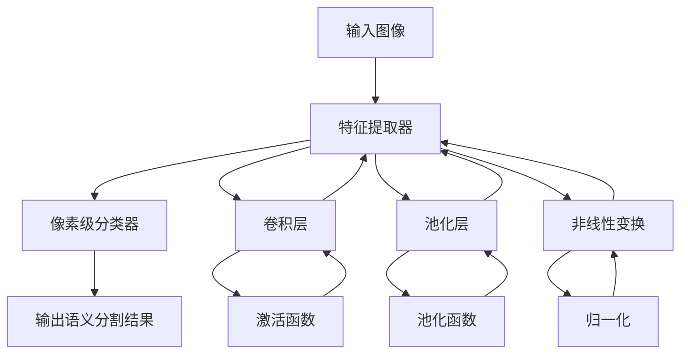
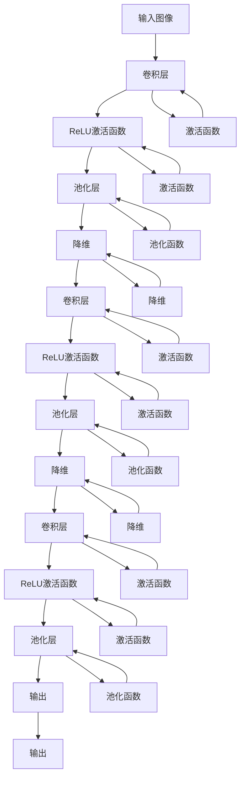
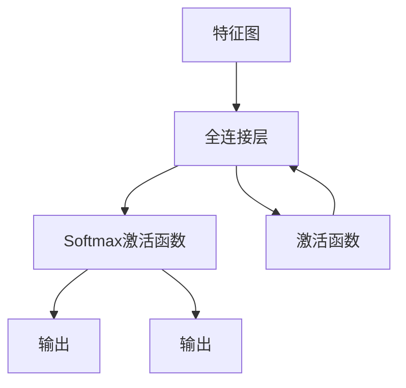
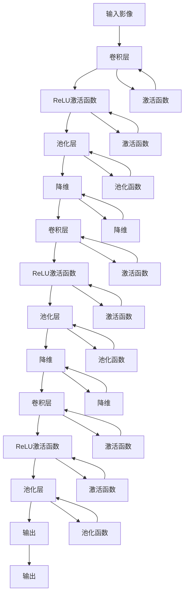

                 

# Semantic Segmentation原理与代码实例讲解

> 关键词：语义分割,深度学习,卷积神经网络,图像处理,边缘检测,区域提取

## 1. 背景介绍

### 1.1 问题由来
语义分割(Semantic Segmentation)是计算机视觉领域的重要任务之一，旨在将图像中的每个像素划分到相应的语义类别中。这一任务在自动驾驶、医疗影像分析、工业检测等多个领域有着广泛的应用。传统方法如基于SLIC、GrabCut等图割算法存在速度慢、精度低等问题，而基于深度学习的方法则通过端到端的训练，能够在更短时间内实现更准确的像素级分类。

语义分割的核心目标是将图像中每个像素映射到一个类别标签。这一过程可以理解为将输入图像中的每个像素进行“赋值”，使其拥有特定的语义含义。而深度学习，特别是卷积神经网络(CNN)，因其在图像处理方面的强大能力，成为语义分割的首选模型。

### 1.2 问题核心关键点
语义分割的挑战在于如何从图像中学习到有效的特征表示，并在像素级别进行准确分类。关键点包括：
1. 设计高效的特征提取器。
2. 优化像素级分类器。
3. 训练过程中避免过拟合。
4. 高效的推理和部署。
5. 结合更多模态数据。

### 1.3 问题研究意义
语义分割作为计算机视觉的核心技术，为自动驾驶、医疗影像分析、工业检测等提供了基础支撑。深度学习在语义分割任务中展现了强大的能力，但仍有诸多问题待解决。本文旨在通过深度学习的方式，详细讲解语义分割的原理与代码实例，为深度学习在图像处理领域的应用提供参考。

## 2. 核心概念与联系

### 2.1 核心概念概述

为更好地理解语义分割，本节将介绍几个关键概念：

- 语义分割(Semantic Segmentation)：将图像中的每个像素分类为预设的语义类别，如人、车、天等。
- 深度学习(Deep Learning)：通过多层神经网络进行端到端训练，从数据中学习特征表示。
- 卷积神经网络(Convolutional Neural Networks, CNN)：专门用于处理图像等二维数据结构的前馈神经网络。
- 特征提取器(Feature Extractor)：用于学习图像特征的神经网络模块，一般通过卷积、池化等操作实现。
- 像素级分类器(Pixel-Level Classifier)：对图像中每个像素进行分类的神经网络层。

语义分割的核心流程可以概括为“提取特征-分类像素”。首先，使用特征提取器从输入图像中提取关键特征，然后通过像素级分类器将每个像素映射到特定类别。这一过程通常由卷积神经网络实现。

### 2.2 核心概念原理和架构的 Mermaid 流程图

以上流程图展示了语义分割的基本架构：输入图像通过特征提取器，输出特征图；特征图再通过像素级分类器，最终得到语义分割结果。其中，特征提取器由卷积层、池化层、非线性变换等构成；像素级分类器通常为全连接层。

## 3. 核心算法原理 & 具体操作步骤
### 3.1 算法原理概述

语义分割的算法原理主要基于深度学习，特别是卷积神经网络。其核心思想是将输入图像作为特征提取器的输入，通过多层卷积和池化操作，提取图像的关键特征，并传递到像素级分类器进行像素分类。

假设输入图像为 $I$，特征提取器为 $F$，像素级分类器为 $C$，则语义分割的流程图可以表示为：

$$
S = F(I) \times C(F(I))
$$

其中 $S$ 表示语义分割结果，$F(I)$ 表示从输入图像 $I$ 提取的特征图，$C(F(I))$ 表示对特征图 $F(I)$ 进行像素级分类后的结果。

### 3.2 算法步骤详解

语义分割的算法步骤主要包括以下几个关键部分：

**Step 1: 特征提取**
- 设计卷积神经网络作为特征提取器。以FCN（Fully Convolutional Network）为例，其网络结构如图：

该网络结构包含多个卷积和池化层，用于提取图像的关键特征，并通过降维操作减少参数量。最后一层卷积层的输出即为特征图 $F(I)$。

**Step 2: 像素级分类**
- 设计像素级分类器。以分类器为全连接层为例，其网络结构如图：

该分类器将特征图 $F(I)$ 作为输入，输出每个像素的类别概率，经过 Softmax 函数后得到每个像素的分类结果 $S$。

**Step 3: 损失函数**
- 设计损失函数。常用的损失函数包括交叉熵损失、像素级别的 Dice 损失等。以 Dice 损失为例，其公式如下：
$$
L_{Dice} = 1 - \frac{2}{|I|} \sum_{i=1}^{|I|} \sum_{j=1}^{|I|} (I_i \cap I_j) / (I_i \cup I_j)
$$
其中 $I_i$ 和 $I_j$ 分别表示像素 $i$ 和 $j$ 的语义标签，$|I|$ 为像素总数。Dice 损失在像素级别上计算相似度，更注重边缘信息的保留。

**Step 4: 优化算法**
- 选择优化算法。常用的优化算法包括随机梯度下降(SGD)、Adam 等。设置合适的学习率、批大小等超参数，开始迭代训练。

**Step 5: 训练和测试**
- 在训练集上训练模型，使用验证集进行超参数调优。
- 在测试集上评估模型性能，如平均精度均值(mAP)、交并比(mIoU)等指标。

### 3.3 算法优缺点

语义分割的优点在于：
1. 端到端训练，能够学习到像素级别的分类能力。
2. 使用深度学习，能够自动提取图像的关键特征。
3. 应用广泛，如自动驾驶、医疗影像分析等。

其缺点在于：
1. 需要大量标注数据。标注数据成本高，且存在数据偏差问题。
2. 计算资源消耗大。大模型往往需要大规模GPU/TPU计算，成本高。
3. 模型可解释性不足。难以解释模型内部的决策逻辑。

尽管存在这些局限性，语义分割在许多实际应用中已经展现出了其巨大的潜力，并成为深度学习的重要分支。

### 3.4 算法应用领域

语义分割在多个领域中有着广泛的应用，例如：

- 自动驾驶：通过语义分割识别道路、车辆、行人等关键对象，为自动驾驶决策提供支持。
- 医疗影像分析：识别病变区域，如肿瘤、病灶等，辅助医生进行诊断和治疗。
- 工业检测：检测生产过程中的缺陷，如裂纹、变形等，提高生产效率和质量。
- 农业遥感：识别农田作物类型，评估农田生长状况，指导农业生产。

此外，语义分割还被用于城市规划、环境监测等多个领域，为人类社会的各个方面提供了强有力的支持。

## 4. 数学模型和公式 & 详细讲解 & 举例说明
### 4.1 数学模型构建

语义分割的数学模型可以概括为如下形式：

- 输入图像 $I$ 为二维矩阵。
- 特征提取器 $F$ 为一系列卷积和池化操作，提取图像的关键特征。
- 像素级分类器 $C$ 为全连接层，对特征图 $F(I)$ 进行像素级分类。

具体来说，假设有 $n$ 个训练样本，每个样本 $x_i$ 包含图像 $I_i$ 和对应的标签 $T_i$。模型的目标是最小化损失函数 $L$，使得模型在测试集上的预测 $S$ 与标签 $T$ 的差异最小化。

$$
\min_{\theta} \frac{1}{N} \sum_{i=1}^N L(S(x_i, \theta), T_i)
$$

其中 $S(x_i, \theta)$ 表示模型对样本 $x_i$ 的预测结果，$L$ 为损失函数，$\theta$ 为模型参数。

### 4.2 公式推导过程

以FCN为例，其卷积层和全连接层的公式如下：

- 卷积层：
$$
y_{i,j} = \sum_{k=1}^{K} F_{i,j,k} x_{k,l,m} \ast w_{k,l,m}
$$
其中 $y_{i,j}$ 表示输出特征图在位置 $(i,j)$ 的特征值，$x_{k,l,m}$ 表示输入图像在位置 $(k,l,m)$ 的像素值，$w_{k,l,m}$ 表示卷积核，$F_{i,j,k}$ 表示特征图的系数。

- 全连接层：
$$
y_{i,j} = \sum_{k=1}^{K} W_{i,j,k} y_{k,l,m}
$$
其中 $y_{i,j}$ 表示输出特征图在位置 $(i,j)$ 的特征值，$y_{k,l,m}$ 表示输入特征图在位置 $(k,l,m)$ 的特征值，$W_{i,j,k}$ 表示权重矩阵。

### 4.3 案例分析与讲解

以医学影像分割为例，介绍如何使用深度学习进行语义分割。

- 数据准备：收集大量医学影像数据，并对每个影像进行像素级别的标注。
- 特征提取：使用卷积神经网络提取影像的关键特征。以 FCN 为例，其网络结构如图：

该网络结构包含多个卷积和池化层，用于提取影像的关键特征，并通过降维操作减少参数量。最后一层卷积层的输出即为特征图 $F(I)$。

- 像素级分类：设计像素级分类器。以分类器为全连接层为例，其网络结构如图：

该分类器将特征图 $F(I)$ 作为输入，输出每个像素的类别概率，经过 Softmax 函数后得到每个像素的分类结果 $S$。

- 损失函数：设计损失函数。以 Dice 损失为例，其公式如下：
$$
L_{Dice} = 1 - \frac{2}{|I|} \sum_{i=1}^{|I|} \sum_{j=1}^{|I|} (I_i \cap I_j) / (I_i \cup I_j)
$$
其中 $I_i$ 和 $I_j$ 分别表示像素 $i$ 和 $j$ 的语义标签，$|I|$ 为像素总数。Dice 损失在像素级别上计算相似度，更注重边缘信息的保留。

- 优化算法：选择优化算法。常用的优化算法包括随机梯度下降(SGD)、Adam 等。设置合适的学习率、批大小等超参数，开始迭代训练。

## 5. 项目实践：代码实例和详细解释说明
### 5.1 开发环境搭建

在进行语义分割的实践前，我们需要准备好开发环境。以下是使用Python进行TensorFlow开发的环境配置流程：

1. 安装Anaconda：从官网下载并安装Anaconda，用于创建独立的Python环境。

2. 创建并激活虚拟环境：
```bash
conda create -n tf-env python=3.8 
conda activate tf-env
```

3. 安装TensorFlow：根据CUDA版本，从官网获取对应的安装命令。例如：
```bash
pip install tensorflow-gpu==2.6
```

4. 安装TensorBoard：
```bash
pip install tensorboard
```

5. 安装skimage：
```bash
pip install scikit-image
```

完成上述步骤后，即可在`tf-env`环境中开始语义分割实践。

### 5.2 源代码详细实现

以下是一个使用TensorFlow进行语义分割的示例代码：

```python
import tensorflow as tf
from tensorflow.keras import layers, models
from sklearn.metrics import jaccard_score

def dice_loss(y_true, y_pred):
    intersection = tf.reduce_sum(y_true * y_pred)
    cardinality = tf.reduce_sum(y_true + y_pred)
    return 1 - (2 * intersection / cardinality)

def unet_model(input_size=(256, 256, 3)):
    inputs = tf.keras.layers.Input(shape=input_size)
    
    # 编码器
    conv1 = tf.keras.layers.Conv2D(64, 3, activation='relu', padding='same')(inputs)
    conv1 = tf.keras.layers.Conv2D(64, 3, activation='relu', padding='same')(conv1)
    pool1 = tf.keras.layers.MaxPooling2D(pool_size=(2, 2))(conv1)
    
    conv2 = tf.keras.layers.Conv2D(128, 3, activation='relu', padding='same')(pool1)
    conv2 = tf.keras.layers.Conv2D(128, 3, activation='relu', padding='same')(conv2)
    pool2 = tf.keras.layers.MaxPooling2D(pool_size=(2, 2))(conv2)
    
    conv3 = tf.keras.layers.Conv2D(256, 3, activation='relu', padding='same')(pool2)
    conv3 = tf.keras.layers.Conv2D(256, 3, activation='relu', padding='same')(conv3)
    pool3 = tf.keras.layers.MaxPooling2D(pool_size=(2, 2))(conv3)
    
    conv4 = tf.keras.layers.Conv2D(512, 3, activation='relu', padding='same')(pool3)
    conv4 = tf.keras.layers.Conv2D(512, 3, activation='relu', padding='same')(conv4)
    pool4 = tf.keras.layers.MaxPooling2D(pool_size=(2, 2))(conv4)
    
    # 解码器
    conv5 = tf.keras.layers.Conv2DTranspose(256, 2, strides=(2, 2), padding='same')(pool4)
    conv5 = tf.keras.layers.concatenate([conv5, conv3], axis=-1)
    conv5 = tf.keras.layers.Conv2D(256, 3, activation='relu', padding='same')(conv5)
    conv5 = tf.keras.layers.Conv2D(256, 3, activation='relu', padding='same')(conv5)
    
    conv6 = tf.keras.layers.Conv2DTranspose(128, 2, strides=(2, 2), padding='same')(conv5)
    conv6 = tf.keras.layers.concatenate([conv6, conv2], axis=-1)
    conv6 = tf.keras.layers.Conv2D(128, 3, activation='relu', padding='same')(conv6)
    conv6 = tf.keras.layers.Conv2D(128, 3, activation='relu', padding='same')(conv6)
    
    conv7 = tf.keras.layers.Conv2DTranspose(64, 2, strides=(2, 2), padding='same')(conv6)
    conv7 = tf.keras.layers.concatenate([conv7, conv1], axis=-1)
    conv7 = tf.keras.layers.Conv2D(64, 3, activation='relu', padding='same')(conv7)
    conv7 = tf.keras.layers.Conv2D(64, 3, activation='relu', padding='same')(conv7)
    
    outputs = tf.keras.layers.Conv2D(1, 1, activation='sigmoid')(conv7)
    
    model = models.Model(inputs=[inputs], outputs=[outputs])
    return model

# 数据准备
train_data = ...
val_data = ...
test_data = ...

# 构建模型
model = unet_model()
model.compile(optimizer=tf.keras.optimizers.Adam(), loss=dice_loss, metrics=['jaccard_score'])

# 训练模型
model.fit(train_data, epochs=50, validation_data=val_data)

# 评估模型
y_pred = model.predict(test_data)
jaccard = jaccard_score(test_data.labels, y_pred)
print(f'Jaccard Index: {jaccard}')
```

### 5.3 代码解读与分析

让我们再详细解读一下关键代码的实现细节：

**unet_model函数**：
- 定义输入层。
- 设计编码器。包含多个卷积层、激活函数、池化层，用于提取输入图像的关键特征。
- 设计解码器。包含多个反卷积层、激活函数、拼接层，用于恢复图像的分辨率，并进行像素级分类。

**dice_loss函数**：
- 实现Dice损失函数，用于衡量预测结果与真实标签之间的相似度。

**数据准备**：
- 使用skimage库读取图像数据，并对其进行归一化和缩放。

**模型训练**：
- 使用Adam优化器，Dice损失函数，Jaccard评分指标，在训练集上进行50轮训练。
- 在验证集上进行模型调优。

**模型评估**：
- 在测试集上使用预测结果与真实标签计算Jaccard指数，评估模型性能。

可以看到，TensorFlow的Keras API使得模型构建和训练过程变得简洁高效。开发者可以使用这些高级API，快速迭代模型结构，进行参数调优和结果评估。

当然，工业级的系统实现还需考虑更多因素，如模型的保存和部署、超参数的自动搜索、更灵活的任务适配层等。但核心的语义分割流程基本与此类似。

## 6. 实际应用场景
### 6.1 智能交通

语义分割在智能交通领域有着广泛的应用，如自动驾驶、交通监控等。通过语义分割，系统能够自动识别道路、车辆、行人等关键对象，为自动驾驶和交通管理提供支持。

例如，在自动驾驶中，语义分割可以用于道路边界检测、行人检测、车辆跟踪等。通过对道路边界和交通信号的准确识别，自动驾驶系统能够做出更安全和合理的驾驶决策。

### 6.2 医学影像分析

语义分割在医学影像分析中也有着重要应用。通过语义分割，系统能够自动识别病变区域，如肿瘤、病灶等，辅助医生进行诊断和治疗。

例如，在CT扫描中，语义分割可以用于识别肺结节、肝脏肿瘤等病变区域。通过对病变区域的精确定位，医生能够更准确地进行诊断和手术规划。

### 6.3 工业检测

语义分割在工业检测中有着广泛应用。通过语义分割，系统能够自动识别生产过程中的缺陷，如裂纹、变形等，提高生产效率和质量。

例如，在制造业中，语义分割可以用于检测产品的缺陷和瑕疵。通过对缺陷区域的精确定位，系统能够自动进行分类和处理，提高产品质量和生产效率。

### 6.4 农业遥感

语义分割在农业遥感中也有着重要应用。通过语义分割，系统能够自动识别农田作物类型，评估农田生长状况，指导农业生产。

例如，在农业遥感中，语义分割可以用于识别农田中的不同作物类型。通过对作物类型的准确识别，农业专家能够更有效地进行农田管理，提高农业生产效率和产量。

## 7. 工具和资源推荐
### 7.1 学习资源推荐

为了帮助开发者系统掌握语义分割的理论基础和实践技巧，这里推荐一些优质的学习资源：

1. 《深度学习》课程：斯坦福大学开设的深度学习课程，有Lecture视频和配套作业，带你入门深度学习的基本概念和经典模型。

2. 《TensorFlow官方文档》：TensorFlow官方文档，提供了丰富的API和示例代码，是上手实践的必备资料。

3. 《ImageNet Classification with Deep Convolutional Neural Networks》：ImageNet分类任务中使用的深度卷积神经网络，提供了丰富的图像处理技术和语义分割的案例分析。

4. 《PyTorch官方文档》：PyTorch官方文档，提供了丰富的API和示例代码，是上手实践的必备资料。

5. 《Semantic Segmentation with Deep Learning》书籍：深度学习在语义分割中的应用，提供了丰富的案例分析和代码实现。

通过对这些资源的学习实践，相信你一定能够快速掌握语义分割的精髓，并用于解决实际的图像处理问题。
###  7.2 开发工具推荐

高效的开发离不开优秀的工具支持。以下是几款用于语义分割开发的常用工具：

1. TensorFlow：基于Python的开源深度学习框架，灵活动态的计算图，适合快速迭代研究。使用Keras API进行模型构建和训练。

2. PyTorch：基于Python的开源深度学习框架，灵活动态的计算图，适合快速迭代研究。使用TorchVision库进行模型构建和训练。

3. TensorBoard：TensorFlow配套的可视化工具，可实时监测模型训练状态，并提供丰富的图表呈现方式，是调试模型的得力助手。

4. Weights & Biases：模型训练的实验跟踪工具，可以记录和可视化模型训练过程中的各项指标，方便对比和调优。与主流深度学习框架无缝集成。

5. Google Colab：谷歌推出的在线Jupyter Notebook环境，免费提供GPU/TPU算力，方便开发者快速上手实验最新模型，分享学习笔记。

合理利用这些工具，可以显著提升语义分割任务的开发效率，加快创新迭代的步伐。

### 7.3 相关论文推荐

语义分割作为计算机视觉的核心技术，在多个领域中都有着重要应用。以下是几篇奠基性的相关论文，推荐阅读：

1. FCN: Fully Convolutional Networks for Semantic Segmentation：提出FCN网络，将全连接层替换为卷积层，实现了像素级分类。

2. U-Net: Convolutional Networks for Biomedical Image Segmentation：提出U-Net网络，用于医学影像分割，具有较强的深度和广度。

3. DeepLab: Semantic Image Segmentation with Deep Convolutional Nets, Atrous Convolution, and Fully Connected CRFs：提出DeepLab网络，使用Atrous卷积和CRF优化像素级分类。

4. Mask R-CNN: Feature Pyramid Networks for Object Detection and Semantic Segmentation：提出Mask R-CNN网络，在图像分割中引入了区域建议网络(RPN)和掩码分支，提高了分割精度。

5. EfficientDet: Scalable and Efficient Object Detection with Compound Scaling：提出EfficientDet网络，在大模型上实现了高效的特征提取和像素级分类。

这些论文代表了语义分割技术的发展脉络，通过学习这些前沿成果，可以帮助研究者把握学科前进方向，激发更多的创新灵感。

## 8. 总结：未来发展趋势与挑战
### 8.1 总结

本文对语义分割的原理与代码实例进行了全面系统的介绍。首先阐述了语义分割的背景和重要性，明确了深度学习在语义分割中的核心地位。其次，从原理到实践，详细讲解了语义分割的数学模型和算法步骤，给出了TensorFlow的代码实现。同时，本文还探讨了语义分割在多个领域的应用场景，展示了其广泛的应用前景。

通过本文的系统梳理，可以看到，深度学习在语义分割中的应用，已经取得了显著的成果，并具备了强大的生命力。未来，伴随深度学习的不断演进，语义分割技术将进一步拓展其应用范围，为计算机视觉领域的创新发展提供强有力的支持。

### 8.2 未来发展趋势

展望未来，语义分割技术将呈现以下几个发展趋势：

1. 模型规模持续增大。随着算力成本的下降和数据规模的扩张，深度学习模型的参数量还将持续增长。超大规模模型将进一步提升语义分割的精度和鲁棒性。

2. 语义分割与其他模态数据结合。除了视觉数据，语义分割还可以结合音频、文本等多模态数据，提高模型的泛化能力和应用范围。

3. 联合训练与预训练。语义分割与其他计算机视觉任务，如目标检测、图像分类等，可以联合训练，提高模型的泛化能力和数据利用率。

4. 生成对抗网络(GANs)在语义分割中的应用。GANs可以用于生成高质量的合成图像，辅助语义分割模型的训练和测试。

5. 模型优化与加速。随着深度学习框架的不断优化，语义分割模型将变得更加高效、轻量，适合于移动端和嵌入式设备。

以上趋势凸显了语义分割技术的广阔前景，相信未来深度学习在语义分割中的应用将更加广泛，为各个领域提供更强大的支持。

### 8.3 面临的挑战

尽管语义分割技术在许多领域中已经取得了显著成果，但仍面临诸多挑战：

1. 计算资源消耗大。大模型往往需要大规模GPU/TPU计算，成本高。如何降低计算资源消耗，提高模型的训练和推理效率，将是重要的研究方向。

2. 数据质量与标注成本高。高质量的标注数据成本高，且存在数据偏差问题。如何降低数据标注成本，提高数据质量，仍是一个重要问题。

3. 模型的可解释性不足。深度学习模型通常被视为"黑盒"，难以解释其内部决策逻辑。如何增强模型的可解释性，提高其透明度，将是未来研究的方向。

4. 模型的泛化能力有待提高。深度学习模型在面对新数据和新场景时，泛化能力有限。如何提高模型的泛化能力，使其在不同的应用场景中都能保持高性能，将是重要的研究方向。

5. 模型的不稳定性。深度学习模型容易过拟合，特别是在数据集较小的情况下。如何提高模型的泛化能力，防止过拟合，将是重要的研究方向。

这些挑战亟需解决，以便深度学习在语义分割中的应用能够进一步拓展，真正实现大规模落地应用。

### 8.4 研究展望

面对语义分割技术面临的挑战，未来的研究需要在以下几个方面寻求新的突破：

1. 轻量级模型的设计。开发更加轻量级、高效的语义分割模型，适合于移动端和嵌入式设备。

2. 数据增强与生成对抗网络。引入数据增强和生成对抗网络，提高模型的泛化能力和数据利用率。

3. 模型融合与跨模态学习。将语义分割与其他计算机视觉任务，如目标检测、图像分类等，进行联合训练，提高模型的泛化能力和数据利用率。

4. 联合优化与预训练。引入预训练和多任务学习，提高模型的泛化能力和可解释性。

5. 知识图谱与符号推理。将符号化的先验知识，如知识图谱、逻辑规则等，与神经网络模型进行巧妙融合，引导语义分割模型学习更准确、合理的语义表示。

6. 强化学习与自适应学习。引入强化学习、自适应学习等技术，提高模型的自我学习能力和泛化能力。

这些研究方向的探索，必将引领语义分割技术迈向更高的台阶，为计算机视觉领域的创新发展提供强有力的支持。

## 9. 附录：常见问题与解答

**Q1：语义分割是否只能应用于二维图像？**

A: 语义分割本质上是对像素进行分类，因此可以应用于任何二维数据结构。除了图像，语义分割还可以应用于医学影像、遥感图像等。

**Q2：在训练语义分割模型时，如何处理边界模糊的问题？**

A: 边界模糊是语义分割中常见的问题。可以通过多种方法进行处理，如使用Dice损失函数，引入边界平滑层等。同时，可以使用更精细的卷积核和池化操作，提高模型对边界信息的识别能力。

**Q3：在训练语义分割模型时，如何防止过拟合？**

A: 防止过拟合的方法包括数据增强、正则化、Dropout等。数据增强可以通过旋转、翻转、缩放等方式扩充训练集。正则化可以通过L2正则、Dropout等方式避免过拟合。Dropout可以随机丢弃部分神经元，提高模型的泛化能力。

**Q4：在训练语义分割模型时，如何选择优化器和学习率？**

A: 优化器常用的有SGD、Adam等。学习率的选择需要根据具体情况进行调整，一般建议从0.001开始调参，逐步减小学习率，直至收敛。同时，可以通过设置学习率衰减、动量等超参数，进一步优化模型的训练效果。

**Q5：在训练语义分割模型时，如何选择损失函数？**

A: 常用的损失函数有交叉熵损失、Dice损失、IoU损失等。选择损失函数需要根据具体情况进行调整，如医学影像分割中，Dice损失能够更好地保留边缘信息。IoU损失能够综合考虑预测结果与真实标签之间的相似度和面积。

通过这些问题的解答，相信你能够更全面地理解语义分割技术，并更好地应用于实际问题中。

---

作者：禅与计算机程序设计艺术 / Zen and the Art of Computer Programming

